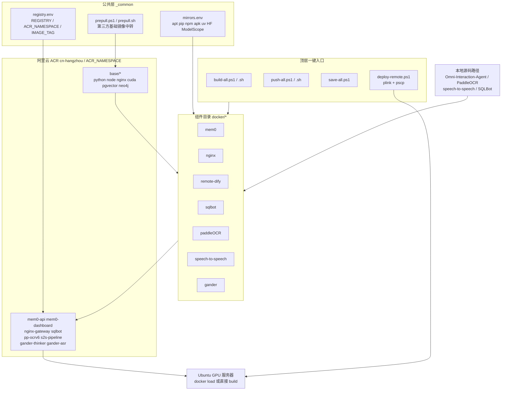

## 产品概述
把 `d:\projects\MinWorkBuddy\docker` 下 7 个组件的构建与部署资产，统一整理成一套"国内源优先 + 阿里云容器镜像服务（个人版）托管"的可复现方案。最终形态是：一份共用的国内源与仓库配置、一套基础镜像中转机制、7 个组件各自成套的 Dockerfile / compose / 构建脚本 / 推送脚本 / 环境变量模板 / 说明文档，以及顶层一键入口脚本。

## 核心功能
1. **公共层**：集中定义阿里云仓库地址（cn-hangzhou）、命名空间、版本标签，以及 apt / pip / npm / apk / uv / HuggingFace / ModelScope 的国内源清单，所有组件共用同一份配置，改一处生效。
2. **基础镜像中转**：将 python、node、nginx、pgvector、neo4j、nvidia/cuda、langgenius/* 、dataease/* 等第三方基础镜像统一拉取、改标签后推送到个人镜像仓库，各 Dockerfile 只依赖自己的仓库，彻底摆脱构建时对海外 registry 的依赖。
3. **已有四组件改造**：mem0（api + dashboard）、nginx、remote-dify、sqlbot 的基础镜像换源、依赖源注入、硬编码路径与明文密钥外移。
4. **空目录三组件补齐**：gander（本地 ASR + 远端推理两个变体）、paddleOCR（PP-OCRv6 CPU 版，可选 PP-StructureV3 / VL 变体）、speech-to-speech（pipeline 容器）从零生成 Dockerfile、编排与构建脚本，并修复已知的 Silero VAD 缺失、torch CUDA 版本不匹配、TTS 后端降级、分词资源缺失等运行时缺陷。
5. **双端脚本**：每个组件同时提供 Windows PowerShell 版本（本地构建 + 导出离线包 + 上传服务器）与 Linux Bash 版本（服务器上直接构建），行为与参数保持一致。
6. **安全与合规**：脚本不存放任何凭据，依赖宿主机已完成 registry 登录；已提交到仓库的明文数据库密码、API Key 迁移到 `.env.example` 占位，并在文档中给出轮换建议。
7. **一键编排**：顶层 `build-all` / `push-all` / `save-all` / `deploy-remote` 支持按组件多选、跳过已存在镜像、强制重建。

## 开放待确认项
- 阿里云命名空间字符串本次未确认，方案统一使用变量 `ACR_NAMESPACE`（默认占位 `mwb`），集中写在 `docker/registry.env`，使用者只需改这一处。


## 技术栈选型
- **容器编排**：Docker Engine + Docker Compose v2（已在本项目根 `docker-compose.infra.yml` 与 `docker/mem0/docker-compose.yaml` 中广泛使用，保持一致）。
- **构建引擎**：BuildKit（`--mount=type=cache` 复用 pip / uv / npm 缓存，显著缩短二次构建时间）。
- **脚本双端**：PowerShell 7（Windows Docker Desktop 侧）与 Bash（Ubuntu 服务器侧），参数命名与执行顺序一一对应。
- **镜像仓库**：阿里云容器镜像服务个人版 `registry.cn-hangzhou.aliyuncs.com/<ACR_NAMESPACE>`，公开读仓库用于拉取，副产品 количеств removing 私有写推送用宿主机登录凭据。
- **国内源矩阵**（统一固化）：
  - apt：`mirrors.aliyun.com`（Debian bookworm 新版 `/etc/apt/sources.list.d/*.sources` 需同时处理 `URIs:` 行）
  - pip：`https://mirrors.aliyun.com/pypi/simple`（主）+ `https://repo.huaweicloud.com/repository/pypi/simple`（大 wheel 实测最快）+ 清华（备）
  - npm：`https://registry.npmmirror.com`
  - apk（alpine）：`mirrors.aliyun.com/alpine`
  - uv：`UV_DEFAULT_INDEX` + `UV_HTTP_TIMEOUT=180`
  - HuggingFace：`HF_ENDPOINT=https://hf-mirror.com`
  - Paddle 模型：`PADDLE_PDX_MODEL_SOURCE=modelscope`

## 实现思路
采用 **"公共层 + 基础镜像中转 + 组件自治"** 三层策略：

1. **公共层**：`docker/registry.env`（仓库地址、命名空间、版本）与 `docker/_common/mirrors.env`（国内源清单）作为唯一配置源，PowerShell 与 Bash 各自实现同一套读取函数。
2. **基础镜像中转**：`_common/prepull-images.txt` 列出全部第三方基础镜像，`prepull.ps1 / prepull.sh` 先从可达的国内 proxy registry（如 `docker.1ms.run`）拉取，`docker tag` 后推送到个人仓库 `base/*`。这一步解决了 nvidia/cuda 类镜像在国内经 daemon.json 加速器会卡死的实测问题，也让后端 Docker 机无需配置加速器。
3. **组件自治**：7 个子目录各自成套，`FROM ${BASE_REGISTRY}/...` 统一指向中转仓库；每个 Dockerfile 注入国内源环境变量；构建脚本负责 `--build-arg` / `--platform` / 缓存目录挂载；推送脚本只做 `tag` + `push`。

关键取舍：**不设置自己的 PyPI / npm 私服**，直接用成熟公共镜像源降低维护成本；**保留离线 wheel 机制**给 paddlepaddle 这类超大 wheel（华为云/清华回源速率差异已被实测注释记录），避免构建期长时间抖动；**GPU 相关组件（gander / speech-to-speech）在构建期不下载模型**，改为运行时挂载或首次请求懒加载，避免镜像膨胀到数十 GB。

## 架构设计



## 目录结构

本次改造以"新增 + 重写"为主，涉及全部 7 个子目录与顶层：

```
docker/
├── README.md                          # [MODIFY] 当前为 0 字节。总入口文档：架构图、前置条件、
│                                      #          阿里云仓库登录说明、一键命令、组件索引表、故障速查。
├── registry.env                       # [NEW] 唯一仓库配置源。REGISTRY_HOST=registry.cn-hangzhou.aliyuncs.com、
│                                      #       ACR_NAMESPACE=<待确认，默认 mwb>、IMAGE_TAG=1.0.0、
│                                      #       BASE_REGISTRY=${REGISTRY_HOST}/${ACR_NAMESPACE}/base。
│                                      #       LF 编码、无 BOM，被 .ps1 与 .sh 共同读取。
├── .gitignore                         # [NEW] 忽略 *.env（除 .env.example）、*.tar、build_output/、cache/、wheels/*.whl。
├── _common/
│   ├── mirrors.env                    # [NEW] 国内源清单：APT_MIRROR、PIP_INDEX_URL、PIP_EXTRA_INDEX_URL、
│   │                                  #       NPM_REGISTRY、APK_MIRROR、UV_DEFAULT_INDEX、UV_HTTP_TIMEOUT、
│   │                                  #       HF_ENDPOINT、PADDLE_PDX_MODEL_SOURCE。
│   ├── prepull-images.txt             # [NEW] 基础镜像白名单（源已有标签 → base/* 目标名），含
│   │                                  #       nvidia/cuda:12.8.1-cudnn-runtime-ubuntu24.04、nvidia/cuda:12.4.1-cudnn-devel-ubuntu22.04、
│   │                                  #       python:3.12-slim、python:3.10-slim、node:20-alpine、nginx:alpine、
│   │                                  #       dataease/sqlbot-base、dataease/sqlbot-python-pg。
│   ├── prepull.ps1 / prepull.sh       # [NEW] 读 registry.env + 白名单，经国内 proxy registry 拉取后 tag → push 到 base/*，
│   │                                  #       幂等：目标已存在则跳过（-Force 强制）。nvidia/cuda 采用"预拉后改标签"策略。
│   └── README.md                      # [NEW] 源清单与中转机制说明、如何新增基础镜像。
├── build-all.ps1 / build-all.sh       # [NEW] 顶层编排：-Component 多选（支持 all）、-Force、按依赖顺序
│                                      #       先确保 base 层就绪再构建组件；输出统一摘要表。
├── push-all.ps1 / push-all.sh         # [NEW] 批量 tag + push；前置校验 docker login 状态，缺失即报错退出（不存凭据）。
├── save-all.ps1                       # [NEW] docker save 导出离线 tar 到 dist/ 目录，按组件名 + 版本命名。
├── deploy-remote.ps1                  # [NEW] pscp 上传 tar → plink 远端 docker load / compose up；
│                                      #       参数 -Host -User -Key；内置 80 端口占用提醒（GPUStack 已占用）。
├── mem0/
│   ├── api/Dockerfile                 # [MODIFY] FROM 指向 base/python:3.12-slim；pip 源改读统一变量；
│   │                                  #          去掉 CMD 的 --reload（生产镜像不适用）；补 HEALTHCHECK。
│   ├── dashboard/Dockerfile           # [MODIFY] deps 阶段注入 npm registry；apk 换源；保留 CRLF sed 修复；
│   │                                  #          RUN addgroup/adduser 的 alpine 语法保持；补 HEALTHCHECK。
│   ├── docker-compose.yml             # [MODIFY] 剔除硬编码 Windows 绝对路径，改为环境变量 SRC_MEM0 注入 build context；
│   │                                  #          网络统一 mwb-infra-network；compose 文件名统一 yml。
│   ├── build.ps1 / build.sh           # [MODIFY/NEW] 复用现有 build.ps1 的 4 步校验；新增 --platform 与版本 tag 参数。
│   ├── push.ps1 / push.sh             # [NEW] tag → push api 与 dashboard 两个镜像。
│   ├── .env.example                   # [NEW] 占位导出 POSTGRES_* / NEO4J_* / JWT_SECRET / AUTH_DISABLED；明文 .env 由用户决定是否保留。
│   └── README.md                      # [NEW] 端口、依赖库初始化（vector 扩展示例）、已知约束（pgvector 维度、百炼嵌入）。
├── nginx/
│   ├── Dockerfile                     # [NEW] FROM base/nginx:alpine，装配 conf.d；为 marketplace 缓存目录建卷。
│   ├── dify-gateway.conf              # [MODIFY] 代理目标地址改为环境变量可注入的下游服务名。
│   ├── marketplace-proxy.conf         # [MODIFY] 保持缓存策略，补充 resolver 与 DNS 容错、超时收敛。
│   ├── remote/gateway.conf            # [MODIFY] 端口参数化，避免写死 3000 与远程主机冲突。
│   ├── docker-compose.yml             # [NEW] 网关单独编排（本地 3000/8888）。
│   ├── build.ps1 / build.sh / push.ps1 / push.sh   # [NEW]
│   └── README.md                      # [NEW] 与 docker/nginx 现有两份 conf 的关系说明（避免再次重复漂移）。
├── remote-dify/
│   ├── docker-compose.yaml            # [MODIFY] 镜像全部换成个人仓库地址（langgenius 系列已中转）；
│   │                                  #          删除硬编码的 DB/Redis 地址与口令，全部 ${VAR} 引用；
│   │                                  #          新增 gateway 端口与 marketplace 代理挂载；depends_on 加健康检查条件。
│   ├── nginx/gateway.conf             # [MODIFY] 与 docker/nginx 保持单一事实源（软链接或构建期复制，避免两份漂移）。
│   ├── nginx/marketplace-proxy.conf   # [MODIFY] 同上。
│   ├── .env.example                   # [NEW] DB_HOST/DB_PASSWORD/REDIS_*/SECRET_KEY/CONSOLE_URL 等占位。
│   ├── pull-mirror.ps1 / .sh          # [NEW] 仅做第三方镜像中转（dify-api/web/sandbox/plugin-daemon），无本地源码构建。
│   ├── push.ps1 / push.sh             # [NEW]
│   └── README.md                      # [NEW] 部署步骤、端口表、密钥轮换提示。
├── sqlbot/
│   ├── Dockerfile                     # [NEW] 以 SQLBot deploy-offline/Dockerfile.offline 为基线纳入本仓库：
│   │                                  #         基础镜像转发的 network:none、ui-builder 注入 VITE_SECRET_KEY（缺失即构建失败保护保留）、
│   │                                  #         uv 走 aliyun 索引、torch CPU 国内源或离线 wheel、mcp<2.0.0 降级、g2-ssr 用 npmmirror。
│   ├── patches/serve_ui.py            # [MOVE] 现有 sqlbot/serve_ui.py 原样迁入，由 compose 挂载覆盖。
│   ├── patches/start-external-db.sh   # [MOVE] 现有 sqlbot/start-external-db.sh 原样迁入（注意 LF + 可执行位）。
│   ├── docker-compose.yml             # [NEW] 独立部署形态（外部 PG/Redis），与根 docker-compose.infra.yml 的挂载路径保持一致。
│   ├── build.ps1 / build.sh           # [NEW] 强制要求传入 -SecretKey 参数，未传即报错，避免出现"能跑但登不上"的镜像。
│   ├── push.ps1 / push.sh             # [NEW]
│   ├── .env.example                   # [NEW] SECRET_KEY / POSTGRES_* / CACHE_REDIS_URL / SERVER_IMAGE_HOST 等占位。
│   └── README.md                      # [NEW] 构建参数说明、UI/API 同源机制、登录密钥一致性说明。
├── paddleOCR/
│   ├── Dockerfile.ppocrv6             # [NEW] 以 PaddleOCR docker/pp-ocrv6/Dockerfile 为模板：
│   │                                  #         FROM 改为 base/python:3.10-slim；pip 源统一 aliyun（主）/华为云（备）；
│   │                                  #         保留 paddlepaddle 离线 wheel 安装与 PADDLEX_HOME 预热（PaddleOCR() 建模句 Commons）。
│   ├── Dockerfile.structurev3         # [NEW][可选] PP-StructureV3 变体，保持与 ppocrv6 相同的源策略与分层顺序。
│   ├── app.py                         # [NEW] OCR HTTP 服务入口（健康检查 + 识别接口），风格沿用上游 app.py。
│   ├── wheels/.gitkeep                # [NEW] 大 wheel 目录（真实 wheel 不入 git，README 给出获取方式）。
│   ├── docker-compose.yml             # [NEW] CPU 推理 + nginx 鉴权网关（X-API-Key），模型缓存卷挂载。
│   ├── build.ps1 / build.sh / push.ps1 / push.sh   # [NEW] 支持 -Component ppocrv6|structurev3，wheel 缺失时先自动下载再构建。
│   └── README.md                      # [NEW] 端点说明、模型预热机制、wheel 离线化原因与速率实测数据。
├── speech-to-speech/
│   ├── Dockerfile                     # [NEW] 基于上游 Dockerfile，改造点：
│   │                                  #         ① FROM 转发的 network 基础 cuda:12.8.1 镜像；
│   │                                  #         ② apt 换源 + 安装 sox（消除音频后处理告警）；
│   │                                  #         ③ uv 索引指向阿里云 + UV_HTTP_TIMEOUT；
│   │                                  #         ④ torch/torchaudio 锁定 cu128 与宿主驱动匹配；
│   │                                  #         ⑤ 构建期把 snakers4/silero-vad 仓库落盘到 /opt/silero-vad；
│   │                                  #         ⑥ 构建期预下载 nltk punkt / punkt_tab / tagger，失败不中断。
│   ├── patches/fix_nltk_punkt.patch   # [NEW] 为句子分词增加正则兜底（缺 punkt 时不触发降级文案）。
│   ├── patches/qwen3_tts_compat.patch # [NEW] MimiConfig 缺失 rope_theta 的兼容补丁（getattr 默认值）。
│   ├── docker-compose.yml             # [NEW] pipeline + 可选 llama.cpp（镜像中转地址），GPU 预留。
│   ├── docker-compose.gpustack.yml    # [MODIFY] 引用本目录 Dockerfile，LLM 走 GPUStack OpenAI 兼容接口。
│   ├── build.ps1 / build.sh / push.ps1 / push.sh   # [NEW] 支持 -ApplyPatches 开关，把补丁以 COPY + RUN patch 形式落到镜像。
│   ├── .env.example                   # [NEW] GPUSTACK_BASE_URL/MODEL/API_KEY、STT/TTS 后端与设备、端口、GPU ID。
│   └── README.md                      # [NEW] 8615/8765 端口、健康检查命令、VAD/TTS 验证步骤与已知告警说明。
└── gander/
    ├── Dockerfile.remote              # [NEW] 基于 Omni-Interaction-Agent/deploy/Dockerfile.remote，换基础镜像与源。
    ├── Dockerfile.local               # [NEW] 基于 deploy/Dockerfile.local：apt 换源；torch 索引改用国内可用源或离线 wheel；
    │                                  #        nginx 配置从内联 heredoc 改为独立 conf 文件（更易维护）；解耦 CRLF。
    ├── nginx/default.conf.tmpl        # [NEW] 代理远端服务与本地 ASR 健康检查的模板。
    ├── entrypoint_local.sh            # [NEW] 迁入并 LF 化，保留原逻辑。
    ├── docker-compose.yml             # [NEW] GPU 模式编排（context 指向源码路径，由环境变量注入）。
    ├── docker-compose.cpu.yml         # [NEW] CPU 覆盖模式。
    ├── configs/                       # [NEW] 从上游 deploy/configs 迁入的服务配置模板。
    ├── build.ps1 / build.sh / push.ps1 / push.sh   # [NEW] -Variant local|remote|all。
    ├── .env.example                   # [NEW] REMOTE_THINKER_HOST、ASR_MODEL_DIR/PATH/DEVICE/COMPUTE_TYPE、GPU ID、模型目录。
    └── README.md                      # [NEW] 明确标注当前远程 LLM 适配层尚未实现、端到端能力边界。
```

## 实现要点（防返工）

- **依赖顺序**：`prepull` 必须先于任何组件构建；`build-all` 内部要做该依赖的前置检查，缺失 base 镜像时给出可操作的错误提示而非让 Docker 去拉海外源。
- **性能**：pip / uv / npm 全部启用 BuildKit 缓存挂载（`--mount=type=cache`）；paddle 这类超慢依赖保留离线 wheel；不要在构建期执行模型下载（除 PaddleOCR 的必须预热单例），改为卷挂载，避免每次代码微调都触发数十 GB 重传。
- **幂等与可重入**：构建脚本统一支持"镜像已存在则跳过"与 `-Force` 覆盖；`docker images` 检查要精确到 digest 而非仅 tag，避免本地脏 tag 误判。
- **安全**：脚本严禁出现明文口令，`docker login` 由使用者在宿主机完成；已在仓库中的明文口令必须在 README 明确提示轮换，但不在本次改动中删除历史已提交文件，改动范围可控。
- **编码与换行**：所有 `.sh` 明确 LF 且带可执行位；Dockerfile 中对 COPY 进来的脚本统一加 `sed -i 's/\r$//'`，防止 Windows checkout 导致 `exec format error`。
- **远程执行**：`deploy-remote.ps1` 中涉及远端 shell 的片段要避免 PowerShell 变量提前展开（`$` 转义），并把长命令拆小以避免输出截断；远端统一避开已被占用的 80 端口。
- **向后兼容**：与根 `docker-compose.infra.yml` 的挂载关系（sqlbot 的 start.sh / serve_ui.py 覆盖）保持路径不变，文件仅做目录内迁移时同步更新两处引用。

## 关键约定（脚本接口）

各组件脚本遵循统一契约，便于顶层编排调用：

- `build.{ps1,sh} -Component <name> [-Force] [-NoCache] [-Tag <tag>]`，退出码非 0 即失败；Windows 版额外接受 `-SourceRoot <path>` 指定本地源码 checkout。
- `push.{ps1,sh} [-Tag <tag>] [-DryRun]`：仅 tag + push，先探测登录态。
- 所有组件共享环境变量：`REGISTRY_HOST`、`ACR_NAMESPACE`、`IMAGE_TAG`、`BASE_REGISTRY`，来源于 `docker/registry.env`。


## Agent Extensions
### SubAgent
- **code-explorer**
  - 用途：核对四个上游源码 checkout（`D:\projects\Omni-Interaction-Agent`、`D:\projects\github\PaddleOCR`、`D:\work\speech-to-speech`、`D:\work\chat-bi\SQLBot`）中尚未读取的文件（如 gander `deploy/configs/*`、SQLBot `deploy-offline/build-pack.ps1`、speech-to-speech `src/speech_to_speech/VAD/vad_handler.py` 与 `LLM/utils.py`），确认补丁落点与构建上下文的真实文件清单。
  - 预期产出：准确的补丁目标行/file 清单与需要 COPY 进镜像的文件路径，避免 Dockerfile 中路径写错导致构建失败。
