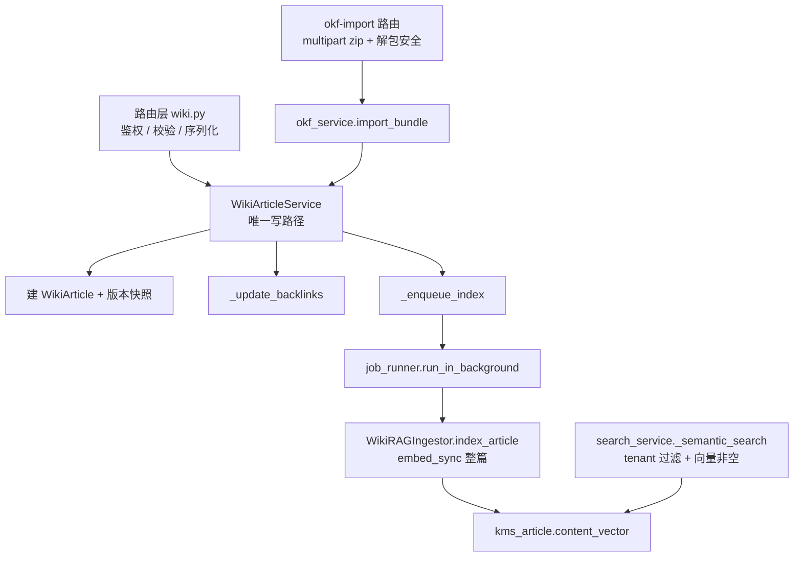

## 产品概述

依据《LLM Wiki 功能盘点、处理链路与 OKF v0.2 差距分析》文档，对 MinWorkBuddy 的 LLM Wiki（type=1 知识库）做一次**完整对齐与缺陷修复**，使其功能完整、行为正确、无遗留缺陷。

## 核心范围

1. **修复 6 个阻断级实现缺陷**

- 导入 / 新建 / 编辑三条入口都不触发向量化，导致语义检索对全部文章返回空集；
- 存量文章无法通过任何入口重建索引；
- OKF 导入丢弃 6 个 frontmatter 字段（type / resource / sources / generated / verified / stale_after），导出再导入内容不保真；
- 导入文章不属于任何租户，可被跨租户检索到；
- slug 冲突处理失效，且会静默覆盖其它知识库的文章；
- 溯源条目缺少 footnote 关联键，逐条归因无法成立。

2. **打通 Bundle 往返**：导出物为 zip，导入改为服务端接收 zip 并解包（含解包安全限制），使"导出即可导回"成立。

3. **对齐 OKF v0.2 规范（共 18 项差距）**：链接双向重写、actor 信任分层、verified / stale_after 可写入、时间戳时区正确、断链检测与报告、导入报告分项、references/ 目录、正文标题约定检查、导入补版本快照与反向链接。

4. **补齐前端缺失能力**：排序、批量操作、列表页删除、每页条数切换、搜索与分页同步、检索测试台按知识库收敛、清理死代码。

5. **验收方式**：每项修复配至少一个 pytest 用例，后端全量测试不回退；前端构建通过。

第 18 项（Attested Computation）按设计文档已明确推迟，本次不做。

## 技术栈

- 后端：Python 3.12 + FastAPI + SQLAlchemy 2.0 + Pydantic v2 + MySQL 8 / pgvector
- 前端：Vue 3 + TypeScript + Vite + antd + 四语 i18n
- 测试：pytest（monkeypatch / 自建 fake client，不使用 respx）
- 建表：无 alembic，走 ORM `create_all` + `startup_migrations.py` 幂等脚本

## 实现方案

### 总体策略

**写路径收敛**：把 `wiki.py` 的内联 `create_article` / `update_article` 删除，路由层只做鉴权、参数校验与序列化，统一调用 `WikiArticleService`（其 `create` / `update` 目前是死代码）。这样向量化、版本快照、反向链接只有一处实现，不会再出现"内联路径漏掉索引"。OKF 导入同样复用该 service，保证字段往返与索引触发一致。

**导入内核重写**：`okf_service.import_bundle` 从"只写 4 个字段"改为"frontmatter 全字段往返"，并把 slug 查询作用域收敛到 `tenant_id + knowledge_id`，跨库冲突走"加 `-2` 后缀新建 + 计入 warnings"，禁止覆盖他人文章。

**Bundle 往返**：`POST /knowledges/{id}/okf-import` 改为接收 `multipart/form-data` 的 zip，服务端解包并做安全限制，解析留在服务端，浏览器不引入 zip 依赖，与知识统一设计 §9.4 端点契约一致。

### 系统架构（写路径）



### 关键设计决策

| 决策 | 选择 | 理由 |
| --- | --- | --- |
| 向量化打通 | 删除内联，统一走 `WikiArticleService` | 消掉两套重复实现，保证写路径唯一；service 的 `create` / `update` 现为死代码，正好启用 |
| Bundle 往返 | 后端收 multipart zip | 服务端解包可统一做安全限制；浏览器不引入 jszip；符合 §9.4 端点契约 |
| 索引触发 | 复用 `job_runner.run_in_background` | 与既有后台任务约定一致，不阻塞主写链路，失败仅降级记日志 |
| slug 冲突 | 作用域收敛到 tenant + knowledge，`-2` 后缀新建 | 杜绝跨库静默覆盖，且让原本永不触发的 `-2` 逻辑真正生效 |
| 宽容消费 | 缺字段 / 未知 type / 断链一律退化并计入 warnings，绝不拒绝 | OKF §11.3 硬要求 |


## 实施要点（防回归）

- **无 alembic**：如需加列或索引，改 ORM 后在 `startup_migrations.py` 补幂等脚本；新增 Model 必须在 `app/db/models/__init__.py` import 并加进 `__all__`。
- **测试不得真打 embedding**：向量化相关断言一律 monkeypatch `WikiRAGIngestor.index_article` 或 `get_embedding_client`。
- **zip 解包安全**：限制条目总数、单文件体积与解压后总体积；拒绝 `../`、绝对路径与符号链接；超限返回明确错误而非静默截断。
- **租户隔离**：所有新增查询必须带 `tenant_id`；`search_service._apply_filters` 补 tenant 条件。
- **基线**：全量此前 629 passed / 4 failed（4 个恒为 `tests/integration/test_api_context.py` 的 ai_context 鉴权遗留，非本次引入）；`tests/kb` + `tests/unit` 为 372 passed / 1 skipped。验收只能"只增不减"。
- **禁止触碰**搁置中的 kev × AgentScope 设计文档与 kev 相关代码。
- 前端门禁用 `npm run build`（用输出过滤只看本次改动路径）；`npm run lint` 实为 eslint 且全仓 380 个 Parsing error，工具链本身坏了，**不得作为门禁**。

## 目录结构

```
backend/app/
├── services/wiki/
│   ├── okf_service.py          # [MODIFY] 导入内核重写：字段全量往返、tenant 写入、slug 作用域与 -2 后缀、
│   │                           #          版本快照 + backlinks、断链检测、报告分项、references/ 生成、
│   │                           #          actor 分层、generated.at 统一 UTC、链接双向重写
│   ├── article_service.py      # [MODIFY] create/update 成为唯一写路径：补 okf 字段写入、_enqueue_index、
│   │                           #          版本快照与 backlinks（与内联行为对齐后再删内联）
│   ├── rag_ingestor.py         # [MODIFY] reindex_all 支持按 tenant/knowledge 过滤与进度回调
│   ├── search_service.py       # [MODIFY] _apply_filters 补 tenant_id 过滤
│   └── version_service.py      # [MODIFY] 确认回滚后仍触发重建索引
├── routers/wiki/
│   └── wiki.py                 # [MODIFY] 删除内联 create/update 改调 service；okf-import 改 multipart zip；
│                               #          DocSourceItem 补 id/usage_count；Create/UpdateRequest 补 verified/stale_after；
│                               #          新增 reindex 端点
├── models/wiki/wiki_article.py # [MODIFY] 按需（columns 已齐，主要核对约束与索引）
└── db/startup_migrations.py    # [MODIFY] 按需补幂等索引/迁移脚本

backend/tests/unit/
├── test_okf_service.py         # [MODIFY] 扩：import_bundle 的 DB 持久化往返、tenant、slug 作用域、
│                               #          断链报告、zip 解包安全、链接重写
├── test_wiki_vectorize.py      # [NEW] create/update/import 三条入口均触发 _enqueue_index；reindex 端点
└── test_okf_import_api.py      # [NEW] multipart zip 导入端到端 + zip bomb 防护

frontend/src/
├── views/kms/wiki/
│   ├── index.vue               # [MODIFY] 排序、批量操作、列表删除、page-size 切换、搜索与分页同步、
│   │                           #          OKF 导入改为上传 zip、导入报告分项展示、stale 标记
│   ├── RagTest.vue             # [MODIFY] 检索与问答传 knowledge_id
│   ├── ArticleEdit.vue         # [MODIFY] 补 verified / stale_after 编辑入口
│   └── components/SearchBar.vue# [DELETE] 全仓无引用的孤儿组件
├── api/kb.ts                   # [MODIFY] importOkfBundle 改为 FormData 上传 zip
├── api/wiki.ts                 # [MODIFY] 列表参数（sort / page_size）、批量删除接口
└── i18n/locales/{zh-CN,zh-TW,en-US,ja-JP}.ts  # [MODIFY] 新增操作项文案四语
```