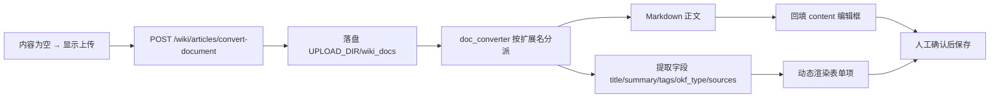

## 产品概述
在 Wiki 文章的「新建 / 编辑」界面中，当文章内容缺失（正文为空）时提供文档上传入口，支持 PDF、Word、TXT、Markdown、PPT、Excel 等格式；上传后由后端把非 Markdown 文档自动转换为 Markdown，并按 `kms_article` 表定义从文档中提取字段，在表单中**动态**补出对应输入项，同时在文章列表里适当展示这些字段。

## 核心功能
1. **上传入口按条件出现**：`content` 为空（或仅空白）时才显示上传面板；已有正文时不显示，避免覆盖。
2. **多格式转 Markdown**：`.pdf / .docx / .txt / .md / .markdown / .pptx / .xlsx / .xls`，转换后回填到正文编辑框。
3. **字段自动提取并映射**（基础 + OKF 合规层）：
   - 基础：`title`、`summary`、`tags`
   - OKF：`resource`（源文件 URI）、`sources`（`[{resource, title, author, last_modified}]`）、`okf_type`（concept/howto/reference/decision/metric 推断）
4. **动态字段渲染**：上传后按「实际提取到的字段」动态生成表单项（文本/多行/下拉/标签/日期），可人工修改后再保存；未提取到的字段不显示。
5. **列表补充展示**：文章列表项在现有标题/摘要/标签基础上，补充 `okf_type` 徽标与来源数等信息，不挤占现有布局。
6. **源文件落盘溯源**：上传文件持久化到 `settings.UPLOAD_DIR/wiki_docs`，路径/URI 写入 `kms_article.resource`。

## 边界与约束
- 仅使用 `kms_article` 表**已有列**，不新增表/列/迁移。
- 不改动左栏类别树与文章过滤逻辑。
- 不支持的格式、超限文件给出明确的中文错误提示，不静默失败。
- 转换结果可人工编辑后再保存，不做自动写库。


## 技术栈
- **后端**：沿用现有 FastAPI + SQLAlchemy；解析复用 `backend/requirements.txt` 中**已有**依赖 `python-docx==1.1.0`、`pdfplumber>=0.10.0`、`openpyxl==3.1.2`、`python-pptx>=0.6.23`，**不新增依赖**（无 markitdown，需自行实现转换）。
- **前端**：沿用 Vue 3 + TypeScript + ant-design-vue；上传用 `a-upload`（`customRequest`），表单沿用现有 `a-form` / `a-card` 模式。
- **存储**：`settings.UPLOAD_DIR / "wiki_docs"`（沿用 `app/routers/kb/kb.py` 中 `upload_asset` 落盘到 `UPLOAD_DIR/"kb_assets"` 的既有风格）。

## 实现方案
新增一个「文档转换服务」按扩展名分派解析器，输出 Markdown 与提取字段；新增一个上传转换接口负责接收文件、落盘、调用转换并返回结果；前端在两处表单复用同一套「上传面板 + 动态字段」组件。



## 关键实现要点
- **转换器分派**：
  - `.md/.markdown/.txt`：按 UTF-8 解码（失败回退 GBK）后直接作为正文；`.txt` 保留段落换行。
  - `.docx`：`python-docx` 按 `paragraph.style.name` 中 Heading 级别映射为 `#`..`######`，表格转 Markdown 表格。
  - `.pdf`：`pdfplumber` 逐页 `extract_text()`，页间用 `---` 分隔；设最大页数上限防超大文件。
  - `.pptx`：`python-pptx` 逐页输出 `## 第 N 页` + 形状文本/备注。
  - `.xlsx/.xls`：复用 `app/services/kb/rag/content_service.py::parse_table_bytes` 的思路（openpyxl `read_only=True, data_only=True`）转 Markdown 表格；设最大行数上限。
- **字段提取优先级**：
  - `title`：文档核心属性 title → 正文首个 H1 → 文件名（去扩展名）。
  - `summary`：首个非标题、非表格段落，截断到列上限 1000 字符。
  - `tags`：文档 keywords 属性 → 文件名分词 → 正文高频词（取前 N 个，去重）。
  - `okf_type`：关键词规则（手册/指南/教程/步骤→howto；规范/API/接口/参考→reference；决策/ADR/纪要→decision；指标/报表/统计→metric；缺省 concept）。
  - `sources`：`[{resource: 落盘URI, title, author, last_modified}]`，author/last_modified 取自 docx/pptx `core_properties` 的 `author`/`modified`、PDF metadata。
- **落盘安全**：`uuid4` 重命名 + `租户ID/日期/` 分目录，清洗原文件名，禁止路径穿越；单文件大小上限（建议 20MB）与扩展名白名单，超限/不支持返回 400/415。
- **权限与既有缺陷**：沿用 `create_article` 的 `get_current_user` 鉴权。**注意**：`wiki.py` 的 `create_article` / `update_article` 当前使用 `current_user.id`，而 `SysUser` 主键是 `user_id`（先前 workflow 500 的同源问题），本次必须一并改为 `current_user.user_id`，否则新建/编辑文章会 500。
- **Schema 扩展**：`ArticleCreateRequest` / `ArticleUpdateRequest` 目前**不含** `okf_type/resource/sources`，需新增并在 `create_article` / `update_article` 中持久化；`_article_to_dict` 目前也**不返回**这三个字段，需补充，否则前端无法编辑与展示。
- **性能**：FastAPI 的 `def` 端点默认在线程池执行，同步解析不会阻塞事件循环；对 PDF 页数、Excel 行数、输出 Markdown 长度设上限，避免超大文件拖垮内存。

## 目录结构
```
backend/app/services/wiki/
└── doc_converter.py                     # [NEW] 文档→Markdown 转换与字段提取。按扩展名分派 pdf/docx/txt/md/pptx/xlsx 解析器；输出 (markdown, fields{title,summary,tags,okf_type}, source_meta{author,last_modified})
backend/app/routers/wiki/
└── wiki.py                              # [MODIFY] ①新增 ArticleConvertOut/DocSourceItem 等响应模型与 POST /wiki/articles/convert-document 端点（UploadFile、白名单、大小限制、落盘 UPLOAD_DIR/wiki_docs）；②ArticleCreateRequest/UpdateRequest 增加 okf_type/resource/sources；③create_article/update_article 持久化三字段并把 current_user.id 修正为 user_id；④_article_to_dict 增加三字段返回
frontend/src/api/
└── wiki.ts                              # [MODIFY] 新增 convertDocument(file)（multipart FormData）；createArticle/updateArticle 入参类型补充 okf_type/resource/sources
frontend/src/views/kms/wiki/components/
├── DocUploadPanel.vue                   # [NEW] 上传面板：a-upload + customRequest，限制扩展名/大小，转换中 loading，结果 emit({markdown, fields})；仅内容为空渲染
└── ArticleExtractedFields.vue           # [NEW] 动态字段区：按传入 FieldDef[] 渲染 a-form-item（input/textarea/select/tags/date），sources 支持增删改条目
frontend/src/views/kms/wiki/
├── ArticleEdit.vue                      # [MODIFY] 无正文时挂 DocUploadPanel；新增 summary/okf_type/resource/sources 表单项并随 updateArticle 提交；加载时回填
└── index.vue                            # [MODIFY] 新建弹窗同样接入上传面板与动态字段（createArticle 提交）；文章列表项补充 okf_type 徽标 + 来源数
frontend/src/i18n/locales/
├── zh-CN.ts / en-US.ts / zh-TW.ts / ja-JP.ts  # [MODIFY] 新增上传、转换、字段标签、错误提示等文案（4 个语言包同步）
```

## 关键代码结构
后端接口响应（新增，供前端动态渲染消费）：
```python
class DocSourceItem(BaseModel):
    resource: str                      # 必填：源文件 URI/相对路径
    title: Optional[str] = None
    author: Optional[str] = None
    last_modified: Optional[str] = None

class ArticleConvertOut(BaseModel):
    markdown: str                      # 转换后的正文
    resource: str                      # 落盘后的源文件 URI
    okf_type: Optional[str] = None
    title: Optional[str] = None
    summary: Optional[str] = None
    tags: List[str] = []
    sources: List[DocSourceItem] = []
```

前端动态字段描述符（驱动「提取到哪些字段就渲染哪些」）：
```ts
interface FieldDef {
  key: 'title' | 'summary' | 'tags' | 'okf_type' | 'resource' | 'sources'
  labelKey: string
  type: 'text' | 'textarea' | 'select' | 'tags' | 'date' | 'sources'
  options?: string[]      // okf_type: concept|howto|reference|decision|metric
  value: unknown
}
```


## 设计取向
沿用 `views/kms/wiki` 现有视觉语言（卡片分区 + 垂直表单 + `a-list` 列表），新增的上传区与动态字段区作为**同级卡片**嵌入，不引入新样式体系，保持与编辑页/新建弹窗一致。

## 上传面板（内容为空时出现）
- 主体为虚线拖拽区（`a-upload-dragger`），内含上传图标 + 主文案「点击或拖拽上传文档」+ 副文案「支持 PDF / Word / TXT / Markdown / PPT / Excel，≤20MB」。
- 状态反馈：转换中显示内联 loading 与「正在转换…」；成功显示绿色成功提示 + 文件名；失败显示红色错误文案（不支持格式 / 文件过大 / 解析失败）。
- 微交互：hover 时边框高亮为主色，拖拽悬停时背景浅色填充。

## 动态字段区（上传后出现）
- 以独立卡片呈现，标题「从文档提取的字段」，右上角提供「收起/展开」。
- 字段按 `FieldDef[]` 顺序纵向排列：摘要为多行输入；`okf_type` 为下拉徽标选择；`resource` 为只读输入框附「复制」；`sources` 为可增删的条目列表（标题/作者/最后修改时间）。
- 出现动效：卡片淡入 + 轻微上移，避免突兀跳动；仅渲染实际提取到的字段。

## 文章列表补充
- 在现有标题/摘要/标签行下方追加一行轻量元信息：`okf_type` 彩色徽标（concept 灰 / howto 蓝 / reference 青 / decision 紫 / metric 橙）+ 来源数「来源 N」。
- 保持单行不换行，超出用省略号，不破坏现有「版本 · 浏览 · 时间」与操作区布局。

## 响应式
沿用页面既有 `a-row/a-col`（主区 18 : 侧栏 6）；窄屏时侧栏卡片转为纵向堆叠，上传区按钮与提示换行自适应。

## Agent Extensions
### MCP
- **Playwright MCP Server**
  - 用途：在浏览器里冒烟验证上传闭环——进入文章编辑页 → 上传样例文档 → 确认正文被 Markdown 回填、提取字段动态出现 → 保存后列表可见 `okf_type` 与来源数。
  - 预期结果：至少跑通 PDF/Word/Excel 各一个样例，确认无控制台报错、转换结果正确落库。
