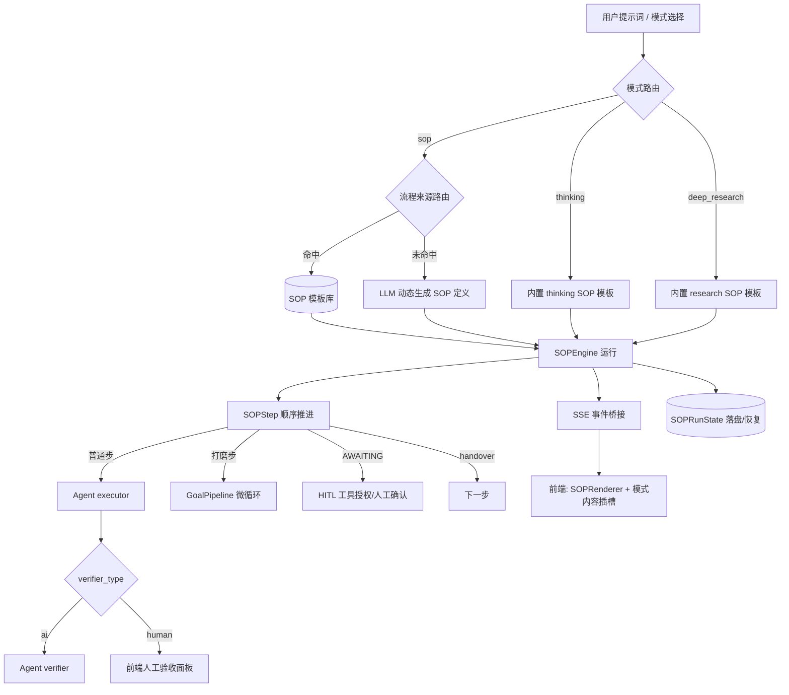

# 智能对话 SOP 标准模式详细设计（含 thinking / deep_research 迁移）

## 用户需求

1. 将 agentscope 升级到 2.0.9（已核验 `backend/requirements.txt` L95 已固定 `agentscope==2.0.9`，升级前置实际满足，设计文档中作为已满足的验收点记录）。
2. 参考 agentscope 2.0.9 官方文档的「标准作业流程 SOP」与「目标流水线 Goal」，对比选型后，为 `frontend/src/views/assistant` 的"智能对话"设计一套**通用标准模式**：用户给提示词 → 完成一个标准 SOP 流程。
3. 流程来源：模板库优先匹配 + 未命中时由提示词动态生成，定义可保存为模板复用。
4. 验收与协同：每步可配置 AI 自动验收或人工验收；人工驳回消耗 `max_attempts` 重做；HITL 工具授权走人工确认。
5. 交付物：**仅详细设计文档**（结构/组件/状态机/SSE 协议），不写任何实现代码。
6. **新增约束（本次更新）**：现有 9 种对话模式中，`深度思考(thinking)` 与 `深度研究(deep_research)` 也要基于 **SOP 标准作业流程 / Goal 目标流水线** 重新实现，与新增的 `sop` 模式共用同一套 SOP/Goal 编排引擎作为通用基座。

### 现有 9 种模式（背景，来自用户提供的下拉表）

| 模式 | item_value | 执行方式 | 现状渲染 |
| --- | --- | --- | --- |
| 通用对话 | `general` | AgentScope 通用 Agent 直接回答 | `GeneralRenderer` |
| 法律咨询 | `legal_consult` | Dify 通道（维护 `dify_conversation_id`） | — |
| NL2SQL | `data` | SQLBot + 通用 Agent 注入 `sqlbot_*` 工具 | `SqlBotRenderer` |
| 技能 | `skill` | 整 package 执行 + SSE 面板 | `SkillExecutionPanel` |
| 深度思考 | `thinking` | 思考步骤流式（thinking_steps） | `ThinkingExecutionPanel` |
| 深度研究 | `deep_research` | 提交即返回 task_id 后台异步 + 卡片轮询 | `DeepResearchTaskCard` |
| 智能体 | `agent` | 选专家 Agent；`execution_mode=plan` 自动映射 `react` | `AgentExecutionPanel` |
| 智能体团队 | `team` | 专家团编排 | `TeamExecutionPanel` |
| 云端调度 | `scheduled` | 提交目标模式 + 优先级/超时/重试；含定时调度 | `ScheduledTaskCard` |


**本设计影响范围**：`sop`（新增）、`thinking`（重构底座）、`deep_research`（重构底座）三者共用 SOP/Goal 引擎；其余 6 种模式不在本次范围内（但架构上 SOP 引擎可后续平移）。

## 产品概述

把"通用标准模式"抽象为一个 **SOP/Goal 编排引擎基座**：

- 宏观：一次 `SOPEngine` 运行 = N 个有序 `SOPStep`（执行者干活 + 可选验证者验收 + handover 交接 + `SOPRunState` 落盘恢复）。
- 微观：某一步若为"反复打磨直到通过"，内部封装 `GoalPipeline` 作为单步微循环。
- 三处落地：①新增 `sop` 模式（模板/动态，通用）；②`thinking` 重构为固定 SOP 模板（理解→拆解思考步骤→逐步推理→综合），保留 `thinking_steps` 事件语义；③`deep_research` 重构为 SOP 多步（制定研究计划→拆分子问题并行→检索/阅读→综合报告），保留 `task_id` 异步 + 轮询 + 报告回看。

## 核心特性

- **选型结论**：SOP 为编排主干（多里程碑、每步独立 executor/verifier、handover 交接、SOPRunState 落盘恢复），GoalPipeline 作为某步内部的单步微循环引擎（可选）。
- **共享基座**：`thinking` 与 `deep_research` 的"步骤编排/验收/挂起/恢复"统一下沉到 SOP/Goal 引擎，前端渲染复用同一 `SOPRenderer` 里程碑时间线 + 模式专属内容插槽。
- **流程两类来源**（sop 模式）：模板库（关键词/选择命中）+ 动态生成（LLM 产出 SOP 定义，可存为模板）。
- **双验收**：每步 `verifier_type=ai|human`；human 走 UI 通过/驳回，消耗 `max_attempts` 重做；HITL 走人工授权。
- **前端渲染**：`EventRouter` 新增 `sop` 分支；`thinking`/`deep_research` 路由可保留原 `renderKind` 但底层引擎切换为 SOP（或统一走 SOP 渲染 + 内容插槽），里程碑时间线展示步骤卡 + 阶段徽章 + 尝试次数 + 验证反馈 + handover 交接；刷新后从 `SOPRunState` 恢复。

## 技术栈

- 前端：React 19 + TypeScript + Vite 8 + antd v6 + Zustand 5 + 自定义 CUI 主题（Outfit 字体，主色 `#3371fc`），SSE 流式渲染。
- 后端：FastAPI + SQLAlchemy 2.0 + Pydantic v2 + MySQL（现有三层架构 api→services→repositories）。
- 编排引擎：`agentscope==2.0.9` 的 `agentscope.sop`（SOP / SOPStep / SOPEngine / SOPRunState / SOPPhase / SOPStepBase）与 `agentscope.pipeline.GoalPipeline`（单步微循环）。

## 实现方案（设计，不写代码）

以 **SOP 为编排主干**，把"通用对话/sop、thinking、deep_research"建模为一次 `SOPEngine` 运行：

- **sop 模式**：N 个有序 `SOPStep`（模板或 LLM 动态生成），每步 executor（Agent）产出、可选 verifier（Agent 或"人"）验收，步骤间结构化 `handover` 交接；`SOPRunState` 落盘恢复；AWAITING 经 `UserConfirmResultEvent`/`ExternalExecutionResultEvent`/`UserInterruptEvent` 恢复。打磨步内部封装 `GoalPipeline`。
- **thinking 模式（重构）**：固化为一份内置 SOP 模板，例如 ①理解问题 ②生成思考步骤(thinking_steps) ③逐步推理(每步可 Goal 微循环打磨) ④综合结论；保留现有 `thinking_steps` 事件与 `ThinkingExecutionPanel` 视觉，但底层由 SOP 引擎驱动（阶段/重试/挂起/恢复统一）。
- **deep_research 模式（重构）**：固化为 SOP 多步 ①制定研究计划（`max_sub_questions=8`/`max_concurrency=4`）②拆分子问题并行检索（`team_result` 式并行分支，可在 `UnifiedStep.exec_mode=parallel` 表达）③阅读/摘录 ④综合研究报告；保留"提交即返回 `task_id` 后台异步 + 卡片轮询 + 报告回看下载"的交互，异步性由现有异步任务通道承载，SOP 运行态落盘。
- 选型依据（已对比）：SOP 具备 N 里程碑顺序推进、每步独立 verifier+max_attempts、handover 显式交接、SOPRunState 状态模型可持久化、verifier 可为"人"——最契合诉求；Goal 仅单目标单循环、验证者只能是 Agent、无状态模型落盘，适合作为单步内部微循环而非主干。

## 架构设计



## 状态机（SOPPhase，逐步 + 整体推导）

```mermaid
stateDiagram-v2
  [*] --> PENDING
  PENDING --> RUNNING: 步骤开始(SOP_STEP_STARTED)
  RUNNING --> AWAITING: 工具授权/人工确认挂起
  AWAITING --> RUNNING: 答复交回(UserConfirm/External/Interrupt)
  RUNNING --> COMPLETED: 验证通过
  RUNNING --> PENDING: 验证驳回(attempt++)
  RUNNING --> FAILED: attempt>max_attempts
  COMPLETED --> PENDING: 进入下一步
  FAILED --> [*]
  note right of COMPLETED: 全部步骤 COMPLETED→整体 COMPLETED\n任一步 FAILED→整体 FAILED
end note
```

## 关键实现要点（设计，不写代码）

- **后端 SOP/Goal 编排引擎（设计）**：封装 `SOPEngineService` 作为三模式的共享基座；`SOP`/`SOPStep` 的 executor/verifier 映射到现有 Agent 体系；内置 `thinking`/`deep_research` 模板；新增 `SOPService` 模板库 CRUD + 动态生成端点（prompt→LLM→SOP 定义 JSON→schema 校验→可选存模板）；将 `engine.reply_stream` 的 `CustomEvent`（SOP_STEP_STARTED/ENDED）、handover、verifier 结论桥接为现有 SSE `StepEvent`/`ArtifactItem` 协议（参考 `backend/app/ai/gateway/mode_handlers/_common.py`）；`SOPRunState.model_dump_json()` 存入现有会话持久化；人工验收/工具授权复用现有 HITL 协调组件（参考 `backend/tests/unit/test_hitl_coordinator.py`）及其 API。thinking/deep_research 的既有网关 handler 改为调用 SOP 引擎而非独立实现。
- **前端 SOP 模式（设计）**：`eventRouter.ts` 的 `RenderKind` 与 `RENDER_SPECS` 新增 `sop` 分支；thinking/deep_research 路由保留原 `renderKind` 但底层渲染统一到共享 `SOPRenderer` + 模式内容插槽（thinking 渲染 `thinking_steps`，research 渲染研究计划/报告/来源）；`ChatMessage` 扩展 `sopRun`/`sopSteps`/`sopHandover`/verifierType，并与现有 `unifiedSteps`/`unifiedArtifacts`/`thinkingSteps`/`researchReport`/`researchPlan` 兼容共存；新增 `SOPRenderer.vue`（位于 `components/renderers/sop/`），复用 `UnifiedStep`/执行面板布局、`ReactConfirmPanel`/`HitlConfirmPanel` 做人工验收与工具授权；步骤卡展示阶段徽章、尝试次数、验证者反馈、handover 交接；会话恢复时从 `SOPRunState` 重建渲染。
- **会话类型**：`session_type` 评估 `sop` 是否作为独立类型注册于 `src/api/aiSession.ts`、`aiContext.types.ts`、`stores/contexts.ts`、`dictionary.ts`；`thinking`/`deep_research` 维持原有 `session_type` 不变（仅引擎切换）。评估 `MODEL_SELECTABLE_TYPES` 是否纳入 `sop`。

## 目录结构与受影响文件（设计文档描述的变更点）

```
frontend/src/views/assistant/
├── components/
│   ├── eventRouter.ts        # [设计] 新增 sop 分支；thinking/deep_research 路由统一到 SOPRenderer
│   ├── types.ts              # [设计] ChatMessage 扩展 sopRun/sopSteps/sopHandover/verifierType（兼容现有字段）
│   └── renderers/
│       ├── sop/SOPRenderer.vue                    # [设计] 共享 SOP 里程碑时间线 + 模式内容插槽
│       ├── execution/ThinkingExecutionPanel.vue   # [设计] 重构为 SOP 引擎驱动（保留 thinking_steps 视觉）
│       └── execution/DeepResearchExecutionPanel.vue # [设计] 重构为 SOP 引擎驱动（保留报告/来源视觉）
backend/app/
├── ai/sop/                   # [设计] SOPEngineService 共享基座 + thinking/research 内置模板 + Goal 微循环接入 + SSE 桥接
├── models/sop.py            # [设计] SOPTemplate / SOPRun 持久化模型
├── routers/sop.py          # [设计] 模板 CRUD / 发起运行 / 人工验收 / 工具授权 API
└── ai/gateway/mode_handlers/_common.py  # [设计] 复用 StepEvent/ArtifactItem SSE 协议
docs/design/sop-assistant-mode-design.md # [产出] 详细设计文档
```

## 设计风格

沿用项目既有的 **Yao Agents CUI** 设计语言（Outfit 字体、主色 `#3371fc`、64px 图标轨、256px 上下文栏、玻璃质感卡片），保证 sop/thinking/deep_research 三种模式视觉一致。新增 SOP 标准模式采用**垂直里程碑时间线 + 步骤卡**布局：左侧固定步骤轨道（序号 + 阶段徽章），右侧为当前步骤的执行详情/验证反馈/handover 交接。

## 页面/组件块设计

- **顶部输入区**：复用 ChatInput，新增"sop 模式"切换与模板选择器（下拉/关键词命中提示）；thinking/deep_research 入口维持原有选择交互，但运行后进入统一的 SOP 里程碑视图。
- **里程碑步骤轨道（SopStepper）**：竖向时间线列出所有 SOPStep，每节点显示 subject、阶段徽章（PENDING 灰 / RUNNING 蓝动效 / AWAITING 橙脉冲 / COMPLETED 绿 / FAILED 红）、当前尝试次数 `attempt/max_attempts`。
- **步骤卡（StepCard）**：当前步骤展开，展示 executor 产出（流式）；thinking 模式额外渲染 `thinking_steps`，deep_research 模式渲染研究计划/子问题与来源/报告；verifier 反馈（AI 结论或"等待人工验收"）；底部 handover 交接摘要。
- **人工验收面板（复用 HitlConfirmPanel）**：`verifier_type=human` 时弹出，提供"通过 / 驳回+原因"，驳回消耗 `max_attempts` 并重做。
- **工具授权面板（复用 ReactConfirmPanel）**：AWAITING 阶段展示待授权工具调用，用户允许/拒绝。
- **底部状态栏**：整体 SOPPhase、进度百分比、保存/恢复提示；刷新后从 SOPRunState 自动重建。
- 微动效（步骤切换淡入、RUNNING 呼吸光、AWAITING 脉冲）提升流程可感知性，保持桌面端（web）布局。

## 验收标准（设计文档需给出）

1. 选型对比章节明确 SOP vs Goal 结论与依据。
2. 给出共享 SOP/Goal 引擎的接口契约（SOP 定义结构、Step/Phase 枚举、SSE 事件、SOPRunState 字段）。
3. 给出 sop / thinking / deep_research 三模式的 SOP 模板定义（步骤、executor、verifier_type、max_attempts、handover 契约）。
4. 给出前端 EventRouter 分支、SOPRenderer 组件结构、与现有 thinking/research 渲染的兼容/迁移路径。
5. 给出 HITL 人工验收/工具授权与 SOPRunState 持久化恢复方案。
6. 给出与现有 6 种模式（general/legal/data/skill/agent/team/scheduled）的边界说明与后续平移可能性。

## Agent Extensions

### SubAgent

- **code-explorer**：复核现有 `eventRouter.ts`、`types.ts`、`renderers/execution/ThinkingExecutionPanel.vue`、`DeepResearchExecutionPanel.vue`/`DeepResearchTaskCard.vue`、`HitlConfirmPanel`/`ReactConfirmPanel`、`backend/app/ai/gateway/mode_handlers/_common.py`、HITL 协调组件与 `session_type` 注册点的真实接口与命名，确保设计文档中的集成点准确、可落地。

### MCP

- **Playwright MCP Server**：复核 agentscope 2.0.9 官方文档 SOP 与 Goal 的接口细节（SOPStep/SOPEngine/SOPRunState/SOPPhase、GoalPipeline 构造参数与恢复事件），作为设计文档的权威引用来源。