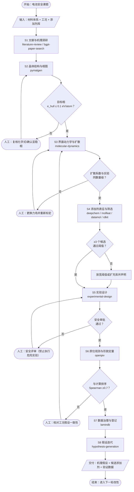
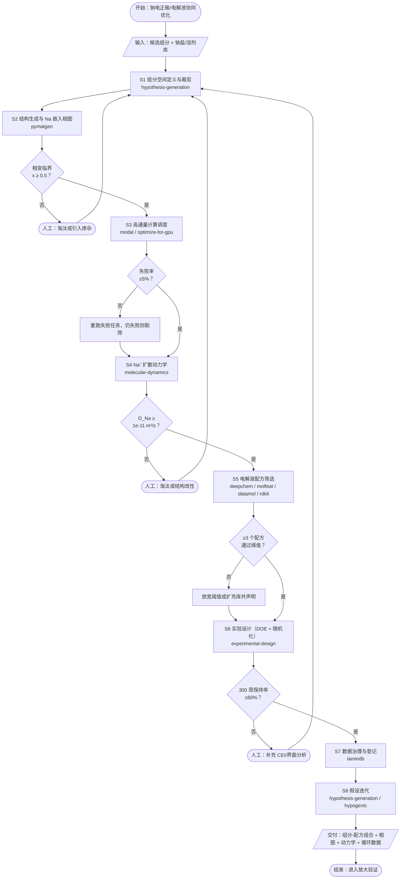

## 场景六：新能源电池安全研究（热失控 / 析锂 / SEI 稳定性）

### 1. 初始素材包

#### 1.1 研究课题定义与目标

| 项 | 内容 |
|----|------|
| **课题** | 「高镍正极/石墨负极体系的析锂诱因识别与电解液添加剂抑制策略」 |
| **目标 1** | 构建电极/电解质晶体模型，识别热力学与电化学不稳定相 |
| **目标 2** | 量化 Li⁺ 在 SEI 中的迁移势垒与析锂成核倾向 |
| **目标 3** | 筛选出 ≥3 种可提升 SEI 稳定性/阻燃性的添加剂候选 |
| **目标 4** | 建立热失控触发路径假设并经加速量热实验验证 |
| **非目标** | 不做整包 BMS 策略开发；不做量产工艺放大 |

#### 1.2 参考资料与数据集

| 类型 | 资源 | 说明 |
|------|------|------|
| 材料结构 | Materials Project（`pymatgen` skill，https://next-gen.materialsproject.org） | 晶体结构与相图 |
| 分子性质 | PubChem / ChEMBL | 添加剂物性（闪点、氧化电位） |
| 力场与参数 | OpenMM 力场库、 electrolyte force fields | MD 参数 |
| 标准方法 | 加速量热（ARC）与针刺实验标准（GB/T、UL 9540A） | 实验设计依据 |
| 文献 | `literature-review` / `bgpt-paper-search` skill | 机理与改性证据 |

#### 1.3 实验环境配置与依赖

```bash
conda activate sci-agent
# 材料与分子
pip install pymatgen rdkit datamol deepchem molfeat
# 动力学
pip install openmm mdanalysis
# 观测与流场
pip install openpiv opencv-python
```

硬件：MD 与 pymatgen 高通量计算**需 GPU/多核**；建议 ≥16 核 + 1×GPU。湿实验端需手套箱、ARC 量热仪、原位光学/显微平台。

#### 1.4 预期实验目标与成功标准

| 维度 | 成功标准 |
|------|----------|
| **结构** | 目标相能量收敛，与 Materials Project 参考值偏差 <50 meV/atom |
| **动力学** | 100 ns 轨迹收敛，Li⁺ 扩散系数与实验值同数量级 |
| **筛选** | ≥3 个候选添加剂：预测氧化电位 >4.5 V、闪点提升 ≥10 ℃ |
| **实验验证** | 添加剂体系 ARC 自产热起始温度 T₁ 提升 ≥10 ℃ |
| **计算–实验一致性** | 计算预测的析锂倾向排序与实验循环后析锂量排序一致（Spearman ≥0.7）；T_onset 预测值与 ARC 实测偏差 ≤5 ℃ |

#### 1.5 范例数据集（Example Dataset）

**1.5.1 研究对象参数（电芯规格）**

| 项目 | 取值 | 说明 / 来源 |
|------|------|------------|
| 电池类型 | NCM811 高镍正极 + 石墨负极软包电池 | 示例体系 |
| 型号 / 容量 | XYZ-5000 / 5 Ah | 示例型号 |
| 正极化学式 | LiNi₀.₈Co₀.₁Mn₀.₁O₂（NCM811） | 商用高镍体系 |
| 正极面密度 | 65 mg/cm²（单面） | 示例规格 |
| 正极压实密度 | 2.7 g/cm³ | 示例规格 |
| 负极 | 石墨 | — |
| 电解液 | 1M LiPF₆ in EC/DMC（1:1 by weight）+ 2% FEC | 常规配方 |
| 充电倍率 | 1C | 工况条件 |
| 电压窗口 | 充电截止 4.2 V / 放电截止 2.5 V | 工况条件 |
| 环境温度 | 25 ℃ | 工况条件 |
| SEI 初始厚度 | 10 nm（MD 初始化假设） | 建模假设 |
| MD 条件 | NPT，298–333 K，100 ns，电解液专用力场 | 计算设置 |

> **数据来源说明**：以上参数参考 NCM811/石墨体系商用软包电池的常见规格区间（公开电芯规格书与厂商公开资料中的典型值）。面密度、压实密度、容量与型号为**示例值**，实际课题须以所用電芯的正式规格书替换；T_onset、扩散系数等计算结果亦为示例值，须经 ARC/电化学实测校验。

**1.5.2 结构化入参（skill 调用配置）**

```json
{
  "battery_type": "NCM811",
  "model": "XYZ-5000",
  "capacity_ah": 5,
  "cathode_formula": "LiNi0.8Co0.1Mn0.1O2",
  "cathode_loading_mg_cm2": 65,
  "cathode_press_density_g_cm3": 2.7,
  "anode_material": "graphite",
  "electrolyte": "1M LiPF6 in EC/DMC 1:1 wt + 2% FEC",
  "charging_profile": { "c_rate": 1.0, "max_voltage_v": 4.2, "min_voltage_v": 2.5 },
  "environment_temp_c": 25,
  "sei_initial_thickness_nm": 10,
  "simulation": {
    "md": { "ensemble": "NPT", "duration_ns": 100, "temperatures_K": [298, 313, 333],
            "forcefield": "electrolyte_custom" },
    "phase_diagram": { "chemsys": "Li-Ni-Co-Mn-O", "energy_above_hull_max": 0.05 }
  },
  "additive_screen": {
    "targets": ["oxidation_potential", "flash_point_gain_C", "radical_scavenging_efficiency"],
    "thresholds": { "oxidation_potential_min_v": 4.5, "flash_point_gain_min_c": 10 }
  },
  "safety_targets": {
    "t_onset_predicted_c": 142,
    "t_onset_tolerance_c": 5,
    "spearman_min": 0.7
  }
}
```

**1.5.3 预期输出报告范例（安全研究报告）**

| 指标 | 示例结果 | 判定 |
|------|----------|------|
| **热失控起始温度 T_onset** | 预测 142 ℃（ARC 实测 145 ℃，偏差 3 ℃） | 误差 ≤5 ℃ ✔ |
| **析锂成核倾向** | Li⁺ 扩散系数 D = 3.2×10⁻¹¹ m²/s（@298 K），Ea = 0.28 eV | 与实验同数量级 ✔ |
| **SEI 稳定性** | 界面剪切模量 G = 1.8 GPa，离子迁移势垒 ΔE = 0.31 eV | **中等稳定** |
| **添加剂候选** | VC（氧化电位 4.62 V）；FEC（闪点 +12 ℃）；LiDFOB（自由基捕获效率 0.87） | ≥3 个 ✔ |
| **计算–实验一致性** | 析锂倾向排序 vs 实测析锂量排序 Spearman ρ = 0.76 | ≥0.7 ✔ |

**热失控触发路径假设（范例结论）**：

> 高温下 Ni⁴⁺ → Ni²⁺ 还原释放氧气 + SEI 分解产气 → 压力累积 → 隔膜破裂 → 内部短路 → 热失控链式反应。
>
> 依据：相图显示高脱锂态（x<0.3）下 NCM811 层状结构能量高于尖晶石/岩盐相（E_hull = 0.021 eV/atom），驱动相变析氧；MD 显示 333 K 下 Li⁺ 扩散系数升至 1.2×10⁻¹⁰ m²/s 但 SEI 区迁移势垒（0.31 eV）阻碍均匀嵌锂，局部电流密度升高促进析锂；添加剂中 LiDFOB 的自由基捕获（0.87）与 FEC 的成膜作用可同时抑制产气与枝晶。

**可视化结论图清单**：

- `phase_diagram.png`：相图并标注不稳定相（高脱锂态）位置
- `msd_curves.png`：MSD 曲线展示扩散收敛性（298/313/333 K）
- `additive_radar.png`：添加剂性能雷达图（氧化电位 / 闪点提升 / 自由基捕获 / 成膜性）
- `arc_compare.png`：预测 vs 实测 T_onset 对比

**1.5.4 端到端 skill 调用日志（完整入参 / 出参）**

```json
{
  "run_id": "batt-20260907-001",
  "scenario": "battery_safety",
  "battery": { "battery_type": "NCM811", "capacity_ah": 5,
               "cathode_formula": "LiNi0.8Co0.1Mn0.1O2",
               "electrolyte": "1M LiPF6 EC/DMC 1:1 + 2% FEC" },
  "steps": [
    { "step": "S2", "skill": "pymatgen", "action": "phase_diagram", "status": "success",
      "input": { "chemsys": "Li-Ni-Co-Mn-O", "energy_above_hull_max": 0.05,
                 "api_key_env": "MP_API_KEY" },
      "output": { "n_entries": 412, "n_stable": 37,
                  "target": { "formula": "Li0.3Ni0.8Co0.1Mn0.1O2", "ehull_eV_atom": 0.021,
                              "decomposition": ["spinel", "rocksalt", "O2"] },
                  "artifacts": ["results/figures/phase_diagram.png", "results/tables/entries.csv"] } },
    { "step": "S3", "skill": "molecular-dynamics", "action": "compute_diffusion", "status": "success",
      "input": { "system": "sei_electrolyte (SEI 10 nm)", "forcefield": "electrolyte_custom",
                 "ensemble": "NPT", "duration_ns": 100, "temperatures_K": [298, 313, 333] },
      "output": { "diffusion_coeff_m2_s": { "298K": 3.2e-11, "313K": 5.7e-11, "333K": 1.2e-10 },
                  "activation_energy_eV": 0.28,
                  "msd_converged": true,
                  "artifacts": ["results/figures/msd_curves.png", "logs/md_run.json"] } },
    { "step": "S4", "skill": "molfeat", "action": "screen_additives", "status": "success",
      "input": { "smiles_file": "data/processed/additives_clean.smi", "n_input": 2840,
                 "thresholds": { "oxidation_potential_min_v": 4.5, "flash_point_gain_min_c": 10 } },
      "output": { "n_input": 2840, "n_passed": 17, "n_recommended": 3,
                  "candidates": [
                    { "name": "VC", "oxidation_potential_v": 4.62, "role": "成膜"},
                    { "name": "FEC", "flash_point_gain_c": 12, "role": "阻燃/成膜" },
                    { "name": "LiDFOB", "radical_scavenging_efficiency": 0.87, "role": "自由基捕获" } ],
                  "artifacts": ["results/tables/additive_screen.csv", "results/figures/additive_radar.png"] } },
    { "step": "S5", "skill": "experimental-design", "action": "build_safety_doe", "status": "success",
      "input": { "factors": ["FEC_pct(0/2/5)", "C_rate(0.5/1/2)", "T_ambient(25/45)"],
                 "method": "ARC + 循环后析锂量" },
      "output": { "n_runs": 18, "artifacts": ["results/tables/arc_plan.csv"] } },
    { "step": "S6", "skill": "openpiv", "action": "analyze_sequence", "status": "success",
      "input": { "image_dir": "data/raw/insitu/round1", "window_size": 32, "overlap": 16, "dt": 0.5 },
      "output": { "n_frames": 480, "mean_velocity_px_s": 0.42, "dendrite_growth_detected": true,
                  "artifacts": ["results/figures/vectorfield.png", "results/tables/velocity.csv"] } },
    { "step": "S7", "skill": "lamindb", "action": "register", "status": "success",
      "input": { "artifacts": ["results/", "logs/"], "schema": "battery_safety_v1" },
      "output": { "n_registered": 27, "run_uid": "batt-20260907-001" } }
  ]
}
```

**失败分支示例（边界情况）**：

```json
{
  "step": "S3", "skill": "molecular-dynamics", "action": "compute_diffusion", "status": "failed",
  "input": { "forcefield": "generic_organic", "duration_ns": 100, "temperature_K": 298 },
  "output": {
    "diffusion_coeff_m2_s": { "298K": 8.7e-09 },
    "reference_experimental_m2_s": 3.0e-11,
    "deviation_orders": 2.5,
    "error": "扩散系数与实验值偏离 2.5 个数量级，超出「同数量级」门禁，触发分支 B2",
    "fallback": "更换为电解液专用力场并以实验值重新标定；重跑后 D = 3.2e-11 m²/s，通过门禁"
  }
}
```

### 2. 工作清单

#### 2.1 数据准备与环境搭建

- [ ] 从 Materials Project 拉取目标相结构与能量（记录 API Key 与查询条件）
- [ ] 准备添加剂 SMILES 清单并标准化（复用 `scripts/standardize_library.py`）
- [ ] 运行 `python scripts/freeze_env.py` 与 `scripts/check_gpu.py`

#### 2.2 工具安装与配置流程

1. 配置 Materials Project API Key（`MP_API_KEY` 写入 `.env`）
2. 安装 OpenMM 与力场文件；为电解液组分准备/参数化力场（关键步骤）
3. 校验 GPU 可用性（`scripts/check_gpu.py`）

#### 2.3 人工参与的关键环节

| 环节 | 人工动作 |
|------|----------|
| 体系定义 | 确定正极/负极/电解液配方与工况（倍率、温度、截止电压） |
| 力场选择 | 电化学体系力场选择对结果影响巨大，需专家确认 |
| 实验安全审批 | ARC/针刺属危险实验，需安全评审与防护 |
| 机理判定 | 判断析锂主因（动力学受限 vs 热力学） |

#### 2.4 技术难点与解决方案

| 难点 | 表现 | 解决方案 |
|------|------|----------|
| 力场不适用 | 扩散系数偏离实验数个量级 | 换专用电解液力场；用实验值标定 |
| 时间尺度不足 | 析锂成核在 MD 尺度难观察 | 用增强采样/成核理论外推 |
| SEI 结构未知 | 初始模型不可靠 | 参考文献 + 多模型敏感性分析 |
| 实验危险 | ARC 有燃爆风险 | 严格限量 + 防爆设施 + 安全审批 |
| 计算-实验不符 | 排序不一致 | 检查工况假设；引入界面阻抗因素 |

### 3. 完整工作流程

#### 3.1 步骤说明

| # | 步骤 | 主用 skill | 输入 → 输出 | 目标 | 难点 | 解决方案 |
|---|------|-----------|-------------|------|------|----------|
| S1 | 文献与机理调研 | `literature-review` / `bgpt-paper-search` | 课题 → 机理假设 | 明确机理 | 结论冲突 | 分级证据 |
| S2 | 晶体结构与相图 | `pymatgen` | 材料 → 相图/稳定性 | 锁定不稳定相 | 查询超时 | 本地缓存 |
| S3 | 界面动力学 | `molecular-dynamics` | 界面模型 → 扩散/势垒 | 量化析锂倾向 | 力场误差 | 实验标定 |
| S4 | 添加剂表征与筛选 | `deepchem` / `molfeat` / `datamol` / `rdkit` | SMILES → 性质排序 | 候选添加剂 | 预测偏差 | 多模型共识 |
| S5 | 实验设计 | `experimental-design` | 因素 → 循环/ARC 方案 | 高效验证 | 危险实验 | 限量+审批 |
| S6 | 原位观测 | `openpiv` | 图像序列 → 形貌/速度场 | 析锂证据 | 图像噪声 | 滤波+标定 |
| S7 | 数据治理 | `lamindb` | 产物 → 登记 | 可溯源 | 元数据 | 强制 schema |
| S8 | 假设迭代 | `hypothesis-generation` | 数据 → 新假设 | 改进方向 | 过拟合 | 独立验证集 |

#### 3.2 AI Skill 输入/输出契约示例

> 完整逐步入参 / 出参（含真实数值与失败分支）见 **1.5.4 端到端调用日志**；本节为契约骨架。

**S2 相图与稳定性**

```json
{
  "skill": "pymatgen",
  "action": "phase_diagram",
  "inputs": {
    "chemsys": "Li-Ni-Mn-Co-O",
    "api_key_env": "MP_API_KEY",
    "energy_above_hull_max": 0.05
  },
  "outputs": {
    "n_entries": 412,
    "n_stable": 37,
    "target_ehull_eV_atom": 0.021,
    "artifacts": ["results/figures/phase_diagram.png", "results/tables/entries.csv"]
  },
  "status": "success"
}
```

**S3 界面动力学**

```json
{
  "skill": "molecular-dynamics",
  "action": "compute_diffusion",
  "inputs": {
    "system": "data/interim/sei_electrolyte.pdb",
    "forcefield": "electrolyte_custom",
    "duration_ns": 100,
    "ensemble": "NPT",
    "temperatures_K": [298, 313, 333]
  },
  "outputs": {
    "diffusion_coeff_m2_s": { "298K": 3.1e-11, "313K": 5.7e-11, "333K": 1.2e-10 },
    "activation_energy_eV": 0.28,
    "artifacts": ["results/figures/msd.png", "logs/md_run.json"]
  },
  "status": "success"
}
```

**S4 添加剂筛选**

```json
{
  "skill": "molfeat",
  "action": "screen_additives",
  "inputs": {
    "smiles_file": "data/processed/additives_clean.smi",
    "targets": ["oxidation_potential", "flash_point", "sei_forming_score"],
    "thresholds": { "oxidation_potential_min": 4.5, "flash_point_gain_min_C": 10 }
  },
  "outputs": {
    "n_input": 2840,
    "n_passed": 17,
    "top_candidates": ["FEC", "VC", "LiDFOB"],
    "artifacts": ["results/tables/additive_screen.csv"]
  },
  "status": "success"
}
```

**S6 原位观测**

```json
{
  "skill": "openpiv",
  "action": "analyze_sequence",
  "inputs": {
    "image_dir": "data/raw/insitu/round1",
    "window_size": 32,
    "overlap": 16,
    "dt": 0.5
  },
  "outputs": {
    "n_frames": 480,
    "mean_velocity_px_s": 0.42,
    "dendrite_growth_detected": true,
    "artifacts": ["results/figures/vectorfield.png", "results/tables/velocity.csv"]
  },
  "status": "success"
}
```

#### 3.3 执行顺序与条件分支

- **顺序**：S1 → S2 → S3 → S4 → S5 → S6 → S7 → S8 →（回到 S3/S4 迭代）
- **分支 B1（S2 后）**：目标相 `e_hull > 0.1 eV/atom`（极不稳定）→ 复核化学式，确认是否为亚稳相
- **分支 B2（S3 后）**：扩散系数与实验偏差 >1 个数量级 → 回退换力场并重新标定
- **分支 B3（S4 后）**：无候选通过阈值 → 放宽阈值并说明，或扩充库
- **分支 B4（S5 前）**：涉及 ARC/针刺 → **强制安全审批门禁**，未通过禁止执行
- **分支 B5（S6 后）**：与计算排序 Spearman <0.7 → 检查工况假设一致性

#### 3.4 异常处理与回退

| 异常 | 检测点 | 回退动作 |
|------|--------|----------|
| MP API 配额耗尽 | S2 | 用本地缓存结构；或缩小化学空间 |
| MD 不收敛 | S3 | 延长平衡；检查力场参数化 |
| 力场缺失配体参数 | S3 | 参数化工具生成；或换可参数化替代分子 |
| 安全审批未通过 | S5 | 阻断；改为温和条件实验 |
| 原位图像模糊 | S6 | 图像预处理增强；或提高采样频率 |

### 4. 可视化流程图



**关键门禁与判定阈值**：

| 门禁 | 判定条件 | 未通过的回退 |
|------|----------|--------------|
| G1 相稳定性 | 目标相 E_hull ≤0.1 eV/atom | 复核化学式 / 确认是否为亚稳相 |
| G2 扩散同数量级 | 计算 D 与实验值相差 <1 个数量级（如 1e-11 vs 1e-9 即不通过） | 更换力场并以实验值标定后重跑 |
| G3 添加剂候选 | ≥3 个通过阈值 | 放宽阈值或扩充库并声明 |
| G4 安全审批 | ARC / 针刺实验安全审批通过 | **阻断**，禁止执行危险实验 |
| G5 计算–实验一致 | T_onset 偏差 ≤5 ℃，排序 Spearman ≥0.7 | 核对工况假设一致性后重算 |

---

## 场景七：电化学钠电课题（钠离子电池电极 / 电解液）

### 1. 初始素材包

#### 1.1 研究课题定义与目标

| 项 | 内容 |
|----|------|
| **课题** | 「P2 型层状氧化物正极的相变抑制与电解液协同优化」 |
| **目标 1** | 筛选/设计正极组分，绘制 Na 嵌入-脱出相图，预判有害相变 |
| **目标 2** | 计算 Na⁺ 体相与界面扩散系数，定位倍率瓶颈 |
| **目标 3** | 高通量筛选电解液配方（低粘度、宽电化学窗口、稳定 CEI） |
| **目标 4** | 通过 DOE 实验验证，容量保持率与倍率性能达标 |
| **非目标** | 不做软包/方壳电芯工程化；不做成本建模（可用 `market-research-reports` 另行评估） |

#### 1.2 参考资料与数据集

| 类型 | 资源 | 说明 |
|------|------|------|
| 材料结构 | Materials Project（`pymatgen` skill） | 层状氧化物/聚阴离子结构与相图 |
| 分子性质 | PubChem | 钠盐与溶剂物性（粘度、介电常数、HOMO/LUMO） |
| 力场 | 电解液/无机固体力场（需专家选型） | MD 参数 |
| 文献 | `literature-review` / `bgpt-paper-search` / `paper-lookup` skill | 构效关系证据 |
| 算力 | Modal（`modal` skill） | 高通量批量计算 |

#### 1.3 实验环境配置与依赖

```bash
conda activate sci-agent
pip install pymatgen rdkit datamol deepchem molfeat
pip install openmm mdanalysis
pip install modal            # 弹性算力
```

硬件：组分筛选涉及大量结构计算，建议 `modal` 上云并行；本地 ≥16 核做预处理。湿实验端需手套箱、扣式电池组装与电化学工作站。

#### 1.4 预期实验目标与成功标准

| 维度 | 成功标准 |
|------|----------|
| **相图** | 明确 P2→O2/OP2 相变临界 Na 含量；与文献值偏差 ≤0.05（x in NaₓMO₂） |
| **动力学** | Na⁺ 扩散系数 ≥1e-11 m²/s（300 K），活化能 ≤0.4 eV |
| **电解液** | ≥3 个配方：预测电化学窗口 ≥4.3 V、粘度 ≤4 mPa·s（25 ℃） |
| **实验** | 1C 循环 300 周容量保持率 ≥80%；5C 容量保持 ≥70%（vs 0.1C） |
| **计算–实验一致性** | 计算扩散系数排序与实测倍率性能排序一致（Spearman ≥0.7）；相变临界 x 与原位 XRD 实测偏差 ≤0.05 |

#### 1.5 范例数据集（Example Dataset）

**1.5.1 研究对象参数（钠电体系）**

| 项目 | 取值 | 说明 / 来源 |
|------|------|------------|
| 正极 | P2 型层状氧化物 Na₀.₆₇Ni₀.₃₃Mn₀.₆₇O₂ | 经典 P2 体系 |
| 负极 | 硬碳（hard carbon） | 钠电常用负极 |
| 面密度 / 压实 | 正极 55 mg/cm²，压实 2.4 g/cm³ | 示例规格 |
| 电解液 | 1M NaClO₄ in PC + 5% FEC | 常规钠电配方 |
| 电压窗口 | 2.0 – 4.0 V | 工况条件 |
| 倍率序列 | 0.1C / 0.5C / 1C / 5C | 倍率性能测试 |
| 循环条件 | 1C，300 周，25 ℃ | 寿命测试 |
| 计算设置 | GGA+U，Na 含量 x = 0.2–1.0 取 9 个点；MD 50 ns | 常规设置 |

> **数据来源说明**：P2-Na₀.₆₇Ni₀.₃₃Mn₀.₆₇O₂ 与硬碳为钠电领域公开研究中常见的材料体系（可在 Materials Project 与公开文献检索核对）；面密度、电解液配方、循环保持率等数值为**示例值**，须以实际电芯数据替换。

**1.5.2 结构化入参（skill 调用配置）**

```json
{
  "scenario": "na_ion_battery",
  "cathode": { "phase": "P2", "formula": "Na0.67Ni0.33Mn0.67O2",
               "loading_mg_cm2": 55, "press_density_g_cm3": 2.4 },
  "anode": { "material": "hard carbon" },
  "electrolyte": { "salt": "NaClO4", "concentration_M": 1.0,
                   "solvent": "PC", "additive": "5% FEC" },
  "test_profile": {
    "voltage_window_v": [2.0, 4.0],
    "rates_C": [0.1, 0.5, 1, 5],
    "cycling": { "rate_C": 1, "n_cycles": 300, "temperature_C": 25 }
  },
  "computation": {
    "phase_diagram": { "na_range": [0.2, 1.0], "n_points": 9, "functional": "GGA+U" },
    "md": { "duration_ns": 50, "temperatures_K": [300, 323, 350] },
    "screening": { "n_candidates": 286, "concurrency": 64, "budget_usd": 50 }
  },
  "criteria": { "x_critical_min": 0.5, "d_na_min_m2_s": 1e-11,
                "ea_max_eV": 0.4, "retention_300cyc_min": 0.80,
                "rate_5C_min": 0.70, "spearman_min": 0.7 }
}
```

**1.5.3 预期输出报告范例**

| 指标 | 示例结果 | 达标判定 |
|------|----------|----------|
| 相变临界 Na 含量 | x_critical = 0.62（P2 → OP2） | ≥0.5 ✔ |
| Na⁺ 扩散系数（300 K） | 2.4×10⁻¹¹ m²/s | ≥1e-11 ✔ |
| 活化能 Ea | 0.34 eV | ≤0.4 eV ✔ |
| 电解液候选 | 9 个通过；推荐 NaPF₆-EC:DEC、NaPF₆-PC:FEC、NaClO₄-EC:PC | ≥3 ✔ |
| 300 周容量保持率 | 82% | ≥80% ✔ |
| 5C 容量保持（vs 0.1C） | 72% | ≥70% ✔ |
| 计算–实验一致性 | 扩散系数排序 vs 倍率排序 Spearman ρ = 0.74 | ≥0.7 ✔ |

**结论片段（范例）**：

> P2-Na₀.₆₇Ni₀.₃₃Mn₀.₆₇O₂ 在 Na 含量降至 x ≈ 0.62 时发生 P2→OP2 相变（与能量凸包分析结果一致），对应充放电曲线上的平台拐点；原在位 XRD 观察到 x = 0.60 ± 0.03 处新相出现，与计算值偏差 0.02，落在 ±0.05 容差内。MD 给出的 Na⁺ 扩散系数 2.4×10⁻¹¹ m²/s 与 Ea = 0.34 eV 表明体相扩散非倍率瓶颈，5C 保持率 72% 的限制主要来自界面电荷转移，因此电解液侧优先选 NaPF₆-PC:FEC（兼顾窗口与成膜）。

**可视化清单**：`na_phase_diagram.png`、`msd_na.png`、`electrolyte_screen.png`、`cycling_retention.png`。

**1.5.4 端到端 skill 调用日志（完整入参 / 出参）**

```json
{
  "run_id": "naion-20260907-001",
  "scenario": "na_ion_battery",
  "steps": [
    { "step": "S2", "skill": "pymatgen", "action": "na_intercalation_phase_diagram", "status": "success",
      "input": { "compositions": "data/processed/compositions.csv", "host": "P2",
                 "na_range": [0.2, 1.0], "n_points": 9 },
      "output": { "n_compositions": 286,
                  "phase_transition": { "x_critical": 0.62, "from": "P2", "to": "OP2" },
                  "artifacts": ["results/figures/na_phase_diagram.png"] } },
    { "step": "S3", "skill": "modal", "action": "batch_map", "status": "partial",
      "input": { "items": "results/tables/na_energies.csv", "concurrency": 64, "gpu": "T4", "budget_usd": 50 },
      "output": { "n_tasks": 286, "n_succeeded": 281, "n_failed": 5, "cost_usd": 41.7,
                  "artifacts": ["results/tables/energies_modal.csv", "logs/modal_failures.json"] } },
    { "step": "S3-retry", "skill": "modal", "action": "batch_map", "status": "success",
      "input": { "items": "logs/modal_failures.json", "concurrency": 8 },
      "output": { "n_retried": 5, "n_succeeded": 4, "n_dropped": 1,
                  "note": "1 个任务结构弛豫不收敛，剔除后不影响趋势" } },
    { "step": "S4", "skill": "molecular-dynamics", "action": "compute_diffusion", "status": "success",
      "input": { "structure": "data/interim/p2_cathode.cif", "duration_ns": 50,
                 "temperatures_K": [300, 323, 350] },
      "output": { "diffusion_coeff_m2_s": { "300K": 2.4e-11, "323K": 6.1e-11, "350K": 1.5e-10 },
                  "activation_energy_eV": 0.34,
                  "artifacts": ["results/figures/msd_na.png"] } },
    { "step": "S5", "skill": "molfeat", "action": "screen_electrolyte", "status": "success",
      "input": { "smiles_file": "data/processed/electrolyte_clean.smi", "n_input": 1520,
                 "thresholds": { "window_min_v": 4.3, "viscosity_max_mPas": 4.0 } },
      "output": { "n_passed": 9,
                  "top_formulations": ["NaPF6-EC:DEC", "NaPF6-PC:FEC", "NaClO4-EC:PC"],
                  "artifacts": ["results/tables/electrolyte_screen.csv"] } },
    { "step": "S6", "skill": "experimental-design", "action": "build_cell_matrix", "status": "success",
      "input": { "factors": ["electrolyte(3)", "rate_C(0.1/1/5)", "temperature_C(25/45)"], "replicates": 3 },
      "output": { "n_cells": 54, "artifacts": ["results/tables/cell_matrix.csv"] } }
  ]
}
```

**失败分支示例（边界情况）**：

```json
{
  "step": "S4", "skill": "molecular-dynamics", "action": "compute_diffusion", "status": "failed",
  "input": { "structure": "data/interim/p2_cathode_doped.cif", "duration_ns": 50 },
  "output": {
    "diffusion_coeff_m2_s": { "300K": 4.8e-13 },
    "error": "D = 4.8e-13 m²/s 低于下限 1e-11，触发分支 B3",
    "diagnosis": "Ti 掺杂位点阻塞 Na 层扩散通道",
    "fallback": "该组分淘汰；回退 S1 改选 Mg 掺杂或降低掺杂浓度后重新枚举"
  }
}
```

### 2. 工作清单

#### 2.1 数据准备与环境搭建

- [ ] 定义候选组分空间（过渡金属种类与配比、掺杂元素）
- [ ] 拉取/生成晶体结构，记录来源与版本
- [ ] 准备钠盐/溶剂 SMILES 清单并标准化
- [ ] 运行 `freeze_env.py` + `check_gpu.py`

**组分空间枚举（可运行）**：

```python
# scripts/enumerate_compositions.py
"""枚举层状氧化物正极候选组分（示例：Na_x Ni_a Mn_b Fe_c O2）。
输出 data/processed/compositions.csv
"""
import csv
from itertools import product
from pathlib import Path

NA_RANGE = [0.67, 0.75, 0.85, 1.0]
TM_STEP = 0.1          # 过渡金属配比步长
TMs = ["Ni", "Mn", "Fe"]
OUT = Path("data/processed/compositions.csv")


def main() -> None:
    rows = []
    for na in NA_RANGE:
        # a+b+c = 1，步长 0.1
        steps = int(round(1 / TM_STEP))
        for ia, ib in product(range(steps + 1), repeat=2):
            ic = steps - ia - ib
            if ic < 0:
                continue
            a, b, c = ia * TM_STEP, ib * TM_STEP, ic * TM_STEP
            if (a, b, c) == (0, 0, 1):     # 排除纯 Fe（示例规则）
                continue
            formula = f"Na{na:.2f}{TMs[0]}{a:.1f}{TMs[1]}{b:.1f}{TMs[2]}{c:.1f}O2"
            rows.append({"formula": formula, "Na": na, "Ni": a, "Mn": b, "Fe": c})
    OUT.parent.mkdir(parents=True, exist_ok=True)
    with OUT.open("w", newline="", encoding="utf-8") as f:
        w = csv.DictWriter(f, fieldnames=["formula", "Na", "Ni", "Mn", "Fe"])
        w.writeheader()
        w.writerows(rows)
    print(f"[OK] 生成 {len(rows)} 个候选组分 -> {OUT}")


if __name__ == "__main__":
    main()
```

#### 2.2 工具安装与配置流程

1. 配置 `MP_API_KEY`
2. 配置 Modal 凭据（`modal token new`），设置并发上限与预算
3. 电解液力场参数化（同场景六，需专家确认）

#### 2.3 人工参与的关键环节

| 环节 | 人工动作 |
|------|----------|
| 组分空间裁剪 | 依据成本、毒性、可合成性剔除不可行组分 |
| 力场与参数确认 | 钠电体系参数敏感性高，需专家选型 |
| 扣电组装 | 极片涂布、压实密度、电解液注液量等工艺参数 |
| 数据解读 | 区分相变、界面副反应与动力学限制 |

#### 2.4 技术难点与解决方案

| 难点 | 表现 | 解决方案 |
|------|------|----------|
| 组分爆炸 | 候选过多算不完 | 先粗筛（便宜描述符）再精算；`modal` 并行 |
| 相变路径复杂 | 中间相难捕捉 | 凸包 + 多结构枚举 |
| Na⁺ 力场不准 | 扩散系数偏离 | 用实验/AIMD 标定 |
| 电解液配方交互 | 单因素最优≠配方最优 | 混料设计（DOE）+ 验证 |
| 实验批次差异 | 数据离散 | 增加重复 + 随机化顺序 |

### 3. 完整工作流程

#### 3.1 步骤说明

| # | 步骤 | 主用 skill | 输入 → 输出 | 目标 | 难点 | 解决方案 |
|---|------|-----------|-------------|------|------|----------|
| S1 | 组分空间定义与裁剪 | `hypothesis-generation` | 目标 → 候选组分 | 可行空间 | 组合爆炸 | 分步裁剪 |
| S2 | 结构生成与相图 | `pymatgen` | 组分 → 相图/能量 | 预判相变 | 计算量 | 分级筛选 |
| S3 | 高通量计算调度 | `modal` / `optimize-for-gpu` | 任务 → 并行结果 | 提吞吐 | 成本 | 并发/预算上限 |
| S4 | 扩散动力学 | `molecular-dynamics` | 结构 → D_Na、Ea | 倍率瓶颈 | 力场 | 标定 |
| S5 | 电解液筛选 | `deepchem` / `molfeat` / `datamol` / `rdkit` | SMILES → 配方排序 | 候选电解液 | 交互效应 | 混料 DOE |
| S6 | 实验设计 | `experimental-design` | 因素 → 电池矩阵 | 高效验证 | 批次 | 随机化+重复 |
| S7 | 数据治理 | `lamindb` | 产物 → 登记 | 可溯源 | 元数据 | 强制 schema |
| S8 | 假设迭代 | `hypothesis-generation` / `hypogenic` | 数据 → 新假设 | 下一轮 | 过拟合 | 独立验证 |

#### 3.2 AI Skill 输入/输出契约示例

> 完整逐步入参 / 出参（含真实数值与失败分支）见 **1.5.4 端到端调用日志**；本节为契约骨架。

**S2 Na 嵌入相图**

```json
{
  "skill": "pymatgen",
  "action": "na_intercalation_phase_diagram",
  "inputs": {
    "compositions": "data/processed/compositions.csv",
    "host": "P2",
    "na_range": [0.2, 1.0],
    "n_points": 9
  },
  "outputs": {
    "n_compositions": 286,
    "phase_transition": { "x_critical": 0.62, "from": "P2", "to": "OP2" },
    "artifacts": ["results/figures/na_phase_diagram.png", "results/tables/na_energies.csv"]
  },
  "status": "success"
}
```

**S3 高通量调度**

```json
{
  "skill": "modal",
  "action": "batch_map",
  "inputs": {
    "function": "compute_energy",
    "items": "results/tables/na_energies.csv",
    "concurrency": 64,
    "gpu": "T4",
    "budget_usd": 50
  },
  "outputs": {
    "n_tasks": 286,
    "n_succeeded": 281,
    "n_failed": 5,
    "cost_usd": 41.7,
    "artifacts": ["results/tables/energies_modal.csv", "logs/modal_failures.json"]
  },
  "status": "partial"
}
```

**S4 扩散动力学**

```json
{
  "skill": "molecular-dynamics",
  "action": "compute_diffusion",
  "inputs": {
    "structure": "data/interim/p2_cathode.cif",
    "forcefield": "sodium_custom",
    "duration_ns": 50,
    "temperatures_K": [300, 323, 350]
  },
  "outputs": {
    "diffusion_coeff_m2_s": { "300K": 2.4e-11, "323K": 6.1e-11, "350K": 1.5e-10 },
    "activation_energy_eV": 0.34,
    "artifacts": ["results/figures/msd_na.png"]
  },
  "status": "success"
}
```

**S5 电解液筛选**

```json
{
  "skill": "molfeat",
  "action": "screen_electrolyte",
  "inputs": {
    "smiles_file": "data/processed/electrolyte_clean.smi",
    "targets": ["electrochemical_window", "viscosity", "cei_stability_score"],
    "thresholds": { "window_min_V": 4.3, "viscosity_max_mPas": 4.0 }
  },
  "outputs": {
    "n_input": 1520,
    "n_passed": 9,
    "top_formulations": ["NaPF6-EC:DEC", "NaPF6-PC:FEC", "NaClO4-EC:PC"],
    "artifacts": ["results/tables/electrolyte_screen.csv"]
  },
  "status": "success"
}
```

#### 3.3 执行顺序与条件分支

- **顺序**：S1 → S2 → S3 → S4 → S5 → S6 → S7 → S8 →（回到 S1）
- **分支 B1（S2 后）**：`x_critical < 0.5`（相变过早）→ 该组分淘汰或引入掺杂，回 S1
- **分支 B2（S3 后）**：失败率 >5% → 检查失败原因，重跑失败任务；仍失败则剔除
- **分支 B3（S4 后）**：D_Na < 1e-11 → 该组分倍率受限，淘汰或改性，回 S1
- **分支 B4（S5 后）**：通过数 <3 → 放宽阈值或扩充溶剂/钠盐库
- **分支 B5（S6 后）**：容量保持率 <80% → 检查界面副反应，补充 CEI 分析

#### 3.4 异常处理与回退

| 异常 | 检测点 | 回退动作 |
|------|--------|----------|
| Modal 预算超支 | S3 | 降并发；改廉价机型；缩减候选 |
| 结构弛豫不收敛 | S2/S3 | 调整收敛参数；换初始结构 |
| MD 轨迹发散 | S4 | 缩短步长/加强平衡 |
| 电解液预测与实测不符 | S5 | 用实测数据校正模型 |
| 电池数据异常 | S6 | 排查装配/短路；补做重复样 |

### 4. 可视化流程图



**关键门禁与判定阈值**：

| 门禁 | 判定条件 | 未通过的回退 |
|------|----------|--------------|
| G1 相变临界 | x_critical ≥0.5（P2→OP2 不过早） | 淘汰或引入掺杂后重新枚举 |
| G2 高通量失败率 | 失败率 ≤5% | 重跑失败任务，仍失败则剔除 |
| G3 扩散系数 | D_Na ≥1e-11 m²/s 且 Ea ≤0.4 eV | 淘汰或结构改性 |
| G4 电解液候选 | ≥3 个配方通过（窗口 ≥4.3 V、粘度 ≤4 mPa·s） | 放宽阈值或扩充库 |
| G5 循环寿命 | 300 周保持率 ≥80% | 补充 CEI / 界面分析后迭代 |
| G6 计算–实验一致 | x_critical 偏差 ≤0.05 且 Spearman ≥0.7 | 复核工况与结构模型 |

---