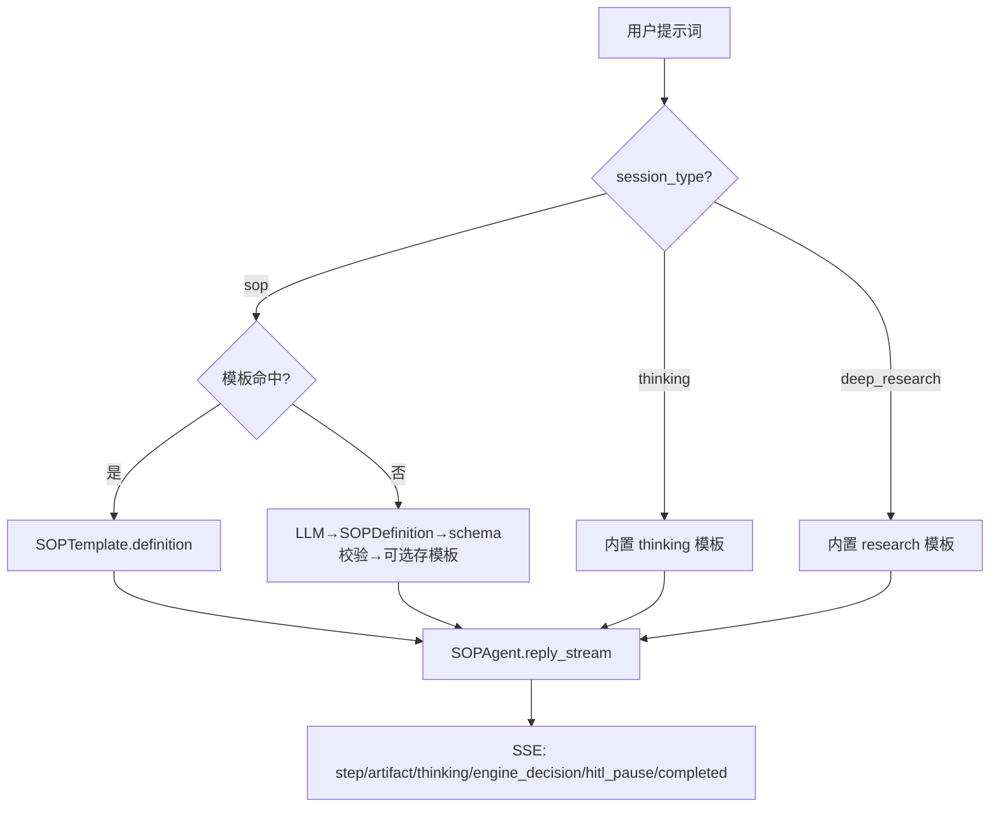
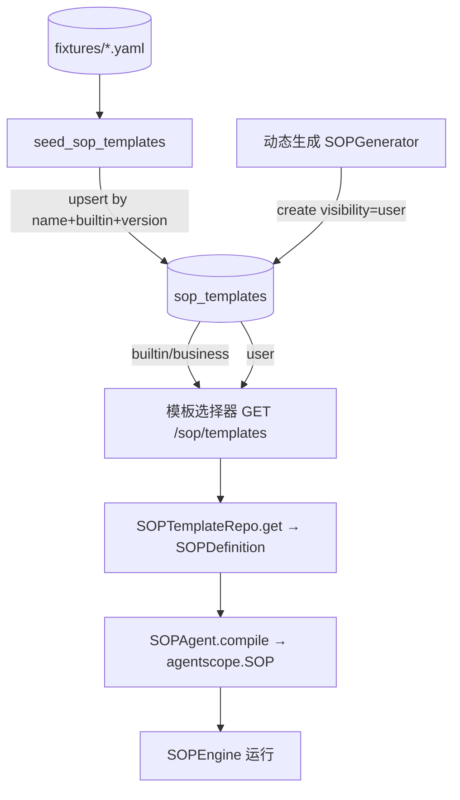

# 智能对话 SOP 标准模式详细设计（含 thinking / deep_research 迁移）

> 状态：设计稿（仅设计，不含实现代码）
> 适用范围：`frontend/src/views/assistant` 智能对话；后端 `backend/app/ai` 编排层
> 依赖：agentscope `==2.0.9`（已在 `backend/requirements.txt:95` 固定）

---

## 0. 关键前提与修正（务必先读）

1. **agentscope 2.0.9 已满足**：`backend/requirements.txt:95` 已是 `agentscope==2.0.9`。本设计不重复升级动作，仅将其作为 SOP 引擎的能力前提。设计假设 `agentscope.sop`（`SOP` / `SOPStep` / `SOPEngine` / `SOPRunState` / `SOPPhase` / `SOPStepBase`）与 `agentscope.pipeline.GoalPipeline` 在 2.0.9 中可导入（官方文档 https://docs.agentscope.io/zh/versions/2.0.9 已列示），**验收第一项**即确认 `python -c "from agentscope.sop import SOP, SOPEngine"` 可用。

2. **SOP 引擎是全新集成，不是替换**：经代码核查，`from agentscope.sop` / `GoalPipeline` / `SOPEngine` 在当前代码库中 **0 处使用**。现有 `thinking` / `deep_research` 各自独立实现（`ResearchOrchestrator` / `ThinkingAgent`）。因此本设计是**新增一个共享编排包**，并将 `thinking` / `deep_research` 的编排逻辑**下沉到该包**，而非就地改写。

3. **真实事件契约 ≠ 注释里写的 `StepEvent`/`ArtifactItem`**：`frontend/src/views/assistant/components/types.ts` 的注释指向 `backend/app/ai/gateway/mode_handlers/_common.py` 的 `StepEvent`/`ArtifactItem`，但**该文件/类不存在**。真实契约在：
   - `backend/app/schemas/agent/event_types.py`：`EventEnvelope`、`ExecutionEventType`（事件 `type` 唯一来源）
   - `backend/app/ai/events/adapter.py`：`AgentScopeEventAdapter.to_envelopes` / `envelope_to_sse`
   - 步骤/产物以 **`event_type="step"` / `"artifact"` 的 content dict** 表达，字段 == 前端 `UnifiedStep` / `UnifiedArtifact`（`types.ts`）。
   - 回放接口：`GET /api/v1/agent/executions/{execution_id}/unified-events`（`backend/app/routers/agent/agent_execution.py:109`），过滤 `event_type in ("step","artifact")` 返回 `{steps, artifacts}`。

   设计将**复用该契约**，不引入新 pydantic 类。

---

## 1. 背景与目标

在智能对话中引入一套**通用标准模式（SOP 模式）**：用户给一句自然语言目标，系统匹配或动态生成一份多里程碑标准作业流程，按序推进每个步骤（执行者干活 + 验证者验收），支持单步 AI 自动验收与人工验收、步骤间结构化交接（handover）、中途挂起人工确认/工具授权、运行状态持久化恢复。

**更进一步的定位**：把 SOP/Goal 抽象为**共享编排基座**，除新增的 `sop` 模式外，将现有的 `深度思考(thinking)` 与 `深度研究(deep_research)` 也迁移到同一引擎上，统一"步骤编排 / 验收 / 挂起 / 恢复"语义，前端复用同一套里程碑时间线渲染。

### 1.1 现有 9 种模式（背景）

| 模式 | item_value | 现状执行方式 | 现状渲染 |
|---|---|---|---|
| 通用对话 | `general` | AgentScope 通用 Agent 直接回答 | `GeneralRenderer` |
| 法律咨询 | `legal_consult` | Dify 通道（维护 `dify_conversation_id`） | — |
| NL2SQL | `data` | SQLBot + 通用 Agent 注入 `sqlbot_*` 工具 | `SqlBotRenderer` |
| 技能 | `skill` | 整 package 执行 + SSE 面板 | `SkillExecutionPanel` |
| 深度思考 | `thinking` | 思考步骤流式（`thinking_steps`） | `ThinkingExecutionPanel` |
| 深度研究 | `deep_research` | 提交即返回 `task_id` 后台异步 + 卡片轮询 | `DeepResearchTaskCard` |
| 智能体 | `agent` | 选专家 Agent；`execution_mode=plan` 自动映射 `react` | `AgentExecutionPanel` |
| 智能体团队 | `team` | 专家团编排 | `TeamExecutionPanel` |
| 云端调度 | `scheduled` | 提交目标模式 + 优先级/超时/重试 | `ScheduledTaskCard` |

**本设计影响范围**：`sop`（新增）、`thinking`（重构底座）、`deep_research`（重构底座）三者共用 SOP/Goal 引擎；其余 6 种模式不在本次范围（架构上后续可平移）。

### 1.2 核心特性

- **选型结论**：SOP 为编排主干（多里程碑、每步独立 executor/verifier、handover 交接、`SOPRunState` 落盘恢复），`GoalPipeline` 作为某步内部的单步微循环引擎（可选）。
- **共享基座**：`thinking` 与 `deep_research` 的步骤编排/验收/挂起/恢复统一下沉到 SOP/Goal 引擎，前端复用同一 `TimelineFlowPlayer` 里程碑时间线 + 模式专属内容插槽。
- **流程两类来源**（`sop` 模式）：模板库（关键词/选择命中）+ 动态生成（LLM 产出 SOP 定义，可存为模板）。
- **双验收**：每步 `verifier_type=ai|human`；human 走 UI 通过/驳回，消耗 `max_attempts` 重做；HITL 走人工授权。
- **前端渲染**：`EventRouter` 新增 `sop` 分支；`thinking`/`deep_research` 保留原 `renderKind` 但底层引擎切换为 SOP，里程碑时间线展示步骤卡 + 阶段徽章 + 尝试次数 + 验证反馈 + handover 交接；刷新后从 `SOPRunState` 恢复。

---

## 2. SOP vs Goal 选型对比

参考官方文档：
- SOP：https://docs.agentscope.io/zh/versions/2.0.9/building-blocks/sop
- Goal：https://docs.agentscope.io/zh/versions/2.0.9/building-blocks/pipeline/goal

| 维度 | SOP 标准作业流程 | Goal 目标流水线 |
|---|---|---|
| 阶段数 | **N 个有序里程碑**，各步独立 executor + 可选 verifier | 单目标，executor ↔ verifier 单循环 |
| 每步验收 | 每步可配 AI / 人工 verifier + `max_attempts` 重做 | 仅 verifier Agent 给 `pass/fail/impossible` |
| 步骤间交接 | 显式 `handover` 结构化交接（`<handover from=...>`） | 共享上下文循环 |
| 持久化 | **`SOPRunState` 纯数据，可落盘跨进程/跨时间恢复** | 仅事件级恢复（无状态模型） |
| 人工验收 | verifier 可为"人"（UI 确认） | 仅工具授权类 HITL |
| 自定义步骤 | 继承 `SOPStepBase` 实现 `reply_stream` | 不支持 |
| 动态生成 | 步骤由 LLM 生成（Subject/Description/Verifier） | 目标由 prompt 进入 |
| 进度事件 | `CustomEvent`：`SOP_STEP_STARTED` / `SOP_STEP_ENDED` | 内部事件，靠 `reply_id` 区分双方 |

**结论**：以 **SOP 为编排主干**最契合诉求（标准 SOP 流程 + 多里程碑 + 每步 AI/人工验收 + 持久化恢复 + 模板/动态）。把 **`GoalPipeline` 作为某一步内部的"微循环引擎"**——当该步是"反复打磨直到通过"且无固定子结构时（如写代码/写正文后让 verifier 反复审），步骤内部用 `GoalPipeline`（`max_iters`/`max_retries`/`verifier_reset_context`）实现。宏观多里程碑 + 微观单步迭代兼得。

---

## 3. 总体架构

### 3.1 三层架构

```
┌──────────────────────────────────────────────────────────────┐
│ 前端  frontend/src/views/assistant                            │
│  ChatInput(模式选择/模板选择) → AssistantPanel → ChatContainer │
│  → eventRouter.resolveRenderKind → SOPRenderer / 现有面板      │
│  → TimelineFlowPlayer(里程碑时间线, 复用)                       │
│  → HitlConfirmPanel(人工验收/工具授权, 复用)                    │
└───────────────────────────┬──────────────────────────────────┘
                             │ SSE (EventEnvelope: step/artifact/thinking/...)
                             │ + 人工验收/工具授权 POST
┌───────────────────────────┴──────────────────────────────────┐
│ 后端  backend/app/ai                                        │
│  AgentFactory.create_agent(session_type)                      │
│   ├─ sop        → SOPAgent(模板/动态)                         │
│   ├─ thinking   → SOPAgent(内置 thinking 模板)   [迁移]       │
│   └─ deep_research → SOPAgent(内置 research 模板) [迁移]       │
│  SOPEngineService：封装 agentscope.sop                         │
│   ├─ SOPDefinition 解析/校验                                 │
│   ├─ SOPTemplateRepo（模板库 CRUD）                          │
│   ├─ SOPGenerator（动态生成）                                │
│   ├─ GoalStep(SOPStepBase)（单步 Goal 微循环）               │
│   └─ SOPRunState 持久化                                      │
│  AgentScopeEventAdapter + ExecutionEventService（复用）        │
└───────────────────────────┬──────────────────────────────────┘
                             │ agentscope.sop / GoalPipeline
┌───────────────────────────┴──────────────────────────────────┐
│ agentscope 2.0.9：SOP / SOPStep / SOPEngine / SOPRunState /   │
│                  SOPPhase / SOPStepBase + GoalPipeline         │
└──────────────────────────────────────────────────────────────┘
```

### 3.2 概念映射表（agentscope SOP ↔ 本项目）

| agentscope SOP 概念 | 本项目对应 |
|---|---|
| `SOP`（流程定义：name/steps） | `SOPDefinition` + DB `sop_templates` 行 |
| `SOPStep`（subject/description/executor/verifier/max_attempts） | `SOPStepDef` 字段；verifier 可为 Agent 或"human" |
| `SOPEngine` | `SOPEngineService.run()`，持有 `SOPRunState` |
| `SOPPhase` | 步骤/整体阶段：PENDING/RUNNING/AWAITING/COMPLETED/FAILED |
| `SOPRunState`（pydantic，可 `model_dump_json`） | 存入 `ai_chat_message.extra_data.sop_run` + 每步 `event_type="step"` 落 `ExecutionEvent` |
| `SOP_STEP_STARTED/ENDED` CustomEvent | 映射为 `event_type="step"`（status=running/done），走现有 SSE 通道 |
| `handover` | 步骤卡"交接摘要"；下一阶 `input` |
| `UserConfirmResultEvent` / `ExternalExecutionResultEvent` / `UserInterruptEvent` | 复用 `hitl.py` 的 `UserConfirmResultEvent` / `UserInterruptEvent` 恢复机制 |
| `GoalPipeline`（单步微循环） | `GoalStep(SOPStepBase)`，步骤内部 `reply_stream` 调 `GoalPipeline` |

### 3.3 三模式落地映射

| 模式 | SOP 模板来源 | 模板步骤（示例） | 异步性 |
|---|---|---|---|
| `sop` | 模板库命中 / LLM 动态生成 | 用户/系统定义 | 同步 SSE（同其它对话） |
| `thinking` | 内置 `thinking` 模板（不可编辑） | ①理解问题 ②拆解思考步骤 ③逐步推理（可 Goal 微循环）④综合结论 | 同步 SSE |
| `deep_research` | 内置 `research` 模板（不可编辑） | ①制定研究计划(`max_sub_questions=8`/`max_concurrency=4`) ②拆分子问题并行检索 ③阅读/摘录 ④综合研究报告 | 提交即返回 `task_id` 后台异步 + 轮询（沿用 `AsyncTaskInfo`） |

---

## 4. 后端 SOP/Goal 编排引擎设计（共享基座）

> 设计约束：复用既有 `AgentFactory._build_model_and_toolkit`、`AgentScopeEventAdapter`、`ExecutionEventService`、`hitl.py`，不另起炉灶。

### 4.1 `SOPAgent`（新增，对齐 `ResearchAgent`/`SkillAgent` 形态）

- 位置：`backend/app/ai/sop/agent.py`（新包 `app/ai/sop/`）
- 形态：类含 `reply_stream(user_msg, execution_id, bus)`，内部构造 `SOP` 定义 → `SOPEngine` → 迭代 `engine.reply_stream(...)`，把每次产出的 `CustomEvent` / `handover` / verifier 结论，通过 `AgentScopeEventAdapter` 转成 `EventEnvelope`（`event_type="step"`/`"artifact"`/`"thinking"`/`"tool_call"`/`"engine_decision"`/`"completed"`）经 `bus` 流出，并 `ExecutionEventService.record` 落库。
- `AgentFactory.create_agent` 新增：`case "sop": return self._create_sop_agent(config)`（`backend/app/ai/agent_factory.py:158` 的 `match` 处）。`thinking`/`deep_research` 的内建 agent 工厂方法改为返回配置好对应内置模板的 `SOPAgent`（旧 `_create_thinking_agent`/`_create_research_agent` 可标记 `@deprecated` 后移除）。

### 4.2 SOP 定义结构（`SOPDefinition` 设计契约）

```yaml
SOPDefinition:
  name: str
  description: str
  steps: List[SOPStepDef]
  source: "template" | "dynamic" | "builtin:thinking" | "builtin:research"
  template_id?: int          # 来自 sop_templates

SOPStepDef:
  subject: str               # 步骤名
  description: str            # 终点结果（只写终点，不写路线）
  executor_agent: str        # Agent 标识（复用 AgentFactory 解析）
  verifier_type: "ai" | "human"
  verifier_agent?: str       # verifier_type=ai 时
  max_attempts: int = 3
  loop: "none" | "goal"      # loop=goal → 该步内部用 GoalPipeline 微循环
  goal_max_iters?: int = 5
  goal_max_retries?: int = 3
  goal_verifier_reset_ctx?: bool = true
```

> 设计不写实现，仅定义契约。字段与 agentscope `SOPStep(subject, description, executor, verifier, max_attempts)` 一一对应；`loop=goal` 对应自定义 `SOPStepBase` 步骤内部跑 `GoalPipeline`。

### 4.3 模板库（`sop_templates` + CRUD）

- 模型：`backend/app/models/sop.py` 新增 `SOPTemplate`（id, name, description, tags, definition:JSON, builtin:bool, created_by）。`builtin=True` 的行存放 `thinking`/`research` 内置模板（系统初始化时 seed）。
- 路由：`backend/app/routers/sop.py`（`prefix=/sop`）：
  - `GET /sop/templates?keyword=` 列表/关键词匹配（返回命中模板，供前端模板选择器）
  - `POST /sop/templates` 新建（用户保存自定义模板）
  - `GET/PUT/DELETE /sop/templates/{id}`
- 复用现有三层架构（routers → services → repositories），不引入 `with self.db.begin()`（参考 `AGENTS.md` 约束）。

### 4.4 动态生成（`SOPGenerator`）

- 端点：`POST /sop/generate`（或在 `chat_stream` 入口，当 `session_type=sop` 且未命中模板时触发）。
- 流程：用户提示词 → 通用 Agent（带结构化输出 schema = `SOPDefinition`）→ 产出 `steps` JSON → **schema 校验**（Pydantic 校验 `SOPStepDef` 列表，校验失败则让 LLM 重生成，最多 `max_retries=2`）→ 返回 `SOPDefinition`。
- 可选项："保存为模板" → 调 `POST /sop/templates` 落库，下次关键词命中复用。
- **动态生成只产出定义，不执行**；执行仍走 `SOPAgent.reply_stream`。

### 4.5 Goal 单步微循环接入（`GoalStep`）

- 实现 `class GoalStep(SOPStepBase)`（`backend/app/ai/sop/goal_step.py`）：
  - `reply_stream(self, inputs, state)`：构造 `GoalPipeline(executor, verifier, max_iters, max_retries, verifier_reset_context)`，迭代其 `reply_stream`，把每一轮 executor `report` / verifier `result`/`message` 作为子事件（`event_type="step"`，`exec_mode="serial"`，`branch_label="goal-iter-k"`）流出；循环结束调用 `self.record(state, passed, message, verifier="goal")`。
  - 仅在 `SOPStepDef.loop=="goal"` 时，引擎用 `GoalStep` 替换默认 `SOPStep`。
- 这样 `thinking` 的"逐步推理"步、任何"写→审→改"步都可声明 `loop=goal`，无需改主干。

### 4.6 三模式内置 SOP 模板（设计草案）

**`builtin:thinking`**
1. 理解问题（executor=思考Agent, verifier=ai, max_attempts=2）
2. 生成思考步骤（executor=思考Agent, verifier=ai）→ 产出 `thinking_steps`
3. 逐步推理（executor=思考Agent, **loop=goal**, verifier=ai）→ 每轮迭代作为子步骤
4. 综合结论（executor=思考Agent, verifier=none）

**`builtin:research`**
1. 制定研究计划（executor=研究Agent, verifier=ai, `max_sub_questions=8`/`max_concurrency=4`）→ 产出 `researchPlan`
2. 拆分子问题并行检索（executor=研究Agent, `exec_mode="parallel"`, `group_id="subq"`）→ 产出 `researchSources`
3. 阅读/摘录（executor=研究Agent, verifier=ai）
4. 综合研究报告（executor=研究Agent, verifier=ai）→ 产出 `researchReport`

> 渲染层：`thinking` 模式在 `TimelineFlowPlayer` 之外，额外用 `ThinkingExecutionPanel` 的"思考过程" tab 渲染 `thinking_steps`；`deep_research` 用 `DeepResearchExecutionPanel` 渲染研究计划/来源/报告（二者为**内容插槽**，底层事件仍是 `step`/`artifact`）。

### 4.7 SSE 事件桥接（复用现有契约）

- `SOPAgent` 通过 `AgentScopeEventAdapter.to_envelopes` 将内部事件转 `EventEnvelope`：
  - `SOP_STEP_STARTED` → `event_type="step"`, `content.status="running"`, `content.title=subject`, `content.seq=step_index`
  - `SOP_STEP_ENDED`（phase=COMPLETED）→ `event_type="step"`, `content.status="done"`
  - verifier AI 结论 → `event_type="engine_decision"`, `content={passed, message}`（供步骤卡"验证反馈"区展示）
  - handover → `event_type="step"` 的 `detail` 或独立 `event_type="artifact"`（结构化交接摘要）
  - AWAITING（HITL）→ `event_type="hitl_pause"`（同现有，`content.tool_calls=[...]`）
  - 完成 → `event_type="completed"`（带回 `execution_id`，前端据此 `replayUnifiedEvents`）
- 落库：每步 `event_type="step"` 经 `ExecutionEventService.record`，使 `GET /unified-events` 回放自动填充 `unifiedSteps`（**免费获得历史回放**）。

### 4.8 `SOPRunState` 持久化与恢复

- 挂起（AWAITING）或每段完成后：`state = engine.state.model_dump_json()` 存入当前助手消息的 `ai_chat_message.extra_data["sop_run"]`（`backend/app/services/ai/ai_chat_service.py:144` `add_message` 的 `extra_data` 自由 JSON 列）。
- 恢复：前端刷新/重入会话 → 读取 `extra_data.sop_run` → 调 `POST /sop/resume`（或 `chat_stream` 带 `sop_run_state` 参数）→ 后端用同一 `SOP` 定义 + `SOPRunState.model_validate_json(saved)` 重建 `SOPEngine` → `engine.reply_stream(resume_event)` 续跑。
- **约束**：流程定义若增删步骤，步骤数与状态对不上时 `SOPEngine` 抛 `ValueError`；设计上恢复时以**持久化的 SOP 定义快照**为准（把 `SOPDefinition` 一并存入 `extra_data`），避免模板被改后状态错位。

### 4.9 HITL 人工验收 / 工具授权（复用 `hitl.py`）

- **工具授权**（AWAITING 由工具授权触发）：引擎产出 `event_type="hitl_pause"` → 前端 `HitlConfirmPanel` 渲染（props `executionId` + `pause` 含 `tool_calls`）→ 用户允许/拒绝 → `POST /api/v1/agent/executions/{execution_id}/confirm`（`backend/app/routers/agent/agent_run.py:56`，`ConfirmRequest{action, tool_calls, accept_rules}`）→ `hitl.py:resume_hitl` 构造 `UserConfirmResultEvent` 交回 `reply_stream`。**无需新端点**。
- **人工验收**（每步 verifier=human）：该步 executor 交付后，引擎不自动判定，而是产出 `event_type="hitl_pause"`（语义为"步骤验收"，`ui_hint="verify"`），前端弹出验收面板（复用 `HitlConfirmPanel`，文案改为"通过 / 驳回+原因"）→ 通过 → `UserConfirmResultEvent(confirmed=True)`；驳回 → `confirmed=False` 且 `message=原因`，引擎据 `message` 走 `record(state, passed=False)` → `attempt++`，达 `max_attempts` 整步 FAILED。
- SOP 运行需在 `get_run_registry()` 注册 handle（含 `.agent`/`.reply_id`/`.status`），`resume_hitl` 才能重驱动 `reply_stream`（同 ReAct/团队现有机制）。

---

## 5. SSE 事件协议与状态机

### 5.1 `SOPPhase` 状态机

```mermaid
stateDiagram-v2
  [*] --> PENDING
  PENDING --> RUNNING: 步骤开始(SOP_STEP_STARTED)
  RUNNING --> AWAITING: 工具授权/人工验收挂起
  AWAITING --> RUNNING: 答复交回(UserConfirm/External/Interrupt)
  RUNNING --> COMPLETED: 验证通过
  RUNNING --> PENDING: 验证驳回(attempt++)
  RUNNING --> FAILED: attempt>max_attempts
  COMPLETED --> PENDING: 进入下一步
  FAILED --> [*]
  note right of COMPLETED: 全部步骤 COMPLETED→整体 COMPLETED\n任一步 FAILED→整体 FAILED
end note
```

### 5.2 事件类型表（在现有 `ExecutionEventType` 基础上复用/扩展）

| 事件 `type` | 来源 | content 形态 | 映射到前端 |
|---|---|---|---|
| `step` | SOP_STEP_STARTED/ENDED + Goal 迭代 | `UnifiedStep`（phase/event_type/title/seq/status/exec_mode/group_id/branch_note） | `unifiedSteps` → `TimelineFlowPlayer` |
| `artifact` | handover / 报告 / 产物 | `UnifiedArtifact` | `unifiedArtifacts` |
| `thinking` | thinking 模板思考步骤 | `{append, step, title, content}` | `thinkingSteps`（ThinkingExecutionPanel） |
| `engine_decision` | AI verifier 结论 | `{passed, message}` | 步骤卡"验证反馈" |
| `hitl_pause` | AWAITING（工具/验收） | `{tool_calls, ui_hint:"auth"|"verify"}` | `HitlConfirmPanel` |
| `completed` | 整体完成 | `{execution_id, sop_phase:"COMPLETED"}` | 结束 + 触发 `replayUnifiedEvents` |
| `error` | 异常/整体 FAILED | `{message}` | 错误提示 |

> 不新增 pydantic 类；`step`/`artifact` 的 content 字段 == 前端 `UnifiedStep`/`UnifiedArtifact`（`types.ts:255`/`275`）。

### 5.3 `ChatMessage` 扩展字段（设计契约）

在 `frontend/src/views/assistant/components/types.ts` 的 `ChatMessage` 上**新增**（与现有字段兼容共存，不破坏）：

```ts
// SOP 模式 / thinking / deep_research 迁移共用
sopRun?: {
  definition: SopDefinition        // 步骤、verifier_type、max_attempts
  phase: 'PENDING'|'RUNNING'|'AWAITING'|'COMPLETED'|'FAILED'
  steps: SopStepState[]            // 每步 phase / attempt / max_attempts / verifier_type / feedback
  runStateJson?: string            // SOPRunState.model_dump_json()，用于恢复
}
sopHandover?: { from: string; content: string }[]  // 各步交接摘要
```

> `thinking_steps` / `researchPlan` / `researchReport` / `researchSources` / `asyncTask` 等现有字段**保留**，仅底层产出路径改为 SOP 引擎事件。

### 5.4 SSE → 渲染映射

现有 `AssistantPanel.sendMessage` 的 SSE 分发（读取 `chunk.type`）已能处理 `step`/`artifact`/`thinking`/`tool_call`/`engine_decision`/`completed`/`error`。SOP 引擎只须复用这些 `type` 即可**零改动前端分发逻辑**。具体：
- `step` → push 到 `msg.unifiedSteps`（交给 `TimelineFlowPlayer`）
- `artifact` → push 到 `msg.unifiedArtifacts`
- `thinking` → append 到 `msg.thinkingSteps`（仅 thinking 模式展示）
- `engine_decision` → 写入当前 step 的 `feedback` 字段（步骤卡验证反馈区）
- `hitl_pause` → 弹出 `HitlConfirmPanel`
- `completed` → 捕获 `execution_id`，触发 `replayUnifiedEvents` 做历史回放校准

---

## 6. 前端 SOP 模式 UI 设计

### 6.1 `EventRouter` 新增 `sop` 分支

文件：`frontend/src/views/assistant/components/eventRouter.ts`
- `RenderKind` 联合类型新增 `'sop'`。
- `RENDER_SPECS['sop']`：复用 `skill`/`thinking` 的 `primary` 形状（`executionId` / `thinkingSteps` / `unifiedSteps` / `unifiedArtifacts`），主组件指向新增 `SOPRenderer.vue`（或直接复用 `SkillExecutionPanel` + `TimelineFlowPlayer`）。
- `resolveRenderKind` 在 `skill` 之后、`thinking` 之前插入：`if (msg.renderKind === 'sop') return 'sop'`。
- `thinking` / `deep_research`：**保持 `renderKind` 不变**，仅底层引擎切换为 SOP（事件仍是 `step`/`artifact`/`thinking`/`engine_decision`），渲染继续走 `ThinkingExecutionPanel` / `DeepResearchExecutionPanel`，无需改路由分支。

### 6.2 SOP 里程碑时间线（复用 `TimelineFlowPlayer`）

- **无需新建时间线组件**。`TimelineFlowPlayer.vue`（`frontend/src/views/assistant/components/renderers/execution/TimelineFlowPlayer.vue`，props `steps:UnifiedStep[]`/`artifacts:UnifiedArtifact[]`/`streaming`）已理解 `phase`/`exec_mode`/`group_id`/`branch_note` —— 与 SOP 步骤/并行分支语义 1:1。
- 阶段徽章配色（沿用 CUI 主色 `#3371fc` 体系）：
  - PENDING 灰 `#6b7280` / RUNNING 蓝 `#3371fc`（呼吸光动效）/ AWAITING 橙 `#f59e0b`（脉冲）/ COMPLETED 绿 `#22c55e` / FAILED 红 `#ef4444`。

### 6.3 `SOPRenderer.vue`（新增，轻量编排壳）

位置：`frontend/src/views/assistant/components/renderers/sop/SOPRenderer.vue`
职责（不重复实现时间线）：
- 顶部：模式标签（sop/thinking/deep_research）+ 整体 `SOPPhase` 进度条。
- 中部：`<TimelineFlowPlayer :steps="msg.unifiedSteps" :artifacts="msg.unifiedArtifacts" :streaming="true" />`
- 当前步骤卡（`StepCard` 子组件）：展示 executor 流式产出、`verifier` 反馈（`engine_decision`）、handover 交接摘要（`sopHandover`）。
- 底部状态栏：进度百分比、`SOPRunState` 保存/恢复提示。
- thinking 模式额外插槽：`<ThinkingExecutionPanel>` 的"思考过程" tab；deep_research 模式额外插槽：`<DeepResearchExecutionPanel>` 的研究计划/来源/报告（二者作为内容插槽嵌入，事件仍来自 `unifiedSteps`）。

### 6.4 人工验收 / 工具授权面板（复用）

- **工具授权**：AWAITING（`event_type="hitl_pause"`, `ui_hint="auth"`）→ `<HitlConfirmPanel :execution-id :pause />`（props `executionId`+`pause.content.tool_calls`，emit `resolved(action)` → `POST /agents/executions/{id}/confirm`）。**无需改动**。
- **人工验收**：`verifier_type=human` 的步骤完成 → 复用 `HitlConfirmPanel`（`ui_hint="verify"`，文案"通过 / 驳回+原因"），驳回时把 `message` 作为 `UserInterruptEvent`/驳回原因传回。
- **ReAct 风格选项确认**：如某步需用户多选，可复用 `ReactConfirmPanel`（`question`/`options`/`confirm`）。

### 6.5 状态恢复（刷新/重入）

- 进入会话或刷新：`AssistantPanel` 读取消息 `extra_data.sop_run` → 若 `phase` 为 AWAITING/RUNNING，显示"继续/恢复"入口；点击 → 调 `chat_stream` 带 `sop_run_state` → 后端用快照 `SOPDefinition` + `SOPRunState` 重建引擎续跑。
- 历史回放：`replayUnifiedEvents(executionId)`（`AssistantPanel.vue:803`）已能从 `/unified-events` 拉回 `unifiedSteps`/`unifiedArtifacts`，SOP 步骤落库后即可免费回放。

### 6.6 顶部输入区

- 复用 `ChatInput`；新增 `sop` 模式切换（注册到 `MODE_LABELS`/`MODE_COLORS`，见 6.7）。
- `sop` 模式额外显示"模板选择器"（下拉 + 关键词命中提示，调 `GET /sop/templates?keyword=`）；选中模板或输入自由提示 → 发送进入 SOP 运行视图。thinking/deep_research 入口维持原交互，运行后进入统一里程碑视图。

### 6.7 `session_type` 注册点（设计清单）

| 文件 | 改动 |
|---|---|
| `backend/app/routers/ai/ai_context.py:434` `MODE_LABELS`/`MODE_COLORS` | 加 `'sop': {label, color}` |
| `backend/app/ai/agent_factory.py:158` `match session_type` | 加 `case "sop": return self._create_sop_agent(config)` |
| `backend/app/ai/services/cross_mode_recorder.py:71` `STRATEGY_TABLE` | 加 `sop` 条目（finalize 策略） |
| `frontend/src/views/assistant/components/types.ts` `MODEL_SELECTABLE_TYPES` | 视 `sop` 是否需要模型选择决定是否加入 |
| `frontend/src/api/aiSession.ts` / `aiContext.types.ts` / `stores/contexts.ts` / `dictionary.ts` | `session_type` 为 `string` 泛型，已无需硬编码；`sop` 由后端 `MODE_LABELS` 驱动展示 |
| `frontend/src/views/assistant/components/AssistantPanel.vue:740` fallback 映射 | 加 `sop` 的 `typeLabel`/`sessionTypeColor` |

> `thinking` / `deep_research` 的 `session_type` **保持不变**（仅引擎切换）。

---

## 7. 模板库与动态生成流程



- **模板命中**：前端模板选择器选中或关键词匹配（`GET /sop/templates?keyword=`）→ 传 `template_id` 给 `chat_stream`。
- **动态生成**：未命中 → 后端 `SOPGenerator` 用通用 Agent 生成 `SOPDefinition` → schema 校验 → 返回并执行；用户可在 UI 勾选"存为模板"→ `POST /sop/templates`。
- **内置模板**：`thinking`/`research` 由 `SOPTemplate(builtin=True)` seed，用户不可编辑，但渲染与运行与其它模板走同一 `SOPAgent`。

---

## 8. 验收标准 / 风险 / 对比 / 检查清单

### 8.1 设计验收标准（文档需回答）

1. 选型对比章节明确 SOP vs Goal 结论与依据（§2）。
2. 给出共享 SOP/Goal 引擎接口契约：`SOPDefinition`/`SOPStepDef`（§4.2）、`step`/`artifact` 事件契约（§5.2）、`SOPRunState` 持久化方案（§4.8）。
3. 给出 `sop` / `thinking` / `deep_research` 三模式 SOP 模板（§4.6）。
4. 给出前端 `EventRouter` 分支、`SOPRenderer` 结构、与现有 thinking/research 渲染兼容/迁移路径（§6）。
5. 给出 HITL 人工验收/工具授权（§4.9）与 `SOPRunState` 恢复方案（§4.8/§6.5）。
6. 给出与现有 6 种模式边界说明（§1.1）与后续平移可能性。

### 8.2 风险与对策

| 风险 | 对策 |
|---|---|
| `agentscope.sop` 在 2.0.9 实际不可用 / API 微调 | 验收第一项先确认导入；接口以官方 2.0.9 文档为准，封装在 `SOPEngineService` 单点，便于适配 |
| 动态生成 SOP 定义不稳定（步骤过多/缺失 verifier） | schema 强校验 + `max_retries=2` 重生成 + 默认 `verifier=ai`/`max_attempts=3` 兜底 |
| `SOPRunState` 与模板增删错位 | 恢复以持久化 `SOPDefinition` 快照为准（§4.8） |
| deep_research 异步 `POST /deep-research/submit` 后端缺失（探测为孤儿契约） | SOP 异步提交处理器补此端点，返回 `task_id`+`execution_id`（沿用 `AsyncTaskInfo` 轮询） |
| 历史 `researchPlan`/`researchReport` 字段与 SOP 事件模型冲突 | 新 research 路径统一走 `asyncTask`+`unified-events`，legacy `research-legacy` 分支保留不动 |

### 8.3 与现有模式对比（迁移收益）

| 维度 | 现状（独立实现） | SOP 基座后 |
|---|---|---|
| thinking / deep_research 编排 | 各自 Orchestrator | 共享 SOP 引擎，步骤/重试/挂起/恢复统一 |
| 人工验收 | 仅 ReAct/工具 HITL | 每步可 AI/人工验收，消耗 `max_attempts` |
| 持久化恢复 | 各模式自行处理 | `SOPRunState` 统一落盘 + `unified-events` 回放 |
| 前端时间线 | Thinking/Research/Agent/Team 各一套 | 统一 `TimelineFlowPlayer`（phase/branch 语义一致） |

### 8.4 落地检查清单（实现阶段用，本设计不实现）

- [ ] 验证 `from agentscope.sop import SOP, SOPEngine, SOPStep, SOPRunState, SOPPhase, SOPStepBase` 在 2.0.9 可用
- [ ] 新增 `backend/app/ai/sop/`（agent / service / generator / goal_step / templates repo）
- [ ] `AgentFactory` 加 `sop` case；thinking/research 工厂方法改返 `SOPAgent(内置模板)`
- [ ] `routers/sop.py`：模板 CRUD + `/generate` + `/resume`
- [ ] `models/sop.py`：`SOPTemplate`（含 builtin seed）
- [ ] SSE 桥接复用 `AgentScopeEventAdapter` + `ExecutionEventService`（step/artifact 落库）
- [ ] HITL 复用 `hitl.py` + `POST /agents/executions/{id}/confirm`（新增 `ui_hint="verify"` 语义）
- [ ] 前端 `eventRouter` 加 `sop`；新增 `SOPRenderer.vue`；`TimelineFlowPlayer` 直接复用
- [ ] `ai_context.py` `MODE_LABELS`/`MODE_COLORS` 加 `sop`；`AssistantPanel` 恢复入口接 `sop_run`
- [ ] 前端 `ChatInput` 模板选择器（SOP 模式，支持 category/keyword 过滤）
- [ ] 补 `POST /deep-research/submit`（返回 `task_id`+`execution_id`）
- [ ] 实现 `seed_sop_templates`：初始化内置(thinking/research)+业务(科研/化学实验/学习/教育)模板（YAML fixtures，幂等 upsert + version 版本化）
- [ ] 业务模板默认启用、可在管理端启用/禁用/编辑；用户"基于模板新建" clone 为私有模板
- [ ] `SOPTemplateRepo`：`list/get/create/clone_as_user`；`SOPAgent.compile` 统一编译 `SOPDefinition` → agentscope `SOP`

---

## 9. SOP 模板初始化与加载方案

### 9.1 模板分类与组织关系

三层分类（在 `SOPTemplate` 模型以 `visibility` + `builtin` + `enabled` 表达）：

| 类别 | visibility | builtin | 可编辑 | 初始化方式 | 示例 |
|---|---|---|---|---|---|
| 系统内置 | `builtin` | true | 否（仅可启用/禁用） | 随应用 seed 强制注入 | thinking、research |
| 业务场景 | `business` | true | 管理员可编辑 | 随应用 seed 注入，默认启用 | 科研、化学实验、学习、教育 |
| 用户自定义 | `user` | false | 是 | 动态生成保存 / 基于模板派生 | 用户保存的模板 |

组织关系：
- 所有模板共用同一 `SOPDefinition` 结构（§4.2）与同一加载入口（`SOPTemplateRepo`）。
- `builtin` 与 `business` 均为系统级模板（`builtin=True`），区别仅在是否允许编辑与是否默认启用。
- `user` 模板私有，仅本人可见；可经管理员"升级"为 `business` 共享。
- 用户可在 UI "基于模板新建" → clone 为 `user` 可编辑副本，原模板不受影响。



### 9.2 模板目录（Catalog）

| 模板名 | category | 用途 | 适用场景 | 步骤数 | 验收策略 |
|---|---|---|---|---|---|
| `thinking`（内置） | builtin | 深度思考/推理 | 复杂问题拆解、决策分析、方案权衡 | 4 | 多为 ai，逐步推理步 `loop=goal` |
| `research`（内置） | builtin | 深度研究/报告 | 主题调研、竞品分析、文献综述（对应 deep_research 模式） | 4 | ai + 并行子问题 |
| `scientific-research`（科研） | business | 科研课题全流程 | 立项、文献、实验设计、数据分析、论文、审稿自校 | 6 | ai + 关键步 human |
| `chemistry-experiment`（化学实验） | business | 化学实验全流程 | 教学/研发实验设计、安全评估、操作执行、报告 | 7 | 安全步 human HITL + ai |
| `learning`（学习） | business | 自学者习路径 | 目标设定、资料、精读、练习、自测、复盘 | 6 | ai + 自测步 human/ai |
| `education`（教育） | business | 备课授课闭环 | 备课、授课材料、活动、作业、评估、迭代 | 6 | ai + 评估步 human |
| （可扩展）`paper-writing`/`code-dev`/`data-analysis` | business | 见 §9.3.7 | 论文/代码/数据分析流程 | — | — |
| `stock-multiagent-analysis` | business(金融-交易) | 见 §9.3.8.1 | 股票多 Agent 分析决策（交易/CN） | 9 | 多空辩论+风险三方辩论(goal) |
| `hedge-fund-daily-cycle` | business(金融-交易) | 见 §9.3.8.2 | 对冲基金日级交易流程（Fincept） | 7 | 漏斗门控 AI 裁决 |
| `agentic-plan-execute-loop` | business(通用) | 见 §9.3.8.3 | 规划-执行-复盘通用闭环（finagent_core） | 4 | reviewer 复盘重规划(goal) |
| `stock-deep-analysis` | business(金融-投资) | 见 §9.3.9.1 | 个股深度分析流水线（UZI） | 6 | 自检循环+评审团(goal) |
| `hot-money-leader` | business(金融-投资) | 见 §9.3.9.2 | 游资龙头战法（UZI 游资支线） | 5 | 打板点 human 确认(goal) |
| `ic-memo-dd` | business(金融-投资) | 见 §9.3.9.3 | 投委会备忘录/尽调（UZI） | 3 | human 决策 |
| `buffett-value-invest` | business(金融-投资) | 见 §9.3.9.4 | 巴菲特价值投资分析（buffett） | 6 | 8问 fast-fail+安全边际(goal) |
| `buffett-hold-monitor` | business(金融-投资) | 见 §9.3.9.5 | 持有/卖出监控（buffett） | 3 | 季度复核(goal) |
| `marketing-analysis-plan` | business(营销) | 见 §9.3.10.1 | 市场营销分析计划（marketingskills） | 5 | 逐节 human 审批 |
| `content-growth-loop` | business(营销) | 见 §9.3.10.2 | 内容增长循环（marketingskills） | 4 | A/B 迭代(goal) |
| `marketing-autopilot` | business(营销) | 见 §9.3.10.3 | 营销自动化闭环（marketing-loops） | 4 | 循环体(goal) |
| `social-content-ops` | business(自媒体) | 见 §9.3.10.4 | 自媒体内容运营主流程（Easel） | 7 | 归因回流(goal) |
| `publish-quality-gate` | business(自媒体) | 见 §9.3.10.5 | 发布质量门禁（Easel） | 7 | AI 多道把关+human |
| `content-postmortem` | business(自媒体) | 见 §9.3.10.6 | 内容复盘与策略迭代（Easel） | 5 | 复盘回流(goal) |

### 9.3 各模板结构化内容框架

> 字段遵循 §4.2 `SOPStepDef`：`subject` / `description`（只写终点） / `executor_agent` / `verifier_type`(ai|human) / `max_attempts` / `loop`(none|goal)。下表给出每步的"交付契约"（handover 内容），供下一步 `input` 消费。

#### 9.3.1 thinking（内置，对应 `深度思考` 模式）
1. **理解问题** — executor=思考Agent；verifier=ai；max_attempts=2。交付：问题重述 + 关键约束 + 目标清单。
2. **生成思考步骤** — executor=思考Agent；verifier=ai。交付：`thinking_steps`（步骤标题+要点），供前端"思考过程"tab。
3. **逐步推理** — executor=思考Agent；**loop=goal**；verifier=ai；max_attempts=3。逐轮迭代，每轮作为子步骤（`exec_mode=serial`, `branch_label=iter-k`）；交付：逐步推理链。
4. **综合结论** — executor=思考Agent；verifier=none。交付：最终结论 + 置信度。

#### 9.3.2 research（内置，对应 `深度研究` 模式）
1. **制定研究计划** — executor=研究Agent；verifier=ai；`context:{max_sub_questions:8, max_concurrency:4}`。交付：`researchPlan`（子问题列表）。
2. **拆分子问题并行检索** — executor=研究Agent；verifier=ai；`exec_mode=parallel`，`group_id=subq`。交付：`researchSources`。
3. **阅读/摘录** — executor=研究Agent；verifier=ai；max_attempts=2。交付：带引用的摘录。
4. **综合研究报告** — executor=研究Agent；verifier=ai。交付：`researchReport`（summary/key_findings/analysis/sources）。

#### 9.3.3 scientific-research（科研）
1. **课题立项** — executor=科研Agent；verifier=ai。交付：研究问题 + 创新点 + 可行性。
2. **文献调研** — executor=科研Agent；verifier=ai；`loop=goal`。交付：文献综述 + 研究空白。
3. **实验/方法设计** — executor=科研Agent；verifier=ai；max_attempts=3。交付：方法草案。
4. **数据分析方案** — executor=科研Agent；verifier=human（伦理/方法审核）。交付：分析计划。
5. **论文撰写** — executor=科研Agent；verifier=ai；`loop=goal`。交付：初稿（章节）。
6. **审稿自校** — executor=科研Agent；verifier=human（作者终校）。交付：终稿 + 修改说明。

#### 9.3.4 chemistry-experiment（化学实验）
1. **实验设计** — executor=化学Agent；verifier=ai。交付：目标 + 原理 + 步骤草案。
2. **安全与伦理评估** — executor=安全Agent；**verifier=human（HITL 强制）**；max_attempts=3。交付：风险评估 + 防护措施；不通过则整体退回重设计。
3. **试剂与仪器准备** — executor=化学Agent；verifier=ai。交付：清单 + 用量。
4. **操作步骤执行** — executor=化学Agent（含工具/计算）；**loop=goal**。交付：操作记录。
5. **数据记录** — executor=化学Agent；verifier=ai。交付：原始数据表。
6. **结果分析** — executor=化学Agent；verifier=ai；max_attempts=2。交付：结论 + 图表。
7. **实验报告** — executor=化学Agent；verifier=human（导师/PI 审核）。交付：报告。

#### 9.3.5 learning（学习）
1. **目标设定** — executor=学习Agent；verifier=ai。交付：SMART 目标 + 范围。
2. **资源搜集** — executor=学习Agent；verifier=ai。交付：资料清单（分级）。
3. **结构化精读** — executor=学习Agent；**loop=goal**。交付：笔记 + 概念图。
4. **练习** — executor=学习Agent；verifier=ai。交付：习题 + 解答。
5. **自测** — executor=学习Agent；**verifier=human（自测提交）** 或 ai；max_attempts=3。交付：得分 + 薄弱点。
6. **复盘总结** — executor=学习Agent；verifier=ai。交付：总结 + 下一步计划。

#### 9.3.6 education（教育）
1. **备课（目标/大纲）** — executor=教育Agent；verifier=ai。交付：教学目标 + 大纲。
2. **授课材料生成** — executor=教育Agent；verifier=ai；`loop=goal`。交付：课件/讲义。
3. **课堂活动设计** — executor=教育Agent；verifier=ai。交付：活动方案。
4. **作业布置** — executor=教育Agent；verifier=ai。交付：作业题 + 评分标准。
5. **评估反馈** — executor=教育Agent；**verifier=human（教师批改）**；max_attempts=2。交付：评估 + 反馈。
6. **迭代优化** — executor=教育Agent；verifier=ai。交付：改进版方案。

#### 9.3.7 可扩展模板（目录占位，验证统一初始化的可扩展性）
- `paper-writing`（论文写作）：提纲 → 初稿 → 润色 → 引用核对 → 投稿格式。
- `code-dev`（代码开发）：需求 → 设计 → 实现(goal) → 单测 → 评审。
- `data-analysis`（数据分析）：取数 → 清洗 → 探索 → 建模 → 可视化 → 结论。
均以相同 `SOPDefinition` 结构声明，seed 时一并注入 `business` 类。

### 9.3.8 金融交易类模板（源自 TradingAgents-CN / FinceptTerminal）

#### 9.3.8.1 `stock-multiagent-analysis`（股票多 Agent 分析决策，对应 `deep_research` 的金融版）
源自 TradingAgents-CN 的 `StateGraph`（`tradingagents/graph/setup.py`）：多分析师并行 → 多空辩论 → 研究经理裁决 → 交易员 → 风险三方辩论 → 风险终裁。

| # | subject | description（交付物） | executor | verifier_type | loop |
|---|---|---|---|---|---|
| 1 | 技术面分析 | `market_report`：价量/指标客观分析 | market_analyst | ai | 否（强制工具调用上限3） |
| 2 | 社媒情绪分析 | `sentiment_report` | social_analyst | ai | 否 |
| 3 | 新闻事件分析 | `news_report` | news_analyst | ai | 否 |
| 4 | 基本面分析 | `fundamentals_report` | fundamentals_analyst | ai | 否 |
| 5 | 多空辩论 | `investment_debate_state`：双方论点交锋 | bull+bear researcher | ai | **是**（辩满 N 轮） |
| 6 | 研究经理裁决 | `investment_plan`：明确买卖持+目标价区间 | research_manager | ai | 否 |
| 7 | 交易员方案 | `trader_investment_plan`：建议/目标价/置信度/风险分 | trader | ai | 否 |
| 8 | 风险三方辩论 | `risk_debate_state`：激进/保守/中性三方交锋 | risky/safe/neutral | ai | **是**（轮换 N 轮） |
| 9 | 风险终裁 | `final_trade_decision`：最终买卖持决策 | risk_judge | ai | 否 |

> `selected_analysts` 可配置（默认 market/social/news/fundamentals）；辩论轮次由 `max_debate_rounds` 控制。

#### 9.3.8.2 `hedge-fund-daily-cycle`（对冲基金日级交易流程，对应 FinceptTerminal `hedgeFundAgents`）
漏斗式 6 阶段（`daily_cycle.py` 的 `DailyTradingCycleWorkflow`）：每阶段 AI 裁决放行下一阶段。

| # | subject | description（交付物） | executor | verifier_type | loop |
|---|---|---|---|---|---|
| 1 | 信号发现 | `SignalData`（方向/强度/置信度/预期收益） | data_scientist+signal_scientist+quant | ai | 否 |
| 2 | 信号验证 | 质量分 + `SUBMIT_TO_IC` 推荐 | quant/signal/data + research_lead | ai | 否（门控：仅 SUBMIT 放行） |
| 3 | 风险评估 | `RiskAssessment`（VaR/限额/压力测试/APPROVED） | risk_quant + compliance_officer | ai | 否（门控：仅 APPROVED 放行） |
| 4 | IC 委员会决策 | `TradeDecision`（批准数量/名义额/止损） | portfolio_manager + ic_chair | **human（建议）** | 否 |
| 5 | 交易执行 | 盘前/计划/协调/下单 + `ExecutionResult` | execution_trader + market_maker | ai | 否 |
| 6 | 合规签核 | 最佳执行/报告/头寸 `Compliance Sign-off` | compliance_officer | human/ai | 否 |
| 7 | 盘后复盘 | 执行质量/Alpha 归因/模型更新/学习总结 | execution_trader+quant+research_lead | ai | 否（学习闭环） |

#### 9.3.8.3 `agentic-plan-execute-loop`（通用规划-执行-复盘闭环，对应 FinceptTerminal `finagent_core` CoreAgent）
`规划 → 分步执行+检查点 → reviewer 复盘重规划` 循环，verifier=ai reviewer，`loop=goal` 直至预算/目标达成（含 BudgetGuard）。适用于非金融通用 agentic 任务。

| # | subject | description | executor | verifier_type | loop |
|---|---|---|---|---|---|
| 1 | 规划分解 | 任务拆解为有序子步骤 + 检查点 | planner | ai | 否 |
| 2 | 分步执行+检查点 | 每步 `save_checkpoint`，产出中间结果 | executor | ai | **是** |
| 3 | reviewer 复盘重规划 | 据 critique 触发 `[REPLAN]`，修正并重跑 | reviewer | ai | **是** |
| 4 | 产出与复盘 | 最终交付 + 复盘摘要 | executor | ai | 否 |

### 9.3.9 投资研究类模板（源自 UZI-Skill / buffett-skills）

#### 9.3.9.1 `stock-deep-analysis`（个股深度分析流水线，UZI `deep-analysis`）
6 Task 强制顺序（`SKILL.md` 硬门控）：数据采集 → 机构建模 → 维度打分 → 评审团 role-play → 综合研判 → 自检报告。

| # | subject | description（交付物） | executor | verifier_type | loop |
|---|---|---|---|---|---|
| 1 | 数据采集 | `raw_data.json` 22 维齐备，缺口 agent 接管补数 | script(并行)+agent | ai | **是**（DATAGAPS 门控） |
| 2 | 机构建模+假设审查 | dim20/21/22；agent 校正不合理默认假设 | script+agent | ai | 否 |
| 3 | 维度打分+评语 | `dimensions.json`；每维评语≥20字引数字 | script+agent | ai | 否 |
| 4 | 评审团 role-play | `panel.json` 经并行 sub-agent 覆盖打分（含游资射程过滤） | agent(多 sub-agent) | ai+human 抽检 | **是**（分歧>30分标红） |
| 5 | 综合研判+叙事合成 | `synthesis.json`：多空辩论/3结论/估值三角/四派买入区 | agent | ai | 否 |
| 6 | 自检+报告组装 | 13 条 critical=0 → 生成 HTML+战报 | script+agent | **ai 强验证(阻断)** | **是**（critical>0 迭代） |

> 关键门控：`HARD-GATE-FACTCHECK`（每条结论须可在 raw_data 溯源）、`HARD-GATE-AGENT-SELF-REVIEW`（13 条规则 critical 阻断）、`AskUserQuestion` 人工确认股票名/ETF 成分。

#### 9.3.9.2 `hot-money-leader`（游资龙头战法，UZI 游资支线）
源自 `lhb-analyzer` + `group-f-china-youzi` + `screen.py noon`。

| # | subject | description（交付物） | executor | verifier_type | loop |
|---|---|---|---|---|---|
| 1 | 情绪周期判定 | 当前情绪周期位置（高潮/分歧/冰点）→ 决定是否出手 | agent(养家式) | ai | 否 |
| 2 | 题材/热点识别 | 板块热度+同板块龙虎榜对比，找辨识度龙头排名 | script+agent | ai | 否 |
| 3 | 游资射程匹配 | `is_in_range()` 过滤 22 游资，标记谁在射程/反向指标(佛山) | script | ai | 否 |
| 4 | 龙头确认/打板点 | 二板定龙头/一线天/板块引导；给出打板或接力价位 | agent(赵老哥/陈小群式) | **human(确认)** | **是** |
| 5 | 风控/仓位 | 一日游预警、不在射程判"不适合"、情绪顶部规避 | agent | human | 否 |

#### 9.3.9.3 `ic-memo-dd`（投委会备忘录 / 尽调，UZI `ic-memo`/`dd`）
| # | subject | description | executor | verifier_type | loop |
|---|---|---|---|---|---|
| 1 | 数据+前置建模 | raw_data + DCF/Comps/Porter/DD 结果 | script | ai | 否 |
| 2 | IC 备忘录 8 章 | ExecSummary→Overview→Industry→Financial→Valuation→Risks→三情景→Recommendation(PASS/CONDITIONAL/REJECT) | script+agent | **human(决策)** | 否 |
| 3 | DD 清单 | 5 大工作流 21 项 ✅/⚪/❌ + 人工待办 | script | human | 否 |

#### 9.3.9.4 `buffett-value-invest`（巴菲特价值投资分析，buffett-skills）
`SKILL.md` Path B + 8 参考文件；门控式思维检查表。

| # | subject | description | executor | verifier_type | loop |
|---|---|---|---|---|---|
| 0 | 8 问快速筛选 | 8 维度逐题 No/Yes；≥4 No → 直接 pass | agent | ai | **是**（fast-fail 门控） |
| 1 | 心智定位 | 圈内/圈外判定 + 逆向风险 top3 + 10 年视角 | agent | ai | 否 |
| 2 | 企业质量 | 护城河 5 类+趋势 + 管理层诚信(否决级) | agent | ai | 否 |
| 3 | 财务与估值 | 所有者收益公式+ROIC>15%+现金转化>90%+安全边际分级+建议买价 | agent | ai | **是**（无法估内在价值→不投） |
| 4 | 风险与卖出 | 结构/财务/行为三类 + 4 卖出标准逐条 Yes/No | agent | **human(确认卖出)** | 否 |
| 5 | 行业专项 | 读 08 对应章节关键指标/历史案例 | agent | ai | 否 |

#### 9.3.9.5 `buffett-hold-monitor`（持有/卖出监控，buffett-skills）
| # | subject | description | executor | verifier_type | loop |
|---|---|---|---|---|---|
| 1 | 季度信号检查 | 对照"监控指标"逐季核对（ROIC/现金流/护城河趋势） | agent | ai | **是**（持续） |
| 2 | 4 卖出标准重判 | ①严重高估 ②护城河破坏 ③诚信问题(立即卖) ④更优机会 | agent | **human** | **是** |
| 3 | 关键假设复核 | 重检初始 3-5 条假设是否仍成立 | agent | human | 否 |

### 9.3.10 营销与自媒体类模板（源自 marketingskills / Easel）

#### 9.3.10.1 `marketing-analysis-plan`（市场营销分析计划，marketingskills）
`product-marketing` 为地基 → 客户研究 → 竞品画像 → 营销计划（逐节人工审批）→ 多专家评审。

| # | subject | description | executor | verifier_type | loop |
|---|---|---|---|---|---|
| 1 | 建立产品营销上下文 | `.agents/product-marketing.md`：定位-受众-差异化 | 策略师 | **human(审阅+版本)** | 否 |
| 2 | 客户调研 | JTBD、痛点、客户原话洞察（带置信度） | 研究员 | ai（样本/偏差守卫） | 否 |
| 3 | 竞品画像 | 结构化竞品档案与对比摘要 | 竞争情报 | ai（事实溯源） | 否 |
| 4 | 制定营销计划 | 13 节 AARRR 计划 | CMO | **human(逐节审批)** | 否 |
| 5 | 多专家评审 | 分歧地图与综合建议 | marketing-council | **human(拍板)** | 否 |

#### 9.3.10.2 `content-growth-loop`（内容增长循环，marketingskills）
策略 → 文案 → SEO → 转化优化与 A/B（假设→测试→推广胜者→再循环）。

| # | subject | description | executor | verifier_type | loop |
|---|---|---|---|---|---|
| 1 | 内容策略 | 内容支柱+受众路径+排期 | 内容策略师 | ai | 否 |
| 2 | 文案创作 | 平台文案/脚本 | 文案 | ai | 否 |
| 3 | SEO 审计优化 | 修复站内 SEO 与 AI 搜索可见性 | SEO | ai | 否 |
| 4 | 转化优化与 A/B | 假设→测试→推广胜者→循环 | 增长 | ai（自校验）+human(花钱时) | **是** |

#### 9.3.10.3 `marketing-autopilot`（营销自动化闭环，marketingskills `marketing-loops`）
两级动作模型：自动起草 OK，自动发布/调预算需人工 checkpoint。

| # | subject | description | executor | verifier_type | loop |
|---|---|---|---|---|---|
| 1 | 选循环定节奏 | 从目录选/改编循环，节奏匹配信号速度 | 编排者 | **human(确认节奏)** | 否 |
| 2 | 设护栏与人工检查点 | 自主 vs 暂存待批、花费上限、kill switch | 编排者 | **human** | 否 |
| 3 | 循环体执行+自校验 | 每次迭代含 self-check 再行动 | agent | ai | **是** |
| 4 | 状态与停止条件 | 去重/冷却/升级/错误处置 | agent | ai | **是** |

#### 9.3.10.4 `social-content-ops`（自媒体内容运营主流程，Easel 五层流水线）
发现 → 策划 → 创作 → 发布（质量门禁）→ 归因回流。

| # | subject | description | executor | verifier_type | loop |
|---|---|---|---|---|---|
| 1 | 建立账号画像 | 六维 Profile（定位/平台/受众/风格/偏好/记忆） | 画像师 | **human(提供链接+意图)** | 否 |
| 2 | 发现机会 | 从热榜/竞品/缺口筛选适配选题 | 发现 agent | ai | **是** |
| 3 | 策划选题与脚本 | 内容支柱/选题评估/脚本/月度排期 | 策划师 | ai（topic-evaluator 7 维打分） | **是** |
| 4 | 创作素材 | 图文/音频/视频成品 | 创作 agent | ai（制作自检） | 否 |
| 5 | 发布质量门禁 | 合规+完整+版权+人设+SEO 五道 AI 把关 | 质检 agent | ai | 否 |
| 6 | 平台适配与发布 | 按平台适配并真实发布（小红书需人工确认） | 发布 agent | **human(小红书确认)** | 否 |
| 7 | 归因与策略迭代 | 复盘爆款规律、数据归因、回流画像记忆 | 归因 agent | ai+**human(写回画像)** | **是** |

#### 9.3.10.5 `publish-quality-gate`（发布质量门禁，Easel）
每次发布前的多 Agent 质检链 + 人工确认。

| # | subject | description | executor | verifier_type | loop |
|---|---|---|---|---|---|
| 1 | 合规检测 | 敏感词/绝对化用语/平台规则筛查 | quality-gate | ai | 否 |
| 2 | 完整性检查 | 标题/封面/标签/格式/CTA 齐备 | publish-checklist | ai | 否 |
| 3 | 原创与版权 | 洗稿/素材版权/商标风险评级 | risk-scanner | ai | 否 |
| 4 | 人设一致性 | 与画像定位偏离评分（建议级，不阻断） | persona-check | ai+**human(展示)** | 否 |
| 5 | 搜索优化 | 平台原生搜索关键词/标签权重 | seo-quality | ai | 否 |
| 6 | 内容安全硬拦截 | 拦截 Key/内部 URL/路径外泄（exit7 硬阻断） | content_guard | ai（硬阻断） | 否 |
| 7 | 人工发布确认 | 小红书预览+确认后手动发 | 人工 | **human** | 否 |

#### 9.3.10.6 `content-postmortem`（内容复盘与策略迭代，Easel）
| # | subject | description | executor | verifier_type | loop |
|---|---|---|---|---|---|
| 1 | 数据采集 | 拉取播放/互动/评论与历史基线 | 数据 agent | ai | **是** |
| 2 | 单条/批量复盘 | 6 维打分或聚合提炼爆款公式 | 复盘 agent | ai | **是** |
| 3 | 评论洞察 | 情感/高频词/诉求挖掘反哺选题 | 洞察 agent | ai | **是** |
| 4 | 策略迭代建议 | 基于数据与画像给下阶段方向调整 | 策略顾问 | ai+**human(采纳)** | **是** |
| 5 | 沉淀画像记忆 | 凝练有效经验回写 Profile | 画像管理 | **human(同意写回)** | **是** |

### 9.4 结构化内容框架（通用骨架扩展）

为让 handover 可机读，在 `SOPDefinition`（§4.2）上扩展两个可选字段（设计契约，不写实现）：

```yaml
SOPDefinition:
  ...（见 §4.2）
  scaffold:                      # 初始化输入提示（UI 表单字段）
    fields:
      - {key: topic, label: 主题, type: text, required: true}
      - {key: level, label: 难度, type: enum, options: [入门,进阶,专业]}
  steps:
    - subject: 文献调研
      handover_schema:           # 该步交付的结构化字段（供下一步 input 消费）
        type: object
        properties:
          literature_review: {type: string}
          research_gap: {type: string}
```

- `scaffold`：用于"基于此模板发起"时渲染输入表单（如科研需填主题/领域）。
- `handover_schema`：约束每步 `record(state, ...)` 写入的交接内容，确保下游步骤拿到结构化输入而非自由文本。

### 9.5 统一初始化（Seed）

- **Fixture 文件**：`backend/app/ai/sop/fixtures/`，每个模板一个 YAML：
  - `thinking.yaml` / `research.yaml`（内置，builtin=true）
  - `science.yaml` / `chemistry.yaml` / `learning.yaml` / `education.yaml`（业务，builtin=true, category=business）
  - 金融交易类：`stock_multiagent_analysis.yaml` / `hedge_fund_daily_cycle.yaml` / `agentic_plan_execute_loop.yaml`（category=`finance-trading`）
  - 投资研究类：`stock_deep_analysis.yaml` / `hot_money_leader.yaml` / `ic_memo_dd.yaml` / `buffett_value_invest.yaml` / `buffett_hold_monitor.yaml`（category=`finance-invest`）
  - 营销/自媒体类：`marketing_analysis_plan.yaml` / `content_growth_loop.yaml` / `marketing_autopilot.yaml` / `social_content_ops.yaml` / `publish_quality_gate.yaml` / `content_postmortem.yaml`（category=`marketing`/`self-media`）
  - `catalog.yaml`（可选索引：启用开关、默认分类、排序权重）
- **初始化函数** `seed_sop_templates()`（位于 `backend/app/ai/sop/seed.py`）：
  - 在应用启动（`app/main.py` 建表后钩子）或 `python -m app.ai.sop.seed` 手动执行。
  - 对每个 fixture：`upsert` 以 `(name, builtin=True)` 为唯一键；
    - 不存在 → 插入；
    - 存在且 `version` 更高 → 更新 `definition`/`scaffold`/`tags`（**保留** `enabled` 用户设置）；
    - 存在且 `version` 相同 → 跳过（幂等）。
  - 内置 thinking/research 始终 `enabled=true`；业务模板按 `catalog.yaml` 默认启用。
  - 单模板失败/缺字段 → 记录告警并跳过该模板，不影响其它模板 seed（隔离）。
- **版本化**：每个 fixture 顶部 `version: 1`；模板结构演进时 +1，触发更新。

### 9.6 统一加载（Load）

- `SOPTemplateRepo`（`backend/app/ai/sop/templates_repo.py`）：
  - `list(visibility_in, category?, keyword?, enabled_only=True)` → 模板选择器（`GET /sop/templates`）；业务模板按 `category`/`tags` 过滤，支持关键词匹配 `name`/`description`/`tags`。
  - `get(template_id)` / `get_by_name(name)` → 解析 `definition` JSON 为 `SOPDefinition`。
  - `create(user_id, definition, visibility, scaffold?)` → 动态生成/用户保存（§7）。
  - `clone_as_user(template_id, user_id)` → "基于模板新建"。
- `SOPAgent.compile(definition)` → 用 `AgentFactory._build_model_and_toolkit` 解析各步 `executor_agent`/`verifier_agent` 标识为真实 Agent 实例，构造 agentscope `SOP`（含 `GoalStep` 替换 `loop=goal` 步），返回引擎就绪对象。
- 运行入口（`chat_stream` / `/sop/generate` / `/sop/resume`）统一调用 `SOPTemplateRepo.get` → `SOPAgent.compile` → `engine.reply_stream`。

### 9.7 关系小结

- **统一面**：内置、业务、用户三类模板共用 `SOPDefinition` / `SOPTemplateRepo` / `SOPAgent.compile`；初始化靠 fixtures + seed 幂等 upsert，加载靠同一 repo，运行靠同一引擎。
- **差异面**：仅 `builtin`/`visibility`/`enabled`/可编辑性不同；thinking/research 与业务模板在引擎视角无差别，仅"是否默认启用"与"能否编辑"不同。
- **演进**：新增业务模板 = 新增一个 fixture + 在 `catalog.yaml` 登记，无需改代码（验证统一初始化方案的可扩展性）。

---

## 10. 受影响文件清单（设计描述的变更点）

```
frontend/src/views/assistant/
├── components/
│   ├── eventRouter.ts                 # [设计] 新增 sop 分支 + RENDER_SPECS['sop']
│   ├── types.ts                       # [设计] ChatMessage 加 sopRun/sopHandover（兼容现有）
│   ├── AssistantPanel.vue             # [设计] SOP 运行态恢复入口；SSE 分发已复用
│   └── renderers/
│       ├── sop/SOPRenderer.vue        # [设计] 轻量壳：里程碑时间线 + 步骤卡 + 模式插槽
│       └── execution/TimelineFlowPlayer.vue  # [复用] 里程碑时间线（不改动）
├── components/HitlConfirmPanel.vue    # [复用] 人工验收/工具授权（不改动）
backend/app/
├── ai/sop/                           # [设计] agent/service/generator/goal_step/templates_repo/seed.py
├── ai/sop/fixtures/                  # [设计] 各 SOP 模板 YAML（thinking/research/science/chemistry/learning/education + catalog）
├── models/sop.py                     # [设计] SOPTemplate
├── routers/sop.py                    # [设计] 模板 CRUD / generate / resume
├── routers/ai/ai_context.py         # [设计] MODE_LABELS/MODE_COLORS 加 sop
├── ai/agent_factory.py               # [设计] create_agent 加 sop case；thinking/research 改 SOPAgent
├── ai/services/cross_mode_recorder.py# [设计] STRATEGY_TABLE 加 sop
└── ai/events/{adapter,hitl}.py       # [复用] EventEnvelope / hitl_pause / confirm（不改动）
docs/design/sop-assistant-mode-design.md  # [本文件]
```

> 标注 `[设计]` = 本次需新增/修改；`[复用]` = 直接复用、不应改动。
