# OntoFlow - 本体智能应用平台商用版（产品展示）

> 原创：北京图特摩斯科技 · 公众号 AbutionGraph · 2026-08-31
> 来源：https://mp.weixin.qq.com/s/mb6cc_nQFsp8_3SajegygA
> OntoFlow 是一个通用基建系统，不限制行业、不限制场景，只取决于你的想象力

OntoFlow 把企业数据、领域知识和大模型放在同一条链路上：接通数据、建成本体、发布能力，即可问答、问数、推演和行动。一个流程就是一个可运行的业务应用，构建完成即交付。

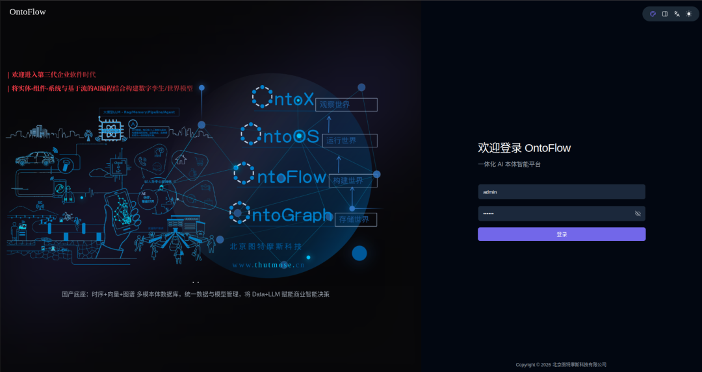
**产品定位**

- 本体智能应用开发平台，不是建模设计工具
- 可落地、可运行、可发布，不是 Demo，也不是知识图谱展示
- 1 人业务 + 1 人开发即可推进，不必按传统软件项目堆人
- 用工作「流程」开发应用，AI 辅助直至逐步替代手工开发
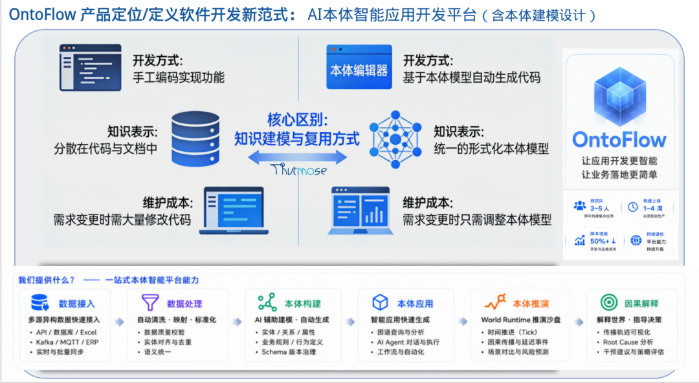
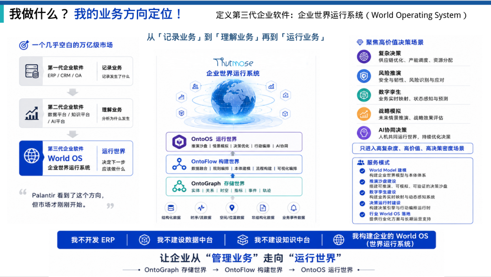
**你能用它做什么**

能力

说明

对话与智能体

问答、问数、挂载知识与业务技能，发布给业务人员直接使用

数据到本体

多源接入 → 清洗处理 → 对象/关系/规则建模 → 写入本体库

查询即应用

一条本体查询同时给页面、接口、Skill、MCP 使用

先推演再决策

在隔离世界里看清行动的因果影响，再决定是否执行

孪生监控与问数

把本体运行状态做成可交互大屏，支持智能问数

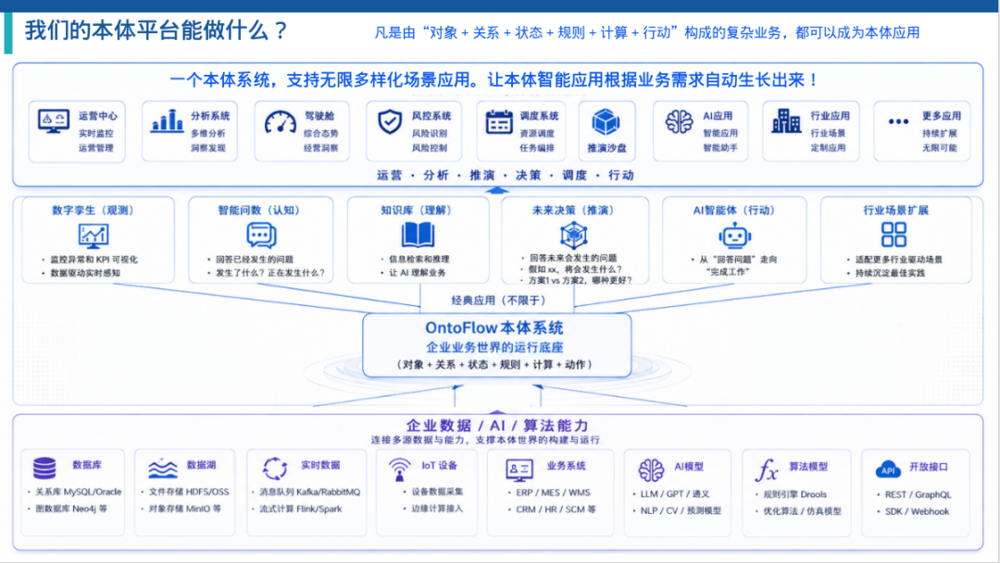
## 一、探索

统一 AI 工作台。用自然语言描述目标，即可问答、问数，并进入建模、摄取、推演或孪生继续作业。

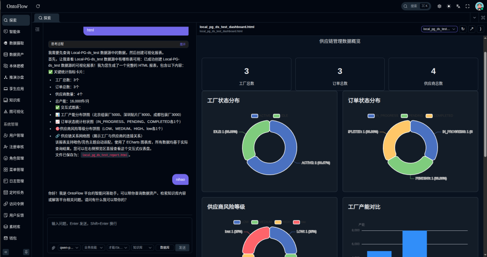
- 多轮会话，记住上下文，长对话可持续推进
- 按任务切换大模型，按需挂载知识库、数据表、本体技能和外部工具
- 适合知识问答、智能问数、业务分析、方案推演和日常助手
## 二、智能体

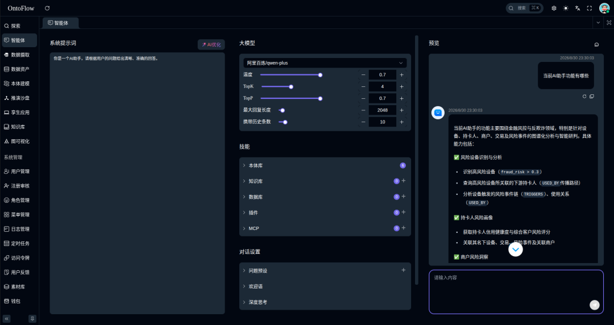
把大模型、企业知识和本体技能打成可发布的业务助手。配置完成即可独立运行，业务人员不必进入后台。

- 独立设定提示词、模型与对话参数
- 按需挂载知识库、本体技能、MCP 与插件工具
- 一键生成运行链接，可嵌入门户、OA 或移动端
- 适合智能客服、知识助手、问数 Bot 和业务流程代理
## 三、数据摄取

把企业内外部数据纳入统一接入，是后续资产盘点和本体建模的起点。

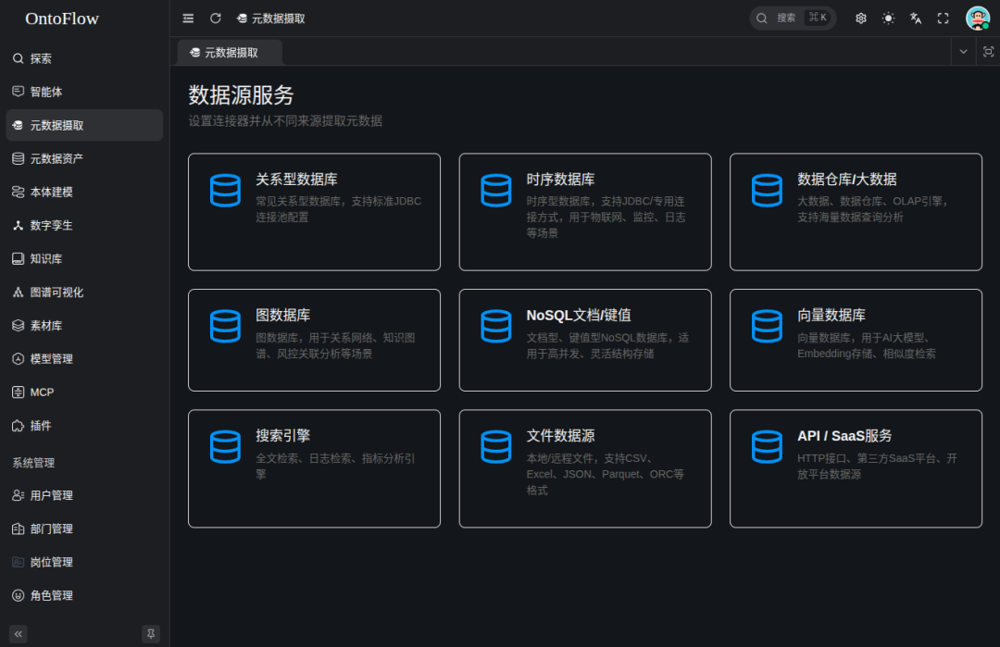
- 覆盖关系库、时序/数仓、文件、接口、消息队列与实时通道
- 连接后自动采集表结构、字段与关系，写入统一资产目录
- 图形化配置，无需手写接入代码
## 四、数据资产

已接入数据的统一目录，方便发现、理解和选用。

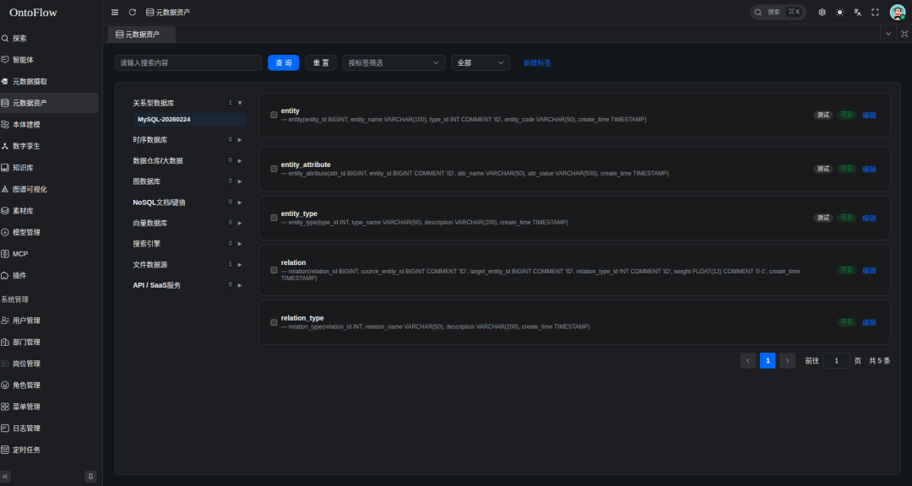
- 按来源分类浏览，支持表名、字段、注释全文检索
- 查看字段说明、样例与关联，直接作为本体建模的数据来源
- 适合数据盘点、数据发现和新同事快速上手
## 五、本体建模

平台核心。以可视化工作流程把业务运行闭环逻辑展示出来，具备可解释性和可操作性，从原始数据到可运行的本体应用过程一目了然：**一个流程 = 一个软件**。

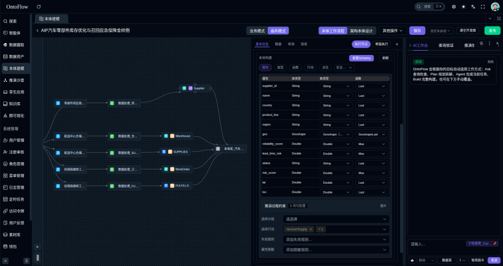
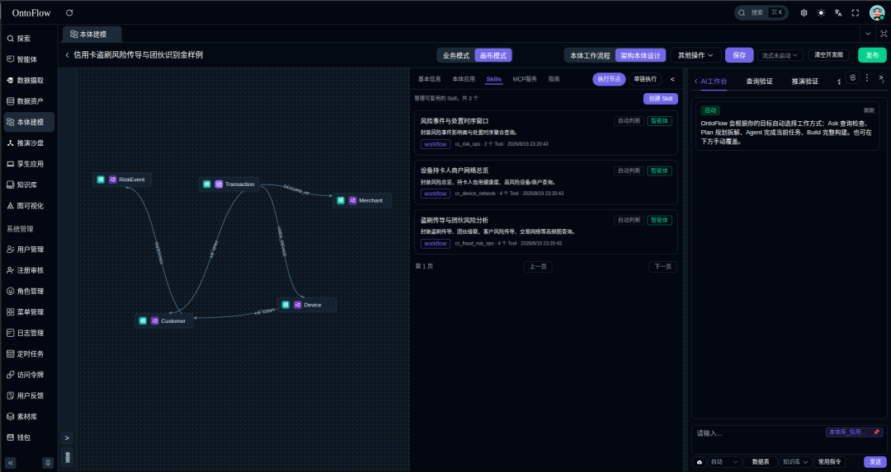
固定走完一条链路即可交付：

- **数据源表**：选用已接入的库表、文件、接口或消息，配置定时或实时供数
- **数据处理**：描述清洗、关联、标准化目标，AI 辅助生成处理逻辑并试运行
- **子图建模**：映射对象、关系、属性，配置派生规则与可执行行动
- **本体库**：多子图合并入库，带上权限、视野与脱敏
- **本体应用**：把高频业务逻辑做成可复用功能，发布为 Skill / 接口 / MCP
画布内置 AI 助手，可用自然语言辅助生成配置与代码。同一条查询可同时被探索、智能体、推演沙盘和孪生应用使用。

适合企业知识图谱建设、行业本体应用、数字孪生与决策推演的数据底座。

已落地/正在实施的本体项目概览：

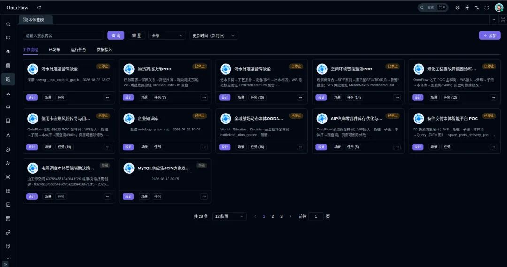
正如开篇所述：OntoFlow不限制行业应用，只取决于你的想象力，把业务映射到“本体论”方法论中，OntoFlow作为一个强大的OS支撑落地。

## 六、推演沙盘

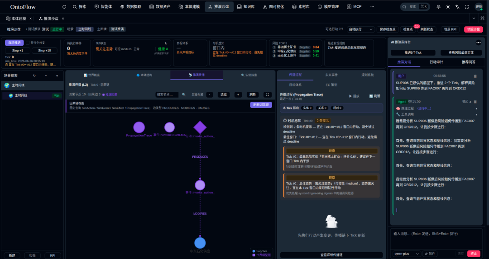
以已经构建的本体应用作为依据，基于世界模型架构运行推演，理清因果影响，提供未来决策的真实反馈。

- 按业务范围克隆对象与关系，形成可推演的世界状态
- 对设备、资产、组织、供应链等施加行动，观察影响如何层层传导
- 支持检查点、分支对比和推演问数，判断方案是否可信
- 适合故障处置、风险传导、库存应急、作战与应急决策
## 七、孪生应用

以已经构建的本体库作为功能来源，可视化实时运行状态，形成可交互、可询问（基于本体的高准确率智能问数）的数字孪生应用。

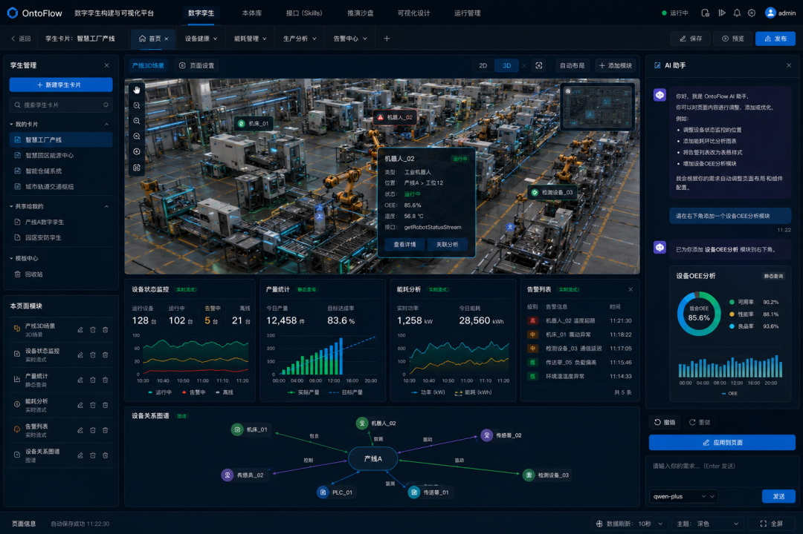
- 拖拽搭建指标、趋势、告警、图表与场景视图
- 组件直接绑定本体查询，数据变化即时反映到画面
- 运行页支持智能问数与 BI 下钻，一键发布为独立页面
- 适合运营监控、态势感知、领导驾驶舱和业务孪生看板
## 八、知识库

企业文档知识底座，与结构化本体配合使用：文档管经验，本体管对象计算。

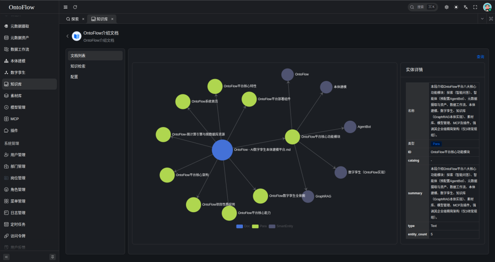
- 支持 PDF、Word、Markdown 等批量上传与解析
- 智能切分并建立多层索引，混合检索优于单一向量搜索
- 可直接挂到探索和智能体，与本体技能同时使用
- 适合规章制度问答、产品手册检索、技术文档与合规知识管理
## 九、图可视化

用节点和关系查看本体库，核对建模是否符合业务。

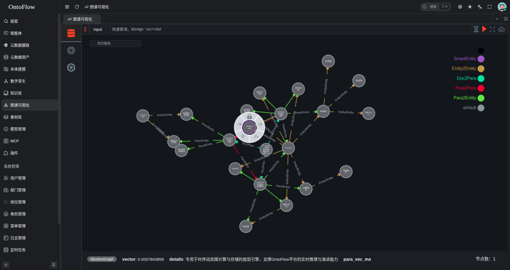
- 选择本体，按对象/关系筛选，点选查看属性并沿关系展开
- 支持表单探索、全文检索和专业图查询
- 适合图谱内容探索、关系路径分析和建模结果验收
## 十、系统设置

接入100+大模型厂商、MCP 与插件，管理用户角色、访问令牌、定时任务、操作日志。一次配置，探索、智能体、知识库和工作流全局复用。OntoFlow的功能可以开放出去，外面的功能也可以接入进来。

## 平台架构

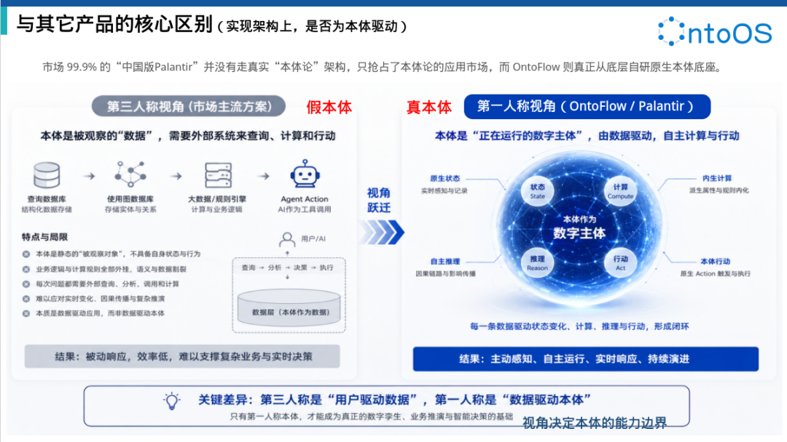
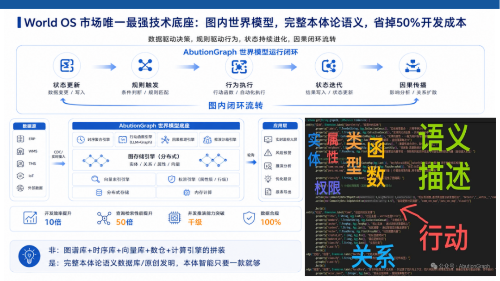
OntoFlow基于自研 OntioGraph（原AbutionGraph）本体数据库-底座

极简轻量化技术架构（只需要部署和运维这一个底座）。以原生本体模型为中枢：接数据（端到端流式）出智能应用。企业知识不再停在文档和数据库里，而是成为可查询、可推理、自更新、可驱动决策的运行资产。

## 了解与交流

- **OntoGraph** - 原生本体数据库（原AbutionGraph）-底座：自研首发于2019，曾开源两年，部署即拥有能力（可当工具箱）：分布式·流式计算·时序·空间·向量·图谱·TP+AP·类型·函数·行动·派生·权限·视野·脱敏·传播·时间演化·TTL·LLM·Skill·MCP…，覆盖Palantir底层，超轻量拿来就用。
- **OntoFlow** - 本体智能应用开发平台-后端：AI低代码应用开发，实时呈现业务效果，构建完成即交付。
- **OntoOS** - 本体推演决策平台-前端：世界模型架构，为决策前提供可靠因果影响。
- **OntoX** - 本体孪生可视化平台-前端：本体库业务运行状态监控。
> 🔹 **作者简介**：北京图特摩斯科技 - 闭雨哲 - 产品发明者，合作/入群交流+：biiyuzhe
