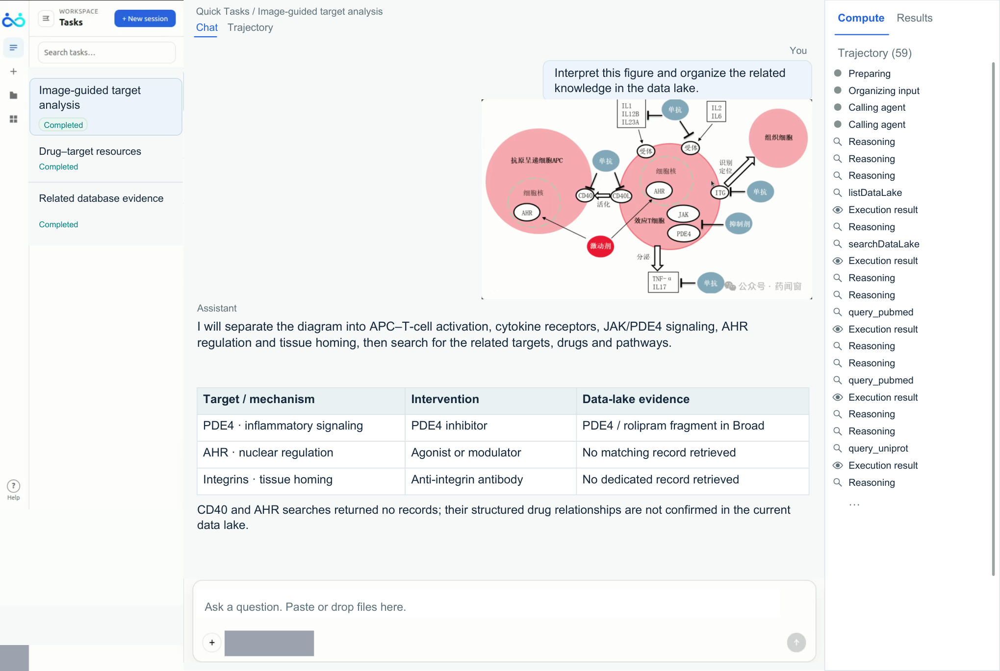
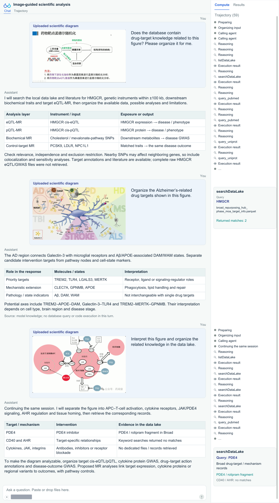
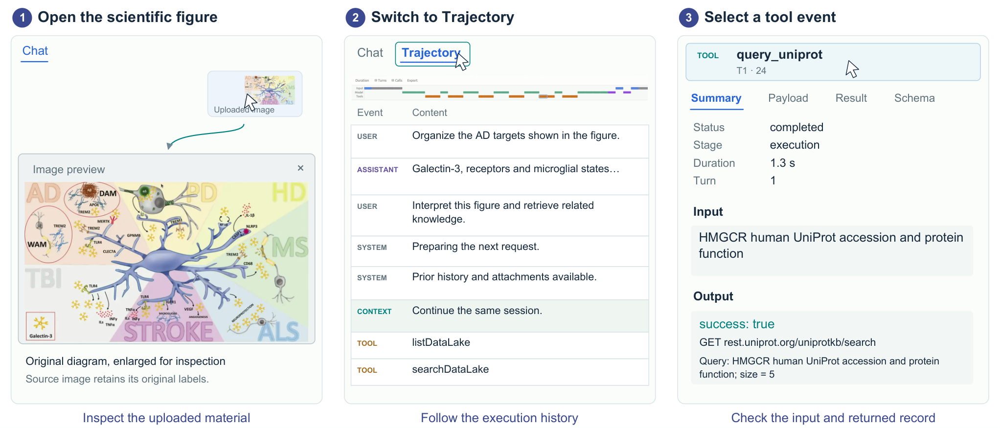

## 3 科学工作空间与用户体验

**科学范围。** ScienceBuddy 在一个共享的科学工作空间内，将多模态输入、长上下文智能体式推理与研究人员交互结合在一起。其文档处理与执行接口支持多个科学领域，而当前的工具与数据则专攻生物医学。下面这段被记录的会话展示了研究人员如何将可视化的科学素材与目标分析、证据检索以及进一步的问题联系起来。

**多模态输入与证据检视。** 研究人员可以在自然语言请求的同时，提供文档、表格、生物序列与图像。在图 4 中，一张上传的免疫信号通路示意图引导了对分子靶标的识别，以及对相关药物与通路知识的组织。响应将可视化实体与一个证据表格联系起来，区分出被检索到的 PDE4/rolipram 片段，以及返回了无匹配结果的 CD40 与 AHR 检索。对话、输入编辑器与 Compute 面板将科学素材、响应与执行历史汇集到一个可检视的视图中。原始的界面截图见第 7.5 节。

*图 4：用于多模态科学分析的工作空间。一名研究人员提供一张科学示意图并请求相关知识。Chat 视图将视觉解释与一个结构化的"靶标—证据"表格联系起来，而 Compute 面板则暴露执行记录。被检索到的证据与可用数据中的缺口对研究人员保持可见。界面文本与对话系根据录制内容以英文重建；上传的图示保留其原始外观与语言。账户与模型标识被遮蔽。*

**长上下文智能体式推理。** 图 5 追踪了一个连续会话中的三条基于图像的请求：一张 HMGCR 孟德尔随机化示意图、一个与阿尔茨海默病相关的微胶质网络，以及一张免疫信号示意图。智能体通过推理、检索与综合来解释每张图像；后段的执行显式地恢复了同一会话，并保留此前的交流。轨迹记录了反复的数据湖检索以及文献/蛋白质查询；中间的响应则没有发起新的数据库查询，而是使用了模型自身的知识。

*图 5：多模态输入、长上下文智能体式推理与研究人员交互。三条连续的、基于图像的请求在一个连续的科学会话中引导靶标分析。上传的示意图、智能体的解释与证据表格与录制的执行历史配对呈现，展示了研究人员的主导方向与保留的上下文如何将一轮轮的工作连接起来。所提议的分析并非实际执行的实验。英文对话与界面系根据录制片段重建；上传的图示保留其原始语言，省略的事件被标注，标识被遮蔽。*

**研究人员交互。** 研究人员通过引入新的示意图、改变科学关注点以及显式请求数据库证据来主导工作。连续的响应组织靶标、区分通路与细胞状态标记，并识别出进一步分析所需的数据。被保留的对话与证据支撑着后续请求，以及任务目标与评估标准的推导（第 2.2 节）。

**通过界面控件进行的研究人员检视。** 研究人员交互还包括超出对话输入的导航与检视操作（图 6）。在演示中，研究人员以更大尺度打开一张上传的示意图，从 Chat 切换到 Trajectory，并选择某个工具事件以检视其元数据、输入与输出。所选的 UniProt 事件暴露了一次较早的 HMGCR 查询，而后面的请求仍处在同一会话中。这些控件使研究人员能够检查源素材、跟踪执行历史，并在不开启新对话的情况下重新追溯某个响应的依据。

*图 6：超越对话的研究人员检视。打开一张上传的图像揭示其科学细节；切换到 Trajectory 暴露执行历史；选择一个工具事件则打开其输入、输出与元数据。该示例在同一连续会话中重新追溯了一次较早的 HMGCR 蛋白查询。英文界面重建突出了录制中所使用的控件；上传的示意图与时间线保留源像素。光标标记指示被检视的控件。*
