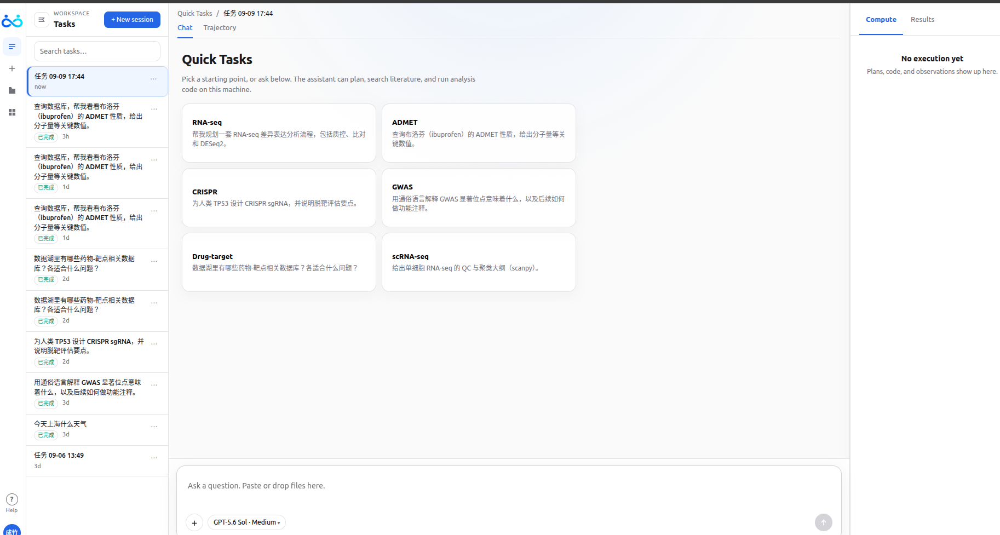
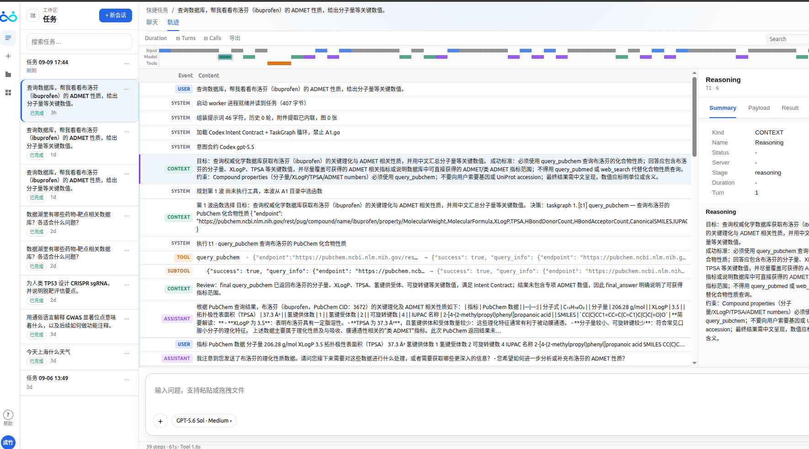

## 7 实现细节

本附录将案例研究与正文所描述的科学工作空间及递归中递归框架联系起来。我们将固定模型的工具链演进运行，与固定工具链下的模型学习案例区分开来。角色规格描述了这些组件的信息边界与规程职责；策略目标则展示了模型学习如何契合完整的递归过程。

### 7.1 数据集与环境

**任务构成。** 这 895 个任务的集合包含 96 个 LitQA2、511 个 DbQA、108 个 ProtocolQA 与 180 个 GWAS 任务。LitQA2 与 ProtocolQA 各有 1 个子主题，DbQA 有 10 个，GWAS 有 4 个，共计 16 个子主题。表 1 报告了每个子主题的任务数量以及每个任务族的总数。

| 任务族 | 子主题 | 数量 |
| --- | --- | --- |
| LitQA2 | 科学文献阅读 | 96 |
| DbQA | 疾病—基因关联 | 39 |
|  | 基因定位 | 40 |
|  | miRNA 靶标 | 40 |
|  | 小鼠肿瘤基因集 | 80 |
|  | 致癌特征 | 40 |
|  | 转录因子结合（GTRD） | 40 |
|  | 变异注释：单序列 | 80 |
|  | 变异注释：多序列 | 72 |
|  | 疫苗响应基因集 | 40 |
|  | 病毒蛋白相互作用 | 40 |
|  | 小计 | 511 |
| ProtocolQA | 实验方案排错 | 108 |
| GWAS | 因果基因：GWAS Catalog | 42 |
|  | 因果基因：Open Targets | 45 |
|  | 因果基因：PharmaProjects | 50 |
|  | 变异优先级排序 | 43 |
|  | 小计 | 180 |
| 合计 | 16 个子主题 | 895 |

**任务集的角色。** 在独立的工具链案例研究中，适配对话引导规程修订与工具链选择。初始工具链与在该适配集上所选的工具链，随后在一个独立的验证集上进行比较。模型学习案例在相同面板、初始工具链下比较两个模型检查点，每个问题尝试四次。数据集计数描述的是任务清单；为工具链适配报告的 288 段对话描述的是已执行的适配流。第 4.1 节中真实的研究人员交互，则独立地展示了科学请求与后续需求如何定义任务上下文与准则。

### 7.2 工具链演进

**模型与调度。** 所报告的工具链运行使用一个固定的 Qwen3.5-4B 任务模型。一个固定的 Qwen3.8-27B 辅助模型支撑有界的用户模拟与反馈解释，而 GPT-6 Astra 提出工具链编辑。在每批 12 个任务对话之后，用户反馈与执行证据引导一次更新，从而在 288 段适配对话上产生 24 次更新。这些对话提供了用于工具链精化的反馈。验证任务被保留用于比较初始工具链与适配所选工具链。

**可编辑的规程。** 通用工具链接口允许对指令、技能以及选定的上下文管理进行更新（第 2.1 节）。所报告的案例研究将适配限制为单文件工具链中的指令与限定范围技能文本。执行循环、Python 工具接口、上下文处理、输入检查设置、提交检查与预算保持固定。H0 起始时不带新增的指令或技能条目；H24 包含四条指令条目与九个限定范围技能。每次采样执行一个固定的源快照，其工具链版本保留在轨迹中。下面的角色规格保持了相同的"仅指令/技能"编辑边界。

**修订与检查点选择。** 所提议的指令或技能修订通过组件校验与一次固定的执行预检（preflight）。在适配集上表现最好的工具链被选用于验证比较；验证得分并不引导修订或检查点选择。在验证集上，所选工具链达到 51.1% 的正确率，而初始工具链为 31.1%。这一独立实验的选择协议，不同于耦合周期实验中的、基于验证的工具链选择。

**模拟反馈。** 模拟器接收正确性与提交状态的判定，并为该任务族选择一个被允许的回复。正确答案会收到确认，缺失的提交会收到格式请求，错误答案会收到规程检查或修订请求。回复集合排除了正确选项、标识符与数值答案。反馈解释器看到回复及其公开对话上下文，但看不到私有判定或答案。它将回复分类为接受、纠正、新信息、新需求或歧义，并记录一段支撑性引用与一个诊断得分 $q_{t}\in\{-1,0,+1\}$。这些有界的回复提供了受控的规程反馈；第 4.1 节中的真实研究人员交互展示了更广阔的协作场景。

**诊断反馈与优化奖励。** 得分 $q_{t}$ 记录了一次后续输入与前述响应之间的关系，并支撑工具链诊断。解释器规格中名为 `reward` 的字段表示这一诊断得分。策略优化则改用公式 (6) 中独立评估得到的轨迹奖励 $R_{x}(\tau)$。研究人员反馈可以在评估之前为一个任务的目标与准则提供信息；它并不替代针对这些标准对所得采样轨迹的评估。下面的 GRPO 优势由 $R_{x}(\tau)$ 定义，而不是通过替换解释器的三元得分得到。表 2 概括了这些信息边界。

| 角色 | 公开上下文 | 用户下一步回复 | 私有答案 | 验证者判定 |
| --- | --- | --- | --- | --- |
| 任务策略 | 可见前缀 | 响应之后 | 隐藏 | 经由有界用户反馈 |
| 用户模拟器 | 审阅上下文 | 产生回复 | 隐藏 | 正确性与提交状态 |
| 反馈评审者 | 先前上下文 | 观测到的回复 | 隐藏 | 隐藏 |
| 工具链反射器 | 父本的公开轨迹 | 观测到的回复 | 隐藏 | 评估摘要 |
| 科学验证者 | 所需输出 | 非必需 | 私有访问 | 产生判定 |
| 策略学习者 | 被记录的策略输入 | 不回填 | 不在提示中 | 轨迹奖励 $R_{x}(\tau)$ |

**反思记录与解释。** GPT-6 Astra 接收近期的任务轨迹、活跃规程、准则反馈以及相关编辑历史，排除私有答案与评估者内部信息。每次诊断将一个未被满足的标准关联到支撑性的动作或观察，以及一个被提议的规程编辑。优化器记录父本、候选、模型与环境版本、评估条件与接受决策。被拒绝的编辑仍可用于后续诊断；被存储的版本是决策的历史，而非用于父本采样的"前沿"。学习曲线描述的是在固定模型权重下、连续规程修订的综合效应。单个技能与反馈来源各自的效应并未被单独隔离。

**角色提示规格。** 以下简洁的规格解释了工具链演进案例研究的任务接口、信息边界与编辑范围。它们是对这些角色的解释性描述，而非逐字节归档的请求负载。具体的请求还会提供任务输入、对话记录、被允许的回复、父本工具链以及运行时的编辑模式（schema）。私有的参考答案始终位于策略与提议者的输入之外。

**任务策略。** 你是一个运行于 Science Buddy 中的科学助手。你可以推理，并在一个持久的 REPL 中使用 Python。公开输入位于 `/workspace/assets`。包括序列在内的原始任务位于 `/workspace/assets/task_prompt.txt`。请从该文件读取长序列，而不是将其复制进生成的代码中。请使用下面列出的确切公开文件名。Python 代码必须打印结果；裸表达式不会被显示。科学工具/数据描述位于 `/opt/scitrace/TOOLS.md` 与 `/opt/scitrace/DATA.md`。可用的冻结数据湖以只读方式挂载于 `/opt/data/biomni_data/data_lake`。在声称拥有数据库证据之前，请检查哪些文件与记录确实存在。对于工具调用，请输出一个 `<execute>Python 代码</execute>` 块并等待其结果。否则，请用简要解释与一个 `<answer>值</answer>` 标签回复研究人员。除非你确实这样做过，否则不要声称自己检视了证据或执行了代码。请回应研究人员的下一条回复，并在有理由时修订你的工作。

**用户模拟器。** 角色扮演一名审阅助手*实际*响应的研究人员。这是一个有界的、借助参考辅助的用户模拟器，而非不受限的专家反馈或人类轨迹。请根据对话，从 `allowed_replies` 中选择最有用的、适用的回复。这些选项请求检查或确认完成；没有任何一个会指出正确的任务答案。不要添加科学主张、候选名称、数值结果或超出被允许回复的事实。私有的正确性判定针对所选答案，而非解释中的每一句话。请返回 JSON，其中 `reply` 等于某个被允许的回复，`done` 等于 `answer_correct`。

**反馈解释器。** 你为一个交互式科学助手解释反馈，用于轨迹诊断。请以用户的*下一条回复*作为关于助手*前一条响应*的证据。你不会收到参考答案或终端验证者得分。不要去猜。对于显式接受/确认记为 +1；对于由错误、遗漏或未满足的先前需求所引起的纠正或重做请求记为 -1；对于新需求、新提供的信息、不相关的后续或证据不足记为 0。一次成功的工具调用并非用户认可。要求重新检查或修订同一答案，或提供已被请求过的答案格式，属于纠正（-1），而非正向进展或新需求。请判断反馈*说了什么*，而不是判断用户在科学上是否正确。仅返回 JSON，包含 `reward`（-1, 0, 1）、`feedback_type`（acceptance, correction, new_information, new_requirement, ambiguous）、`evidence`（用户回复的一段*精确*子串），以及 `hint`（一条简要的可复用改进方向，在不支撑时为空）。`reward` 字段是诊断性反馈得分，而非用于策略优化的轨迹奖励。

**工具链提议者：仅指令/技能的编辑。** 利用所提供的父本工具链与交互证据，改进科学助手的指令或限定范围技能。识别一个未被满足的标准，引用相关的动作或观察，并提出一项有界的规程变更：修订一条指令，或新增、移除、修订一个限定范围技能。保留所有非目标条目与运行时设置。请使用所提供的运行时模式（schema）与编辑约束返回修订后的工具链；除非某条目是所提议变更的目标，否则保留现有技能。不要更改上下文历史设置、输入检查设置、工具、执行基础设施、提交检查、预算、准则或评估者。一个完整的序列化工具链代表的是局部编辑，而非重写每个组件的许可。不要在没有新的支撑证据的情况下重复被拒绝的编辑。不要编码任务专属答案、数值结果或样本 ID。一次成功的工具调用并不能证明科学正确性；新提供的信息未必是一个错误。

### 7.3 强化学习

**案例研究配置。** 任务主干为 Qwen3.5-4B。在第 4.4 节中，初始工具链 H0 在整个模型训练与评估过程中保持固定。两个模型检查点在相同的问题上、每个问题尝试四次进行评估，因此前后比较考察的是在通用规程接口下的模型学习。GPT-6 Astra 是工具链适配（第 7.2 节）的诊断/编辑模型；这一固定 H0 的案例不会启动新的工具链适配阶段。它阐明了可以与完整框架中的工具链精化相协调的、模型学习这一组件。

**评估度量。** 训练准确率统计被正确求解的尝试。评估覆盖率以 pass@4 衡量，即若一个问题的四次尝试中至少有一次成功，则计为该问题被解决。后者在相同尝试预算下比较已解问题的广度，不同于工具链案例中所用的首次响应准确率。所报告的覆盖率在 H0 下从 48.3% 升至 67.8%。下面的目标在此递归框架内形式化了这一模型学习步骤。

**新鲜采样组。** 我们使用通用递归框架的记号来表达模型学习组件。在外层阶段 $k$，所选工具链 $H_{k}^{\star}$ 保持固定，而任务模型被优化。第 4.4 节中的纯模型案例在整个比较过程中将该工具链保持在 H0。该案例研究实例化了一个固定工具链的模型学习步骤，而第 2.4 节描述了如何在各周期中纳入所选工具链与经过验证的任务环境。对于每个采样批次，当前任务策略的一个冻结副本 $\pi_{\mathrm{old}}$ 为每个任务生成 $G$ 条轨迹。记录将模型输入、生成的 token、行为对数概率、任务与准则版本，以及工具链标识符与每条轨迹关联起来。新鲜采样组为下面的目标提供数据；而历史研究人员交互则支撑任务定义与规程诊断。当一个批次被复用于若干优化轮次时，概率比值仍相对于其原始收集策略。

**组相对策略目标。** GRPO 公式（Shao et al., 2024）使用 token 级平均。对于轨迹 $i$，令 $r_{i}=R_{x_{i}}(\tau_{i})$ 表示其被评估的轨迹奖励（不同于诊断反馈得分 $q_{t}$），并令 $\mathcal{G}(i)$ 包含在同一工具链与准则下、为同一任务生成的轨迹。组相对优势为

$$\widehat{A}_{i}=\frac{r_{i}-\operatorname{mean}_{j\in\mathcal{G}(i)}r_{j}}{\operatorname{std}_{j\in\mathcal{G}(i)}r_{j}+\delta},\qquad\delta>0.$$

一条轨迹中的所有生成 token 共享这一优势。奖励相同的组具有零策略梯度优势。研究人员消息、工具输出、任务指令与确定性工具链动作被排除在优化 token 之外。对于生成的 token $b_{i,\ell}$ 及其实际上下文 $c_{i,\ell}$，定义

$$\rho_{i,\ell}(\theta)=\frac{\pi_{\theta}(b_{i,\ell}\mid c_{i,\ell})}{\pi_{\mathrm{old}}(b_{i,\ell}\mid c_{i,\ell})}.$$

对于一个由完整组构成的 minibatch $\mathcal{M}$，轨迹 $i$ 含有 $L_{i}$ 个生成 token，其目标为

$$\mathcal{J}_{k}^{\mathrm{GRPO}}(\theta)=\frac{1}{\sum_{i\in\mathcal{M}}L_{i}}\sum_{i\in\mathcal{M}}\sum_{\ell=1}^{L_{i}}\Big[\min\{\rho_{i,\ell}(\theta)\widehat{A}_{i},\operatorname{clip}(\rho_{i,\ell}(\theta),1-\epsilon,1+\epsilon)\widehat{A}_{i}\}-\beta\widehat{d}_{i,\ell}(\theta)\Big].$$

这里 $\epsilon>0$ 控制裁剪，$\beta\geq 0$ 加权采样的 KL 代理。参考策略 $\pi_{\mathrm{ref}}$ 是外层 RL 阶段开始时任务模型的一个冻结副本。记 $z_{i,\ell}=\pi_{\mathrm{ref}}(b_{i,\ell}\mid c_{i,\ell})/\pi_{\theta}(b_{i,\ell}\mid c_{i,\ell})$，则该代理为 $\widehat{d}_{i,\ell}=z_{i,\ell}-\log z_{i,\ell}-1$。这一采样量在被行为策略 token 上评估；它并不被断言为更新策略下的精确 KL 散度。轨迹奖励在采样之后，根据其输出与任务相关的执行证据计算，且准则与评估者参数在优化过程中保持固定。它不会将后续的评估信息回填到生成较早 token 的上下文中。在模型学习案例研究中，两个检查点都在 H0 下使用通用的 pass@4 协议进行评估。在完整的递归框架中，所得检查点 $\theta_{k+1}$ 回到工具链重新评估与部署，后续的研究人员交互启动下一个周期（第 2.5 节）。因此，同一策略学习公式既服务于固定工具链的比较，也提供了完整递归过程中的模型更新步骤。

### 7.4 具体的研究人员输入

以下节选复现了第 4.1 节中所讨论的范围精化与演示需求。它们提供了图 7 中示意性任务转换背后具体的研究人员措辞。

### 7.5 用户界面与研究人员交互

**Chat 与任务管理。** Chat 视图将任务侧边栏、对话工作空间，以及用于执行活动与生成结果的面板结合在一起（图 12）。研究人员可以创建或重访一个任务、选择一个起始提示，或直接输入一个问题。输入编辑器接受粘贴或上传的文件，并支持在同一对话内进行后续指令。Compute 与 Results 选项卡提供对分析活动与所得产物的访问。

*图 12：ScienceBuddy 中的 Chat 视图。任务侧边栏显示在左侧，起始提示与对话区在中间，Compute 与 Results 选项卡在右侧。输入编辑器支持提问、文件附件与模型选择。此截图展示的是执行前的初始任务视图。*

**轨迹检视。** Trajectory 视图暴露一个任务的有序记录，包括用户消息、系统事件、上下文摘要、工具调用与助手响应（图 13）。一条时间线将输入、模型与工具活动分隔开。选择一个事件会打开一个详情面板，其中包含 Summary、Payload 与 Result 选项卡，用于检视其被记录的内容。搜索与导出控件支撑对记录的审阅，而对话编辑器仍可用于后续输入。

*图 13：ScienceBuddy 中的 Trajectory 视图。时间线与事件记录暴露了一次分析的推进过程，右侧面板显示所选事件的详细信息。截图展示了一段被记录的化合物性质查询、其工具活动、后续对话，以及一个被选中的上下文条目。*

## 组织机构

1. PhAI Labs
2. 复旦大学附属中山医院 肝胆外科及肝移植科，肝癌研究所
3. 复杂表型遗传与发育国家重点实验室
4. 复旦大学
5. 上海自然科学院
6. 顺为资本
7. 牛津大学
8. 斯坦福大学
9. 普林斯顿大学
