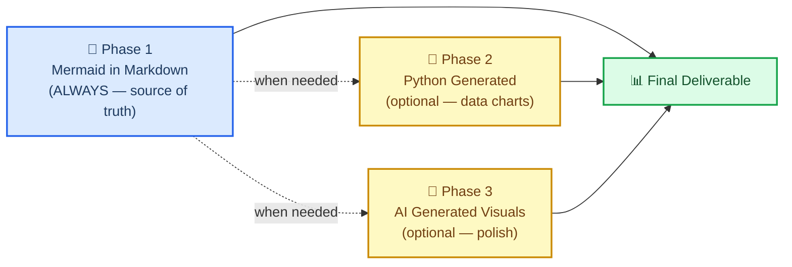
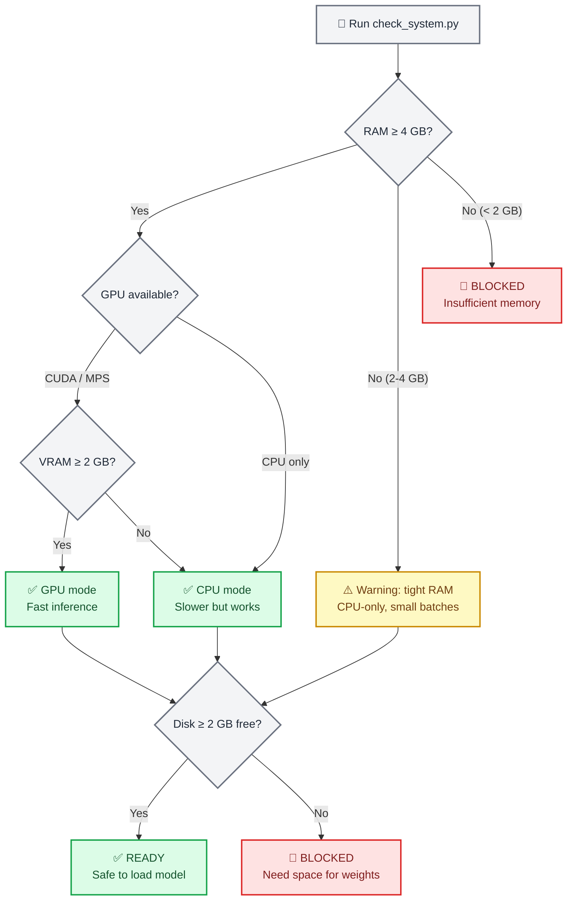
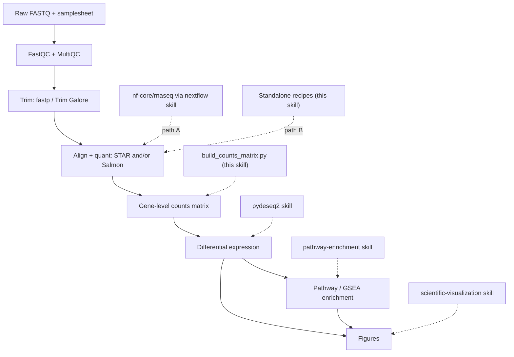

# Scientific Agent Skills 全量目录与最佳实践

> 生成时间：2026-09-07  
> 来源：`d:\projects\scientific-agent-skills`（共 163 个 skill）  
> 说明：每个 skill 含功能描述、使用场景、核心能力、使用方案与 2 个使用范例；范例优先采用 SKILL.md 内真实代码示例，缺失时给出场景化示例。

## 总览

本文档覆盖 **163** 个科研 agent skill，按领域分为 **9** 类：

- **假设生成与科研方法论**（3 个）：`consciousness-council`、`hypothesis-generation`、`what-if-oracle`
- **其他科学工具**（1 个）：`usfiscaldata`
- **化学信息学与药物发现**（9 个）：`cobrapy`、`datamol`、`deepchem`、`medchem`、`molfeat`、`pkpd-modeling`、`pymatgen`、`pytdc`、`rdkit`
- **实验自动化与云平台集成**（4 个）：`benchling-integration`、`experimental-design`、`labarchive-integration`、`latchbio-integration`
- **影像、显微与空间分析**（3 个）：`geopandas`、`imaging-data-commons`、`openpiv`
- **数据标准、格式与可复现性**（2 个）：`bids`、`treatment-plans`
- **文献调研与知识管理**（57 个）：`arbor`、`bgpt-paper-search`、`citation-management`、`clinical-decision-support`、`clinical-reports`、`database-lookup`、`docx`、`exa-search`、`fluidsim`、`generate-image`、`geomaster`、`hugging-science`、`hypogenic`、`infographics` …
- **机器学习与科学计算**（33 个）：`aeon`、`astropy`、`autoskill`、`cirq`、`dask`、`get-available-resources`、`lab-hardware-cad`、`modal`、`optimize-for-gpu`、`pennylane`、`pi-agent`、`polars`、`pymoo`、`pytorch-lightning` …
- **生物信息学与组学**（51 个）：`adaptyv`、`analytical-method-validation`、`anndata`、`arboreto`、`biopython`、`bioservices`、`bulk-rnaseq`、`cellxgene-census`、`deepspot-m`、`deeptools`、`depmap`、`dhdna-profiler`、`diffdock`、`dnanexus-integration` …


---

## 假设生成与科研方法论（3 个）

### `consciousness-council`

**功能描述**：Run a multi-perspective Mind Council deliberation on any question, decision, or creative challenge. Use this skill whenever the user wants diverse viewpoints, needs help making a tough decision, asks for a council/panel/board discussion, wants to explore a problem from multiple angles, requests devil's advocate analysis, or says things like "what would different experts think about this", "help me think through this from all sides", "council mode", "mind council", or "deliberate on this". Also trigger when the user faces a dilemma, trade-off, or complex choice with no obvious answer.

**使用方案**：
1. **明确目标**：界定本次任务要解决的科研问题与交付物（数据、图表、报告或模型）。
2. **准备环境**：依据 skill 的 Installation 章节安装依赖 / 配置 API Key（如 NCBI、OpenRouter 等）。
3. **调用能力**：按其 Core Capabilities 选择子模块，处理输入数据或发起检索。
4. **校验结果**：检查输出完整性、引用准确性与可复现性，必要时回退重试。
5. **串联下游**：将结果交给可视化 / 写作 / 实验执行类 skill，形成端到端流水线。

**使用范例**：

**范例 1（真实调用示例）**

```text
🎭 [ARCHETYPE NAME]

Position: [One-sentence stance]

Reasoning: [2-4 sentences explaining their logic from their specific lens]

Key Risk They See: [The danger others might miss]

Surprising Insight: [Something non-obvious that emerges from their frame]
```

**范例 2（真实调用示例）**

```text
⚖️ COUNCIL SYNTHESIS

Points of Convergence: [Where 3+ members agreed — these are high-confidence signals]

Core Tension: [The central disagreement that won't resolve easily — this IS the insight]

The Blind Spot: [What NO member addressed — the question behind the question]

Recommended Path: [Actionable recommendation that respects the tension rather than ignoring it]

Confidence Level: [High / Medium / Low — based on how much convergence vs. divergence emerged]

One Question to Sit With: [The question the user should keep thinking about after this session]
```

---

### `hypothesis-generation`

**功能描述**：Formulate evidence-bounded scientific questions, candidate hypotheses, rival explanations, causal or associational claims, discriminating predictions, measurements, and preregistration-ready analysis plans. Use when turning observations or preliminary findings into transparent, testable research plans without treating hypotheses as facts.

**使用方案**：
1. **明确目标**：界定本次任务要解决的科研问题与交付物（数据、图表、报告或模型）。
2. **准备环境**：依据 skill 的 Installation 章节安装依赖 / 配置 API Key（如 NCBI、OpenRouter 等）。
3. **调用能力**：按其 Core Capabilities 选择子模块，处理输入数据或发起检索。
4. **校验结果**：检查输出完整性、引用准确性与可复现性，必要时回退重试。
5. **串联下游**：将结果交给可视化 / 写作 / 实验执行类 skill，形成端到端流水线。

**使用范例**：

**范例 1（真实调用示例）**

```bash
python3 scripts/check_operationalization.py local-operationalization.json
```

---

### `what-if-oracle`

**功能描述**：Run structured What-If scenario analysis with 4–6 branch possibility exploration (best, likely, worst, wild card, contrarian, second-order). Use when the user asks speculative what-if questions about uncertain futures, strategic forks, contingency planning, or stress-testing a decision before committing.

**使用场景（功能）**：
- Asks "what if…", "what would happen if…", or "explore the possibilities"
- Faces a fork-in-the-road decision with no obvious answer
- Wants best-case / worst-case / likely-case analysis with probabilities
- Needs contingency planning, risk mapping, or strategic option comparison
- Wants to stress-test an idea or think through second-order consequences

**使用方案**：
1. **明确目标**：界定本次任务要解决的科研问题与交付物（数据、图表、报告或模型）。
2. **准备环境**：依据 skill 的 Installation 章节安装依赖 / 配置 API Key（如 NCBI、OpenRouter 等）。
3. **调用能力**：按其 Core Capabilities 选择子模块，处理输入数据或发起检索。
4. **校验结果**：检查输出完整性、引用准确性与可复现性，必要时回退重试。
5. **串联下游**：将结果交给可视化 / 写作 / 实验执行类 skill，形成端到端流水线。

**使用范例**：

**范例 1（真实调用示例）**

```text
╔══════════════════════════════════════════════╗
║  BRANCH: [Ω/α/Δ/Ψ/Φ/∞] — [Branch Name]    ║
╠══════════════════════════════════════════════╣
║  Probability: [X%]                           ║
║  Timeframe: [When this could materialize]    ║
║  Confidence: [HIGH/MEDIUM/LOW]               ║
╠══════════════════════════════════════════════╣
║  NARRATIVE:                                  ║
║  [2-3 sentences describing how this          ║
║   scenario unfolds step by step]             ║
║                                              ║
║  KEY ASSUMPTIONS:                            ║
║  • [What must be true for this to happen]    ║
║  • [And this]                                ║
║                                              ║
║  TRIGGER CONDITIONS:                         ║
║  • [Early signal that this branch is         ║
║    becoming reality]                         ║
║  • [Second signal]                           ║
║                                              ║
║  CONSEQUENCES:                               ║
║  → Immediate: [What happens first]           ║
║  → 30 days: [What follows]                   ║
║  → 6 months: [Where it leads]               ║
║                                              ║
║  REQUIRED RESPONSE:                          ║
║  [What action to take if this branch         ║
║   activates — specific, actionable]          ║
║                                              ║
║  WHAT MOST PEOPLE MISS:                      ║
║  [The non-obvious insight about this         ║
║   scenario that conventional analysis        ║
║   would overlook]                            ║
╚══════════════════════════════════════════════╝
```

**范例 2（真实调用示例）**

```text
Ω Best Case ····· [██████░░░░] 15%
α Likely Case ··· [████████░░] 45%
Δ Worst Case ···· [██████░░░░] 20%
Ψ Wild Card ····· [███░░░░░░░]  8%
Φ Contrarian ···· [████░░░░░░]  7%
∞ Second Order ·· [███░░░░░░░]  5%
```

---


---

## 其他科学工具（1 个）

### `usfiscaldata`

**功能描述**：Query the U.S. Treasury Fiscal Data REST API for federal financial data. No API key required. Use for national debt (Debt to the Penny), Daily Treasury Statements, Monthly Treasury Statements, Treasury securities auctions, interest rates, foreign exchange rates, savings bonds, or U.S. government revenue and spending statistics.

**使用方案**：
1. **明确目标**：界定本次任务要解决的科研问题与交付物（数据、图表、报告或模型）。
2. **准备环境**：依据 skill 的 Installation 章节安装依赖 / 配置 API Key（如 NCBI、OpenRouter 等）。
3. **调用能力**：按其 Core Capabilities 选择子模块，处理输入数据或发起检索。
4. **校验结果**：检查输出完整性、引用准确性与可复现性，必要时回退重试。
5. **串联下游**：将结果交给可视化 / 写作 / 实验执行类 skill，形成端到端流水线。

**使用范例**：

**范例 1（真实调用示例）**

```bash
uv pip install requests pandas
```

**范例 2（真实调用示例）**

```python
import requests
import pandas as pd

BASE_URL = "https://api.fiscaldata.treasury.gov/services/api/fiscal_service"

# Get the current national debt (Debt to the Penny)
resp = requests.get(f"{BASE_URL}/v2/accounting/od/debt_to_penny", params={
    "sort": "-record_date",
    "page[size]": 1
})
data = resp.json()["data"][0]
print(f"Total public debt as of {data['record_date']}: ${float(data['tot_pub_debt_out_amt']):,.0f}")
```

---


---

## 化学信息学与药物发现（9 个）

### `cobrapy`

**功能描述**：Constraint-based metabolic modeling (COBRA). FBA, FVA, gene knockouts, flux sampling, SBML models, for systems biology and metabolic engineering analysis.

**使用场景（功能）**：
- Loading, building, or exporting genome-scale metabolic models (SBML, JSON, YAML)
- Running FBA, pFBA, FVA, or flux sampling on COBRA models
- Performing gene or reaction knockout screens and production envelope analysis
- Designing or optimizing growth media and exchange constraints
- Gap-filling infeasible models or validating model consistency

**使用方案**：
1. **明确目标**：界定本次任务要解决的科研问题与交付物（数据、图表、报告或模型）。
2. **准备环境**：依据 skill 的 Installation 章节安装依赖 / 配置 API Key（如 NCBI、OpenRouter 等）。
3. **调用能力**：按其 Core Capabilities 选择子模块，处理输入数据或发起检索。
4. **校验结果**：检查输出完整性、引用准确性与可复现性，必要时回退重试。
5. **串联下游**：将结果交给可视化 / 写作 / 实验执行类 skill，形成端到端流水线。

**使用范例**：

**范例 1（真实调用示例）**

```bash
uv pip install "cobra==0.31.1"
```

**范例 2（真实调用示例）**

```bash
uv pip install "cobra[array]==0.31.1"
```

---

### `datamol`

**功能描述**：Pythonic wrapper around RDKit with simplified interface and sensible defaults. Preferred for standard drug discovery including SMILES parsing, standardization, descriptors, fingerprints, clustering, 3D conformers, parallel processing. Returns native rdkit.Chem.Mol objects. For advanced control or custom parameters, use rdkit directly.

**使用方案**：
1. **明确目标**：界定本次任务要解决的科研问题与交付物（数据、图表、报告或模型）。
2. **准备环境**：依据 skill 的 Installation 章节安装依赖 / 配置 API Key（如 NCBI、OpenRouter 等）。
3. **调用能力**：按其 Core Capabilities 选择子模块，处理输入数据或发起检索。
4. **校验结果**：检查输出完整性、引用准确性与可复现性，必要时回退重试。
5. **串联下游**：将结果交给可视化 / 写作 / 实验执行类 skill，形成端到端流水线。

**使用范例**：

**范例 1（真实调用示例）**

```bash
uv pip install datamol
```

**范例 2（真实调用示例）**

```bash
uv pip install s3fs   # AWS S3
uv pip install gcsfs  # Google Cloud Storage
```

---

### `deepchem`

**功能描述**：Molecular ML with diverse featurizers and pre-built datasets. Use for property prediction (ADMET, toxicity) with traditional ML or GNNs when you want extensive featurization options and MoleculeNet benchmarks. Best for quick experiments with pre-trained models, diverse molecular representations. For graph-first PyTorch workflows use torchdrug; for benchmark datasets use pytdc.

**使用场景（功能）**：
- Loading and processing molecular data (SMILES strings, SDF files, protein sequences)
- Predicting molecular properties (solubility, toxicity, binding affinity, ADMET properties)
- Training models on chemical/biological datasets
- Using MoleculeNet benchmark datasets (Tox21, BBBP, Delaney, etc.)
- Converting molecules to ML-ready features (fingerprints, graph representations, descriptors)
- Implementing graph neural networks for molecules (GCN, GAT, MPNN, AttentiveFP)
- Applying transfer learning with pretrained models (ChemBERTa, GROVER, MolFormer)
- Predicting crystal/materials properties (bandgap, formation energy)
- Analyzing protein or DNA sequences

**使用方案**：
1. **明确目标**：界定本次任务要解决的科研问题与交付物（数据、图表、报告或模型）。
2. **准备环境**：依据 skill 的 Installation 章节安装依赖 / 配置 API Key（如 NCBI、OpenRouter 等）。
3. **调用能力**：按其 Core Capabilities 选择子模块，处理输入数据或发起检索。
4. **校验结果**：检查输出完整性、引用准确性与可复现性，必要时回退重试。
5. **串联下游**：将结果交给可视化 / 写作 / 实验执行类 skill，形成端到端流水线。

**使用范例**：

**范例 1（真实调用示例）**

```bash
# Use Delaney benchmark
python scripts/predict_solubility.py

# Use custom data
python scripts/predict_solubility.py \
    --data my_data.csv \
    --smiles-col smiles \
    --target-col solubility \
    --predict "CCO" "c1ccccc1"
```

**范例 2（真实调用示例）**

```bash
# Train GCN on Tox21
python scripts/graph_neural_network.py --model gcn --dataset tox21

# Train AttentiveFP on custom data
python scripts/graph_neural_network.py \
    --model attentivefp \
    --data molecules.csv \
    --task-type regression \
    --targets activity \
    --epochs 100
```

---

### `medchem`

**功能描述**：Medicinal chemistry filters for compound triage. Apply drug-likeness rules (Lipinski, Veber, CNS), structural alert catalogs (PAINS, NIBR, ChEMBL), complexity metrics, and the medchem query language for library filtering.

**使用场景（功能）**：
- Applying drug-likeness rules (Lipinski, Veber, CNS, lead-like) to compound libraries
- Filtering molecules by structural alerts, PAINS, or NIBR screening-deck rules
- Prioritizing compounds for hit-to-lead or lead optimization
- Calculating complexity metrics against ZINC-derived thresholds
- Detecting functional groups or named substructure catalogs
- Building multi-criteria filters with the medchem query language

**核心能力**：
- `MATCHRULE("rule_of_five")` — apply a named rule
- `HASALERT("pains")` — match a named catalog (`pains`, `brenk`, `nibr`, `tox`, …)
- `HASPROP("mw", <, 500)` — compare a descriptor (unquoted comparator)
- `HASGROUP("privileged_scaffolds")` — match a chemical group
- `HASSUBSTRUCTURE("c1ccccc1")` — substructure match
- Operators: `AND`, `OR`, `NOT`

**使用方案**：
1. **明确目标**：界定本次任务要解决的科研问题与交付物（数据、图表、报告或模型）。
2. **准备环境**：依据 skill 的 Installation 章节安装依赖 / 配置 API Key（如 NCBI、OpenRouter 等）。
3. **调用能力**：按其 Core Capabilities 选择子模块，处理输入数据或发起检索。
4. **校验结果**：检查输出完整性、引用准确性与可复现性，必要时回退重试。
5. **串联下游**：将结果交给可视化 / 写作 / 实验执行类 skill，形成端到端流水线。

**使用范例**：

**范例 1（真实调用示例）**

```bash
uv pip install medchem datamol
```

**范例 2（真实调用示例）**

```bash
mamba install -c conda-forge lilly-medchem-rules
```

---

### `molfeat`

**功能描述**：Molecular featurization for ML (100+ featurizers). ECFP, MACCS, descriptors, pretrained models (ChemBERTa), convert SMILES to features, for QSAR and molecular ML.

**使用场景（功能）**：
- **Molecular machine learning**: Building QSAR/QSPR models, property prediction
- **Virtual screening**: Ranking compound libraries for biological activity
- **Similarity searching**: Finding structurally similar molecules
- **Chemical space analysis**: Clustering, visualization, dimensionality reduction
- **Deep learning**: Training neural networks on molecular data
- **Featurization pipelines**: Converting SMILES to ML-ready representations
- **Cheminformatics**: Any task requiring molecular feature extraction

**使用方案**：
1. **明确目标**：界定本次任务要解决的科研问题与交付物（数据、图表、报告或模型）。
2. **准备环境**：依据 skill 的 Installation 章节安装依赖 / 配置 API Key（如 NCBI、OpenRouter 等）。
3. **调用能力**：按其 Core Capabilities 选择子模块，处理输入数据或发起检索。
4. **校验结果**：检查输出完整性、引用准确性与可复现性，必要时回退重试。
5. **串联下游**：将结果交给可视化 / 写作 / 实验执行类 skill，形成端到端流水线。

**使用范例**：

**范例 1（真实调用示例）**

```bash
uv pip install "molfeat==0.11.0"

# With all pip-installable optional dependencies
uv pip install "molfeat[all]==0.11.0"
```

**范例 2（真实调用示例）**

```python
from molfeat.calc import FPCalculator

calc = FPCalculator("ecfp", radius=3, fpSize=2048)
features = calc("CCO")  # Returns numpy array (2048,)
```

---

### `pkpd-modeling`

**功能描述**：Pharmacokinetic and pharmacodynamic modelling and simulation - non-compartmental analysis, compartmental and population PK, PK/PD and exposure-response, TMDD, PBPK orientation, bioequivalence, allometric scaling and first-in-human dose, drug interaction prediction, and Bayesian therapeutic drug monitoring. Use when analysing concentration-time data, deriving exposure metrics, fitting PK or PD models, or evaluating dosing regimens. Triggers include "pharmacokinetics", "pharmacodynamics", "PK/PD", "NCA", "non-compartmental", "AUC", "Cmax", "lambda z", "half-life", "clearance", "volume of distribution", "compartmental model", "population PK", "popPK", "NONMEM", "nlmixr2", "Pharmpy", "Monolix", "exposure-response", "Emax", "EC50", "indirect response", "effect compartment", "TMDD", "PBPK", "bioequivalence", "RSABE", "ABEL", "allometric scaling", "first-in-human", "MABEL", "drug-drug interaction", "DDI", "ICH M12", "concentration-QTc", "therapeutic drug monitoring", "MIPD", and "dosing regimen".

**使用方案**：
1. **明确目标**：界定本次任务要解决的科研问题与交付物（数据、图表、报告或模型）。
2. **准备环境**：依据 skill 的 Installation 章节安装依赖 / 配置 API Key（如 NCBI、OpenRouter 等）。
3. **调用能力**：按其 Core Capabilities 选择子模块，处理输入数据或发起检索。
4. **校验结果**：检查输出完整性、引用准确性与可复现性，必要时回退重试。
5. **串联下游**：将结果交给可视化 / 写作 / 实验执行类 skill，形成端到端流水线。

**使用范例**：

**范例 1（真实调用示例）**

```bash
cd skills/pkpd-modeling/scripts
```

**范例 2（真实调用示例）**

```bash
python3 nca.py -i profile.csv --dose 100 --route extravascular --partial-auc 0-24
```

---

### `pymatgen`

**功能描述**：Analyze, validate, convert, and transform materials structures and computed materials data with current pymatgen APIs, including local phase diagrams, symmetry sensitivity, electronic-structure I/O, and explicitly bounded Materials Project queries.

**使用方案**：
1. **明确目标**：界定本次任务要解决的科研问题与交付物（数据、图表、报告或模型）。
2. **准备环境**：依据 skill 的 Installation 章节安装依赖 / 配置 API Key（如 NCBI、OpenRouter 等）。
3. **调用能力**：按其 Core Capabilities 选择子模块，处理输入数据或发起检索。
4. **校验结果**：检查输出完整性、引用准确性与可复现性，必要时回退重试。
5. **串联下游**：将结果交给可视化 / 写作 / 实验执行类 skill，形成端到端流水线。

**使用范例**：

**范例 1（真实调用示例）**

```bash
uv init --python 3.11
uv add "pymatgen==2026.5.4" "pymatgen-core==2026.7.16" "mp-api==0.46.4"
uv lock
uv sync --frozen
```

**范例 2（真实调用示例）**

```bash
uv venv --python 3.11 .venv-pymatgen
uv pip install --python .venv-pymatgen/bin/python \
  "pymatgen==2026.5.4" "pymatgen-core==2026.7.16" "mp-api==0.46.4"
```

---

### `pytdc`

**功能描述**：Use Therapeutics Data Commons through the PyTDC Python package for registry discovery, approved dataset access, task-aware splits, evaluator metrics, benchmark groups, and bounded molecular-oracle workflows.

**使用方案**：
1. **明确目标**：界定本次任务要解决的科研问题与交付物（数据、图表、报告或模型）。
2. **准备环境**：依据 skill 的 Installation 章节安装依赖 / 配置 API Key（如 NCBI、OpenRouter 等）。
3. **调用能力**：按其 Core Capabilities 选择子模块，处理输入数据或发起检索。
4. **校验结果**：检查输出完整性、引用准确性与可复现性，必要时回退重试。
5. **串联下游**：将结果交给可视化 / 写作 / 实验执行类 skill，形成端到端流水线。

**使用范例**：

**范例 1（真实调用示例）**

```bash
uv venv --python 3.11 .venv-pytdc
uv pip install --dry-run --python .venv-pytdc/bin/python \
  "setuptools==80.9.0" "PyTDC==1.1.15"
uv pip install --python .venv-pytdc/bin/python \
  "setuptools==80.9.0" "PyTDC==1.1.15"
```

**范例 2（真实调用示例）**

```bash
uv run --python 3.11 \
  --with "setuptools==80.9.0" --with "PyTDC==1.1.15" \
  python scripts/discover_metadata.py --kind tasks
```

---

### `rdkit`

**功能描述**：Cheminformatics toolkit for fine-grained molecular control. SMILES/SDF parsing, descriptors (MW, LogP, TPSA), fingerprints, substructure search, 2D/3D generation, similarity, reactions. For standard workflows with simpler interface, use datamol (wrapper around RDKit). Use rdkit for advanced control, custom sanitization, specialized algorithms.

**使用方案**：
1. **明确目标**：界定本次任务要解决的科研问题与交付物（数据、图表、报告或模型）。
2. **准备环境**：依据 skill 的 Installation 章节安装依赖 / 配置 API Key（如 NCBI、OpenRouter 等）。
3. **调用能力**：按其 Core Capabilities 选择子模块，处理输入数据或发起检索。
4. **校验结果**：检查输出完整性、引用准确性与可复现性，必要时回退重试。
5. **串联下游**：将结果交给可视化 / 写作 / 实验执行类 skill，形成端到端流水线。

**使用范例**：

**范例 1（真实调用示例）**

```bash
uv pip install rdkit
```

**范例 2（真实调用示例）**

```bash
conda create -c conda-forge -n my-rdkit-env rdkit
conda activate my-rdkit-env
```

---


---

## 实验自动化与云平台集成（4 个）

### `benchling-integration`

**功能描述**：Benchling Python SDK and REST API integration for registry entities, inventory, ELN entries, workflows, Benchling Apps, and Data Warehouse queries. Use when automating lab data with benchling-sdk or the v2 API.

**使用场景（功能）**：
- Working with Benchling's Python SDK or REST API
- Managing biological sequences (DNA, RNA, proteins) and registry entities
- Automating inventory operations (samples, containers, locations, transfers)
- Creating or querying electronic lab notebook entries
- Building workflow automations or Benchling Apps
- Syncing data between Benchling and external systems
- Querying the Benchling Data Warehouse for analytics
- Setting up event-driven integrations with AWS EventBridge

**使用方案**：
1. **明确目标**：界定本次任务要解决的科研问题与交付物（数据、图表、报告或模型）。
2. **准备环境**：依据 skill 的 Installation 章节安装依赖 / 配置 API Key（如 NCBI、OpenRouter 等）。
3. **调用能力**：按其 Core Capabilities 选择子模块，处理输入数据或发起检索。
4. **校验结果**：检查输出完整性、引用准确性与可复现性，必要时回退重试。
5. **串联下游**：将结果交给可视化 / 写作 / 实验执行类 skill，形成端到端流水线。

**使用范例**：

**范例 1（真实调用示例）**

```python
# Automatic retry for 429, 502, 503, 504 status codes
# Up to 5 retries with exponential backoff
# Customize retry behavior if needed
from benchling_sdk.retry import RetryStrategy

benchling = Benchling(
    url=tenant_url,
    auth_method=ApiKeyAuth(api_key),
    retry_strategy=RetryStrategy(max_retries=3),
)
```

**范例 2（真实调用示例）**

```python
# Generator-based iteration
for page in benchling.dna_sequences.list():
    for sequence in page:
        process(sequence)

# Check estimated count without loading all pages
total = benchling.dna_sequences.list().estimated_count()
```

---

### `experimental-design`

**功能描述**：Design experiments and studies BEFORE data is collected — choosing a design, randomizing, blocking, and laying out treatment combinations so results are interpretable. Use whenever someone is planning a study, asks how to assign subjects/samples to groups, mentions randomization, blocking, stratification, controls, factorial or fractional-factorial designs, design of experiments (DOE), screening many factors, response-surface optimization, crossover or repeated-measures or split-plot designs, cluster/group randomization, Latin squares, plate layouts, batch/run-order effects, replication vs. pseudoreplication, or sequential/adaptive/group-sequential designs. Trigger even for informal phrasings like "how should I set up this experiment", "how do I avoid confounding", "what's the best way to test these 6 factors", or "assign these mice to conditions". For computing the sample size or power once the design is chosen, use statistical-power; for analyzing data already collected, use statistical-analysis.

**使用场景（功能）**：
- Planning any comparative experiment or trial and deciding how to assign units
- Randomizing subjects/samples to arms (simple, blocked, stratified, or cluster)
- Removing nuisance variation by blocking or stratification
- Designing multi-factor experiments: full or fractional factorial, screening designs
- Optimizing a response over continuous factors (response-surface designs)
- Within-subject / repeated-measures, crossover, split-plot, or Latin-square designs
- Cluster- or group-randomized designs (sites, clinics, classrooms, litters)
- Deciding the number and level of replicates and avoiding pseudoreplication
- Sequential, group-sequential, or adaptive designs with interim analyses
- Laying out plates/batches and randomizing run order to defeat drift

**使用方案**：
1. **明确目标**：界定本次任务要解决的科研问题与交付物（数据、图表、报告或模型）。
2. **准备环境**：依据 skill 的 Installation 章节安装依赖 / 配置 API Key（如 NCBI、OpenRouter 等）。
3. **调用能力**：按其 Core Capabilities 选择子模块，处理输入数据或发起检索。
4. **校验结果**：检查输出完整性、引用准确性与可复现性，必要时回退重试。
5. **串联下游**：将结果交给可视化 / 写作 / 实验执行类 skill，形成端到端流水线。

**使用范例**：

**范例 1（真实调用示例）**

```bash
uv pip install "numpy>=1.26" "pandas>=2.0" pyDOE3
```

**范例 2（真实调用示例）**

```text
What are you trying to learn?
│
├─ Compare a few predefined conditions (A vs B vs C)?
│   ├─ Units independent, possibly with a known nuisance factor (day, batch, site)?
│   │     → Completely randomized (no nuisance) or RANDOMIZED BLOCK design.
│   ├─ Each unit can receive every condition in sequence (washout possible)?
│   │     → CROSSOVER / repeated-measures design (more power, watch carry-over).
│   └─ You can only randomize groups, not individuals (schools, clinics)?
│         → CLUSTER-randomized design (analyze at the cluster level; see pseudoreplication).
│
├─ Screen MANY factors (5+) to find the few that matter?
│     → FRACTIONAL FACTORIAL or PLACKETT-BURMAN screening design.
│
├─ Quantify main effects AND interactions among a handful of factors?
│     → FULL 2^k FACTORIAL design.
│
├─ Find the settings that OPTIMIZE a response (curvature matters)?
│     → RESPONSE-SURFACE design: central composite or Box-Behnken.
│
└─ Explore a simulation/computer model over a continuous space?
      → SPACE-FILLING design: Latin hypercube.
```

---

### `labarchive-integration`

**功能描述**：Securely integrate with the official LabArchives ELN REST-like API and Inventory API v1. Use for regional endpoint selection, signed-request construction, user authorization and UID flows, local LA container validation, and verified LabArchives integration workflows.

**使用方案**：
1. **明确目标**：界定本次任务要解决的科研问题与交付物（数据、图表、报告或模型）。
2. **准备环境**：依据 skill 的 Installation 章节安装依赖 / 配置 API Key（如 NCBI、OpenRouter 等）。
3. **调用能力**：按其 Core Capabilities 选择子模块，处理输入数据或发起检索。
4. **校验结果**：检查输出完整性、引用准确性与可复现性，必要时回退重试。
5. **串联下游**：将结果交给可视化 / 写作 / 实验执行类 skill，形成端到端流水线。

**使用范例**：

**范例 1（真实调用示例）**

```bash
uv run scripts/setup_config.py regions
uv run scripts/setup_config.py check --require-user-id
```

**范例 2（真实调用示例）**

```bash
uv run scripts/entry_operations.py self-test
uv run scripts/entry_operations.py eln-plan \
  --api-class entries --api-method entry_info
uv run scripts/entry_operations.py inventory-plan \
  --path /public/v1/users/me
```

---

### `latchbio-integration`

**功能描述**：Build, register, debug, and operate bioinformatics workflows on Latch using the Python SDK, CLI, Latch Data and Registry, Nextflow, Snakemake, programmatic execution, and Latch MCP. Use when authoring or deploying Latch workflows, configuring resources or interfaces, moving data, integrating Registry, or launching and monitoring runs.

**使用场景（功能）**：
- Create or maintain Python SDK workflows and task graphs
- Package and register Python, Nextflow, or Snakemake pipelines
- Configure task CPU, memory, storage, GPU, caching, retries, and timeouts
- Work with Latch Data through `LPath`, `LatchFile`, `LatchDir`, or the CLI
- Read or update Latch Registry projects, tables, and records
- Design workflow forms, launch plans, samplesheets, messages, and result links
- Stage and debug workflow images with `latch register --staging` and `latch develop`
- Launch and monitor workflows through Python or Latch MCP
- Discover and use ready-to-run Latch workflows

**使用方案**：
1. **明确目标**：界定本次任务要解决的科研问题与交付物（数据、图表、报告或模型）。
2. **准备环境**：依据 skill 的 Installation 章节安装依赖 / 配置 API Key（如 NCBI、OpenRouter 等）。
3. **调用能力**：按其 Core Capabilities 选择子模块，处理输入数据或发起检索。
4. **校验结果**：检查输出完整性、引用准确性与可复现性，必要时回退重试。
5. **串联下游**：将结果交给可视化 / 写作 / 实验执行类 skill，形成端到端流水线。

**使用范例**：

**范例 1（真实调用示例）**

```bash
uv venv --python 3.12
source .venv/bin/activate
uv pip install "latch==2.76.8"
```

**范例 2（真实调用示例）**

```bash
latch login
latch workspace
```

---


---

## 影像、显微与空间分析（3 个）

### `geopandas`

**功能描述**：Guidance and local audit tools for Python workflows that directly use GeoPandas GeoSeries, GeoDataFrame, spatial operations, or vector-data I/O.

**使用方案**：
1. **明确目标**：界定本次任务要解决的科研问题与交付物（数据、图表、报告或模型）。
2. **准备环境**：依据 skill 的 Installation 章节安装依赖 / 配置 API Key（如 NCBI、OpenRouter 等）。
3. **调用能力**：按其 Core Capabilities 选择子模块，处理输入数据或发起检索。
4. **校验结果**：检查输出完整性、引用准确性与可复现性，必要时回退重试。
5. **串联下游**：将结果交给可视化 / 写作 / 实验执行类 skill，形成端到端流水线。

**使用范例**：

**范例 1（真实调用示例）**

```bash
uv venv --python 3.12
uv pip install \
  "geopandas==1.1.4" \
  "numpy==2.5.1" \
  "pandas==3.0.5" \
  "shapely==2.1.2" \
  "pyproj==3.7.2" \
  "pyogrio==0.13.0" \
  "pyarrow==25.0.0" \
  "packaging==26.2"
```

**范例 2（真实调用示例）**

```python
crs = gdf.crs  # a pyproj.CRS when present
if crs is None or crs.is_geographic:
    raise ValueError("Choose a justified projected CRS before planar measurement")

unit_names = [axis.unit_name for axis in crs.axis_info]
areas = gdf.geometry.area  # square CRS units, not automatically square metres
```

---

### `imaging-data-commons`

**功能描述**：Query and download public cancer imaging data from NCI Imaging Data Commons. Invoke for any question about IDC collections, cancer imaging datasets, DICOM data access, radiology (CT, MR, PET) or pathology AI training sets, metadata queries, visualization, or license checks — even when the user doesn't explicitly mention "IDC". No authentication required.

**使用场景（功能）**：
- Finding publicly available radiology (CT, MR, PET) or pathology (slide microscopy) images
- Selecting image subsets by cancer type, modality, anatomical site, or other metadata
- Downloading DICOM data from IDC
- Checking data licenses before use in research or commercial applications
- Visualizing medical images in a browser without local DICOM viewer software

**使用方案**：
1. **明确目标**：界定本次任务要解决的科研问题与交付物（数据、图表、报告或模型）。
2. **准备环境**：依据 skill 的 Installation 章节安装依赖 / 配置 API Key（如 NCBI、OpenRouter 等）。
3. **调用能力**：按其 Core Capabilities 选择子模块，处理输入数据或发起检索。
4. **校验结果**：检查输出完整性、引用准确性与可复现性，必要时回退重试。
5. **串联下游**：将结果交给可视化 / 写作 / 实验执行类 skill，形成端到端流水线。

**使用范例**：

**范例 1（真实调用示例）**

```python
from idc_index import IDCClient
client = IDCClient()

# Verify IDC data version (should be "v24")
print(f"IDC data version: {client.get_idc_version()}")
```

**范例 2（真实调用示例）**

```bash
B=https://api.imaging.datacommons.cancer.gov/v3
curl -s $B/version   # idc_version, idc_index_data_version, api_version
curl -s $B/stats     # collections, patients, studies, series, instances, size_TB
curl -s "$B/attributes/Modality/values?limit=5"   # real filter values, with counts
curl -s $B/sql -H 'content-type: application/json' \
  -d '{"sql":"SELECT collection_id, COUNT(*) n FROM index GROUP BY 1 ORDER BY n DESC LIMIT 3"}'
curl -s $B/cohort/counts -H 'content-type: application/json' \
  -d '{"filters":{"terms":{"collection_id":["rider_pilot"]}}}'
```

---

### `openpiv`

**功能描述**：Particle Image Velocimetry (PIV) analysis with OpenPIV. Use when extracting velocity fields from PIV image pairs, analyzing fluid dynamics or flow visualization experiments, cross-correlating interrogation windows, validating and replacing spurious PIV vectors, or computing vorticity, strain rate, and turbulence statistics from measured velocity fields.

**使用方案**：
1. **明确目标**：界定本次任务要解决的科研问题与交付物（数据、图表、报告或模型）。
2. **准备环境**：依据 skill 的 Installation 章节安装依赖 / 配置 API Key（如 NCBI、OpenRouter 等）。
3. **调用能力**：按其 Core Capabilities 选择子模块，处理输入数据或发起检索。
4. **校验结果**：检查输出完整性、引用准确性与可复现性，必要时回退重试。
5. **串联下游**：将结果交给可视化 / 写作 / 实验执行类 skill，形成端到端流水线。

**使用范例**：

**范例 1（真实调用示例）**

```bash
uv pip install openpiv

# Pin it when the analysis needs to be reproducible -- this is the version every
# snippet below was checked against.
uv pip install "openpiv==0.25.4"
```

**范例 2（真实调用示例）**

```python
import numpy as np
from openpiv import tools, pyprocess, validation, filters, scaling

frame_a = tools.imread("image_a.bmp")
frame_b = tools.imread("image_b.bmp")

# Cross-correlate. Returns (u, v, s2n) whenever sig2noise_method is not None.
u, v, s2n = pyprocess.extended_search_area_piv(
    frame_a.astype(np.int32),
    frame_b.astype(np.int32),
    window_size=32,
    overlap=12,
    dt=0.02,
    search_area_size=38,
    correlation_method="linear",   # required for search_area_size > window_size
    sig2noise_method="peak2peak",
)

x, y = pyprocess.get_coordinates(
    image_size=frame_a.shape,
    search_area_size=38,
    overlap=12,
)

# flags is a boolean array: True marks a spurious vector.
flags = validation.sig2noise_val(s2n, threshold=1.05)
u, v = filters.replace_outliers(u, v, flags, method="localmean", max_iter=3, kernel_size=2)

# Scale to physical units, then flip to image coordinates for plotting.
x, y, u, v = scaling.uniform(x, y, u, v, scaling_factor=96.52)
x, y, u, v = tools.transform_coordinates(x, y, u, v)

tools.save("vectors.txt", x, y, u, v, flags)
```

---


---

## 数据标准、格式与可复现性（2 个）

### `bids`

**功能描述**：>

**使用场景（功能）**：
- Organizing raw neuroscience data (imaging, electrophysiology, behavioral) into BIDS-compliant directory structures
- Querying an existing BIDS dataset to find specific files by subject, session, task, run, or modality
- Validating a dataset against the BIDS specification before sharing or submission
- Converting DICOM data from scanners into BIDS format
- Writing or editing JSON sidecar metadata files
- Creating BIDS-compliant derivatives (preprocessed data, analysis outputs)
- Setting up a `dataset_description.json` for a new dataset
- Working with BIDS entities (subject, session, task, acquisition, run, etc.)
- Configuring `.bidsignore` to exclude files from validation
- Preparing data for upload to OpenNeuro, DANDI, or other BIDS-aware repositories

**使用方案**：
1. **明确目标**：界定本次任务要解决的科研问题与交付物（数据、图表、报告或模型）。
2. **准备环境**：依据 skill 的 Installation 章节安装依赖 / 配置 API Key（如 NCBI、OpenRouter 等）。
3. **调用能力**：按其 Core Capabilities 选择子模块，处理输入数据或发起检索。
4. **校验结果**：检查输出完整性、引用准确性与可复现性，必要时回退重试。
5. **串联下游**：将结果交给可视化 / 写作 / 实验执行类 skill，形成端到端流水线。

**使用范例**：

**范例 1（真实调用示例）**

```bash
# Core BIDS querying library
uv pip install pybids

# BIDS validator (Deno-based, installed via PyPI wrapper)
uv pip install bids-validator-deno
# Alternative: install directly via Deno
# deno install -g -A npm:bids-validator

# DICOM-to-BIDS converters (install as needed)
uv pip install heudiconv       # HeuDiConv - heuristic-based DICOM conversion
uv pip install dcm2bids        # dcm2bids - config-file-based conversion
# BIDScoin: uv pip install bidscoin

# Useful companions
uv pip install nibabel          # NIfTI/other neuroimaging file I/O
uv pip install pydicom          # DICOM file reading (used by converters)
```

**范例 2（真实调用示例）**

```python
layout = BIDSLayout("/data", database_path="/data/.pybids_cache.db")
```

---

### `treatment-plans`

**功能描述**：Format and structurally validate local treatment-plan documentation after clinical decisions have already been supplied and verified by authorized licensed professionals. Use for source traceability, clinician-authored intervention records, goals and checkpoints, shared-decision records, reconciliation handoffs, and release gates—not for clinical decision-making.

**使用方案**：
1. **明确目标**：界定本次任务要解决的科研问题与交付物（数据、图表、报告或模型）。
2. **准备环境**：依据 skill 的 Installation 章节安装依赖 / 配置 API Key（如 NCBI、OpenRouter 等）。
3. **调用能力**：按其 Core Capabilities 选择子模块，处理输入数据或发起检索。
4. **校验结果**：检查输出完整性、引用准确性与可复现性，必要时回退重试。
5. **串联下游**：将结果交给可视化 / 写作 / 实验执行类 skill，形成端到端流水线。

**使用范例**：

**范例 1（真实调用示例）**

```bash
python3 scripts/generate_template.py \
  --output-dir ./local-plan-package \
  --subject-ref SYNTHETIC-CASE-001 \
  --classification synthetic
```

**范例 2（真实调用示例）**

```bash
python3 scripts/validate_treatment_plan.py ./local-plan-package
python3 scripts/validate_traceability.py ./local-plan-package
python3 scripts/check_completeness.py ./local-plan-package
python3 scripts/privacy_process_check.py ./local-plan-package
python3 scripts/check_consistency.py ./local-plan-package
python3 scripts/timeline_generator.py ./local-plan-package \
  --output ./local-plan-package/explicit-date-schedule.json
```

---


---

## 文献调研与知识管理（57 个）

### `arbor`

**功能描述**：Autonomously improve a real artifact (code, training recipe, agent harness, data pipeline, prompt) against an objective and an evaluator, using Hypothesis Tree Refinement (HTR) from the Arbor paper. Use this whenever someone wants to iteratively optimize something over many experiments without overfitting — e.g. "get my model's eval score up", "improve this agent/harness", "tune this pipeline", "beat the baseline on this benchmark", "run a search over approaches and keep the best", "do an MLE-bench / Kaggle-style optimization", or any long-horizon "make this artifact better and don't just memorize the dev set" task. Trigger it even when the user doesn't say "Arbor" or "hypothesis tree" but describes repeated experiment-and-evaluate loops, branching exploration of competing ideas, or worries about a dev/test gap. Runs Claude itself as the coordinator with subagent executors in isolated git worktrees; for the standalone `arbor` CLI tool see references/arbor-upstream.md.

**使用方案**：
1. **明确目标**：界定本次任务要解决的科研问题与交付物（数据、图表、报告或模型）。
2. **准备环境**：依据 skill 的 Installation 章节安装依赖 / 配置 API Key（如 NCBI、OpenRouter 等）。
3. **调用能力**：按其 Core Capabilities 选择子模块，处理输入数据或发起检索。
4. **校验结果**：检查输出完整性、引用准确性与可复现性，必要时回退重试。
5. **串联下游**：将结果交给可视化 / 写作 / 实验执行类 skill，形成端到端流水线。

**使用范例**：

**范例 1（真实调用示例）**

```bash
python scripts/tree.py init \
  --objective "Improve BrowseComp answer accuracy on the search harness" \
  --dev-eval "python eval.py --split dev --n 50" \
  --test-eval "python eval.py --split test --n 300" \
  --material "." --metric-direction max --branching 3 --max-depth 2 --budget 12
```

**范例 2（真实调用示例）**

```bash
python scripts/tree.py observe
```

---

### `bgpt-paper-search`

**功能描述**：Search scientific papers and retrieve structured experimental data extracted from full-text studies via the BGPT MCP server. Returns 25+ fields per paper including methods, results, sample sizes, quality scores, and conclusions. Use for literature reviews, evidence synthesis, and finding experimental details not available in abstracts alone.

**使用场景（功能）**：
- Searching for scientific papers with specific experimental details
- Conducting systematic or scoping literature reviews
- Finding quantitative results, sample sizes, or effect sizes across studies
- Comparing methodologies used in different studies
- Looking for papers with quality scores or evidence grading
- Needing structured data from full-text papers (not just abstracts)
- Building evidence tables for meta-analyses or clinical guidelines

**使用方案**：
1. **明确目标**：界定本次任务要解决的科研问题与交付物（数据、图表、报告或模型）。
2. **准备环境**：依据 skill 的 Installation 章节安装依赖 / 配置 API Key（如 NCBI、OpenRouter 等）。
3. **调用能力**：按其 Core Capabilities 选择子模块，处理输入数据或发起检索。
4. **校验结果**：检查输出完整性、引用准确性与可复现性，必要时回退重试。
5. **串联下游**：将结果交给可视化 / 写作 / 实验执行类 skill，形成端到端流水线。

**使用范例**：

**范例 1（真实调用示例）**

```text
Search for papers about: "CRISPR gene editing efficiency in human cells"
```

---

### `citation-management`

**功能描述**：Comprehensive citation management for academic research. Search OpenAlex, PubMed, and Google Scholar for papers, extract accurate metadata, validate citations, and generate properly formatted BibTeX entries. This skill should be used when you need to find papers, verify citation information, convert DOIs to BibTeX, or ensure reference accuracy in scientific writing.

**使用场景（功能）**：
- Searching for specific papers on Google Scholar or PubMed
- Converting DOIs, PMIDs, or arXiv IDs to properly formatted BibTeX
- Extracting complete metadata for citations (authors, title, journal, year, etc.)
- Validating existing citations for accuracy
- Cleaning and formatting BibTeX files
- Finding highly cited papers in a specific field
- Verifying that citation information matches the actual publication
- Building a bibliography for a manuscript or thesis
- Checking for duplicate citations
- Ensuring consistent citation formatting

**使用方案**：
1. **明确目标**：界定本次任务要解决的科研问题与交付物（数据、图表、报告或模型）。
2. **准备环境**：依据 skill 的 Installation 章节安装依赖 / 配置 API Key（如 NCBI、OpenRouter 等）。
3. **调用能力**：按其 Core Capabilities 选择子模块，处理输入数据或发起检索。
4. **校验结果**：检查输出完整性、引用准确性与可复现性，必要时回退重试。
5. **串联下游**：将结果交给可视化 / 写作 / 实验执行类 skill，形成端到端流水线。

**使用范例**：

**范例 1（真实调用示例）**

```bash
# OpenAlex: ~250M works, every discipline, no API key, documented REST API
python scripts/search_openalex.py "CRISPR gene editing" --limit 50 --output results.json

# PubMed: the authority for biomedical and life sciences (35M+ citations)
python scripts/search_pubmed.py "Alzheimer's disease treatment" --limit 100 --output alz.json

# Google Scholar: broadest reach, but scraped -- rate-limited and prone to blocking
python scripts/search_google_scholar.py "CRISPR gene editing" --limit 50 --output scholar.json
```

**范例 2（真实调用示例）**

```bash
python scripts/doi_to_bibtex.py 10.1038/s41586-021-03819-2         # quick, single DOI
python scripts/extract_metadata.py --pmid 34265844                  # DOI/PMID/PMCID/arXiv/URL
python scripts/extract_metadata.py --input identifiers.txt --output citations.bib
```

---

### `clinical-decision-support`

**功能描述**：Prepare and validate research-only clinical decision-support evaluation, evidence-profile, cohort, survival, biomarker/model, privacy, and governance artifacts. Use for aggregate or synthetic research documentation and traceability—not patient care or live clinical operation.

**使用方案**：
1. **明确目标**：界定本次任务要解决的科研问题与交付物（数据、图表、报告或模型）。
2. **准备环境**：依据 skill 的 Installation 章节安装依赖 / 配置 API Key（如 NCBI、OpenRouter 等）。
3. **调用能力**：按其 Core Capabilities 选择子模块，处理输入数据或发起检索。
4. **校验结果**：检查输出完整性、引用准确性与可复现性，必要时回退重试。
5. **串联下游**：将结果交给可视化 / 写作 / 实验执行类 skill，形成端到端流水线。

**使用范例**：

**范例 1（真实调用示例）**

```bash
python3 scripts/validate_cds_artifact.py --help
python3 scripts/evidence_profile_check.py --help
python3 scripts/model_biomarker_evaluation.py --help
python3 scripts/cohort_table_generator.py --help
python3 scripts/survival_plan_validator.py --help
python3 scripts/decision_logic_traceability.py --help
python3 scripts/deidentification_checklist.py --help
```

**范例 2（真实调用示例）**

```bash
python3 -m unittest discover -s tests/clinical-decision-support -p 'test_*.py'
```

---

### `clinical-reports`

**功能描述**：Create safety-bounded draft structures and run local deterministic checks for clinical case, diagnostic, trial, safety, and aggregate research reports. Use only with synthetic, de-identified, or aggregate inputs and verified source-fact manifests; every output requires qualified review.

**使用方案**：
1. **明确目标**：界定本次任务要解决的科研问题与交付物（数据、图表、报告或模型）。
2. **准备环境**：依据 skill 的 Installation 章节安装依赖 / 配置 API Key（如 NCBI、OpenRouter 等）。
3. **调用能力**：按其 Core Capabilities 选择子模块，处理输入数据或发起检索。
4. **校验结果**：检查输出完整性、引用准确性与可复现性，必要时回退重试。
5. **串联下游**：将结果交给可视化 / 写作 / 实验执行类 skill，形成端到端流水线。

**使用范例**：

**范例 1（真实调用示例）**

```bash
PYTHONDONTWRITEBYTECODE=1 python3 scripts/generate_report_template.py --list
PYTHONDONTWRITEBYTECODE=1 python3 scripts/generate_report_template.py \
  --type case-report \
  --output ./case-report-draft.json
```

**范例 2（真实调用示例）**

```bash
PYTHONDONTWRITEBYTECODE=1 python3 scripts/validate_case_report.py \
  ./case-report-draft.json
```

---

### `database-lookup`

**功能描述**：Query documented public database APIs with explicit endpoints, filters, pagination, and provenance. Use when a scientific, regulatory, financial, or other database-backed fact must be retrieved reproducibly from a named source rather than inferred from general knowledge.

**使用方案**：
1. **明确目标**：界定本次任务要解决的科研问题与交付物（数据、图表、报告或模型）。
2. **准备环境**：依据 skill 的 Installation 章节安装依赖 / 配置 API Key（如 NCBI、OpenRouter 等）。
3. **调用能力**：按其 Core Capabilities 选择子模块，处理输入数据或发起检索。
4. **校验结果**：检查输出完整性、引用准确性与可复现性，必要时回退重试。
5. **串联下游**：将结果交给可视化 / 写作 / 实验执行类 skill，形成端到端流水线。

**使用范例**：

**范例 1（真实调用示例）**

```bash
test -n "${FRED_API_KEY:-}"
```

**范例 2（真实调用示例）**

```bash
curl -s -H "Accept: application/json" "https://api.example.com/endpoint"
```

---

### `docx`

**功能描述**："Use this skill whenever the user wants to create, read, edit, or manipulate Word documents (.docx files) or Word templates (.dotx files). Triggers include: any mention of 'Word doc', 'word document', '.docx', '.dotx', or requests to produce professional documents with formatting like tables of contents, headings, page numbers, or letterheads. Also use when extracting or reorganizing content from .docx or .dotx files, inserting or replacing images in documents, performing find-and-replace in Word files, working with tracked changes or comments, or converting content into a polished Word document. If the user asks for a 'report', 'memo', 'letter', 'template', or similar deliverable as a Word or .docx file, use this skill. Do NOT use for PDFs, spreadsheets, Google Docs, or general coding tasks unrelated to document generation."

**使用方案**：
1. **明确目标**：界定本次任务要解决的科研问题与交付物（数据、图表、报告或模型）。
2. **准备环境**：依据 skill 的 Installation 章节安装依赖 / 配置 API Key（如 NCBI、OpenRouter 等）。
3. **调用能力**：按其 Core Capabilities 选择子模块，处理输入数据或发起检索。
4. **校验结果**：检查输出完整性、引用准确性与可复现性，必要时回退重试。
5. **串联下游**：将结果交给可视化 / 写作 / 实验执行类 skill，形成端到端流水线。

**使用范例**：

**范例 1（真实调用示例）**

```bash
python scripts/office/soffice.py --headless --convert-to pdf output.docx
pdftoppm -jpeg -r 100 output.pdf page
ls page-*.jpg   # then Read the images
```

**范例 2（真实调用示例）**

```bash
unzip -q doc.docx -d unpacked/
find unpacked -type l -delete   # strip symlink entries — docx from external parties is untrusted
python scripts/merge_runs.py unpacked/   # coalesce fragmented runs so text is findable
# edit unpacked/word/document.xml in place — do NOT reformat or pretty-print
(cd unpacked && rm -f ../out.docx && zip -Xr ../out.docx .)
python scripts/office/validate.py out.docx --original doc.docx   # XSD checks; --auto-repair fixes common issues
# redlining? add --author "<the name you redlined under>" to check every edit is tracked
```

---

### `exa-search`

**功能描述**："Web toolkit powered by Exa, tuned for scientific and technical content. Use this skill when the user needs to search the web or fetch/extract URL content. Covers: web search (semantic lookups, research, current info — with optional research-paper category and academic domain filtering) and URL extraction (fetching pages, articles, academic PDFs in batch). Use this skill for web-related tasks when the user wants high-quality search or scholarly filtering via category=research paper. Triggers on requests to search, look up, fetch a page, or extract an article."

**使用方案**：
1. **明确目标**：界定本次任务要解决的科研问题与交付物（数据、图表、报告或模型）。
2. **准备环境**：依据 skill 的 Installation 章节安装依赖 / 配置 API Key（如 NCBI、OpenRouter 等）。
3. **调用能力**：按其 Core Capabilities 选择子模块，处理输入数据或发起检索。
4. **校验结果**：检查输出完整性、引用准确性与可复现性，必要时回退重试。
5. **串联下游**：将结果交给可视化 / 写作 / 实验执行类 skill，形成端到端流水线。

**使用范例**：

**范例 1（真实调用示例）**

```bash
uv run --with exa-py python "$SKILL_PATH/scripts/exa_search.py" --help
```

**范例 2（真实调用示例）**

```bash
uv pip install "exa-py>=1.14.0"
```

---

### `fluidsim`

**功能描述**：Plan, configure, inspect, restart, and analyze bounded FluidSim computational-fluid-dynamics simulations with explicit numerical-validity and HPC safety checks. Use for FluidSim solver selection, parameter review, FFT/MPI setup, output diagnostics, or restart compatibility.

**使用方案**：
1. **明确目标**：界定本次任务要解决的科研问题与交付物（数据、图表、报告或模型）。
2. **准备环境**：依据 skill 的 Installation 章节安装依赖 / 配置 API Key（如 NCBI、OpenRouter 等）。
3. **调用能力**：按其 Core Capabilities 选择子模块，处理输入数据或发起检索。
4. **校验结果**：检查输出完整性、引用准确性与可复现性，必要时回退重试。
5. **串联下游**：将结果交给可视化 / 写作 / 实验执行类 skill，形成端到端流水线。

**使用范例**：

**范例 1（真实调用示例）**

```bash
uv init --python 3.11
uv add "fluidsim[fft]==0.9.0" "fluidfft==0.4.5" "pyFFTW==0.15.1"
uv lock
uv sync --frozen
```

**范例 2（真实调用示例）**

```bash
uv venv --python 3.11
uv pip install "fluidsim[fft]==0.9.0" "fluidfft==0.4.5" "pyFFTW==0.15.1"
```

---

### `generate-image`

**功能描述**：Generate or edit images with AI models through the OpenRouter Image API (Gemini, Seedream, Recraft, GPT-Image, Riverflow). Use for photos, illustrations, artwork, concept art, visual assets, logos, and image editing or compositing from reference images. For flowcharts, circuits, pathways, and other technical diagrams, use the scientific-schematics skill instead.

**使用方案**：
1. **明确目标**：界定本次任务要解决的科研问题与交付物（数据、图表、报告或模型）。
2. **准备环境**：依据 skill 的 Installation 章节安装依赖 / 配置 API Key（如 NCBI、OpenRouter 等）。
3. **调用能力**：按其 Core Capabilities 选择子模块，处理输入数据或发起检索。
4. **校验结果**：检查输出完整性、引用准确性与可复现性，必要时回退重试。
5. **串联下游**：将结果交给可视化 / 写作 / 实验执行类 skill，形成端到端流水线。

**使用范例**：

**范例 1（真实调用示例）**

```bash
# Generate
python scripts/generate_image.py "A beautiful sunset over mountains"

# Edit an existing image
python scripts/generate_image.py "Make the sky purple" -i photo.jpg -o edited.png
```

---

### `geomaster`

**功能描述**：Comprehensive geospatial science skill covering remote sensing, GIS, spatial analysis, machine learning for earth observation, and 30+ scientific domains. Supports satellite imagery processing (Sentinel, Landsat, MODIS, SAR, hyperspectral), vector and raster data operations, spatial statistics, point cloud processing, network analysis, cloud-native workflows (STAC, COG, Planetary Computer), and 8 programming languages (Python, R, Julia, JavaScript, C++, Java, Go, Rust) with 500+ code examples. Use for remote sensing workflows, GIS analysis, spatial ML, Earth observation data processing, terrain analysis, hydrological modeling, marine spatial analysis, atmospheric science, and any geospatial computation task.

**使用方案**：
1. **明确目标**：界定本次任务要解决的科研问题与交付物（数据、图表、报告或模型）。
2. **准备环境**：依据 skill 的 Installation 章节安装依赖 / 配置 API Key（如 NCBI、OpenRouter 等）。
3. **调用能力**：按其 Core Capabilities 选择子模块，处理输入数据或发起检索。
4. **校验结果**：检查输出完整性、引用准确性与可复现性，必要时回退重试。
5. **串联下游**：将结果交给可视化 / 写作 / 实验执行类 skill，形成端到端流水线。

**使用范例**：

**范例 1（真实调用示例）**

```bash
# Core Python stack (conda recommended)
conda install -c conda-forge gdal rasterio fiona shapely pyproj geopandas

# Remote sensing & ML
uv pip install rsgislib torchgeo earthengine-api
uv pip install scikit-learn xgboost torch-geometric

# Network & visualization
uv pip install osmnx networkx folium keplergl
uv pip install cartopy contextily mapclassify

# Big data & cloud
uv pip install xarray rioxarray dask-geopandas
uv pip install pystac-client planetary-computer

# Point clouds
uv pip install laspy pylas open3d pdal

# Databases
conda install -c conda-forge postgis spatialite
```

**范例 2（真实调用示例）**

```python
import rasterio
import numpy as np

with rasterio.open('sentinel2.tif') as src:
    red = src.read(4).astype(float)   # B04
    nir = src.read(8).astype(float)   # B08
    ndvi = (nir - red) / (nir + red + 1e-8)
    ndvi = np.nan_to_num(ndvi, nan=0)

    profile = src.profile
    profile.update(count=1, dtype=rasterio.float32)

    with rasterio.open('ndvi.tif', 'w', **profile) as dst:
        dst.write(ndvi.astype(rasterio.float32), 1)
```

---

### `hugging-science`

**功能描述**：Use when the user is doing AI/ML work in a scientific domain such as biology, chemistry, physics, astronomy, climate, genomics, materials, medicine, ecology, energy, engineering, math, drug discovery, protein design, weather modeling, theorem proving, single-cell, or PDE solving. Hugging Science is a curated catalog of scientific datasets, models, blog posts, and interactive Spaces. This skill helps discover and use resources via `datasets`, `transformers`, the HF Inference API, `gradio_client`, and methodology citations.

**使用方案**：
1. **明确目标**：界定本次任务要解决的科研问题与交付物（数据、图表、报告或模型）。
2. **准备环境**：依据 skill 的 Installation 章节安装依赖 / 配置 API Key（如 NCBI、OpenRouter 等）。
3. **调用能力**：按其 Core Capabilities 选择子模块，处理输入数据或发起检索。
4. **校验结果**：检查输出完整性、引用准确性与可复现性，必要时回退重试。
5. **串联下游**：将结果交给可视化 / 写作 / 实验执行类 skill，形成端到端流水线。

**使用范例**：

**范例 1（真实调用示例）**

```bash
python scripts/fetch_catalog.py topic biology
python scripts/fetch_catalog.py topic materials-science --filter models
python scripts/fetch_catalog.py search "protein language model"
python scripts/fetch_catalog.py all     # full llms-full.txt
```

**范例 2（真实调用示例）**

```python
from dotenv import load_dotenv
load_dotenv()    # picks up HF_TOKEN from .env in cwd or any parent dir
```

---

### `hypogenic`

**功能描述**：Plans and audits use of ChicagoHAI HypoGeniC/HypoRefine for LLM-assisted hypothesis generation from labeled text datasets. Use for the `hypogenic` package, its task configs, hypothesis banks, or HypoBench datasets—not for manual hypothesis formulation or scientific validation.

**使用方案**：
1. **明确目标**：界定本次任务要解决的科研问题与交付物（数据、图表、报告或模型）。
2. **准备环境**：依据 skill 的 Installation 章节安装依赖 / 配置 API Key（如 NCBI、OpenRouter 等）。
3. **调用能力**：按其 Core Capabilities 选择子模块，处理输入数据或发起检索。
4. **校验结果**：检查输出完整性、引用准确性与可复现性，必要时回退重试。
5. **串联下游**：将结果交给可视化 / 写作 / 实验执行类 skill，形成端到端流水线。

**使用范例**：

**范例 1（真实调用示例）**

```bash
uv venv --python 3.12 .venv
uv pip install "hypogenic==0.3.5"
```

**范例 2（真实调用示例）**

```bash
python3 scripts/validate_config.py run \
  --input assets/run_config.example.json \
  --root .
```

---

### `infographics`

**功能描述**："Create professional infographics using Nano Banana Pro AI with smart iterative refinement. Uses Gemini 3.6 Flash for quality review. Integrates research-lookup and web search for accurate data. Supports 10 infographic types, 8 industry styles, and colorblind-safe palettes."

**使用场景（功能）**：
- Presenting data or statistics in a visual format
- Creating timeline visualizations for project milestones or history
- Explaining processes, workflows, or step-by-step guides
- Comparing options, products, or concepts side-by-side
- Summarizing key points in an engaging visual format
- Creating geographic or map-based data visualizations
- Building hierarchical or organizational charts
- Designing social media content or marketing materials
- Technical flowcharts and circuit diagrams
- Biological pathways and molecular diagrams
- Neural network architecture diagrams
- CONSORT/PRISMA methodology diagrams

**使用方案**：
1. **明确目标**：界定本次任务要解决的科研问题与交付物（数据、图表、报告或模型）。
2. **准备环境**：依据 skill 的 Installation 章节安装依赖 / 配置 API Key（如 NCBI、OpenRouter 等）。
3. **调用能力**：按其 Core Capabilities 选择子模块，处理输入数据或发起检索。
4. **校验结果**：检查输出完整性、引用准确性与可复现性，必要时回退重试。
5. **串联下游**：将结果交给可视化 / 写作 / 实验执行类 skill，形成端到端流水线。

**使用范例**：

**范例 1（真实调用示例）**

```bash
# Generate a list infographic (default threshold 7.5/10)
python skills/infographics/scripts/generate_infographic.py \
  "5 benefits of regular exercise" \
  -o figures/exercise_benefits.png --type list

# Generate for marketing (highest threshold: 8.5/10)
python skills/infographics/scripts/generate_infographic.py \
  "Product features comparison" \
  -o figures/product_comparison.png --type comparison --doc-type marketing

# Generate with corporate style
python skills/infographics/scripts/generate_infographic.py \
  "Company milestones 2010-2025" \
  -o figures/timeline.png --type timeline --style corporate

# Generate with colorblind-safe palette
python skills/infographics/scripts/generate_infographic.py \
  "Heart disease statistics worldwide" \
  -o figures/health_stats.png --type statistical --palette wong

# Generate WITH RESEARCH for accurate, up-to-date data
python skills/infographics/scripts/generate_infographic.py \
  "Global AI market size and growth projections" \
  -o figures/ai_market.png --type statistical --research
```

**范例 2（真实调用示例）**

```bash
# Research and generate statistical infographic
python skills/infographics/scripts/generate_infographic.py \
  "Global renewable energy adoption rates by country" \
  -o figures/renewable_energy.png --type statistical --research

# Research for timeline infographic
python skills/infographics/scripts/generate_infographic.py \
  "History of artificial intelligence breakthroughs" \
  -o figures/ai_history.png --type timeline --research

# Research for comparison infographic
python skills/infographics/scripts/generate_infographic.py \
  "Electric vehicles vs hydrogen vehicles comparison" \
  -o figures/ev_hydrogen.png --type comparison --research
```

---

### `iso-standards-readiness`

**功能描述**：Prepares and structurally reviews readiness evidence for ISO management-system and laboratory-competence standards - ISO 13485 medical device QMS, ISO 14971 device risk management, ISO/IEC 17025 testing and calibration laboratories, and ISO 15189 medical laboratories. Use when organizing declared scope, controlled documents, risk-management files, scope of accreditation, traceability, CAPA, external-provider controls, or bounded local evidence manifests, and when separating ISO certification from laboratory accreditation, FDA QMSR inspection, CLIA certification, MDSAP, and EU MDR/IVDR evidence boundaries. Not for legal applicability, compliance, certification, or accreditation decisions; contains no clause text.

**使用方案**：
1. **明确目标**：界定本次任务要解决的科研问题与交付物（数据、图表、报告或模型）。
2. **准备环境**：依据 skill 的 Installation 章节安装依赖 / 配置 API Key（如 NCBI、OpenRouter 等）。
3. **调用能力**：按其 Core Capabilities 选择子模块，处理输入数据或发起检索。
4. **校验结果**：检查输出完整性、引用准确性与可复现性，必要时回退重试。
5. **串联下游**：将结果交给可视化 / 写作 / 实验执行类 skill，形成端到端流水线。

**使用范例**：

**范例 1（真实调用示例）**

```bash
PYTHONDONTWRITEBYTECODE=1 python3 scripts/validate_scope_intake.py \
  assets/templates/scope-intake-template.json --standard iso-13485
```

**范例 2（真实调用示例）**

```bash
PYTHONDONTWRITEBYTECODE=1 python3 scripts/audit_document_records.py \
  assets/templates/document-register-template.json
```

---

### `lamindb`

**功能描述**：Use when working with LaminDB, the open-source lineage-native lakehouse for biological datasets and models. Covers setup, artifact registration, query/search, lineage tracking, validation, ontology-backed annotation with Bionty, collections, branches, storage, and workflow integrations.

**使用场景（功能）**：
- **Managing biological datasets**: scRNA-seq, bulk RNA-seq, spatial transcriptomics, flow cytometry, multi-modal data, EHR data
- **Tracking computational workflows**: Notebooks, scripts, functions, shell scripts, and pipeline execution (Nextflow, Snakemake, Redun)
- **Curating and validating data**: Schema validation, standardization, ontology-based annotation
- **Working with biological ontologies**: Genes, proteins, cell types, tissues, diseases, pathways (via Bionty)
- **Building data lakehouses**: Unified query interface across multiple datasets
- **Ensuring reproducibility**: Automatic versioning, lineage tracking, environment capture
- **Integrating ML pipelines**: Connecting with Weights & Biases, MLflow, Hugging Face, Lightning, scVI-tools
- **Deploying data infrastructure**: Setting up local or cloud-based data management systems
- **Collaborating on datasets**: Sharing curated, annotated data with standardized metadata

**核心能力**：
- **Artifacts**: Versioned datasets (DataFrame, AnnData, Parquet, Zarr, etc.)
- **Records & ULabels**: Experimental entities, typed records, and simple labels
- **Collections**: Versioned, immutable sets of artifacts
- **Runs & Transforms**: Computational lineage tracking (what code produced what data)
- **Features**: Typed metadata fields for annotation and querying
- **Projects, Branches & Spaces**: Project grouping, change management, and access boundaries
- Create and version artifacts from files or Python objects
- Track notebook/script execution with `ln.track()` and `ln.finish()`
- Track function workflows with `@ln.flow()` and `@ln.step()`
- Annotate artifacts with records, ulabels, projects, and typed features
- Visualize data lineage graphs with `artifact.view_lineage()`
- Query by provenance (find all outputs from specific code/inputs)

**使用方案**：
1. **明确目标**：界定本次任务要解决的科研问题与交付物（数据、图表、报告或模型）。
2. **准备环境**：依据 skill 的 Installation 章节安装依赖 / 配置 API Key（如 NCBI、OpenRouter 等）。
3. **调用能力**：按其 Core Capabilities 选择子模块，处理输入数据或发起检索。
4. **校验结果**：检查输出完整性、引用准确性与可复现性，必要时回退重试。
5. **串联下游**：将结果交给可视化 / 写作 / 实验执行类 skill，形成端到端流水线。

**使用范例**：

**范例 1（真实调用示例）**

```python
import lamindb as ln
import bionty as bt
import anndata as ad

# Start tracking a notebook/script run
ln.track(params={"analysis": "scRNA-seq QC and annotation"})

# Import cell type ontology
bt.CellType.import_source()

# Load data
adata = ad.read_h5ad("raw_counts.h5ad")

# Validate and standardize cell types
adata.obs["cell_type"] = bt.CellType.standardize(adata.obs["cell_type"])

# Curate with schema
curator = ln.curators.AnnDataCurator(adata, schema)
curator.validate()
artifact = curator.save_artifact(key="scrna/validated.h5ad")

# Link ontology-backed annotations for queryability
cell_types = bt.CellType.from_values(adata.obs["cell_type"])
artifact.cell_types.add(*cell_types)

ln.finish()
```

**范例 2（真实调用示例）**

```python
import lamindb as ln

# Register multiple experiments
for i, file in enumerate(data_files):
    artifact = ln.Artifact.from_anndata(
        ad.read_h5ad(file),
        key=f"scrna/batch_{i}.h5ad",
        description=f"scRNA-seq batch {i}"
    ).save()

    # Annotate with features
    artifact.features.set_values({
        "batch": i,
        "tissue": tissues[i],
        "condition": conditions[i]
    })

# Query across all experiments by annotated features
immune_datasets = ln.Artifact.filter(
    key__startswith="scrna/",
    tissue="PBMC",
    condition="treated"
).to_dataframe()

# Load specific datasets
for artifact in immune_datasets:
    adata = artifact.load()
    # Analyze
```

---

### `latex-posters`

**功能描述**："Create professional research posters in LaTeX using beamerposter, tikzposter, or baposter. Support for conference presentations, academic posters, and scientific communication. Includes layout design, color schemes, multi-column formats, figure integration, and poster-specific best practices for visual communication."

**使用场景（功能）**：
- Creating research posters for conferences, symposia, or poster sessions
- Designing academic posters for university events or thesis defenses
- Preparing visual summaries of research for public engagement
- Converting scientific papers into poster format
- Creating template posters for research groups or departments
- Designing posters that comply with specific conference size requirements (A0, A1, 36×48", etc.)
- Building posters with complex multi-column layouts
- Integrating figures, tables, equations, and citations in poster format

**使用方案**：
1. **明确目标**：界定本次任务要解决的科研问题与交付物（数据、图表、报告或模型）。
2. **准备环境**：依据 skill 的 Installation 章节安装依赖 / 配置 API Key（如 NCBI、OpenRouter 等）。
3. **调用能力**：按其 Core Capabilities 选择子模块，处理输入数据或发起检索。
4. **校验结果**：检查输出完整性、引用准确性与可复现性，必要时回退重试。
5. **串联下游**：将结果交给可视化 / 写作 / 实验执行类 skill，形成端到端流水线。

**使用范例**：

**范例 1（真实调用示例）**

```bash
mkdir -p figures
```

**范例 2（真实调用示例）**

```bash
# Introduction - ONLY 3 icons/elements
   python scripts/generate_schematic.py "POSTER FORMAT for A0. SIMPLE visual with ONLY 3 elements: [icon1] [icon2] [icon3]. ONE word labels (80pt+). 50% white space. Readable from 8 feet." -o figures/intro.png
   
   # Methods - ONLY 4 steps maximum
   python scripts/generate_schematic.py "POSTER FORMAT for A0. SIMPLE flowchart with ONLY 4 boxes: STEP1 → STEP2 → STEP3 → STEP4. GIANT labels (100pt+). 50% white space. NO sub-steps." -o figures/methods.png
   
   # Results - ONLY 3 bars/comparisons
   python scripts/generate_schematic.py "POSTER FORMAT for A0. SIMPLE chart with ONLY 3 bars. GIANT percentages ON bars (120pt+). NO axis, NO legend. 50% white space." -o figures/results.png
   
   # Conclusions - EXACTLY 3 items with GIANT numbers
   python scripts/generate_schematic.py "POSTER FORMAT for A0. EXACTLY 3 key findings: '[NUMBER]' (150pt) '[LABEL]' (60pt) for each. 50% white space. NO other text." -o figures/conclusions.png
```

---

### `liteparse`

**功能描述**：Local document and PDF parsing that returns spatial text with bounding boxes. Use for extracting text from PDFs, DOCX, Office files, and images; running OCR on scans; producing layout-preserved JSON for RAG; batch-ingesting folders of papers; or rendering pages to PNG for multimodal agents. Distinguishing capabilities are per-token bounding boxes, page raster output, and fully local processing with no cloud API.

**使用场景（功能）**：
- **Fast local parsing** of PDFs or converted Office/image files without cloud dependencies
- **Spatial text** with bounding boxes for layout-aware RAG, citation grounding, or figure/table region logic
- **OCR** on scanned PDFs or images (bundled Tesseract, or a user-run HTTP OCR server)
- **Page screenshots** (PNG) for multimodal agents that must see charts, figures, or handwriting
- **Batch ingestion** of literature folders, supplementary PDFs, or protocol libraries
- **Page subsets** or **password-protected** PDFs

**使用方案**：
1. **明确目标**：界定本次任务要解决的科研问题与交付物（数据、图表、报告或模型）。
2. **准备环境**：依据 skill 的 Installation 章节安装依赖 / 配置 API Key（如 NCBI、OpenRouter 等）。
3. **调用能力**：按其 Core Capabilities 选择子模块，处理输入数据或发起检索。
4. **校验结果**：检查输出完整性、引用准确性与可复现性，必要时回退重试。
5. **串联下游**：将结果交给可视化 / 写作 / 实验执行类 skill，形成端到端流水线。

**使用范例**：

**范例 1（真实调用示例）**

```bash
uv pip install "liteparse==2.0.0"
```

**范例 2（真实调用示例）**

```bash
lit --help
python -c "import liteparse; print(liteparse.__version__)"
```

---

### `literature-review`

**功能描述**：Conduct comprehensive, systematic literature reviews using multiple academic databases (PubMed, arXiv, bioRxiv, Semantic Scholar, etc.). This skill should be used when conducting systematic literature reviews, meta-analyses, research synthesis, or comprehensive literature searches across biomedical, scientific, and technical domains. Creates professionally formatted markdown documents and PDFs with verified citations in multiple citation styles (APA, Nature, Vancouver, etc.).

**使用场景（功能）**：
- Conducting a systematic literature review for research or publication
- Synthesizing current knowledge on a specific topic across multiple sources
- Performing meta-analysis or scoping reviews
- Writing the literature review section of a research paper or thesis
- Investigating the state of the art in a research domain
- Identifying research gaps and future directions
- Requiring verified citations and professional formatting

**使用方案**：
1. **明确目标**：界定本次任务要解决的科研问题与交付物（数据、图表、报告或模型）。
2. **准备环境**：依据 skill 的 Installation 章节安装依赖 / 配置 API Key（如 NCBI、OpenRouter 等）。
3. **调用能力**：按其 Core Capabilities 选择子模块，处理输入数据或发起检索。
4. **校验结果**：检查输出完整性、引用准确性与可复现性，必要时回退重试。
5. **串联下游**：将结果交给可视化 / 写作 / 实验执行类 skill，形成端到端流水线。

**使用范例**：

**范例 1（真实调用示例）**

```bash
python scripts/generate_schematic.py "your diagram description" -o figures/output.png
```

**范例 2（真实调用示例）**

```bash
# parallel-cli (PRIMARY — for web search and URL extraction)
curl -fsSL https://parallel.ai/install.sh | bash
# Or: uv tool install "parallel-web-tools[cli]"
# Authenticate: parallel-cli auth
```

---

### `markdown-mermaid-writing`

**功能描述**：Comprehensive markdown and Mermaid diagram writing skill. Use when creating any scientific document, report, analysis, or visualization. Establishes text-based diagrams as the default documentation standard with full style guides (markdown + mermaid), 24 diagram type references, and 9 document templates.

**使用场景（功能）**：
- Creating **any scientific document** — reports, analyses, manuscripts, methods sections
- Writing **any documentation** — READMEs, how-tos, decision records, project docs
- Producing **any diagram** — workflows, data pipelines, architectures, timelines, relationships
- Generating **any output that will be version-controlled** — if it's going into git, it should be markdown
- Working with **any other skill** — this skill defines the documentation layer that wraps every other output
- Someone asks you to "add a diagram" or "visualize the relationship" — Mermaid first, always

**使用方案**：
1. **明确目标**：界定本次任务要解决的科研问题与交付物（数据、图表、报告或模型）。
2. **准备环境**：依据 skill 的 Installation 章节安装依赖 / 配置 API Key（如 NCBI、OpenRouter 等）。
3. **调用能力**：按其 Core Capabilities 选择子模块，处理输入数据或发起检索。
4. **校验结果**：检查输出完整性、引用准确性与可复现性，必要时回退重试。
5. **串联下游**：将结果交给可视化 / 写作 / 实验执行类 skill，形成端到端流水线。

**使用范例**：

**范例 1（真实调用示例）**



**范例 2（真实调用示例）**

```text
accTitle: Short Name 3-8 Words
accDescr: One or two sentences explaining what this diagram shows.
```

---

### `market-research-reports`

**功能描述**：Build evidence-traceable market research reports and assumption-driven market sizing or forecast scenarios. Use for market definition, industry and customer evidence, competitive landscapes, TAM/SAM/SOM reconciliation, forecast sensitivity, and auditable report scaffolds.

**使用方案**：
1. **明确目标**：界定本次任务要解决的科研问题与交付物（数据、图表、报告或模型）。
2. **准备环境**：依据 skill 的 Installation 章节安装依赖 / 配置 API Key（如 NCBI、OpenRouter 等）。
3. **调用能力**：按其 Core Capabilities 选择子模块，处理输入数据或发起检索。
4. **校验结果**：检查输出完整性、引用准确性与可复现性，必要时回退重试。
5. **串联下游**：将结果交给可视化 / 写作 / 实验执行类 skill，形成端到端流水线。

**使用范例**：

**范例 1（真实调用示例）**

```bash
python3 scripts/validate_evidence_ledger.py data/source_ledger.csv
```

**范例 2（真实调用示例）**

```bash
python3 scripts/audit_claim_citations.py \
  data/claims.csv data/source_ledger.csv
```

---

### `markitdown`

**功能描述**：Convert heterogeneous documents and selected URIs to Markdown with Microsoft MarkItDown for text analysis, search, and LLM/RAG ingestion. Covers safe local conversion, streams, Office/PDF/data formats, batch workflows, plugins, vision OCR, Azure extraction, and the official MCP server.

**使用方案**：
1. **明确目标**：界定本次任务要解决的科研问题与交付物（数据、图表、报告或模型）。
2. **准备环境**：依据 skill 的 Installation 章节安装依赖 / 配置 API Key（如 NCBI、OpenRouter 等）。
3. **调用能力**：按其 Core Capabilities 选择子模块，处理输入数据或发起检索。
4. **校验结果**：检查输出完整性、引用准确性与可复现性，必要时回退重试。
5. **串联下游**：将结果交给可视化 / 写作 / 实验执行类 skill，形成端到端流水线。

**使用范例**：

**范例 1（真实调用示例）**

```bash
uv venv --python 3.12 .venv
source .venv/bin/activate
```

**范例 2（真实调用示例）**

```bash
uv pip install "markitdown[all]==0.1.6"
```

---

### `matlab`

**功能描述**：Build, review, migrate, and safely plan MATLAB or GNU Octave numerical workflows, including arrays, tabular/time data, tests, projects, graphics, MAT files, and explicit Python interoperability.

**使用方案**：
1. **明确目标**：界定本次任务要解决的科研问题与交付物（数据、图表、报告或模型）。
2. **准备环境**：依据 skill 的 Installation 章节安装依赖 / 配置 API Key（如 NCBI、OpenRouter 等）。
3. **调用能力**：按其 Core Capabilities 选择子模块，处理输入数据或发起检索。
4. **校验结果**：检查输出完整性、引用准确性与可复现性，必要时回退重试。
5. **串联下游**：将结果交给可视化 / 写作 / 实验执行类 skill，形成端到端流水线。

**使用范例**：

**范例 1（真实调用示例）**

```matlab
function y = scaleSignal(x, options)
arguments
    x (:,1) double {mustBeFinite}
    options.Scale (1,1) double {mustBeFinite, mustBeNonzero} = 1
end
y = x .* options.Scale;
end
```

**范例 2（真实调用示例）**

```bash
python scripts/scan_m_code.py path/to/source --root path/to/project
python scripts/plan_batch_command.py matlab script path/to/main.m --root path/to/project
python scripts/validate_project_manifest.py project-manifest.json --root path/to/project
python scripts/inventory_mat_file.py data.mat --root path/to/project
python scripts/plan_python_compatibility.py --python-version 3.13
python scripts/reproducibility_report.py --root path/to/project --file src/analyze.m
python scripts/generate_function_scaffold.py analyzeSignal --root path/to/project
```

---

### `matplotlib`

**功能描述**：Low-level plotting library for full customization. Use when you need fine-grained control over every plot element, creating novel plot types, or integrating with specific scientific workflows. Export to PNG/PDF/SVG for publication. For quick statistical plots use seaborn; for interactive plots use plotly; for publication-ready multi-panel figures with journal styling, use scientific-visualization.

**使用场景（功能）**：
- Creating any type of plot or chart (line, scatter, bar, histogram, heatmap, contour, etc.)
- Generating scientific or statistical visualizations
- Customizing plot appearance (colors, styles, labels, legends)
- Creating multi-panel figures with subplots
- Exporting visualizations to various formats (PNG, PDF, SVG, etc.)
- Building interactive plots or animations
- Working with 3D visualizations
- Integrating plots into Jupyter notebooks or GUI applications

**使用方案**：
1. **明确目标**：界定本次任务要解决的科研问题与交付物（数据、图表、报告或模型）。
2. **准备环境**：依据 skill 的 Installation 章节安装依赖 / 配置 API Key（如 NCBI、OpenRouter 等）。
3. **调用能力**：按其 Core Capabilities 选择子模块，处理输入数据或发起检索。
4. **校验结果**：检查输出完整性、引用准确性与可复现性，必要时回退重试。
5. **串联下游**：将结果交给可视化 / 写作 / 实验执行类 skill，形成端到端流水线。

**使用范例**：

**范例 1（真实调用示例）**

```bash
uv add matplotlib
```

**范例 2（真实调用示例）**

```bash
uv add matplotlib ipympl
```

---

### `networkx`

**功能描述**：Create, analyze, and visualize complex networks and graphs in Python with NetworkX. Use when working with network/graph data structures, computing graph algorithms (shortest paths, centrality, clustering), detecting communities, generating synthetic networks (random, scale-free, small-world), reading/writing graph file formats, or drawing network topologies. Common applications include social, biological, transportation, and citation networks.

**使用场景（功能）**：
- **Creating graphs**: Building network structures from data, adding nodes and edges with attributes
- **Graph analysis**: Computing centrality measures, finding shortest paths, detecting communities, measuring clustering
- **Graph algorithms**: Running standard algorithms like Dijkstra's, PageRank, minimum spanning trees, maximum flow
- **Network generation**: Creating synthetic networks (random, scale-free, small-world models) for testing or simulation
- **Graph I/O**: Reading from or writing to various formats (edge lists, GraphML, JSON, CSV, adjacency matrices)
- **Visualization**: Drawing and customizing network visualizations with matplotlib or interactive libraries
- **Network comparison**: Checking isomorphism, computing graph metrics, analyzing structural properties

**核心能力**：
- **Graph**: Undirected graphs with single edges
- **DiGraph**: Directed graphs with one-way connections
- **MultiGraph**: Undirected graphs allowing multiple edges between nodes
- **MultiDiGraph**: Directed graphs with multiple edges

**使用方案**：
1. **明确目标**：界定本次任务要解决的科研问题与交付物（数据、图表、报告或模型）。
2. **准备环境**：依据 skill 的 Installation 章节安装依赖 / 配置 API Key（如 NCBI、OpenRouter 等）。
3. **调用能力**：按其 Core Capabilities 选择子模块，处理输入数据或发起检索。
4. **校验结果**：检查输出完整性、引用准确性与可复现性，必要时回退重试。
5. **串联下游**：将结果交给可视化 / 写作 / 实验执行类 skill，形成端到端流水线。

**使用范例**：

**范例 1（真实调用示例）**

```python
import networkx as nx

# Create empty graph
G = nx.Graph()

# Add nodes (can be any hashable type)
G.add_node(1)
G.add_nodes_from([2, 3, 4])
G.add_node("protein_A", type='enzyme', weight=1.5)

# Add edges
G.add_edge(1, 2)
G.add_edges_from([(1, 3), (2, 4)])
G.add_edge(1, 4, weight=0.8, relation='interacts')
```

**范例 2（真实调用示例）**

```python
# Find shortest path
path = nx.shortest_path(G, source=1, target=5)
length = nx.shortest_path_length(G, source=1, target=5, weight='weight')
```

---

### `neuropixels-analysis`

**功能描述**：Analyze Neuropixels extracellular recordings end-to-end with SpikeInterface. Covers loading SpikeGLX/Open Ephys/NWB data, preprocessing, drift/motion correction, Kilosort4 (and CPU) spike sorting, quality metrics, and unit curation (threshold-based, model-based UnitRefine, and AI-assisted visual review). Use when working with Neuropixels 1.0/2.0 recordings, spike sorting, or extracellular electrophysiology analysis.

**使用场景（功能）**：
- Working with Neuropixels recordings (`.ap.bin`, `.lf.bin`, `.meta` files)
- Loading data from SpikeGLX, Open Ephys, or NWB formats
- Preprocessing neural recordings (filtering, common reference, bad-channel detection)
- Detecting and correcting motion/drift
- Running spike sorting (Kilosort4, SpykingCircus2, Mountainsort5, Tridesclous2)
- Computing quality metrics (SNR, ISI violations, presence ratio, amplitude cutoff)
- Curating units (threshold-based, model-based, or AI-assisted)
- Creating visualizations and exporting to Phy or NWB

**使用方案**：
1. **明确目标**：界定本次任务要解决的科研问题与交付物（数据、图表、报告或模型）。
2. **准备环境**：依据 skill 的 Installation 章节安装依赖 / 配置 API Key（如 NCBI、OpenRouter 等）。
3. **调用能力**：按其 Core Capabilities 选择子模块，处理输入数据或发起检索。
4. **校验结果**：检查输出完整性、引用准确性与可复现性，必要时回退重试。
5. **串联下游**：将结果交给可视化 / 写作 / 实验执行类 skill，形成端到端流水线。

**使用范例**：

**范例 1（真实调用示例）**

```python
import spikeinterface.full as si

# Global job kwargs are reused by all parallelizable steps
si.set_global_job_kwargs(n_jobs=-1, chunk_duration="1s", progress_bar=True)
```

**范例 2（真实调用示例）**

```python
# Inspect available streams first
stream_names, stream_ids = si.get_neo_streams("spikeglx", "/path/to/run_g0/")
print(stream_names)  # e.g. ['imec0.ap', 'imec0.lf', 'nidq']

# SpikeGLX (most common) — select the AP stream by name
recording = si.read_spikeglx("/path/to/run_g0/", stream_name="imec0.ap", load_sync_channel=False)

# Open Ephys
recording = si.read_openephys("/path/to/Record_Node_101/")

# For quick iteration, slice the first 60 s
fs = recording.get_sampling_frequency()
recording_sub = recording.frame_slice(0, int(60 * fs))
```

---

### `omero-integration`

**功能描述**：Securely inspect and automate microscopy data workflows against OMERO.server with omero-py, BlitzGateway, OMERO CLI, tables, annotations, ROIs, rendering, and documented OMERO.web APIs. Use for scoped OMERO inventory, metadata export, import/export planning, or reviewed write workflows.

**使用方案**：
1. **明确目标**：界定本次任务要解决的科研问题与交付物（数据、图表、报告或模型）。
2. **准备环境**：依据 skill 的 Installation 章节安装依赖 / 配置 API Key（如 NCBI、OpenRouter 等）。
3. **调用能力**：按其 Core Capabilities 选择子模块，处理输入数据或发起检索。
4. **校验结果**：检查输出完整性、引用准确性与可复现性，必要时回退重试。
5. **串联下游**：将结果交给可视化 / 写作 / 实验执行类 skill，形成端到端流水线。

**使用范例**：

**范例 1（真实调用示例）**

```bash
uv venv --python 3.12 .venv
source .venv/bin/activate
```

**范例 2（真实调用示例）**

```bash
# Download the matching 3.6.5 wheel from the official OMERO-linked matrix.
uv pip install "/absolute/path/to/zeroc_ice-3.6.5-<matching-tags>.whl"
uv pip install "omero-py==5.22.1"
```

---

### `ontology-term-resolution`

**功能描述**：Resolve free-text scientific labels to ontology term IDs and validate existing CURIEs against the EBI Ontology Lookup Service (OLS4). Use whenever an ontology identifier must be produced or checked - annotating tissue, cell type, disease, phenotype, assay, chemical, organism, sex, or developmental stage fields; preparing metadata for GEO, ENA, BioSamples, CELLxGENE, HCA, or ISA-Tab submission; auditing a metadata table of term IDs; checking whether a term is obsolete and what replaced it; or mapping between ontologies. Triggers include "ontology term", "ontology ID", "CURIE", "controlled vocabulary", "UBERON", "CL:", "MONDO", "HPO", "EFO", "ChEBI", "NCBITaxon", "GO term", "PATO", "annotate this tissue/cell type/disease", and any request to emit or verify an identifier shaped like PREFIX:0001234.

**使用方案**：
1. **明确目标**：界定本次任务要解决的科研问题与交付物（数据、图表、报告或模型）。
2. **准备环境**：依据 skill 的 Installation 章节安装依赖 / 配置 API Key（如 NCBI、OpenRouter 等）。
3. **调用能力**：按其 Core Capabilities 选择子模块，处理输入数据或发起检索。
4. **校验结果**：检查输出完整性、引用准确性与可复现性，必要时回退重试。
5. **串联下游**：将结果交给可视化 / 写作 / 实验执行类 skill，形成端到端流水线。

**使用范例**：

**范例 1（真实调用示例）**

```bash
cd skills/ontology-term-resolution/scripts

# one string, constrained to the ontology that should define it
python3 resolve_terms.py "liver" --ontology uberon
```

**范例 2（真实调用示例）**

```text
query   rank  curie           label  ontology  match_type   strategy  defining_ontology
liver   1     UBERON:0002107  liver  uberon    exact_label  exact     true
```

---

### `open-notebook`

**功能描述**：Self-hosted, open-source alternative to Google NotebookLM for AI-powered research and document analysis. Use when organizing research materials into notebooks, ingesting diverse content sources (PDFs, videos, audio, web pages, Office documents), generating AI-powered notes and summaries, creating multi-speaker podcasts from research, chatting with documents using context-aware AI, searching across materials with full-text and vector search, or running custom content transformations. Supports 16+ AI providers including OpenAI, Anthropic, Google, Ollama, Groq, and Mistral with complete data privacy through self-hosting.

**使用方案**：
1. **明确目标**：界定本次任务要解决的科研问题与交付物（数据、图表、报告或模型）。
2. **准备环境**：依据 skill 的 Installation 章节安装依赖 / 配置 API Key（如 NCBI、OpenRouter 等）。
3. **调用能力**：按其 Core Capabilities 选择子模块，处理输入数据或发起检索。
4. **校验结果**：检查输出完整性、引用准确性与可复现性，必要时回退重试。
5. **串联下游**：将结果交给可视化 / 写作 / 实验执行类 skill，形成端到端流水线。

**使用范例**：

**范例 1（真实调用示例）**

```bash
# Download the docker-compose file
curl -o docker-compose.yml https://raw.githubusercontent.com/lfnovo/open-notebook/main/docker-compose.yml

# Set the required encryption key
export OPEN_NOTEBOOK_ENCRYPTION_KEY="your-secret-key-here"

# Launch the services
docker-compose up -d
```

**范例 2（真实调用示例）**

```python
import requests

BASE_URL = "http://localhost:5055/api"

# Add a credential for an AI provider
response = requests.post(f"{BASE_URL}/credentials", json={
    "provider": "openai",
    "name": "My OpenAI Key",
    "api_key": "sk-..."
})
credential = response.json()

# Discover available models
response = requests.post(
    f"{BASE_URL}/credentials/{credential['id']}/discover"
)
discovered = response.json()

# Register discovered models
requests.post(
    f"{BASE_URL}/credentials/{credential['id']}/register-models",
    json={"model_ids": [m["id"] for m in discovered["models"]]}
)
```

---

### `opentrons-integration`

**功能描述**：Author, review, migrate, simulate, and troubleshoot official Opentrons Python Protocol API v2 protocols for Flex and OT-2 robots. Use for robot-specific liquid handling, deck and labware setup, pipettes, modules, runtime parameters, liquid classes, and Opentrons App analysis. Use pylabrobot instead when one workflow must support multiple robot vendors.

**使用方案**：
1. **明确目标**：界定本次任务要解决的科研问题与交付物（数据、图表、报告或模型）。
2. **准备环境**：依据 skill 的 Installation 章节安装依赖 / 配置 API Key（如 NCBI、OpenRouter 等）。
3. **调用能力**：按其 Core Capabilities 选择子模块，处理输入数据或发起检索。
4. **校验结果**：检查输出完整性、引用准确性与可复现性，必要时回退重试。
5. **串联下游**：将结果交给可视化 / 写作 / 实验执行类 skill，形成端到端流水线。

**使用范例**：

**范例 1（真实调用示例）**

```bash
uv run --with "opentrons==9.1.1" opentrons_simulate protocol.py
```

**范例 2（真实调用示例）**

```bash
uv run --with "opentrons==9.0.0" opentrons_simulate protocol.py
```

---

### `paper-lookup`

**功能描述**：Search 11 academic literature APIs for papers, preprints, citations, and open-access full text, and return results with reproducible provenance. Covers PubMed, PMC (full text), Europe PMC (full-text and preprint search), bioRxiv, medRxiv, arXiv, OpenAlex, Crossref, Semantic Scholar, CORE, Unpaywall. Use when searching for papers, citations, DOI/PMID/arXiv lookups, abstracts, full text, open-access PDFs, preprints, citation graphs, author publications, or any scholarly literature query. Triggers on mentions of any supported database or requests like "find papers on X", "look up this DOI", "who cites this paper", or "get me the PDF".

**使用方案**：
1. **明确目标**：界定本次任务要解决的科研问题与交付物（数据、图表、报告或模型）。
2. **准备环境**：依据 skill 的 Installation 章节安装依赖 / 配置 API Key（如 NCBI、OpenRouter 等）。
3. **调用能力**：按其 Core Capabilities 选择子模块，处理输入数据或发起检索。
4. **校验结果**：检查输出完整性、引用准确性与可复现性，必要时回退重试。
5. **串联下游**：将结果交给可视化 / 写作 / 实验执行类 skill，形成端到端流水线。

**使用范例**：

**范例 1（真实调用示例）**

```bash
curl -s --get "https://www.ebi.ac.uk/europepmc/webservices/rest/search" \
  --data-urlencode 'query=(SRC:"PPR" AND PUBLISHER:"bioRxiv" AND "organoid")' \
  --data-urlencode 'format=json&pageSize=10&resultType=lite'
```

**范例 2（真实调用示例）**

```bash
curl -s -H "Accept: application/json" -H "x-api-key: $S2_API_KEY" \
  "https://api.semanticscholar.org/graph/v1/paper/DOI:10.1038/nature12373?fields=title,year,citationCount,tldr"
```

---

### `paperclip`

**功能描述**：Search and read full-text biomedical papers, FDA/PMDA/EMA regulatory documents, clinical trial registries, and UniProt/PDB/ChEMBL entries with the Paperclip CLI from GXL. Covers installing and authenticating the `paperclip` binary with a PAPERCLIP_API_KEY, the read-only virtual filesystem under /papers, /fda, /trials, /proteins and /clipboard, source-scoped semantic search, corpus-wide grep, metadata lookup and SQL, map/reduce reading across many papers, figure vision analysis, opt-in paper repositories with claim verification, and line-pinned citations. Use when asked to install paperclip, run paperclip search/grep/map/reduce/sql/repo, find or read biomedical literature, regulatory filings or clinical trials through paperclip, or produce citations with line numbers.

**使用方案**：
1. **明确目标**：界定本次任务要解决的科研问题与交付物（数据、图表、报告或模型）。
2. **准备环境**：依据 skill 的 Installation 章节安装依赖 / 配置 API Key（如 NCBI、OpenRouter 等）。
3. **调用能力**：按其 Core Capabilities 选择子模块，处理输入数据或发起检索。
4. **校验结果**：检查输出完整性、引用准确性与可复现性，必要时回退重试。
5. **串联下游**：将结果交给可视化 / 写作 / 实验执行类 skill，形成端到端流水线。

**使用范例**：

**范例 1（真实调用示例）**

```bash
command -v paperclip >/dev/null || echo "paperclip NOT INSTALLED"
command -v paperclip >/dev/null && { paperclip --version; [ -f .env ] && { set -a; . ./.env; set +a; }; paperclip config 2>&1 | grep -E "Auth|Health"; }
```

**范例 2（真实调用示例）**

```bash
[ -f .env ] && { set -a; . ./.env; set +a; }; paperclip search -s pmc "test" -n 1
# invalid key → "[error] Authentication failed (API key invalid)." and exit 1
```

---

### `paperzilla`

**功能描述**：Chat with your agent about projects, recommendations, and canonical papers in Paperzilla. Use when users ask for recent project recommendations, canonical paper details, markdown-based summaries, recommendation feedback, feed export, or Atom feed URLs.

**使用方案**：
1. **明确目标**：界定本次任务要解决的科研问题与交付物（数据、图表、报告或模型）。
2. **准备环境**：依据 skill 的 Installation 章节安装依赖 / 配置 API Key（如 NCBI、OpenRouter 等）。
3. **调用能力**：按其 Core Capabilities 选择子模块，处理输入数据或发起检索。
4. **校验结果**：检查输出完整性、引用准确性与可复现性，必要时回退重试。
5. **串联下游**：将结果交给可视化 / 写作 / 实验执行类 skill，形成端到端流水线。

**使用范例**：

**范例 1（真实调用示例）**

```bash
brew install paperzilla-ai/tap/pz
```

**范例 2（真实调用示例）**

```bash
scoop bucket add paperzilla-ai https://github.com/paperzilla-ai/scoop-bucket
scoop install pz
```

---

### `parallel-web`

**功能描述**："Use Parallel CLI for web search, URL extraction, deep research, structured data enrichment, entity discovery, and recurring web monitoring. Best for requests that explicitly need current web evidence, academic-source discovery, repeated entity lookups, exhaustive reports, or ongoing change tracking."

**使用方案**：
1. **明确目标**：界定本次任务要解决的科研问题与交付物（数据、图表、报告或模型）。
2. **准备环境**：依据 skill 的 Installation 章节安装依赖 / 配置 API Key（如 NCBI、OpenRouter 等）。
3. **调用能力**：按其 Core Capabilities 选择子模块，处理输入数据或发起检索。
4. **校验结果**：检查输出完整性、引用准确性与可复现性，必要时回退重试。
5. **串联下游**：将结果交给可视化 / 写作 / 实验执行类 skill，形成端到端流水线。

**使用范例**：

**范例 1（真实调用示例）**

```bash
parallel-cli --version
parallel-cli update --check
```

**范例 2（真实调用示例）**

```bash
uv tool install "parallel-web-tools[cli]==0.7.1"
```

---

### `pathml`

**功能描述**："Use PathML for local, research-only computational pathology workflows: load and tile slides, build preprocessing and QC pipelines, manage h5path data, quantify multiplex images, construct spatial graphs, and plan bounded model inference."

**使用方案**：
1. **明确目标**：界定本次任务要解决的科研问题与交付物（数据、图表、报告或模型）。
2. **准备环境**：依据 skill 的 Installation 章节安装依赖 / 配置 API Key（如 NCBI、OpenRouter 等）。
3. **调用能力**：按其 Core Capabilities 选择子模块，处理输入数据或发起检索。
4. **校验结果**：检查输出完整性、引用准确性与可复现性，必要时回退重试。
5. **串联下游**：将结果交给可视化 / 写作 / 实验执行类 skill，形成端到端流水线。

**使用范例**：

**范例 1（真实调用示例）**

```bash
uv venv --python 3.11
source .venv/bin/activate
uv pip install "pathml==3.0.5"
python -c "import importlib.metadata as m; print(m.version('pathml'))"
```

**范例 2（真实调用示例）**

```bash
# Debian/Ubuntu
sudo apt-get install openslide-tools gcc g++ libblas-dev liblapack-dev openjdk-17-jdk

# macOS
brew install openslide openjdk@17

# Windows OpenSlide option documented upstream
vcpkg install openslide
```

---

### `pdf`

**功能描述**：Use this skill whenever the user wants to do anything with PDF files. This includes reading or extracting text/tables from PDFs, combining or merging multiple PDFs into one, splitting PDFs apart, rotating pages, adding watermarks, creating new PDFs, filling PDF forms, encrypting/decrypting PDFs, extracting images, and OCR on scanned PDFs to make them searchable. If the user mentions a .pdf file or asks to produce one, use this skill.

**使用方案**：
1. **明确目标**：界定本次任务要解决的科研问题与交付物（数据、图表、报告或模型）。
2. **准备环境**：依据 skill 的 Installation 章节安装依赖 / 配置 API Key（如 NCBI、OpenRouter 等）。
3. **调用能力**：按其 Core Capabilities 选择子模块，处理输入数据或发起检索。
4. **校验结果**：检查输出完整性、引用准确性与可复现性，必要时回退重试。
5. **串联下游**：将结果交给可视化 / 写作 / 实验执行类 skill，形成端到端流水线。

**使用范例**：

**范例 1（真实调用示例）**

```python
from pypdf import PdfReader, PdfWriter

# Read a PDF
reader = PdfReader("document.pdf")
print(f"Pages: {len(reader.pages)}")

# Extract text
text = ""
for page in reader.pages:
    text += page.extract_text()
```

**范例 2（真实调用示例）**

```python
from pypdf import PdfWriter, PdfReader

writer = PdfWriter()
for pdf_file in ["doc1.pdf", "doc2.pdf", "doc3.pdf"]:
    reader = PdfReader(pdf_file)
    for page in reader.pages:
        writer.add_page(page)

with open("merged.pdf", "wb") as output:
    writer.write(output)
```

---

### `peer-review`

**功能描述**：Prepare evidence-bounded, constructive peer-review drafts and structured manuscript assessments. Use for authorized review of scientific manuscripts, protocols, preprints, or research proposals; reporting-guideline selection; claim–evidence checks; methods, statistics, reproducibility, ethics, figure/table, and citation critique; or revision-response planning.

**使用方案**：
1. **明确目标**：界定本次任务要解决的科研问题与交付物（数据、图表、报告或模型）。
2. **准备环境**：依据 skill 的 Installation 章节安装依赖 / 配置 API Key（如 NCBI、OpenRouter 等）。
3. **调用能力**：按其 Core Capabilities 选择子模块，处理输入数据或发起检索。
4. **校验结果**：检查输出完整性、引用准确性与可复现性，必要时回退重试。
5. **串联下游**：将结果交给可视化 / 写作 / 实验执行类 skill，形成端到端流水线。

**使用范例**：

**范例 1（真实调用示例）**

```bash
python3 scripts/validate_review_intake.py completed-intake.json
```

**范例 2（真实调用示例）**

```bash
python3 scripts/select_reporting_guidelines.py local-profile.json
```

---

### `pptx`

**功能描述**："Use this skill any time a .pptx or .potx file is involved in any way — as input, output, or both. This includes: creating slide decks, pitch decks, or presentations; reading, parsing, or extracting text from any .pptx or .potx file (even if the extracted content will be used elsewhere, like in an email or summary); editing, modifying, or updating existing presentations; combining or splitting slide files; working with templates (.potx), layouts, speaker notes, or comments. Trigger whenever the user mentions \"deck,\" \"slides,\" \"presentation,\" or references a .pptx or .potx filename, regardless of what they plan to do with the content afterward. If a .pptx or .potx file needs to be opened, created, or touched, use this skill."

**使用方案**：
1. **明确目标**：界定本次任务要解决的科研问题与交付物（数据、图表、报告或模型）。
2. **准备环境**：依据 skill 的 Installation 章节安装依赖 / 配置 API Key（如 NCBI、OpenRouter 等）。
3. **调用能力**：按其 Core Capabilities 选择子模块，处理输入数据或发起检索。
4. **校验结果**：检查输出完整性、引用准确性与可复现性，必要时回退重试。
5. **串联下游**：将结果交给可视化 / 写作 / 实验执行类 skill，形成端到端流水线。

**使用范例**：

**范例 1（真实调用示例）**

```bash
python3 -c "import sys,zipfile; zipfile.ZipFile(sys.argv[1]).extractall('unpacked')" deck.pptx
python scripts/add_slide.py unpacked/ slide2.xml --after slide2.xml   # duplicate a slide (or slideLayoutN.xml); prints the new slide's path
# reorder / delete slides = edit <p:sldIdLst> in ppt/presentation.xml
python scripts/clean.py unpacked/                                     # after deletions: removes orphaned slides, media, rels
# edit slide content in ppt/slides/slideN.xml
(cd unpacked && rm -f ../out.pptx && zip -Xr ../out.pptx .)           # zip from INSIDE the dir; rm first or deleted parts survive
python scripts/office/validate.py out.pptx --original deck.pptx
```

**范例 2（真实调用示例）**

```bash
markitdown output.pptx
```

---

### `pptx-posters`

**功能描述**：Create and audit editable scientific posters in macro-free PowerPoint (.pptx) from author-approved local content and assets. Use when the requested deliverable is a PowerPoint research/conference poster and exact physical, printer, accessibility, provenance, and package-security checks are required.

**使用方案**：
1. **明确目标**：界定本次任务要解决的科研问题与交付物（数据、图表、报告或模型）。
2. **准备环境**：依据 skill 的 Installation 章节安装依赖 / 配置 API Key（如 NCBI、OpenRouter 等）。
3. **调用能力**：按其 Core Capabilities 选择子模块，处理输入数据或发起检索。
4. **校验结果**：检查输出完整性、引用准确性与可复现性，必要时回退重试。
5. **串联下游**：将结果交给可视化 / 写作 / 实验执行类 skill，形成端到端流水线。

**使用范例**：

**范例 1（真实调用示例）**

```bash
uv venv
uv pip install "python-pptx==1.0.2" "Pillow==12.3.0" "lxml==6.1.1"
```

**范例 2（真实调用示例）**

```text
python-pptx==1.0.2
Pillow==12.3.0
lxml==6.1.1
```

---

### `protocolsio-integration`

**功能描述**：Read, validate, and safely export protocols.io data with current official REST/MCP contracts, or create non-executing mutation plans. The bundled client makes bounded official-host GET requests only with explicit --execute. Use only for tasks explicitly targeting protocols.io or an exact protocols.io protocol version.

**使用方案**：
1. **明确目标**：界定本次任务要解决的科研问题与交付物（数据、图表、报告或模型）。
2. **准备环境**：依据 skill 的 Installation 章节安装依赖 / 配置 API Key（如 NCBI、OpenRouter 等）。
3. **调用能力**：按其 Core Capabilities 选择子模块，处理输入数据或发起检索。
4. **校验结果**：检查输出完整性、引用准确性与可复现性，必要时回退重试。
5. **串联下游**：将结果交给可视化 / 写作 / 实验执行类 skill，形成端到端流水线。

**使用范例**：

**范例 1（真实调用示例）**

```bash
python3 -B scripts/validate_auth_config.py --require read
```

**范例 2（真实调用示例）**

```bash
python3 -B scripts/protocols_read.py list --query "single cell RNA"
python3 -B scripts/protocols_read.py get --id "protocol-uri/v2"
python3 -B scripts/protocols_read.py export-pdf \
  --id "protocol-uri" --output protocol.pdf
```

---

### `pufferlib`

**功能描述**：Version-aware guidance for PufferLib reinforcement-learning environments, vectorization, policies, PuffeRL training, evaluation, and safe checkpoint review. Use when adapting Gymnasium/PettingZoo environments to published PufferLib 3.0.0 or working with the redesigned native 4.0 source line.

**使用方案**：
1. **明确目标**：界定本次任务要解决的科研问题与交付物（数据、图表、报告或模型）。
2. **准备环境**：依据 skill 的 Installation 章节安装依赖 / 配置 API Key（如 NCBI、OpenRouter 等）。
3. **调用能力**：按其 Core Capabilities 选择子模块，处理输入数据或发起检索。
4. **校验结果**：检查输出完整性、引用准确性与可复现性，必要时回退重试。
5. **串联下游**：将结果交给可视化 / 写作 / 实验执行类 skill，形成端到端流水线。

**使用范例**：

**范例 1（真实调用示例）**

```bash
python3 scripts/env_template.py --help
python3 scripts/env_contract_validator.py
python3 scripts/benchmark_vectorization.py --backend serial
python3 scripts/train_template.py
python3 scripts/validate_plan.py
python3 scripts/repro_plan.py
```

**范例 2（真实调用示例）**

```text
sha256: 7df3a3e3f5f894d78d2a1f5374097890aec01473183e748abefe4f3faa10eaa9
Requires-Python: >=3.9
```

---

### `pydicom`

**功能描述**：Use pydicom to read, inspect, write, transform, and safely preflight local DICOM datasets and pixel data. Applies to DICOM metadata, transfer syntaxes, compression plugins, frames, private elements, JSON, and bounded de-identification review.

**使用方案**：
1. **明确目标**：界定本次任务要解决的科研问题与交付物（数据、图表、报告或模型）。
2. **准备环境**：依据 skill 的 Installation 章节安装依赖 / 配置 API Key（如 NCBI、OpenRouter 等）。
3. **调用能力**：按其 Core Capabilities 选择子模块，处理输入数据或发起检索。
4. **校验结果**：检查输出完整性、引用准确性与可复现性，必要时回退重试。
5. **串联下游**：将结果交给可视化 / 写作 / 实验执行类 skill，形成端到端流水线。

**使用范例**：

**范例 1（真实调用示例）**

```bash
uv pip install "pydicom==3.0.2"
```

**范例 2（真实调用示例）**

```bash
uv pip install "pydicom==3.0.2" "numpy==2.5.1" "Pillow==12.3.0"
```

---

### `pylabrobot`

**功能描述**：Develop and review PyLabRobot lab-automation resources, liquid-handling plans, offline simulations, and supported-device integrations. Use for PyLabRobot protocols or API questions; keep physical execution behind an explicit operator safety gate.

**使用方案**：
1. **明确目标**：界定本次任务要解决的科研问题与交付物（数据、图表、报告或模型）。
2. **准备环境**：依据 skill 的 Installation 章节安装依赖 / 配置 API Key（如 NCBI、OpenRouter 等）。
3. **调用能力**：按其 Core Capabilities 选择子模块，处理输入数据或发起检索。
4. **校验结果**：检查输出完整性、引用准确性与可复现性，必要时回退重试。
5. **串联下游**：将结果交给可视化 / 写作 / 实验执行类 skill，形成端到端流水线。

**使用范例**：

**范例 1（真实调用示例）**

```bash
uv venv --python 3.11 .venv-pylabrobot
uv pip install --python .venv-pylabrobot/bin/python "PyLabRobot==0.2.1"
```

**范例 2（真实调用示例）**

```bash
python3 skills/pylabrobot/scripts/validate_manifest.py \
  --input tests/pylabrobot/fixtures/protocol_manifest.json

python3 skills/pylabrobot/scripts/check_deck_geometry.py \
  --input tests/pylabrobot/fixtures/protocol_manifest.json

python3 skills/pylabrobot/scripts/plan_transfers.py \
  --manifest tests/pylabrobot/fixtures/protocol_manifest.json \
  --transfers tests/pylabrobot/fixtures/transfers.csv

python3 skills/pylabrobot/scripts/generate_simulation_plan.py \
  --manifest tests/pylabrobot/fixtures/protocol_manifest.json \
  --transfers tests/pylabrobot/fixtures/transfers.csv

python3 skills/pylabrobot/scripts/inspect_backends.py \
  --expected-version 0.2.1 --strict
```

---

### `pymc`

**功能描述**：Bayesian modeling with PyMC. Build hierarchical models, MCMC (NUTS), variational inference, LOO/WAIC comparison, posterior checks, for probabilistic programming and inference.

**使用场景（功能）**：
- Building Bayesian models (linear/logistic regression, hierarchical models, time series, etc.)
- Performing MCMC sampling or variational inference
- Conducting prior/posterior predictive checks
- Diagnosing sampling issues (divergences, convergence, ESS)
- Comparing multiple models using information criteria (LOO, WAIC)
- Implementing uncertainty quantification through Bayesian methods
- Working with hierarchical/multilevel data structures
- Handling missing data or measurement error in a principled way

**使用方案**：
1. **明确目标**：界定本次任务要解决的科研问题与交付物（数据、图表、报告或模型）。
2. **准备环境**：依据 skill 的 Installation 章节安装依赖 / 配置 API Key（如 NCBI、OpenRouter 等）。
3. **调用能力**：按其 Core Capabilities 选择子模块，处理输入数据或发起检索。
4. **校验结果**：检查输出完整性、引用准确性与可复现性，必要时回退重试。
5. **串联下游**：将结果交给可视化 / 写作 / 实验执行类 skill，形成端到端流水线。

**使用范例**：

**范例 1（真实调用示例）**

```bash
uv pip install "pymc[nutpie]==6.0.1"
```

**范例 2（真实调用示例）**

```python
idata = pm.sample(
    draws=2000,
    tune=1000,
    chains=4,
    target_accept=0.9,
    random_seed=42
)
```

---

### `pyzotero`

**功能描述**：Interact with Zotero reference management libraries using the pyzotero Python client. Retrieve, create, update, and delete items, collections, tags, and attachments via the Zotero Web API v3. Use this skill when working with Zotero libraries programmatically, managing bibliographic references, exporting citations, searching library contents, uploading PDF attachments, or building research automation workflows that integrate with Zotero.

**使用方案**：
1. **明确目标**：界定本次任务要解决的科研问题与交付物（数据、图表、报告或模型）。
2. **准备环境**：依据 skill 的 Installation 章节安装依赖 / 配置 API Key（如 NCBI、OpenRouter 等）。
3. **调用能力**：按其 Core Capabilities 选择子模块，处理输入数据或发起检索。
4. **校验结果**：检查输出完整性、引用准确性与可复现性，必要时回退重试。
5. **串联下游**：将结果交给可视化 / 写作 / 实验执行类 skill，形成端到端流水线。

**使用范例**：

**范例 1（真实调用示例）**

```text
ZOTERO_LIBRARY_ID=your_user_id
ZOTERO_API_KEY=your_api_key
ZOTERO_LIBRARY_TYPE=user  # or "group"
```

**范例 2（真实调用示例）**

```bash
uv add pyzotero              # Web API client
uv add "pyzotero[cli]"       # + local CLI (Zotero 7)
uv add "pyzotero[mcp]"       # + MCP server for LLM clients (Zotero 7)
```

---

### `research-grants`

**功能描述**：Write competitive research proposals for NSF, NIH, DOE, DARPA, and Taiwan NSTC. Agency-specific formatting, review criteria, budget preparation, broader impacts, significance statements, innovation narratives, and compliance with submission requirements.

**使用场景（功能）**：
- Writing research proposals for NSF, NIH, DOE, DARPA, or NSTC programs
- Preparing project descriptions, specific aims, or technical narratives
- Developing broader impacts or significance statements
- Creating research timelines and milestone plans
- Preparing budget justifications and personnel allocation plans
- Responding to program solicitations or funding announcements
- Addressing reviewer comments in resubmissions
- Planning multi-institutional collaborative proposals
- Writing preliminary data or feasibility sections
- Preparing biosketches, CVs, or facilities descriptions

**使用方案**：
1. **明确目标**：界定本次任务要解决的科研问题与交付物（数据、图表、报告或模型）。
2. **准备环境**：依据 skill 的 Installation 章节安装依赖 / 配置 API Key（如 NCBI、OpenRouter 等）。
3. **调用能力**：按其 Core Capabilities 选择子模块，处理输入数据或发起检索。
4. **校验结果**：检查输出完整性、引用准确性与可复现性，必要时回退重试。
5. **串联下游**：将结果交给可视化 / 写作 / 实验执行类 skill，形成端到端流水线。

**使用范例**：

**范例 1（真实调用示例）**

```bash
python scripts/generate_schematic.py "project timeline with Year 1-3 milestones" -o figures/timeline.png --doc-type grant
```

---

### `research-lookup`

**功能描述**："Compile current scholarly evidence for a scientific manuscript or research brief. Use when the user explicitly asks to gather literature, references, background evidence, competing findings, or a manuscript research packet. Uses Parallel Search by default, Parallel Extract for source verification, Parallel Research for explicitly deep/exhaustive work, optional explicit Parallel Chat, and optional Perplexity only when requested or allowed as a failure fallback."

**使用方案**：
1. **明确目标**：界定本次任务要解决的科研问题与交付物（数据、图表、报告或模型）。
2. **准备环境**：依据 skill 的 Installation 章节安装依赖 / 配置 API Key（如 NCBI、OpenRouter 等）。
3. **调用能力**：按其 Core Capabilities 选择子模块，处理输入数据或发起检索。
4. **校验结果**：检查输出完整性、引用准确性与可复现性，必要时回退重试。
5. **串联下游**：将结果交给可视化 / 写作 / 实验执行类 skill，形成端到端流水线。

**使用范例**：

**范例 1（真实调用示例）**

```json
{
  "research_question": "How does intervention X affect outcome Y?",
  "study_type": "prospective cohort",
  "population": "adults with condition Z",
  "exposure": "intervention X",
  "comparator": "standard care",
  "outcomes": ["primary outcome Y", "adverse events"],
  "field": "clinical epidemiology",
  "target_journal": "Journal Name"
}
```

**范例 2（真实调用示例）**

```bash
python skills/research-lookup/scripts/research_lookup.py \
  "Evidence relevant to the manuscript's research question" \
  --academic \
  --target-references 60 \
  --context-file manuscript-context.json \
  --packet-dir sources/manuscript-research \
  --json
```

---

### `scholar-evaluation`

**功能描述**：Provide qualitative-first, evidence-traceable developmental review of scholarly works and audit low-stakes research-assessment rubrics with optional local quality controls. Never use for ranking people or consequential decisions.

**使用方案**：
1. **明确目标**：界定本次任务要解决的科研问题与交付物（数据、图表、报告或模型）。
2. **准备环境**：依据 skill 的 Installation 章节安装依赖 / 配置 API Key（如 NCBI、OpenRouter 等）。
3. **调用能力**：按其 Core Capabilities 选择子模块，处理输入数据或发起检索。
4. **校验结果**：检查输出完整性、引用准确性与可复现性，必要时回退重试。
5. **串联下游**：将结果交给可视化 / 写作 / 实验执行类 skill，形成端到端流水线。

**使用范例**：

**范例 1（真实调用示例）**

```bash
PYTHONDONTWRITEBYTECODE=1 python3 scripts/validate_rubric.py \
  --rubric assets/rubric_template.json
```

**范例 2（真实调用示例）**

```bash
PYTHONDONTWRITEBYTECODE=1 python3 scripts/calculate_scores.py \
  --rubric assets/rubric_template.json \
  --evaluation assets/evaluation_template.json
```

---

### `scientific-brainstorming`

**功能描述**：Facilitates evidence-aware scientific ideation with independent generation, structured discussion, explicit assumptions, transparent evaluation, adversarial review, and decision logs. Use for early-stage research brainstorming or prioritizing candidate directions; hand off empirical validation, study design, ethics or regulatory review, and clinical questions to appropriate experts or skills.

**使用方案**：
1. **明确目标**：界定本次任务要解决的科研问题与交付物（数据、图表、报告或模型）。
2. **准备环境**：依据 skill 的 Installation 章节安装依赖 / 配置 API Key（如 NCBI、OpenRouter 等）。
3. **调用能力**：按其 Core Capabilities 选择子模块，处理输入数据或发起检索。
4. **校验结果**：检查输出完整性、引用准确性与可复现性，必要时回退重试。
5. **串联下游**：将结果交给可视化 / 写作 / 实验执行类 skill，形成端到端流水线。

**使用范例**：

**范例 1（真实调用示例）**

```bash
python scripts/session_scaffold.py --help
python scripts/validate_register.py --help
python scripts/evaluate_matrix.py --help
```

**范例 2（真实调用示例）**

```bash
python scripts/session_scaffold.py \
  --session-id "microbiome-01" \
  --title "Microbiome mechanism ideation" \
  --question "Which mechanisms could explain the scoped observation?" \
  --participant P01 --participant P02 \
  --output session.json
```

---

### `scientific-critical-thinking`

**功能描述**：Evaluate scientific claims and evidence quality. Use for assessing experimental design validity, identifying biases and confounders, applying evidence grading frameworks (GRADE, Cochrane Risk of Bias), or teaching critical analysis. Best for understanding evidence quality, identifying flaws. For formal peer review writing use peer-review.

**使用场景（功能）**：
- Evaluating research methodology and experimental design
- Assessing statistical validity and evidence quality
- Identifying biases and confounding in studies
- Reviewing scientific claims and conclusions
- Conducting systematic reviews or meta-analyses
- Applying GRADE or Cochrane risk of bias assessments
- Providing critical analysis of research papers

**使用方案**：
1. **明确目标**：界定本次任务要解决的科研问题与交付物（数据、图表、报告或模型）。
2. **准备环境**：依据 skill 的 Installation 章节安装依赖 / 配置 API Key（如 NCBI、OpenRouter 等）。
3. **调用能力**：按其 Core Capabilities 选择子模块，处理输入数据或发起检索。
4. **校验结果**：检查输出完整性、引用准确性与可复现性，必要时回退重试。
5. **串联下游**：将结果交给可视化 / 写作 / 实验执行类 skill，形成端到端流水线。

**使用范例**：

**范例 1（真实调用示例）**

```bash
python scripts/generate_schematic.py "GRADE evidence assessment flowchart with downgrade and upgrade factors" -o figures/grade_flowchart.png --doc-type report
```

---

### `scientific-schematics`

**功能描述**：Create publication-quality scientific diagrams using Nano Banana 2 AI with smart iterative refinement. Uses Gemini 3.6 Flash for quality review. Only regenerates if quality is below threshold for your document type. Specialized in neural network architectures, system diagrams, flowcharts, biological pathways, and complex scientific visualizations.

**使用场景（功能）**：
- Creating neural network architecture diagrams (Transformers, CNNs, RNNs, etc.)
- Illustrating system architectures and data flow diagrams
- Drawing methodology flowcharts for study design (CONSORT, PRISMA)
- Visualizing algorithm workflows and processing pipelines
- Creating circuit diagrams and electrical schematics
- Depicting biological pathways and molecular interactions
- Generating network topologies and hierarchical structures
- Illustrating conceptual frameworks and theoretical models
- Designing block diagrams for technical papers

**使用方案**：
1. **明确目标**：界定本次任务要解决的科研问题与交付物（数据、图表、报告或模型）。
2. **准备环境**：依据 skill 的 Installation 章节安装依赖 / 配置 API Key（如 NCBI、OpenRouter 等）。
3. **调用能力**：按其 Core Capabilities 选择子模块，处理输入数据或发起检索。
4. **校验结果**：检查输出完整性、引用准确性与可复现性，必要时回退重试。
5. **串联下游**：将结果交给可视化 / 写作 / 实验执行类 skill，形成端到端流水线。

**使用范例**：

**范例 1（真实调用示例）**

```bash
# Generate for journal paper (highest quality threshold: 8.5/10)
python scripts/generate_schematic.py "CONSORT participant flow diagram with 500 screened, 150 excluded, 350 randomized" -o figures/consort.png --doc-type journal

# Generate for presentation (lower threshold: 6.5/10 - faster)
python scripts/generate_schematic.py "Transformer encoder-decoder architecture showing multi-head attention" -o figures/transformer.png --doc-type presentation

# Generate for poster (moderate threshold: 7.0/10)
python scripts/generate_schematic.py "MAPK signaling pathway from EGFR to gene transcription" -o figures/mapk_pathway.png --doc-type poster

# Custom max iterations (max 2)
python scripts/generate_schematic.py "Complex circuit diagram with op-amp, resistors, and capacitors" -o figures/circuit.png --iterations 2 --doc-type journal
```

**范例 2（真实调用示例）**

```bash
export OPENROUTER_API_KEY='your_api_key_here'
```

---

### `scientific-slides`

**功能描述**：Build slide decks and presentations for research talks. Use this for making PowerPoint slides, conference presentations, seminar talks, research presentations, thesis defense slides, or any scientific talk. Provides slide structure, design templates, timing guidance, and visual validation. Works with PowerPoint and LaTeX Beamer.

**使用场景（功能）**：
- Preparing conference presentations (5-20 minutes)
- Developing academic seminars (45-60 minutes)
- Creating thesis or dissertation defense presentations
- Designing grant pitch presentations
- Preparing journal club presentations
- Giving research talks at institutions or companies
- Teaching or tutorial presentations on scientific topics

**使用方案**：
1. **明确目标**：界定本次任务要解决的科研问题与交付物（数据、图表、报告或模型）。
2. **准备环境**：依据 skill 的 Installation 章节安装依赖 / 配置 API Key（如 NCBI、OpenRouter 等）。
3. **调用能力**：按其 Core Capabilities 选择子模块，处理输入数据或发起检索。
4. **校验结果**：检查输出完整性、引用准确性与可复现性，必要时回退重试。
5. **串联下游**：将结果交给可视化 / 写作 / 实验执行类 skill，形成端到端流水线。

**使用范例**：

**范例 1（真实调用示例）**

```markdown
# Presentation Plan: Introduction to Machine Learning

## Slide 1: Title Slide
- Title: "Machine Learning: From Theory to Practice"
- Subtitle: "AI Conference 2025"
- Speaker: Dr. Jane Smith, University of XYZ
- Visual: Modern abstract neural network background

## Slide 2: Introduction
- Title: "Why Machine Learning Matters"
- Key points: Industry adoption, breakthrough applications, future potential
- Visual: Icons showing different ML applications (healthcare, finance, robotics)

## Slide 3: Core Concepts
- Title: "The Three Types of Learning"
- Content: Supervised, Unsupervised, Reinforcement
- Visual: Three-part diagram showing each type with examples

... (continue for all slides)
```

**范例 2（真实调用示例）**

```bash
# Title slide (first slide - establishes the style)
python scripts/generate_slide_image.py "Title slide for presentation: 'Machine Learning: From Theory to Practice'. Subtitle: 'AI Conference 2025'. Speaker: K-Dense. FORMATTING GOAL: Dark blue background (#1a237e), white text, gold accents (#ffc107), minimal design, sans-serif fonts, generous margins, no decorative elements." -o slides/01_title.png

# Content slide with citations (attach previous slide for consistency)
python scripts/generate_slide_image.py "Presentation slide titled 'Why Machine Learning Matters'. Three key points with simple icons: 1) Industry adoption, 2) Breakthrough applications, 3) Future potential. CITATIONS: Include at bottom in small text: (LeCun et al., 2015; Goodfellow et al., 2016). FORMATTING GOAL: Match attached slide style - dark blue background, white text, gold accents, minimal professional design, no visual clutter." -o slides/02_intro.png --attach slides/01_title.png

# Background slide with multiple citations
python scripts/generate_slide_image.py "Presentation slide titled 'Deep Learning Revolution'. Key milestones: ImageNet breakthrough (2012), transformer architecture (2017), GPT models (2018-present). CITATIONS: Show references at bottom: (Krizhevsky et al., 2012; Vaswani et al., 2017; Brown et al., 2020). FORMATTING GOAL: Match attached slide style exactly - same colors, fonts, minimal design." -o slides/03_background.png --attach slides/02_intro.png

# RESULTS SLIDE - Attach actual data figure from working directory
# First, check what figures exist: ls figures/ or ls results/
python scripts/generate_slide_image.py "Presentation slide titled 'Model Performance Results'. Create a slide presenting the attached accuracy chart. Key findings to highlight: 1) 95% accuracy achieved, 2) Outperforms baseline by 12%, 3) Consistent across test sets. CITATIONS: Include at bottom: (Our results, 2025). FORMATTING GOAL: Match attached slide style exactly." -o slides/04_results.png --attach slides/03_background.png --attach figures/accuracy_chart.png

# RESULTS SLIDE - Multiple figures comparison
python scripts/generate_slide_image.py "Presentation slide titled 'Before vs After Comparison'. Build a side-by-side comparison slide using the two attached figures. Left: baseline results, Right: our improved results. Add brief labels explaining the improvement. FORMATTING GOAL: Match attached slide style exactly." -o slides/05_comparison.png --attach slides/04_results.png --attach figures/baseline.png --attach figures/improved.png

# METHODOLOGY SLIDE - Attach existing diagram
python scripts/generate_slide_image.py "Presentation slide titled 'System Architecture'. Present the attached architecture diagram with brief explanatory bullet points: 1) Input processing, 2) Model inference, 3) Output generation. FORMATTING GOAL: Match attached slide style exactly." -o slides/06_architecture.png --attach slides/05_comparison.png --attach diagrams/system_architecture.png
```

---

### `scientific-visualization`

**功能描述**：Create and audit truthful, accessible, publication-ready scientific figures with Matplotlib, Seaborn, or Plotly. Use for figure design, multi-panel layouts, uncertainty and missing-data displays, color/contrast review, image metadata validation, and journal export planning.

**使用方案**：
1. **明确目标**：界定本次任务要解决的科研问题与交付物（数据、图表、报告或模型）。
2. **准备环境**：依据 skill 的 Installation 章节安装依赖 / 配置 API Key（如 NCBI、OpenRouter 等）。
3. **调用能力**：按其 Core Capabilities 选择子模块，处理输入数据或发起检索。
4. **校验结果**：检查输出完整性、引用准确性与可复现性，必要时回退重试。
5. **串联下游**：将结果交给可视化 / 写作 / 实验执行类 skill，形成端到端流水线。

**使用范例**：

**范例 1（真实调用示例）**

```python
import matplotlib.pyplot as plt

from style_presets import style_context

with style_context("default", palette_name="okabe_ito_on_white"):
    fig, ax = plt.subplots(
        figsize=(89 / 25.4, 60 / 25.4),
        layout="constrained",
    )
    ax.plot(x, y, marker="o", label="Observed")
    ax.set(xlabel="Time (hours)", ylabel="Response (unit)")
    ax.legend()
```

**范例 2（真实调用示例）**

```python
import matplotlib as mpl

norm = mpl.colors.TwoSlopeNorm(vmin=-2, vcenter=0, vmax=5)
cmap = mpl.colormaps["RdBu_r"].with_extremes(bad="#777777")
image = ax.imshow(values, norm=norm, cmap=cmap, interpolation="nearest")
fig.colorbar(image, ax=ax, label="Change (unit)")
```

---

### `scientific-writing`

**功能描述**：Draft, revise, and audit scientific manuscripts or reports with explicit evidence provenance, reporting-guideline coverage, authorship accountability, confidentiality controls, and local consistency checks. Use for manuscript sections, references, declarations, tables, figures, or submission preparation when scientific accuracy and traceability matter.

**使用方案**：
1. **明确目标**：界定本次任务要解决的科研问题与交付物（数据、图表、报告或模型）。
2. **准备环境**：依据 skill 的 Installation 章节安装依赖 / 配置 API Key（如 NCBI、OpenRouter 等）。
3. **调用能力**：按其 Core Capabilities 选择子模块，处理输入数据或发起检索。
4. **校验结果**：检查输出完整性、引用准确性与可复现性，必要时回退重试。
5. **串联下游**：将结果交给可视化 / 写作 / 实验执行类 skill，形成端到端流水线。

**使用范例**：

**范例 1（真实调用示例）**

```bash
python3 scripts/scaffold_manuscript.py \
  --output-dir ./draft-workspace \
  --document-id local-draft \
  --study-design randomized_trial \
  --guideline consort-2025
```

**范例 2（真实调用示例）**

```bash
python3 scripts/select_reporting_guidelines.py select \
  --study-design randomized_trial
```

---

### `stable-baselines3`

**功能描述**：Production-ready reinforcement learning algorithms (PPO, SAC, DQN, TD3, DDPG, A2C) with scikit-learn-like API. Use for standard RL experiments, quick prototyping, and well-documented algorithm implementations. Best for single-agent RL with Gymnasium environments. For high-performance parallel training, multi-agent systems, or custom vectorized environments, use pufferlib instead.

**核心能力**：
- `total_timesteps` is a lower bound; actual training may exceed this due to batch collection
- Use `model.load()` as a static method, not on an existing instance
- The replay buffer is NOT saved with the model to save space
- **PPO/A2C**: General-purpose, supports all action space types, good for multiprocessing
- **SAC/TD3**: Continuous control, off-policy, sample-efficient
- **DQN**: Discrete actions, off-policy
- **HER**: Goal-conditioned tasks
- `__init__()`: Define action_space and observation_space
- `reset(seed, options)`: Return initial observation and info dict
- `step(action)`: Return observation, reward, terminated, truncated, info
- `render()`: Visualization (optional)
- `close()`: Cleanup resources

**使用方案**：
1. **明确目标**：界定本次任务要解决的科研问题与交付物（数据、图表、报告或模型）。
2. **准备环境**：依据 skill 的 Installation 章节安装依赖 / 配置 API Key（如 NCBI、OpenRouter 等）。
3. **调用能力**：按其 Core Capabilities 选择子模块，处理输入数据或发起检索。
4. **校验结果**：检查输出完整性、引用准确性与可复现性，必要时回退重试。
5. **串联下游**：将结果交给可视化 / 写作 / 实验执行类 skill，形成端到端流水线。

**使用范例**：

**范例 1（真实调用示例）**

```bash
# Basic installation
uv pip install "stable-baselines3>=2.8"

# With extra dependencies (TensorBoard, ale-py for Atari, etc.)
uv pip install "stable-baselines3[extra]>=2.8"
```

**范例 2（真实调用示例）**

```bash
uv pip install "gymnasium[mujoco]"
```

---

### `sympy`

**功能描述**：Use when you need exact symbolic math in Python — algebra, calculus, equation solving, symbolic linear algebra, or code generation via lambdify/LaTeX. Prefer NumPy or SciPy when floating-point approximations are sufficient.

**使用场景（功能）**：
- Solving equations symbolically (algebraic, differential, systems of equations)
- Performing calculus operations (derivatives, integrals, limits, series)
- Manipulating and simplifying algebraic expressions
- Working with matrices and linear algebra symbolically
- Doing physics calculations (mechanics, quantum mechanics, vector analysis)
- Number theory computations (primes, factorization, modular arithmetic)
- Geometric calculations (2D/3D geometry, analytic geometry)
- Converting mathematical expressions to executable code (Python, C, Fortran)
- Generating LaTeX or other formatted mathematical output
- Needing exact mathematical results (e.g., `sqrt(2)` not `1.414...`)

**使用方案**：
1. **明确目标**：界定本次任务要解决的科研问题与交付物（数据、图表、报告或模型）。
2. **准备环境**：依据 skill 的 Installation 章节安装依赖 / 配置 API Key（如 NCBI、OpenRouter 等）。
3. **调用能力**：按其 Core Capabilities 选择子模块，处理输入数据或发起检索。
4. **校验结果**：检查输出完整性、引用准确性与可复现性，必要时回退重试。
5. **串联下游**：将结果交给可视化 / 写作 / 实验执行类 skill，形成端到端流水线。

**使用范例**：

**范例 1（真实调用示例）**

```bash
# Install SymPy using uv
uv pip install "sympy>=1.14"

# Optional: for lambdify and plotting examples
uv pip install numpy scipy matplotlib
```

**范例 2（真实调用示例）**

```python
import sympy
print(sympy.__version__)
```

---

### `venue-templates`

**功能描述**：Prepare journal manuscripts, conference papers, research posters, and grant documents using venue-specific formatting guidance and bundled LaTeX scaffolds. Use when selecting an official template, checking current page or anonymity rules, adapting academic writing to a venue, or inspecting a submission PDF.

**使用场景（功能）**：
- locating official journal or conference author instructions;
- checking page limits, required sections, anonymity, supplemental-material rules, or citation style;
- choosing and adapting a bundled LaTeX scaffold;
- preparing NSF, NIH, DOE, DARPA, or foundation proposal documents;
- designing a research poster after checking event-specific dimensions;
- adapting prose to a venue's audience and reviewer expectations; or
- inspecting a PDF's page count and embedded fonts.

**使用方案**：
1. **明确目标**：界定本次任务要解决的科研问题与交付物（数据、图表、报告或模型）。
2. **准备环境**：依据 skill 的 Installation 章节安装依赖 / 配置 API Key（如 NCBI、OpenRouter 等）。
3. **调用能力**：按其 Core Capabilities 选择子模块，处理输入数据或发起检索。
4. **校验结果**：检查输出完整性、引用准确性与可复现性，必要时回退重试。
5. **串联下游**：将结果交给可视化 / 写作 / 实验执行类 skill，形成端到端流水线。

**使用范例**：

**范例 1（真实调用示例）**

```text
Target: ICML 2026 main track, initial submission
Official source: https://icml.cc/Conferences/2026/AuthorInstructions
Checked: 2026-07-20
Main-text limit: 8 pages
References/appendices: additional pages allowed in the same PDF
Anonymity: required
Official template: ICML 2026 style package linked by the author instructions
```

**范例 2（真实调用示例）**

```bash
python scripts/customize_template.py \
  --template neurips_article.tex \
  --output my_neurips_2026_paper.tex
```

---


---

## 机器学习与科学计算（33 个）

### `aeon`

**功能描述**：This skill should be used for time series machine learning tasks including classification, regression, clustering, forecasting, anomaly detection, segmentation, and similarity search. Use when working with temporal data, sequential patterns, or time-indexed observations requiring specialized algorithms beyond standard ML approaches. Particularly suited for univariate and multivariate time series analysis with scikit-learn compatible APIs.

**使用场景（功能）**：
- Classifying or predicting from time series data
- Detecting anomalies or change points in temporal sequences
- Clustering similar time series patterns
- Forecasting future values
- Finding repeated patterns (motifs) or unusual subsequences (discords)
- Comparing time series with specialized distance metrics
- Extracting features from temporal data

**核心能力**：
- **Speed + Performance**: `MiniRocketClassifier`, `Arsenal`
- **Maximum Accuracy**: `HIVECOTEV2`, `InceptionTimeClassifier`
- **Interpretability**: `ShapeletTransformClassifier`, `Catch22Classifier`
- **Small Datasets**: `KNeighborsTimeSeriesClassifier` with DTW distance

**使用方案**：
1. **明确目标**：界定本次任务要解决的科研问题与交付物（数据、图表、报告或模型）。
2. **准备环境**：依据 skill 的 Installation 章节安装依赖 / 配置 API Key（如 NCBI、OpenRouter 等）。
3. **调用能力**：按其 Core Capabilities 选择子模块，处理输入数据或发起检索。
4. **校验结果**：检查输出完整性、引用准确性与可复现性，必要时回退重试。
5. **串联下游**：将结果交给可视化 / 写作 / 实验执行类 skill，形成端到端流水线。

**使用范例**：

**范例 1（真实调用示例）**

```bash
uv pip install "aeon>=1.4,<2"
```

**范例 2（真实调用示例）**

```bash
uv pip install "aeon[all_extras]>=1.4,<2"
```

---

### `astropy`

**功能描述**：Core Python library for astronomy and astrophysics workflows that need Astropy APIs, including units/quantities, coordinates, FITS I/O, tables, time systems, WCS, and cosmology. Use when implementing or debugging astronomical data analysis code with Astropy.

**使用场景（功能）**：
- Converting between celestial coordinate systems (ICRS, Galactic, FK5, AltAz, etc.)
- Working with physical units and quantities (converting Jy to mJy, parsecs to km, etc.)
- Reading, writing, or manipulating FITS files (images or tables)
- Cosmological calculations (luminosity distance, lookback time, Hubble parameter)
- Precise time handling with different time scales (UTC, TAI, TT, TDB) and formats (JD, MJD, ISO)
- Table operations (reading catalogs, cross-matching, filtering, joining)
- WCS transformations between pixel and world coordinates
- Astronomical constants and calculations

**核心能力**：
- Create quantities by multiplying values with units
- Convert between units using `.to()` method
- Perform arithmetic with automatic unit handling
- Use equivalencies for domain-specific conversions (spectral, doppler, parallax)
- Work with logarithmic units (magnitudes, decibels)
- Create coordinates with `SkyCoord` in any frame (ICRS, Galactic, FK5, AltAz, etc.)
- Transform between coordinate systems
- Calculate angular separations and position angles
- Match coordinates to catalogs
- Include distance for 3D coordinate operations
- Handle proper motions and radial velocities
- Query named objects from online databases

**使用方案**：
1. **明确目标**：界定本次任务要解决的科研问题与交付物（数据、图表、报告或模型）。
2. **准备环境**：依据 skill 的 Installation 章节安装依赖 / 配置 API Key（如 NCBI、OpenRouter 等）。
3. **调用能力**：按其 Core Capabilities 选择子模块，处理输入数据或发起检索。
4. **校验结果**：检查输出完整性、引用准确性与可复现性，必要时回退重试。
5. **串联下游**：将结果交给可视化 / 写作 / 实验执行类 skill，形成端到端流水线。

**使用范例**：

**范例 1（真实调用示例）**

```python
import astropy.units as u
from astropy.coordinates import SkyCoord
from astropy.time import Time
from astropy.io import fits
from astropy.table import Table
from astropy.cosmology import Planck18

# Units and quantities
distance = 100 * u.pc
distance_km = distance.to(u.km)

# Coordinates
coord = SkyCoord(ra=10.5*u.degree, dec=41.2*u.degree, frame='icrs')
coord_galactic = coord.galactic

# Time
t = Time('2023-01-15 12:30:00')
jd = t.jd  # Julian Date

# FITS files
data = fits.getdata('image.fits')
header = fits.getheader('image.fits')

# Tables
table = Table.read('catalog.fits')

# Cosmology
d_L = Planck18.luminosity_distance(z=1.0)
```

**范例 2（真实调用示例）**

```bash
# Reproducible install against the current stable release
uv pip install "astropy==7.2.0"

# Recommended optional dependencies for plotting and common workflows
uv pip install "astropy[recommended]==7.2.0"

# Full optional dependency set for broad astronomy workflows
uv pip install "astropy[all]==7.2.0"
```

---

### `autoskill`

**功能描述**：Observe the user's screen via screenpipe, detect repeated research workflows, match them against existing scientific-agent-skills, and draft new skills (or composition recipes that chain existing ones) for the patterns not yet covered. Use when the user asks to analyze their recent work and propose skills based on what they actually do. Requires the screenpipe daemon (https://github.com/screenpipe/screenpipe) running locally on port 3030 — the skill has no other data source and will refuse to run if screenpipe is unreachable. All detection runs locally; only redacted cluster summaries reach the LLM.

**使用场景（功能）**：
- "Analyze my last 4 hours / day / week and propose new skills."
- "Look at what I've been doing and tell me what's not covered yet."
- "Draft a skill from my recent workflow."
- "Find composition recipes for workflows I repeat."

**使用方案**：
1. **明确目标**：界定本次任务要解决的科研问题与交付物（数据、图表、报告或模型）。
2. **准备环境**：依据 skill 的 Installation 章节安装依赖 / 配置 API Key（如 NCBI、OpenRouter 等）。
3. **调用能力**：按其 Core Capabilities 选择子模块，处理输入数据或发起检索。
4. **校验结果**：检查输出完整性、引用准确性与可复现性，必要时回退重试。
5. **串联下游**：将结果交给可视化 / 写作 / 实验执行类 skill，形成端到端流水线。

**使用范例**：

**范例 1（真实调用示例）**

```bash
git clone --depth 1 https://github.com/mediar-ai/screenpipe.git
cd screenpipe
cargo build -p screenpipe-engine --release
# System deps (macOS): cmake + full Xcode.app (not just Command Line Tools).
#   brew install cmake
#   # if xcodebuild plug-ins error: sudo xcodebuild -runFirstLaunch
./target/release/screenpipe doctor   # confirm permissions + ffmpeg
./target/release/screenpipe record --disable-audio --use-pii-removal
```

**范例 2（真实调用示例）**

```bash
export SCREENPIPE_TOKEN=$(screenpipe auth token)
```

---

### `cirq`

**功能描述**：Google quantum computing framework. Use when targeting Google Quantum AI hardware, designing noise-aware circuits, or running quantum characterization experiments. Best for Google hardware, noise modeling, and low-level circuit design. For IBM hardware use qiskit; for quantum ML with autodiff use pennylane; for physics simulations use qutip.

**使用场景（功能）**：
- Building, simulating, or optimizing NISQ circuits in Python
- Running jobs on Google Quantum AI processors (via `cirq-google`) or partner backends (IonQ, Azure Quantum, AQT, Pasqal)
- Modeling noise, compiling to hardware gatesets, or designing characterization experiments
- Using parameter sweeps, transformers, or the ReCirq experiment patterns

**核心能力**：
- **[references/building.md](references/building.md)** - Complete guide to circuit construction
- Qubit types (GridQubit, LineQubit, NamedQubit)
- Single and two-qubit gates
- Parameterized gates and operations
- Custom gate decomposition
- Circuit organization with moments
- Standard circuit patterns (Bell states, GHZ, QFT)
- Import/export (OpenQASM, JSON)
- Working with qudits and observables
- **[references/simulation.md](references/simulation.md)** - Complete guide to quantum simulation
- Exact simulation (state vector, density matrix)
- Sampling and measurements

**使用方案**：
1. **明确目标**：界定本次任务要解决的科研问题与交付物（数据、图表、报告或模型）。
2. **准备环境**：依据 skill 的 Installation 章节安装依赖 / 配置 API Key（如 NCBI、OpenRouter 等）。
3. **调用能力**：按其 Core Capabilities 选择子模块，处理输入数据或发起检索。
4. **校验结果**：检查输出完整性、引用准确性与可复现性，必要时回退重试。
5. **串联下游**：将结果交给可视化 / 写作 / 实验执行类 skill，形成端到端流水线。

**使用范例**：

**范例 1（真实调用示例）**

```bash
uv pip install "cirq==1.6.1"
```

**范例 2（真实调用示例）**

```bash
# Google Quantum Engine (requires approved GCP project access)
uv pip install "cirq-google==1.6.1"

# IonQ
uv pip install "cirq-ionq==1.6.1"

# AQT (Alpine Quantum Technologies)
uv pip install "cirq-aqt==1.6.1"

# Pasqal
uv pip install "cirq-pasqal==1.6.1"

# Azure Quantum (IonQ, Honeywell/Quantinuum backends)
uv pip install "azure-quantum[cirq]"
```

---

### `dask`

**功能描述**：Distributed computing for larger-than-RAM pandas/NumPy workflows. Use when you need to scale existing pandas/NumPy code beyond memory or across clusters. Best for parallel file processing, distributed ML, integration with existing pandas code. For out-of-core analytics on single machine use vaex; for in-memory speed use polars.

**使用场景（功能）**：
- Process datasets that exceed available RAM
- Scale pandas or NumPy operations to larger datasets
- Parallelize computations for performance improvements
- Process multiple files efficiently (CSVs, Parquet, JSON, text logs)
- Build custom parallel workflows with task dependencies
- Distribute workloads across multiple cores or machines

**核心能力**：
- Tabular data exceeds available RAM
- Need to process multiple CSV/Parquet files together
- Pandas operations are slow and need parallelization
- Scaling from pandas prototype to production
- Reading data (single files, multiple files, glob patterns)
- Common operations (filtering, groupby, joins, aggregations)
- Custom operations with `map_partitions`
- Performance optimization tips
- Common patterns (ETL, time series, multi-file processing)
- Operations are lazy (build task graph) until `.compute()` called
- Use `map_partitions` for efficient custom operations
- Convert to DataFrame early when working with structured data from other sources

**使用方案**：
1. **明确目标**：界定本次任务要解决的科研问题与交付物（数据、图表、报告或模型）。
2. **准备环境**：依据 skill 的 Installation 章节安装依赖 / 配置 API Key（如 NCBI、OpenRouter 等）。
3. **调用能力**：按其 Core Capabilities 选择子模块，处理输入数据或发起检索。
4. **校验结果**：检查输出完整性、引用准确性与可复现性，必要时回退重试。
5. **串联下游**：将结果交给可视化 / 写作 / 实验执行类 skill，形成端到端流水线。

**使用范例**：

**范例 1（真实调用示例）**

```bash
uv pip install "dask>=2025.1"
```

**范例 2（真实调用示例）**

```bash
uv pip install "dask[complete]"
```

---

### `get-available-resources`

**功能描述**：Detect host inventory and effective CPU, memory, disk, scheduler, container, and accelerator limits when a user asks for resource-aware planning or before a clearly resource-sensitive local workload. Produces a redacted JSON snapshot and conservative planning helpers without stress tests or assuming visible host hardware is usable.

**使用方案**：
1. **明确目标**：界定本次任务要解决的科研问题与交付物（数据、图表、报告或模型）。
2. **准备环境**：依据 skill 的 Installation 章节安装依赖 / 配置 API Key（如 NCBI、OpenRouter 等）。
3. **调用能力**：按其 Core Capabilities 选择子模块，处理输入数据或发起检索。
4. **校验结果**：检查输出完整性、引用准确性与可复现性，必要时回退重试。
5. **串联下游**：将结果交给可视化 / 写作 / 实验执行类 skill，形成端到端流水线。

**使用范例**：

**范例 1（真实调用示例）**

```bash
python scripts/detect_resources.py
```

**范例 2（真实调用示例）**

```bash
python scripts/detect_resources.py --output resource-snapshot.json
```

---

### `lab-hardware-cad`

**功能描述**：Design custom laboratory hardware as parametric build123d models and export fabrication-ready STEP, STL, and DXF files - microfluidic chips and molds, optomechanical mounts and breadboard adapters, cuvette and microplate holders, tube racks, animal-behavior rigs, and 3D-printed instrument fixtures. Use when a research task needs a physical part that must mate with standardized labware, an optical table, a cage system, or a printer, CNC, or laser process.

**使用方案**：
1. **明确目标**：界定本次任务要解决的科研问题与交付物（数据、图表、报告或模型）。
2. **准备环境**：依据 skill 的 Installation 章节安装依赖 / 配置 API Key（如 NCBI、OpenRouter 等）。
3. **调用能力**：按其 Core Capabilities 选择子模块，处理输入数据或发起检索。
4. **校验结果**：检查输出完整性、引用准确性与可复现性，必要时回退重试。
5. **串联下游**：将结果交给可视化 / 写作 / 实验执行类 skill，形成端到端流水线。

**使用范例**：

**范例 1（真实调用示例）**

```bash
uv venv --python 3.12 .venv-labcad
uv pip install --python .venv-labcad/bin/python "build123d==0.11.1" "matplotlib>=3.8"
```

**范例 2（真实调用示例）**

```bash
python scripts/check.py standards --list
python scripts/check.py standards --show slas-microplate-footprint
```

---

### `modal`

**功能描述**：Modal is a serverless cloud platform for running Python on demand, including on-demand GPUs. Use when deploying or serving AI/ML models, running GPU-accelerated workloads (training, fine-tuning, inference), serving web endpoints, scheduling batch jobs, or scaling Python code to cloud containers with the Modal SDK.

**使用场景（功能）**：
- Deploy or serve AI/ML models in the cloud
- Run GPU-accelerated computations (training, inference, fine-tuning)
- Create serverless web APIs or endpoints
- Scale batch processing jobs in parallel
- Schedule recurring tasks (data pipelines, retraining, scraping)
- Need persistent cloud storage for model weights or datasets
- Want to run code in custom container environments
- Build job queues or async task processing systems

**使用方案**：
1. **明确目标**：界定本次任务要解决的科研问题与交付物（数据、图表、报告或模型）。
2. **准备环境**：依据 skill 的 Installation 章节安装依赖 / 配置 API Key（如 NCBI、OpenRouter 等）。
3. **调用能力**：按其 Core Capabilities 选择子模块，处理输入数据或发起检索。
4. **校验结果**：检查输出完整性、引用准确性与可复现性，必要时回退重试。
5. **串联下游**：将结果交给可视化 / 写作 / 实验执行类 skill，形成端到端流水线。

**使用范例**：

**范例 1（真实调用示例）**

```bash
uv pip install modal
```

**范例 2（真实调用示例）**

```bash
modal setup
```

---

### `optimize-for-gpu`

**功能描述**：GPU-accelerates scientific Python on NVIDIA hardware and verifies that the result is correct and faster. Use for CUDA/GPU optimization; CPU-bound NumPy, SciPy, pandas, scikit-learn, NetworkX, scikit-image, vector-search, image-processing, graph, simulation, or file-I/O workloads; CuPy, cuDF, cuML, cuGraph, cuVS, cuCIM, KvikIO, Warp, Newton, Numba-CUDA, or RAFT questions; and profiling, memory-transfer, kernel, or multi-GPU bottlenecks. Also use when large data-parallel Python code is slow and GPU acceleration is a plausible option, even if the user does not name CUDA.

**使用方案**：
1. **明确目标**：界定本次任务要解决的科研问题与交付物（数据、图表、报告或模型）。
2. **准备环境**：依据 skill 的 Installation 章节安装依赖 / 配置 API Key（如 NCBI、OpenRouter 等）。
3. **调用能力**：按其 Core Capabilities 选择子模块，处理输入数据或发起检索。
4. **校验结果**：检查输出完整性、引用准确性与可复现性，必要时回退重试。
5. **串联下游**：将结果交给可视化 / 写作 / 实验执行类 skill，形成端到端流水线。

**使用范例**：

**范例 1（真实调用示例）**

```python
from cupyx.profiler import benchmark

print(benchmark(gpu_function, (arg1, arg2), n_warmup=10, n_repeat=100))
```

---

### `pennylane`

**功能描述**：Hardware-agnostic quantum ML framework with automatic differentiation. Use when training quantum circuits via gradients, building hybrid quantum-classical models, or needing device portability across IBM/Google/Rigetti/IonQ. Best for variational algorithms (VQE, QAOA), quantum neural networks, and integration with PyTorch or JAX. For hardware-specific optimizations use qiskit (IBM) or cirq (Google); for open quantum systems use qutip.

**核心能力**：
- Single and multi-qubit gates
- Controlled operations and conditional logic
- Mid-circuit measurements and adaptive circuits
- Various measurement types (expectation, probability, samples)
- Circuit inspection and debugging
- Integration with PyTorch and JAX
- Quantum neural networks and variational classifiers
- Data encoding strategies (angle, amplitude, basis, IQP)
- Training hybrid models with backpropagation
- Transfer learning with quantum circuits
- Molecular Hamiltonian generation
- Variational Quantum Eigensolver (VQE)

**使用方案**：
1. **明确目标**：界定本次任务要解决的科研问题与交付物（数据、图表、报告或模型）。
2. **准备环境**：依据 skill 的 Installation 章节安装依赖 / 配置 API Key（如 NCBI、OpenRouter 等）。
3. **调用能力**：按其 Core Capabilities 选择子模块，处理输入数据或发起检索。
4. **校验结果**：检查输出完整性、引用准确性与可复现性，必要时回退重试。
5. **串联下游**：将结果交给可视化 / 写作 / 实验执行类 skill，形成端到端流水线。

**使用范例**：

**范例 1（真实调用示例）**

```bash
uv pip install "pennylane==0.45.0"
```

**范例 2（真实调用示例）**

```bash
# IBM Quantum
uv pip install "pennylane-qiskit==0.45.0"

# Amazon Braket
uv pip install "amazon-braket-pennylane-plugin==1.34.1"

# Google Cirq
uv pip install "pennylane-cirq==0.44.0"

# Rigetti Forest
uv pip install "pennylane-rigetti==0.40.0"

# IonQ
uv pip install "pennylane-ionq==0.45.0"

# High-performance local simulators
uv pip install "pennylane-lightning==0.45.0"

# Catalyst JIT compilation
uv pip install "pennylane-catalyst==0.15.0"
```

---

### `pi-agent`

**功能描述**：Build with and use Pi, the minimal terminal coding harness. Use for installing Pi, configuring providers/models/settings/environment variables, creating Pi skills/extensions/packages/themes/prompt templates, embedding Pi through the SDK, integrating over RPC or JSON event streams, parsing sessions, running local models through the llama.cpp router, developing custom Pi providers and TUI components, or using ecosystem packages such as pi-subagents (delegation/orchestration), pi-mcp-adapter (MCP servers), pi-interview (interactive forms), and pi-web-access (web search, fetching, video understanding).

**使用方案**：
1. **明确目标**：界定本次任务要解决的科研问题与交付物（数据、图表、报告或模型）。
2. **准备环境**：依据 skill 的 Installation 章节安装依赖 / 配置 API Key（如 NCBI、OpenRouter 等）。
3. **调用能力**：按其 Core Capabilities 选择子模块，处理输入数据或发起检索。
4. **校验结果**：检查输出完整性、引用准确性与可复现性，必要时回退重试。
5. **串联下游**：将结果交给可视化 / 写作 / 实验执行类 skill，形成端到端流水线。

**使用范例**：

**范例 1（真实调用示例）**

```bash
npm install -g --ignore-scripts @earendil-works/pi-coding-agent
pi
pi -p "Summarize this codebase"
pi --mode json "List files"
pi --mode rpc --no-session
pi --provider anthropic --model claude-sonnet-4-5
pi --model sonnet:high "Solve this complex problem"
pi --tools read,grep,find,ls -p "Review this repository"
pi --tui-mode fullscreen
pi install npm:pi-subagents
pi update --all
```

---

### `polars`

**功能描述**：High-performance DataFrame library for Python ETL, analytics, and pandas migration. Use for expression-based data manipulation with lazy query optimization, parallel execution, streaming out-of-core processing, Arrow interoperability, and optional GPU execution.

**使用方案**：
1. **明确目标**：界定本次任务要解决的科研问题与交付物（数据、图表、报告或模型）。
2. **准备环境**：依据 skill 的 Installation 章节安装依赖 / 配置 API Key（如 NCBI、OpenRouter 等）。
3. **调用能力**：按其 Core Capabilities 选择子模块，处理输入数据或发起检索。
4. **校验结果**：检查输出完整性、引用准确性与可复现性，必要时回退重试。
5. **串联下游**：将结果交给可视化 / 写作 / 实验执行类 skill，形成端到端流水线。

**使用范例**：

**范例 1（真实调用示例）**

```bash
uv pip install "polars==1.41.2"
```

**范例 2（真实调用示例）**

```bash
uv pip install "polars[excel,database,fsspec,pandas,numpy]==1.41.2"
```

---

### `pymoo`

**功能描述**：Multi-objective optimization framework. NSGA-II, NSGA-III, MOEA/D, Pareto fronts, constraint handling, benchmarks (ZDT, DTLZ), for engineering design and optimization problems.

**使用场景（功能）**：
- Solving optimization problems with one or multiple objectives
- Finding Pareto-optimal solutions and analyzing trade-offs
- Implementing evolutionary algorithms (GA, DE, PSO, NSGA-II/III)
- Working with constrained optimization problems
- Benchmarking algorithms on standard test problems (ZDT, DTLZ, WFG)
- Customizing genetic operators (crossover, mutation, selection)
- Visualizing high-dimensional optimization results
- Making decisions from multiple competing solutions
- Handling binary, discrete, continuous, or mixed-variable problems

**使用方案**：
1. **明确目标**：界定本次任务要解决的科研问题与交付物（数据、图表、报告或模型）。
2. **准备环境**：依据 skill 的 Installation 章节安装依赖 / 配置 API Key（如 NCBI、OpenRouter 等）。
3. **调用能力**：按其 Core Capabilities 选择子模块，处理输入数据或发起检索。
4. **校验结果**：检查输出完整性、引用准确性与可复现性，必要时回退重试。
5. **串联下游**：将结果交给可视化 / 写作 / 实验执行类 skill，形成端到端流水线。

**使用范例**：

**范例 1（真实调用示例）**

```bash
uv pip install pymoo
```

**范例 2（真实调用示例）**

```python
from pymoo.optimize import minimize

result = minimize(
    problem,        # What to optimize
    algorithm,      # How to optimize
    termination,    # When to stop
    seed=1,
    verbose=True
)
```

---

### `pytorch-lightning`

**功能描述**：Deep learning framework (PyTorch Lightning / lightning package). Organize PyTorch code into LightningModules, configure Trainers for multi-GPU/TPU, implement data pipelines, callbacks, logging (W&B, TensorBoard, MLflow), distributed training (DDP, FSDP, DeepSpeed), for scalable neural network training.

**使用场景（功能）**：
- Building, training, or deploying neural networks using PyTorch Lightning
- Organizing PyTorch code into LightningModules
- Configuring Trainers for multi-GPU/TPU training
- Implementing data pipelines with LightningDataModules
- Working with callbacks, logging, and distributed training strategies (DDP, FSDP, DeepSpeed)
- Structuring deep learning projects professionally

**核心能力**：
- Multi-GPU/TPU support with strategy selection (DDP, FSDP, DeepSpeed)
- Automatic mixed precision training
- Gradient accumulation and clipping
- Checkpointing and early stopping
- Progress bars and logging
- **ModelCheckpoint** - Save best/latest models
- **EarlyStopping** - Stop when metrics plateau
- **LearningRateMonitor** - Track LR scheduler changes
- **BatchSizeFinder** - Auto-determine optimal batch size
- TensorBoard (default)
- Weights & Biases (WandbLogger)
- MLflow (MLFlowLogger)

**使用方案**：
1. **明确目标**：界定本次任务要解决的科研问题与交付物（数据、图表、报告或模型）。
2. **准备环境**：依据 skill 的 Installation 章节安装依赖 / 配置 API Key（如 NCBI、OpenRouter 等）。
3. **调用能力**：按其 Core Capabilities 选择子模块，处理输入数据或发起检索。
4. **校验结果**：检查输出完整性、引用准确性与可复现性，必要时回退重试。
5. **串联下游**：将结果交给可视化 / 写作 / 实验执行类 skill，形成端到端流水线。

**使用范例**：

**范例 1（真实调用示例）**

```bash
uv pip install lightning
```

**范例 2（真实调用示例）**

```bash
uv pip install lightning[extra]    # loggers, strategies, etc.
uv pip install wandb mlflow        # specific loggers as needed
```

---

### `qiskit`

**功能描述**：Build, simulate, transpile, and execute quantum circuits with Qiskit and IBM Quantum Runtime. Use for Qiskit 2.x circuits and operators, V2 Sampler or Estimator primitives, target-aware transpilation, local or noisy simulation, IBM QPU execution, Runtime sessions or batches, error mitigation, and Qiskit ecosystem packages.

**使用方案**：
1. **明确目标**：界定本次任务要解决的科研问题与交付物（数据、图表、报告或模型）。
2. **准备环境**：依据 skill 的 Installation 章节安装依赖 / 配置 API Key（如 NCBI、OpenRouter 等）。
3. **调用能力**：按其 Core Capabilities 选择子模块，处理输入数据或发起检索。
4. **校验结果**：检查输出完整性、引用准确性与可复现性，必要时回退重试。
5. **串联下游**：将结果交给可视化 / 写作 / 实验执行类 skill，形成端到端流水线。

**使用范例**：

**范例 1（真实调用示例）**

```bash
uv venv --python 3.13
source .venv/bin/activate

# Core SDK plus plotting support
uv pip install "qiskit[visualization]==2.5.0"

# Add only when needed
uv pip install "qiskit-ibm-runtime==0.48.0"
uv pip install "qiskit-aer==0.17.2"
```

**范例 2（真实调用示例）**

```python
from qiskit import QuantumCircuit
from qiskit.primitives import StatevectorSampler

circuit = QuantumCircuit(2)
circuit.h(0)
circuit.cx(0, 1)
circuit.measure_all()  # creates the classical register named "meas"

sampler = StatevectorSampler(seed=7)
pub_result = sampler.run([circuit], shots=1024).result()[0]
counts = pub_result.data.meas.get_counts()
print(counts)
```

---

### `qutip`

**功能描述**：Simulate and audit closed and open quantum-system models with QuTiP 5, including deterministic, trajectory, steady-state, spectral, and phase-space workflows. Use for local quantum-dynamics work where physical assumptions, dimensions, and numerical convergence must be explicit.

**使用方案**：
1. **明确目标**：界定本次任务要解决的科研问题与交付物（数据、图表、报告或模型）。
2. **准备环境**：依据 skill 的 Installation 章节安装依赖 / 配置 API Key（如 NCBI、OpenRouter 等）。
3. **调用能力**：按其 Core Capabilities 选择子模块，处理输入数据或发起检索。
4. **校验结果**：检查输出完整性、引用准确性与可复现性，必要时回退重试。
5. **串联下游**：将结果交给可视化 / 写作 / 实验执行类 skill，形成端到端流水线。

**使用范例**：

**范例 1（真实调用示例）**

```bash
uv venv --python 3.11
uv pip install "qutip==5.3.0"
```

**范例 2（真实调用示例）**

```bash
uv pip install "qutip[graphics]==5.3.0"
```

---

### `relsa-severity-assessment`

**功能描述**：Multivariate severity assessment and humane endpoint prediction for laboratory animal studies using the RELSA (RELative Severity Assessment) score and ARIMA-based foRcast forecasting. Use when combining welfare readouts — body weight or weight loss, body temperature, clinical or nesting scores, biomarkers, activity, heart rate, burrowing, wheel running — into one severity score per animal per day, when asking which animals are at risk of reaching a humane endpoint or when one will be reached, when defining attention/danger zones or thresholds on a severity scale by kernel density estimation, or when reporting severity for a 3Rs, refinement, animal-welfare, or EU Directive 2010/63/EU severity-assessment context. Covers directionality ("turned" variables), baseline normalization, reference sets, RELSA weights, ARIMA prediction intervals, and RMSE/PICP/MPIW evaluation.

**使用方案**：
1. **明确目标**：界定本次任务要解决的科研问题与交付物（数据、图表、报告或模型）。
2. **准备环境**：依据 skill 的 Installation 章节安装依赖 / 配置 API Key（如 NCBI、OpenRouter 等）。
3. **调用能力**：按其 Core Capabilities 选择子模块，处理输入数据或发起检索。
4. **校验结果**：检查输出完整性、引用准确性与可复现性，必要时回退重试。
5. **串联下游**：将结果交给可视化 / 写作 / 实验执行类 skill，形成端到端流水线。

**使用范例**：

**范例 1（真实调用示例）**

```bash
uv pip install "numpy>=1.26" "pandas>=2.0" "scipy>=1.11" "statsmodels>=0.14" matplotlib
```

**范例 2（真实调用示例）**

```bash
python scripts/relsa_score.py assets/example_cohort.csv \
    --variables weight,temp,score,il6 \
    --normalize weight,temp,il6 \
    --turned il6 \
    --score-scale score=8 \
    --baseline-time -1 \
    --reference-group condition=endpoint \
    --save-reference reference.json \
    --out relsa_scores.csv
```

---

### `scikit-learn`

**功能描述**：Machine learning in Python with scikit-learn. Use when working with supervised learning (classification, regression), unsupervised learning (clustering, dimensionality reduction), model evaluation, hyperparameter tuning, preprocessing, or building ML pipelines. Provides comprehensive reference documentation for algorithms, preprocessing techniques, pipelines, and best practices.

**使用场景（功能）**：
- Building classification or regression models
- Performing clustering or dimensionality reduction
- Preprocessing and transforming data for machine learning
- Evaluating model performance with cross-validation
- Tuning hyperparameters with grid or random search
- Creating ML pipelines for production workflows
- Comparing different algorithms for a task
- Working with both structured (tabular) and text data
- Need interpretable, classical machine learning approaches

**使用方案**：
1. **明确目标**：界定本次任务要解决的科研问题与交付物（数据、图表、报告或模型）。
2. **准备环境**：依据 skill 的 Installation 章节安装依赖 / 配置 API Key（如 NCBI、OpenRouter 等）。
3. **调用能力**：按其 Core Capabilities 选择子模块，处理输入数据或发起检索。
4. **校验结果**：检查输出完整性、引用准确性与可复现性，必要时回退重试。
5. **串联下游**：将结果交给可视化 / 写作 / 实验执行类 skill，形成端到端流水线。

**使用范例**：

**范例 1（真实调用示例）**

```bash
# Install scikit-learn using uv
uv pip install "scikit-learn>=1.7"

# Optional: plotting utilities and bundled script dependencies
uv pip install "scikit-learn[plots]" matplotlib seaborn

# Commonly used with
uv pip install pandas numpy
```

**范例 2（真实调用示例）**

```python
import sklearn
print(sklearn.__version__)
```

---

### `scikit-survival`

**功能描述**：Build, evaluate, and audit right-censored or competing-risk survival workflows with scikit-survival, including leakage-safe preprocessing, model selection, probability prediction, and censoring-aware metrics.

**使用方案**：
1. **明确目标**：界定本次任务要解决的科研问题与交付物（数据、图表、报告或模型）。
2. **准备环境**：依据 skill 的 Installation 章节安装依赖 / 配置 API Key（如 NCBI、OpenRouter 等）。
3. **调用能力**：按其 Core Capabilities 选择子模块，处理输入数据或发起检索。
4. **校验结果**：检查输出完整性、引用准确性与可复现性，必要时回退重试。
5. **串联下游**：将结果交给可视化 / 写作 / 实验执行类 skill，形成端到端流水线。

**使用范例**：

**范例 1（真实调用示例）**

```bash
uv venv --python 3.11
source .venv/bin/activate
uv pip install \
  "scikit-survival==0.28.0" \
  "scikit-learn==1.9.0" \
  "numpy==2.4.6" \
  "pandas==3.0.5" \
  "scipy==1.17.1" \
  "ecos==2.0.14" \
  "osqp==1.1.3" \
  "joblib==1.5.3" \
  "numexpr==2.14.2" \
  "narwhals==2.24.0"
```

**范例 2（真实调用示例）**

```python
from sksurv.util import Surv

y = Surv.from_arrays(event=event_bool, time=observed_time)
# Equivalent for pandas or Polars:
y = Surv.from_dataframe("event", "time", frame)
```

---

### `seaborn`

**功能描述**：Statistical visualization with pandas integration. Use for quick exploration of distributions, relationships, and categorical comparisons with attractive defaults. Best for box plots, violin plots, pair plots, heatmaps. Built on matplotlib. For interactive plots use plotly; for publication styling use scientific-visualization.

**使用方案**：
1. **明确目标**：界定本次任务要解决的科研问题与交付物（数据、图表、报告或模型）。
2. **准备环境**：依据 skill 的 Installation 章节安装依赖 / 配置 API Key（如 NCBI、OpenRouter 等）。
3. **调用能力**：按其 Core Capabilities 选择子模块，处理输入数据或发起检索。
4. **校验结果**：检查输出完整性、引用准确性与可复现性，必要时回退重试。
5. **串联下游**：将结果交给可视化 / 写作 / 实验执行类 skill，形成端到端流水线。

**使用范例**：

**范例 1（真实调用示例）**

```bash
# Reproducible install for examples in this skill
uv pip install "seaborn==0.13.2"

# Include optional statistical dependencies when needed
uv pip install "seaborn[stats]==0.13.2"
```

**范例 2（真实调用示例）**

```python
import numpy as np
import pandas as pd
import matplotlib.pyplot as plt
import seaborn as sns
import seaborn.objects as so
```

---

### `shap`

**功能描述**：Explain and audit machine-learning predictions with SHAP. Use for selecting SHAP explainers and maskers, computing and validating feature attributions, handling multi-output explanations, and producing local or global SHAP visualizations.

**使用方案**：
1. **明确目标**：界定本次任务要解决的科研问题与交付物（数据、图表、报告或模型）。
2. **准备环境**：依据 skill 的 Installation 章节安装依赖 / 配置 API Key（如 NCBI、OpenRouter 等）。
3. **调用能力**：按其 Core Capabilities 选择子模块，处理输入数据或发起检索。
4. **校验结果**：检查输出完整性、引用准确性与可复现性，必要时回退重试。
5. **串联下游**：将结果交给可视化 / 写作 / 实验执行类 skill，形成端到端流水线。

**使用范例**：

**范例 1（真实调用示例）**

```bash
uv venv --python 3.12
source .venv/bin/activate
uv pip install "shap[plots]==0.52.0"
```

**范例 2（真实调用示例）**

```python
import platform
import shap

print("Python:", platform.python_version())
print("SHAP:", shap.__version__)
```

---

### `simpy`

**功能描述**：Build, inspect, test, and analyze bounded process-based discrete-event simulations with SimPy, including events, resources, interrupts, monitoring, replications, warm-up, and reproducible output analysis.

**使用方案**：
1. **明确目标**：界定本次任务要解决的科研问题与交付物（数据、图表、报告或模型）。
2. **准备环境**：依据 skill 的 Installation 章节安装依赖 / 配置 API Key（如 NCBI、OpenRouter 等）。
3. **调用能力**：按其 Core Capabilities 选择子模块，处理输入数据或发起检索。
4. **校验结果**：检查输出完整性、引用准确性与可复现性，必要时回退重试。
5. **串联下游**：将结果交给可视化 / 写作 / 实验执行类 skill，形成端到端流水线。

**使用范例**：

**范例 1（真实调用示例）**

```bash
uv venv --python 3.13
source .venv/bin/activate
uv pip install "simpy==4.1.2"
python -c "import importlib.metadata; print(importlib.metadata.version('simpy'))"
```

**范例 2（真实调用示例）**

```python
import random
import simpy

HORIZON = 480.0
arrival_rng = random.Random(101)
service_rng = random.Random(202)
env = simpy.Environment()
server = simpy.Resource(env, capacity=2)
completed = []

def customer(arrival):
    with server.request() as request:
        yield request
        wait = env.now - arrival
        yield env.timeout(service_rng.expovariate(1 / 6.0))
    completed.append((env.now, wait))

def arrivals():
    for _ in range(10_000):  # Entity cap.
        delay = arrival_rng.expovariate(1 / 4.0)
        if env.now + delay >= HORIZON:
            return
        yield env.timeout(delay)
        env.process(customer(env.now))

env.process(arrivals())
env.run(until=HORIZON)
```

---

### `statistical-power`

**功能描述**：Sample-size and statistical power calculations for planning studies. Use whenever someone asks "how many subjects/samples/replicates do I need", wants an a priori power analysis, a minimum detectable effect (MDE), a power curve, or needs to justify a sample size for a grant, IRB protocol, or pre-registration. Covers closed-form power for t-tests, ANOVA, proportions, correlations, chi-square, and regression, plus simulation-based (Monte Carlo) power for designs with no formula — logistic/Poisson regression, mixed models, cluster-randomized trials, survival, and interactions. Use this skill even when the request only mentions an effect size, alpha, or "80% power" without saying "power analysis" explicitly. For laying out the study (randomization, blocking, factorial/DOE, crossover, sequential designs) use experimental-design; for analyzing data already collected and reporting it use statistical-analysis.

**使用场景（功能）**：
- Determining required sample size before collecting data (a priori power analysis)
- Finding the minimum detectable effect (MDE) for a fixed, already-determined sample size
- Producing power curves (power vs. n, or power vs. effect size) for a grant or protocol
- Justifying a sample size for an IRB submission, grant, or pre-registration
- Powering designs with unequal group sizes or non-1:1 allocation
- Powering anything without a textbook formula (mixed models, logistic/Poisson regression, cluster-randomized trials, survival analysis, mediation, interactions) via simulation
- Accounting for multiple comparisons, attrition/dropout, or clustering in the sample-size estimate

**使用方案**：
1. **明确目标**：界定本次任务要解决的科研问题与交付物（数据、图表、报告或模型）。
2. **准备环境**：依据 skill 的 Installation 章节安装依赖 / 配置 API Key（如 NCBI、OpenRouter 等）。
3. **调用能力**：按其 Core Capabilities 选择子模块，处理输入数据或发起检索。
4. **校验结果**：检查输出完整性、引用准确性与可复现性，必要时回退重试。
5. **串联下游**：将结果交给可视化 / 写作 / 实验执行类 skill，形成端到端流水线。

**使用范例**：

**范例 1（真实调用示例）**

```bash
uv pip install "statsmodels>=0.14.6" "scipy>=1.11" "pingouin>=0.6" "numpy>=1.26" matplotlib pandas
# For simulation-based power of advanced models (optional, add as needed):
uv pip install lifelines            # survival
# mixed models and GLMs come with statsmodels
```

**范例 2（真实调用示例）**

```python
from power import sample_size, power, mde, power_curve

# 1. How many per group to detect Cohen's d = 0.5, two-sided, 80% power?
sample_size(test="t_ind", effect_size=0.5, power=0.80, alpha=0.05)
# -> required n per group

# 2. Two groups, 3:1 allocation (e.g. more controls than cases)
sample_size(test="t_ind", effect_size=0.5, power=0.80, ratio=3.0)

# 3. Fixed n=30/group — what's the minimum detectable d at 80% power?
mde(test="t_ind", nobs1=30, power=0.80, alpha=0.05)

# 4. One-way ANOVA, 4 groups, detect Cohen's f = 0.25
sample_size(test="anova", effect_size=0.25, k_groups=4, power=0.80)

# 5. Two proportions: 0.40 vs 0.55 (auto-converts to Cohen's h)
sample_size(test="two_proportions", prop1=0.40, prop2=0.55, power=0.80)

# 6. Correlation: detect r = 0.30
sample_size(test="correlation", effect_size=0.30, power=0.80)

# 7. Power curve for the grant figure
power_curve(test="t_ind", effect_size=0.5, n_range=range(10, 120, 5),
            save="power_curve.png")
```

---

### `statsmodels`

**功能描述**：Statistical models library for Python. Use when you need specific model classes (OLS, GLM, mixed models, ARIMA) with detailed diagnostics, residuals, and inference. Best for econometrics, time series, rigorous inference with coefficient tables. For guided statistical test selection with APA reporting use statistical-analysis.

**使用场景（功能）**：
- Fitting regression models (OLS, WLS, GLS, quantile regression)
- Performing generalized linear modeling (logistic, Poisson, Gamma, etc.)
- Analyzing discrete outcomes (binary, multinomial, count, ordinal)
- Conducting time series analysis (ARIMA, SARIMAX, VAR, forecasting)
- Running statistical tests and diagnostics
- Testing model assumptions (heteroskedasticity, autocorrelation, normality)
- Detecting outliers and influential observations
- Comparing models (AIC/BIC, likelihood ratio tests)
- Estimating causal effects
- Producing publication-ready statistical tables and inference

**使用方案**：
1. **明确目标**：界定本次任务要解决的科研问题与交付物（数据、图表、报告或模型）。
2. **准备环境**：依据 skill 的 Installation 章节安装依赖 / 配置 API Key（如 NCBI、OpenRouter 等）。
3. **调用能力**：按其 Core Capabilities 选择子模块，处理输入数据或发起检索。
4. **校验结果**：检查输出完整性、引用准确性与可复现性，必要时回退重试。
5. **串联下游**：将结果交给可视化 / 写作 / 实验执行类 skill，形成端到端流水线。

**使用范例**：

**范例 1（真实调用示例）**

```bash
uv pip install statsmodels==0.14.6
```

**范例 2（真实调用示例）**

```bash
# Find information about specific models
rg "Quantile Regression" references/

# Find diagnostic tests
rg "Breusch-Pagan" references/stats_diagnostics.md

# Find time series guidance
rg "SARIMAX" references/time_series.md
```

---

### `timesfm-forecasting`

**功能描述**：Zero-shot time series forecasting with Google's TimesFM foundation model. Use for any univariate time series (sales, sensors, energy, vitals, weather) without training a custom model. Supports CSV/DataFrame/array inputs with point forecasts and prediction intervals. Includes a preflight system checker script to verify RAM/GPU before first use.

**使用场景（功能）**：
- Forecasting **any univariate time series** (sales, demand, sensor, vitals, price, weather)
- You need **zero-shot forecasting** without training a custom model
- You want **probabilistic forecasts** with calibrated prediction intervals (quantiles)
- You have time series of **any length** (the model handles 1–16,384 context points)
- You need to **batch-forecast** hundreds or thousands of series efficiently
- You want a **foundation model** approach instead of hand-tuning ARIMA/ETS parameters
- You need classical statistical models with coefficient interpretation → use `statsmodels`
- You need time series classification or clustering → use `aeon`
- You need multivariate vector autoregression or Granger causality → use `statsmodels`
- Your data is tabular (not temporal) → use `scikit-learn`

**使用方案**：
1. **明确目标**：界定本次任务要解决的科研问题与交付物（数据、图表、报告或模型）。
2. **准备环境**：依据 skill 的 Installation 章节安装依赖 / 配置 API Key（如 NCBI、OpenRouter 等）。
3. **调用能力**：按其 Core Capabilities 选择子模块，处理输入数据或发起检索。
4. **校验结果**：检查输出完整性、引用准确性与可复现性，必要时回退重试。
5. **串联下游**：将结果交给可视化 / 写作 / 实验执行类 skill，形成端到端流水线。

**使用范例**：

**范例 1（真实调用示例）**

```bash
python scripts/check_system.py
```

**范例 2（真实调用示例）**



---

### `torch-geometric`

**功能描述**：PyTorch Geometric (PyG) for graph neural networks — node/link/graph classification, message passing (GCN, GAT, GraphSAGE, GIN), heterogeneous graphs, neighbor sampling, and custom datasets. Use when working with torch_geometric, not for general NetworkX analytics or non-graph PyTorch models.

**使用方案**：
1. **明确目标**：界定本次任务要解决的科研问题与交付物（数据、图表、报告或模型）。
2. **准备环境**：依据 skill 的 Installation 章节安装依赖 / 配置 API Key（如 NCBI、OpenRouter 等）。
3. **调用能力**：按其 Core Capabilities 选择子模块，处理输入数据或发起检索。
4. **校验结果**：检查输出完整性、引用准确性与可复现性，必要时回退重试。
5. **串联下游**：将结果交给可视化 / 写作 / 实验执行类 skill，形成端到端流水线。

**使用范例**：

**范例 1（真实调用示例）**

```bash
# 1. Install PyTorch first (match your CUDA/CPU setup — see https://pytorch.org/get-started/locally/)
uv pip install torch

# 2. Core PyG (no extension wheels required for basic usage)
uv pip install torch_geometric
```

**范例 2（真实调用示例）**

```bash
python -c "import torch; print(torch.__version__, torch.version.cuda)"
# Then install wheels for your torch+CUDA combo, e.g.:
uv pip install pyg-lib torch-scatter torch-sparse torch-cluster \
  -f https://data.pyg.org/whl/torch-2.8.0+cu128.html
```

---

### `transformers`

**功能描述**：Hugging Face Transformers for loading Hub models, running pipeline inference, text generation, and Trainer fine-tuning on NLP, vision, audio, and multimodal tasks. Use when working with AutoModel, pipelines, tokenizers, or TrainingArguments—not for general ML outside the Transformers library.

**使用方案**：
1. **明确目标**：界定本次任务要解决的科研问题与交付物（数据、图表、报告或模型）。
2. **准备环境**：依据 skill 的 Installation 章节安装依赖 / 配置 API Key（如 NCBI、OpenRouter 等）。
3. **调用能力**：按其 Core Capabilities 选择子模块，处理输入数据或发起检索。
4. **校验结果**：检查输出完整性、引用准确性与可复现性，必要时回退重试。
5. **串联下游**：将结果交给可视化 / 写作 / 实验执行类 skill，形成端到端流水线。

**使用范例**：

**范例 1（真实调用示例）**

```bash
uv pip install "transformers[torch]==5.12.0" huggingface_hub==1.19.0 datasets==5.0.0 evaluate==0.4.6 accelerate==1.14.0
```

**范例 2（真实调用示例）**

```bash
uv pip install timm==1.0.27 pillow==12.2.0
```

---

### `umap-learn`

**功能描述**：Use UMAP-learn for nonlinear dimensionality reduction, 2D/3D embeddings, clustering preprocessing, supervised or semi-supervised UMAP, DensMAP, AlignedUMAP, and Parametric UMAP workflows.

**使用方案**：
1. **明确目标**：界定本次任务要解决的科研问题与交付物（数据、图表、报告或模型）。
2. **准备环境**：依据 skill 的 Installation 章节安装依赖 / 配置 API Key（如 NCBI、OpenRouter 等）。
3. **调用能力**：按其 Core Capabilities 选择子模块，处理输入数据或发起检索。
4. **校验结果**：检查输出完整性、引用准确性与可复现性，必要时回退重试。
5. **串联下游**：将结果交给可视化 / 写作 / 实验执行类 skill，形成端到端流水线。

**使用范例**：

**范例 1（真实调用示例）**

```bash
uv pip install umap-learn==0.5.12
```

**范例 2（真实调用示例）**

```python
import umap
from sklearn.preprocessing import StandardScaler

# Prepare data (standardization is essential)
scaled_data = StandardScaler().fit_transform(data)

# Method 1: Single step (fit and transform)
embedding = umap.UMAP().fit_transform(scaled_data)

# Method 2: Separate steps (for reusing trained model)
reducer = umap.UMAP(random_state=42)
reducer.fit(scaled_data)
embedding = reducer.embedding_  # Access the trained embedding
```

---

### `uncertainty-and-units`

**功能描述**：Track physical units and propagate measurement uncertainty in scientific calculations using pint and uncertainties. Use for unit conversion and dimensional checking, GUM uncertainty budgets, Type A and Type B evaluation, coverage factors and expanded uncertainty, Monte Carlo propagation, significant-figure and plus-minus reporting, error propagation through curve fits, CODATA constants, auditing Python code for stripped units or broken uncertainty propagation, and order-of-magnitude plausibility checks using dimensionless groups (Reynolds, Peclet, Damkohler, Knudsen, Biot, Womersley), characteristic scales such as diffusion time or Debye length, and observed magnitude ranges. Trigger on "is this number physically reasonable", "sanity check these units", "what regime is this flow in", or a result that looks off by orders of magnitude.

**使用方案**：
1. **明确目标**：界定本次任务要解决的科研问题与交付物（数据、图表、报告或模型）。
2. **准备环境**：依据 skill 的 Installation 章节安装依赖 / 配置 API Key（如 NCBI、OpenRouter 等）。
3. **调用能力**：按其 Core Capabilities 选择子模块，处理输入数据或发起检索。
4. **校验结果**：检查输出完整性、引用准确性与可复现性，必要时回退重试。
5. **串联下游**：将结果交给可视化 / 写作 / 实验执行类 skill，形成端到端流水线。

**使用范例**：

**范例 1（真实调用示例）**

```bash
uv venv --python 3.13
source .venv/bin/activate
uv pip install "pint==0.25.3" "uncertainties==3.2.3" "numpy==2.5.1" "scipy==1.18.0"
```

**范例 2（真实调用示例）**

```python
length = (12.7 * ureg.mm).magnitude          # 12.7 -- of what?
length = (12.7 * ureg.mm).m_as("m")          # 0.0127 metres, stated
```

---

### `vaex`

**功能描述**：Use this skill for processing and analyzing large tabular datasets (billions of rows) that exceed available RAM. Vaex excels at out-of-core DataFrame operations, lazy evaluation, fast aggregations, efficient visualization of big data, and machine learning on large datasets. Apply when users need to work with large CSV/HDF5/Arrow/Parquet files, perform fast statistics on massive datasets, create visualizations of big data, or build ML pipelines that do not fit in memory.

**使用场景（功能）**：
- Processing tabular datasets larger than available RAM (gigabytes to terabytes)
- Performing fast statistical aggregations on massive datasets
- Creating visualizations and heatmaps of large datasets
- Building machine learning pipelines on big data
- Converting between data formats (CSV, HDF5, Arrow, Parquet)
- Needing lazy evaluation and virtual columns to avoid memory overhead
- Working with astronomical data, financial time series, or other large-scale scientific datasets

**核心能力**：
- Opening large files efficiently
- Converting from pandas/NumPy/Arrow
- Working with example datasets
- Understanding DataFrame structure
- Filtering and selections
- Virtual columns and expressions
- Groupby operations and aggregations
- String operations and datetime handling
- Working with missing data
- Understanding lazy evaluation
- Using `delay=True` for batching operations
- Materializing columns when needed

**使用方案**：
1. **明确目标**：界定本次任务要解决的科研问题与交付物（数据、图表、报告或模型）。
2. **准备环境**：依据 skill 的 Installation 章节安装依赖 / 配置 API Key（如 NCBI、OpenRouter 等）。
3. **调用能力**：按其 Core Capabilities 选择子模块，处理输入数据或发起检索。
4. **校验结果**：检查输出完整性、引用准确性与可复现性，必要时回退重试。
5. **串联下游**：将结果交给可视化 / 写作 / 实验执行类 skill，形成端到端流水线。

**使用范例**：

**范例 1（真实调用示例）**

```bash
uv pip install vaex
```

**范例 2（真实调用示例）**

```bash
uv pip install vaex-core vaex-viz vaex-hdf5 vaex-ml
```

---

### `waypoint-bio`

**功能描述**：Use when working with Outpost Bio's open microbiome foundation models - the Waypoint checkpoints (Waypoint-6m, Waypoint-45m, Waypoint-170m), the Atlas pretraining corpus, the Compass eight-task benchmark, or the `waypoint` CLI from the `waypoint-bio` package. Covers embedding microbiome samples, fine-tuning on taxonomic abundance data, benchmarking a checkpoint on Compass, pretraining a GPT-2 model on taxonomic abundance profiles, and converting MetaPhlAn, Kraken2, QIIME 2, or MGnify abundance tables into waypoint format.

**使用方案**：
1. **明确目标**：界定本次任务要解决的科研问题与交付物（数据、图表、报告或模型）。
2. **准备环境**：依据 skill 的 Installation 章节安装依赖 / 配置 API Key（如 NCBI、OpenRouter 等）。
3. **调用能力**：按其 Core Capabilities 选择子模块，处理输入数据或发起检索。
4. **校验结果**：检查输出完整性、引用准确性与可复现性，必要时回退重试。
5. **串联下游**：将结果交给可视化 / 写作 / 实验执行类 skill，形成端到端流水线。

**使用范例**：

**范例 1（真实调用示例）**

```bash
pip install waypoint-bio       # installs the `waypoint` command
```

**范例 2（真实调用示例）**

```bash
hf auth login          # or: export HF_TOKEN=hf_...
```

---

### `xlsx`

**功能描述**："Create, edit, analyze, or convert Excel spreadsheets (.xlsx, .xlsm, .xltx) where the workbook file is the primary deliverable. Use for formulas, formatting, financial models, multi-sheet workbooks, and tabular cleanup exported to Excel. Also applies to .csv/.tsv when the user wants spreadsheet output. Do NOT use for Word documents, HTML reports, standalone Python scripts, database pipelines, or Google Sheets API work."

**使用方案**：
1. **明确目标**：界定本次任务要解决的科研问题与交付物（数据、图表、报告或模型）。
2. **准备环境**：依据 skill 的 Installation 章节安装依赖 / 配置 API Key（如 NCBI、OpenRouter 等）。
3. **调用能力**：按其 Core Capabilities 选择子模块，处理输入数据或发起检索。
4. **校验结果**：检查输出完整性、引用准确性与可复现性，必要时回退重试。
5. **串联下游**：将结果交给可视化 / 写作 / 实验执行类 skill，形成端到端流水线。

**使用范例**：

**范例 1（真实调用示例）**

```bash
python scripts/recalc.py output.xlsx [timeout_seconds]   # default 30
```

---

### `zarr-python`

**功能描述**：Chunked N-D arrays for cloud storage (Zarr-Python 3). Compressed arrays, parallel I/O, S3/GCS via fsspec, NumPy/Dask/Xarray compatible, for large-scale scientific computing pipelines.

**使用方案**：
1. **明确目标**：界定本次任务要解决的科研问题与交付物（数据、图表、报告或模型）。
2. **准备环境**：依据 skill 的 Installation 章节安装依赖 / 配置 API Key（如 NCBI、OpenRouter 等）。
3. **调用能力**：按其 Core Capabilities 选择子模块，处理输入数据或发起检索。
4. **校验结果**：检查输出完整性、引用准确性与可复现性，必要时回退重试。
5. **串联下游**：将结果交给可视化 / 写作 / 实验执行类 skill，形成端到端流水线。

**使用范例**：

**范例 1（真实调用示例）**

```bash
uv pip install "zarr==3.2.1"
```

**范例 2（真实调用示例）**

```bash
uv pip install "zarr[remote]==3.2.1" "s3fs==2026.4.0" "gcsfs==2026.5.0"
```

---


---

## 生物信息学与组学（51 个）

### `adaptyv`

**功能描述**："How to use the Adaptyv Bio Foundry API and Python SDK for protein experiment design, submission, and results retrieval. Use this skill whenever the user mentions Adaptyv, Foundry API, protein binding assays, protein screening experiments, BLI/SPR assays, thermostability assays, or wants to submit protein sequences for experimental characterization. Also trigger when code imports `adaptyv`, `adaptyv_sdk`, or `FoundryClient`, or references `foundry-api-public.adaptyvbio.com`."

**使用方案**：
1. **明确目标**：界定本次任务要解决的科研问题与交付物（数据、图表、报告或模型）。
2. **准备环境**：依据 skill 的 Installation 章节安装依赖 / 配置 API Key（如 NCBI、OpenRouter 等）。
3. **调用能力**：按其 Core Capabilities 选择子模块，处理输入数据或发起检索。
4. **校验结果**：检查输出完整性、引用准确性与可复现性，必要时回退重试。
5. **串联下游**：将结果交给可视化 / 写作 / 实验执行类 skill，形成端到端流水线。

**使用范例**：

**范例 1（真实调用示例）**

```bash
export ADAPTYV_API_KEY="abs0_..."
curl https://foundry-api-public.adaptyvbio.com/api/v1/targets?limit=3 \
  -H "Authorization: Bearer $ADAPTYV_API_KEY"
```

**范例 2（真实调用示例）**

```bash
uv pip install "git+https://github.com/adaptyvbio/adaptyv-sdk.git"
```

---

### `analytical-method-validation`

**功能描述**：Plan, execute, and document validation, verification, and transfer of analytical procedures under the governing framework - ICH Q2(R2) and Q14, USP <1220>/<1225>/<1226>, ICH M10 bioanalytical, CLSI EP, or ISO/IEC 17025. Use for HPLC, LC-MS/MS, GC, CE, ICP-MS, dissolution, qNMR, qPCR, NIR, and ligand binding or cell-based assays whenever the question is whether a procedure is fit for its intended purpose. Triggers include "method validation", "analytical method validation", "AMV", "validation protocol", "acceptance criteria", "linearity", "reportable range", "accuracy and precision", "repeatability", "intermediate precision", "recovery", "LOD", "LOQ", "detection limit", "quantitation limit", "specificity", "robustness", "method transfer", "method comparison", "Deming", "Passing-Bablok", "Bland-Altman", "equivalence testing", "OOS investigation", "ICH Q2", "Q2(R2)", "Q14", "USP 1225", "ICH M10", "incurred sample reanalysis", "ISR", "CLSI EP", and any request to show that an assay works.

**使用方案**：
1. **明确目标**：界定本次任务要解决的科研问题与交付物（数据、图表、报告或模型）。
2. **准备环境**：依据 skill 的 Installation 章节安装依赖 / 配置 API Key（如 NCBI、OpenRouter 等）。
3. **调用能力**：按其 Core Capabilities 选择子模块，处理输入数据或发起检索。
4. **校验结果**：检查输出完整性、引用准确性与可复现性，必要时回退重试。
5. **串联下游**：将结果交给可视化 / 写作 / 实验执行类 skill，形成端到端流水线。

**使用范例**：

**范例 1（真实调用示例）**

```bash
cd skills/analytical-method-validation/scripts
python3 plan_validation.py --list-frameworks
```

**范例 2（真实调用示例）**

```bash
cd skills/analytical-method-validation/scripts
```

---

### `anndata`

**功能描述**：Data structure for annotated matrices in single-cell analysis. Use when working with .h5ad files or integrating with the scverse ecosystem. This is the data format skill—for analysis workflows use scanpy; for probabilistic models use scvi-tools; for population-scale queries use cellxgene-census.

**使用场景（功能）**：
- Creating, reading, or writing AnnData objects
- Working with h5ad, zarr, or other genomics data formats
- Performing single-cell RNA-seq analysis
- Managing large datasets with sparse matrices or backed mode
- Concatenating multiple datasets or experimental batches
- Subsetting, filtering, or transforming annotated data
- Integrating with scanpy, scvi-tools, or other scverse ecosystem tools

**核心能力**：
- Core components (X, obs, var, layers, obsm, varm, obsp, varp, uns, raw)
- Creating AnnData objects from various sources
- Accessing and manipulating data components
- Memory-efficient practices
- Native formats (h5ad, zarr)
- Alternative formats (CSV, MTX, Loom, 10X, Excel)
- Backed mode for large datasets
- Remote data access
- Format conversion
- Performance optimization
- Basic concatenation (axis=0 for observations, axis=1 for variables)
- Join types (inner, outer)

**使用方案**：
1. **明确目标**：界定本次任务要解决的科研问题与交付物（数据、图表、报告或模型）。
2. **准备环境**：依据 skill 的 Installation 章节安装依赖 / 配置 API Key（如 NCBI、OpenRouter 等）。
3. **调用能力**：按其 Core Capabilities 选择子模块，处理输入数据或发起检索。
4. **校验结果**：检查输出完整性、引用准确性与可复现性，必要时回退重试。
5. **串联下游**：将结果交给可视化 / 写作 / 实验执行类 skill，形成端到端流水线。

**使用范例**：

**范例 1（真实调用示例）**

```bash
uv pip install "anndata==0.12.16"

# Lazy I/O and dask-backed operations
uv pip install "anndata[dask,lazy]==0.12.16"

# Development / docs (contributors)
uv pip install "anndata[dev,test,doc]==0.12.16"
```

**范例 2（真实调用示例）**

```python
import anndata as ad
import numpy as np
import pandas as pd

# Minimal creation
X = np.random.rand(100, 2000)  # 100 cells × 2000 genes
adata = ad.AnnData(X)

# With metadata
obs = pd.DataFrame({
    'cell_type': ['T cell', 'B cell'] * 50,
    'sample': ['A', 'B'] * 50
}, index=[f'cell_{i}' for i in range(100)])

var = pd.DataFrame({
    'gene_name': [f'Gene_{i}' for i in range(2000)]
}, index=[f'ENSG{i:05d}' for i in range(2000)])

adata = ad.AnnData(X=X, obs=obs, var=var)
```

---

### `arboreto`

**功能描述**：Infer gene regulatory networks (GRNs) from gene expression data using scalable algorithms (GRNBoost2, GENIE3). Use when analyzing transcriptomics data (bulk RNA-seq, single-cell RNA-seq) to identify transcription factor-target gene relationships and regulatory interactions. Supports distributed computation for large-scale datasets.

**核心能力**：
- Input data preparation (Pandas DataFrame or NumPy array)
- Running inference with GRNBoost2 or GENIE3
- Filtering by transcription factors
- Output format and interpretation
- Fast gradient boosting-based inference
- Optimized for large datasets (10k+ observations)
- Default choice for most analyses
- Random Forest-based inference
- Original multiple regression approach
- Use for comparison or validation

**使用方案**：
1. **明确目标**：界定本次任务要解决的科研问题与交付物（数据、图表、报告或模型）。
2. **准备环境**：依据 skill 的 Installation 章节安装依赖 / 配置 API Key（如 NCBI、OpenRouter 等）。
3. **调用能力**：按其 Core Capabilities 选择子模块，处理输入数据或发起检索。
4. **校验结果**：检查输出完整性、引用准确性与可复现性，必要时回退重试。
5. **串联下游**：将结果交给可视化 / 写作 / 实验执行类 skill，形成端到端流水线。

**使用范例**：

**范例 1（真实调用示例）**

```bash
uv pip install arboreto
```

**范例 2（真实调用示例）**

```python
import pandas as pd
from arboreto.algo import grnboost2

if __name__ == '__main__':
    # Load expression data (genes as columns)
    expression_matrix = pd.read_csv('expression_data.tsv', sep='\t')

    # Infer regulatory network
    network = grnboost2(expression_data=expression_matrix)

    # Save results (TF, target, importance)
    network.to_csv('network.tsv', sep='\t', index=False, header=False)
```

---

### `biopython`

**功能描述**：Comprehensive molecular biology toolkit. Use for sequence manipulation, file parsing (FASTA/GenBank/PDB), phylogenetics, and programmatic NCBI/PubMed access (Bio.Entrez). Best for batch processing, custom bioinformatics pipelines, BLAST automation. For quick lookups use gget; for multi-service integration use bioservices.

**使用场景（功能）**：
- Working with biological sequences (DNA, RNA, or protein)
- Reading, writing, or converting biological file formats (FASTA, GenBank, FASTQ, PDB, mmCIF, etc.)
- Accessing NCBI databases (GenBank, PubMed, Protein, Gene, etc.) via Entrez
- Running BLAST searches or parsing BLAST results
- Performing sequence alignments (pairwise or multiple sequence alignments)
- Analyzing protein structures from PDB files
- Creating, manipulating, or visualizing phylogenetic trees
- Finding sequence motifs or analyzing motif patterns
- Calculating sequence statistics (GC content, molecular weight, melting temperature, etc.)
- Performing structural bioinformatics tasks
- Working with population genetics data
- Any other computational molecular biology task

**使用方案**：
1. **明确目标**：界定本次任务要解决的科研问题与交付物（数据、图表、报告或模型）。
2. **准备环境**：依据 skill 的 Installation 章节安装依赖 / 配置 API Key（如 NCBI、OpenRouter 等）。
3. **调用能力**：按其 Core Capabilities 选择子模块，处理输入数据或发起检索。
4. **校验结果**：检查输出完整性、引用准确性与可复现性，必要时回退重试。
5. **串联下游**：将结果交给可视化 / 写作 / 实验执行类 skill，形成端到端流水线。

**使用范例**：

**范例 1（真实调用示例）**

```python
from Bio import SeqIO

# Read sequences from FASTA file
for record in SeqIO.parse("sequences.fasta", "fasta"):
    print(f"{record.id}: {len(record.seq)} bp")

# Convert GenBank to FASTA
SeqIO.convert("input.gb", "genbank", "output.fasta", "fasta")
```

**范例 2（真实调用示例）**

```python
from Bio import Align

# Pairwise alignment
aligner = Align.PairwiseAligner()
aligner.mode = 'global'
alignments = aligner.align("ACCGGT", "ACGGT")
print(alignments[0])
```

---

### `bioservices`

**功能描述**：Unified Python interface to 40+ bioinformatics services. Use when querying multiple databases (UniProt, KEGG, ChEMBL, Reactome) in a single workflow with consistent API. Best for cross-database analysis, ID mapping across services. For quick single-database lookups use gget; for sequence/file manipulation use biopython.

**使用场景（功能）**：
- Retrieving protein sequences, annotations, or structures from UniProt, PDB, Pfam
- Analyzing metabolic pathways and gene functions via KEGG or Reactome
- Searching compound databases (ChEBI, ChEMBL, PubChem) for chemical information
- Converting identifiers between different biological databases (KEGG↔UniProt, compound IDs)
- Running sequence similarity searches (BLAST, MUSCLE alignment)
- Querying gene ontology terms (QuickGO, GO annotations)
- Accessing protein-protein interaction data (PSICQUIC, IntactComplex)
- Mining genomic data (BioMart, ArrayExpress, ENA)
- Integrating data from multiple bioinformatics resources in a single workflow

**核心能力**：
- `search()`: Query UniProt with flexible search terms
- `retrieve()`: Get protein entries in various formats (FASTA, XML, tab)
- `mapping()`: Convert identifiers between databases
- `lookfor_organism()`, `lookfor_pathway()`: Search by name
- `get_pathway_by_gene()`: Find pathways containing genes
- `parse_kgml_pathway()`: Extract structured pathway data
- `pathway2sif()`: Get protein interaction networks
- UniProtKB ↔ KEGG
- UniProtKB ↔ Ensembl
- UniProtKB ↔ PDB
- UniProtKB ↔ RefSeq
- And many more (see `references/identifier_mapping.md`)

**使用方案**：
1. **明确目标**：界定本次任务要解决的科研问题与交付物（数据、图表、报告或模型）。
2. **准备环境**：依据 skill 的 Installation 章节安装依赖 / 配置 API Key（如 NCBI、OpenRouter 等）。
3. **调用能力**：按其 Core Capabilities 选择子模块，处理输入数据或发起检索。
4. **校验结果**：检查输出完整性、引用准确性与可复现性，必要时回退重试。
5. **串联下游**：将结果交给可视化 / 写作 / 实验执行类 skill，形成端到端流水线。

**使用范例**：

**范例 1（真实调用示例）**

```python
from bioservices import UniProt

u = UniProt(verbose=False)

# Search for protein by name
results = u.search("ZAP70_HUMAN", frmt="tab", columns="id,genes,organism")

# Retrieve FASTA sequence
sequence = u.retrieve("P43403", "fasta")

# Map identifiers between databases
kegg_ids = u.mapping(fr="UniProtKB_AC-ID", to="KEGG", query="P43403")
```

**范例 2（真实调用示例）**

```python
from bioservices import KEGG

k = KEGG()
k.organism = "hsa"  # Set to human

# Search for organisms
k.lookfor_organism("droso")  # Find Drosophila species

# Find pathways by name
k.lookfor_pathway("B cell")  # Returns matching pathway IDs

# Get pathways containing specific genes
pathways = k.get_pathway_by_gene("7535", "hsa")  # ZAP70 gene

# Retrieve and parse pathway data
data = k.get("hsa04660")
parsed = k.parse(data)

# Extract pathway interactions
interactions = k.parse_kgml_pathway("hsa04660")
relations = interactions['relations']  # Protein-protein interactions

# Convert to Simple Interaction Format
sif_data = k.pathway2sif("hsa04660")
```

---

### `bulk-rnaseq`

**功能描述**：End-to-end bulk RNA-seq orchestrator — takes raw FASTQ reads through QC and trimming (FastQC, fastp/Trim Galore), alignment and quantification (STAR, Salmon, featureCounts), assembles a gene-level counts matrix, then hands off to differential expression (pydeseq2), pathway/GSEA enrichment (pathway-enrichment), and publication figures (scientific-visualization). Use whenever the user has bulk RNA-seq reads or quant output and wants a complete, reproducible differential-expression workflow — e.g. "analyze my RNA-seq", "FASTQ to DESeq2", "run nf-core/rnaseq", "STAR/Salmon quantification", "build a counts matrix for DESeq2", or "go from reads to differentially expressed genes and enriched pathways". Routes between an nf-core/rnaseq (Nextflow) path and a standalone STAR/Salmon path, and covers experimental design, strandedness, and QC gates. For single-cell RNA-seq use the scanpy skill instead.

**使用场景（功能）**：
- Go from FASTQ files (or a sequencing run) to differentially expressed genes and pathways.
- Run or configure `nf-core/rnaseq`, or align/quantify with STAR, Salmon, or featureCounts.
- Turn Salmon/STAR/featureCounts output into a counts matrix ready for DESeq2/PyDESeq2.
- Design or sanity-check a bulk RNA-seq experiment (replicates, batch, strandedness) before committing compute.
- Scope an end-to-end RNA-seq analysis and decide which tools and skills to chain.

**使用方案**：
1. **明确目标**：界定本次任务要解决的科研问题与交付物（数据、图表、报告或模型）。
2. **准备环境**：依据 skill 的 Installation 章节安装依赖 / 配置 API Key（如 NCBI、OpenRouter 等）。
3. **调用能力**：按其 Core Capabilities 选择子模块，处理输入数据或发起检索。
4. **校验结果**：检查输出完整性、引用准确性与可复现性，必要时回退重试。
5. **串联下游**：将结果交给可视化 / 写作 / 实验执行类 skill，形成端到端流水线。

**使用范例**：

**范例 1（真实调用示例）**



**范例 2（真实调用示例）**

```bash
# This skill's glue (bridge + handoffs) — Python
uv pip install pytximport pandas

# Downstream skills install their own deps:
#   pydeseq2 skill           -> uv pip install pydeseq2
#   pathway-enrichment skill -> uv pip install gseapy gprofiler-official

# Path A (nf-core): only Nextflow + a container engine are needed — see the `nextflow` skill.

# Path B (standalone tools): install via bioconda. Pin versions for reproducibility.
conda create -n rnaseq -c bioconda -c conda-forge \
  fastqc fastp trim-galore "star=2.7.11b" "salmon=1.10.3" subread multiqc
```

---

### `cellxgene-census`

**功能描述**：Query the CZ CELLxGENE Census programmatically for versioned public single-cell and spatial transcriptomics data. Use when you need population-scale cell metadata, gene expression slices, Census summary counts, source H5AD URIs/downloads, embeddings, spatial Census data, or reference atlas comparisons across organisms, tissues, diseases, assays, and cell types. For analyzing your own local single-cell data use scanpy, anndata, or scvi-tools.

**使用场景（功能）**：
- Querying single-cell expression data by cell type, tissue, or disease
- Exploring available single-cell datasets and metadata
- Training machine learning models on single-cell data
- Performing large-scale cross-dataset analyses
- Integrating Census data with scanpy or other analysis frameworks
- Computing statistics across millions of cells
- Accessing pre-calculated embeddings or model predictions

**使用方案**：
1. **明确目标**：界定本次任务要解决的科研问题与交付物（数据、图表、报告或模型）。
2. **准备环境**：依据 skill 的 Installation 章节安装依赖 / 配置 API Key（如 NCBI、OpenRouter 等）。
3. **调用能力**：按其 Core Capabilities 选择子模块，处理输入数据或发起检索。
4. **校验结果**：检查输出完整性、引用准确性与可复现性，必要时回退重试。
5. **串联下游**：将结果交给可视化 / 写作 / 实验执行类 skill，形成端到端流水线。

**使用范例**：

**范例 1（真实调用示例）**

```bash
uv pip install "cellxgene-census==1.17.*"
```

**范例 2（真实调用示例）**

```bash
uv pip install "cellxgene-census[spatial]==1.17.*" "spatialdata[extra]>=0.2.5"
```

---

### `deepspot-m`

**功能描述**：Generate transcriptome-wide virtual spatial transcriptomics from H&E histology with DeepSpot-M. Use when you need spatial gene expression in log1p-CPM for 224x224 tiles at about 20x, want to query protein-coding genes by symbol instead of a fixed panel, or want to run prediction across a whole slide after tiling with histolab.

**使用方案**：
1. **明确目标**：界定本次任务要解决的科研问题与交付物（数据、图表、报告或模型）。
2. **准备环境**：依据 skill 的 Installation 章节安装依赖 / 配置 API Key（如 NCBI、OpenRouter 等）。
3. **调用能力**：按其 Core Capabilities 选择子模块，处理输入数据或发起检索。
4. **校验结果**：检查输出完整性、引用准确性与可复现性，必要时回退重试。
5. **串联下游**：将结果交给可视化 / 写作 / 实验执行类 skill，形成端到端流水线。

**使用范例**：

**范例 1（真实调用示例）**

```python
from deepspotm import DeepSpotM

model, image_processor = DeepSpotM.from_pretrained("ratschlab/DeepSpotM", source="scgpt")

vals = model.predict_genes(image_processor(pil_tile).unsqueeze(0), ["EPCAM", "CD3D"])
```

---

### `deeptools`

**功能描述**：NGS analysis toolkit. BAM to bigWig conversion, QC (correlation, PCA, fingerprints), heatmaps/profiles (TSS, peaks), for ChIP-seq, RNA-seq, ATAC-seq visualization.

**使用场景（功能）**：
- **File conversion**: "Convert BAM to bigWig", "generate coverage tracks", "normalize ChIP-seq data"
- **Quality control**: "check ChIP quality", "compare replicates", "assess sequencing depth", "QC analysis"
- **Visualization**: "create heatmap around TSS", "plot ChIP signal", "visualize enrichment", "generate profile plot"
- **Sample comparison**: "compare treatment vs control", "correlate samples", "PCA analysis"
- **Analysis workflows**: "analyze ChIP-seq data", "RNA-seq coverage", "ATAC-seq analysis", "complete workflow"
- **Working with specific file types**: BAM files, bigWig files, BED region files in genomics context

**使用方案**：
1. **明确目标**：界定本次任务要解决的科研问题与交付物（数据、图表、报告或模型）。
2. **准备环境**：依据 skill 的 Installation 章节安装依赖 / 配置 API Key（如 NCBI、OpenRouter 等）。
3. **调用能力**：按其 Core Capabilities 选择子模块，处理输入数据或发起检索。
4. **校验结果**：检查输出完整性、引用准确性与可复现性，必要时回退重试。
5. **串联下游**：将结果交给可视化 / 写作 / 实验执行类 skill，形成端到端流水线。

**使用范例**：

**范例 1（真实调用示例）**

```bash
python scripts/validate_files.py --bam sample1.bam sample2.bam --bed regions.bed
```

**范例 2（真实调用示例）**

```bash
# List available workflows
python scripts/workflow_generator.py --list

# Generate ChIP-seq QC workflow
python scripts/workflow_generator.py chipseq_qc -o qc_workflow.sh \
    --input-bam Input.bam --chip-bams "ChIP1.bam ChIP2.bam" \
    --genome-size 2913022398

# Make executable and run
chmod +x qc_workflow.sh
./qc_workflow.sh
```

---

### `depmap`

**功能描述**：Query the Cancer Dependency Map (DepMap) for cancer cell line gene dependency scores (CRISPR Chronos), drug sensitivity data, and gene effect profiles. Use for identifying cancer-specific vulnerabilities, synthetic lethal interactions, and validating oncology drug targets.

**使用场景（功能）**：
- **Target validation**: Is a gene essential for survival in cancer cell lines with a specific mutation (e.g., KRAS-mutant)?
- **Biomarker discovery**: What genomic features predict sensitivity to knockout of a gene?
- **Synthetic lethality**: Find genes that are selectively essential when another gene is mutated/deleted
- **Drug sensitivity**: What cell line features predict response to a compound?
- **Pan-cancer essentiality**: Is a gene broadly essential across all cancer types (bad target) or selectively essential?
- **Correlation analysis**: Which pairs of genes have correlated dependency profiles (co-essentiality)?

**使用方案**：
1. **明确目标**：界定本次任务要解决的科研问题与交付物（数据、图表、报告或模型）。
2. **准备环境**：依据 skill 的 Installation 章节安装依赖 / 配置 API Key（如 NCBI、OpenRouter 等）。
3. **调用能力**：按其 Core Capabilities 选择子模块，处理输入数据或发起检索。
4. **校验结果**：检查输出完整性、引用准确性与可复现性，必要时回退重试。
5. **串联下游**：将结果交给可视化 / 写作 / 实验执行类 skill，形成端到端流水线。

**使用范例**：

**范例 1（真实调用示例）**

```python
import requests
import pandas as pd

BASE_URL = "https://depmap.org/portal/api"

def depmap_get(endpoint, params=None):
    url = f"{BASE_URL}/{endpoint}"
    response = requests.get(url, params=params)
    response.raise_for_status()
    return response.json()
```

**范例 2（真实调用示例）**

```python
def get_gene_dependency(gene_symbol, dataset="Chronos_Combined"):
    """Get CRISPR dependency scores for a gene across all cell lines."""
    url = f"{BASE_URL}/gene"
    params = {
        "gene_id": gene_symbol,
        "dataset": dataset
    }
    response = requests.get(url, params=params)
    return response.json()

# Alternatively, use the /data endpoint:
def get_dependencies_slice(gene_symbol, dataset_name="CRISPRGeneEffect"):
    """Get a gene's dependency slice from a dataset."""
    url = f"{BASE_URL}/data/gene_dependency"
    params = {"gene_name": gene_symbol, "dataset_name": dataset_name}
    response = requests.get(url, params=params)
    data = response.json()
    return data
```

---

### `dhdna-profiler`

**功能描述**：Extract cognitive patterns and thinking fingerprints from any text. Use this skill when the user wants to analyze how someone thinks, understand cognitive style, profile writing or speech patterns, compare thinking styles between people, asks "what's my thinking style", "analyze how this person reasons", "cognitive profile", "thinking pattern", "DHDNA", "digital DNA", or wants to understand the mind behind any text. Also trigger when the user provides text and wants deeper insight into the author's reasoning patterns, decision-making style, or cognitive signature.

**使用方案**：
1. **明确目标**：界定本次任务要解决的科研问题与交付物（数据、图表、报告或模型）。
2. **准备环境**：依据 skill 的 Installation 章节安装依赖 / 配置 API Key（如 NCBI、OpenRouter 等）。
3. **调用能力**：按其 Core Capabilities 选择子模块，处理输入数据或发起检索。
4. **校验结果**：检查输出完整性、引用准确性与可复现性，必要时回退重试。
5. **串联下游**：将结果交给可视化 / 写作 / 实验执行类 skill，形成端到端流水线。

**使用范例**：

**范例 1（真实调用示例）**

```text
═══════════════════════════════════════════
  DHDNA COGNITIVE PROFILE
  Subject: [Name or "Anonymous"]
  Text analyzed: [N words / N paragraphs]
  Confidence: [HIGH / MEDIUM / LOW]
═══════════════════════════════════════════

DIMENSION SCORES:
  1. Analytical Depth ···· [█████████·] 9/10
  2. Creative Range ······ [███████···] 7/10
  ... (all 12)

TENSION MAP:
  Analytical ████████░░ ↔ ░░████████ Intuitive
  Emotional  ███░░░░░░░ ↔ ░░░░░░████ Strategic
  ... (all 6 pairs)

DOMINANT PATTERN: [Top 2-3 dimensions]
SHADOW PATTERN: [Bottom 2-3 dimensions]
REASONING TOPOLOGY: [Linear / Spiral / Web / Dialectic / Fractal]
DECISION FINGERPRINT: [Analyze-first / Feel-first / Envision-first / Question-first]

NARRATIVE SYNTHESIS:
[2-3 paragraph natural language description of how this mind works,
what makes it distinctive, and what it might miss]

KEY QUOTES:
[3-5 most revealing quotes with dimension attribution]
═══════════════════════════════════════════
```

---

### `diffdock`

**功能描述**：DiffDock and DiffDock-L molecular docking. Use for protein-small-molecule pose prediction from PDB or sequence plus SMILES/SDF/MOL2, batch docking, virtual screening, and pose-confidence interpretation. Not for binding affinity prediction.

**使用场景（功能）**：
- "Dock this ligand to a protein" or "predict binding pose"
- "Run molecular docking" or "perform protein-ligand docking"
- "Virtual screening" or "screen compound library"
- "Where does this molecule bind?" or "predict binding site"
- Structure-based drug design or lead optimization tasks
- Tasks involving PDB files + SMILES strings or ligand structures
- Batch docking of multiple protein-ligand pairs

**使用方案**：
1. **明确目标**：界定本次任务要解决的科研问题与交付物（数据、图表、报告或模型）。
2. **准备环境**：依据 skill 的 Installation 章节安装依赖 / 配置 API Key（如 NCBI、OpenRouter 等）。
3. **调用能力**：按其 Core Capabilities 选择子模块，处理输入数据或发起检索。
4. **校验结果**：检查输出完整性、引用准确性与可复现性，必要时回退重试。
5. **串联下游**：将结果交给可视化 / 写作 / 实验执行类 skill，形成端到端流水线。

**使用范例**：

**范例 1（真实调用示例）**

```bash
# Use the provided setup checker
python scripts/setup_check.py
```

**范例 2（真实调用示例）**

```bash
git clone https://github.com/gcorso/DiffDock.git
cd DiffDock
conda env create --file environment.yml
conda activate diffdock
```

---

### `dnanexus-integration`

**功能描述**：Build and operate reproducible genomics workloads on DNAnexus with the dx CLI, dxpy, apps/applets, native workflows, dxCompiler, and Nextflow. Use for DNAnexus data transfers, dxapp.json development, execution monitoring, workflow import, and project automation.

**使用方案**：
1. **明确目标**：界定本次任务要解决的科研问题与交付物（数据、图表、报告或模型）。
2. **准备环境**：依据 skill 的 Installation 章节安装依赖 / 配置 API Key（如 NCBI、OpenRouter 等）。
3. **调用能力**：按其 Core Capabilities 选择子模块，处理输入数据或发起检索。
4. **校验结果**：检查输出完整性、引用准确性与可复现性，必要时回退重试。
5. **串联下游**：将结果交给可视化 / 写作 / 实验执行类 skill，形成端到端流水线。

**使用范例**：

**范例 1（真实调用示例）**

```bash
uv tool install "dxpy==0.410.0"
dx --version
```

**范例 2（真实调用示例）**

```bash
uv add "dxpy==0.410.0"
```

---

### `esm`

**功能描述**：Use when working directly with the `esm` Python SDK, ESM3 or ESMC model IDs, Forge/Biohub inference clients, or ESMFold2 folding workflows.

**核心能力**：
- Designing proteins with specific functional properties
- Completing partial protein sequences
- Generating variants of existing proteins
- Creating proteins with desired structural characteristics
- Extracting protein representations for machine learning
- Computing sequence similarities
- Feature extraction for protein classification
- Transfer learning for protein-related tasks

**使用方案**：
1. **明确目标**：界定本次任务要解决的科研问题与交付物（数据、图表、报告或模型）。
2. **准备环境**：依据 skill 的 Installation 章节安装依赖 / 配置 API Key（如 NCBI、OpenRouter 等）。
3. **调用能力**：按其 Core Capabilities 选择子模块，处理输入数据或发起检索。
4. **校验结果**：检查输出完整性、引用准确性与可复现性，必要时回退重试。
5. **串联下游**：将结果交给可视化 / 写作 / 实验执行类 skill，形成端到端流水线。

**使用范例**：

**范例 1（真实调用示例）**

```python
from esm.models.esm3 import ESM3
from esm.sdk.api import ESM3InferenceClient, ESMProtein, GenerationConfig

# Load local open weights after accepting the license on Hugging Face.
model: ESM3InferenceClient = ESM3.from_pretrained("esm3-open").to("cuda")

# Create protein prompt
protein = ESMProtein(sequence="MPRT___KEND")  # '_' represents masked positions

# Generate completion
protein = model.generate(protein, GenerationConfig(track="sequence", num_steps=8))
print(protein.sequence)
```

**范例 2（真实调用示例）**

```python
import os
import esm
from esm.sdk.api import ESMProtein, GenerationConfig

# Same interface as local ESM3; token from ESM_API_KEY (see Authentication)
model = esm.sdk.client("esm3-medium-2024-08", token=os.environ["ESM_API_KEY"])

# Generate
protein = model.generate(protein, GenerationConfig(track="sequence", num_steps=8))
```

---

### `etetoolkit`

**功能描述**：Analyze, manipulate, compare, annotate, and visualize phylogenetic or other hierarchical trees with ETE 4. Use for Newick/Nexus tree I/O, topology edits and pattern matching, Robinson-Foulds comparisons, gene-tree evolutionary events and reconciliation, NCBI/GTDB taxonomy, SmartView exploration, and publication rendering. Do not use it to infer trees from raw sequences; align sequences and infer a tree first.

**使用方案**：
1. **明确目标**：界定本次任务要解决的科研问题与交付物（数据、图表、报告或模型）。
2. **准备环境**：依据 skill 的 Installation 章节安装依赖 / 配置 API Key（如 NCBI、OpenRouter 等）。
3. **调用能力**：按其 Core Capabilities 选择子模块，处理输入数据或发起检索。
4. **校验结果**：检查输出完整性、引用准确性与可复现性，必要时回退重试。
5. **串联下游**：将结果交给可视化 / 写作 / 实验执行类 skill，形成端到端流水线。

**使用范例**：

**范例 1（真实调用示例）**

```bash
uv pip install "ete4==4.4.0"
```

**范例 2（真实调用示例）**

```bash
# SmartView static PNG screenshots
uv pip install "ete4[render-sm]==4.4.0"

# Legacy Qt renderer for PNG, PDF, and SVG
uv pip install "ete4[treeview]==4.4.0"
```

---

### `exploratory-data-analysis`

**功能描述**："Perform bounded, local exploratory analysis of explicitly supported scientific files. Use for redacted CSV/TSV/JSON profiles; optional NumPy, HDF5, FASTA/FASTQ, and basic image metadata inspection; missingness/leakage audits; outlier and transformation sensitivity; and rigorous EDA report scaffolds. Other domain formats are reference-only and unknown formats fail closed."

**使用方案**：
1. **明确目标**：界定本次任务要解决的科研问题与交付物（数据、图表、报告或模型）。
2. **准备环境**：依据 skill 的 Installation 章节安装依赖 / 配置 API Key（如 NCBI、OpenRouter 等）。
3. **调用能力**：按其 Core Capabilities 选择子模块，处理输入数据或发起检索。
4. **校验结果**：检查输出完整性、引用准确性与可复现性，必要时回退重试。
5. **串联下游**：将结果交给可视化 / 写作 / 实验执行类 skill，形成端到端流水线。

**使用范例**：

**范例 1（真实调用示例）**

```bash
uv pip install \
  "numpy==2.5.1" \
  "h5py==3.16.0" \
  "biopython==1.87" \
  "pillow==12.3.0" \
  "tifffile==2026.7.14"
```

**范例 2（真实调用示例）**

```bash
uv pip install "pandas==3.0.5" "polars==1.43.0"
```

---

### `flowio`

**功能描述**：Read, inspect, and write Flow Cytometry Standard (FCS) 2.0, 3.0, and 3.1 files with FlowIO. Use for low-level FCS metadata and channel inspection, NumPy event extraction, multi-dataset files, table export, and FCS 3.1 creation; use FlowKit for compensation, cytometry transforms, gating, or FlowJo workspaces.

**使用方案**：
1. **明确目标**：界定本次任务要解决的科研问题与交付物（数据、图表、报告或模型）。
2. **准备环境**：依据 skill 的 Installation 章节安装依赖 / 配置 API Key（如 NCBI、OpenRouter 等）。
3. **调用能力**：按其 Core Capabilities 选择子模块，处理输入数据或发起检索。
4. **校验结果**：检查输出完整性、引用准确性与可复现性，必要时回退重试。
5. **串联下游**：将结果交给可视化 / 写作 / 实验执行类 skill，形成端到端流水线。

**使用范例**：

**范例 1（真实调用示例）**

```bash
uv pip install "flowio==1.4.0"
```

**范例 2（真实调用示例）**

```bash
uv run python -c "import flowio; print(flowio.__version__)"
```

---

### `geniml`

**功能描述**："Use Geniml for audited local genomic-interval workflows: validate BED and universe contracts, plan Region2Vec or scEmbed runs, inspect model/tokenizer compatibility, and assess consensus universes."

**使用方案**：
1. **明确目标**：界定本次任务要解决的科研问题与交付物（数据、图表、报告或模型）。
2. **准备环境**：依据 skill 的 Installation 章节安装依赖 / 配置 API Key（如 NCBI、OpenRouter 等）。
3. **调用能力**：按其 Core Capabilities 选择子模块，处理输入数据或发起检索。
4. **校验结果**：检查输出完整性、引用准确性与可复现性，必要时回退重试。
5. **串联下游**：将结果交给可视化 / 写作 / 实验执行类 skill，形成端到端流水线。

**使用范例**：

**范例 1（真实调用示例）**

```bash
uv venv --python 3.12
uv pip install "geniml==0.8.4" "gtars==0.9.2"
```

**范例 2（真实调用示例）**

```bash
uv pip install "geniml[ml]==0.8.4" "gtars==0.9.2"
```

---

### `genomic-coordinates`

**功能描述**：Convert genomic intervals between coordinate conventions, normalise and compare variant representations, and detect assembly or contig-naming mismatches before they corrupt an analysis. Use whenever coordinates cross a format, tool, or assembly boundary - converting between BED, GFF/GTF, VCF, SAM/BAM, WIG, PSL, genePred, Picard interval_list, or region strings; reconciling 0-based half-open with 1-based inclusive; left-aligning or trimming indels; checking whether two variant records describe the same change; mapping genomic to transcript, CDS, or protein positions; auditing a BED/GTF/VCF for convention violations; or diagnosing GRCh37 vs hg19 vs GRCh38 vs T2T, chr-prefix, and liftover problems. Triggers include "off by one", "0-based", "1-based", "half-open", "coordinate system", "left-align", "normalize variant", "bcftools norm", "chr prefix", "wrong genome build", "liftover", "REF mismatch", and "HGVS".

**使用方案**：
1. **明确目标**：界定本次任务要解决的科研问题与交付物（数据、图表、报告或模型）。
2. **准备环境**：依据 skill 的 Installation 章节安装依赖 / 配置 API Key（如 NCBI、OpenRouter 等）。
3. **调用能力**：按其 Core Capabilities 选择子模块，处理输入数据或发起检索。
4. **校验结果**：检查输出完整性、引用准确性与可复现性，必要时回退重试。
5. **串联下游**：将结果交给可视化 / 写作 / 实验执行类 skill，形成端到端流水线。

**使用范例**：

**范例 1（真实调用示例）**

```text
1-based inclusive  ->  0-based half-open :  start - 1,  end
0-based half-open  ->  1-based inclusive :  start + 1,  end
```

**范例 2（真实调用示例）**

```bash
cd skills/genomic-coordinates/scripts

python3 convert_coords.py --list                          # the table
python3 convert_coords.py --from bed --to gff chr1 999 1000
python3 convert_coords.py --from ucsc --to bed "chr7:5,530,601-5,530,625"
python3 convert_coords.py --from granges --to pyranges --input regions.tsv
```

---

### `genomic-intelligence`

**功能描述**："Predict regulatory features, gene structure, and expression directly from DNA sequence using Genomic Intelligence's hosted transformer DNA language models — no local GPU or model weights. Six tasks over a REST API and a hosted MCP server (keyless public demo): promoter regions, splice donor/acceptor sites, enhancer activity, chromatin state, sequence-to-expression (log TPM), and de-novo gene annotation, plus a composite find-genes-then-predict-expression workflow. Use when the user has a gene symbol, a genomic region, or a DNA/FASTA sequence and wants any of these predictions, mentions Genomic Intelligence, genomicintelligence.ai, api.genomicintelligence.ai, or mcp.genomicintelligence.ai."

**使用方案**：
1. **明确目标**：界定本次任务要解决的科研问题与交付物（数据、图表、报告或模型）。
2. **准备环境**：依据 skill 的 Installation 章节安装依赖 / 配置 API Key（如 NCBI、OpenRouter 等）。
3. **调用能力**：按其 Core Capabilities 选择子模块，处理输入数据或发起检索。
4. **校验结果**：检查输出完整性、引用准确性与可复现性，必要时回退重试。
5. **串联下游**：将结果交给可视化 / 写作 / 实验执行类 skill，形成端到端流水线。

**使用范例**：

**范例 1（真实调用示例）**

```bash
export GI_API_KEY="gi_yourkeyhere"     # optional for MCP; required for REST
export GI_BASE_URL="https://api.genomicintelligence.ai"   # override for staging
```

**范例 2（真实调用示例）**

```python
import os, requests

BASE = os.environ.get("GI_BASE_URL", "https://api.genomicintelligence.ai")
HEADERS = {"Authorization": f"Bearer {os.environ['GI_API_KEY']}"}

def predict(task, sequence, sequence_name, model=None, options=None):
    body = {"sequence": sequence, "sequence_name": sequence_name}
    if model:   body["model"] = model
    if options: body["options"] = options
    r = requests.post(f"{BASE}/v1/tasks/{task}/predict", headers=HEADERS, json=body)
    r.raise_for_status()          # 400 invalid; 401 no/bad key; 413 too long; 429 rate limit
    return r.json()               # {"data": {...}, "meta": {...}}

# Promoter:
out = predict("promoter", seq, "TP53_region")
print(out["data"]["summary"])

# Expression — exactly 9,198 bp + a cell-type description:
out = predict("expression", tss_window_9198bp, "HBB",
              options={"description": "K562 cells"})
print(out["data"]["prediction"]["expression_log_tpm"])
```

---

### `gget`

**功能描述**："Fast CLI/Python queries to 20+ bioinformatics databases. Use for quick lookups: gene info, BLAST/BLAT, viral sequence downloads, AlphaFold structures, enrichment analysis, OpenTargets, COSMIC, CELLxGENE, and 8cube mouse specificity/expression data. Best for interactive exploration and simple queries. For batch processing or advanced BLAST use biopython; for multi-database Python workflows use bioservices."

**使用方案**：
1. **明确目标**：界定本次任务要解决的科研问题与交付物（数据、图表、报告或模型）。
2. **准备环境**：依据 skill 的 Installation 章节安装依赖 / 配置 API Key（如 NCBI、OpenRouter 等）。
3. **调用能力**：按其 Core Capabilities 选择子模块，处理输入数据或发起检索。
4. **校验结果**：检查输出完整性、引用准确性与可复现性，必要时回退重试。
5. **串联下游**：将结果交给可视化 / 写作 / 实验执行类 skill，形成端到端流水线。

**使用范例**：

**范例 1（真实调用示例）**

```bash
# Reproducible install targeting this skill
uv venv .venv
source .venv/bin/activate
uv pip install "gget==0.30.5"

# In Python/Jupyter
import gget
```

**范例 2（真实调用示例）**

```bash
# Command-line
gget <module> [arguments] [options]

# Python
gget.module(arguments, options)
```

---

### `ginkgo-cloud-lab`

**功能描述**：Submit and manage protocols on Ginkgo Bioworks Cloud Lab (cloud.ginkgo.bio), a web-based interface for autonomous lab execution on Reconfigurable Automation Carts (RACs). Use when the user wants to run protein expression and purification (cell-free, E. coli, or Pichia), HiBiT or A280 or LabChip quantification, IVT mRNA/circRNA synthesis, thermal shift / developability assays, Echo-MS enzyme or analyte methods, SPR target onboarding, fluorescent pixel art, or otherwise interact with Ginkgo Cloud Lab services. Covers protocol selection, input preparation, pricing, and ordering workflows.

**使用方案**：
1. **明确目标**：界定本次任务要解决的科研问题与交付物（数据、图表、报告或模型）。
2. **准备环境**：依据 skill 的 Installation 章节安装依赖 / 配置 API Key（如 NCBI、OpenRouter 等）。
3. **调用能力**：按其 Core Capabilities 选择子模块，处理输入数据或发起检索。
4. **校验结果**：检查输出完整性、引用准确性与可复现性，必要时回退重试。
5. **串联下游**：将结果交给可视化 / 写作 / 实验执行类 skill，形成端到端流水线。

**使用范例**：

**范例 1（场景化）**：结合本 skill 的核心能力，先明确输入数据与预期输出，再调用对应子模块完成计算/检索/转换，最后校验结果并归档。

**范例 2（链路化）**：将本 skill 作为某条科研流水线的一环，上游由数据采集/文献检索 skill 提供输入，下游由可视化/写作 skill 消费输出。

---

### `glycoengineering`

**功能描述**：Analyze and engineer protein glycosylation. Scan sequences for N-glycosylation sequons (N-X-S/T), predict O-glycosylation hotspots, and access curated glycoengineering tools (NetOGlyc, GlycoShield, GlycoWorkbench). For glycoprotein engineering, therapeutic antibody optimization, and vaccine design.

**使用场景（功能）**：
- **Antibody engineering**: Optimize Fc glycosylation for enhanced ADCC, CDC, or reduced immunogenicity
- **Therapeutic protein design**: Identify glycosylation sites that affect half-life, stability, or immunogenicity
- **Vaccine antigen design**: Engineer glycan shields to focus immune responses on conserved epitopes
- **Biosimilar characterization**: Compare glycan patterns between reference and biosimilar
- **Drug target analysis**: Does glycosylation affect target engagement for a receptor?
- **Protein stability**: N-glycans often stabilize proteins; identify sites for stabilizing mutations

**使用方案**：
1. **明确目标**：界定本次任务要解决的科研问题与交付物（数据、图表、报告或模型）。
2. **准备环境**：依据 skill 的 Installation 章节安装依赖 / 配置 API Key（如 NCBI、OpenRouter 等）。
3. **调用能力**：按其 Core Capabilities 选择子模块，处理输入数据或发起检索。
4. **校验结果**：检查输出完整性、引用准确性与可复现性，必要时回退重试。
5. **串联下游**：将结果交给可视化 / 写作 / 实验执行类 skill，形成端到端流水线。

**使用范例**：

**范例 1（真实调用示例）**

```python
import re
from typing import List, Tuple

def find_n_glycosylation_sequons(sequence: str) -> List[dict]:
    """
    Scan a protein sequence for canonical N-linked glycosylation sequons.
    Motif: N-X-[S/T], where X ≠ Proline.

    Args:
        sequence: Single-letter amino acid sequence

    Returns:
        List of dicts with position (1-based), motif, and context
    """
    seq = sequence.upper()
    results = []
    i = 0
    while i <= len(seq) - 3:
        triplet = seq[i:i+3]
        if triplet[0] == 'N' and triplet[1] != 'P' and triplet[2] in {'S', 'T'}:
            context = seq[max(0, i-3):i+6]  # ±3 residue context
            results.append({
                'position': i + 1,   # 1-based
                'motif': triplet,
                'context': context,
                'sequon_type': 'NXS' if triplet[2] == 'S' else 'NXT'
            })
            i += 3
        else:
            i += 1
    return results

def summarize_glycosylation_sites(sequence: str, protein_name: str = "") -> str:
    """Generate a research log summary of N-glycosylation sites."""
    sequons = find_n_glycosylation_sequons(sequence)

    lines = [f"# N-Glycosylation Sequon Analysis: {protein_name or 'Protein'}"]
    lines.append(f"Sequence length: {len(sequence)}")
    lines.append(f"Total N-glycosylation sequons: {len(sequons)}")

    if sequons:
        lines.append(f"\nN-X-S sites: {sum(1 for s in sequons if s['sequon_type'] == 'NXS')}")
        lines.append(f"N-X-T sites: {sum(1 for s in sequons if s['sequon_type'] == 'NXT')}")
        lines.append(f"\nSite details:")
        for s in sequons:
            lines.append(f"  Position {s['position']}: {s['motif']} (context: ...{s['context']}...)")
    else:
        lines.append("No canonical N-glycosylation sequons detected.")

    return "\n".join(lines)

# Example: IgG1 Fc region
fc_sequence = "APELLGGPSVFLFPPKPKDTLMISRTPEVTCVVVDVSHEDPEVKFNWYVDGVEVHNAKTKPREEQYNSTYRVVSVLTVLHQDWLNGKEYKCKVSNKALPAPIEKTISKAKGQPREPQVYTLPPSREEMTKNQVSLTCLVKGFYPSDIAVEWESNGQPENNYKTTPPVLDSDGSFFLYSKLTVDKSRWQQGNVFSCSVMHEALHNHYTQKSLSLSPGK"
print(summarize_glycosylation_sites(fc_sequence, "IgG1 Fc"))
```

**范例 2（真实调用示例）**

```python
def eliminate_glycosite(sequence: str, position: int, replacement: str = "Q") -> str:
    """
    Eliminate an N-glycosylation site by substituting Asn → Gln (conservative).

    Args:
        sequence: Protein sequence
        position: 1-based position of the Asn to mutate
        replacement: Amino acid to substitute (default Q = Gln; similar size, not glycosylated)

    Returns:
        Mutated sequence
    """
    seq = list(sequence.upper())
    idx = position - 1
    assert seq[idx] == 'N', f"Position {position} is '{seq[idx]}', not 'N'"
    seq[idx] = replacement.upper()
    return ''.join(seq)

def add_glycosite(sequence: str, position: int, flanking_context: str = "S") -> str:
    """
    Introduce an N-glycosylation site by mutating a residue to Asn,
    and ensuring X ≠ Pro and +2 = S/T.

    Args:
        position: 1-based position to introduce Asn
        flanking_context: 'S' or 'T' at position+2 (if modification needed)
    """
    seq = list(sequence.upper())
    idx = position - 1

    # Mutate to Asn
    seq[idx] = 'N'

    # Ensure X+1 != Pro (mutate to Ala if needed)
    if idx + 1 < len(seq) and seq[idx + 1] == 'P':
        seq[idx + 1] = 'A'

    # Ensure X+2 = S or T
    if idx + 2 < len(seq) and seq[idx + 2] not in ('S', 'T'):
        seq[idx + 2] = flanking_context

    return ''.join(seq)
```

---

### `gtars`

**功能描述**：Use Gtars for local genomic interval models and set algebra, overlaps and counts, consensus and coverage, tokenization, fragment processing, and refget/BEDbase planning across Python, Rust, and the CLI.

**使用方案**：
1. **明确目标**：界定本次任务要解决的科研问题与交付物（数据、图表、报告或模型）。
2. **准备环境**：依据 skill 的 Installation 章节安装依赖 / 配置 API Key（如 NCBI、OpenRouter 等）。
3. **调用能力**：按其 Core Capabilities 选择子模块，处理输入数据或发起检索。
4. **校验结果**：检查输出完整性、引用准确性与可复现性，必要时回退重试。
5. **串联下游**：将结果交给可视化 / 写作 / 实验执行类 skill，形成端到端流水线。

**使用范例**：

**范例 1（真实调用示例）**

```bash
uv venv --python 3.11 .venv-gtars
uv pip install --dry-run --python .venv-gtars/bin/python "gtars==0.9.2"
uv pip install --python .venv-gtars/bin/python "gtars==0.9.2"
.venv-gtars/bin/python -c \
  "import gtars; assert gtars.__version__ == '0.9.2'; print(gtars.__version__)"
```

**范例 2（真实调用示例）**

```bash
cargo install gtars-cli --version 0.9.0 --locked
gtars --version
gtars --help
```

---

### `histolab`

**功能描述**：Lightweight WSI tile extraction and preprocessing. Use for basic slide processing, tissue detection, tile extraction, and stain normalization for H&E images. Best for simple pipelines, dataset preparation, and quick tile-based analysis. For advanced spatial proteomics, multiplexed imaging, or deep learning pipelines use pathml.

**使用方案**：
1. **明确目标**：界定本次任务要解决的科研问题与交付物（数据、图表、报告或模型）。
2. **准备环境**：依据 skill 的 Installation 章节安装依赖 / 配置 API Key（如 NCBI、OpenRouter 等）。
3. **调用能力**：按其 Core Capabilities 选择子模块，处理输入数据或发起检索。
4. **校验结果**：检查输出完整性、引用准确性与可复现性，必要时回退重试。
5. **串联下游**：将结果交给可视化 / 写作 / 实验执行类 skill，形成端到端流水线。

**使用范例**：

**范例 1（真实调用示例）**

```bash
uv pip install histolab
```

**范例 2（真实调用示例）**

```bash
uv pip install pooch
```

---

### `matchms`

**功能描述**：Process, clean, compare, and search tandem mass spectra with matchms. Use for MS/MS file I/O, metadata harmonization, peak filtering, spectral similarity, library matching, score matrices, and molecular-similarity networks. Use pyopenms instead for LC-MS feature detection or proteomics pipelines.

**使用方案**：
1. **明确目标**：界定本次任务要解决的科研问题与交付物（数据、图表、报告或模型）。
2. **准备环境**：依据 skill 的 Installation 章节安装依赖 / 配置 API Key（如 NCBI、OpenRouter 等）。
3. **调用能力**：按其 Core Capabilities 选择子模块，处理输入数据或发起检索。
4. **校验结果**：检查输出完整性、引用准确性与可复现性，必要时回退重试。
5. **串联下游**：将结果交给可视化 / 写作 / 实验执行类 skill，形成端到端流水线。

**使用范例**：

**范例 1（真实调用示例）**

```bash
uv pip install "matchms==0.33.1"
```

**范例 2（真实调用示例）**

```bash
uv run python -c "import matchms; print(matchms.__version__)"
```

---

### `molecular-dynamics`

**功能描述**：Run and analyze molecular dynamics simulations with OpenMM and MDAnalysis. Set up protein/small molecule systems, define force fields, run energy minimization and production MD, analyze trajectories (RMSD, RMSF, contact maps, free energy surfaces). For structural biology, drug binding, and biophysics.

**使用场景（功能）**：
- **Protein stability analysis**: How does a mutation affect protein dynamics?
- **Drug binding simulations**: Characterize binding mode and residence time of a ligand
- **Conformational sampling**: Explore protein flexibility and conformational changes
- **Protein-protein interaction**: Model interface dynamics and binding energetics
- **RMSD/RMSF analysis**: Quantify structural fluctuations from a reference structure
- **Free energy estimation**: Compute binding free energy or conformational free energy
- **Membrane simulations**: Model proteins in lipid bilayers
- **Intrinsically disordered proteins**: Study IDR conformational ensembles

**使用方案**：
1. **明确目标**：界定本次任务要解决的科研问题与交付物（数据、图表、报告或模型）。
2. **准备环境**：依据 skill 的 Installation 章节安装依赖 / 配置 API Key（如 NCBI、OpenRouter 等）。
3. **调用能力**：按其 Core Capabilities 选择子模块，处理输入数据或发起检索。
4. **校验结果**：检查输出完整性、引用准确性与可复现性，必要时回退重试。
5. **串联下游**：将结果交给可视化 / 写作 / 实验执行类 skill，形成端到端流水线。

**使用范例**：

**范例 1（真实调用示例）**

```bash
conda install -c conda-forge openmm mdanalysis nglview
# or
uv pip install openmm mdanalysis
```

**范例 2（真实调用示例）**

```python
from openmm.app import *
from openmm import *
from openmm.unit import *
import sys

def prepare_system_from_pdb(pdb_file, forcefield_name="amber14-all.xml",
                              water_model="amber14/tip3pfb.xml"):
    """
    Prepare an OpenMM system from a PDB file.

    Args:
        pdb_file: Path to cleaned PDB file (use PDBFixer for raw PDB files)
        forcefield_name: Force field XML file
        water_model: Water model XML file

    Returns:
        pdb, forcefield, system, topology
    """
    # Load PDB
    pdb = PDBFile(pdb_file)

    # Load force field
    forcefield = ForceField(forcefield_name, water_model)

    # Add hydrogens and solvate
    modeller = Modeller(pdb.topology, pdb.positions)
    modeller.addHydrogens(forcefield)

    # Add solvent box (10 Å padding, 150 mM NaCl)
    modeller.addSolvent(
        forcefield,
        model='tip3p',
        padding=10*angstroms,
        ionicStrength=0.15*molar
    )

    print(f"System: {modeller.topology.getNumAtoms()} atoms, "
          f"{modeller.topology.getNumResidues()} residues")

    # Create system
    system = forcefield.createSystem(
        modeller.topology,
        nonbondedMethod=PME,         # Particle Mesh Ewald for long-range electrostatics
        nonbondedCutoff=1.0*nanometer,
        constraints=HBonds,           # Constrain hydrogen bonds (allows 2 fs timestep)
        rigidWater=True,
        ewaldErrorTolerance=0.0005
    )

    return modeller, system
```

---

### `ncats-arax`

**功能描述**：Queries the NCATS Translator ARAX production API for bounded, typed, provenance-rich one-hop and endpoint-pinned two-hop biomedical knowledge-graph relationships. Use for Biolink-constrained RTX-KG2 lookup, explicit selected-provider ARAX federation, separate entity normalization, qualifier-aware graph traversal, and inspection of TRAPI edge bindings, publications, and knowledge-source provenance. Do not use for inference, ranking, open-ended pathfinding, clinical guidance, or sensitive queries.

**使用方案**：
1. **明确目标**：界定本次任务要解决的科研问题与交付物（数据、图表、报告或模型）。
2. **准备环境**：依据 skill 的 Installation 章节安装依赖 / 配置 API Key（如 NCBI、OpenRouter 等）。
3. **调用能力**：按其 Core Capabilities 选择子模块，处理输入数据或发起检索。
4. **校验结果**：检查输出完整性、引用准确性与可复现性，必要时回退重试。
5. **串联下游**：将结果交给可视化 / 写作 / 实验执行类 skill，形成端到端流水线。

**使用范例**：

**范例 1（真实调用示例）**

```bash
python skills/ncats-arax/scripts/arax_client.py preflight
```

**范例 2（真实调用示例）**

```bash
python skills/ncats-arax/scripts/arax_client.py normalize "primary myelofibrosis" \
  --expected-category biolink:Disease \
  --max-synonyms 10 \
  --acknowledge-public-query \
  --output-dir outputs/normalize-myelofibrosis
```

---

### `neurokit2`

**功能描述**：Use NeuroKit2 to build or audit reproducible research workflows for physiological time-series preprocessing, event/interval analysis, multimodal alignment, variability, and complexity. Trigger when code imports neurokit2 or needs its current APIs, schemas, and method-aware validation—not for diagnosis or device validation.

**使用方案**：
1. **明确目标**：界定本次任务要解决的科研问题与交付物（数据、图表、报告或模型）。
2. **准备环境**：依据 skill 的 Installation 章节安装依赖 / 配置 API Key（如 NCBI、OpenRouter 等）。
3. **调用能力**：按其 Core Capabilities 选择子模块，处理输入数据或发起检索。
4. **校验结果**：检查输出完整性、引用准确性与可复现性，必要时回退重试。
5. **串联下游**：将结果交给可视化 / 写作 / 实验执行类 skill，形成端到端流水线。

**使用范例**：

**范例 1（真实调用示例）**

```bash
uv pip install "neurokit2==0.2.13"
```

**范例 2（真实调用示例）**

```bash
python skills/neurokit2/scripts/inspect_signal.py \
  --input recording.csv --root . --deidentified \
  --columns ECG,RSP,EDA --time-column time_s \
  --units ECG=mV,RSP=a.u.,EDA=uS
```

---

### `nextflow`

**功能描述**：Build, run, and debug Nextflow data pipelines and nf-core workflows end to end. Use whenever the user mentions Nextflow, nf-core, .nf files, nextflow.config, DSL2, processes/channels/operators, samplesheets, or wants to run a community pipeline (e.g. nf-core/rnaseq, nf-core/sarek), write or test a module/subworkflow with nf-test, configure executors/containers (Docker, Singularity/Apptainer, Conda, Wave), scale a workflow to HPC/SLURM or cloud (AWS Batch, Google Batch, Azure, Kubernetes), or debug a failed/-resume run. Make sure to use this skill for any reproducible scientific/bioinformatics workflow work even if the user does not say the word "Nextflow", and for authoring nf-core-compliant pipelines, modules, configs, and linting.

**使用场景（功能）**：
- Run an nf-core or custom Nextflow pipeline, or debug a failing/resuming run.
- Write or modify `.nf` scripts, `nextflow.config`, profiles, or `nextflow_schema.json`.
- Author or test nf-core-style modules/subworkflows (`main.nf`, `meta.yml`, `tests/`, nf-test).
- Configure executors, containers, or resources; scale to HPC or cloud.
- Build a reproducible scientific/bioinformatics workflow (even if "Nextflow" is not named).
- Understand processes, channels, operators, `take`/`emit`, `publishDir`, `ext.args`, meta maps.

**使用方案**：
1. **明确目标**：界定本次任务要解决的科研问题与交付物（数据、图表、报告或模型）。
2. **准备环境**：依据 skill 的 Installation 章节安装依赖 / 配置 API Key（如 NCBI、OpenRouter 等）。
3. **调用能力**：按其 Core Capabilities 选择子模块，处理输入数据或发起检索。
4. **校验结果**：检查输出完整性、引用准确性与可复现性，必要时回退重试。
5. **串联下游**：将结果交给可视化 / 写作 / 实验执行类 skill，形成端到端流水线。

**使用范例**：

**范例 1（真实调用示例）**

```bash
# Install Nextflow (self-contained launcher)
curl -s https://get.nextflow.io | bash      # creates ./nextflow
sudo mv nextflow /usr/local/bin/             # put on PATH
nextflow info                                # verify

# Or via conda/bioconda (also gets a managed Java)
conda create -n nf -c bioconda -c conda-forge nextflow nf-core
```

**范例 2（真实调用示例）**

```bash
# nf-core tools (Python) for creating/linting/running nf-core assets
uv pip install nf-core            # or: conda install -c bioconda nf-core
nf-core --version
```

---

### `onekgpd`

**功能描述**：>

**使用场景（功能）**：
- Find **variants** carried in a region or set of regions matching some criteria
- Find **variants** carried in a region or set of regions matching some criteria
- Find **which 1000 Genomes individuals** carry variants matching some criteria
- Count how many individuals carry specific variants (`count-samples`).
- Restrict any variant query to **heterozygous-only or homozygous-only**
- Identify which individuals are **homozygous reference** at a single position
- Determine the **relatedness** between two named 1000 Genomes individuals —
- Get **dataset totals** — sample count, sex split, variant count, assembly
- Variant selection can be specified by KGP allele frequency, gnomAD 4.1 exome and
- Resolving a gene symbol, rsID, or transcript to coordinates, or fetching
- Any cohort other than the 1000 Genomes Project — this skill serves only that

**使用方案**：
1. **明确目标**：界定本次任务要解决的科研问题与交付物（数据、图表、报告或模型）。
2. **准备环境**：依据 skill 的 Installation 章节安装依赖 / 配置 API Key（如 NCBI、OpenRouter 等）。
3. **调用能力**：按其 Core Capabilities 选择子模块，处理输入数据或发起检索。
4. **校验结果**：检查输出完整性、引用准确性与可复现性，必要时回退重试。
5. **串联下游**：将结果交给可视化 / 写作 / 实验执行类 skill，形成端到端流水线。

**使用范例**：

**范例 1（真实调用示例）**

```bash
# Resolve gene symbol -> GRCh38 region with an authoritative source FIRST,
# then pass the verified coordinates to the OneKGPd query below.
```

**范例 2（真实调用示例）**

```bash
# Step 1. Resolve coordinates against an authoritative source — see Coordinate Provenance.
#    example: BRCA1: chr17:43044292-43170245
# Step 2. Size the result set: how many individuals carry predicted likely-pathogenic
#    missense variants in this region?
uv run scripts/onekgpd_api.py count-samples \
  --chrom chr17 --start 43044292 --end 43170245 \
  --consequence MISSENSE_VARIANT \
  --alpha-missense-class AM_LIKELY_PATHOGENIC \
  --output /tmp/count.json
# Step 3. If the count is manageable, list those individuals.
uv run scripts/onekgpd_api.py select-samples \
  --chrom chr17 --start 43044292 --end 43170245 \
  --consequence MISSENSE_VARIANT \
  --alpha-missense-class AM_LIKELY_PATHOGENIC \
  --output /tmp/samples.json
# Step 4: For that set of individuals, see the actual variants they carry.
uv run scripts/onekgpd_api.py select-variants-in-samples \
  --chrom chr17 --start 43044292 --end 43170245 \
  --samples HG03169,NA20506 \
  --consequence MISSENSE_VARIANT --alpha-missense-class AM_LIKELY_PATHOGENIC \
  --output /tmp/variants.json
```

---

### `pacsomatic`

**功能描述**：Operator toolkit for nf-core/pacsomatic matched tumor-normal workflows from BAM inputs. Use this skill when the user needs to validate run inputs, generate pacsomatic-compliant samplesheets, prepare reproducible Nextflow launch artifacts, run locally or submit to schedulers (LSF/Slurm/PBS/SGE), and triage execution failures. Triggers on requests to run pacsomatic, prepare launch commands/scripts, perform dry-run checks, or troubleshoot pipeline startup and scheduler submission errors.

**使用场景（功能）**：
- run matched tumor-normal analysis from BAM files
- generate or fix pacsomatic samplesheet and launch artifacts
- execute locally or submit to schedulers (LSF/Slurm/PBS/SGE)
- perform dry-run validation before execution
- troubleshoot launch failures or summarize run outputs
- deep biological interpretation beyond run-level sanity checks
- editing pipeline internals unless explicitly requested
- "run nf-core/pacsomatic for this tumor-normal pair"
- "prepare pacsomatic samplesheet and launch script"
- "do a dry run first and tell me what is missing"
- "submit pacsomatic to slurm/lsf and return the job id"
- "why did pacsomatic submission fail"

**使用方案**：
1. **明确目标**：界定本次任务要解决的科研问题与交付物（数据、图表、报告或模型）。
2. **准备环境**：依据 skill 的 Installation 章节安装依赖 / 配置 API Key（如 NCBI、OpenRouter 等）。
3. **调用能力**：按其 Core Capabilities 选择子模块，处理输入数据或发起检索。
4. **校验结果**：检查输出完整性、引用准确性与可复现性，必要时回退重试。
5. **串联下游**：将结果交给可视化 / 写作 / 实验执行类 skill，形成端到端流水线。

**使用范例**：

**范例 1（真实调用示例）**

```bash
python scripts/run_pacsomatic.py \
  --tumor-bam /path/to/tumor.bam \
  --normal-bam /path/to/normal.bam \
  --patient-id P001 \
  --tumor-sample-id P001_T \
  --normal-sample-id P001_N \
  --outdir /path/to/output \
  --genome GRCh38 \
  --profile singularity,sanger \
  --dry-run
```

**范例 2（真实调用示例）**

```bash
python scripts/run_pacsomatic.py \
  --tumor-bam /path/to/tumor.bam \
  --normal-bam /path/to/normal.bam \
  --patient-id P001 \
  --tumor-sample-id P001_T \
  --normal-sample-id P001_N \
  --outdir /path/to/output \
  --genome GRCh38 \
  --profile singularity,sanger \
  --executor slurm \
  --queue compute \
  --project my_account \
  --cpus 16 \
  --memory-gb 64 \
  --walltime 48:00 \
  --run
```

---

### `pathogen-variant-surveillance`

**功能描述**：Query live pathogen genomic surveillance data through the GenSpectrum LAPIS API to find which viral lineages are circulating now, how fast they are growing, and what mutations they carry. Use whenever a question depends on the current state of a pathogen population rather than on remembered facts - which SARS-CoV-2 variant is dominant, whether a Pango lineage is still designated or has been withdrawn, what clade or genotype of H5N1 is in a host or region, whether a PCR primer or assay target still matches circulating sequence, or how a lineage's prevalence has moved week to week. Triggers include "variant surveillance", "genomic surveillance", "what variant is circulating", "dominant variant", "Pango lineage", "lineage prevalence", "growth advantage", "SARS-CoV-2 variant", "XFG", "clade 2.3.4.4b", "H5N1 genotype", "influenza clade", "RSV/mpox/measles/dengue lineage", "CoV-Spectrum", "LAPIS", "Nextclade", "pango-designation", and any request to report what a pathogen population looks like today.

**使用方案**：
1. **明确目标**：界定本次任务要解决的科研问题与交付物（数据、图表、报告或模型）。
2. **准备环境**：依据 skill 的 Installation 章节安装依赖 / 配置 API Key（如 NCBI、OpenRouter 等）。
3. **调用能力**：按其 Core Capabilities 选择子模块，处理输入数据或发起检索。
4. **校验结果**：检查输出完整性、引用准确性与可复现性，必要时回退重试。
5. **串联下游**：将结果交给可视化 / 写作 / 实验执行类 skill，形成端到端流水线。

**使用范例**：

**范例 1（真实调用示例）**

```bash
cd skills/pathogen-variant-surveillance/scripts
```

**范例 2（真实调用示例）**

```bash
# no names: discover what is actually circulating in the window
python3 lineage_prevalence.py --top 5 --where country=USA --weeks 12
```

---

### `pathway-enrichment`

**功能描述**：Run pathway and gene-set enrichment analysis on gene lists or ranked gene data, then interpret the results. Use whenever the user has a set of genes (differentially expressed genes from PyDESeq2/Scanpy, CRISPR-screen hits, cluster marker genes, proteomics hits) and wants to know which biological pathways, GO terms, or gene sets are over-represented or enriched. Covers over-representation analysis (ORA / Enrichr / Fisher / hypergeometric), ranked Gene Set Enrichment Analysis (GSEA / preranked), single-sample scoring (ssGSEA/GSVA), and functional profiling via gseapy, g:Profiler, Enrichr libraries, MSigDB, GO, KEGG, Reactome, and WikiPathways — plus gene-ID mapping, choosing the right background universe, multiple-testing correction, redundancy reduction, dotplots/enrichment maps, and publication-ready tables. Use this for "pathway analysis", "enrichment analysis", "GO enrichment", "KEGG/Reactome pathways", "GSEA", "over-representation", "functional annotation", or "what pathways are my genes in".

**使用场景（功能）**：
- Find enriched GO terms / KEGG / Reactome / WikiPathways / MSigDB Hallmark sets in a gene list.
- Run GSEA / preranked GSEA on DESeq2, edgeR, limma, or Scanpy `rank_genes_groups` output.
- Score pathway activity per sample/cell (ssGSEA, GSVA).
- Interpret, deduplicate, and visualize enrichment results, or build a publication table/figure.
- Decide between ORA and GSEA, pick gene-set libraries, choose a background, or fix gene-ID problems.

**使用方案**：
1. **明确目标**：界定本次任务要解决的科研问题与交付物（数据、图表、报告或模型）。
2. **准备环境**：依据 skill 的 Installation 章节安装依赖 / 配置 API Key（如 NCBI、OpenRouter 等）。
3. **调用能力**：按其 Core Capabilities 选择子模块，处理输入数据或发起检索。
4. **校验结果**：检查输出完整性、引用准确性与可复现性，必要时回退重试。
5. **串联下游**：将结果交给可视化 / 写作 / 实验执行类 skill，形成端到端流水线。

**使用范例**：

**范例 1（真实调用示例）**

```bash
uv pip install gseapy gprofiler-official
# gseapy pulls pandas, numpy, scipy, matplotlib. Network access is needed for
# Enrichr, g:Profiler, and MSigDB downloads. For fully offline ORA, use a local
# GMT file with gp.enrich() (see references/gseapy.md).
```

**范例 2（真实调用示例）**

```python
import gseapy as gp
names = gp.get_library_name(organism="human")   # 200+ Enrichr libraries
print([n for n in names if "Reactome" in n or "KEGG" in n or "Hallmark" in n])
```

---

### `phylogenetics`

**功能描述**：Build and analyze phylogenetic trees using MAFFT (multiple alignment), IQ-TREE 2 (maximum likelihood), and FastTree (fast NJ/ML). Visualize with ETE3 or FigTree. For evolutionary analysis, microbial genomics, viral phylodynamics, protein family analysis, and molecular clock studies.

**使用场景（功能）**：
- **Evolutionary relationships**: Which organism/gene is most closely related to my sequence?
- **Viral phylodynamics**: Trace outbreak spread and estimate transmission dates
- **Protein family analysis**: Infer evolutionary relationships within a gene family
- **Horizontal gene transfer detection**: Identify genes with discordant species/gene trees
- **Ancestral sequence reconstruction**: Infer ancestral protein sequences
- **Molecular clock analysis**: Estimate divergence dates using temporal sampling
- **GWAS companion**: Place variants in evolutionary context (e.g., SARS-CoV-2 variants)
- **Microbiology**: Species phylogeny from 16S rRNA or core genome phylogeny

**使用方案**：
1. **明确目标**：界定本次任务要解决的科研问题与交付物（数据、图表、报告或模型）。
2. **准备环境**：依据 skill 的 Installation 章节安装依赖 / 配置 API Key（如 NCBI、OpenRouter 等）。
3. **调用能力**：按其 Core Capabilities 选择子模块，处理输入数据或发起检索。
4. **校验结果**：检查输出完整性、引用准确性与可复现性，必要时回退重试。
5. **串联下游**：将结果交给可视化 / 写作 / 实验执行类 skill，形成端到端流水线。

**使用范例**：

**范例 1（真实调用示例）**

```bash
# Conda (recommended for CLI tools)
conda install -c bioconda mafft iqtree fasttree
uv pip install ete3

# ete3's TreeStyle/NodeStyle rendering lives in its Qt backend, so image output
# needs PyQt5 as well; tree parsing and statistics work without it.
uv pip install PyQt5
```

**范例 2（真实调用示例）**

```python
import subprocess
import os

def run_mafft(input_fasta: str, output_fasta: str, method: str = "auto",
               n_threads: int = 4) -> str:
    """
    Align sequences with MAFFT.

    Args:
        input_fasta: Path to unaligned FASTA file
        output_fasta: Path for aligned output
        method: 'auto' (auto-select), 'einsi' (accurate), 'linsi' (accurate, slow),
                'fftnsi' (medium), 'fftns' (fast), 'retree2' (fast)
        n_threads: Number of CPU threads

    Returns:
        Path to aligned FASTA file
    """
    methods = {
        "auto": ["mafft", "--auto"],
        "einsi": ["mafft", "--genafpair", "--maxiterate", "1000"],
        "linsi": ["mafft", "--localpair", "--maxiterate", "1000"],
        "fftnsi": ["mafft", "--fftnsi"],
        "fftns": ["mafft", "--fftns"],
        "retree2": ["mafft", "--retree", "2"],
    }

    cmd = methods.get(method, methods["auto"])
    cmd += ["--thread", str(n_threads), "--inputorder", input_fasta]

    with open(output_fasta, 'w') as out:
        result = subprocess.run(cmd, stdout=out, stderr=subprocess.PIPE, text=True)

    if result.returncode != 0:
        raise RuntimeError(f"MAFFT failed:\n{result.stderr}")

    # Count aligned sequences
    with open(output_fasta) as f:
        n_seqs = sum(1 for line in f if line.startswith('>'))
    print(f"MAFFT: aligned {n_seqs} sequences → {output_fasta}")

    return output_fasta

# MAFFT method selection guide:
# Few sequences (<200), accurate: linsi or einsi
# Many sequences (<1000), moderate: fftnsi
# Large datasets (>1000): fftns or auto
# Ultra-fast (>10000): mafft --retree 1
```

---

### `polars-bio`

**功能描述**：High-performance genomic interval operations and bioinformatics file I/O on Polars DataFrames. Overlap, nearest, merge, coverage, complement, subtract for BED/VCF/BAM/GFF intervals. Streaming, cloud-native, faster bioframe alternative.

**使用场景（功能）**：
- Performing genomic interval operations (overlap, nearest, merge, coverage, complement, subtract)
- Reading/writing bioinformatics file formats (BED, VCF, BAM, CRAM, GFF/GTF, FASTA, FASTQ)
- Processing large genomic datasets that don't fit in memory (streaming mode)
- Running SQL queries on genomic data files
- Migrating from bioframe to a faster alternative
- Computing read depth/pileup from BAM/CRAM files
- Working with Polars DataFrames containing genomic intervals

**核心能力**：
- `overlap` / `count_overlaps` - Find or count overlapping intervals between two sets (`overlap_output="left"` returns df1-only hits since 0.30.0)
- `nearest` - Find nearest intervals (with configurable `k`, `overlap`, `distance` params)
- `merge` - Merge overlapping/bookended intervals within a set
- `cluster` - Assign cluster IDs to overlapping intervals
- `coverage` - Compute per-interval coverage counts (two-input operation)
- `complement` - Find gaps between intervals within a genome
- `subtract` - Remove portions of intervals that overlap another set
- **BED** - Genomic intervals (`read_bed`, `scan_bed`, `write_*` via generic)
- **VCF** - Genetic variants (`read_vcf`, `scan_vcf`, `write_vcf`, `sink_vcf`)
- **VCF Zarr** - Analysis-ready Zarr stores (`read_vcf_zarr`, `scan_vcf_zarr`; local directory paths)
- **BAM** - Aligned reads (`read_bam`, `scan_bam`, `write_bam`, `sink_bam`)
- **CRAM** - Compressed alignments (`read_cram`, `scan_cram`, `write_cram`, `sink_cram`)

**使用方案**：
1. **明确目标**：界定本次任务要解决的科研问题与交付物（数据、图表、报告或模型）。
2. **准备环境**：依据 skill 的 Installation 章节安装依赖 / 配置 API Key（如 NCBI、OpenRouter 等）。
3. **调用能力**：按其 Core Capabilities 选择子模块，处理输入数据或发起检索。
4. **校验结果**：检查输出完整性、引用准确性与可复现性，必要时回退重试。
5. **串联下游**：将结果交给可视化 / 写作 / 实验执行类 skill，形成端到端流水线。

**使用范例**：

**范例 1（真实调用示例）**

```bash
uv pip install "polars-bio==0.31.0"
```

**范例 2（真实调用示例）**

```bash
uv pip install "polars-bio[pandas]==0.31.0"
```

---

### `primekg`

**功能描述**：Query the Precision Medicine Knowledge Graph (PrimeKG) for multiscale biological data including genes, drugs, diseases, phenotypes, and more.

**使用场景（功能）**：
- **Knowledge-based drug discovery:** Identifying targets and mechanisms for diseases.
- **Drug repurposing:** Finding existing drugs that might have evidence for new indications.
- **Phenotype analysis:** Understanding how symptoms/phenotypes relate to diseases and genes.
- **Multiscale biology:** Bridging the gap between molecular targets (genes) and clinical outcomes (diseases).
- **Network pharmacology:** Investigating the broader network effects of drug-target interactions.

**使用方案**：
1. **明确目标**：界定本次任务要解决的科研问题与交付物（数据、图表、报告或模型）。
2. **准备环境**：依据 skill 的 Installation 章节安装依赖 / 配置 API Key（如 NCBI、OpenRouter 等）。
3. **调用能力**：按其 Core Capabilities 选择子模块，处理输入数据或发起检索。
4. **校验结果**：检查输出完整性、引用准确性与可复现性，必要时回退重试。
5. **串联下游**：将结果交给可视化 / 写作 / 实验执行类 skill，形成端到端流水线。

**使用范例**：

**范例 1（真实调用示例）**

```python
from scripts.query_primekg import search_nodes

# Search for Alzheimer's disease nodes
results = search_nodes("Alzheimer", node_type="disease")
# Returns: [{"id": "EFO_0000249", "type": "disease", "name": "Alzheimer's disease", ...}]
```

**范例 2（真实调用示例）**

```python
from scripts.query_primekg import get_neighbors

# Get all neighbors of a specific disease ID
neighbors = get_neighbors("EFO_0000249")
# Returns: List of neighbors like {"neighbor_name": "APOE", "relation": "disease_gene", ...}
```

---

### `pydeseq2`

**功能描述**：Differential gene expression analysis for bulk RNA-seq with PyDESeq2, including formulaic designs, Wald tests, FDR correction, LFC shrinkage, and result visualization.

**使用场景（功能）**：
- Analyzing bulk RNA-seq count data for differential expression
- Comparing gene expression between experimental conditions (e.g., treated vs control)
- Performing multi-factor designs accounting for batch effects or covariates
- Converting R-based DESeq2 workflows to Python
- Integrating differential expression analysis into Python-based pipelines
- Users mention "DESeq2", "differential expression", "RNA-seq analysis", or "PyDESeq2"

**使用方案**：
1. **明确目标**：界定本次任务要解决的科研问题与交付物（数据、图表、报告或模型）。
2. **准备环境**：依据 skill 的 Installation 章节安装依赖 / 配置 API Key（如 NCBI、OpenRouter 等）。
3. **调用能力**：按其 Core Capabilities 选择子模块，处理输入数据或发起检索。
4. **校验结果**：检查输出完整性、引用准确性与可复现性，必要时回退重试。
5. **串联下游**：将结果交给可视化 / 写作 / 实验执行类 skill，形成端到端流水线。

**使用范例**：

**范例 1（真实调用示例）**

```python
import pandas as pd
from pydeseq2.dds import DeseqDataSet
from pydeseq2.default_inference import DefaultInference
from pydeseq2.ds import DeseqStats

# 1. Load data
counts_df = pd.read_csv("counts.csv", index_col=0).T  # Transpose to samples × genes
metadata = pd.read_csv("metadata.csv", index_col=0)

# 2. Filter low-count genes
genes_to_keep = counts_df.columns[counts_df.sum(axis=0) >= 10]
counts_df = counts_df[genes_to_keep]

# 3. Make the reference level explicit and fit DESeq2
metadata["condition"] = pd.Categorical(
    metadata["condition"], categories=["control", "treated"]
)
inference = DefaultInference(n_cpus=4)
dds = DeseqDataSet(
    counts=counts_df,
    metadata=metadata,
    design="~condition",
    refit_cooks=True,
    inference=inference,
)
dds.deseq2()

# 4. Perform statistical testing
ds = DeseqStats(
    dds,
    contrast=["condition", "treated", "control"],
    inference=inference,
)
ds.summary()

# 5. Access results
results = ds.results_df
significant = results[results.padj < 0.05]
print(f"Found {len(significant)} significant genes")
```

**范例 2（真实调用示例）**

```bash
# Basic usage
python scripts/run_deseq2_analysis.py \
  --counts counts.csv \
  --metadata metadata.csv \
  --design "~condition" \
  --contrast condition treated control \
  --output results/

# With additional options
python scripts/run_deseq2_analysis.py \
  --counts counts.csv \
  --metadata metadata.csv \
  --design "~batch + condition" \
  --contrast condition treated control \
  --output results/ \
  --min-counts 10 \
  --alpha 0.05 \
  --n-cpus 4 \
  --shrink-coeff "condition[T.treated]" \
  --plots
```

---

### `pyhealth`

**功能描述**：Build clinical/healthcare deep-learning pipelines with PyHealth — loading EHR/signal/imaging datasets (MIMIC-III/IV, eICU, OMOP, SleepEDF, ChestXray14, EHRShot), defining tasks (mortality, readmission, length-of-stay, drug recommendation, sleep staging, ICD coding, EEG events), instantiating models (Transformer, RETAIN, GAMENet, SafeDrug, MICRON, StageNet, AdaCare, CNN/RNN/MLP), training with the PyHealth Trainer, computing clinical metrics, and using medical code utilities (ICD/ATC/NDC/RxNorm lookup and cross-mapping). Use this skill whenever the user mentions PyHealth, MIMIC, eICU, OMOP, EHR modeling, clinical prediction, drug recommendation, sleep staging, medical code mapping, ICD/ATC codes, or any healthcare ML pipeline that fits the dataset → task → model → trainer → metrics pattern, even if "PyHealth" isn't named explicitly.

**使用方案**：
1. **明确目标**：界定本次任务要解决的科研问题与交付物（数据、图表、报告或模型）。
2. **准备环境**：依据 skill 的 Installation 章节安装依赖 / 配置 API Key（如 NCBI、OpenRouter 等）。
3. **调用能力**：按其 Core Capabilities 选择子模块，处理输入数据或发起检索。
4. **校验结果**：检查输出完整性、引用准确性与可复现性，必要时回退重试。
5. **串联下游**：将结果交给可视化 / 写作 / 实验执行类 skill，形成端到端流水线。

**使用范例**：

**范例 1（真实调用示例）**

```bash
# Create a project with the right Python
uv init my-pyhealth-project
cd my-pyhealth-project
uv python pin 3.12

# Add PyHealth (this also pulls in PyTorch and friends)
uv add pyhealth

# Run scripts inside the env
uv run python train.py
```

**范例 2（真实调用示例）**

```python
from pyhealth.datasets import MIMIC3Dataset, split_by_patient, get_dataloader
from pyhealth.tasks import MortalityPredictionMIMIC3
from pyhealth.models import Transformer
from pyhealth.trainer import Trainer
from pyhealth.metrics.binary import binary_metrics_fn

# 1. Dataset — raw patient registry
base = MIMIC3Dataset(
    root="https://storage.googleapis.com/pyhealth/Synthetic_MIMIC-III/",
    tables=["DIAGNOSES_ICD", "PROCEDURES_ICD", "PRESCRIPTIONS"],
)

# 2. Task — converts patients into supervised samples
samples = base.set_task(MortalityPredictionMIMIC3())

# 3. Split + DataLoaders (split by patient to avoid leakage)
train_ds, val_ds, test_ds = split_by_patient(samples, [0.8, 0.1, 0.1])
train_loader = get_dataloader(train_ds, batch_size=32, shuffle=True)
val_loader   = get_dataloader(val_ds,   batch_size=32, shuffle=False)
test_loader  = get_dataloader(test_ds,  batch_size=32, shuffle=False)

# 4. Model — must be passed the SampleDataset, not the BaseDataset
model = Transformer(dataset=samples)

# 5. Train + evaluate
trainer = Trainer(model=model)
trainer.train(
    train_dataloader=train_loader,
    val_dataloader=val_loader,
    epochs=50,
    monitor="pr_auc",
)

y_true, y_prob, _ = trainer.inference(test_loader)
print(binary_metrics_fn(y_true, y_prob, metrics=["pr_auc", "roc_auc"]))
```

---

### `pyopenms`

**功能描述**：Complete mass spectrometry analysis platform. Use for proteomics and metabolomics workflows—feature detection, peptide/protein identification, label-free and isobaric quantification, adduct/accurate-mass annotation, and complex LC-MS/MS pipelines. Supports extensive file formats and algorithms. For simple spectral comparison and small-molecule library matching use matchms.

**使用方案**：
1. **明确目标**：界定本次任务要解决的科研问题与交付物（数据、图表、报告或模型）。
2. **准备环境**：依据 skill 的 Installation 章节安装依赖 / 配置 API Key（如 NCBI、OpenRouter 等）。
3. **调用能力**：按其 Core Capabilities 选择子模块，处理输入数据或发起检索。
4. **校验结果**：检查输出完整性、引用准确性与可复现性，必要时回退重试。
5. **串联下游**：将结果交给可视化 / 写作 / 实验执行类 skill，形成端到端流水线。

**使用范例**：

**范例 1（真实调用示例）**

```bash
uv pip install pyopenms
```

**范例 2（真实调用示例）**

```python
import pyopenms as ms
print(ms.__version__)  # 3.5.0
```

---

### `pysam`

**功能描述**：Python/HTSlib workflows for genomic files. Use when reading, querying, filtering, or writing SAM/BAM/CRAM, VCF/BCF, FASTA/FASTQ, or tabix data with pysam, including pileup, coverage, indexing, and CRAM references.

**使用方案**：
1. **明确目标**：界定本次任务要解决的科研问题与交付物（数据、图表、报告或模型）。
2. **准备环境**：依据 skill 的 Installation 章节安装依赖 / 配置 API Key（如 NCBI、OpenRouter 等）。
3. **调用能力**：按其 Core Capabilities 选择子模块，处理输入数据或发起检索。
4. **校验结果**：检查输出完整性、引用准确性与可复现性，必要时回退重试。
5. **串联下游**：将结果交给可视化 / 写作 / 实验执行类 skill，形成端到端流水线。

**使用范例**：

**范例 1（真实调用示例）**

```bash
uv pip install "pysam==0.24.0"
```

**范例 2（真实调用示例）**

```python
import pysam

print(pysam.__version__)           # 0.24.0
print(pysam.__samtools_version__)  # 1.23.1
```

---

### `rowan`

**功能描述**：Rowan is a cloud-native molecular modeling and medicinal-chemistry workflow platform with a Python API. Use for pKa and macropKa prediction, conformer and tautomer ensembles, docking and analogue docking, protein-ligand cofolding, MSA generation, molecular dynamics, permeability, descriptor workflows, and related small-molecule or protein modeling tasks. Ideal for programmatic batch screening, multi-step chemistry pipelines, and workflows that would otherwise require maintaining local HPC/GPU infrastructure.

**使用方案**：
1. **明确目标**：界定本次任务要解决的科研问题与交付物（数据、图表、报告或模型）。
2. **准备环境**：依据 skill 的 Installation 章节安装依赖 / 配置 API Key（如 NCBI、OpenRouter 等）。
3. **调用能力**：按其 Core Capabilities 选择子模块，处理输入数据或发起检索。
4. **校验结果**：检查输出完整性、引用准确性与可复现性，必要时回退重试。
5. **串联下游**：将结果交给可视化 / 写作 / 实验执行类 skill，形成端到端流水线。

**使用范例**：

**范例 1（真实调用示例）**

```bash
uv pip install rowan-python
```

**范例 2（真实调用示例）**

```python
import rowan
rowan.api_key = "your_api_key_here"  # or set ROWAN_API_KEY env var

# Descriptors require a 3D Molecule, not a bare SMILES string.
mol = rowan.Molecule.from_smiles("CC(=O)Oc1ccccc1C(=O)O")
wf = rowan.submit_descriptors_workflow(mol, name="aspirin")
result = wf.result()

print(result.descriptors["MW"])       # 180.042 — exact mass
print(result.descriptors["SLogP"])    # 1.31
print(result.descriptors["TopoPSA"])  # 63.6 — topological PSA
```

---

### `scanpy`

**功能描述**：Standard single-cell RNA-seq analysis pipeline. Use for QC, normalization, dimensionality reduction (PCA/UMAP/t-SNE), clustering, differential expression, visualization, and converting R-friendly single-cell formats such as Seurat or SingleCellExperiment RDS files into h5ad for Scanpy. Best for exploratory scRNA-seq analysis with established workflows. For deep learning models use scvi-tools; for data format questions use anndata.

**使用场景（功能）**：
- Analyzing single-cell RNA-seq data (.h5ad, 10X, CSV formats)
- Working with R-friendly single-cell datasets (`.rds`, `.RData`, Seurat, SingleCellExperiment) that need conversion to `.h5ad`
- Performing quality control on scRNA-seq datasets
- Creating UMAP, t-SNE, or PCA visualizations
- Identifying cell clusters and finding marker genes
- Annotating cell types based on gene expression
- Conducting trajectory inference or pseudotime analysis
- Generating publication-quality single-cell plots

**使用方案**：
1. **明确目标**：界定本次任务要解决的科研问题与交付物（数据、图表、报告或模型）。
2. **准备环境**：依据 skill 的 Installation 章节安装依赖 / 配置 API Key（如 NCBI、OpenRouter 等）。
3. **调用能力**：按其 Core Capabilities 选择子模块，处理输入数据或发起检索。
4. **校验结果**：检查输出完整性、引用准确性与可复现性，必要时回退重试。
5. **串联下游**：将结果交给可视化 / 写作 / 实验执行类 skill，形成端到端流水线。

**使用范例**：

**范例 1（真实调用示例）**

```bash
uv pip install "scanpy[leiden]"
```

**范例 2（真实调用示例）**

```bash
uv pip install "scanpy[leiden]" dask
```

---

### `scikit-bio`

**功能描述**：Biological data toolkit. Sequence analysis, alignments, phylogenetic trees, diversity metrics (alpha/beta, UniFrac), ordination (PCoA), PERMANOVA, FASTA/Newick I/O, for microbiome analysis.

**使用场景（功能）**：
- Works with biological sequences (DNA, RNA, protein)
- Needs to read/write biological file formats (FASTA, FASTQ, GenBank, Newick, BIOM, etc.)
- Performs sequence alignments or searches for motifs
- Constructs or analyzes phylogenetic trees
- Calculates diversity metrics (alpha/beta diversity, UniFrac distances)
- Performs ordination analysis (PCoA, CCA, RDA)
- Runs statistical tests on biological/ecological data (PERMANOVA, ANOSIM, Mantel)
- Analyzes microbiome or community ecology data
- Works with protein embeddings from language models
- Needs to manipulate biological data tables

**核心能力**：
- Read/write sequences from FASTA, FASTQ, GenBank, EMBL formats
- Sequence slicing, concatenation, and searching
- Reverse complement, transcription (DNA→RNA), and translation (RNA→protein)
- Find motifs and patterns using regex
- Calculate distances (Hamming, k-mer based)
- Handle sequence quality scores and metadata
- Use `DNA`, `RNA`, `Protein` classes for grammared sequences with validation
- Use `Sequence` class for generic sequences without alphabet restrictions
- Quality scores automatically loaded from FASTQ files into positional metadata
- Metadata types: sequence-level (ID, description), positional (per-base), interval (regions/features)
- Global, local, and semi-global alignment (free ends configurable) in one function
- Convenience wrappers `pair_align_nucl` (BLASTN-like) and `pair_align_prot` (BLASTP-like)

**使用方案**：
1. **明确目标**：界定本次任务要解决的科研问题与交付物（数据、图表、报告或模型）。
2. **准备环境**：依据 skill 的 Installation 章节安装依赖 / 配置 API Key（如 NCBI、OpenRouter 等）。
3. **调用能力**：按其 Core Capabilities 选择子模块，处理输入数据或发起检索。
4. **校验结果**：检查输出完整性、引用准确性与可复现性，必要时回退重试。
5. **串联下游**：将结果交给可视化 / 写作 / 实验执行类 skill，形成端到端流水线。

**使用范例**：

**范例 1（真实调用示例）**

```python
import skbio

# Read sequences from file
seq = skbio.DNA.read('input.fasta')

# Sequence operations
rc = seq.reverse_complement()
rna = seq.transcribe()
protein = rna.translate()

# Find motifs
motif_positions = seq.find_with_regex('ATG[ACGT]{3}')

# Check for properties
has_degens = seq.has_degenerates()
seq_no_gaps = seq.degap()
```

**范例 2（真实调用示例）**

```python
from skbio import DNA, Protein
from skbio.alignment import pair_align_nucl, pair_align_prot, pair_align, TabularMSA

# Nucleotide alignment with BLASTN-like defaults
seq1, seq2 = DNA('ACTACCAGATTACTTACGGATCAGG'), DNA('CGAAACTACTAGATTACGGATCTTA')
aln = pair_align_nucl(seq1, seq2)
aln.score                                  # alignment score (float)
path = aln.paths[0]                        # PairAlignPath (repr shows CIGAR)
aligned_seqs = path.to_aligned((seq1, seq2))  # list of gapped strings

# Build a TabularMSA from the alignment path + original sequences
msa = TabularMSA.from_path_seqs(path, (seq1, seq2))

# Customize the algorithm via pair_align (default mode='global')
aln = pair_align(seq1, seq2, mode='local')                       # Smith-Waterman
aln = pair_align(seq1, seq2, sub_score=(2, -3), gap_cost=(5, 2)) # affine gaps
aln = pair_align(seq1, seq2, sub_score='NUC.4.4', gap_cost=3)    # substitution matrix, linear gap

# Protein alignment (BLASTP-like, BLOSUM62)
aln = pair_align_prot(Protein('HEAGAWGHEE'), Protein('PAWHEAE'))

# Read a multiple alignment from file and summarize
msa = TabularMSA.read('alignment.fasta', constructor=DNA)
consensus = msa.consensus()
```

---

### `scvelo`

**功能描述**：RNA velocity analysis with scVelo. Estimate cell state transitions from unspliced/spliced mRNA dynamics, infer trajectory directions, compute latent time, and identify driver genes in single-cell RNA-seq data. Complements Scanpy/scVI-tools for trajectory inference.

**使用场景（功能）**：
- **Trajectory inference from snapshot data**: Determine which direction cells are differentiating
- **Cell fate prediction**: Identify progenitor cells and their downstream fates
- **Driver gene identification**: Find genes whose dynamics best explain observed trajectories
- **Developmental biology**: Model hematopoiesis, neurogenesis, epithelial-to-mesenchymal transitions
- **Latent time estimation**: Order cells along a pseudotime derived from splicing dynamics
- **Complement to Scanpy**: Add directional information to UMAP embeddings

**使用方案**：
1. **明确目标**：界定本次任务要解决的科研问题与交付物（数据、图表、报告或模型）。
2. **准备环境**：依据 skill 的 Installation 章节安装依赖 / 配置 API Key（如 NCBI、OpenRouter 等）。
3. **调用能力**：按其 Core Capabilities 选择子模块，处理输入数据或发起检索。
4. **校验结果**：检查输出完整性、引用准确性与可复现性，必要时回退重试。
5. **串联下游**：将结果交给可视化 / 写作 / 实验执行类 skill，形成端到端流水线。

**使用范例**：

**范例 1（真实调用示例）**

```python
import scvelo as scv
import scanpy as sc
import numpy as np
import matplotlib.pyplot as plt

# Configure settings
scv.settings.verbosity = 3       # Show computation steps
scv.settings.presenter_view = True
scv.settings.set_figure_params('scvelo')

# Load data (AnnData with spliced/unspliced layers)
# Option A: Load from loom (velocyto output)
adata = scv.read("cellranger_output.loom", cache=True)

# Option B: Merge velocyto loom with Scanpy-processed AnnData
adata_processed = sc.read_h5ad("processed.h5ad")  # Has UMAP, clusters
adata_velocity = scv.read("velocyto.loom")
adata = scv.utils.merge(adata_processed, adata_velocity)

# Verify layers
print(adata)
# obs × var: N × G
# layers: 'spliced', 'unspliced' (required)
# obsm['X_umap'] (required for visualization)
```

**范例 2（真实调用示例）**

```python
# Filter and normalize. As of scVelo 0.3, filter_and_normalize() only filters
# genes and normalizes per cell -- it no longer takes n_top_genes and no longer
# log-transforms, so the log step and HVG selection come from Scanpy.
scv.pp.filter_and_normalize(
    adata,
    min_shared_counts=20    # Minimum counts in spliced+unspliced
)
sc.pp.log1p(adata)
sc.pp.highly_variable_genes(adata, n_top_genes=2000, subset=True)

# Compute first and second order moments (means and variances)
# knn_connectivities must be computed first
sc.pp.neighbors(adata, n_neighbors=30, n_pcs=30)
scv.pp.moments(
    adata,
    n_pcs=30,
    n_neighbors=30
)
```

---

### `scvi-tools`

**功能描述**：Deep generative models for single-cell omics. Use when you need probabilistic batch correction (scVI), transfer learning, differential expression with uncertainty, or multi-modal integration (TOTALVI, MultiVI). Best for advanced modeling, batch effects, multimodal data. For standard analysis pipelines use scanpy.

**使用场景（功能）**：
- Analyzing single-cell RNA-seq data (dimensionality reduction, batch correction, integration)
- Working with single-cell ATAC-seq or chromatin accessibility data
- Integrating multimodal data (CITE-seq, multiome, paired/unpaired datasets)
- Analyzing spatial transcriptomics data (deconvolution, spatial mapping)
- Performing differential expression analysis on single-cell data
- Conducting cell type annotation or transfer learning tasks
- Working with specialized single-cell modalities (methylation, cytometry, RNA velocity)
- Building custom probabilistic models for single-cell analysis

**核心能力**：
- **scVI**: Unsupervised dimensionality reduction and batch correction
- **scANVI**: Semi-supervised cell type annotation and integration
- **AUTOZI**: Zero-inflation detection and modeling
- **VeloVI**: RNA velocity analysis
- **contrastiveVI**: Perturbation effect isolation
- **PeakVI**: Peak-based ATAC-seq analysis and integration
- **PoissonVI**: Quantitative fragment count modeling
- **scBasset**: Deep learning approach with motif analysis
- **totalVI**: CITE-seq protein and RNA joint modeling
- **totalANVI**: Semi-supervised CITE-seq (totalVI with cell-type labels)
- **MultiVI**: Paired and unpaired multi-omic integration (MuData-based)
- **MrVI**: Multi-resolution cross-sample analysis

**使用方案**：
1. **明确目标**：界定本次任务要解决的科研问题与交付物（数据、图表、报告或模型）。
2. **准备环境**：依据 skill 的 Installation 章节安装依赖 / 配置 API Key（如 NCBI、OpenRouter 等）。
3. **调用能力**：按其 Core Capabilities 选择子模块，处理输入数据或发起检索。
4. **校验结果**：检查输出完整性、引用准确性与可复现性，必要时回退重试。
5. **串联下游**：将结果交给可视化 / 写作 / 实验执行类 skill，形成端到端流水线。

**使用范例**：

**范例 1（真实调用示例）**

```python
# 1. Load and preprocess data (AnnData format)
import scvi
import scanpy as sc

adata = scvi.data.heart_cell_atlas_subsampled()
sc.pp.filter_genes(adata, min_counts=3)
sc.pp.highly_variable_genes(adata, n_top_genes=1200)

# 2. Register data with model (specify layers, covariates)
scvi.model.SCVI.setup_anndata(
    adata,
    layer="counts",  # Use raw counts, not log-normalized
    batch_key="batch",
    categorical_covariate_keys=["donor"],
    continuous_covariate_keys=["percent_mito"]
)

# 3. Create and train model
model = scvi.model.SCVI(adata)
model.train()

# 4. Extract latent representations and normalized values
latent = model.get_latent_representation()
normalized = model.get_normalized_expression(library_size=1e4)

# 5. Store in AnnData for downstream analysis
adata.obsm["X_scVI"] = latent
adata.layers["scvi_normalized"] = normalized

# 6. Downstream analysis with scanpy
sc.pp.neighbors(adata, use_rep="X_scVI")
sc.tl.umap(adata)
sc.tl.leiden(adata)
```

**范例 2（真实调用示例）**

```python
de_results = model.differential_expression(
    groupby="cell_type",
    group1="TypeA",
    group2="TypeB",
    mode="change",  # Use composite hypothesis testing
    delta=0.25      # Minimum effect size threshold
)
```

---

### `statistical-analysis`

**功能描述**：Guided statistical analysis for research data - test selection, assumption checking, effect sizes, power analysis, Bayesian alternatives, and APA-formatted reporting. Use whenever a user wants to compare groups, test a hypothesis, analyze experimental or survey data, check statistical assumptions, compute required sample sizes, or write up results - even if they never name a specific test. Covers t-tests, ANOVA, chi-square, correlation, regression, non-parametric and Bayesian methods. For low-level model APIs, see the statsmodels and pymc skills.

**使用场景（功能）**：
- Conducting statistical hypothesis tests (t-tests, ANOVA, chi-square, non-parametric)
- Performing regression or correlation analyses
- Running Bayesian statistical analyses
- Checking statistical assumptions and diagnostics
- Calculating effect sizes and conducting power analyses
- Reporting statistical results in APA format
- Analyzing experimental or observational data for research

**使用方案**：
1. **明确目标**：界定本次任务要解决的科研问题与交付物（数据、图表、报告或模型）。
2. **准备环境**：依据 skill 的 Installation 章节安装依赖 / 配置 API Key（如 NCBI、OpenRouter 等）。
3. **调用能力**：按其 Core Capabilities 选择子模块，处理输入数据或发起检索。
4. **校验结果**：检查输出完整性、引用准确性与可复现性，必要时回退重试。
5. **串联下游**：将结果交给可视化 / 写作 / 实验执行类 skill，形成端到端流水线。

**使用范例**：

**范例 1（真实调用示例）**

```bash
# Core frequentist stack (Python 3.10+; 3.12+ recommended for latest SciPy/ArviZ)
uv pip install "pingouin>=0.6" "scipy>=1.11" "statsmodels>=0.14.6" pandas matplotlib seaborn

# Bayesian modeling (PyMC 5 + ArviZ)
uv pip install "pymc>=5.0" "arviz>=1.0"
```

**范例 2（真实调用示例）**

```python
from assumption_checks import comprehensive_assumption_check

# Outliers + normality (per group) + homogeneity of variance, with plots
results = comprehensive_assumption_check(
    data=df,
    value_col='score',
    group_col='group',  # Optional: for group comparisons
    alpha=0.05
)
```

---

### `tamarind`

**功能描述**：Access a collection of open-source molecular design and structural biology tools on the Tamarind Bio platform, via its REST API or MCP server — no local GPUs required. Tamarind bundles popular open-source models for structure prediction (AlphaFold, Boltz, Chai, ESMFold), protein, binder, and de novo design (RFdiffusion, ProteinMPNN, BoltzGen), antibody and nanobody design and developability, protein-ligand docking (DiffDock, Autodock Vina), binding-affinity prediction, MSA generation, and molecular dynamics. Use when the user mentions Tamarind or tamarind.bio, wants to run any of these open-source tools in the cloud, references app.tamarind.bio/api or the x-api-key header, or needs to submit batches of sequences for structural or biophysical characterization.

**使用方案**：
1. **明确目标**：界定本次任务要解决的科研问题与交付物（数据、图表、报告或模型）。
2. **准备环境**：依据 skill 的 Installation 章节安装依赖 / 配置 API Key（如 NCBI、OpenRouter 等）。
3. **调用能力**：按其 Core Capabilities 选择子模块，处理输入数据或发起检索。
4. **校验结果**：检查输出完整性、引用准确性与可复现性，必要时回退重试。
5. **串联下游**：将结果交给可视化 / 写作 / 实验执行类 skill，形成端到端流水线。

**使用范例**：

**范例 1（真实调用示例）**

```bash
export TAMARIND_API_KEY="your_api_key"
# List available tools
curl https://app.tamarind.bio/api/tools \
  -H "x-api-key: $TAMARIND_API_KEY"
```

**范例 2（真实调用示例）**

```python
import os, time, requests

BASE = "https://app.tamarind.bio/api"
HEADERS = {"x-api-key": os.environ["TAMARIND_API_KEY"]}

# 1. Discover tools. REST /tools returns the full list; filter client-side.
tools = requests.get(f"{BASE}/tools", headers=HEADERS).json()
alphafold = next(t for t in tools if t["name"] == "alphafold")

# 2. Get the exact schema for the chosen tool.
#    REST: each /tools entry already includes its inline `settings` schema
#          (parameter list) — find the entry whose name == your job type.
#    MCP:  getJobSchema(jobType) returns the same per-tool detail.

# 3. Submit a job. `settings` is tool-specific — match the schema exactly.
payload = {
    "jobName": "my-alphafold-run",          # ^[a-zA-Z0-9_-]+$, <=100 chars, unique
    "type": "alphafold",
    "settings": {
        "sequence": "MKTVRQERLKSIVRILERSKEPVSGAQLAEELSVSRQVIVQDIAYLRSLGYNIVATPRGYVLAGG",
        "numRecycles": 3,
    },
}
resp = requests.post(f"{BASE}/submit-job", headers=HEADERS, json=payload)
resp.raise_for_status()   # 200 ok; 400 bad request; 403 budget exceeded; 401 unauthorized

# 4. Poll for completion.
#    NOTE the response shape: GET /jobs?jobName=<name> returns the job ROW
#    directly (no "jobs" wrapper); the list query (no jobName) returns
#    {"jobs": [...]}. Don't index ["jobs"][0] on the by-name response.
while True:
    job = requests.get(f"{BASE}/jobs", headers=HEADERS,
                       params={"jobName": "my-alphafold-run"}).json()
    if job["JobStatus"] in ("Complete", "Stopped", "Deleted"):
        break
    time.sleep(30)

# 5. Retrieve results. POST /result returns a presigned URL *string*;
#    GET that URL to download the actual results zip (two-step).
url = requests.post(f"{BASE}/result", headers=HEADERS,
                    json={"jobName": "my-alphafold-run"}).text.strip('"')
open("my-alphafold-run.zip", "wb").write(requests.get(url).content)
```

---

### `tiledbvcf`

**功能描述**：Efficient storage and retrieval of genomic variant data using TileDB. Scalable VCF/BCF ingestion, incremental sample addition, compressed storage, parallel queries, and export capabilities for population genomics.

**使用场景（功能）**：
- Learning TileDB-VCF concepts and workflows
- Prototyping genomics analyses and pipelines
- Working with small-to-medium datasets (< 1000 samples)
- Need incremental addition of new samples to existing datasets
- Require efficient querying of specific genomic regions across many samples
- Working with cloud-stored variant data (S3, Azure, GCS)
- Need to export subsets of large VCF datasets
- Building variant databases for cohort studies
- Educational projects and method development
- Performance is critical for variant data operations

**核心能力**：
- **Single-sample VCFs only**: Multi-sample VCFs are not supported
- **Index files required**: VCF/BCF files must have indexes (.csi or .tbi)
- Create new datasets with optimized array schemas
- Ingest single or multiple VCF/BCF files in parallel
- Add new samples incrementally without re-processing existing data
- Configure memory usage and compression settings
- Handle various VCF formats and INFO/FORMAT fields
- Resume interrupted ingestion processes
- Validate data integrity during ingestion
- Query specific genomic regions (single or multiple)
- Filter by sample names or sample groups
- Extract specific variant attributes (position, alleles, genotypes, quality)

**使用方案**：
1. **明确目标**：界定本次任务要解决的科研问题与交付物（数据、图表、报告或模型）。
2. **准备环境**：依据 skill 的 Installation 章节安装依赖 / 配置 API Key（如 NCBI、OpenRouter 等）。
3. **调用能力**：按其 Core Capabilities 选择子模块，处理输入数据或发起检索。
4. **校验结果**：检查输出完整性、引用准确性与可复现性，必要时回退重试。
5. **串联下游**：将结果交给可视化 / 写作 / 实验执行类 skill，形成端到端流水线。

**使用范例**：

**范例 1（真实调用示例）**

```bash
# Enter the following two lines if you are on a M1 Mac
CONDA_SUBDIR=osx-64
conda config --env --set subdir osx-64

# Create the conda environment
conda create -n tiledb-vcf "python<3.10"
conda activate tiledb-vcf

# Mamba is a faster and more reliable alternative to conda
conda install -c conda-forge mamba

# Install TileDB-Py and TileDB-VCF, align with other useful libraries
mamba install -y -c conda-forge -c bioconda -c tiledb tiledb-py tiledbvcf-py pandas pyarrow numpy
```

**范例 2（真实调用示例）**

```bash
docker pull tiledb/tiledbvcf-py     # Python interface
docker pull tiledb/tiledbvcf-cli    # Command-line interface
```

---

### `torchdrug`

**功能描述**：Build and troubleshoot TorchDrug 0.2.1 workflows for molecular graphs, property prediction, self-supervised pretraining, molecule generation, retrosynthesis, protein representation learning, and knowledge graph reasoning. Use when code imports torchdrug or needs its datasets, models, tasks, or Engine.

**使用方案**：
1. **明确目标**：界定本次任务要解决的科研问题与交付物（数据、图表、报告或模型）。
2. **准备环境**：依据 skill 的 Installation 章节安装依赖 / 配置 API Key（如 NCBI、OpenRouter 等）。
3. **调用能力**：按其 Core Capabilities 选择子模块，处理输入数据或发起检索。
4. **校验结果**：检查输出完整性、引用准确性与可复现性，必要时回退重试。
5. **串联下游**：将结果交给可视化 / 写作 / 实验执行类 skill，形成端到端流水线。

**使用范例**：

**范例 1（真实调用示例）**

```bash
python --version
python -c "import torch; print(torch.__version__)"
python -c "import torchdrug; print(torchdrug.__version__)"
```

**范例 2（真实调用示例）**

```bash
uv venv --python 3.10
source .venv/bin/activate
uv pip install "torch==2.0.0"
```

---


## 八大科研场景与最佳实践

下面基于上述全量 skill 的能力，归纳 8 个高频科研场景，并给出端到端的最佳实践（含推荐 skill 组合）。

> **详细执行版**：以上 8 个场景的完整 SOP（初始素材包、工作清单、全流程步骤、skill 输入/输出契约、异常处理与 Mermaid 流程图、可运行代码）见
> **[`scientific-agent-skills-scenarios-playbook.md`](./scientific-agent-skills-scenarios-playbook.md)**。
> 本节为速览索引，实战请对照手册执行。

### 场景一：系统性文献调研与综述撰写

**目标**：围绕研究问题完成可复现、有验证引用的系统性文献综述，并产出出版级文档。

**推荐 skill 组合**：
`literature-review` → `paper-lookup` / `bgpt-paper-search`（检索）→ `parallel-web` / `exa-search`（广域发现）→
`citation-management`（引用管理）→ `peer-review`（质量审查）→ `markdown-mermaid-writing` / `latex-posters`（成稿）→
`generate-image` / `scientific-schematics`（图表）→ `pdf`（导出）。

**最佳实践**：
1. 用 `literature-review` 的七阶段工作流（规划→检索→筛选→抽取→合成→验证→成稿），先记录 PICOS 与检索式。
2. 至少跨 3 个数据库检索（PubMed / arXiv / Semantic Scholar / bioRxiv），并把每次 `parallel-web` 输出存入 `sources/` 以便复现。
3. 用 `citation-management` 与 `verify_citations.py` 校验每条引用；未验证的引用禁止写入终稿。
4. 用 `markdown-mermaid-writing` 画 PRISMA 流程图与检索策略图，`generate-image` 生成概念框架图。
5. 终稿用 `latex-posters` 出会议海报、`pdf` 导出 PDF，确保图表与正文引用一致。

### 场景二：多组学数据整合分析（转录组 / 单细胞 / 蛋白）

**目标**：从原始测序数据到差异基因、通路富集与可解释的可视化结论。

**推荐 skill 组合**：
`bulk-rnaseq` / `anndata`（处理）→ `biopython` / `gget`（注释与 ID 映射）→
`pathway-enrichment`（功能富集）→ `networkx` / `umap-learn`（网络与降维）→
`matplotlib` / `infographics`（可视化）→ `lamindb`（实验数据治理）。

**最佳实践**：
1. 用 `bulk-rnaseq` 跑标准比对与差异分析；单细胞用 `anndata` 做 QC、归一化与聚类。
2. 用 `gget` / `biopython` 把 Ensembl/Entrez ID 统一映射，避免注释错位。
3. 用 `pathway-enrichment` 做 GO/KEGG 富集，控制 FDR；结果用 `umap-learn` 降维、`networkx` 画调控网络。
4. 全部中间产物写入 `lamindb`，保证可追溯；图表用 `matplotlib` / `infographics` 出图。

### 场景三：蛋白质结构与小分子药物发现

**目标**：从靶标结构出发，完成蛋白表征、对接筛选、性质评估与 PK/PD 建模。

**推荐 skill 组合**：
`esm`（蛋白语言模型表征）→ `diffdock`（分子对接）→ `molecular-dynamics`（构象采样）→
`deepchem` / `molfeat`（分子表征与 QSAR）→ `medchem`（成药性修饰）→ `cobrapy`（代谢上下文）→
`pkpd-modeling`（药代动力学）→ `datamol`（分子操作）。

**最佳实践**：
1. 用 `esm` 得到蛋白嵌入，指导突变与功能位点分析。
2. `diffdock` 做蛋白-配体对接初筛，`molecular-dynamics` 对 Top 复合物做稳定性验证。
3. `deepchem` / `molfeat` 计算 ADMET 与类药性，`medchem` 提出结构优化建议，`datamol` 实现分子变换。
4. 用 `pkpd-modeling` 建立暴露-效应关系，结合 `cobrapy` 的宿主代谢背景评估脱靶风险。

### 场景四：影像 / 空间组学与神经数据的量化解读

**目标**：对显微、空间组学或电生理影像做标准化、分割、定量与统计。

**推荐 skill 组合**：
`imaging-data-commons`（云影像）→ `pathml` / `histolab`（组织切片分割）→ `deeptools`（信号轨）→
`neuropixels-analysis` / `neurokit2`（神经/生理信号处理）→ `openpiv`（流场）→ `matplotlib`（出图）。

**最佳实践**：
1. 用 `imaging-data-commons` 拉取标准化影像；`pathml` / `histolab` 做 ROI 分割与特征提取。
2. 空间转录组用 `gtars` / `geniml` 做区域建模；神经数据用 `neuropixels-analysis` + `neurokit2` 去噪与事件检测。
3. 所有量化结果用 `matplotlib` 出统计图，原始影像与标注存 `lamindb` / `omero-integration` 以便复核。

### 场景五：可复现计算与自动化实验闭环

**目标**：把分析流水线容器化/工作流化，并驱动湿实验机器人或云平台自动执行。

**推荐 skill 组合**：
`experimental-design`（实验设计）→ `nextflow`（流程编排）→ `modal`（弹性算力）→
`optimize-for-gpu`（加速）→ `opentrons-integration` / `benchling-integration`（实验执行）→
`lamindb`（数据治理）→ `hypothesis-generation`（假设迭代）。

**最佳实践**：
1. 用 `experimental-design` 设计 DOE / 因子方案，避免盲目试错。
2. 用 `nextflow` 把分析步骤模块化、容器化，`modal` 提供按需 GPU/CPU，`optimize-for-gpu` 调优吞吐。
3. `opentrons-integration` / `benchling-integration` 把计算结论转成液体处理 / 克隆构建指令并自动执行。
4. 每轮结果回写 `lamindb`，并用 `hypothesis-generation` 生成下一轮假设，形成"计算→实验→学习"闭环。


### 场景六：新能源电池安全研究（热失控 / 析锂 / SEI 稳定性）

**目标**：从材料、界面到单体层级，定量评估与提升电池安全性（热失控触发路径、锂枝晶/析锂、固态电解质界面 SEI 稳定性）。

**推荐 skill 组合**：
`pymatgen`（电极/固态电解质晶体结构与相图）→ `molecular-dynamics`（电解液–SEI 界面动力学、热失控前驱构象采样）→
`deepchem` / `molfeat`（电解液/添加剂分子性质与阻燃性预测）→ `datamol` / `rdkit`（阻燃剂与界面修饰分子设计）→
`experimental-design`（加速量热/针刺/循环 DOE）→ `openpiv`（析锂形貌与流场观测）→
`nextflow` / `lamindb`（流水线与数据治理）→ `hypothesis-generation`（安全机制假设迭代）。

**最佳实践**：
1. 用 `pymatgen` 构建正极/负极/固态电解质晶体模型并算相图，锁定热/电化学不稳定相。
2. 用 `molecular-dynamics` 对电解液–SEI 界面做热力学采样，量化锂枝晶成核势垒与热失控前驱反应路径。
3. 用 `deepchem` / `molfeat` 预测候选添加剂的氧化电位、闪点与 SEI 成膜能力，`datamol`/`rdkit` 做分子改造。
4. 用 `experimental-design` 设计加速量热与循环析锂实验，`openpiv` 解析原位观测形貌；全部结果入 `lamindb`，由 `hypothesis-generation` 形成"失效机理→改性方案"闭环。

### 场景七：电化学钠电课题（钠离子电池电极 / 电解液）

**目标**：面向钠离子电池，完成正极/负极晶体设计、钠离子迁移动力学与电解液配方的协同优化。

**推荐 skill 组合**：
`pymatgen`（层状氧化物/聚阴离子正极、硬碳负极晶体结构与 Na 嵌入相图）→ `molecular-dynamics`（Na⁺ 扩散系数、离子电导与溶剂化结构）→
`deepchem` / `molfeat`（电极材料与电解液配方性质预测）→ `datamol` / `rdkit`（钠盐/溶剂/电解液分子设计）→
`experimental-design`（组分–性能 DOE）→ `optimize-for-gpu` / `modal`（高通量计算加速）→
`lamindb` / `nextflow`（数据治理与流程编排）→ `hypothesis-generation`（构效关系假设）。

**最佳实践**：
1. 用 `pymatgen` 筛选层状氧化物（如 NaₓMO₂）与聚阴离子化合物，绘制 Na 嵌入/脱出相图，预判结构相变风险。
2. 用 `molecular-dynamics` 计算 Na⁺ 在体相与界面的扩散系数与溶剂化壳层，定位倍率瓶颈。
3. 用 `deepchem` / `molfeat` 做电极组分与电解液配方的高通量性质筛选，`datamol`/`rdkit` 设计低粘度、宽电化学窗口电解液。
4. 用 `experimental-design` 编排组分梯度实验，`modal`+`optimize-for-gpu` 弹性跑批量计算，结果写入 `lamindb` 并回流 `hypothesis-generation` 优化配方。

### 场景八：纳米材料课题（合成路径 / 表征 / 构效关系）

**目标**：从纳米结构预测、可控制备到多模态表征与构效关系建模，打通纳米材料研发闭环。

**推荐 skill 组合**：
`pymatgen`（纳米晶/表界面与缺陷结构生成）→ `molecular-dynamics`（表面能、组装与团聚动力学）→
`rdkit` / `datamol` / `deepchem` / `molfeat`（纳米材料分子描述符与性质 QSPR）→ `hypogenic`（从文献语料归纳构效假设）→
`imaging-data-commons` / `pathml` / `histolab` / `openpiv`（电镜/显微与粒子追踪表征）→
`scientific-schematics` / `generate-image`（形貌与机理示意图）→ `lamindb` / `nextflow`（数据治理与流水线）→ `literature-review` / `citation-management`（立项与成稿）。

**最佳实践**：
1. 用 `pymatgen` 生成目标纳米结构（核壳、多孔、二维）并评估表面能与稳定性，`molecular-dynamics` 模拟自组装与团聚动力学。
2. 用 `rdkit`/`datamol`/`deepchem`/`molfeat` 构建分子/纳米描述符，结合 `hypogenic` 从文献中归纳"尺寸–形貌–性能"构效假设。
3. 用 `imaging-data-commons` 拉取标准表征影像，`pathml`/`histolab`/`openpiv` 做粒度、形貌与粒子轨迹定量；`scientific-schematics`/`generate-image` 出机理图。
4. 用 `literature-review` 做立项调研、`citation-management` 校验引用，全部实验与计算产物入 `lamindb`，以 `nextflow` 串成可复现研发流水线。

---

## 附录：通用科研 Agent 使用原则

1. **先检索后计算**：文献与数据库类 skill 先行，避免重复造轮子。
2. **环境即代码**：依赖与 API Key 经 skill 的 Installation 章节固定，确保可复现。
3. **引用需验证**：任何文献/数据结论在落稿前用 `citation-management` / `verify_citations.py` 核对。
4. **流水线化**：用 `nextflow` / `modal` 把多 skill 串成端到端工作流。
5. **闭环迭代**：实验与计算结果回流 `lamindb`，驱动 `hypothesis-generation` 进入下一轮。