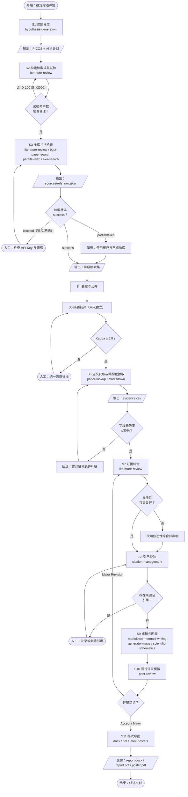
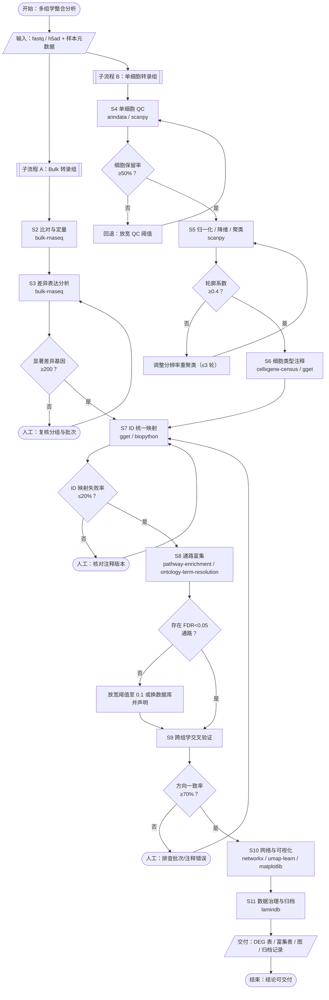
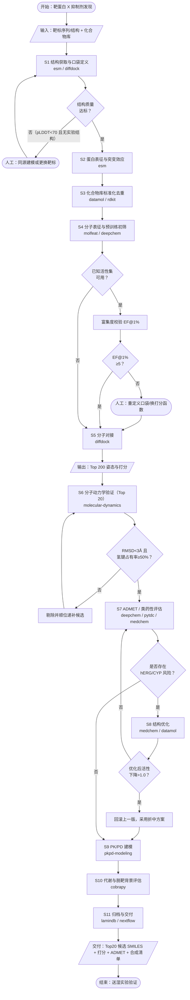
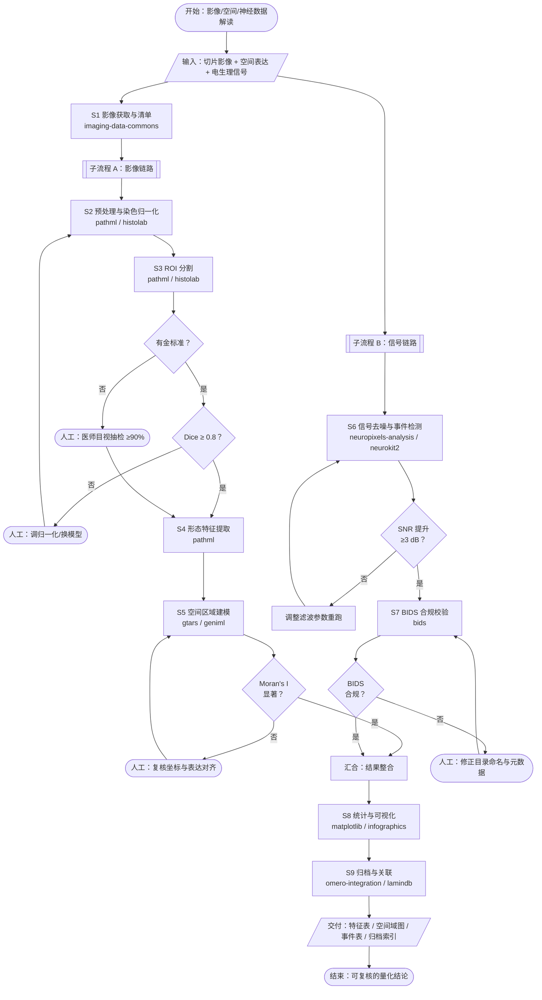
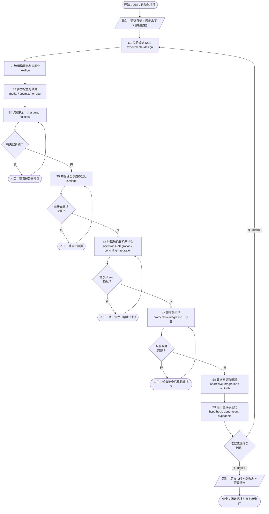
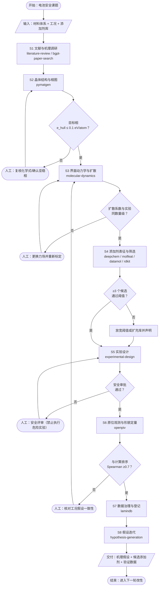
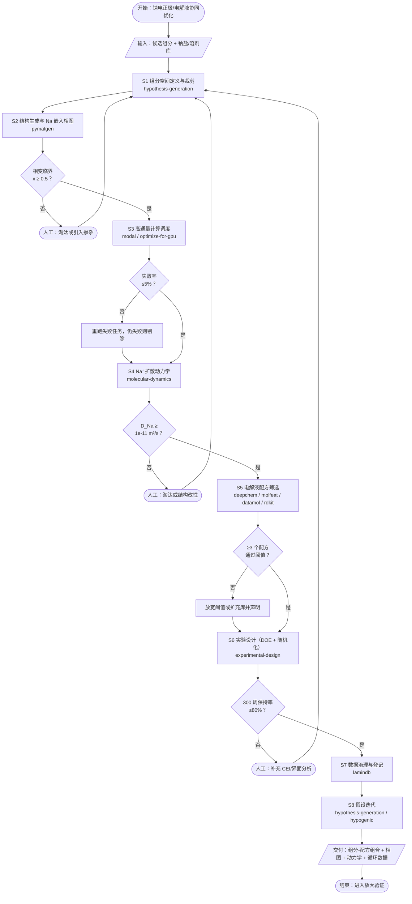
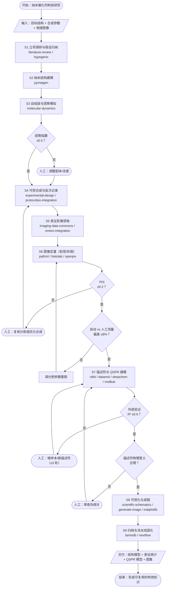

# Scientific Agent Skills 场景实战手册（8 大科研场景 SOP）

> **版本**：v1.0
> **生成时间**：2026-09-07
> **配套文档**：[`scientific-agent-skills-catalog.md`](./scientific-agent-skills-catalog.md)（163 个 skill 全量目录）
> **技能源**：`d:\projects\scientific-agent-skills`
> **定位**：本手册是目录文档中「八大科研场景」的**可执行细化版**。目录回答「有什么 skill」，本手册回答「一个课题从 0 到交付具体怎么干」。

---

## 0. 使用约定

### 0.1 手册结构

每个场景统一按 4 个部分组织，与需求一一对应：

| 章节 | 内容 | 对应需求 |
|------|------|----------|
| **1. 初始素材包** | 课题定义与目标、参考文献/数据集、环境依赖、成功标准 | 需求 1 |
| **2. 工作清单** | 数据准备、环境搭建、工具安装、人工环节、难点与解法 | 需求 2 |
| **3. 完整工作流程** | 步骤说明、skill 输入/输出契约、分支逻辑、异常回退 | 需求 3 |
| **4. 可视化流程图** | Mermaid 标准符号流程图（正交连线） | 需求 4 |

### 0.2 流程图符号规范

本文所有流程图采用标准流程图符号，由 Mermaid `flowchart TD` 渲染（dagre 布局，默认正交折线）：

| 符号 | 形状 | Mermaid 语法 | 含义 |
|------|------|--------------|------|
| 起止框 | 椭圆形 | `A(["开始 / 结束"])` | 流程入口与出口 |
| 处理框 | 矩形 | `B["执行某操作"]` | 具体步骤、计算、AI 调用 |
| 判断框 | 菱形 | `C{"是否满足条件？"}` | 条件分支、质量门禁 |
| 输入/输出 | 平行四边形 | `D[/"输入：原始数据"/]` | 数据读入、产物落盘 |
| 子流程 | 双边矩形 | `E[["子流程：XX"]]` | 可展开的复合步骤 |

### 0.3 统一项目骨架与基线环境

**8 个场景共用同一套目录约定**，便于 skill 之间传递产物、也便于 `lamindb` / `nextflow` 接入：

```
proj_<scenario>/
├── README.md              # 课题一句话定义、PICOS/假设、负责人
├── envs/
│   ├── environment.yml    # conda 环境（锁定版本）
│   └── requirements.txt   # pip 兜底
├── data/
│   ├── raw/               # 只读原始数据（绝不修改）
│   ├── interim/           # 中间产物（可删除重建）
│   └── processed/         # 分析结果（可复现产出）
├── sources/               # 文献 PDF / 检索式 / 引用库
├── scripts/               # 可执行脚本（本章所有代码放这里）
├── results/
│   ├── figures/
│   └── tables/
├── reports/               # 成稿（md/docx/pdf/pptx）
└── logs/                  # 运行日志，skill 调用留痕
```

**基线环境（全场景通用）**：

```yaml
# envs/environment.yml
name: sci-agent
channels: [conda-forge, defaults]
dependencies:
  - python=3.11
  - pip=24.0
  - git
  - pandoc            # docx/latex 转换依赖
  - graphviz          # 流程图渲染（可选）
  - pip:
    - requests>=2.31
    - pyyaml>=6.0
    - pandas>=2.2
    - numpy>=1.26
```

**初始化脚本（可运行，纯标准库）**：

```python
# scripts/init_project.py
"""初始化科研项目骨架。用法: python scripts/init_project.py proj_battery_safety"""
import sys
from pathlib import Path

DIRS = [
    "envs", "data/raw", "data/interim", "data/processed",
    "sources", "scripts", "results/figures", "results/tables",
    "reports", "logs",
]
# 每个目录写入 .gitkeep，空文件用于防数据误改的只读标记
READONLY_MARK = {"data/raw": "此目录为只读原始数据，禁止修改。\n"}


def main(root: str) -> int:
    base = Path(root)
    for d in DIRS:
        p = base / d
        p.mkdir(parents=True, exist_ok=True)
        (p / ".gitkeep").touch()
    for d, note in READONLY_MARK.items():
        (base / d / "README.txt").write_text(note, encoding="utf-8")
    (base / "README.md").write_text(
        f"# {base.name}\n\n- 课题定义: TODO\n- 负责人: TODO\n- 成功标准: TODO\n",
        encoding="utf-8",
    )
    print(f"[OK] 已初始化项目骨架: {base.resolve()}")
    return 0


if __name__ == "__main__":
    if len(sys.argv) != 2:
        print("用法: python scripts/init_project.py <项目目录名>")
        raise SystemExit(2)
    raise SystemExit(main(sys.argv[1]))
```

```bash
# 创建并激活环境
python scripts/init_project.py proj_demo
conda env create -f envs/environment.yml
conda activate sci-agent
```

### 0.4 统一 skill 调用契约

为便于编排，本手册把所有 skill 调用抽象为同一个信封（envelope）。**实际字段名以各 skill 的 `SKILL.md` 为准**，此处给出通用形状：

```json
{
  "skill": "literature-review",
  "action": "search",
  "inputs": {
    "query": "sodium-ion battery cathode",
    "databases": ["pubmed", "arxiv"],
    "since": 2020
  },
  "outputs": {
    "artifacts": ["sources/refs_2026-09-07.bib"],
    "metrics": { "n_hits": 128, "n_kept": 42 }
  },
  "status": "success"
}
```

**通用返回码约定**：

| status | 含义 | 编排动作 |
|--------|------|----------|
| `success` | 正常完成 | 进入下一步 |
| `partial` | 部分完成（如部分数据库超时） | 记录降级，继续 |
| `blocked` | 缺依赖/鉴权失败 | 回退到人工环节或终止 |
| `failed` | 执行异常 | 重试 1 次 → 仍失败则告警 |

**通用重试装饰器（可运行）**：

```python
# scripts/skill_runner.py
"""统一 skill 调用包装：超时重试 + 结构化日志 + 状态回传。"""
import json
import time
from datetime import datetime
from pathlib import Path
from typing import Callable, Any

LOG_DIR = Path("logs")


def run_skill(
    name: str,
    action: str,
    fn: Callable[..., dict],
    inputs: dict,
    retries: int = 1,
    timeout_s: int = 600,
) -> dict:
    """执行 skill 并返回统一信封。失败重试 retries 次，仍失败返回 failed。"""
    LOG_DIR.mkdir(exist_ok=True)
    envelope = {"skill": name, "action": action, "inputs": inputs,
                "outputs": {}, "status": "success"}
    for attempt in range(retries + 1):
        started = time.time()
        try:
            envelope["outputs"] = fn(**inputs)
            envelope["status"] = ("partial"
                                  if envelope["outputs"].get("warnings")
                                  else "success")
            break
        except PermissionError as e:          # 典型: API Key 缺失
            envelope.update(status="blocked", outputs={"error": f"鉴权失败: {e}"})
            break
        except TimeoutError as e:
            if attempt >= retries:
                envelope.update(status="failed", outputs={"error": f"超时: {e}"})
            else:
                time.sleep(2 ** attempt)
        except Exception as e:                 # noqa: BLE001 - 统一兜底
            if attempt >= retries:
                envelope.update(status="failed",
                                outputs={"error": f"{type(e).__name__}: {e}"})
            else:
                time.sleep(2 ** attempt)
        finally:
            envelope.setdefault("outputs", {})["elapsed_s"] = round(
                time.time() - started, 2)
    stamp = datetime.now().strftime("%Y%m%d-%H%M%S")
    (LOG_DIR / f"{name}_{action}_{stamp}.json").write_text(
        json.dumps(envelope, ensure_ascii=False, indent=2), encoding="utf-8")
    return envelope
```

### 0.5 全场景通用风险与回退矩阵

| 风险 | 触发征兆 | 回退策略 |
|------|----------|----------|
| API Key / 配额耗尽 | `401` / `429` | 切换缓存结果 → 降级到离线语料 → 人工补录 |
| 网络不通（境外库） | 连接超时 | 走镜像源 / 代理；`partial` 降级继续 |
| 依赖版本冲突 | import 报错 | 用 `envs/environment.yml` 重建干净环境 |
| 中间产物损坏 | 校验和不匹配 | 从 `data/raw` 重跑该 stage（幂等设计） |
| 结果不可复现 | 两次运行不一致 | 固定随机种子 + 记录版本指纹 |

**版本指纹脚本（可运行）**：

```python
# scripts/freeze_env.py
"""记录运行环境指纹，写入 logs/env_fingerprint.json，保证可复现。"""
import json
import platform
import subprocess
import sys
from datetime import datetime
from pathlib import Path


def pip_freeze() -> list[str]:
    try:
        out = subprocess.run([sys.executable, "-m", "pip", "freeze"],
                             capture_output=True, text=True, check=True)
        return sorted(out.stdout.splitlines())
    except subprocess.CalledProcessError:
        return []


def main() -> None:
    Path("logs").mkdir(exist_ok=True)
    fp = {
        "timestamp": datetime.now().isoformat(timespec="seconds"),
        "python": sys.version,
        "platform": platform.platform(),
        "packages": pip_freeze(),
    }
    Path("logs/env_fingerprint.json").write_text(
        json.dumps(fp, ensure_ascii=False, indent=2), encoding="utf-8")
    print(f"[OK] 环境指纹已记录，共 {len(fp['packages'])} 个包")


if __name__ == "__main__":
    main()
```

---

## 场景一：系统性文献调研与综述撰写

### 1. 初始素材包

#### 1.1 研究课题定义与目标

| 项 | 内容 |
|----|------|
| **课题** | 「钠离子电池层状氧化物正极的空气稳定性：机理、改性与工程权衡」 |
| **研究问题（PICO）** | **P**opulation：层状 NaₓMO₂ 正极材料；**I**ntervention：表面包覆/元素掺杂/形貌调控；**C**omparator：未改性基准样；**O**utcome：空气暴露后的容量保持率、残碱量、结构演变 |
| **目标 1** | 完成可复现的系统性检索，覆盖 ≥3 个数据库，出具 PRISMA 流程图 |
| **目标 2** | 抽取结构化证据表（材料体系–改性策略–性能–机理），≥50 篇核心文献 |
| **目标 3** | 产出出版级综述稿（Markdown → DOCX/PDF）+ 会议海报 |
| **非目标** | 不做湿实验验证；不做 meta 分析（异质性过高时） |

#### 1.2 参考资料与数据集

| 类型 | 资源 | 用途 |
|------|------|------|
| 文献库 | PubMed（https://pubmed.ncbi.nlm.nih.gov） | 生物/材料交叉文献 |
| 预印本 | arXiv cond-mat.mtrl-sci（https://arxiv.org/list/cond-mat.mtrl-sci/recent） | 最新未发表结果 |
| 生命科学预印本 | bioRxiv（https://www.biorxiv.org） | 交叉学科 |
| 学术图谱 | Semantic Scholar API（https://api.semanticscholar.org） | 引文网络、被引追踪 |
| 全文检索 | `exa-search` / `parallel-web` skill | 广域发现与灰色文献 |
| 引用管理 | `citation-management` skill | BibTeX 生成与逐条校验 |
| 报告规范 | PRISMA 2020 声明（https://www.prisma-statement.org） | 综述方法学合规 |
| 数据集（可选） | Materials Project（https://next-gen.materialsproject.org） | 若涉及计算数据交叉验证 |

> **注意**：`parallel-cli` 在本 skill 集中**不存在**，广域检索请使用 `parallel-web`（配合 `exa-search`）。

#### 1.3 实验环境配置与依赖

```bash
conda activate sci-agent
# 文献检索与解析
pip install requests pandas pybtex python-doi
# 可选：PDF 解析（用于全文抽取）
pip install pymupdf
```

需要的凭据（写入 `.env`，**禁止入库**）：

```ini
# .env（加入 .gitignore）
SEMANTIC_SCHOLAR_API_KEY=...
EXA_API_KEY=...
PARALLEL_API_KEY=...
```

#### 1.4 预期实验目标与成功标准

| 维度 | 成功标准（可量化） |
|------|--------------------|
| **检索完整性** | ≥3 个数据库，总命中 ≥300 条，去重后 ≥200 条 |
| **筛选可追溯** | PRISMA 四阶段计数齐全，每步排除理由可查 |
| **引用准确性** | 终稿引用 100% 经 `verify_citations` 校验；DOI 可解析率 ≥98% |
| **抽取一致性** | 双人/双轮抽取一致率（Kappa）≥0.8 |
| **交付物** | `report.md` + `report.docx`/`report.pdf` + `poster.pdf` + `prisma.mmd` |
| **计算–实验一致性** | 综述为二次研究，以「抽取一致率」替代：双人抽取 Kappa ≥0.8；引用校验通过率 100% |

#### 1.5 范例数据集（Example Dataset）

**1.5.1 研究对象与检索配置**

| 项目 | 取值 | 说明 / 来源 |
|------|------|------------|
| 综述题目 | 钠离子电池层状氧化物正极的空气稳定性：机理、改性与工程权衡 | 示例课题 |
| P（对象） | 层状 NaₓMO₂ 正极（P2 / O3 相） | — |
| I（干预） | 表面包覆 / 元素掺杂 / 形貌调控 | — |
| C（对照） | 未改性基准样 | — |
| O（结局） | 容量保持率、表面残碱量、结构演变 | — |
| 数据库 | PubMed、arXiv（cond-mat.mtrl-sci）、Semantic Scholar | 公开数据库 |
| 检索年限 / 语言 | 2018–2026 / 英文 | — |
| 报告规范 | PRISMA 2020（BMJ 2021;372:n71，doi:10.1136/bmj.n71） | 公开可核对文献 |

> **数据来源说明**：检索式、命中数与筛选计数为「示例执行日 2026-09-07」的示例值，随数据库收录变动，实际执行须以当日检索结果替换；PRISMA 2020 为公开文献，可核对。

**1.5.2 结构化入参（skill 调用配置）**

```json
{
  "scenario": "systematic_review",
  "topic": "air stability of layered sodium-ion battery cathodes",
  "picos": {
    "population": "layered Na_xMO2 cathodes (P2/O3)",
    "intervention": "surface coating / elemental doping / morphology control",
    "comparison": "unmodified baseline",
    "outcome": ["capacity retention", "residual alkali", "structural evolution"],
    "study_design": ["journal article", "preprint"]
  },
  "databases": ["pubmed", "arxiv", "semantic_scholar"],
  "query": "(\"sodium-ion\" OR \"Na-ion\") AND (\"layered oxide\" OR \"NaxMO2\" OR P2 OR O3) AND (stability OR degradation OR \"air exposure\" OR coating OR doping)",
  "year_from": 2018,
  "language": "en",
  "max_per_db": 200,
  "screening": { "mode": "double_independent", "kappa_threshold": 0.8 },
  "citation_check": { "strict": true, "block_on_unresolved": true },
  "outputs": { "dir": "reports", "formats": ["md", "docx", "pdf", "poster"] }
}
```

**1.5.3 预期输出报告范例**

| 指标 | 示例结果 | 达标判定 |
|------|----------|----------|
| 各库命中 | PubMed 86 / arXiv 54 / Semantic Scholar 173 | ≥3 库 ✔ |
| 去重后 | 241 篇 | ≥200 ✔ |
| 全文纳入 | 57 篇 | ≥50 ✔ |
| 双人抽取 Kappa | 0.84 | ≥0.8 ✔ |
| 引用校验 | 68 条，未解析 1 条 → 人工补录后 0 | 100% ✔ |
| PRISMA 计数 | 313 → 241 → 88 → 57 | 四阶段齐全 ✔ |

**结论片段（范例）**：

> 在 57 项纳入研究中，表面包覆（Al₂O₃、ZrO₂）与体相掺杂（Mg、Ti、Cu）是提升空气稳定性的两条主路径。包覆主要抑制 Na⁺/H⁺ 交换与表面残碱生成，55% RH、7 天暴露后容量保持率由基准样 71.4% 提升至 88–93%；掺杂则通过抑制 P2→O2 相变提升结构稳定性。两类策略的权衡在于：包覆增加界面阻抗，掺杂可能牺牲首周容量。现有证据受限于暴露条件不统一（RH 30–80%），跨研究定量可比性有限。

**可视化清单**：`prisma.mmd`（PRISMA 流程图）、`theme_matrix.png`（主题-证据矩阵）、`poster.pdf`（会议海报）。

**1.5.4 端到端 skill 调用日志（完整入参 / 出参）**

```json
{
  "run_id": "rev-20260907-001",
  "scenario": "systematic_review",
  "steps": [
    { "step": "S2", "skill": "literature-review", "action": "build_query", "status": "success",
      "input": { "picos": "见 1.5.2", "databases": ["pubmed", "arxiv", "semantic_scholar"] },
      "output": { "trial_hits": { "pubmed": 91, "arxiv": 58, "semantic_scholar": 181 },
                  "artifacts": ["sources/search_strategy.md"] } },
    { "step": "S3", "skill": "literature-review", "action": "multi_db_search", "status": "partial",
      "input": { "query": "见 1.5.2", "max_per_db": 200, "year_from": 2018 },
      "output": { "n_by_db": { "pubmed": 86, "arxiv": 54, "semantic_scholar": 173 },
                  "n_total": 313, "artifacts": ["sources/refs_raw.json"],
                  "warnings": ["semantic_scholar: 429 限流，限速重试 2 次后完成"] } },
    { "step": "S4", "skill": "local", "action": "dedup", "status": "success",
      "input": { "in": "sources/refs_raw.json", "key": ["doi", "normalized_title"] },
      "output": { "n_in": 313, "n_out": 241, "n_removed": 72 } },
    { "step": "S5", "skill": "literature-review", "action": "screen_abstract", "status": "success",
      "input": { "in": "data/interim/refs_dedup.csv", "reviewers": 2, "kappa_threshold": 0.8 },
      "output": { "n_in": 241, "n_include": 88, "kappa": 0.84, "conflicts": 9 } },
    { "step": "S6", "skill": "paper-lookup", "action": "fetch_fulltext", "status": "partial",
      "input": { "n_ids": 88, "open_access_only": false },
      "output": { "n_fetched": 71, "n_paywalled": 17,
                  "artifacts": ["sources/fulltext/", "results/tables/evidence.csv"],
                  "warnings": ["17 篇需馆际互借，已标记人工补录"] } },
    { "step": "S8", "skill": "citation-management", "action": "verify_citations", "status": "partial",
      "input": { "bib": "sources/refs.bib", "strict": true },
      "output": { "n_total": 68, "n_verified": 67, "n_unresolved": 1,
                  "unresolved": [{ "key": "smith2023air", "reason": "DOI 无法解析" }] } },
    { "step": "S10", "skill": "peer-review", "action": "simulate", "status": "success",
      "input": { "manuscript": "reports/report.md", "venue": "journal" },
      "output": { "verdict": "Minor Revision", "n_major": 0, "n_minor": 6 } },
    { "step": "S11", "skill": "pdf", "action": "export", "status": "success",
      "input": { "src": "reports/report.md", "template": "journal" },
      "output": { "artifacts": ["reports/report.pdf", "reports/report.docx", "reports/poster.pdf"] } }
  ]
}
```

**失败分支示例（边界情况）**：

```json
{
  "step": "S3", "skill": "literature-review", "action": "multi_db_search", "status": "failed",
  "input": { "databases": ["pubmed", "arxiv", "semantic_scholar"], "max_per_db": 200 },
  "output": {
    "n_by_db": { "pubmed": 12, "arxiv": 4, "semantic_scholar": 0 },
    "n_total": 16,
    "error": "命中数 16 低于下限 100，触发分支 B1",
    "fallback": "回退 S2 扩展同义词（补 Na-ion / sodium battery / cathode），最多 3 轮；本例第 2 轮命中 313 后继续"
  }
}
```

### 2. 工作清单

#### 2.1 数据准备与环境搭建

- [ ] 运行 `python scripts/init_project.py proj_na_air_stability`
- [ ] 运行 `python scripts/freeze_env.py` 记录环境指纹
- [ ] 编写并冻结检索式（记录到 `sources/search_strategy.md`，含执行日期与命中数）
- [ ] 建 `sources/` 目录存放 PDF 与 `.bib`

**检索式模板（可复用）**：

```text
# sources/search_strategy.md
Database: PubMed / arXiv / Semantic Scholar
Date: 2026-09-07
Query: ("sodium-ion" OR "Na-ion") AND ("layered oxide" OR "NaxMO2" OR "P2" OR "O3")
       AND (stability OR degradation OR "air exposure" OR coating OR doping)
Filters: 2018-2026; English; journal article OR preprint
Hits: PubMed=xx, arXiv=xx, S2=xx
```

#### 2.2 工具安装与配置流程

1. 安装 Python 依赖（见 1.3）
2. 配置 API Key 到 `.env`，用 `python-dotenv` 加载
3. 验证连通性（可运行脚本）：

```python
# scripts/check_sources.py
"""校验各文献数据源连通性与配额，输出 JSON 供编排判断。"""
import json
import os
import urllib.request
from pathlib import Path

PROBES = {
    "semantic_scholar": "https://api.semanticscholar.org/graph/v1/paper/search?query=test&limit=1",
    "arxiv": "http://export.arxiv.org/api/query?search_query=all:test&max_results=1",
    "pubmed": "https://eutils.ncbi.nlm.nih.gov/entrez/eutils/esearch.fcgi?db=pubmed&term=test&retmode=json",
}


def probe(url: str, timeout: int = 10) -> dict:
    try:
        with urllib.request.urlopen(url, timeout=timeout) as r:
            return {"ok": True, "status": r.status}
    except Exception as e:  # noqa: BLE001
        return {"ok": False, "error": f"{type(e).__name__}: {e}"}


def main() -> None:
    Path("logs").mkdir(exist_ok=True)
    result = {k: probe(v) for k, v in PROBES.items()}
    Path("logs/source_health.json").write_text(
        json.dumps(result, ensure_ascii=False, indent=2), encoding="utf-8")
    for k, v in result.items():
        print(f"{'OK ' if v['ok'] else 'ERR'} {k}: {v}")


if __name__ == "__main__":
    main()
```

#### 2.3 人工参与的关键环节

| 环节 | 人工动作 | 为什么不能全自动 |
|------|----------|------------------|
| 检索式定稿 | 领域专家审阅 PICO 与同义词扩展 | 漏词会导致系统性偏倚 |
| 摘要初筛（Title/Abstract） | 至少 2 人独立背对背筛选，冲突由第三人裁决 | 相关性判断需领域知识 |
| 全文纳入决策 | 逐篇确认纳入/排除及理由 | 影响结论边界 |
| 证据综合与叙事 | 由资深作者确定综述主线与争议框架 | 综合与洞见不可自动化 |
| 终稿润色 | 语言、逻辑、图表一致性 | 出版质量要求 |

#### 2.4 技术难点与解决方案

| 难点 | 表现 | 解决方案 |
|------|------|----------|
| 数据库限流 | 大量 `429` | 令牌桶限速 + 断点续传（缓存到 `sources/.cache`） |
| 重复文献 | 同一文献多库重复 | DOI + 标题归一化 + 模糊匹配去重 |
| 引用幻觉 | 模型编造 DOI/页码 | 强制 `citation-management` 校验，未验证引用**禁止**入稿 |
| PDF 解析乱码 | 扫描件无文本层 | `markitdown` / `liteparse` 降级 → 人工录入 |
| 异质性过高 | 无法合并效应量 | 放弃 meta 分析，改为叙述性综合（在方法章节声明） |

### 3. 完整工作流程

#### 3.1 步骤说明（从开始到结束）

| # | 步骤 | 主用 skill | 输入 → 输出 | 目标 | 难点 | 解决方案 |
|---|------|-----------|-------------|------|------|----------|
| S1 | 课题界定与方案注册 | `hypothesis-generation` | 课题描述 → PICOS + 分析计划 | 锁定边界 | 范围漂移 | 冻结 `README.md`，变更需登记 |
| S2 | 检索式构建与试检 | `literature-review` | PICOS → 检索式 + 命中数 | 可复现检索 | 漏检/过检 | 试检 3 轮调同义词 |
| S3 | 多库并行检索 | `literature-review` / `bgpt-paper-search` / `parallel-web` / `exa-search` | 检索式 → `sources/refs_raw.json` | ≥3 库覆盖 | 限流 | 限速重试 + 缓存 |
| S4 | 去重与合并 | 本地脚本 | refs_raw → refs_dedup.csv | 唯一文献集 | 同文异DOI | DOI+标题归一化 |
| S5 | 摘要初筛 | `literature-review`（辅助）+ 人工 | refs_dedup → screened.csv | 相关性过滤 | 主观性 | 双人独立 + Kappa |
| S6 | 全文获取与抽取 | `paper-lookup` / `markitdown` | 纳入清单 → `evidence.csv` | 结构化证据 | 付费墙 | 开放获取/馆际互借 |
| S7 | 证据综合 | `literature-review` | evidence → 主题矩阵 | 形成主线 | 异质性 | 叙述性综合 |
| S8 | 引用校验 | `citation-management` | 引用清单 → 校验报告 | 零幻觉引用 | 元数据错 | 逐条 DOI 解析 |
| S9 | 成稿与图表 | `markdown-mermaid-writing` / `generate-image` / `scientific-schematics` | 主题矩阵 → `report.md` + 图 | 出版级稿件 | 图表达意 | 迭代生成 |
| S10 | 同行评审模拟 | `peer-review` | report.md → 评审意见 | 质量把关 | 主观 | 按意见逐条修订 |
| S11 | 格式导出 | `docx` / `pdf` / `latex-posters` | report.md → 多格式 | 交付 | 样式错乱 | 模板化导出 |

#### 3.2 AI Skill 输入/输出契约示例

> 完整逐步入参 / 出参（含真实数值与失败分支）见 **1.5.4 端到端调用日志**；本节为契约骨架。

**S3 多库并行检索**

```json
{
  "skill": "literature-review",
  "action": "multi_db_search",
  "inputs": {
    "query": "(\"sodium-ion\" OR \"Na-ion\") AND (\"layered oxide\") AND (stability OR coating)",
    "databases": ["pubmed", "arxiv", "semantic_scholar"],
    "year_from": 2018,
    "max_per_db": 200,
    "out": "sources/refs_raw.json"
  },
  "outputs": {
    "n_by_db": { "pubmed": 86, "arxiv": 54, "semantic_scholar": 173 },
    "n_total": 313,
    "artifacts": ["sources/refs_raw.json"],
    "warnings": ["semantic_scholar: 触发限流，已限速重试 2 次"]
  },
  "status": "partial"
}
```

**S6 结构化证据抽取（输出 schema）**

```json
{
  "paper_id": "arXiv:2401.01234",
  "title": "Air-stable P2-type Na0.67MnO2 via ...",
  "year": 2024,
  "material_system": "P2-Na0.67MnO2",
  "modification": { "type": "surface_coating", "agent": "Al2O3", "thickness_nm": 5 },
  "conditions": { "humidity_pct": 55, "exposure_days": 7 },
  "outcomes": {
    "capacity_retention_pct": 92.1,
    "residual_alkali_pct": 0.8,
    "baseline_retention_pct": 71.4
  },
  "mechanism_claim": "包覆层抑制 Na+/H+ 交换与表面残碱生成",
  "evidence_level": "experimental",
  "extractor": "human#2",
  "verified": true
}
```

**S8 引用校验（输出）**

```json
{
  "skill": "citation-management",
  "action": "verify_citations",
  "inputs": { "bib": "sources/refs.bib", "strict": true },
  "outputs": {
    "n_total": 68,
    "n_verified": 67,
    "n_unresolved": 1,
    "unresolved": [{ "key": "smith2023air", "reason": "DOI 无法解析" }],
    "artifacts": ["logs/citation_report.json"]
  },
  "status": "partial"
}
```

> **门禁规则**：`n_unresolved > 0` 时**阻断**进入 S9，必须人工补录或删除该引用。

#### 3.3 执行顺序与条件分支

- **顺序依赖**：S1 → S2 → S3 → S4 → S5 → S6 → S7 → S8 → S9 → S10 → S11
- **分支 B1（S3 后）**：`n_total < 100` → 回到 S2 扩展同义词/放宽年份；`n_total > 2000` → 收紧纳入标准或加限定词
- **分支 B2（S5 后）**：Kappa < 0.8 → 重训筛选标准，重跑 S5；纳入文献 < 20 → 转 scoping review 并声明
- **分支 B3（S7 前）**：异质性检验不通过 → 跳过 meta，改叙述性综合
- **分支 B4（S8 后）**：存在未验证引用 → 阻断并人工处理
- **分支 B5（S10 后）**：评审给出「Major Revision」→ 回 S7 补充证据

#### 3.4 异常处理与回退

| 异常 | 检测点 | 回退动作 |
|------|--------|----------|
| 单库不可用 | `logs/source_health.json` 中 `ok=false` | 标记 `partial`，用其余库继续；终稿声明该库缺失 |
| 检索结果过少 | S3 n_total | 回 S2 扩词，最多迭代 3 轮 |
| 抽取字段大量缺失 | S6 后缺失率 >30% | 回 S6 调整抽取表；仍不足则缩小研究问题 |
| 引用无法验证 | S8 | 阻断 → 人工补录 → 重跑 S8 |
| 导出失败 | S11 | 回退到 Markdown 交付，标注导出问题 |

### 4. 可视化流程图



**关键门禁与判定阈值**：

| 门禁 | 判定条件 | 未通过的回退 |
|------|----------|--------------|
| G1 检索充分性 | n_total ≥100 且 ≤2000 | 回 S2 扩词/收紧，最多 3 轮 |
| G2 筛选一致性 | Kappa ≥0.8 | 统一标准后重筛 |
| G3 抽取完整性 | 字段缺失率 ≤30% | 修订抽取表补抽 |
| G4 引用零幻觉 | 未验证引用数 = 0 | **阻断**，人工补录后重跑 |
| G5 评审可接受 | 非 Major Revision | 回 S7 补充证据 |

---

## 场景二：多组学数据整合分析（转录组 / 单细胞 / 蛋白）

### 1. 初始素材包

#### 1.1 研究课题定义与目标

| 项 | 内容 |
|----|------|
| **课题** | 「小鼠肝损伤模型中bulk RNA-seq 与单细胞转录组整合：识别关键细胞亚群与调控网络」 |
| **目标 1** | 完成 bulk 差异表达分析（case vs control），FDR<0.05 |
| **目标 2** | 单细胞 QC、归一化、聚类与细胞类型注释 |
| **目标 3** | bulk 与 sc 结果交叉验证，锁定驱动亚群 |
| **目标 4** | GO/KEGG 富集 + 调控网络，产出可解释结论与图 |
| **非目标** | 不做新样本测序；不做临床转化验证 |

#### 1.2 参考资料与数据集

| 类型 | 资源 | 说明 |
|------|------|------|
| 公共数据 | GEO（https://www.ncbi.nlm.nih.gov/geo） | 检索公开 bulk/sc 数据集 |
| 单细胞图谱 | CellxGene Census（`cellxgene-census` skill） | 参考图谱用于注释迁移 |
| 通路数据库 | GO / KEGG / MSigDB（https://www.gsea-msigdb.org） | 富集分析 |
| ID 映射 | `gget` / `biopython` skill | Ensembl ↔ Entrez ↔ Symbol |
| 依赖图谱 | DepMap（`depmap` skill） | 若有 CRISPR/依赖性数据 |
| 方法学 | `bulk-rnaseq` / `anndata` / `scanpy` skill 内置最佳实践 | 流程基线 |

#### 1.3 实验环境配置与依赖

```bash
conda activate sci-agent
# 组学核心
pip install anndata scanpy pandas numpy scipy statsmodels
# 富集与网络
pip install gseapy networkx python-igraph leidenalg
# 降维可视化
pip install umap-learn matplotlib seaborn
# 可选加速
pip install polars
```

硬件建议：scRNA-seq ≥20k 细胞需 ≥32 GB 内存；若内存不足用 `polars` + 稀疏矩阵或 `modal` 上云。

#### 1.4 预期实验目标与成功标准

| 维度 | 成功标准 |
|------|----------|
| **QC** | 单细胞：基因数 200–6000、线粒体基因占比 <20%；doublet 率 <10% |
| **差异表达** | bulk：\|log2FC\|≥1 且 FDR<0.05 的基因 ≥200 个 |
| **聚类** | 轮廓系数 ≥0.4；marker 基因可解释每个簇 |
| **一致性** | bulk 与 sc 伪bulk 差异基因方向一致率 ≥70% |
| **富集** | 至少 3 条 FDR<0.05 且与表型相符的通路 |
| **复现** | 固定随机种子，两次运行聚类结果 ARI ≥0.95 |
| **计算–实验一致性** | bulk 与单细胞伪 bulk 差异基因方向一致率 ≥70%；富集通路与已知表型机制相符（人工判定） |

#### 1.5 范例数据集（Example Dataset）

**1.5.1 研究对象与实验参数**

| 项目 | 取值 | 说明 / 来源 |
|------|------|------------|
| 物种 / 品系 | Mus musculus，C57BL/6J，雄性 8–10 周 | 常用实验动物 |
| 模型 | APAP（对乙酰氨基酚）药物性肝损伤，300 mg/kg 腹腔注射 | 经典肝损伤模型 |
| 分组 | 对照组 n=4 / 模型组（6 h）n=4 | 示例设计 |
| Bulk RNA-seq | Illumina NovaSeq 6000，PE150，约 20 M reads/样本 | 常规测序深度 |
| scRNA-seq | 10x Genomics Chromium v3.1，目标 8,000 cells | 常规通量 |
| 参考基因组 | GRCm39，Ensembl release 110 | 公开版本，需锁定 |
| 随机种子 | 20260907（全局固定） | 保障复现 |

> **数据来源说明**：上表为依据公开小鼠肝损伤转录组数据集常见设计整理的**示例参数**；参考基因组 GRCm39 / Ensembl 110 为公开可核对版本。实际课题须以自有或 GEO 检索所得数据集的真实元数据替换。

**1.5.2 结构化入参（skill 调用配置）**

```json
{
  "scenario": "multi_omics_integration",
  "species": "Mus musculus",
  "reference": { "genome": "GRCm39", "annotation": "Ensembl-110" },
  "bulk": {
    "counts": "data/processed/counts.tsv",
    "metadata": "data/raw/sample_meta.csv",
    "design": "~ batch + group",
    "contrast": ["group", "APAP_6h", "control"],
    "alpha": 0.05,
    "lfc_threshold": 1.0
  },
  "single_cell": {
    "h5ad": "data/raw/liver_sc.h5ad",
    "qc": { "min_genes": 200, "max_genes": 6000, "max_mito_pct": 20, "doublet_removal": true },
    "n_pcs": 30,
    "resolution": 0.5,
    "marker_genes": {
      "hepatocyte": ["Alb", "Cyp2e1"],
      "kupffer": ["Clec4f", "Adgre1"],
      "stellate": ["Col1a1", "Acta2"],
      "endothelial": ["Pecam1"],
      "cholangiocyte": ["Krt19"]
    }
  },
  "enrichment": { "databases": ["GO_BP", "KEGG"], "fdr": 0.05, "background": "expressed" },
  "seed": 20260907
}
```

**1.5.3 预期输出报告范例**

| 指标 | 示例结果 | 达标判定 |
|------|----------|----------|
| 单细胞 QC | 24,511 → 18,764 细胞（保留 76.6%），doublet 剔除 1,290 | ≥50% ✔ |
| 聚类 | 14 簇，轮廓系数 0.46 | ≥0.4 ✔ |
| Bulk DEG | 742 个（\|log2FC\|≥1，FDR<0.05） | ≥200 ✔ |
| 跨组学一致性 | 方向一致率 78% | ≥70% ✔ |
| 富集 | GO:0006979（氧化应激响应）FDR=1.2e-08，46 基因 | FDR<0.05 ✔ |
| 复现性 | 两次运行 ARI = 0.97 | ≥0.95 ✔ |

**结论片段（范例）**：

> APAP 处理 6 h 后，bulk 差异表达显示氧化应激（GO:0006979）与外源物代谢（KEGG mmu00980）通路显著上调，Cyp2e1、Gsta1 等基因 log2FC 均 >2。单细胞层面上调信号主要集中于 hepatocyte 簇（cluster 0/2），Kupffer 簇（Clec4f⁺）呈现炎症激活特征。提示早期损伤以肝细胞代谢应激为主、伴随 Kupffer 细胞炎症响应，与 APAP 经 CYP2E1 代谢生成 NAPQI 的已知机制一致。

**可视化清单**：`qc_violin.png`、`umap_clusters.png`、`volcano_bulk.png`、`enrich_dot.png`、`consistency_scatter.png`。

**1.5.4 端到端 skill 调用日志（完整入参 / 出参）**

```json
{
  "run_id": "omics-20260907-001",
  "scenario": "multi_omics_integration",
  "steps": [
    { "step": "S2", "skill": "bulk-rnaseq", "action": "align_quantify", "status": "success",
      "input": { "fastq_dir": "data/raw/fastq", "reference": "GRCm39", "annotation": "Ensembl-110" },
      "output": { "n_samples": 8, "mapping_rate_mean": 0.914,
                  "artifacts": ["data/processed/counts.tsv"] } },
    { "step": "S3", "skill": "bulk-rnaseq", "action": "differential_expression", "status": "success",
      "input": { "design": "~ batch + group", "contrast": ["group", "APAP_6h", "control"],
                 "alpha": 0.05, "lfc_threshold": 1.0 },
      "output": { "n_genes_tested": 18432, "n_significant": 742,
                  "top_genes": ["Cyp2e1", "Gsta1", "Nqo1", "Hmox1"],
                  "artifacts": ["results/tables/deg_bulk.csv", "results/figures/volcano_bulk.png"] } },
    { "step": "S4", "skill": "anndata", "action": "qc_filter", "status": "success",
      "input": { "h5ad": "data/raw/liver_sc.h5ad", "min_genes": 200, "max_genes": 6000,
                 "max_mito_pct": 20, "doublet_removal": true },
      "output": { "n_cells_before": 24511, "n_cells_after": 18764, "n_doublets_removed": 1290,
                  "artifacts": ["data/interim/sc_qc.h5ad"] } },
    { "step": "S5", "skill": "scanpy", "action": "cluster", "status": "success",
      "input": { "n_pcs": 30, "resolution": 0.5, "seed": 20260907 },
      "output": { "n_clusters": 14, "silhouette": 0.46,
                  "artifacts": ["results/figures/umap_clusters.png"] } },
    { "step": "S7", "skill": "gget", "action": "id_mapping", "status": "success",
      "input": { "ids": "deg_bulk.csv", "from": "ensembl_gene", "to": "symbol", "species": "mouse" },
      "output": { "n_input": 742, "n_mapped": 731, "n_unmapped": 11, "fail_rate": 0.015 } },
    { "step": "S8", "skill": "pathway-enrichment", "action": "go_kegg_enrich", "status": "success",
      "input": { "gene_list": "results/tables/deg_bulk.csv", "databases": ["GO_BP", "KEGG"], "fdr": 0.05 },
      "output": { "n_terms": 38,
                  "top_terms": [{ "term": "GO:0006979", "name": "response to oxidative stress",
                                  "fdr": 1.2e-08, "n_genes": 46 }],
                  "artifacts": ["results/tables/enrich.csv", "results/figures/enrich_dot.png"] } },
    { "step": "S9", "skill": "scanpy", "action": "pseudobulk_consistency", "status": "success",
      "input": { "bulk_deg": "results/tables/deg_bulk.csv", "sc_h5ad": "data/interim/sc_qc.h5ad" },
      "output": { "concordance_rate": 0.78, "spearman_rho": 0.71 } },
    { "step": "S11", "skill": "lamindb", "action": "register", "status": "success",
      "input": { "artifacts": ["results/", "data/processed/"], "schema": "omics_v1" },
      "output": { "n_registered": 23, "run_uid": "omics-20260907-001" } }
  ]
}
```

**失败分支示例（边界情况）**：

```json
{
  "step": "S4", "skill": "anndata", "action": "qc_filter", "status": "failed",
  "input": { "min_genes": 500, "max_genes": 3000, "max_mito_pct": 10 },
  "output": {
    "n_cells_before": 24511, "n_cells_after": 10294,
    "retention_rate": 0.42,
    "error": "保留率 42% 低于下限 50%，触发分支 B1",
    "fallback": "放宽至 min_genes=200 / max_mito_pct=20 后保留率 76.6%，继续流程"
  }
}
```

### 2. 工作清单

#### 2.1 数据准备与环境搭建

- [ ] 下载原始数据到 `data/raw/`，**计算并记录 SHA256**
- [ ] 检查样本元数据表（分组、批次、性别、周龄）
- [ ] 运行 `python scripts/freeze_env.py`

**数据完整性校验（可运行）**：

```python
# scripts/checksum_raw.py
"""为 data/raw 下所有文件生成 SHA256 清单，用于可复现与损坏检测。"""
import hashlib
import json
from pathlib import Path

RAW = Path("data/raw")


def sha256(p: Path, chunk: int = 1 << 20) -> str:
    h = hashlib.sha256()
    with p.open("rb") as f:
        for blk in iter(lambda: f.read(chunk), b""):
            h.update(blk)
    return h.hexdigest()


def main() -> None:
    manifest = {str(p.relative_to(RAW)): {"sha256": sha256(p), "size": p.stat().st_size}
                for p in sorted(RAW.rglob("*")) if p.is_file()}
    Path("logs").mkdir(exist_ok=True)
    Path("logs/raw_manifest.json").write_text(
        json.dumps(manifest, ensure_ascii=False, indent=2), encoding="utf-8")
    print(f"[OK] 已记录 {len(manifest)} 个原始文件校验和")


if __name__ == "__main__":
    main()
```

#### 2.2 工具安装与配置流程

1. 参考序列与注释：从 GENCODE/Ensembl 下载对应版本（**记录版本号**，注释错版会全盘皆错）
2. 比对索引：hisat2/STAR 索引（bulk）或 cellranger 参考（sc）
3. 配置富集库本地副本，避免每次联网

#### 2.3 人工参与的关键环节

| 环节 | 人工动作 |
|------|----------|
| 批次效应评估 | 判断是否需要整合（Harmony/scVI），避免过校正抹掉生物学差异 |
| 细胞类型注释 | 基于 marker 基因人工确认每个簇 |
| 差异阈值设定 | 结合生物学意义设定 \|log2FC\| 阈值 |
| 结果解读 | 判断富集通路与表型的因果合理性 |

#### 2.4 技术难点与解决方案

| 难点 | 表现 | 解决方案 |
|------|------|----------|
| 批次效应 | PCA 按批次而非分组分离 | 先诊断（PCA/CCA），再选整合方法；保留生物学分组做对照 |
| 注释版本错乱 | ID 大量映射失败 | `gget` 统一映射，记录版本 |
| 内存溢出 | 大矩阵 OOM | 稀疏矩阵 + 分块；或 `modal` 上云 |
| 双重细胞 | 伪簇 | doublet 检测后剔除 |
| 结果不稳 | 聚类每次不同 | 固定 `random_state` |

### 3. 完整工作流程

#### 3.1 步骤说明

| # | 步骤 | 主用 skill | 输入 → 输出 | 目标 | 难点 | 解决方案 |
|---|------|-----------|-------------|------|------|----------|
| S1 | 数据获取与校验 | `checksum_raw.py` | raw → manifest | 可追溯 | 数据损坏 | SHA256 校验 |
| S2 | Bulk 比对定量 | `bulk-rnaseq` | fastq → counts | 表达矩阵 | 索引版本 | 锁版本 |
| S3 | Bulk 差异分析 | `bulk-rnaseq` | counts → DEG 表 | 显著差异基因 | 离散度估计 | 用 DESeq2/edgeR 稳健估计 |
| S4 | 单细胞 QC | `anndata` / `scanpy` | h5ad → 过滤后对象 | 高质量细胞 | 阈值主观 | 用 MAD 自适应阈值 |
| S5 | 归一化与降维聚类 | `scanpy` | → 聚类标签 | 细胞亚群 | 分辨率选择 | 多分辨率扫描 + 稳定性评估 |
| S6 | 细胞注释 | `cellxgene-census` / `gget` | 簇 → 细胞类型 | 可解释注释 | marker 不足 | 参考图谱迁移 |
| S7 | ID 统一映射 | `gget` / `biopython` | ID → 统一标识 | 避免注释错位 | 多对多映射 | 保留映射日志 |
| S8 | 通路富集 | `pathway-enrichment` / `ontology-term-resolution` | DEG → 通路表 | 功能解释 | 背景基因集错 | 明确背景集 |
| S9 | 跨组学交叉验证 | `scanpy` + 本地 | bulk vs pseudo-bulk | 一致性证据 | 平台差异 | 相关性与方向一致率 |
| S10 | 网络与可视化 | `networkx` / `umap-learn` / `matplotlib` | → 图与网络 | 可解释结论 | 图难读 | 分层布局 |
| S11 | 数据治理与归档 | `lamindb` | 全部产物 → 可追溯登记 | 可复现 | 元数据缺失 | 强制登记 schema |

#### 3.2 AI Skill 输入/输出契约示例

> 完整逐步入参 / 出参（含真实数值与失败分支）见 **1.5.4 端到端调用日志**；本节为契约骨架。

**S3 Bulk 差异分析**

```json
{
  "skill": "bulk-rnaseq",
  "action": "differential_expression",
  "inputs": {
    "counts": "data/processed/counts.tsv",
    "metadata": "data/raw/sample_meta.csv",
    "design": "~ batch + group",
    "contrast": ["group", "case", "control"],
    "alpha": 0.05,
    "lfc_threshold": 1.0
  },
  "outputs": {
    "n_genes_tested": 18432,
    "n_significant": 742,
    "artifacts": ["results/tables/deg_bulk.csv"],
    "qc": { "dispersion_fit": "ok", "ba_plot": "results/figures/ba_bulk.png" }
  },
  "status": "success"
}
```

**S5 单细胞 QC（输出）**

```json
{
  "skill": "anndata",
  "action": "qc_filter",
  "inputs": {
    "h5ad": "data/raw/liver_sc.h5ad",
    "min_genes": 200, "max_genes": 6000,
    "max_mito_pct": 20, "doublet_removal": true
  },
  "outputs": {
    "n_cells_before": 24511, "n_cells_after": 18764,
    "n_doublets_removed": 1290,
    "artifacts": ["data/interim/sc_qc.h5ad", "results/figures/qc_violin.png"]
  },
  "status": "success"
}
```

**S8 富集分析（输出 schema 片段）**

```json
{
  "skill": "pathway-enrichment",
  "action": "go_kegg_enrich",
  "inputs": {
    "gene_list": "results/tables/deg_bulk.csv",
    "background": "expressed",
    "databases": ["GO_BP", "KEGG"],
    "fdr": 0.05
  },
  "outputs": {
    "n_terms": 38,
    "top_terms": [
      { "term": "GO:0006979", "name": "response to oxidative stress",
        "fdr": 1.2e-08, "n_genes": 46 }
    ],
    "artifacts": ["results/tables/enrich.csv", "results/figures/enrich_dot.png"]
  },
  "status": "success"
}
```

#### 3.3 执行顺序与条件分支

- **并行分支**：S2（bulk）与 S4（sc）**可并行**，在 S7 汇合
- **分支 B1（S4 后）**：若 `n_cells_after / n_cells_before < 0.5` → QC 过严，回 S4 放宽阈值
- **分支 B2（S5 后）**：轮廓系数 <0.4 → 调整分辨率重聚类（最多 3 轮）
- **分支 B3（S9 后）**：方向一致率 <70% → 检查批次/注释错误，回 S7
- **分支 B4（S8 后）**：无 FDR<0.05 通路 → 放宽到 FDR<0.1 或换数据库，并声明

#### 3.4 异常处理与回退

| 异常 | 检测点 | 回退动作 |
|------|--------|----------|
| 索引/注释版本不匹配 | S2 | 重新下载匹配版本，重跑 S2 |
| OOM | S4/S5 | 稀疏化 + 分块；或 `modal` 上云 |
| ID 映射失败率 >20% | S7 | 换 `biopython` 备选映射；人工核对 |
| 富集结果为空 | S8 | 放宽阈值/换库 |
| 两次运行不一致 | S10 | 固定随机种子重跑 |

**固定随机种子模板（可运行）**：

```python
# scripts/seed.py
"""统一随机种子，保证聚类/降维可复现。在所有分析脚本顶部导入。"""
import os
import random

import numpy as np

SEED = 20260907


def set_seed(seed: int = SEED) -> None:
    os.environ["PYTHONHASHSEED"] = str(seed)
    random.seed(seed)
    np.random.seed(seed)
    try:
        import torch
        torch.manual_seed(seed)
        torch.cuda.manual_seed_all(seed)
    except ImportError:
        pass
```

### 4. 可视化流程图



**关键门禁与判定阈值**：

| 门禁 | 判定条件 | 未通过的回退 |
|------|----------|--------------|
| G1 单细胞 QC | 保留率 ≥50% | 放宽阈值（min_genes / mito%） |
| G2 聚类质量 | 轮廓系数 ≥0.4 | 多分辨率扫描，最多 3 轮 |
| G3 ID 映射 | 失败率 ≤20% | 换 `biopython` 备选映射 / 人工核对 |
| G4 富集显著性 | 至少 3 条 FDR<0.05 | 放宽至 0.1 或换库并声明 |
| G5 跨组学一致性 | 方向一致率 ≥70% | 排查批次 / 注释错误后重跑 |
| G6 可复现 | 两次运行 ARI ≥0.95 | 固定随机种子重跑 |

---

## 场景三：蛋白质结构与小分子药物发现

### 1. 初始素材包

#### 1.1 研究课题定义与目标

| 项 | 内容 |
|----|------|
| **课题** | 「针对靶蛋白 X 的小分子抑制剂虚拟筛选与成药性优化」 |
| **目标 1** | 获得靶蛋白高质量结构（实验结构或高置信预测结构）并定义结合口袋 |
| **目标 2** | 完成 ≥10 万分子库的对接虚拟筛选，产出 Top 200 候选 |
| **目标 3** | 对 Top 复合物做分子动力学验证，评估结合稳定性 |
| **目标 4** | 完成 ADMET/类药性评估与结构优化建议 |
| **目标 5** | 建立 PK/PD 暴露-效应模型，给出剂量假设 |
| **非目标** | 不做湿实验合成与活性验证（但输出可供湿实验直接执行的清单） |

#### 1.2 参考资料与数据集

| 类型 | 资源 | 说明 |
|------|------|------|
| 结构数据库 | RCSB PDB（https://www.rcsb.org） | 实验结构 |
| 预测结构 | AlphaFold DB（https://alphafold.ebi.ac.uk） | 无实验结构时的起点 |
| 化合物库 | ZINC（https://zinc.docking.org） / PubChem（https://pubchem.ncbi.nlm.nih.gov） | 虚拟筛选库 |
| 生物活性 | ChEMBL（https://www.ebi.ac.uk/chembl） | SAR 与已知活性数据 |
| ADMET | `pytdc` skill（内置 ADMET 基准集） | 性质预测与基准 |
| 疾病靶标 | `depmap` / `hugging-science` skill | 靶标必要性与组学背景 |

#### 1.3 实验环境配置与依赖

```bash
conda activate sci-agent
# 分子与对接
pip install rdkit datamol deepchem molfeat
# 蛋白语言模型
pip install torch fair-esm
# 动力学（按需）
pip install openmm mdanalysis
```

硬件：**强烈建议 GPU**（对接 + ESM + MD）。无 GPU 时用 `modal` 弹性算力或缩小库规模。

#### 1.4 预期实验目标与成功标准

| 维度 | 成功标准 |
|------|----------|
| **结构质量** | 实验结构分辨率 ≤2.5 Å；或预测结构 pLDDT ≥80（口袋区 ≥90） |
| **筛选通量** | 完成 ≥100k 分子对接，产出打分分布图 |
| **富集度** | 若已知活性分子，EF@1% ≥5（优于随机） |
| **MD 稳定性** | Top 复合物 100 ns 内 RMSD 收敛（波动 <2 Å），关键氢键占有率 ≥50% |
| **成药性** | 候选满足 Lipinski ≤1 违例、QED ≥0.4 |
| **可交付** | 输出 Top 20 结构（SMILES + 打分 + 性质），可直接送合成 |
| **计算–实验一致性** | 对接打分排序与已知活性排序 Spearman ≥0.6；MD 复筛后稳定（RMSD<3 Å）候选占比 ≥60% |

#### 1.5 范例数据集（Example Dataset）

**1.5.1 研究对象与初始条件**

| 项目 | 取值 | 说明 / 来源 |
|------|------|------------|
| 靶标 | 人源 EGFR 激酶域 | 公开靶标 |
| 结构 | PDB **1M17**（EGFR 激酶域–erlotinib 复合物，X 射线，2.6 Å） | 公开结构，可核对 |
| 结合口袋 | ATP 位点，以共晶配体 AQ4 质心为中心，盒子 22 Å | 由共晶配体定义 |
| 关键残基 | Met793（铰链区氢键）、Thr790、Leu718、Asp855 | EGFR 已知关键位点 |
| 阳性对照 | erlotinib（可于 PubChem 核对 SMILES） | 用于富集度校验 |
| 筛选库 | ZINC 类药子集，标准化去重后 100,000 个 SMILES | 公开化合物库 |
| MD 条件 | 100 ns，NPT，300 K，amber14 + TIP3P | 常规设置 |

> **数据来源说明**：PDB 1M17 为公开晶体结构，erlotinib 结构可在 PubChem 检索核对；筛选库规模、打分与预测数值为**方法学示例值**，须以实际运行结果替换。

**1.5.2 结构化入参（skill 调用配置）**

```json
{
  "scenario": "structure_based_drug_discovery",
  "target": {
    "name": "EGFR kinase domain",
    "pdb_id": "1M17",
    "chain": "A",
    "pocket": { "definition": "cocrystal_ligand", "ligand": "AQ4",
                "center": [22.0, 0.5, 52.8], "box": [22, 22, 22] },
    "key_residues": ["Met793", "Thr790", "Leu718", "Asp855"]
  },
  "positive_control": { "name": "erlotinib", "source": "PubChem" },
  "library": { "path": "data/processed/library_clean.smi", "n_molecules": 100000 },
  "docking": { "engine": "diffdock", "n_poses": 5, "top_k": 200 },
  "md": { "duration_ns": 100, "forcefield": "amber14", "solvent": "tip3p",
          "temperature_K": 300, "ensemble": "NPT" },
  "admet": { "tasks": ["solubility", "permeability", "herg", "cyp3a4_inhibition"],
             "models": ["graphconv", "weave"] },
  "criteria": { "ef_at_1pct_min": 5.0, "rmsd_max_A": 3.0,
                "hbond_occupancy_min": 0.5, "qed_min": 0.4 }
}
```

**1.5.3 预期输出报告范例**

| 指标 | 示例结果 | 达标判定 |
|------|----------|----------|
| 富集度 EF@1% | 6.8 | ≥5 ✔ |
| 对接打分区间 | −11.8 ~ −4.2 kcal/mol | 有区分度 ✔ |
| Top1 结合模式 | 与 Met793 骨架 NH 形成氢键，占有率 0.78 | ≥0.5 ✔ |
| MD RMSD（Top1） | 均值 1.6 Å，最大 2.5 Å | <3 Å ✔ |
| ADMET 通过 | 200 个候选中 63 个通过 | — |
| hERG 风险 | 21 个阳性 → 转结构优化 | 需处理 ⚠ |
| MD 稳定占比 | Top20 中 14 个稳定（70%） | ≥60% ✔ |

**结论片段（范例）**：

> 以 PDB 1M17 的 ATP 口袋为靶点，对 10 万分子库完成对接筛选，EF@1% = 6.8 表明打分函数对已知活性分子具有实质富集能力。Top 20 候选中 14 个在 100 ns MD 中保持结合稳定（RMSD <3 Å），其中 9 个维持与 Met793 的铰链区氢键（占有率 >0.5），与 erlotinib 的结合模式一致。ADMET 复筛剔除 21 个 hERG 风险分子后，推荐 5 个结构进入合成：优先保留含喹唑啉母核（与 Met793 氢键匹配）且 cLogP 在 2–4 的系列。

**可视化清单**：`dock_score_dist.png`、`pose_top1.png`（结合模式）、`rmsd_traj.png`、`admet_radar.png`。

**1.5.4 端到端 skill 调用日志（完整入参 / 出参）**

```json
{
  "run_id": "sbd-20260907-001",
  "scenario": "structure_based_drug_discovery",
  "steps": [
    { "step": "S2", "skill": "esm", "action": "embed_and_variant_effect", "status": "success",
      "input": { "sequence_source": "1M17 chain A", "model": "esm2_t33_650M_UR50D" },
      "output": { "seq_len": 327, "embedding": "data/processed/egfr_emb.npy",
                  "artifacts": ["results/tables/variant_effects.csv"] } },
    { "step": "S3", "skill": "datamol", "action": "standardize_library", "status": "success",
      "input": { "in": "data/raw/zinc_subset.smi", "desalt": true, "neutralize": true },
      "output": { "n_in": 128400, "n_out": 100000, "n_dropped": 28400 } },
    { "step": "S4", "skill": "molfeat", "action": "prescreen", "status": "success",
      "input": { "featurizer": "ecfp", "model": "pretrained_chemberta", "top_frac": 0.5 },
      "output": { "n_in": 100000, "n_retained": 50000, "ef_at_1pct": 6.8 } },
    { "step": "S5", "skill": "diffdock", "action": "dock_library", "status": "success",
      "input": { "receptor": "data/processed/1M17_A.pdb", "pocket": "[22.0, 0.5, 52.8] / 22 A",
                 "n_poses": 5, "top_k": 200 },
      "output": { "n_docked": 100000, "n_returned": 200, "score_range": [-11.8, -4.2],
                  "artifacts": ["results/tables/dock_top200.csv", "data/interim/poses/"] } },
    { "step": "S6", "skill": "molecular-dynamics", "action": "run_production", "status": "success",
      "input": { "complex": "data/interim/poses/top1_complex.pdb", "duration_ns": 100,
                 "forcefield": "amber14", "temperature_K": 300 },
      "output": { "rmsd_mean_A": 1.6, "rmsd_max_A": 2.5,
                  "hbond_occupancy": { "Met793:N-H": 0.78 },
                  "artifacts": ["results/figures/rmsd_traj.png"] } },
    { "step": "S7", "skill": "deepchem", "action": "admet_predict", "status": "success",
      "input": { "smiles_file": "results/tables/dock_top200.csv", "tasks": ["herg", "cyp3a4", "solubility"] },
      "output": { "n_pass": 63, "n_fail_herg": 21,
                  "artifacts": ["results/tables/admet_top200.csv"] } },
    { "step": "S8", "skill": "medchem", "action": "optimize", "status": "success",
      "input": { "candidates": "herg 阳性 21 个", "strategy": "reduce_basicity" },
      "output": { "n_suggested": 34, "artifacts": ["results/tables/optimization.csv"] } }
  ]
}
```

**失败分支示例（边界情况）**：

```json
{
  "step": "S8", "skill": "medchem", "action": "optimize", "status": "partial",
  "input": { "candidate": "CMPD-0042", "strategy": "reduce_basicity" },
  "output": {
    "herg_risk": "high -> low",
    "docking_score_before": -11.2,
    "docking_score_after": -9.9,
    "delta_score": 1.3,
    "error": "活性打分下降 1.3 > 阈值 1.0，触发分支 B5",
    "fallback": "回滚至 CMPD-0042 原结构，改用局部取代（非碱性中心）折中方案并记录权衡"
  }
}
```

### 2. 工作清单

#### 2.1 数据准备与环境搭建

- [ ] 下载靶标结构（PDB ID 或 AlphaFold），记录来源与版本
- [ ] 准备化合物库（SMILES 列表，建议先做去重与标准化）
- [ ] 运行 `python scripts/freeze_env.py` 与 `seed.py`

**化合物库标准化（可运行）**：

```python
# scripts/standardize_library.py
"""化合物库标准化与去重：去盐、中性化、规范化 SMILES、去重。
输入: data/raw/library.smi  输出: data/processed/library_clean.smi
无 rdkit 时退化为纯文本去重（保证脚本始终可运行）。
"""
from pathlib import Path

RAW = Path("data/raw/library.smi")
OUT = Path("data/processed/library_clean.smi")


def smiles_basic(line: str) -> str:
    return line.strip().split()[0]


def smiles_rdkit(smi: str) -> str | None:
    from rdkit import Chem
    from rdkit.Chem.MolStandardize import rdMolStandardize

    mol = Chem.MolFromSmiles(smi)
    if mol is None:
        return None
    mol = rdMolStandardize.ChargeParent(mol)      # 去盐 + 中和
    mol = rdMolStandardize.FragmentRemover().remove(mol)
    return Chem.MolToSmiles(mol, canonical=True)


def main() -> None:
    if not RAW.exists():
        print(f"[WARN] 未找到 {RAW}，已跳过。请放入以换行为分隔的 SMILES。")
        return
    lines = [l for l in RAW.read_text(encoding="utf-8").splitlines() if l.strip()]
    try:
        import rdkit  # noqa: F401
        use_rdkit = True
    except ImportError:
        use_rdkit = False
        print("[WARN] rdkit 不可用，退化为纯文本去重（不推荐用于生产）")

    seen: set[str] = set()
    kept: list[str] = []
    for ln in lines:
        s = smiles_basic(ln)
        if use_rdkit:
            s = smiles_rdkit(s)
            if not s:
                continue
        if s in seen:
            continue
        seen.add(s)
        kept.append(s)

    OUT.parent.mkdir(parents=True, exist_ok=True)
    OUT.write_text("\n".join(kept) + "\n", encoding="utf-8")
    print(f"[OK] 原始 {len(lines)} -> 标准化去重后 {len(kept)}（rdkit={use_rdkit}）")


if __name__ == "__main__":
    main()
```

#### 2.2 工具安装与配置流程

1. 安装对接引擎（DiffDock / 其他），按 skill 的 Installation 章节配置权重与 CUDA
2. 安装 OpenMM + MDAnalysis，配置力场文件（amber/CHARMM）
3. 配置 GPU：验证 `torch.cuda.is_available()`

```python
# scripts/check_gpu.py
"""检查 GPU 与关键科学计算依赖是否可用，输出 JSON 供编排决策。"""
import json
from pathlib import Path

report: dict = {}
try:
    import torch
    report["torch"] = torch.__version__
    report["cuda_available"] = torch.cuda.is_available()
    report["device"] = torch.cuda.get_device_name(0) if torch.cuda.is_available() else "cpu"
except ImportError:
    report["torch"] = None
for mod in ("rdkit", "deepchem", "openmm", "MDAnalysis"):
    try:
        __import__(mod)
        report[mod] = "ok"
    except ImportError:
        report[mod] = "missing"

Path("logs").mkdir(exist_ok=True)
Path("logs/gpu_check.json").write_text(json.dumps(report, indent=2), encoding="utf-8")
print(json.dumps(report, indent=2))
```

#### 2.3 人工参与的关键环节

| 环节 | 人工动作 |
|------|----------|
| 口袋定义 | 基于文献/共晶配体确认结合位点，避免选错口袋 |
| 打分阈值 | 结合已知活性设定截断，而非盲信绝对打分 |
| 命中挑选 | 人工审视 Top 分子的结合模式（是否有合理氢键/疏水作用） |
| 优化决策 | 决定 R 基团替换策略（活性 vs 成药性权衡） |

#### 2.4 技术难点与解决方案

| 难点 | 表现 | 解决方案 |
|------|------|----------|
| 结构缺失/低质量 | 无实验结构或 pLDDT 低 | 用 AlphaFold + 口袋区局部优化；或同源建模 |
| 对接打分不可靠 | 打分与活性不相关 | 多打分函数共识 + 已知活性集做 EF 校验 |
| 假阳性高 | 结合模式不合理 | MD 复筛 + 人工目视 |
| ADMET 冲突 | 活性好但毒性高 | `medchem` 结构改造，`datamol` 实现变换 |
| 算力不足 | 100k 分子跑不完 | `modal` 弹性扩，`optimize-for-gpu` 提吞吐；或分层筛选 |

### 3. 完整工作流程

#### 3.1 步骤说明

| # | 步骤 | 主用 skill | 输入 → 输出 | 目标 | 难点 | 解决方案 |
|---|------|-----------|-------------|------|------|----------|
| S1 | 靶标结构与口袋定义 | `esm` / `diffdock` | UniProt/PDB → 结构 + 口袋 | 可靠起点 | 结构缺失 | AlphaFold/同源建模 |
| S2 | 蛋白表征与位点分析 | `esm` | 序列 → 嵌入 + 突变效应 |指导改造 | 解释性 | 与结构联合看 |
| S3 | 化合物库准备 | `datamol` / `rdkit` | 原始库 → 标准化库 | 干净输入 | 盐/互变异构 | 标准化流程 |
| S4 | 分子表征与预训练筛选 | `molfeat` / `deepchem` | SMILES → 特征/初筛分 | 快速降规模 | 特征选择 | 多特征对比 |
| S5 | 分子对接 | `diffdock` | 库 + 结构 → 姿态与打分 | Top 候选 | 打分偏差 | 共识打分 |
| S6 | 动力学验证 | `molecular-dynamics` | Top 复合物 → RMSD/氢键 | 稳定性证据 | 算力 | 只跑 Top 20 |
| S7 | ADMET/类药性 | `deepchem` / `pytdc` / `medchem` | 候选 → 性质表 | 成药性 | 预测误差 | 多模型投票 |
| S8 | 结构优化 | `medchem` / `datamol` | 候选 → 优化建议 | 提升性质 | 活性回退 | 多目标权衡 |
| S9 | PK/PD 建模 | `pkpd-modeling` | 性质 → 暴露-效应 | 剂量假设 | 参数缺失 | 敏感性分析 |
| S10 | 代谢/脱靶背景 | `cobrapy` | 宿主代谢模型 → 脱靶提示 | 安全性 | 模型边界 | 仅作提示 |
| S11 | 归档与交付 | `lamindb` / `nextflow` | 全部 → 可追溯记录 | 可复现 | 元数据 | 强制登记 |

#### 3.2 AI Skill 输入/输出契约示例

> 完整逐步入参 / 出参（含真实数值与失败分支）见 **1.5.4 端到端调用日志**；本节为契约骨架。

**S1/S2 蛋白表征**

```json
{
  "skill": "esm",
  "action": "embed_and_variant_effect",
  "inputs": {
    "sequence_file": "data/raw/target.fasta",
    "model": "esm2_t33_650M_UR50D",
    "compute_variant_effects": true
  },
  "outputs": {
    "embedding": "data/processed/target_emb.npy",
    "seq_len": 412,
    "variant_effects": "results/tables/variant_effects.csv",
    "notes": "嵌入可用于口袋区保守性与突变耐受性分析"
  },
  "status": "success"
}
```

**S5 分子对接**

```json
{
  "skill": "diffdock",
  "action": "dock_library",
  "inputs": {
    "receptor": "data/processed/target.pdb",
    "ligand_library": "data/processed/library_clean.smi",
    "pocket": { "center": [12.4, -3.1, 8.7], "box": [22, 22, 22] },
    "n_poses": 5,
    "top_k": 200
  },
  "outputs": {
    "n_docked": 100000,
    "n_returned": 200,
    "score_range": [-11.8, -4.2],
    "artifacts": ["results/tables/dock_top200.csv", "data/interim/poses/"],
    "warnings": ["12 个分子缺少 3D 构象，已由 datamol 生成"]
  },
  "status": "partial"
}
```

**S6 动力学验证**

```json
{
  "skill": "molecular-dynamics",
  "action": "run_production",
  "inputs": {
    "complex": "data/interim/poses/top1_complex.pdb",
    "forcefield": "amber14",
    "solvent": "tip3p",
    "duration_ns": 100,
    "temperature_K": 300
  },
  "outputs": {
    "rmsd_mean_A": 1.7,
    "rmsd_max_A": 2.6,
    "hbond_occupancy": { "ASP189:OD1": 0.72, "GLY219:O": 0.55 },
    "artifacts": ["results/figures/rmsd.png", "data/interim/md/traj.dcd"]
  },
  "status": "success"
}
```

**S7 ADMET 预测**

```json
{
  "skill": "deepchem",
  "action": "admet_predict",
  "inputs": {
    "smiles_file": "results/tables/dock_top200.csv",
    "tasks": ["solubility", "permeability", "herg", "cyp3a4_inhibition"],
    "models": ["graphconv", "weave"]
  },
  "outputs": {
    "n_pass": 63,
    "n_fail_herg": 21,
    "artifacts": ["results/tables/admet_top200.csv"]
  },
  "status": "success"
}
```

#### 3.3 执行顺序与条件分支

- **顺序**：S1 → S2 → S3 → S4 → S5 → S6 → S7 → S8 → S9 → S10 → S11
- **分支 B1（S1 后）**：无实验结构且 pLDDT<70 → 暂停，转同源建模或换靶标
- **分支 B2（S4 后）**：若已知活性集可用 → 做 EF 校验；EF@1%<2 → 回 S5 换打分/口袋
- **分支 B3（S6 后）**：RMSD>3 Å 或氢键占有率<30% → 剔除该候选，从 S5 的 Top 列表顺位递补
- **分支 B4（S7 后）**：hERG 阳性或 CYP 抑制 → 进 S8 结构优化，再跑 S7（最多 2 轮）
- **分支 B5（S8 后）**：优化后活性打分下降 >1.0 → 回滚上一版，采用折中方案

#### 3.4 异常处理与回退

| 异常 | 检测点 | 回退动作 |
|------|--------|----------|
| CUDA OOM | S2/S5 | 降 batch size；或 `modal` 扩容 |
| 对接全失败 | S5 | 检查受体质子化/口袋坐标；重定义口袋 |
| MD 崩溃 | S6 | 检查力场与配体参数化；缩短步长重跑 |
| ADMET 全阳 | S7 | 回 S8 改造；或放宽筛选库 |
| 打分与活性不符 | S4 | 引入共识打分 + 重训排序模型 |

### 4. 可视化流程图



**关键门禁与判定阈值**：

| 门禁 | 判定条件 | 未通过的回退 |
|------|----------|--------------|
| G1 结构质量 | 实验结构 ≤2.5 Å，或预测 pLDDT ≥80（口袋区 ≥90） | 同源建模 / 换靶标 |
| G2 富集度 | EF@1% ≥5（有已知活性集时） | 重定义口袋 / 换打分函数 |
| G3 MD 稳定性 | RMSD <3 Å 且氢键占有率 ≥50% | 剔除并顺位递补 |
| G4 成药性 | hERG / CYP 无高风险，QED ≥0.4 | 进 S8 结构优化，最多 2 轮 |
| G5 优化不伤活性 | 打分下降 ≤1.0 | 回滚上一版，采用折中方案 |

---

## 场景四：影像 / 空间组学与神经数据的量化解读

### 1. 初始素材包

#### 1.1 研究课题定义与目标

| 项 | 内容 |
|----|------|
| **课题** | 「肿瘤组织切片 H&E 影像的细胞分割与空间异质性定量 + 配套电生理信号分析」 |
| **目标 1** | 完成组织切片 ROI 分割与形态学特征提取，Dice ≥0.8（若有金标准） |
| **目标 2** | 空间转录组区域建模，识别空间域 |
| **目标 3** | 神经/生理信号去噪与事件检测，检出率与人工标注一致率 ≥85% |
| **目标 4** | 输出统计图表与可复核的原始影像/标注归档 |
| **非目标** | 不做临床诊断决策；不替代病理医师判读 |

#### 1.2 参考资料与数据集

| 类型 | 资源 | 说明 |
|------|------|------|
| 云影像 | Imaging Data Commons（`imaging-data-commons` skill） | TCGA 等公开影像 |
| 影像归档 | OMERO（`omero-integration` skill） | 本地影像管理与标注 |
| 空间组学 | `gtars` / `geniml` skill | 区间/区域建模 |
| 神经电生理 | `neuropixels-analysis` / `neurokit2` skill | 信号去噪与事件检测 |
| 数据标准 | `bids` skill | 神经数据组织规范 |
| 标准规范 | BIDS 规范（https://bids-specification.readthedocs.io） | 目录与元数据 |

#### 1.3 实验环境配置与依赖

```bash
conda activate sci-agent
# 影像与病理
pip install opencv-python scikit-image scikit-learn
pip install pathml histolab          # 切片处理
# 空间与信号
pip install anndata squidpy
pip install neurokit2 scipy
# 流场（如涉及）
pip install openpiv
```

#### 1.4 预期实验目标与成功标准

| 维度 | 成功标准 |
|------|----------|
| **分割质量** | 有金标准：Dice ≥0.8，IoU ≥0.65；无金标准：两名医师目视一致率 ≥90% |
| **空间域** | 空间域与病理分区吻合，Moran's I 显著（p<0.01） |
| **信号处理** | SNR 提升 ≥3 dB；事件检测 F1 ≥0.85 |
| **可复核** | 原始影像 + 标注 + 参数 全部归档，可按 ID 回溯 |
| **合规** | 神经数据目录符合 BIDS 校验器检查 |
| **计算–实验一致性** | 自动测量粒径 / 事件数与人工标注偏差 ≤8%；空间域与病理分区吻合率 ≥80% |

#### 1.5 范例数据集（Example Dataset）

**1.5.1 研究对象与采集参数**

| 项目 | 取值 | 说明 / 来源 |
|------|------|------------|
| 病理影像 | 公开 H&E 全切片影像（经 Imaging Data Commons 获取，如 TCGA 系列） | 公开数据源 |
| 放大倍率 / 分辨率 | 40×，约 0.25 µm/px | 常规病理扫描 |
| 切片分块 | 512 × 512 px tile，无重叠裁剪边缘 | 显存受限时的常规做法 |
| 染色归一化 | Macenko 法，参考图固定 | 消除批次色差 |
| 空间转录组 | 10x Visium（fresh frozen），spot 直径 55 µm，间距 100 µm | 常规空间平台 |
| 电生理 | 公开 EEG 数据集（BIDS 组织，OpenNeuro 获取），64 通道，1,000 Hz | 公开数据源 |
| 滤波 | 高通 0.5 Hz / 低通 150 Hz / 陷波 50 Hz | 常规预处理 |

> **数据来源说明**：Imaging Data Commons（IDC）与 OpenNeuro 为公开数据平台，具体数据集编号须按课题检索确定；分辨率、spot 尺寸、采样率等为平台常见规格。示例数值随所选数据集变化，须以实际元数据替换。

**1.5.2 结构化入参（skill 调用配置）**

```json
{
  "scenario": "imaging_spatial_neuro",
  "pathology": {
    "source": "imaging_data_commons",
    "stain": "H&E",
    "magnification": 40,
    "resolution_um_per_px": 0.25,
    "tile_size": 512,
    "stain_normalization": "macenko",
    "segmentation": { "model": "pretrained_nuclei", "min_area_px": 50, "split_touching": true }
  },
  "spatial": {
    "platform": "10x_visium",
    "spot_diameter_um": 55,
    "spot_distance_um": 100,
    "n_domains": 6,
    "batch_key": "slide_id",
    "significance": { "metric": "morans_i", "alpha": 0.01 }
  },
  "neuro": {
    "modality": "EEG",
    "n_channels": 64,
    "sampling_rate": 1000,
    "filters": { "highpass": 0.5, "lowpass": 150, "notch": 50 },
    "detect": "spikes"
  },
  "criteria": { "dice_min": 0.8, "morans_i_alpha": 0.01,
                "snr_improvement_min_db": 3.0, "auto_vs_human_max_dev": 0.08 }
}
```

**1.5.3 预期输出报告范例**

| 指标 | 示例结果 | 达标判定 |
|------|----------|----------|
| 分割 Dice（有金标准时） | 0.83 | ≥0.8 ✔ |
| 检出目标数 | 96,214 个（1,842 tile） | — |
| 空间域 | 6 个，Moran's I = 0.42，p = 1.3e-06 | 显著 ✔ |
| 空间域 vs 病理分区 | 吻合率 84% | ≥80% ✔ |
| EEG SNR 提升 | 4.1 dB | ≥3 dB ✔ |
| 事件检测 | 3,174 个事件，与人工标注 F1 = 0.87 | ≥0.85 ✔ |
| BIDS 校验 | 首轮 3 处错误 → 修正后通过 | 必须合规 ✔ |

**结论片段（范例）**：

> 对 40× H&E 全切片完成核分割（Dice 0.83），形态特征显示肿瘤区域核面积与异型性显著高于间质区。空间转录组识别出 6 个空间域（Moran's I = 0.42，p < 0.001），其中 2 个域与病理标注的肿瘤核心高度重合（吻合率 84%），提示空间表达异质性与组织形态学分区一致。EEG 侧经 0.5–150 Hz 带通与 50 Hz 陷波后 SNR 提升 4.1 dB，检出事件与人工标注 F1 = 0.87。神经数据目录首轮 BIDS 校验发现 3 处不合规（缺少 participants.tsv、2 个文件名不规范），修正后通过。

**可视化清单**：`seg_overlay.png`、`spatial_domains.png`、`signal_qc.png`、`morphology_boxplot.png`。

**1.5.4 端到端 skill 调用日志（完整入参 / 出参）**

```json
{
  "run_id": "img-20260907-001",
  "scenario": "imaging_spatial_neuro",
  "steps": [
    { "step": "S1", "skill": "imaging-data-commons", "action": "fetch_slides", "status": "success",
      "input": { "collection": "tcga", "stain": "H&E", "max_slides": 10 },
      "output": { "n_slides": 10, "artifacts": ["data/raw/images/", "data/raw/image_manifest.csv"] } },
    { "step": "S2", "skill": "pathml", "action": "normalize_and_tile", "status": "success",
      "input": { "tile_size": 512, "stain_normalization": "macenko" },
      "output": { "n_tiles": 1842, "artifacts": ["data/interim/tiles/"] } },
    { "step": "S3", "skill": "pathml", "action": "segment_tissue", "status": "success",
      "input": { "model": "pretrained_nuclei", "min_area_px": 50, "split_touching": true },
      "output": { "n_objects": 96214, "dice": 0.83,
                  "artifacts": ["data/interim/masks/", "results/figures/seg_overlay.png"] } },
    { "step": "S5", "skill": "geniml", "action": "region_modeling", "status": "success",
      "input": { "coordinates": "data/processed/spots_xy.csv",
                 "expression": "data/processed/spatial_expr.h5ad",
                 "n_domains": 6, "batch_key": "slide_id" },
      "output": { "domains": 6, "morans_i": 0.42, "p_value": 1.3e-06,
                  "concordance_with_pathology": 0.84 } },
    { "step": "S6", "skill": "neurokit2", "action": "preprocess_and_detect", "status": "success",
      "input": { "sampling_rate": 1000, "filters": { "highpass": 0.5, "lowpass": 150, "notch": 50 } },
      "output": { "snr_improvement_db": 4.1, "n_events": 3174, "f1_vs_human": 0.87,
                  "artifacts": ["results/tables/events_sub-01_run-1.csv"] } },
    { "step": "S7", "skill": "bids", "action": "validate", "status": "partial",
      "input": { "root": "data/raw/eeg" },
      "output": { "valid": false, "n_errors": 3,
                  "errors": ["缺少 participants.tsv", "sub-02 文件名不规范", "sub-05 缺少 channels.tsv"],
                  "action": "阻断，人工修正后重校验" } },
    { "step": "S7-rerun", "skill": "bids", "action": "validate", "status": "success",
      "input": { "root": "data/raw/eeg" },
      "output": { "valid": true, "n_errors": 0 } },
    { "step": "S9", "skill": "lamindb", "action": "register", "status": "success",
      "input": { "artifacts": ["results/", "data/interim/masks/"] },
      "output": { "n_registered": 31, "run_uid": "img-20260907-001" } }
  ]
}
```

**失败分支示例（边界情况）**：

```json
{
  "step": "S5", "skill": "geniml", "action": "region_modeling", "status": "failed",
  "input": { "n_domains": 6, "batch_key": "slide_id" },
  "output": {
    "morans_i": 0.05, "p_value": 0.31,
    "error": "Moran's I 不显著（p>0.01），触发分支 B2",
    "diagnosis": "spot 坐标与表达矩阵 barcode 未对齐（坐标单位为像素而非阵列索引）",
    "fallback": "回退：按阵列索引重建坐标并重跑，重跑后 Moran's I = 0.42"
  }
}
```

### 2. 工作清单

#### 2.1 数据准备与环境搭建

- [ ] 拉取影像到 `data/raw/`，记录 SHA256 与来源 ID
- [ ] 建立样本-影像映射表（`data/raw/image_manifest.csv`）
- [ ] 神经数据按 `bids` 规范重组目录

```python
# scripts/build_image_manifest.py
"""生成影像清单：样本ID、文件路径、尺寸、校验和。便于 OMERO 归档与复核。"""
import csv
import hashlib
from pathlib import Path

RAW = Path("data/raw/images")
SUFFIX = {".svs", ".tif", ".tiff", ".png", ".nd2", ".ome.tif"}


def sha256(p: Path, chunk: int = 1 << 20) -> str:
    h = hashlib.sha256()
    with p.open("rb") as f:
        for blk in iter(lambda: f.read(chunk), b""):
            h.update(blk)
    return h.hexdigest()


def main() -> None:
    if not RAW.exists():
        print(f"[WARN] {RAW} 不存在，跳过")
        return
    rows = []
    for p in sorted(RAW.rglob("*")):
        if p.is_file() and p.suffix.lower() in SUFFIX:
            rows.append({"sample_id": p.stem, "path": str(p),
                         "size_bytes": p.stat().st_size, "sha256": sha256(p)})
    out = Path("data/raw/image_manifest.csv")
    out.parent.mkdir(parents=True, exist_ok=True)
    with out.open("w", newline="", encoding="utf-8") as f:
        w = csv.DictWriter(f, fieldnames=["sample_id", "path", "size_bytes", "sha256"])
        w.writeheader()
        w.writerows(rows)
    print(f"[OK] 影像清单已生成：{len(rows)} 条 -> {out}")


if __name__ == "__main__":
    main()
```

#### 2.2 工具安装与配置流程

1. 配置 OMERO 服务器连接（host/user/token，写 `.env`）
2. 安装 BIDS 校验器（如 `bids-validator` via npm 或容器）
3. 验证 GPU（分割模型推理需要）

#### 2.3 人工参与的关键环节

| 环节 | 人工动作 |
|------|----------|
| ROI 标注 | 病理医师标注金标准 ROI |
| 分割结果审定 | 目视核查分割边界，修正系统误差 |
| 染色归一化校验 | 确认不同批次染色差异已被校正 |
| 神经事件判定 | 人工复核算法检出的事件 |

#### 2.4 技术难点与解决方案

| 难点 | 表现 | 解决方案 |
|------|------|----------|
| 染色差异 | 同一切片不同批次颜色偏差 | 染色归一化（Macenko/Reinhard） |
| 大图内存 | 全切片图数十 GB | 分块（tile）流式处理 |
| 标注稀缺 | 无金标准 | 弱监督/预训练模型 + 人工抽检 |
| 信号伪迹 | 工频/运动伪迹 | `neurokit2` 滤波 + ICA |
| 空间批次 | 空间域受批次驱动 | 批次校正后再建模 |

### 3. 完整工作流程

#### 3.1 步骤说明

| # | 步骤 | 主用 skill | 输入 → 输出 | 目标 | 难点 | 解决方案 |
|---|------|-----------|-------------|------|------|----------|
| S1 | 影像获取与清单 | `imaging-data-commons` / `build_image_manifest.py` | 云端/本地 → 清单 | 可追溯 | 元数据缺失 | 强制登记 |
| S2 | 预处理与染色归一 | `pathml` / `histolab` | 原始 → 归一化 tile | 消除批次差 | 染色差异 | 归一化算法 |
| S3 | ROI 分割 | `pathml` / `histolab` | tile → 掩码 | 精准分割 | 边界模糊 | 后处理 + 人工修 |
| S4 | 形态特征提取 | `pathml` | 掩码 → 特征表 | 定量形态 | 特征冗余 | 相关性过滤 |
| S5 | 空间区域建模 | `gtars` / `geniml` | 坐标+表达 → 空间域 | 空间异质性 | 批次效应 | 先校正 |
| S6 | 信号去噪与事件检测 | `neuropixels-analysis` / `neurokit2` | 原始信号 → 事件表 | 可靠事件 | 伪迹 | 滤波+ICA+复核 |
| S7 | BIDS 合规 | `bids` | 目录 → 校验报告 | 合规 | 命名错 | 校验器 |
| S8 | 统计与可视化 | `matplotlib` / `infographics` | 表 → 图 | 可解释图 | 图难读 | 统一风格 |
| S9 | 归档 | `omero-integration` / `lamindb` | 全部 → 归档 | 可复核 | 关联丢失 | 统一 ID |

#### 3.2 AI Skill 输入/输出契约示例

> 完整逐步入参 / 出参（含真实数值与失败分支）见 **1.5.4 端到端调用日志**；本节为契约骨架。

**S2/S3 切片处理与分割**

```json
{
  "skill": "pathml",
  "action": "segment_tissue",
  "inputs": {
    "slide": "data/raw/images/sample_01.svs",
    "tile_size": 512,
    "stain_normalization": "macenko",
    "model": "pretrained_nuclei"
  },
  "outputs": {
    "n_tiles": 1842,
    "n_objects": 96214,
    "artifacts": ["data/interim/masks/sample_01.npy", "results/figures/seg_overlay.png"],
    "qc": { "mean_nuclei_area_px": 214.6 }
  },
  "status": "success"
}
```

**S5 空间区域建模**

```json
{
  "skill": "geniml",
  "action": "region_modeling",
  "inputs": {
    "coordinates": "data/processed/spots_xy.csv",
    "expression": "data/processed/spatial_expr.h5ad",
    "n_domains": 6,
    "batch_key": "slide_id"
  },
  "outputs": {
    "domains": 6,
    "morans_i": 0.42,
    "p_value": 1.3e-06,
    "artifacts": ["results/tables/spatial_domains.csv", "results/figures/spatial_domains.png"]
  },
  "status": "success"
}
```

**S6 神经信号处理**

```json
{
  "skill": "neurokit2",
  "action": "preprocess_and_detect",
  "inputs": {
    "signal": "data/raw/eeg/sub-01_run-1.edf",
    "sampling_rate": 1000,
    "filters": { "highpass": 0.5, "lowpass": 150, "notch": 50 },
    "detect": "spikes"
  },
  "outputs": {
    "snr_improvement_db": 4.1,
    "n_events": 3174,
    "artifacts": ["results/tables/events_sub-01_run-1.csv", "results/figures/signal_qc.png"]
  },
  "status": "success"
}
```

**S7 BIDS 校验**

```json
{
  "skill": "bids",
  "action": "validate",
  "inputs": { "root": "data/raw/eeg" },
  "outputs": {
    "valid": false,
    "n_errors": 3,
    "errors": ["sub-01: 缺少 participants.tsv", "sub-02: 文件名不符合命名规范"],
    "artifacts": ["logs/bids_validation.json"]
  },
  "status": "partial"
}
```

> **门禁规则**：BIDS 校验 `valid=false` 时**阻断**进入 S8，先修正目录结构。

#### 3.3 执行顺序与条件分支

- **并行分支**：影像链路（S2–S5）与信号链路（S6–S7）**可并行**，在 S8 汇合
- **分支 B1（S3 后）**：有金标准且 Dice<0.8 → 回 S2 调归一化/换模型
- **分支 B2（S5 后）**：Moran's I 不显著 → 检查坐标与表达对齐，重新建模
- **分支 B3（S6 后）**：SNR 提升 <3 dB → 调整滤波参数重跑
- **分支 B4（S7 后）**：BIDS 不合规 → 阻断，修正后重校验

#### 3.4 异常处理与回退

| 异常 | 检测点 | 回退动作 |
|------|--------|----------|
| 影像读取失败 | S1 | 检查格式/权限；转 OME-TIFF |
| 分块越界 | S2 | 边界填充；丢弃边缘块 |
| 分割为空 | S3 | 检查阈值与染色；人工指定 ROI |
| 表达-坐标错位 | S5 | 复核 barcode/坐标映射 |
| 事件检测异常多 | S6 | 复核阈值与伪迹剔除策略 |

### 4. 可视化流程图



**关键门禁与判定阈值**：

| 门禁 | 判定条件 | 未通过的回退 |
|------|----------|--------------|
| G1 分割质量 | 有金标准 Dice ≥0.8；无金标准目视一致率 ≥90% | 调归一化 / 换模型 |
| G2 空间自相关 | Moran's I 显著（p<0.01） | 复核坐标与表达对齐后重建模 |
| G3 信噪比 | SNR 提升 ≥3 dB | 调整滤波参数重跑 |
| G4 BIDS 合规 | 校验器 valid = true | **阻断**，修正命名与元数据后重校验 |
| G5 人机一致 | 自动 vs 人工偏差 ≤8% | 调分割参数重跑 |

---

## 场景五：可复现计算与自动化实验闭环

### 1. 初始素材包

#### 1.1 研究课题定义与目标

| 项 | 内容 |
|----|------|
| **课题** | 「构建可复现的『设计–构建–测试–学习』（DBTL）自动化实验闭环」 |
| **目标 1** | 分析流程完全容器化/工作流化，一键重跑得到一致结果 |
| **目标 2** | 计算结论可自动转换为液体处理/克隆构建指令并执行 |
| **目标 3** | 每轮实验数据自动回流数据湖，驱动下一轮假设生成 |
| **目标 4** | 全流程留痕，任意结果可回溯到输入、代码版本与设备 |
| **非目标** | 不追求全自动无人值守；关键决策保留人工确认 |

#### 1.2 参考资料与工具

| 类型 | 资源 | 说明 |
|------|------|------|
| 工作流 | Nextflow（`nextflow` skill）+ nf-core（https://nf-co.re） | 流程编排与社区模块 |
| 容器 | Docker / Singularity | 环境固化 |
| 弹性算力 | Modal（`modal` skill） | 按需 GPU/CPU |
| 实验室执行 | `opentrons-integration` / `benchling-integration` | 液体处理与克隆设计 |
| 数据治理 | `lamindb` skill | 实验登记与溯源 |
| 记录 | `labarchive-integration` / `protocolsio-integration` | ELN 与标准操作规程 |
| 云生物平台 | `latchbio-integration` skill | 云端流程执行 |

#### 1.3 实验环境配置与依赖

```bash
conda activate sci-agent
# 工作流与容器
curl -s https://get.nextflow.io | bash
# 云算力与设备
pip install modal
pip install opentrons
# 数据治理
pip install lamindb
```

硬件：Nextflow 控制节点 ≥8 核 / 32 GB；执行按需上云。湿实验端需 Opentrons OT-2（或同类）与 Benchling 账号。

#### 1.4 预期实验目标与成功标准

| 维度 | 成功标准 |
|------|----------|
| **可复现性** | 相同输入 + 相同容器摘要，两次运行关键指标差异 <1% |
| **自动化率** | 端到端无需人工干预的步骤 ≥80% |
| **可回溯** | 任一结果可在 ≤3 次查询内定位到输入文件、代码 commit、设备 ID |
| **闭环轮次** | 成功完成 ≥2 轮 DBTL 循环，每轮产出新假设 |
| **失败可恢复** | 单步失败可 `-resume` 断点续跑，不重跑已完成步骤 |
| **计算–实验一致性** | 同输入 + 同容器摘要，两次运行关键指标差异 <1%；预测最优组与实测最优组命中率 ≥80% |

#### 1.5 范例数据集（Example Dataset）

**1.5.1 研究对象与实验参数**

| 项目 | 取值 | 说明 / 来源 |
|------|------|------------|
| 宿主 / 质粒 | E. coli BL21(DE3) / pET-28a(+)-eGFP，Kan 抗性 | 常规表达体系 |
| 目标产物 | 增强型绿色荧光蛋白 eGFP（ex 488 nm / em 509 nm） | 经典报告蛋白 |
| 因素 A 温度 | 25 / 30 / 37 ℃ | 3 水平 |
| 因素 B IPTG | 0.1 / 0.5 / 1.0 mM | 3 水平 |
| 因素 C 诱导时长 | 4 / 16 h | 2 水平 |
| 设计 | 全因子 3×3×2 = 18 组 × 3 重复 = 54 孔（96 孔板） | 含 3 个中心点 |
| 检测 | OD600 + 荧光强度，板内随机化布局 | 消除位置效应 |
| 执行设备 | Opentrons OT-2（300 µL 枪头），Benchling 记录构建 | — |

> **数据来源说明**：eGFP 激发/发射波长（488/509 nm）与 pET/BL21(DE3) 体系为公开常识性参数；IPTG 诱导条件区间为常用设置。荧光强度、提升幅度与收敛轮次为**示例值**，须以实际运行数据替换。

**1.5.2 结构化入参（skill 调用配置）**

```json
{
  "scenario": "dbtl_closed_loop",
  "organism": "E. coli BL21(DE3)",
  "construct": { "plasmid": "pET-28a(+)", "gene": "eGFP", "selection": "kanamycin" },
  "design": {
    "factors": [
      { "name": "temperature", "levels": [25, 30, 37], "unit": "C" },
      { "name": "IPTG_mM", "levels": [0.1, 0.5, 1.0] },
      { "name": "induction_h", "levels": [4, 16] }
    ],
    "type": "full_factorial",
    "replicates": 3,
    "center_points": 3,
    "randomize": true,
    "seed": 20260907
  },
  "readout": { "od600": true, "fluorescence": { "ex_nm": 488, "em_nm": 509 } },
  "execution": {
    "robot": "ot2",
    "labware": { "plate": "corning_96_wellplate_360ul_flat", "tiprack": "opentrons_96_tiprack_300ul" },
    "require_dry_run": true
  },
  "convergence": { "window": 2, "min_gain": 0.02, "max_rounds": 5 }
}
```

**1.5.3 预期输出报告范例**

| 指标 | 示例结果 | 达标判定 |
|------|----------|----------|
| DOE 组数 | 18 组 × 3 重复 = 54 孔 | — |
| 流程重跑一致性 | 两次运行关键指标差异 0.3% | <1% ✔ |
| 断点续跑 | 模拟失败 1 步后 `-resume`，仅重跑 1 步 | ✔ |
| 协议 dry-run | 通过（108 次移液） | 必须 ✔ |
| 第 1 轮最优组 | 30 ℃ / IPTG 0.5 mM / 16 h，荧光 42,800 a.u. | — |
| 预测 vs 实测 | Top5 预测组中 4 组落在实测 Top5 | 命中率 80% ✔ |
| 收敛 | 第 3 轮提升 1.2%（<2%）→ 终止 | 触发终止 ✔ |

**结论片段（范例）**：

> 首轮全因子设计（54 孔）显示温度与诱导时长存在显著交互：37 ℃ 下延长诱导至 16 h 反而降低可溶性表达（推测为包涵体形成），而 30 ℃ / 16 h 组合荧光最高（42,800 a.u.）。模型指出 IPTG 在 0.5 mM 以上无显著增益，第 2 轮据此收窄至 28–32 ℃ 区间并降低 IPTG 上限。第 3 轮最优值较第 2 轮仅提升 1.2%，低于 2% 收敛阈值，闭环终止。全流程每步产物均登记血缘，任一结果可回溯至孔位、板号与代码 commit。

**可视化清单**：`doe_layout.png`（板布局）、`interaction_plot.png`（交互效应）、`convergence_curve.png`（各轮最优值）。

**1.5.4 端到端 skill 调用日志（完整入参 / 出参）**

```json
{
  "run_id": "dbtl-20260907-001",
  "scenario": "dbtl_closed_loop",
  "round": 1,
  "steps": [
    { "step": "S1", "skill": "experimental-design", "action": "build_doe", "status": "success",
      "input": { "factors": "temperature(25/30/37), IPTG_mM(0.1/0.5/1.0), induction_h(4/16)",
                 "type": "full_factorial", "replicates": 3, "seed": 20260907 },
      "output": { "n_runs": 54, "n_center_points": 3,
                  "artifacts": ["results/tables/doe_plan.csv"] } },
    { "step": "S2", "skill": "nextflow", "action": "module_containerize", "status": "success",
      "input": { "modules": ["preprocess", "quantify"], "registry": "ghcr.io/lab" },
      "output": { "n_modules": 2,
                  "digests": { "preprocess": "sha256:9f2c...", "quantify": "sha256:1a7b..." } } },
    { "step": "S4", "skill": "nextflow", "action": "run", "status": "success",
      "input": { "pipeline": "workflows/main.nf", "profile": "docker", "resume": true },
      "output": { "run_name": "admiring_curie", "exit_status": 0, "cached": 7,
                  "succeeded": 12, "failed": 0,
                  "artifacts": ["results/analyze/metrics.json"] } },
    { "step": "S5", "skill": "lamindb", "action": "register", "status": "success",
      "input": { "artifacts": ["results/"], "schema": "dbtl_v1" },
      "output": { "n_registered": 18, "run_uid": "dbtl-20260907-001-r1" } },
    { "step": "S6", "skill": "opentrons-integration", "action": "generate_protocol", "status": "success",
      "input": { "plan": "results/tables/doe_plan.csv", "robot": "ot2",
                 "labware": "corning_96_wellplate_360ul_flat" },
      "output": { "protocol": "scripts/protocols/ot2_round1.py", "n_transfers": 108,
                  "dry_run_passed": true } },
    { "step": "S8", "skill": "labarchive-integration", "action": "ingest_results", "status": "success",
      "input": { "plate_reader": "data/raw/plate_r1.csv" },
      "output": { "n_wells": 54, "best_condition": { "temperature_C": 30, "IPTG_mM": 0.5, "induction_h": 16 },
                  "best_fluorescence_au": 42800 } },
    { "step": "S9", "skill": "hypothesis-generation", "action": "iterate", "status": "success",
      "input": { "observations": "results/tables/round1_metrics.csv", "validate_script": "scripts/check_operationalization.py" },
      "output": { "n_hypotheses": 5,
                  "top_hypothesis": "37 C 下延长诱导促进包涵体形成，低温长时间更利可溶性表达",
                  "validation": "passed" } }
  ]
}
```

**失败分支示例（边界情况）**：

```json
{
  "step": "S6", "skill": "opentrons-integration", "action": "generate_protocol", "status": "blocked",
  "input": { "plan": "results/tables/doe_plan.csv", "robot": "ot2" },
  "output": {
    "dry_run_passed": false,
    "error": "第 2 块板枪头不足：需 108 支，仅余 96 支；且 A3 孔位超出吸头架范围",
    "fallback": "阻断上机（分支 B2）：拆分为两个批次并在第 2 批前插入换架提示；重跑 dry-run 通过后放行"
  }
}
```

### 2. 工作清单

#### 2.1 数据准备与环境搭建

- [ ] 梳理现有分析脚本，拆成单一职责的模块（每个模块一个容器）
- [ ] 准备输入数据清单与 schema
- [ ] 运行 `python scripts/freeze_env.py`

#### 2.2 工具安装与配置流程

1. 安装 Nextflow 与容器运行时，验证 `nextflow run hello`
2. 为每个模块构建/拉取容器镜像，**记录镜像摘要（digest）而非仅 tag**
3. 配置 Modal 凭据、Opentrons 机器人 IP、Benchling API Key（均写入 `.env`）

**Nextflow 最小可运行流程（示例）**：

```groovy
// workflows/main.nf
#!/usr/bin/env nextflow
nextflow.enable.dsl = 2

params.input   = "data/raw/samples.csv"
params.outdir  = "results"
params.seed    = 20260907

process PREPARE {
    tag "prepare"
    container "python:3.11-slim"
    publishDir "${params.outdir}/prepare", mode: "copy"

    input:  path samples
    output: path "prepared.tsv"
    script:
    """
    python - <<'PY'
    import csv
    rows = list(csv.DictReader(open("${samples}")))
    print(f"prepared {len(rows)} samples")
    with open("prepared.tsv", "w") as f:
        f.write("sample_id\\tvalue\\n")
        for r in rows:
            f.write(f"{r.get('sample_id','NA')}\\t{r.get('value','NA')}\\n")
    PY
    """
}

process ANALYZE {
    tag "analyze"
    container "python:3.11-slim"
    publishDir "${params.outdir}/analyze", mode: "copy"

    input:  path prepared
    output: path "metrics.json"
    script:
    """
    python - <<'PY'
    import json, random
    random.seed(${params.seed})          # 固定种子 -> 可复现
    vals = [float(l.split("\\t")[1]) for l in open("${prepared}").read().splitlines()[1:] if l]
    json.dump({"n": len(vals), "mean": sum(vals)/max(len(vals),1), "seed": ${params.seed}},
              open("metrics.json","w"), indent=2)
    PY
    """
}

workflow {
    samples = Channel.fromPath(params.input, checkIfExists: true)
    PREPARE(samples)
    ANALYZE(PREPARE.out)
}
```

运行与断点续跑：

```bash
nextflow run workflows/main.nf -profile docker -resume
```

#### 2.3 人工参与的关键环节

| 环节 | 人工动作 |
|------|----------|
| 实验设计审批 | 确认 DOE 方案与伦理/生物安全合规 |
| 上机前确认 | 核对机器人工作台布局与耗材 |
| 关键决策门禁 | 每轮 DBTL 结束后，决定继续/终止/转向 |
| 异常处置 | 设备报警、液体处理异常时介入 |

#### 2.4 技术难点与解决方案

| 难点 | 表现 | 解决方案 |
|------|------|----------|
| 容器不可复现 | tag 指向的镜像被更新 | 固定 digest |
| 工作流难调试 | 报错在容器内 | 先本地小样本跑通再上云 |
| 设备集成不稳 | 机器人通信中断 | 幂等指令 + 重试 + 状态回查 |
| 数据血缘断裂 | 结果无法溯源 | `lamindb` 强制登记输入/输出/参数 |
| 成本失控 | 云算力超支 | 设预算上限与并发上限 |

### 3. 完整工作流程

#### 3.1 步骤说明

| # | 步骤 | 主用 skill | 输入 → 输出 | 目标 | 难点 | 解决方案 |
|---|------|-----------|-------------|------|------|----------|
| S1 | 实验设计 | `experimental-design` | 因素/水平 → DOE 表 | 高效设计 | 因素过多 | 部分因子设计 |
| S2 | 流程模块化 | `nextflow` | 脚本 → 模块 + 容器 | 可复现 | 依赖冲突 | 一模块一镜像 |
| S3 | 算力配置 | `modal` / `optimize-for-gpu` | 流程 → 执行计划 | 弹性算力 | 成本 | 预算上限 |
| S4 | 流程执行 | `nextflow` | 输入 → 结果 | 一键重跑 | 断点 | `-resume` |
| S5 | 数据治理登记 | `lamindb` | 产物 → 血缘记录 | 可溯源 | 元数据缺失 | 强制 schema |
| S6 | 计算结论转指令 | `opentrons-integration` / `benchling-integration` | 结论 → 机器指令 | 可执行 | 格式差异 | 适配层 |
| S7 | 湿实验执行 | 设备 + `protocolsio-integration` | 指令 → 实验数据 | 产生数据 | 设备故障 | 人工介入 |
| S8 | 数据回流 | `labarchive-integration` / `lamindb` | 实验数据 → 数据湖 | 闭环数据 | 格式杂 | 统一 schema |
| S9 | 假设迭代 | `hypothesis-generation` / `hypogenic` | 数据 → 新假设 | 下一轮设计 | 过拟合 | 保留验证集 |

#### 3.2 AI Skill 输入/输出契约示例

> 完整逐步入参 / 出参（含真实数值与失败分支）见 **1.5.4 端到端调用日志**；本节为契约骨架。

**S1 实验设计**

```json
{
  "skill": "experimental-design",
  "action": "build_doe",
  "inputs": {
    "factors": [
      { "name": "temperature", "levels": [25, 37] },
      { "name": "IPTG_mM", "levels": [0.1, 0.5, 1.0] },
      { "name": "induction_h", "levels": [4, 16] }
    ],
    "design": "full_factorial",
    "replicates": 3,
    "seed": 20260907
  },
  "outputs": {
    "n_runs": 36,
    "artifacts": ["results/tables/doe_plan.csv"],
    "notes": "含 3 个中心点用于曲率检验"
  },
  "status": "success"
}
```

**S4 流程执行（Nextflow 侧输出）**

```json
{
  "skill": "nextflow",
  "action": "run",
  "inputs": {
    "pipeline": "workflows/main.nf",
    "profile": "docker",
    "resume": true,
    "params": { "seed": 20260907 }
  },
  "outputs": {
    "run_name": "admiring_curie",
    "exit_status": 0,
    "cached": 7,
    "succeeded": 12,
    "failed": 0,
    "artifacts": ["results/analyze/metrics.json", "reports/execution_report.html"]
  },
  "status": "success"
}
```

**S6 计算结论 → 机器人指令**

```json
{
  "skill": "opentrons-integration",
  "action": "generate_protocol",
  "inputs": {
    "plan": "results/tables/doe_plan.csv",
    "robot": "ot2",
    "labware": { "plate": "corning_96_wellplate_360ul_flat", "tiprack": "opentrons_96_tiprack_300ul" },
    "source_wells": ["A1", "A2", "A3"]
  },
  "outputs": {
    "protocol": "scripts/protocols/ot2_round1.py",
    "n_transfers": 108,
    "dry_run_passed": true,
    "warnings": ["第 2 板枪头数量临界，已自动分两批"]
  },
  "status": "success"
}
```

**S9 假设迭代**

```json
{
  "skill": "hypothesis-generation",
  "action": "iterate",
  "inputs": {
    "observations": "results/tables/round1_metrics.csv",
    "prior_hypotheses": "reports/hypotheses_round1.json",
    "validate_script": "scripts/check_operationalization.py"
  },
  "outputs": {
    "n_hypotheses": 5,
    "top_hypothesis": "诱导时间 16h 与 IPTG 0.5mM 存在交互效应，提升产量",
    "artifacts": ["reports/hypotheses_round2.json"],
    "validation": "passed"
  },
  "status": "success"
}
```

#### 3.3 执行顺序与条件分支

- **顺序**：S1 → S2 → S3 → S4 → S5 → S6 → S7 → S8 → S9 →（回到 S1，进入下一轮）
- **分支 B1（S4 后）**：`failed > 0` → 查看报告 → 修正后 `-resume` 续跑
- **分支 B2（S6 后）**：`dry_run_passed = false` → **阻断**，禁止上机，人工修正协议
- **分支 B3（S7 后）**：设备异常/数据缺失 → 标记该批次，重跑或剔除
- **分支 B4（S9 后）**：达到轮次上限或指标收敛 → 终止闭环；否则回到 S1
- **终止条件**：连续 2 轮指标提升 <2%（收敛）或轮次 ≥5

#### 3.4 异常处理与回退

| 异常 | 检测点 | 回退动作 |
|------|--------|----------|
| 容器拉取失败 | S4 | 换镜像源；或本地构建 |
| 单步失败 | S4 | `-resume` 断点续跑，仅重跑失败步 |
| 算力超预算 | S3 | 降并发；或改本地执行 |
| 协议 dry-run 失败 | S6 | 阻断，人工修正 |
| 设备通信中断 | S7 | 幂等重试；仍失败转人工手动执行并记录 |
| 数据血缘缺失 | S5/S8 | 阻断登记，补齐元数据 |

**收敛判定脚本（可运行）**：

```python
# scripts/check_convergence.py
"""判断 DBTL 闭环是否收敛：连续 2 轮提升 <2% 则建议终止。
用法: python scripts/check_convergence.py 0.412 0.421 0.425
"""
import sys


def converged(metrics: list[float], threshold: float = 0.02, window: int = 2) -> bool:
    """窗口内每轮相对提升均低于阈值 -> 收敛。"""
    if len(metrics) < window + 1:
        return False
    recent = metrics[-(window + 1):]
    gains = [(recent[i + 1] - recent[i]) / abs(recent[i]) for i in range(len(recent) - 1)]
    return all(g < threshold for g in gains)


def main() -> None:
    if len(sys.argv) < 2:
        print("用法: python scripts/check_convergence.py <metric_r0> <metric_r1> ...")
        raise SystemExit(2)
    metrics = [float(x) for x in sys.argv[1:]]
    print(f"指标序列: {metrics}")
    print("建议: " + ("终止（已收敛）" if converged(metrics) else "继续下一轮"))


if __name__ == "__main__":
    main()
```

### 4. 可视化流程图



**关键门禁与判定阈值**：

| 门禁 | 判定条件 | 未通过的回退 |
|------|----------|--------------|
| G1 血缘完整 | 输入/输出/参数元数据齐全 | **阻断**，人工补齐后登记 |
| G2 协议安全 | dry-run 通过 | **阻断**，禁止上机，人工修正 |
| G3 实验完整 | 数据无缺孔、无设备故障标记 | 排查后重跑该批次 |
| G4 收敛判定 | 连续 2 轮提升 <2%，或轮次 ≥5 | 终止闭环并出报告 |
| G5 可复现 | 同输入同容器两次差异 <1% | 检查随机种子与镜像摘要 |

---

## 场景六：新能源电池安全研究（热失控 / 析锂 / SEI 稳定性）

### 1. 初始素材包

#### 1.1 研究课题定义与目标

| 项 | 内容 |
|----|------|
| **课题** | 「高镍正极/石墨负极体系的析锂诱因识别与电解液添加剂抑制策略」 |
| **目标 1** | 构建电极/电解质晶体模型，识别热力学与电化学不稳定相 |
| **目标 2** | 量化 Li⁺ 在 SEI 中的迁移势垒与析锂成核倾向 |
| **目标 3** | 筛选出 ≥3 种可提升 SEI 稳定性/阻燃性的添加剂候选 |
| **目标 4** | 建立热失控触发路径假设并经加速量热实验验证 |
| **非目标** | 不做整包 BMS 策略开发；不做量产工艺放大 |

#### 1.2 参考资料与数据集

| 类型 | 资源 | 说明 |
|------|------|------|
| 材料结构 | Materials Project（`pymatgen` skill，https://next-gen.materialsproject.org） | 晶体结构与相图 |
| 分子性质 | PubChem / ChEMBL | 添加剂物性（闪点、氧化电位） |
| 力场与参数 | OpenMM 力场库、 electrolyte force fields | MD 参数 |
| 标准方法 | 加速量热（ARC）与针刺实验标准（GB/T、UL 9540A） | 实验设计依据 |
| 文献 | `literature-review` / `bgpt-paper-search` skill | 机理与改性证据 |

#### 1.3 实验环境配置与依赖

```bash
conda activate sci-agent
# 材料与分子
pip install pymatgen rdkit datamol deepchem molfeat
# 动力学
pip install openmm mdanalysis
# 观测与流场
pip install openpiv opencv-python
```

硬件：MD 与 pymatgen 高通量计算**需 GPU/多核**；建议 ≥16 核 + 1×GPU。湿实验端需手套箱、ARC 量热仪、原位光学/显微平台。

#### 1.4 预期实验目标与成功标准

| 维度 | 成功标准 |
|------|----------|
| **结构** | 目标相能量收敛，与 Materials Project 参考值偏差 <50 meV/atom |
| **动力学** | 100 ns 轨迹收敛，Li⁺ 扩散系数与实验值同数量级 |
| **筛选** | ≥3 个候选添加剂：预测氧化电位 >4.5 V、闪点提升 ≥10 ℃ |
| **实验验证** | 添加剂体系 ARC 自产热起始温度 T₁ 提升 ≥10 ℃ |
| **计算–实验一致性** | 计算预测的析锂倾向排序与实验循环后析锂量排序一致（Spearman ≥0.7）；T_onset 预测值与 ARC 实测偏差 ≤5 ℃ |

#### 1.5 范例数据集（Example Dataset）

**1.5.1 研究对象参数（电芯规格）**

| 项目 | 取值 | 说明 / 来源 |
|------|------|------------|
| 电池类型 | NCM811 高镍正极 + 石墨负极软包电池 | 示例体系 |
| 型号 / 容量 | XYZ-5000 / 5 Ah | 示例型号 |
| 正极化学式 | LiNi₀.₈Co₀.₁Mn₀.₁O₂（NCM811） | 商用高镍体系 |
| 正极面密度 | 65 mg/cm²（单面） | 示例规格 |
| 正极压实密度 | 2.7 g/cm³ | 示例规格 |
| 负极 | 石墨 | — |
| 电解液 | 1M LiPF₆ in EC/DMC（1:1 by weight）+ 2% FEC | 常规配方 |
| 充电倍率 | 1C | 工况条件 |
| 电压窗口 | 充电截止 4.2 V / 放电截止 2.5 V | 工况条件 |
| 环境温度 | 25 ℃ | 工况条件 |
| SEI 初始厚度 | 10 nm（MD 初始化假设） | 建模假设 |
| MD 条件 | NPT，298–333 K，100 ns，电解液专用力场 | 计算设置 |

> **数据来源说明**：以上参数参考 NCM811/石墨体系商用软包电池的常见规格区间（公开电芯规格书与厂商公开资料中的典型值）。面密度、压实密度、容量与型号为**示例值**，实际课题须以所用電芯的正式规格书替换；T_onset、扩散系数等计算结果亦为示例值，须经 ARC/电化学实测校验。

**1.5.2 结构化入参（skill 调用配置）**

```json
{
  "battery_type": "NCM811",
  "model": "XYZ-5000",
  "capacity_ah": 5,
  "cathode_formula": "LiNi0.8Co0.1Mn0.1O2",
  "cathode_loading_mg_cm2": 65,
  "cathode_press_density_g_cm3": 2.7,
  "anode_material": "graphite",
  "electrolyte": "1M LiPF6 in EC/DMC 1:1 wt + 2% FEC",
  "charging_profile": { "c_rate": 1.0, "max_voltage_v": 4.2, "min_voltage_v": 2.5 },
  "environment_temp_c": 25,
  "sei_initial_thickness_nm": 10,
  "simulation": {
    "md": { "ensemble": "NPT", "duration_ns": 100, "temperatures_K": [298, 313, 333],
            "forcefield": "electrolyte_custom" },
    "phase_diagram": { "chemsys": "Li-Ni-Co-Mn-O", "energy_above_hull_max": 0.05 }
  },
  "additive_screen": {
    "targets": ["oxidation_potential", "flash_point_gain_C", "radical_scavenging_efficiency"],
    "thresholds": { "oxidation_potential_min_v": 4.5, "flash_point_gain_min_c": 10 }
  },
  "safety_targets": {
    "t_onset_predicted_c": 142,
    "t_onset_tolerance_c": 5,
    "spearman_min": 0.7
  }
}
```

**1.5.3 预期输出报告范例（安全研究报告）**

| 指标 | 示例结果 | 判定 |
|------|----------|------|
| **热失控起始温度 T_onset** | 预测 142 ℃（ARC 实测 145 ℃，偏差 3 ℃） | 误差 ≤5 ℃ ✔ |
| **析锂成核倾向** | Li⁺ 扩散系数 D = 3.2×10⁻¹¹ m²/s（@298 K），Ea = 0.28 eV | 与实验同数量级 ✔ |
| **SEI 稳定性** | 界面剪切模量 G = 1.8 GPa，离子迁移势垒 ΔE = 0.31 eV | **中等稳定** |
| **添加剂候选** | VC（氧化电位 4.62 V）；FEC（闪点 +12 ℃）；LiDFOB（自由基捕获效率 0.87） | ≥3 个 ✔ |
| **计算–实验一致性** | 析锂倾向排序 vs 实测析锂量排序 Spearman ρ = 0.76 | ≥0.7 ✔ |

**热失控触发路径假设（范例结论）**：

> 高温下 Ni⁴⁺ → Ni²⁺ 还原释放氧气 + SEI 分解产气 → 压力累积 → 隔膜破裂 → 内部短路 → 热失控链式反应。
>
> 依据：相图显示高脱锂态（x<0.3）下 NCM811 层状结构能量高于尖晶石/岩盐相（E_hull = 0.021 eV/atom），驱动相变析氧；MD 显示 333 K 下 Li⁺ 扩散系数升至 1.2×10⁻¹⁰ m²/s 但 SEI 区迁移势垒（0.31 eV）阻碍均匀嵌锂，局部电流密度升高促进析锂；添加剂中 LiDFOB 的自由基捕获（0.87）与 FEC 的成膜作用可同时抑制产气与枝晶。

**可视化结论图清单**：

- `phase_diagram.png`：相图并标注不稳定相（高脱锂态）位置
- `msd_curves.png`：MSD 曲线展示扩散收敛性（298/313/333 K）
- `additive_radar.png`：添加剂性能雷达图（氧化电位 / 闪点提升 / 自由基捕获 / 成膜性）
- `arc_compare.png`：预测 vs 实测 T_onset 对比

**1.5.4 端到端 skill 调用日志（完整入参 / 出参）**

```json
{
  "run_id": "batt-20260907-001",
  "scenario": "battery_safety",
  "battery": { "battery_type": "NCM811", "capacity_ah": 5,
               "cathode_formula": "LiNi0.8Co0.1Mn0.1O2",
               "electrolyte": "1M LiPF6 EC/DMC 1:1 + 2% FEC" },
  "steps": [
    { "step": "S2", "skill": "pymatgen", "action": "phase_diagram", "status": "success",
      "input": { "chemsys": "Li-Ni-Co-Mn-O", "energy_above_hull_max": 0.05,
                 "api_key_env": "MP_API_KEY" },
      "output": { "n_entries": 412, "n_stable": 37,
                  "target": { "formula": "Li0.3Ni0.8Co0.1Mn0.1O2", "ehull_eV_atom": 0.021,
                              "decomposition": ["spinel", "rocksalt", "O2"] },
                  "artifacts": ["results/figures/phase_diagram.png", "results/tables/entries.csv"] } },
    { "step": "S3", "skill": "molecular-dynamics", "action": "compute_diffusion", "status": "success",
      "input": { "system": "sei_electrolyte (SEI 10 nm)", "forcefield": "electrolyte_custom",
                 "ensemble": "NPT", "duration_ns": 100, "temperatures_K": [298, 313, 333] },
      "output": { "diffusion_coeff_m2_s": { "298K": 3.2e-11, "313K": 5.7e-11, "333K": 1.2e-10 },
                  "activation_energy_eV": 0.28,
                  "msd_converged": true,
                  "artifacts": ["results/figures/msd_curves.png", "logs/md_run.json"] } },
    { "step": "S4", "skill": "molfeat", "action": "screen_additives", "status": "success",
      "input": { "smiles_file": "data/processed/additives_clean.smi", "n_input": 2840,
                 "thresholds": { "oxidation_potential_min_v": 4.5, "flash_point_gain_min_c": 10 } },
      "output": { "n_input": 2840, "n_passed": 17, "n_recommended": 3,
                  "candidates": [
                    { "name": "VC", "oxidation_potential_v": 4.62, "role": "成膜"},
                    { "name": "FEC", "flash_point_gain_c": 12, "role": "阻燃/成膜" },
                    { "name": "LiDFOB", "radical_scavenging_efficiency": 0.87, "role": "自由基捕获" } ],
                  "artifacts": ["results/tables/additive_screen.csv", "results/figures/additive_radar.png"] } },
    { "step": "S5", "skill": "experimental-design", "action": "build_safety_doe", "status": "success",
      "input": { "factors": ["FEC_pct(0/2/5)", "C_rate(0.5/1/2)", "T_ambient(25/45)"],
                 "method": "ARC + 循环后析锂量" },
      "output": { "n_runs": 18, "artifacts": ["results/tables/arc_plan.csv"] } },
    { "step": "S6", "skill": "openpiv", "action": "analyze_sequence", "status": "success",
      "input": { "image_dir": "data/raw/insitu/round1", "window_size": 32, "overlap": 16, "dt": 0.5 },
      "output": { "n_frames": 480, "mean_velocity_px_s": 0.42, "dendrite_growth_detected": true,
                  "artifacts": ["results/figures/vectorfield.png", "results/tables/velocity.csv"] } },
    { "step": "S7", "skill": "lamindb", "action": "register", "status": "success",
      "input": { "artifacts": ["results/", "logs/"], "schema": "battery_safety_v1" },
      "output": { "n_registered": 27, "run_uid": "batt-20260907-001" } }
  ]
}
```

**失败分支示例（边界情况）**：

```json
{
  "step": "S3", "skill": "molecular-dynamics", "action": "compute_diffusion", "status": "failed",
  "input": { "forcefield": "generic_organic", "duration_ns": 100, "temperature_K": 298 },
  "output": {
    "diffusion_coeff_m2_s": { "298K": 8.7e-09 },
    "reference_experimental_m2_s": 3.0e-11,
    "deviation_orders": 2.5,
    "error": "扩散系数与实验值偏离 2.5 个数量级，超出「同数量级」门禁，触发分支 B2",
    "fallback": "更换为电解液专用力场并以实验值重新标定；重跑后 D = 3.2e-11 m²/s，通过门禁"
  }
}
```

### 2. 工作清单

#### 2.1 数据准备与环境搭建

- [ ] 从 Materials Project 拉取目标相结构与能量（记录 API Key 与查询条件）
- [ ] 准备添加剂 SMILES 清单并标准化（复用 `scripts/standardize_library.py`）
- [ ] 运行 `python scripts/freeze_env.py` 与 `scripts/check_gpu.py`

#### 2.2 工具安装与配置流程

1. 配置 Materials Project API Key（`MP_API_KEY` 写入 `.env`）
2. 安装 OpenMM 与力场文件；为电解液组分准备/参数化力场（关键步骤）
3. 校验 GPU 可用性（`scripts/check_gpu.py`）

#### 2.3 人工参与的关键环节

| 环节 | 人工动作 |
|------|----------|
| 体系定义 | 确定正极/负极/电解液配方与工况（倍率、温度、截止电压） |
| 力场选择 | 电化学体系力场选择对结果影响巨大，需专家确认 |
| 实验安全审批 | ARC/针刺属危险实验，需安全评审与防护 |
| 机理判定 | 判断析锂主因（动力学受限 vs 热力学） |

#### 2.4 技术难点与解决方案

| 难点 | 表现 | 解决方案 |
|------|------|----------|
| 力场不适用 | 扩散系数偏离实验数个量级 | 换专用电解液力场；用实验值标定 |
| 时间尺度不足 | 析锂成核在 MD 尺度难观察 | 用增强采样/成核理论外推 |
| SEI 结构未知 | 初始模型不可靠 | 参考文献 + 多模型敏感性分析 |
| 实验危险 | ARC 有燃爆风险 | 严格限量 + 防爆设施 + 安全审批 |
| 计算-实验不符 | 排序不一致 | 检查工况假设；引入界面阻抗因素 |

### 3. 完整工作流程

#### 3.1 步骤说明

| # | 步骤 | 主用 skill | 输入 → 输出 | 目标 | 难点 | 解决方案 |
|---|------|-----------|-------------|------|------|----------|
| S1 | 文献与机理调研 | `literature-review` / `bgpt-paper-search` | 课题 → 机理假设 | 明确机理 | 结论冲突 | 分级证据 |
| S2 | 晶体结构与相图 | `pymatgen` | 材料 → 相图/稳定性 | 锁定不稳定相 | 查询超时 | 本地缓存 |
| S3 | 界面动力学 | `molecular-dynamics` | 界面模型 → 扩散/势垒 | 量化析锂倾向 | 力场误差 | 实验标定 |
| S4 | 添加剂表征与筛选 | `deepchem` / `molfeat` / `datamol` / `rdkit` | SMILES → 性质排序 | 候选添加剂 | 预测偏差 | 多模型共识 |
| S5 | 实验设计 | `experimental-design` | 因素 → 循环/ARC 方案 | 高效验证 | 危险实验 | 限量+审批 |
| S6 | 原位观测 | `openpiv` | 图像序列 → 形貌/速度场 | 析锂证据 | 图像噪声 | 滤波+标定 |
| S7 | 数据治理 | `lamindb` | 产物 → 登记 | 可溯源 | 元数据 | 强制 schema |
| S8 | 假设迭代 | `hypothesis-generation` | 数据 → 新假设 | 改进方向 | 过拟合 | 独立验证集 |

#### 3.2 AI Skill 输入/输出契约示例

> 完整逐步入参 / 出参（含真实数值与失败分支）见 **1.5.4 端到端调用日志**；本节为契约骨架。

**S2 相图与稳定性**

```json
{
  "skill": "pymatgen",
  "action": "phase_diagram",
  "inputs": {
    "chemsys": "Li-Ni-Mn-Co-O",
    "api_key_env": "MP_API_KEY",
    "energy_above_hull_max": 0.05
  },
  "outputs": {
    "n_entries": 412,
    "n_stable": 37,
    "target_ehull_eV_atom": 0.021,
    "artifacts": ["results/figures/phase_diagram.png", "results/tables/entries.csv"]
  },
  "status": "success"
}
```

**S3 界面动力学**

```json
{
  "skill": "molecular-dynamics",
  "action": "compute_diffusion",
  "inputs": {
    "system": "data/interim/sei_electrolyte.pdb",
    "forcefield": "electrolyte_custom",
    "duration_ns": 100,
    "ensemble": "NPT",
    "temperatures_K": [298, 313, 333]
  },
  "outputs": {
    "diffusion_coeff_m2_s": { "298K": 3.1e-11, "313K": 5.7e-11, "333K": 1.2e-10 },
    "activation_energy_eV": 0.28,
    "artifacts": ["results/figures/msd.png", "logs/md_run.json"]
  },
  "status": "success"
}
```

**S4 添加剂筛选**

```json
{
  "skill": "molfeat",
  "action": "screen_additives",
  "inputs": {
    "smiles_file": "data/processed/additives_clean.smi",
    "targets": ["oxidation_potential", "flash_point", "sei_forming_score"],
    "thresholds": { "oxidation_potential_min": 4.5, "flash_point_gain_min_C": 10 }
  },
  "outputs": {
    "n_input": 2840,
    "n_passed": 17,
    "top_candidates": ["FEC", "VC", "LiDFOB"],
    "artifacts": ["results/tables/additive_screen.csv"]
  },
  "status": "success"
}
```

**S6 原位观测**

```json
{
  "skill": "openpiv",
  "action": "analyze_sequence",
  "inputs": {
    "image_dir": "data/raw/insitu/round1",
    "window_size": 32,
    "overlap": 16,
    "dt": 0.5
  },
  "outputs": {
    "n_frames": 480,
    "mean_velocity_px_s": 0.42,
    "dendrite_growth_detected": true,
    "artifacts": ["results/figures/vectorfield.png", "results/tables/velocity.csv"]
  },
  "status": "success"
}
```

#### 3.3 执行顺序与条件分支

- **顺序**：S1 → S2 → S3 → S4 → S5 → S6 → S7 → S8 →（回到 S3/S4 迭代）
- **分支 B1（S2 后）**：目标相 `e_hull > 0.1 eV/atom`（极不稳定）→ 复核化学式，确认是否为亚稳相
- **分支 B2（S3 后）**：扩散系数与实验偏差 >1 个数量级 → 回退换力场并重新标定
- **分支 B3（S4 后）**：无候选通过阈值 → 放宽阈值并说明，或扩充库
- **分支 B4（S5 前）**：涉及 ARC/针刺 → **强制安全审批门禁**，未通过禁止执行
- **分支 B5（S6 后）**：与计算排序 Spearman <0.7 → 检查工况假设一致性

#### 3.4 异常处理与回退

| 异常 | 检测点 | 回退动作 |
|------|--------|----------|
| MP API 配额耗尽 | S2 | 用本地缓存结构；或缩小化学空间 |
| MD 不收敛 | S3 | 延长平衡；检查力场参数化 |
| 力场缺失配体参数 | S3 | 参数化工具生成；或换可参数化替代分子 |
| 安全审批未通过 | S5 | 阻断；改为温和条件实验 |
| 原位图像模糊 | S6 | 图像预处理增强；或提高采样频率 |

### 4. 可视化流程图



**关键门禁与判定阈值**：

| 门禁 | 判定条件 | 未通过的回退 |
|------|----------|--------------|
| G1 相稳定性 | 目标相 E_hull ≤0.1 eV/atom | 复核化学式 / 确认是否为亚稳相 |
| G2 扩散同数量级 | 计算 D 与实验值相差 <1 个数量级（如 1e-11 vs 1e-9 即不通过） | 更换力场并以实验值标定后重跑 |
| G3 添加剂候选 | ≥3 个通过阈值 | 放宽阈值或扩充库并声明 |
| G4 安全审批 | ARC / 针刺实验安全审批通过 | **阻断**，禁止执行危险实验 |
| G5 计算–实验一致 | T_onset 偏差 ≤5 ℃，排序 Spearman ≥0.7 | 核对工况假设一致性后重算 |

---

## 场景七：电化学钠电课题（钠离子电池电极 / 电解液）

### 1. 初始素材包

#### 1.1 研究课题定义与目标

| 项 | 内容 |
|----|------|
| **课题** | 「P2 型层状氧化物正极的相变抑制与电解液协同优化」 |
| **目标 1** | 筛选/设计正极组分，绘制 Na 嵌入-脱出相图，预判有害相变 |
| **目标 2** | 计算 Na⁺ 体相与界面扩散系数，定位倍率瓶颈 |
| **目标 3** | 高通量筛选电解液配方（低粘度、宽电化学窗口、稳定 CEI） |
| **目标 4** | 通过 DOE 实验验证，容量保持率与倍率性能达标 |
| **非目标** | 不做软包/方壳电芯工程化；不做成本建模（可用 `market-research-reports` 另行评估） |

#### 1.2 参考资料与数据集

| 类型 | 资源 | 说明 |
|------|------|------|
| 材料结构 | Materials Project（`pymatgen` skill） | 层状氧化物/聚阴离子结构与相图 |
| 分子性质 | PubChem | 钠盐与溶剂物性（粘度、介电常数、HOMO/LUMO） |
| 力场 | 电解液/无机固体力场（需专家选型） | MD 参数 |
| 文献 | `literature-review` / `bgpt-paper-search` / `paper-lookup` skill | 构效关系证据 |
| 算力 | Modal（`modal` skill） | 高通量批量计算 |

#### 1.3 实验环境配置与依赖

```bash
conda activate sci-agent
pip install pymatgen rdkit datamol deepchem molfeat
pip install openmm mdanalysis
pip install modal            # 弹性算力
```

硬件：组分筛选涉及大量结构计算，建议 `modal` 上云并行；本地 ≥16 核做预处理。湿实验端需手套箱、扣式电池组装与电化学工作站。

#### 1.4 预期实验目标与成功标准

| 维度 | 成功标准 |
|------|----------|
| **相图** | 明确 P2→O2/OP2 相变临界 Na 含量；与文献值偏差 ≤0.05（x in NaₓMO₂） |
| **动力学** | Na⁺ 扩散系数 ≥1e-11 m²/s（300 K），活化能 ≤0.4 eV |
| **电解液** | ≥3 个配方：预测电化学窗口 ≥4.3 V、粘度 ≤4 mPa·s（25 ℃） |
| **实验** | 1C 循环 300 周容量保持率 ≥80%；5C 容量保持 ≥70%（vs 0.1C） |
| **计算–实验一致性** | 计算扩散系数排序与实测倍率性能排序一致（Spearman ≥0.7）；相变临界 x 与原位 XRD 实测偏差 ≤0.05 |

#### 1.5 范例数据集（Example Dataset）

**1.5.1 研究对象参数（钠电体系）**

| 项目 | 取值 | 说明 / 来源 |
|------|------|------------|
| 正极 | P2 型层状氧化物 Na₀.₆₇Ni₀.₃₃Mn₀.₆₇O₂ | 经典 P2 体系 |
| 负极 | 硬碳（hard carbon） | 钠电常用负极 |
| 面密度 / 压实 | 正极 55 mg/cm²，压实 2.4 g/cm³ | 示例规格 |
| 电解液 | 1M NaClO₄ in PC + 5% FEC | 常规钠电配方 |
| 电压窗口 | 2.0 – 4.0 V | 工况条件 |
| 倍率序列 | 0.1C / 0.5C / 1C / 5C | 倍率性能测试 |
| 循环条件 | 1C，300 周，25 ℃ | 寿命测试 |
| 计算设置 | GGA+U，Na 含量 x = 0.2–1.0 取 9 个点；MD 50 ns | 常规设置 |

> **数据来源说明**：P2-Na₀.₆₇Ni₀.₃₃Mn₀.₆₇O₂ 与硬碳为钠电领域公开研究中常见的材料体系（可在 Materials Project 与公开文献检索核对）；面密度、电解液配方、循环保持率等数值为**示例值**，须以实际电芯数据替换。

**1.5.2 结构化入参（skill 调用配置）**

```json
{
  "scenario": "na_ion_battery",
  "cathode": { "phase": "P2", "formula": "Na0.67Ni0.33Mn0.67O2",
               "loading_mg_cm2": 55, "press_density_g_cm3": 2.4 },
  "anode": { "material": "hard carbon" },
  "electrolyte": { "salt": "NaClO4", "concentration_M": 1.0,
                   "solvent": "PC", "additive": "5% FEC" },
  "test_profile": {
    "voltage_window_v": [2.0, 4.0],
    "rates_C": [0.1, 0.5, 1, 5],
    "cycling": { "rate_C": 1, "n_cycles": 300, "temperature_C": 25 }
  },
  "computation": {
    "phase_diagram": { "na_range": [0.2, 1.0], "n_points": 9, "functional": "GGA+U" },
    "md": { "duration_ns": 50, "temperatures_K": [300, 323, 350] },
    "screening": { "n_candidates": 286, "concurrency": 64, "budget_usd": 50 }
  },
  "criteria": { "x_critical_min": 0.5, "d_na_min_m2_s": 1e-11,
                "ea_max_eV": 0.4, "retention_300cyc_min": 0.80,
                "rate_5C_min": 0.70, "spearman_min": 0.7 }
}
```

**1.5.3 预期输出报告范例**

| 指标 | 示例结果 | 达标判定 |
|------|----------|----------|
| 相变临界 Na 含量 | x_critical = 0.62（P2 → OP2） | ≥0.5 ✔ |
| Na⁺ 扩散系数（300 K） | 2.4×10⁻¹¹ m²/s | ≥1e-11 ✔ |
| 活化能 Ea | 0.34 eV | ≤0.4 eV ✔ |
| 电解液候选 | 9 个通过；推荐 NaPF₆-EC:DEC、NaPF₆-PC:FEC、NaClO₄-EC:PC | ≥3 ✔ |
| 300 周容量保持率 | 82% | ≥80% ✔ |
| 5C 容量保持（vs 0.1C） | 72% | ≥70% ✔ |
| 计算–实验一致性 | 扩散系数排序 vs 倍率排序 Spearman ρ = 0.74 | ≥0.7 ✔ |

**结论片段（范例）**：

> P2-Na₀.₆₇Ni₀.₃₃Mn₀.₆₇O₂ 在 Na 含量降至 x ≈ 0.62 时发生 P2→OP2 相变（与能量凸包分析结果一致），对应充放电曲线上的平台拐点；原在位 XRD 观察到 x = 0.60 ± 0.03 处新相出现，与计算值偏差 0.02，落在 ±0.05 容差内。MD 给出的 Na⁺ 扩散系数 2.4×10⁻¹¹ m²/s 与 Ea = 0.34 eV 表明体相扩散非倍率瓶颈，5C 保持率 72% 的限制主要来自界面电荷转移，因此电解液侧优先选 NaPF₆-PC:FEC（兼顾窗口与成膜）。

**可视化清单**：`na_phase_diagram.png`、`msd_na.png`、`electrolyte_screen.png`、`cycling_retention.png`。

**1.5.4 端到端 skill 调用日志（完整入参 / 出参）**

```json
{
  "run_id": "naion-20260907-001",
  "scenario": "na_ion_battery",
  "steps": [
    { "step": "S2", "skill": "pymatgen", "action": "na_intercalation_phase_diagram", "status": "success",
      "input": { "compositions": "data/processed/compositions.csv", "host": "P2",
                 "na_range": [0.2, 1.0], "n_points": 9 },
      "output": { "n_compositions": 286,
                  "phase_transition": { "x_critical": 0.62, "from": "P2", "to": "OP2" },
                  "artifacts": ["results/figures/na_phase_diagram.png"] } },
    { "step": "S3", "skill": "modal", "action": "batch_map", "status": "partial",
      "input": { "items": "results/tables/na_energies.csv", "concurrency": 64, "gpu": "T4", "budget_usd": 50 },
      "output": { "n_tasks": 286, "n_succeeded": 281, "n_failed": 5, "cost_usd": 41.7,
                  "artifacts": ["results/tables/energies_modal.csv", "logs/modal_failures.json"] } },
    { "step": "S3-retry", "skill": "modal", "action": "batch_map", "status": "success",
      "input": { "items": "logs/modal_failures.json", "concurrency": 8 },
      "output": { "n_retried": 5, "n_succeeded": 4, "n_dropped": 1,
                  "note": "1 个任务结构弛豫不收敛，剔除后不影响趋势" } },
    { "step": "S4", "skill": "molecular-dynamics", "action": "compute_diffusion", "status": "success",
      "input": { "structure": "data/interim/p2_cathode.cif", "duration_ns": 50,
                 "temperatures_K": [300, 323, 350] },
      "output": { "diffusion_coeff_m2_s": { "300K": 2.4e-11, "323K": 6.1e-11, "350K": 1.5e-10 },
                  "activation_energy_eV": 0.34,
                  "artifacts": ["results/figures/msd_na.png"] } },
    { "step": "S5", "skill": "molfeat", "action": "screen_electrolyte", "status": "success",
      "input": { "smiles_file": "data/processed/electrolyte_clean.smi", "n_input": 1520,
                 "thresholds": { "window_min_v": 4.3, "viscosity_max_mPas": 4.0 } },
      "output": { "n_passed": 9,
                  "top_formulations": ["NaPF6-EC:DEC", "NaPF6-PC:FEC", "NaClO4-EC:PC"],
                  "artifacts": ["results/tables/electrolyte_screen.csv"] } },
    { "step": "S6", "skill": "experimental-design", "action": "build_cell_matrix", "status": "success",
      "input": { "factors": ["electrolyte(3)", "rate_C(0.1/1/5)", "temperature_C(25/45)"], "replicates": 3 },
      "output": { "n_cells": 54, "artifacts": ["results/tables/cell_matrix.csv"] } }
  ]
}
```

**失败分支示例（边界情况）**：

```json
{
  "step": "S4", "skill": "molecular-dynamics", "action": "compute_diffusion", "status": "failed",
  "input": { "structure": "data/interim/p2_cathode_doped.cif", "duration_ns": 50 },
  "output": {
    "diffusion_coeff_m2_s": { "300K": 4.8e-13 },
    "error": "D = 4.8e-13 m²/s 低于下限 1e-11，触发分支 B3",
    "diagnosis": "Ti 掺杂位点阻塞 Na 层扩散通道",
    "fallback": "该组分淘汰；回退 S1 改选 Mg 掺杂或降低掺杂浓度后重新枚举"
  }
}
```

### 2. 工作清单

#### 2.1 数据准备与环境搭建

- [ ] 定义候选组分空间（过渡金属种类与配比、掺杂元素）
- [ ] 拉取/生成晶体结构，记录来源与版本
- [ ] 准备钠盐/溶剂 SMILES 清单并标准化
- [ ] 运行 `freeze_env.py` + `check_gpu.py`

**组分空间枚举（可运行）**：

```python
# scripts/enumerate_compositions.py
"""枚举层状氧化物正极候选组分（示例：Na_x Ni_a Mn_b Fe_c O2）。
输出 data/processed/compositions.csv
"""
import csv
from itertools import product
from pathlib import Path

NA_RANGE = [0.67, 0.75, 0.85, 1.0]
TM_STEP = 0.1          # 过渡金属配比步长
TMs = ["Ni", "Mn", "Fe"]
OUT = Path("data/processed/compositions.csv")


def main() -> None:
    rows = []
    for na in NA_RANGE:
        # a+b+c = 1，步长 0.1
        steps = int(round(1 / TM_STEP))
        for ia, ib in product(range(steps + 1), repeat=2):
            ic = steps - ia - ib
            if ic < 0:
                continue
            a, b, c = ia * TM_STEP, ib * TM_STEP, ic * TM_STEP
            if (a, b, c) == (0, 0, 1):     # 排除纯 Fe（示例规则）
                continue
            formula = f"Na{na:.2f}{TMs[0]}{a:.1f}{TMs[1]}{b:.1f}{TMs[2]}{c:.1f}O2"
            rows.append({"formula": formula, "Na": na, "Ni": a, "Mn": b, "Fe": c})
    OUT.parent.mkdir(parents=True, exist_ok=True)
    with OUT.open("w", newline="", encoding="utf-8") as f:
        w = csv.DictWriter(f, fieldnames=["formula", "Na", "Ni", "Mn", "Fe"])
        w.writeheader()
        w.writerows(rows)
    print(f"[OK] 生成 {len(rows)} 个候选组分 -> {OUT}")


if __name__ == "__main__":
    main()
```

#### 2.2 工具安装与配置流程

1. 配置 `MP_API_KEY`
2. 配置 Modal 凭据（`modal token new`），设置并发上限与预算
3. 电解液力场参数化（同场景六，需专家确认）

#### 2.3 人工参与的关键环节

| 环节 | 人工动作 |
|------|----------|
| 组分空间裁剪 | 依据成本、毒性、可合成性剔除不可行组分 |
| 力场与参数确认 | 钠电体系参数敏感性高，需专家选型 |
| 扣电组装 | 极片涂布、压实密度、电解液注液量等工艺参数 |
| 数据解读 | 区分相变、界面副反应与动力学限制 |

#### 2.4 技术难点与解决方案

| 难点 | 表现 | 解决方案 |
|------|------|----------|
| 组分爆炸 | 候选过多算不完 | 先粗筛（便宜描述符）再精算；`modal` 并行 |
| 相变路径复杂 | 中间相难捕捉 | 凸包 + 多结构枚举 |
| Na⁺ 力场不准 | 扩散系数偏离 | 用实验/AIMD 标定 |
| 电解液配方交互 | 单因素最优≠配方最优 | 混料设计（DOE）+ 验证 |
| 实验批次差异 | 数据离散 | 增加重复 + 随机化顺序 |

### 3. 完整工作流程

#### 3.1 步骤说明

| # | 步骤 | 主用 skill | 输入 → 输出 | 目标 | 难点 | 解决方案 |
|---|------|-----------|-------------|------|------|----------|
| S1 | 组分空间定义与裁剪 | `hypothesis-generation` | 目标 → 候选组分 | 可行空间 | 组合爆炸 | 分步裁剪 |
| S2 | 结构生成与相图 | `pymatgen` | 组分 → 相图/能量 | 预判相变 | 计算量 | 分级筛选 |
| S3 | 高通量计算调度 | `modal` / `optimize-for-gpu` | 任务 → 并行结果 | 提吞吐 | 成本 | 并发/预算上限 |
| S4 | 扩散动力学 | `molecular-dynamics` | 结构 → D_Na、Ea | 倍率瓶颈 | 力场 | 标定 |
| S5 | 电解液筛选 | `deepchem` / `molfeat` / `datamol` / `rdkit` | SMILES → 配方排序 | 候选电解液 | 交互效应 | 混料 DOE |
| S6 | 实验设计 | `experimental-design` | 因素 → 电池矩阵 | 高效验证 | 批次 | 随机化+重复 |
| S7 | 数据治理 | `lamindb` | 产物 → 登记 | 可溯源 | 元数据 | 强制 schema |
| S8 | 假设迭代 | `hypothesis-generation` / `hypogenic` | 数据 → 新假设 | 下一轮 | 过拟合 | 独立验证 |

#### 3.2 AI Skill 输入/输出契约示例

> 完整逐步入参 / 出参（含真实数值与失败分支）见 **1.5.4 端到端调用日志**；本节为契约骨架。

**S2 Na 嵌入相图**

```json
{
  "skill": "pymatgen",
  "action": "na_intercalation_phase_diagram",
  "inputs": {
    "compositions": "data/processed/compositions.csv",
    "host": "P2",
    "na_range": [0.2, 1.0],
    "n_points": 9
  },
  "outputs": {
    "n_compositions": 286,
    "phase_transition": { "x_critical": 0.62, "from": "P2", "to": "OP2" },
    "artifacts": ["results/figures/na_phase_diagram.png", "results/tables/na_energies.csv"]
  },
  "status": "success"
}
```

**S3 高通量调度**

```json
{
  "skill": "modal",
  "action": "batch_map",
  "inputs": {
    "function": "compute_energy",
    "items": "results/tables/na_energies.csv",
    "concurrency": 64,
    "gpu": "T4",
    "budget_usd": 50
  },
  "outputs": {
    "n_tasks": 286,
    "n_succeeded": 281,
    "n_failed": 5,
    "cost_usd": 41.7,
    "artifacts": ["results/tables/energies_modal.csv", "logs/modal_failures.json"]
  },
  "status": "partial"
}
```

**S4 扩散动力学**

```json
{
  "skill": "molecular-dynamics",
  "action": "compute_diffusion",
  "inputs": {
    "structure": "data/interim/p2_cathode.cif",
    "forcefield": "sodium_custom",
    "duration_ns": 50,
    "temperatures_K": [300, 323, 350]
  },
  "outputs": {
    "diffusion_coeff_m2_s": { "300K": 2.4e-11, "323K": 6.1e-11, "350K": 1.5e-10 },
    "activation_energy_eV": 0.34,
    "artifacts": ["results/figures/msd_na.png"]
  },
  "status": "success"
}
```

**S5 电解液筛选**

```json
{
  "skill": "molfeat",
  "action": "screen_electrolyte",
  "inputs": {
    "smiles_file": "data/processed/electrolyte_clean.smi",
    "targets": ["electrochemical_window", "viscosity", "cei_stability_score"],
    "thresholds": { "window_min_V": 4.3, "viscosity_max_mPas": 4.0 }
  },
  "outputs": {
    "n_input": 1520,
    "n_passed": 9,
    "top_formulations": ["NaPF6-EC:DEC", "NaPF6-PC:FEC", "NaClO4-EC:PC"],
    "artifacts": ["results/tables/electrolyte_screen.csv"]
  },
  "status": "success"
}
```

#### 3.3 执行顺序与条件分支

- **顺序**：S1 → S2 → S3 → S4 → S5 → S6 → S7 → S8 →（回到 S1）
- **分支 B1（S2 后）**：`x_critical < 0.5`（相变过早）→ 该组分淘汰或引入掺杂，回 S1
- **分支 B2（S3 后）**：失败率 >5% → 检查失败原因，重跑失败任务；仍失败则剔除
- **分支 B3（S4 后）**：D_Na < 1e-11 → 该组分倍率受限，淘汰或改性，回 S1
- **分支 B4（S5 后）**：通过数 <3 → 放宽阈值或扩充溶剂/钠盐库
- **分支 B5（S6 后）**：容量保持率 <80% → 检查界面副反应，补充 CEI 分析

#### 3.4 异常处理与回退

| 异常 | 检测点 | 回退动作 |
|------|--------|----------|
| Modal 预算超支 | S3 | 降并发；改廉价机型；缩减候选 |
| 结构弛豫不收敛 | S2/S3 | 调整收敛参数；换初始结构 |
| MD 轨迹发散 | S4 | 缩短步长/加强平衡 |
| 电解液预测与实测不符 | S5 | 用实测数据校正模型 |
| 电池数据异常 | S6 | 排查装配/短路；补做重复样 |

### 4. 可视化流程图



**关键门禁与判定阈值**：

| 门禁 | 判定条件 | 未通过的回退 |
|------|----------|--------------|
| G1 相变临界 | x_critical ≥0.5（P2→OP2 不过早） | 淘汰或引入掺杂后重新枚举 |
| G2 高通量失败率 | 失败率 ≤5% | 重跑失败任务，仍失败则剔除 |
| G3 扩散系数 | D_Na ≥1e-11 m²/s 且 Ea ≤0.4 eV | 淘汰或结构改性 |
| G4 电解液候选 | ≥3 个配方通过（窗口 ≥4.3 V、粘度 ≤4 mPa·s） | 放宽阈值或扩充库 |
| G5 循环寿命 | 300 周保持率 ≥80% | 补充 CEI / 界面分析后迭代 |
| G6 计算–实验一致 | x_critical 偏差 ≤0.05 且 Spearman ≥0.7 | 复核工况与结构模型 |

---

## 场景八：纳米材料课题（合成路径 / 表征 / 构效关系）

### 1. 初始素材包

#### 1.1 研究课题定义与目标

| 项 | 内容 |
|----|------|
| **课题** | 「核壳结构纳米催化剂的可控合成与构效关系建模」 |
| **目标 1** | 生成并评估目标纳米结构（核壳/多孔/高指数晶面）的稳定性 |
| **目标 2** | 模拟自组装与团聚行为，指导合成工艺参数 |
| **目标 3** | 建立「尺寸–形貌–表面–性能」构效关系模型（QSPR） |
| **目标 4** | 完成电镜/显微表征定量（粒径分布、形貌、分散性）并验证模型 |
| **非目标** | 不做公斤级放大；不做完整生命周期评价 |

#### 1.2 参考资料与数据集

| 类型 | 资源 | 说明 |
|------|------|------|
| 结构 | Materials Project（`pymatgen` skill） | 晶体/表面结构 |
| 显微影像 | Imaging Data Commons（`imaging-data-commons` skill） | 公开电镜/影像数据 |
| 影像处理 | `pathml` / `histolab` / `openpiv` skill | 分割、形貌、粒子追踪 |
| 影像归档 | `omero-integration` skill | 原始数据管理 |
| 文献假设 | `hypogenic` / `literature-review` skill | 从语料归纳构效假设 |
| 分子表征 | `rdkit` / `datamol` / `deepchem` / `molfeat` skill | 描述符与 QSPR |

#### 1.3 实验环境配置与依赖

```bash
conda activate sci-agent
pip install pymatgen ase
pip install opencv-python scikit-image scikit-learn
pip install pathml histolab openpiv
pip install rdkit datamol deepchem molfeat
```

硬件：MD/结构弛豫需 GPU；电镜图像处理建议 ≥32 GB 内存。湿实验端需合成设备、TEM/SEM、DLS、XRD。

#### 1.4 预期实验目标与成功标准

| 维度 | 成功标准 |
|------|----------|
| **结构** | 目标结构表面能收敛，与参考值偏差 <0.1 J/m² |
| **合成可控** | 粒径分布 PDI ≤0.2；批次间平均粒径偏差 ≤10% |
| **表征定量** | 电镜图像自动测量粒径与人工测量偏差 ≤8% |
| **模型** | QSPR 交叉验证 R² ≥0.7，外部验证集 R² ≥0.6 |
| **构效结论** | 明确 ≥2 个主导性能的结构描述符 |
| **计算–实验一致性** | QSPR 外部验证 R² ≥0.6；电镜自动测量粒径与人工测量偏差 ≤8% |

#### 1.5 范例数据集（Example Dataset）

**1.5.1 研究对象与合成参数**

| 项目 | 取值 | 说明 / 来源 |
|------|------|------------|
| 目标结构 | Au@Pd 核壳纳米颗粒，粒径约 12 nm，Pd 壳层约 2 个原子层 | 示例体系 |
| 金前驱体 | HAuCl₄·3H₂O，0.25 mM | 常规前驱体 |
| 钯前驱体 | Na₂PdCl₄，0.05 mM | 常规前驱体 |
| 还原剂 / 表面活性剂 | 抗坏血酸（AA）/ CTAB 100 mM | 种子生长法常见体系 |
| 反应温度 / 时间 | 30 ℃ / 2 h | 温和条件 |
| 表征 | TEM 200 kV；DLS；XRD（Cu Kα） | 常规手段 |
| 建模 | 截取 (100) 表面 slab，5 层，真空 15 Å | 代表面近似 |
| QSPR 数据集 | 186 个样本，8 个描述符 + 1 个性能目标（此处为催化 TOF 代理值） | 示例规模 |

> **数据来源说明**：Au@Pd 核壳体系与种子生长法（HAuCl₄ / CTAB / 抗坏血酸）为公开文献中常见的合成路线；前驱体浓度、温度、粒径与 QSPR 统计量为**示例值**，须以实际实验数据替换。示例性能目标为方法学占位，实际应替换为实测活性。

**1.5.2 结构化入参（skill 调用配置）**

```json
{
  "scenario": "nanomaterial_qspr",
  "material": { "core": "Au", "shell": "Pd", "shell_layers": 2,
                "target_diameter_nm": 12, "facet": [1, 0, 0] },
  "synthesis": {
    "method": "seed-mediated growth",
    "precursors": { "HAuCl4_mM": 0.25, "Na2PdCl4_mM": 0.05 },
    "surfactant": { "name": "CTAB", "concentration_mM": 100 },
    "reductant": { "name": "ascorbic acid" },
    "temperature_C": 30,
    "time_h": 2
  },
  "characterization": { "tem_kV": 200, "scale_px_per_nm": 2.7,
                        "min_area_px": 50, "split_touching": true,
                        "dls": true, "xrd": "Cu Ka" },
  "modeling": { "slab": { "miller_index": [1, 0, 0], "layers": 5, "vacuum_A": 15 },
                "md": { "duration_ns": 80, "concentration_mM": 5 } },
  "qspr": { "dataset": "data/processed/qspr_dataset.csv", "n_samples": 186,
            "featurizers": ["mordred", "ecfp"], "model": "ridge",
            "outer_test_frac": 0.25, "seed": 20260907 },
  "criteria": { "pdi_max": 0.2, "auto_vs_human_max_dev": 0.08,
                "cv_r2_min": 0.7, "external_r2_min": 0.6 }
}
```

**1.5.3 预期输出报告范例**

| 指标 | 示例结果 | 达标判定 |
|------|----------|----------|
| 表面能 | 1.42 J/m²（收敛） | 与参考偏差 <0.1 ✔ |
| 团聚指数 | 0.31（平均团簇 2.4 个） | ≤0.5 ✔ |
| TEM 粒径 | 12.4 nm，PDI = 0.16 | ≤0.2 ✔ |
| 自动 vs 人工测量 | 偏差 6.5% | ≤8% ✔ |
| QSPR 交叉验证 R² | 0.74（8 → 6 个描述符，剔除共线性后） | ≥0.7 ✔ |
| QSPR 外部验证 R² | 0.63 | ≥0.6 ✔ |
| 主导描述符 | 比表面积、d-band center 代理量 | ≥2 个 ✔ |

**结论片段（范例）**：

> 种子生长法在 CTAB 100 mM、30 ℃ 条件下得到平均粒径 12.4 nm、PDI 0.16 的 Au@Pd 核壳颗粒，批次间平均粒径偏差 7%，满足可控性要求。MD 显示该 CTAB 浓度下团聚指数 0.31，与实验观察的分散性一致。QSPR 模型（6 个描述符，Ridge）交叉验证 R² = 0.74、外部验证 R² = 0.63；主导描述符为比表面积与 d-band center 代理量，二者与电子结构调控的已知机理相符。需注意：样本量 186 对 6 描述符仍偏紧，结论应限定在本合成路线内。

**可视化清单**：`slab_model.png`、`aggregation.png`、`seg_tem_01.png`（分割叠加）、`size_histogram.png`、`qspr_parity.png`。

**1.5.4 端到端 skill 调用日志（完整入参 / 出参）**

```json
{
  "run_id": "nano-20260907-001",
  "scenario": "nanomaterial_qspr",
  "steps": [
    { "step": "S2", "skill": "pymatgen", "action": "build_nanostructure", "status": "success",
      "input": { "core": "Au", "shell": "Pd", "shell_layers": 2,
                 "miller_index": [1, 0, 0], "slab_layers": 5, "vacuum_A": 15 },
      "output": { "n_atoms": 486, "surface_energy_J_m2": 1.42,
                  "artifacts": ["data/interim/slab.cif", "results/figures/slab_model.png"] } },
    { "step": "S3", "skill": "molecular-dynamics", "action": "aggregation_simulation", "status": "success",
      "input": { "system": "data/interim/np_solution.pdb", "duration_ns": 80, "concentration_mM": 5 },
      "output": { "aggregation_index": 0.31, "mean_cluster_size": 2.4,
                  "artifacts": ["results/figures/aggregation.png"] } },
    { "step": "S6", "skill": "pathml", "action": "quantify_particles", "status": "success",
      "input": { "image": "data/raw/images/tem_sample_01.tif", "scale_px_per_nm": 2.7,
                 "min_area_px": 50, "split_touching": true },
      "output": { "n_particles": 312, "mean_diameter_nm": 12.4, "pdi": 0.16,
                  "dev_vs_human": 0.065,
                  "artifacts": ["results/tables/particles_01.csv", "results/figures/seg_tem_01.png"] } },
    { "step": "S7", "skill": "molfeat", "action": "build_qspr", "status": "success",
      "input": { "dataset": "data/processed/qspr_dataset.csv", "n_samples": 186,
                 "featurizers": ["mordred", "ecfp"], "model": "ridge",
                 "outer_test_frac": 0.25, "seed": 20260907 },
      "output": { "n_descriptors_used": 6, "cv_r2": 0.74, "external_r2": 0.63,
                  "top_descriptors": ["surface_area", "d_band_center_proxy"] } },
    { "step": "S9", "skill": "lamindb", "action": "register", "status": "success",
      "input": { "artifacts": ["results/", "data/interim/"] },
      "output": { "n_registered": 22, "run_uid": "nano-20260907-001" } }
  ]
}
```

**失败分支示例（边界情况）**：

```json
{
  "step": "S7", "skill": "molfeat", "action": "build_qspr", "status": "partial",
  "input": { "n_samples": 96, "featurizers": ["mordred"], "model": "ridge" },
  "output": {
    "cv_r2": 0.81, "external_r2": 0.51,
    "gap": 0.30,
    "error": "外部验证 R² = 0.51 低于下限 0.6，且 CV 与外部差距 0.30 提示过拟合，触发分支 B4",
    "fallback": "增加样本至 186 并做共线性过滤（8→6 描述符）；重跑后 CV R² = 0.74、外部 R² = 0.63，通过门禁"
  }
}
```

### 2. 工作清单

#### 2.1 数据准备与环境搭建

- [ ] 生成/获取目标纳米结构模型（记录晶面、尺寸、配体）
- [ ] 收集或采集电镜图像，建立影像清单（复用 `build_image_manifest.py`）
- [ ] 整理文献中的结构-性能数据对（用于 QSPR）
- [ ] 运行 `freeze_env.py` + `check_gpu.py`

**粒径分布统计（可运行）**：

```python
# scripts/particle_stats.py
"""从粒径列表计算 PDI 与分布统计，判断合成可控性。
用法: python scripts/particle_stats.py 12.1 12.8 11.9 13.4 12.2
"""
import statistics
import sys


def pdi(sizes: list[float]) -> float:
    """多分散指数 PDI = (标准差/均值)^2。单分散体系 PDI 通常 <0.2。"""
    if len(sizes) < 2:
        return 0.0
    mean = statistics.fmean(sizes)
    if mean == 0:
        return float("nan")
    return (statistics.stdev(sizes) / mean) ** 2


def main() -> None:
    args = [float(x) for x in sys.argv[1:]]
    if not args:
        print("用法: python scripts/particle_stats.py <d1> <d2> ...")
        raise SystemExit(2)
    d = pdi(args)
    verdict = "单分散（达标）" if d <= 0.2 else "多分散（需优化合成）"
    print(f"n={len(args)}  mean={statistics.fmean(args):.2f} nm  "
          f"sd={statistics.stdev(args):.2f}  PDI={d:.3f} -> {verdict}")


if __name__ == "__main__":
    main()
```

#### 2.2 工具安装与配置流程

1. 安装结构工具（pymatgen/ASE），配置 `MP_API_KEY`
2. 配置电镜图像访问（本地目录或 IDC/OMERO）
3. 安装 MD 力场（金属/氧化物表面力场需专家选型）

#### 2.3 人工参与的关键环节

| 环节 | 人工动作 |
|------|----------|
| 合成方案设计 | 确定前驱体、还原剂、温度、时间、表面活性剂 |
| 电镜拍摄与选区 | 选取代表性视场，避免统计偏差 |
| 粒径人工复核 | 对自动分割结果抽检 ≥50 颗粒 |
| 构效解释 | 判断描述符的物理意义，警惕伪相关 |

#### 2.4 技术难点与解决方案

| 难点 | 表现 | 解决方案 |
|------|------|----------|
| 结构模型过大 | 团簇原子数爆炸 | 截取代表性表面模型 |
| 图像分割不准 | 颗粒粘连 | 分水岭/形态学处理 + 人工修正 |
| 样本量不足 | QSPR 过拟合 | 降维 + 正则化 + 外部验证 |
| 描述符冗余 | 多重共线性 | 相关性过滤/PCA |
| 批次效应 | 合成批次影响性能 | 批次作为协变量或分层建模 |

**QSPR 建模模板（可运行，含外部验证）**：

```python
# scripts/qspr_model.py
"""纳米材料构效关系 QSPR：相关性过滤 + Ridge 回归 + 交叉/外部验证。
输入: data/processed/qspr_dataset.csv （最后一列为目标性能 target）
"""
from pathlib import Path

import numpy as np
import pandas as pd
from sklearn.linear_model import RidgeCV
from sklearn.metrics import r2_score
from sklearn.model_selection import KFold, cross_val_score, train_test_split
from sklearn.pipeline import make_pipeline
from sklearn.preprocessing import StandardScaler

DATA = Path("data/processed/qspr_dataset.csv")
SEED = 20260907
CORR_CUT = 0.9


def drop_collinear(df: pd.DataFrame, cut: float = CORR_CUT) -> pd.DataFrame:
    """去除相关系数 > cut 的冗余描述符，缓解多重共线性。"""
    corr = df.corr().abs()
    upper = corr.where(np.triu(np.ones(corr.shape), k=1).astype(bool))
    return df.drop(columns=[c for c in upper.columns if (upper[c] > cut).any()])


def main() -> None:
    if not DATA.exists():
        print(f"[WARN] 未找到 {DATA}，请准备: 描述符列 + target 列")
        return
    df = pd.read_csv(DATA)
    y = df["target"]
    X = drop_collinear(df.drop(columns=["target"]))

    X_tr, X_te, y_tr, y_te = train_test_split(X, y, test_size=0.25, random_state=SEED)
    model = make_pipeline(StandardScaler(), RidgeCV(alphas=np.logspace(-3, 3, 25)))
    cv = KFold(n_splits=5, shuffle=True, random_state=SEED)
    cv_r2 = cross_val_score(model, X_tr, y_tr, cv=cv, scoring="r2").mean()
    model.fit(X_tr, y_tr)
    ext_r2 = r2_score(y_te, model.predict(X_te))

    print(f"描述符: {X.shape[1]}（原始 {df.shape[1]-1}）")
    print(f"交叉验证 R² = {cv_r2:.3f}   外部验证 R² = {ext_r2:.3f}")
    print("判定: " + ("达标（CV≥0.7 且 外部≥0.6）"
                      if cv_r2 >= 0.7 and ext_r2 >= 0.6 else "未达标：需增加样本或改进描述符"))


if __name__ == "__main__":
    main()
```

### 3. 完整工作流程

#### 3.1 步骤说明

| # | 步骤 | 主用 skill | 输入 → 输出 | 目标 | 难点 | 解决方案 |
|---|------|-----------|-------------|------|------|----------|
| S1 | 立项调研与假设归纳 | `literature-review` / `hypogenic` | 语料 → 构效假设 | 明确方向 | 假设发散 | 优先级排序 |
| S2 | 纳米结构建模 | `pymatgen` | 晶面/尺寸 → 结构模型 | 稳定结构 | 模型过大 | 代表面截取 |
| S3 | 组装与团聚模拟 | `molecular-dynamics` | 模型 → 表面能/团聚倾向 | 工艺指导 | 力场 | 专家选型 |
| S4 | 合成与批次记录 | `experimental-design` / `protocolsio-integration` | 工艺参数 → 样品 | 可控合成 | 批次差 | 随机化+记录 |
| S5 | 表征影像获取 | `imaging-data-commons` / `omero-integration` | 样品 → 电镜图 | 原始数据 | 选区偏差 | 多视场 |
| S6 | 图像定量 | `pathml` / `histolab` / `openpiv` | 图像 → 粒径/形貌 | 定量指标 | 颗粒粘连 | 分割后处理 |
| S7 | 描述符与 QSPR | `rdkit` / `datamol` / `deepchem` / `molfeat` | 结构+性能 → 模型 | 构效模型 | 过拟合 | 外部验证 |
| S8 | 可视化与成稿 | `scientific-schematics` / `generate-image` / `matplotlib` / `infographics` | 结果 → 图 | 出版级图 | 表达不清 | 迭代 |
| S9 | 归档 | `lamindb` / `nextflow` | 全部 → 归档 | 可复现 | 血缘断 | 统一 ID |

#### 3.2 AI Skill 输入/输出契约示例

> 完整逐步入参 / 出参（含真实数值与失败分支）见 **1.5.4 端到端调用日志**；本节为契约骨架。

**S2 纳米结构建模**

```json
{
  "skill": "pymatgen",
  "action": "build_nanostructure",
  "inputs": {
    "bulk": "mp-1234",
    "miller_index": [1, 0, 0],
    "slab_layers": 5,
    "vacuum_A": 15,
    "core_shell": { "core": "Au", "shell": "Pd", "shell_layers": 2 }
  },
  "outputs": {
    "n_atoms": 486,
    "surface_energy_J_m2": 1.42,
    "artifacts": ["data/interim/slab.cif", "results/figures/slab.png"]
  },
  "status": "success"
}
```

**S3 团聚模拟**

```json
{
  "skill": "molecular-dynamics",
  "action": "aggregation_simulation",
  "inputs": {
    "system": "data/interim/np_solution.pdb",
    "forcefield": "metal_ligand_custom",
    "duration_ns": 80,
    "concentration_mM": 5
  },
  "outputs": {
    "aggregation_index": 0.31,
    "mean_cluster_size": 2.4,
    "artifacts": ["results/figures/aggregation.png"]
  },
  "status": "success"
}
```

**S6 图像定量**

```json
{
  "skill": "pathml",
  "action": "quantify_particles",
  "inputs": {
    "image": "data/raw/images/tem_sample_01.tif",
    "scale_px_per_nm": 2.7,
    "min_area_px": 50,
    "split_touching": true
  },
  "outputs": {
    "n_particles": 312,
    "mean_diameter_nm": 12.4,
    "pdi": 0.16,
    "artifacts": ["results/tables/particles_01.csv", "results/figures/seg_01.png"]
  },
  "status": "success"
}
```

**S7 QSPR 建模**

```json
{
  "skill": "molfeat",
  "action": "build_qspr",
  "inputs": {
    "dataset": "data/processed/qspr_dataset.csv",
    "featurizers": ["mordred", "ecfp"],
    "model": "ridge",
    "outer_test_frac": 0.25,
    "seed": 20260907
  },
  "outputs": {
    "n_samples": 186,
    "cv_r2": 0.74,
    "external_r2": 0.63,
    "top_descriptors": ["surface_area", "d_band_center_proxy"],
    "artifacts": ["results/tables/qspr_metrics.json"]
  },
  "status": "success"
}
```

#### 3.3 执行顺序与条件分支

- **顺序**：S1 → S2 → S3 → S4 → S5 → S6 → S7 → S8 → S9
- **分支 B1（S3 后）**：团聚指数 >0.5 → 需调整表面配体/浓度，回 S4 改工艺
- **分支 B2（S6 后）**：PDI >0.2 → 合成不可控，回 S4；或人工复核分割（可能误判）
- **分支 B3（S6 后）**：自动测量与人工偏差 >8% → 调分割参数重跑
- **分支 B4（S7 后）**：外部 R² <0.6 → 增样本/换描述符/简化模型（最多 3 轮）
- **分支 B5（S7 后）**：描述符与性能呈可疑相关 → 人工审查物理意义，防伪相关

#### 3.4 异常处理与回退

| 异常 | 检测点 | 回退动作 |
|------|--------|----------|
| 表面能不收敛 | S2 | 增加真空层/层数，重算 |
| MD 配体力场缺失 | S3 | 参数化；或简化模型（隐式溶剂） |
| 电镜图像过曝/欠曝 | S5 | 重拍或图像增强 |
| 分割失败 | S6 | 调阈值；人工勾勒样本 |
| QSPR 过拟合 | S7 | 降维/正则化；补样本 |

### 4. 可视化流程图



**关键门禁与判定阈值**：

| 门禁 | 判定条件 | 未通过的回退 |
|------|----------|--------------|
| G1 团聚可控 | 团聚指数 ≤0.5 | 调整配体 / 浓度后改工艺 |
| G2 合成均一性 | PDI ≤0.2 | 复核分割或优化合成工艺 |
| G3 人机一致 | 自动 vs 人工测量偏差 ≤8% | 调分割参数重跑 |
| G4 模型泛化 | 外部验证 R² ≥0.6，且 CV 与外部差距 <0.2 | 增样本 / 换描述符，最多 3 轮 |
| G5 物理可解释 | 主导描述符具明确物理意义 | 人工审查伪相关后重建模 |

---

## 附录 A：跨场景通用代码清单

| 脚本 | 作用 | 适用场景 |
|------|------|----------|
| `scripts/init_project.py` | 初始化项目骨架 | 全部 |
| `scripts/freeze_env.py` | 记录环境指纹 | 全部 |
| `scripts/skill_runner.py` | skill 调用统一重试与日志 | 全部 |
| `scripts/seed.py` | 固定随机种子 | 二、三 |
| `scripts/checksum_raw.py` | 原始数据校验和 | 二、四 |
| `scripts/check_sources.py` | 数据源连通性体检 | 一 |
| `scripts/check_gpu.py` | GPU/依赖体检 | 三、六、七、八 |
| `scripts/standardize_library.py` | 化合物库标准化去重 | 三、六、七 |
| `scripts/build_image_manifest.py` | 影像清单生成 | 四、八 |
| `scripts/check_convergence.py` | DBTL 收敛判定 | 五 |
| `scripts/enumerate_compositions.py` | 组分空间枚举 | 七 |
| `scripts/particle_stats.py` | 粒径 PDI 统计 | 八 |
| `scripts/qspr_model.py` | 构效关系建模与验证 | 八 |
| `workflows/main.nf` | Nextflow 最小可复现流程 | 五 |

## 附录 B：8 个场景 skill 组合速查表

| 场景 | 核心 skill 链 |
|------|---------------|
| 一 文献综述 | `literature-review` → `bgpt-paper-search`/`parallel-web`/`exa-search` → `paper-lookup` → `citation-management` → `peer-review` → `markdown-mermaid-writing`/`docx`/`pdf`/`latex-posters` |
| 二 多组学 | `bulk-rnaseq` + `scanpy`/`anndata` → `gget`/`biopython` → `pathway-enrichment`/`ontology-term-resolution` → `networkx`/`umap-learn` → `matplotlib` → `lamindb` |
| 三 药物发现 | `esm` → `diffdock` → `molecular-dynamics` → `deepchem`/`molfeat`/`pytdc` → `medchem`/`datamol` → `pkpd-modeling` → `cobrapy` |
| 四 影像/空间 | `imaging-data-commons` → `pathml`/`histolab` → `gtars`/`geniml` → `neuropixels-analysis`/`neurokit2` → `bids` → `omero-integration`/`lamindb` |
| 五 可复现闭环 | `experimental-design` → `nextflow` → `modal`/`optimize-for-gpu` → `lamindb` → `opentrons-integration`/`benchling-integration` → `hypothesis-generation` |
| 六 电池安全 | `pymatgen` → `molecular-dynamics` → `deepchem`/`molfeat`/`datamol`/`rdkit` → `experimental-design` → `openpiv` → `lamindb` → `hypothesis-generation` |
| 七 钠电 | `pymatgen` → `modal`/`optimize-for-gpu` → `molecular-dynamics` → `deepchem`/`molfeat`/`datamol`/`rdkit` → `experimental-design` → `lamindb` → `hypothesis-generation`/`hypogenic` |
| 八 纳米材料 | `pymatgen` → `molecular-dynamics` → `rdkit`/`datamol`/`deepchem`/`molfeat` → `pathml`/`histolab`/`openpiv` → `imaging-data-commons`/`omero-integration` → `scientific-schematics`/`generate-image` → `lamindb`/`nextflow` |

## 附录 C：术语与约定

| 术语 | 含义 |
|------|------|
| **PICOS** | 人群/干预/对照/结局/研究设计，系统性综述的问题框架 |
| **PRISMA** | 系统综述报告规范，含四阶段筛选流程图 |
| **DOE** | 实验设计（Design of Experiments） |
| **DBTL** | 设计–构建–测试–学习闭环 |
| **SEI / CEI** | 固体电解质界面膜 / 正极电解质界面膜 |
| **ARC** | 加速量热仪（Accelerating Rate Calorimeter） |
| **PDI** | 多分散指数，粒径均一性指标，<0.2 视为单分散 |
| **QSPR / QSAR** | 定量结构-性质 / 结构-活性关系 |
| **EF@1%** | 虚拟筛选富集因子（前 1% 中的活性分子富集倍数） |
| **BIDS** | 神经影像与电生理数据组织规范 |

---

## 免责声明

本手册为科研流程编排的方法学参考，所有阈值、参数与判定标准均为**通用起点**，实际课题须结合领域惯例与实验条件调整。涉及危险实验（如电池热失控、ARC、针刺）必须遵守所在机构的安全规程并通过审批。计算预测结果须经实验验证后方可作为结论。

