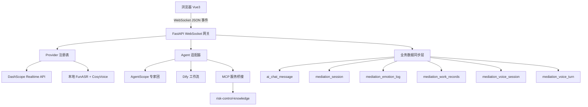

# 调解全双工语音通信系统设计方案

> 基于 qwen-audio-agent 架构调研，为 risk_control 调解功能设计的全双工语音通信方案。

## 1. 系统架构

### 1.1 整体架构



### 1.2 模块职责

| 模块 | 路径 | 职责 |
|------|------|------|
| WebSocket 网关 | `routers/mediation/voice_ws.py` | WebSocket 连接管理、事件路由 |
| Provider 注册表 | `ai/voice/provider_registry.py` | Provider 选择、自动降级 |
| DashScope Provider | `ai/voice/dashscope_provider.py` | 云端端到端语音（Qwen-Audio Realtime） |
| Local Provider | `ai/voice/local_provider.py` | 本地 STT+TTS 管线 |
| Turn 状态机 | `ai/voice/turn_state.py` | 轮次代际仲裁 |
| 音频编解码 | `ai/voice/audio_codec.py` | 重采样/PCM16/Base64 |
| 语音会话服务 | `services/mediation/voice_session_service.py` | 会话生命周期管理 |
| 轮次管理服务 | `services/mediation/voice_turn_service.py` | 轮次管理 + 业务数据同步 |
| Agent 适配器 | `ai/voice/agent_adapter.py` | AgentAdapter 抽象 + AgentScope/Dify 接入 |
| MCP 桥接 | `ai/voice/mcp_bridge.py` | MCP 服务调用桥接 |
| 前端核心 API | `useMediationVoice.js` | WebSocket + 音频采集/播放 + 双模切换 |

### 1.3 调解场景模式

- **单方模式（single）**：1 个用户 + AI 调解员，Provider 直连，VAD 自动检测发言
- **多方模式（multi）**：N 个当事人 + AI 调解员，Gateway 做发言权仲裁（`voice.ownership`）和音频路由

## 2. 关键技术选型

### 2.1 Provider 选型对比

| 维度 | DashScope Realtime（云端） | Local Pipeline（本地） |
|------|--------------------------|----------------------|
| STT | Qwen-Audio 端到端内置 | FunASR `paraformer-zh-streaming` |
| LLM | Qwen-Audio 内置推理 | 现有 AgentScope / Dify 工作流 |
| TTS | Qwen-Audio 端到端内置 | CosyVoice `cosyvoice-300m` |
| 延迟 | ~500ms 首字节 | ~1.5-3s |
| 离线 | 不可用 | 完全可用 |
| VAD | Provider 内置 server_vad | 本地 WebRTC VAD |

**决策**：默认 DashScope Realtime，API Key 未配置或网络不可达时自动降级到 Local Pipeline。

### 2.2 WebSocket 事件协议

**客户端 → 服务端**：

| 事件 | 说明 | 载荷 |
|------|------|------|
| `connect` | 建立连接（含角色配置） | `{ sessionId, participantId, mode, systemPrompt, greeting, roleName, roleDescription, voiceIdentity, language, textOnly, voiceEnabled, outputEnabled }` |
| `audio.append` | 上行音频帧 | `{ audio: "base64_pcm16", sampleRate: 16000 }` |
| `input.message` | 文字消息 | `{ text: "..." }`（网关按 `event.get("text")` 解析，触发 `DashScopeProvider.send_text`） |
| `mute` / `unmute` | 麦克风开关 | — |
| `output.mode` | 切换 AI 回复模式 | `{ mode: "voice"\|"text" }` |
| `interrupt` | 打断 AI 播放 | — |
| `playback.started` | 播放开始确认 | `{ responseId }` |
| `playback.ended` | 播放结束确认 | `{ responseId }` |

**服务端 → 客户端**：

| 事件 | 说明 | 载荷 |
|------|------|------|
| `voice.ready` | 连接就绪 | `{ inputSampleRate, outputSampleRate, provider, providerLabel }` |
| `voice.state` | 状态变更 | `{ state: "idle"\|"listening"\|"processing"\|"speaking" }` |
| `voice.ownership` | 发言权变更（多方） | `{ state: "active"\|"available", holder }` |
| `turn.started` | 新轮次开始 | `{ turnId, role }` |
| `audio.delta` | TTS 音频帧 | **二进制 WebSocket 帧**（原始 16bit PCM，24kHz，单声道），无 JSON 信封；`playAudio` 直接喂 `AudioContext`（兼容 base64 字符串回退） |
| `audio.done` | 音频结束 | `{ responseId }` |
| `transcript.delta` | 转写增量（含用户 ASR 与模型口播） | `{ text, role: "user"\|"assistant" }`（JSON） |
| `transcript.final` | 转写终态 | `{ text, role }`（当前 M5 以 `transcript.delta`+`role` 覆盖，终态帧待补） |
| `playback.clear` | 清除播放 | — |
| `error` | 错误 | `{ message, code }` |

### 2.3 音频格式约定

| 方向 | 采样率 | 格式 | 编码 |
|------|--------|------|------|
| 上行（麦克风→服务端） | 16kHz | PCM16 | Base64 |
| 下行（服务端→播放器） | 24kHz | PCM16 | Base64 |
| 前端重采样 | 浏览器原生(48kHz) → 16kHz | 线性插值 | — |

### 2.4 DashScope 连接鉴权与音频编码（实现修正，对齐 qwen-audio-agent）

> 实现已落地 `app/mediation/voice/providers/dashscope.py`，此处登记设计约束（根因与排查见差距分析 §A.6）。

- **鉴权**：DashScope Realtime WebSocket 握手阶段通过 `Authorization: Bearer <api_key>` 头鉴权；**不使用** `?api-key=` 查询参数（已废弃，会触发 401）。连接 URL 仅带 `?model=<model>`。
- **音频编码**：`send_audio` 上行音频为 **base64 编码的 PCM**（16kHz）；浏览器上行原始 PCM 字节，网关侧 base64 编码后发送。下行 `response.audio.delta.delta` 为 base64 PCM，网关侧 `base64.b64decode` 还原为**原始 PCM 字节**，以**二进制 WebSocket 帧**下发（`provider_reader` 检测 `bytes` → `send_bytes`），浏览器 `AudioContext` 直接播放（24kHz/16bit/单声道）。前端 `playAudio` 同时兼容 base64 字符串回退。
- **依赖**：`websockets.connect` 鉴权头必须用 `additional_headers`（直接写入握手请求头，Python 3.11 即可）；**不能用 `extra_headers`**——它会转发到 `loop.create_connection(extra_headers=)`，该参数需 Python 3.12+，在 3.11/Windows 上抛 `TypeError` 导致头发不出 → 401（根因是参数名，非版本）。
- **端点可配置**：`ai_api_key.url` 可覆盖默认 `wss://dashscope.aliyuncs.com/api-ws/v1/realtime`，支持百炼业务空间专属域名。

### 2.5 音频质量保障（DSP 播放链，2026-09-14 修复）

> 详见 `2026-09-14-voice-audio-quality-design.md`（方案 A：根因修复 + 轻量 DSP 播放链）。
> 本节登记已落地的音频质量约束，实施细节以该设计文档为准。

**根因修复（对标 qwen-audio-agent）**：

| 根因 | 修复 |
|------|------|
| 上行 48kHz PCM 直发，模型按 16k 解析（音频拉慢 3 倍、频谱畸变） | `createStreamingResampler` 跨 chunk 保留相位，`ctx.sampleRate → input_sample_rate(16k)` 后再发送 |
| getUserMedia 未显式 AEC/NS/AGC，外放回声自激 | 显式 `{ echoCancellation, noiseSuppression, autoGainControl: true }` |
| 下行逐 delta 立即播放，重叠/缝隙产生咔哒声 | `useVoicePlayback` 连续时间轴调度（cursor）+ 100ms 抖动合并 |
| session.update 缺 turn_detection，默认 VAD 阈值不可控 | `configure_session` 默认下发 `{type: "smart_turn"}`（可覆盖/关闭） |
| 播放链无后处理 | `createPlaybackChain`：HPF(80Hz)→LPF(8kHz)→压缩器(-12dB, 3:1)→+2dB 补偿 |

**DSP 参数集中**：`frontend/src/utils/audioDsp.ts` 的 `AUDIO_DSP_CONFIG`（一行可切 300–3400Hz 电话带宽）；噪声门：播放侧 -60dBFS（静音段嘶声压到 ≤ -60dBFS）、上行侧 -50dBFS；AudioContext 显式 48kHz。

## 3. 数据库设计

### 3.1 新增表

**`mediation_voice_session`** — 语音连接会话

| 字段 | 类型 | 说明 |
|------|------|------|
| `id` | UUID PK | 主键 |
| `mediation_session_id` | FK → mediation_session | 关联调解会话 |
| `participant_id` | VARCHAR(64) | 参与者标识 |
| `provider` | VARCHAR(32) | `dashscope` / `local` |
| `mode` | VARCHAR(16) | `single` / `multi` |
| `status` | VARCHAR(16) | `connecting` / `active` / `reconnecting` / `closed` |
| `input_sample_rate` | INT | 上行采样率（默认 16000） |
| `output_sample_rate` | INT | 下行采样率（默认 24000） |
| `connected_at` | TIMESTAMP | 连接建立时间 |
| `disconnected_at` | TIMESTAMP | 断开时间 |
| `disconnect_reason` | VARCHAR(64) | 断开原因 |
| `reconnect_count` | INT | 重连次数 |
| `metadata` | JSONB | 扩展信息 |

**`mediation_voice_turn`** — 语音轮次明细

| 字段 | 类型 | 说明 |
|------|------|------|
| `id` | UUID PK | 主键 |
| `voice_session_id` | FK → mediation_voice_session | 关联语音会话 |
| `turn_id` | VARCHAR(64) | 轮次 ID |
| `turn_generation` | INT | 代际序号 |
| `role` | VARCHAR(16) | `user` / `assistant` / `system` |
| `input_type` | VARCHAR(16) | `voice` / `text` |
| `transcript` | TEXT | 最终转写文本 |
| `response_text` | TEXT | AI 回复文本 |
| `audio_duration_ms` | INT | 用户语音时长 |
| `response_duration_ms` | INT | AI 回复时长 |
| `started_at` | TIMESTAMP | 轮次开始时间 |
| `completed_at` | TIMESTAMP | 轮次完成时间 |
| `cancelled` | BOOLEAN | 是否被取消 |

### 3.2 数据写入全景

| 语音事件 | 写入目标表 | 写入内容 |
|---------|-----------|---------|
| 用户语音 → STT 最终转写 | `ai_chat_message` | `role="user"`, `content=转写文本`, `extra_data.input_mode="voice"` |
| AI 回复文本 | `ai_chat_message` | `role="assistant"`, `content=回复文本` |
| 语音情绪分析 | `mediation_emotion_log` | `party_id`, `turn`, `emotion_score`, `emotion_type`, `source_text` |
| 语音触发复杂意图 | `mediation_work_records` | `user_request=转写文本`, `result_speech=AI回复`, `owner=party_id` |
| 每轮对话结束 | `mediation_session.total_turns` | +1 递增 |
| 语音会话开始 | `mediation_session` | `chat_session_id` 更新 |

### 3.3 同步写入时序

```
1. 用户说话 → Provider STT → transcript.final
2. 写入 AiChatMessage(role=user, input_mode=voice)
3. 写入 MediationEmotionLog(情绪分析)
4. 智能路由判断意图类型
   ├── 简单意图 → 直接生成回复 → 写入 AiChatMessage(role=assistant)
   └── 复杂意图 → 写入 MediationWorkRecord → Worker 处理 → 回填 result_speech
5. MediationSession.total_turns += 1
6. MediationVoiceTurn 记录完整轮次
```

### 3.4 关系图

```
MediationCase (案件)
  ├── MediationSession (调解会话)
  │     ├── total_turns ← 语音轮次结束时 +1
  │     ├── AiChatMessage (统一消息表)
  │     │     ├── input_mode="voice"  ← 语音转写
  │     │     └── input_mode="manual" ← 文字输入
  │     ├── MediationVoiceSession (新增)
  │     │     └── MediationVoiceTurn (新增)
  │     ├── MediationEmotionLog ← 语音情绪分析
  │     └── MediationWorkRecord ← 语音触发复杂意图
  └── MediationParticipant ← 语音会话参与者关联
```

## 4. 后端核心设计

### 4.1 Provider 抽象接口

```python
class VoiceProvider(Protocol):
    key: str                          # "dashscope" / "local"
    label: str
    input_sample_rate: int            # 16000
    output_sample_rate: int           # 24000

    async def connect(self, session_config: dict) -> None: ...
    async def send_audio(self, pcm_base64: str) -> None: ...
    async def send_text(self, text: str) -> None: ...
    async def interrupt(self) -> None: ...
    async def close(self) -> None: ...
    def on_audio_delta(self, callback: Callable) -> None: ...
    def on_transcript(self, callback: Callable) -> None: ...
    def on_state_change(self, callback: Callable) -> None: ...
    def on_error(self, callback: Callable) -> None: ...
    def is_configured(self) -> bool: ...
```

### 4.2 WebSocket 路由伪代码

```python
@router.websocket("/ws/mediation/voice/{session_id}")
async def voice_websocket(ws: WebSocket, session_id: int):
    participant = await authenticate_ws(ws)
    voice_session = await voice_session_service.create(
        mediation_session_id=session_id,
        participant_id=participant.id,
        mode=participant.mode,
    )
    provider = provider_registry.resolve(voice_session.id)
    turn_state = TurnState()

    await ws.send_json({"type": "voice.ready", ...})

    async for event in ws.iter_json():
        match event["type"]:
            case "audio.append":
                await provider.send_audio(event["audio"])
            case "input.message":
                await handle_text_input(event, turn_state, provider)
            case "interrupt":
                await provider.interrupt()
                await ws.send_json({"type": "playback.clear"})

    await voice_session_service.close(voice_session.id)
    await provider.close()
```

### 4.3 会话初始化配置

参考 qwen-audio-agent 的 `RoleManager` + `CONNECT` 帧模式，调解会话初始化时客户端通过 `connect` 事件下发以下参数：

| 参数 | 字段名 | 类型 | 必填 | 说明 |
|------|--------|------|------|------|
| 开场白 | `greeting` | string | 否 | 连接就绪后自动播报的第一句问候语 |
| 系统角色提示词 | `systemPrompt` | string | 否 | 实时语音/文字会话的系统提示词 |
| 角色名称 | `roleName` | string | 否 | AI 调解员显示名称（如「纠纷调解助手」） |
| 角色描述 | `roleDescription` | string | 否 | 角色用途说明（前端展示用） |
| TTS 音色 | `voiceIdentity` | string | 否 | 语音合成音色 ID（如 `longanqian`） |
| 对话语言 | `language` | string | 否 | 语言/方言指令（如「用四川话回答」），注入系统提示词 |

**提示词优先级链**（与 qwen-audio-agent 一致）：

```
connect 帧 systemPrompt > roleId 对应角色 prompt > 服务端默认 prompt
```

**初始化时序**：

```
1. 前端发送 connect 事件（携带 greeting/systemPrompt/voiceIdentity/language 等）
2. 服务端解析角色配置：
   ├── 合并 systemPrompt + language 为最终 instructions
   ├── 选择 voiceIdentity（按 provider 区分：dashscope vs local）
   └── 记录 greeting 待播报
3. Provider 连接就绪 → 发送 voice.ready
4. 自动播报 greeting（outputEnabled 时）
5. 进入 idle 状态，等待用户输入
```

**connect 事件完整载荷示例**：

```json
{
  "type": "connect",
  "sessionId": "mediation-case-001",
  "participantId": "party_a",
  "mode": "single",
  "systemPrompt": "你是一名专业的纠纷调解员，擅长处理邻里纠纷...",
  "greeting": "您好，我是AI调解助手，请问有什么可以帮您？",
  "roleName": "纠纷调解助手",
  "roleDescription": "专业邻里纠纷AI调解员",
  "voiceIdentity": "longanqian",
  "language": "用普通话回答",
  "textOnly": false,
  "voiceEnabled": true,
  "outputEnabled": true
}
```

### 4.4 语音/文字双模全双工通信

系统支持语音和文字两种模式在同一 WebSocket 连接内无缝切换，**用户输入模式和 AI 回复模式可独立控制**。

**能力声明模型**：

| 标志 | 含义 |
|------|------|
| `voiceEnabled` | 客户端具备语音采集能力（有麦克风） |
| `outputEnabled` | 客户端具备音频播放能力（有扬声器） |
| `textOnly` | 纯文字模式（无语音，等同 `voiceEnabled=false && outputEnabled=false`） |
| `outputMode` | AI 回复模式：`"voice"`（语音+文字） / `"text"`（仅文字） |

**四维模式矩阵**（用户输入 × AI 回复独立切换）：

| 用户输入 | AI 回复 | 场景示例 |
|---------|---------|----------|
| 语音 | 语音 | 默认全语音模式 |
| 语音 | 文字 | 用户说话，AI 文字回复（安静环境） |
| 文字 | 语音 | 用户打字，AI 语音播报（驾车场景） |
| 文字 | 文字 | 纯文字对话模式 |

**模式切换流程**：

```
用户输入切换：
  语音 → 文字：发送 mute 事件 → 停止麦克风采集 → 后续通过 input.message 发送文字
  文字 → 语音：发送 unmute 事件 → 恢复麦克风采集 → 后续通过 audio.append 发送语音

文字对聊（M5 已落地）：
  - 前端 `sendText(text)` → 发送 `input.message { text }` → 网关 `await DashScopeProvider.send_text(text)`
  - `DashScopeProvider.send_text` 已实现：发送 `conversation.item.create`（role=user, input_text）+ `response.create` 触发模型回复
  - 前端本地回显用户输入（role=user），模型回复以 `transcript.delta`(role=assistant) 流式累积显示

AI 回复切换：
  语音 → 文字：发送 output.mode 事件 { mode: "text" }
    → AI 回复仅以文字形式下发（transcript.final），不生成 audio.delta
  文字 → 语音：发送 output.mode 事件 { mode: "voice" }
    → AI 回复同时下发文字 + TTS 音频（audio.delta）

混合输入：
  同一会话内可交替使用语音和文字输入
  AiChatMessage.input_mode 区分来源："voice" / "manual"
  AiChatMessage.extra_data.output_mode 记录 AI 回复模式："voice" / "text"
```

**WebSocket 路由伪代码**（含双模处理）：

```python
@router.websocket("/ws/mediation/voice/{session_id}")
async def voice_websocket(ws: WebSocket, session_id: int):
    participant = await authenticate_ws(ws)

    # 等待 connect 事件获取角色配置
    connect_event = await ws.receive_json()
    session_config = parse_connect_event(connect_event)

    voice_session = await voice_session_service.create(
        mediation_session_id=session_id,
        participant_id=participant.id,
        mode=session_config.mode,
        provider=session_config.provider,
    )
    provider = provider_registry.resolve(voice_session.id)
    turn_state = TurnState()

    # 构建 instructions（合并 systemPrompt + language）
    instructions = build_instructions(
        system_prompt=session_config.system_prompt,
        language=session_config.language,
    )
    await provider.connect({
        "instructions": instructions,
        "voice": session_config.voice_identity,
    })

    await ws.send_json({"type": "voice.ready", ...})

    # 自动播报开场白
    if session_config.output_enabled and session_config.greeting:
        await provider.speak(session_config.greeting)

    async for event in ws.iter_json():
        match event["type"]:
            case "audio.append":
                if not session_config.text_only:
                    await provider.send_audio(event["audio"])
            case "input.message":
                await handle_text_input(event, turn_state, provider)
            case "mute":
                session_config.voice_enabled = False
            case "unmute":
                session_config.voice_enabled = True
            case "interrupt":
                await provider.interrupt()
                await ws.send_json({"type": "playback.clear"})

    await voice_session_service.close(voice_session.id)
    await provider.close()
```

### 4.5 后台 Agent 接入

参考 qwen-audio-agent 的 Backend Agent Registry 模式（`backends/registry.mjs`），调解语音系统支持接入 risk_control 自身的后台 Agent 作为 AI 推理引擎，替代默认的端到端语音模型。

**Agent 接入架构**：

```
WebSocket 网关
  ├── Provider（语音层：DashScope Realtime / Local STT+TTS）
  └── AgentAdapter（推理层）
        ├── AgentScopeAdapter  → AgentScope 专家团
        ├── DifyAdapter        → Dify 工作流
        └── LocalLLMAdapter    → 本地 LLM（备用）
```

**AgentAdapter 抽象接口**：

```python
class AgentAdapter(Protocol):
    key: str                    # "agentscope" / "dify" / "local_llm"
    label: str

    async def initialize(self, session_config: dict) -> None: ...
    async def process(self, user_text: str, context: dict) -> AgentResponse: ...
    async def interrupt(self) -> None: ...
    async def close(self) -> None: ...

class AgentResponse:
    text: str                   # 回复文本
    metadata: dict              # 额外信息（情绪分析、意图分类等）
```

**Agent 选择优先级**（与 Provider 选择一致）：

```
connect 帧 agentId > 调解案件配置的默认 agent > 系统全局默认 agent
```

**与 Provider 的协作模式**：

| 模式 | Provider 职责 | AgentAdapter 职责 |
|------|-------------|-------------------|
| 端到端语音 | DashScope Realtime（STT+LLM+TTS） | 不启用 |
| Provider + Agent | DashScope/Local（STT+TTS） | AgentScope/Dify（LLM 推理） |
| 纯文字 | 不启用 | AgentScope/Dify（LLM 推理） |

当 `outputMode="text"` 或 `textOnly=true` 时，Provider 语音层跳过，直接由 AgentAdapter 处理文字输入/输出。

**connect 事件扩展载荷**：

```json
{
  "type": "connect",
  "agentId": "agentscope",
  "agentConfig": {
    "expertTeam": "mediation_team_v2",
    "workflowId": null
  },
  "mcpServers": ["risk-control-knowledge"]
}
```

### 4.6 MCP 服务集成

参考 qwen-audio-agent 的 Frontend MCP 配置（`frontend-mcp-config.mjs`），调解语音系统允许 AI Agent 在推理过程中调用 risk_control 已有的 MCP 服务。

**MCP 服务注册**：

复用 risk_control 已注册的 MCP 服务器（如 `risk-control-knowledge`），在语音会话初始化时按需注入到 Agent 的工具列表中。

**MCP 配置结构**（参考 qwen-audio-agent 的 `normalizeFrontendMcpConfiguration`）：

```json
{
  "version": 1,
  "servers": [
    {
      "key": "risk-control-knowledge",
      "enabled": true,
      "transport": {
        "type": "streamable-http",
        "url": "http://localhost:8000/mcp/risk-control-knowledge"
      },
      "tools": {
        "dispute_strategy_search": { "enabled": true, "timeoutMs": 8000 },
        "dispute_case_search": { "enabled": true, "timeoutMs": 8000 },
        "semantic_query": { "enabled": true, "timeoutMs": 8000 }
      }
    }
  ]
}
```

**工具策略**：

| 字段 | 说明 | 默认值 |
|------|------|--------|
| `enabled` | 是否启用该工具 | `true` |
| `timeoutMs` | 单次调用超时 | `8000` |
| `maxCallsPerTurn` | 每轮最大调用次数 | `2` |
| `maxResultBytes` | 返回结果最大字节数 | `32768` |

**调用流程**：

```
1. AgentAdapter 推理过程中决定调用 MCP 工具
2. MCP Client 通过 streamable-http 调用 risk_control MCP Server
3. 工具执行结果返回给 Agent
4. Agent 基于工具结果生成最终回复
5. 回复通过 Provider 下发给用户（语音或文字）
```

### 4.7 Turn 状态机

```python
class TurnState:
    turn_generation: int = 0
    committed_generation: int = 0

    def begin_voice(self) -> int:
        self.turn_generation += 1
        return self.turn_generation

    def end_speech(self) -> None:
        self.committed_generation = self.turn_generation

    def is_stale(self, generation: int) -> bool:
        return generation < self.turn_generation
```

## 5. 前端组件设计

### 5.1 组件树

```
MediationVoiceRoom.vue          # 语音调解房间
├── VoiceStatusBar.vue           # 语音状态指示
├── ParticipantList.vue          # 参与者列表
├── TranscriptPanel.vue          # 实时转写面板
├── VoiceControlBar.vue          # 控制栏（麦克风/打断/挂断）
├── useMediationVoice.js         # 核心组合式 API
├── useMicrophoneCapture.js      # 麦克风采集
└── useAudioPlayback.js          # 音频播放
```

### 5.2 useMediationVoice.js 接口

```javascript
export function useMediationVoice(options) {
  const {
    sessionId, participantId, mode,
    // 角色初始化配置
    systemPrompt, greeting, roleName, roleDescription,
    voiceIdentity, language,
  } = options

  const voiceState = ref('idle')
  const transcripts = ref([])
  const participants = ref([])
  const isMuted = ref(false)
  const connectionStatus = ref('disconnected')
  const inputMode = ref('voice')  // 'voice' | 'text' | 'mixed'
  const outputMode = ref('voice') // 'voice' | 'text' — AI 回复模式

  function connect() { ... }         // 发送 connect 事件（含角色配置）
  function disconnect() { ... }
  function toggleMute() { ... }      // mute/unmute 切换
  function interrupt() { ... }
  function sendTextMessage(text) { ... }
  function switchInputMode(mode) {   // 'voice' | 'text'
    inputMode.value = mode
    if (mode === 'text') toggleMute()  // 切文字时自动 mute
    else if (isMuted.value) toggleMute() // 切语音时自动 unmute
  }
  function switchOutputMode(mode) {    // 'voice' | 'text'
    outputMode.value = mode
    ws.send({ type: 'output.mode', mode })
  }

  return {
    voiceState, transcripts, participants, isMuted, connectionStatus, inputMode, outputMode,
    connect, disconnect, toggleMute, interrupt, sendTextMessage,
    switchInputMode, switchOutputMode,
  }
}
```

### 5.3 单方 vs 多方 UI 差异

| 维度 | 单方模式 | 多方模式 |
|------|---------|---------|
| 参与者 | 用户 + AI（2 人） | A + B + AI（3+ 人） |
| 发言权 | VAD 自动检测 | Gateway `voice.ownership` 仲裁 |
| 转写面板 | 单列对话流 | 按角色分列 |
| 音频路由 | 直连 Provider | Gateway 混音/分发 |

### 5.4 前端输入模式切换 UI

```
VoiceControlBar.vue 控制栏：
┌──────────────────────────────────────────────┐
│  [🎤 语音]  [⌨️ 文字]  [🔇静音]  [⏹打断]  [📞挂断]  │
└──────────────────────────────────────────────┘

语音模式：显示 VoiceStatusBar + TranscriptPanel（实时转写）
文字模式：隐藏 VoiceStatusBar，显示 ChatInputBox（类现有文字对话界面）
混合模式：两者同时可见，用户可自由切换
```

### 5.5 前端音频管线

```
采集：麦克风 → getUserMedia(echoCancellation+noiseSuppression+autoGainControl)
     → ScriptProcessor(2048, 1, 1) → 去直流 + 软噪声门(-50dBFS)
     → 流式重采样(48kHz → 16kHz，跨 chunk 保留相位) → PCM16 二进制 → WebSocket

播放：WebSocket 下行音频为**二进制帧**（原始 PCM 字节）→ useVoicePlayback.push()
     → 去直流 + 噪声门(-60dBFS) → 抖动合并(~100ms) → AudioBufferSourceNode(24kHz)
     → 连续时间轴调度(cursor) → HPF(80Hz,4阶) → LPF(8kHz,4阶)
     → 压缩器(-12dB, 3:1) → 补偿增益(+2dB) → destination
```

> AudioContext 显式 48kHz（`AUDIO_DSP_CONFIG.contextSampleRate`，旧浏览器回退设备默认）。
> 播放链节点参数见 `frontend/src/utils/audioDsp.ts`。

## 6. 分阶段开发计划

### Task 1：基础设施层（2-3 天）
- 新增 ORM 模型 `MediationVoiceSession` + `MediationVoiceTurn`
- `app/db/init_models.py` 登记新模型
- Alembic 迁移脚本
- `ai/voice/audio_codec.py`：重采样 / PCM16 / Base64 工具
- `ai/voice/provider_protocol.py`：Provider ABC
- `ai/voice/provider_registry.py`：注册表 + 自动降级

### Task 2：Provider 实现（3-4 天）
- `ai/voice/dashscope_provider.py`：DashScope Realtime 对接
- `ai/voice/local_provider.py`：FunASR + CosyVoice（可先 mock）
- `ai/voice/turn_state.py`：Turn 代际仲裁
- 单元测试：Provider 接口契约测试

### Task 3：会话初始化 + WebSocket 网关（3-4 天）
- `schemas/mediation/voice.py`：`VoiceConnectConfig` 请求模型（greeting/systemPrompt/voiceIdentity/language/agentId/mcpServers 等）
- `routers/mediation/voice_ws.py`：WebSocket 路由 + connect 事件解析 + 角色配置合并
- `services/mediation/voice_session_service.py`：会话生命周期
- `services/mediation/voice_turn_service.py`：轮次管理 + 数据同步
  - 转写 → `AiChatMessage`（`input_mode="voice"`）
  - 情绪 → `MediationEmotionLog`
  - 轮次 → `MediationSession.total_turns`
  - 复杂意图 → `MediationWorkRecord`
- 集成测试

### Task 4：后台 Agent + MCP 集成（3-4 天）
- `ai/voice/agent_adapter.py`：AgentAdapter 抽象接口
- `ai/voice/agentscope_adapter.py`：AgentScope 专家团接入
- `ai/voice/dify_adapter.py`：Dify 工作流接入
- `ai/voice/mcp_bridge.py`：MCP 服务桥接（复用 risk-control-knowledge 等）
- 单元测试：AgentAdapter 接口契约测试

### Task 5：语音/文字双模 + 前端组件（3-4 天）
- `useMediationVoice.js`：核心组合式 API（含 connect 角色配置 + switchInputMode + switchOutputMode）
- `useMicrophoneCapture.js`：麦克风采集
- `useAudioPlayback.js`：音频播放队列
- `MediationVoiceRoom.vue`：顶层容器 + 子组件
- `VoiceControlBar.vue`：语音/文字切换按钮（输入模式 + AI 回复模式独立切换）
- 单方模式 E2E 联调（语音+文字双模）

### Task 6：多方模式 + 收尾（2-3 天）
- 多方发言权仲裁（`voice.ownership`）
- 断线重连（指数退避）
- 前端多方参与者 UI
- 集成测试 + 手动验收

**总计预估：16-22 天**
