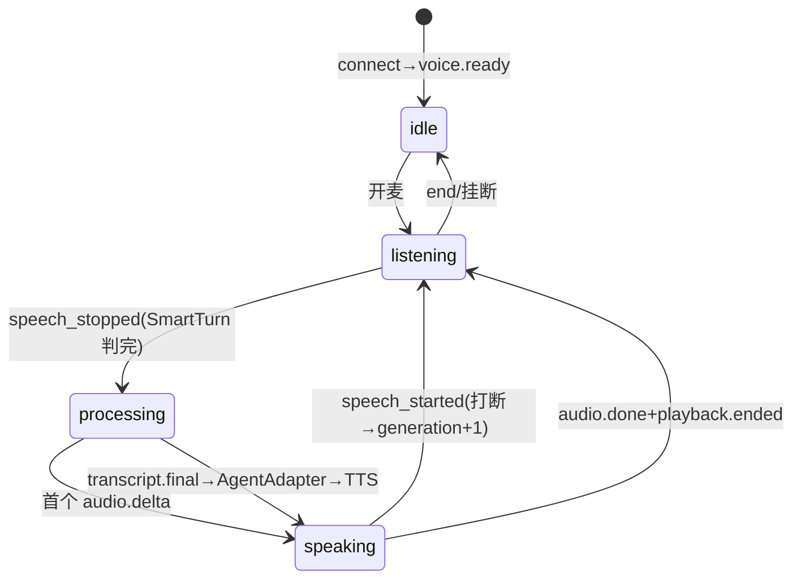

# 调解全双工语音通信层技术设计 v3（主应用内嵌形态）

| 项 | 内容 |
|---|---|
| 文档日期 | 2026-09-08（v3.0） |
| 状态 | v3 已定稿：服务形态按用户决策修订为**主应用内嵌**（init_models 登记、进程内 import），与差距分析 v1.3 执行规划对齐 |
| 参考文档 | `docs/superpowers/specs/2026-09-05-mediation-voice-gap-analysis.md`（v1.3，本设计的主要任务来源）<br>`docs/superpowers/specs/2026-09-05-mediation-voice-communication-design.md`（Qoder 设计）<br>`d:\work\qwen-audio-agent`（架构参考） |

## 修订记录

| 版本 | 日期 | 变更 |
|---|---|---|
| v1.0 | 2026-09-08 | 初版：独立服务方案 |
| v2.0 | 2026-09-08 | 吸收 Qoder 两份文档：存量复用、数据模型复用、AgentBridge 桥接、协议增强、Vue3、6-8 周 |
| v2.1 | 2026-09-08 | 整合差距分析 v1.3 执行任务（附录 C 对照表） |
| **v3.0** | **2026-09-08** | **服务形态反转（用户决策）：废弃独立服务 mediation-rtc，改为主应用内嵌**——D3/D4/D5/D8 重写；删除回调 API/独立 Alembic/双跑期；AgentAdapter 改为进程内直接调用（差距分析 §3.1 原样采纳）；表登记 `init_models.py`；里程碑对齐 18 天规划并补本地管线/生产就绪（约 4.5-5 周）；新增附录 B 全量变更清单（新增/修改/删除） |

## 0.2 决策记录（D1–D9，v3 修订）

| # | 决策点 | 结论 |
|---|---|---|
| D1 | 会话拓扑 | 分阶段：MVP 1对1（当事人 ↔ AI 调解员），协议/表结构预留多方（`voice.ownership`、`participant.*`） |
| D2 | 语音引擎 | Provider 双实现：DashScope 云端 Realtime + 本地私有化管线（M4），配置切换+故障降级 |
| **D3** | **服务形态（v3 反转）** | ~~独立服务 mediation-rtc~~ → **主应用内嵌**：语音模块位于 `backend/app/mediation/voice/`，经 FastAPI WS 提供服务，进程内 import 复用 `app/ai/*` 基础设施；无新服务/端口/容器 |
| **D4** | **数据所有权（v3 简化）** | 单应用单一写入方：`mediation_voice_session`/`mediation_voice_turn` 等新表 ORM 定义于 `app/models/`、**登记 `app/db/init_models.py`**（AGENTS.md 强制约定）、主应用 Alembic 迁移；语音服务经 SQLAlchemy 直写全部相关表（无需跨服务回调） |
| **D5** | **推理接入（v3 简化）** | **AgentAdapter 进程内直接调用**（差距分析 §3.1 原样采纳）：`AgentScopeAdapter`（默认，Agent.reply/reply_stream + ToolManager + Plan 工具）/ `DifyAdapter` / `DirectLLMAdapter`（兜底），由 EngineRegistry 分派 |
| D6 | 协议扩展 | 扩展事件冻结：`expert.join/leave`、`agent.activity`、`insight.delta`、`response.request`、`participant.*` |
| D7 | 里程碑顺序 | 基础能力（≈差距分析 Phase1-3，18 天）→ 本地管线真实对接 + 生产就绪（本文档补全，1.5-2 周），总计 **4.5-5 周** |
| **D8** | **存量骨架处置（v3 修订）** | `app/mediation/voice/`（websocket_gateway/providers/fallback）**原位增强**（非迁移非重写）：接口形状保持（connect/send_audio/events/close），事件层按协议 v2 重写 |
| D9 | 前端技术栈 | Vue3（存量栈）；复用 `views/mediation/` 与 `views/admin/ai/` 面板模式 |

---

## 1. 背景与调研结论

### 1.1 qwen-audio-agent 调研摘要（架构蓝本）

| 层 | 参考实现 | 采纳情况 |
|---|---|---|
| 前端采集 | ScriptProcessor 128ms chunk、Float32→PCM16@16k、回声消除约束、无客户端 VAD | ✅ 采纳 |
| 播放 | AudioContext 时间轴游标连续排程 + stopAllSources + 播放回执 | ✅ 采纳 |
| 状态机 | 服务端权威 `voice.state`，客户端只接受不推导 | ✅ 采纳 |
| 打断 | speech_started → playback.clear + provider cancel + **generation 代际防陈旧** | ✅ 采纳（硬性不变量） |
| VAD/STT/TTS | 云端托管；本地 Silero+SmartTurn / Paraformer 2pass / 句级流式 TTS | ✅ 采纳（TTS 用 CosyVoice2） |
| 重连 | 事件环形缓冲 512 重放 | ✅ 采纳 |
| 插播 | agent.activity（announcementWindow 门控） | ✅ 协议预留（D6） |

### 1.2 risk_control 存量实现盘点（差距分析 v1.3 + 代码实测）

**已有（原位增强/直接复用）**：

| 资产 | 位置 | 现状实测 | 处置 |
|---|---|---|---|
| WebSocket 网关 | `app/mediation/voice/websocket_gateway.py` | `/mediation/voice/ws`：上行裸 bytes、下行 JSON+二进制；无 connect 帧/状态机/代际/持久化/重连；认证仅 case_number+party_id（无 JWT） | **原位改造**（协议 v2 事件层 + JWT） |
| Provider 抽象/注册表 | `app/mediation/voice/providers/{base,registry}.py` | ABC（connect/send_audio/events/close）+ 类注册 | 增强能力声明/实例注册/is_configured |
| DashScope Provider | `app/mediation/voice/providers/dashscope.py` | 硬编码事件解析 | 接协议适配器 |
| 语音降级 | `app/mediation/voice/fallback.py` | Provider 切换 + 文字降级 | 补 classifyError + 退避 + 超时 |
| 调解引擎 | `app/mediation/engine.py` + `intent_classifier.py` + `route_dispatcher.py` | Text/Voice/Auto 三 Pipeline、8 意图、自适应路由 | 直接复用（意图快路径） |
| Agent 基础设施 | `app/ai/agent_core/registry.py`、`app/ai/engines/registry.py`、AgentScope 2.0.8dev（PipelineEngine 已用 reply/reply_stream/ReActConfig/Msg） | 5 默认 Agent + 6 引擎 | AgentAdapter 直接复用 |
| 工具体系 | `app/ai/tool_manager/manager.py`（AgentScope 原生 Toolkit/ToolBase/ToolGroup + DB 持久化 + `ToolManagement.vue`）、`app/ai/mcp/`（15 知识工具+6 推理工具+MCPAdapter+FastMCP Server+三层 MCP 管理 670 行路由+656 行前端） | 完整 | 复用单例 + Plan/MCP 工具追加 |
| 任务队列 | `app/mediation/work_queue.py`（Redis+PG）+ Celery/APScheduler | 复杂意图异步处理 | 复用 |
| 调解域表 | `models/mediation_session.py`（session/participant/emotion_log）、`models/ai_chat.py`、`models/mediation_work_record.py` | mediation_session（一轮对话）等 | **直接复用**（进程内直写） |
| 前端 | `frontend/`（Vue3）：`views/mediation/`、`components/mediation/`、`components/sse/`、`views/admin/ai/` 管理面板 | 文字调解界面已有 | 新增语音组件树（§10） |

**缺失（本设计补全）**：Turn 状态机与代际仲裁、connect 帧角色配置、能力声明模型、协议适配器、事件协议丰富化（3 种 → 20+）、AgentAdapter、MCP 会话级注入、ToolCallHandler 与工具策略、发言权仲裁（预留）、错误分类+重连退避+响应超时、事件重放、语音会话持久化（2 张表）、双模独立切换、本地私有化管线、监控体系、配置化（Agent DB 化/语音角色/工具策略）。

### 1.3 目标与非目标

**目标**：全双工语音+文字双模（四象限）、实时字幕、打断、断线恢复、双 Provider 切换、复用存量推理与 MCP 资产、多方协议预留、生产就绪。
**非目标**：不改写调解 Agent 业务策略；电话/PSTN；多方音频混流实现（仅预留）；新建独立服务/容器。

---

## 2. 总体架构（主应用内嵌）

### 2.1 架构图

```mermaid
graph TB
    subgraph FE["前端 Vue3（frontend/src）"]
        UI[MediationVoiceRoom.vue<br/>麦克风/时长/字幕/双模切换]
        HOOK[useMediationVoice.js<br/>状态机+重连+connect帧]
        CAP[useMicrophoneCapture.js<br/>Web Audio 采集]
        PB[useAudioPlayback.js<br/>游标播放/打断]
    end

    subgraph APP["risk_control 主应用（backend/app，单进程内嵌）"]
        WS["mediation/voice/websocket_gateway.py<br/>/mediation/voice/ws · JWT · connect帧 · 心跳 · 重连重放(512)"]
        SM["session 状态层<br/>权威状态机 · TurnState代际 · 打断仲裁 · ownership(预留) · 上下文"]
        PR["mediation/voice/providers<br/>能力声明 · 协议适配器 · classifyError · 超时 · 注册表"]
        AA["mediation/voice/agent_adapter.py<br/>AgentAdapter 进程内调用"]
        TCH["tool_call_handler.py + mcp_session_resolver.py"]
        SVC["services/mediation/<br/>voice_session_service · voice_turn_service"]
        MCP["app/ai 现有基础设施<br/>AgentRegistry · EngineRegistry · ToolManager<br/>IntentClassifier · RouteDispatcher · WorkQueue · MCP 三层管理"]
        DIFY["Dify 工作流"]
    end

    subgraph PROV["Provider 实现"]
        DS[DashscopeProvider<br/>云端托管VAD+内置STT/TTS]
        LP[LocalProvider（M4）<br/>Silero+SmartTurn→Paraformer→CosyVoice2]
    end

    DB[(PostgreSQL<br/>现有表+新增5表)]
    RD[(Redis)]
    LLM["LLM（DifyModelWrapper/直连）"]
    OSS[(对象存储 录音归档)]

    UI --> HOOK --> WS
    CAP -->|PCM16@16k 128ms| WS
    WS --> SM --> PR
    PR --> DS -.WSS.-> DashScope云[DashScope Realtime]
    PR --> LP
    SM --> AA
    AA -->|reply/reply_stream| MCP
    MCP --> DIFY
    MCP --> LLM
    TCH --> MCP
    AA --> TCH
    SVC --> DB
    SVC --> RD
    SVC --> OSS
```

### 2.2 模块划分（全部位于 `backend/app/`，差距分析 §6 路径统一收口到 `mediation/voice/`）

```
backend/app/
├── models/                              # B.1 新增 2 表，登记 init_models.py
│   ├── mediation_voice_session.py
│   └── mediation_voice_turn.py
├── schemas/mediation/
│   └── voice.py                         # VoiceConnectConfig / 语音 REST Schema（新增）
├── services/mediation/
│   ├── voice_session_service.py         # 语音连接会话生命周期（新增）
│   └── voice_turn_service.py            # 轮次管理 + 业务数据同步（新增）
├── mediation/voice/                     # 现有包，原位增强（D8）
│   ├── websocket_gateway.py             # 改造：协议 v2 + JWT + connect 帧
│   ├── providers/
│   │   ├── base.py                      # 改造：+capabilities/is_configured
│   │   ├── dashscope.py                 # 改造：接协议适配器
│   │   ├── registry.py                  # 改造：实例注册+validate
│   │   ├── protocol_adapter.py          # 新增：OpenAI 兼容归一化
│   │   └── local_provider.py            # 新增：M4（M2 先 mock）
│   ├── fallback.py                      # 改造：classifyError+退避+超时
│   ├── turn_state.py                    # 新增：代际仲裁
│   ├── capabilities.py                  # 新增
│   ├── audio_codec.py                   # 新增：重采样/PCM16/Base64
│   ├── agent_adapter.py                 # 新增：Protocol + AgentScopeAdapter/DifyAdapter/DirectLLMAdapter
│   ├── mcp_session_resolver.py          # 新增：会话级 MCP 注入
│   ├── tool_call_handler.py             # 新增：参数校验/策略
│   ├── voice_ownership.py               # 新增：多方预留（M2 骨架）
│   ├── reconnect_backoff.py             # 新增
│   └── constants.py                     # 新增：事件类型/状态枚举（禁裸字符串，AGENTS.md 约定）
└── db/init_models.py                    # 修改：登记 2 个新模型
```

> 路径说明：差距分析 §6 将新增语音文件规划在 `ai/voice/`，本设计统一收口到现有 `mediation/voice/`（网关与 providers 已在此，避免同一语音管线跨两包互引）。文件职责一一对应，仅包路径不同。

---

## 3. 关键技术选型

| 决策点 | 候选 | **决策** | 理由 |
|---|---|---|---|
| 服务形态 | ① 独立服务 ② 主应用内嵌 | **② 内嵌**（D3 v3，用户决策） | 进程内直调 AI 基础设施零网络开销；无跨服务数据一致性/回调补偿问题；部署运维不变；语音长连接随主应用 uvicorn 部署（多 worker 时按 sessionId sticky 或单 worker 专用） |
| 传输 | WS+PCM16 base64 / WebRTC | **WS（JSON 文本帧统一，音频 base64 内嵌）** | 存量网关即此模式；128ms chunk base64 开销 33% 内网无压力；帧解析单一化 |
| VAD | 云端托管 / Silero+SmartTurn / WebRTC能量 | **双路径**（云端托管；本地 Silero+SmartTurn） | WebRTC 能量 VAD 噪声环境误判多，弃用 |
| STT/TTS | Paraformer 2pass / CosyVoice2（本地 M4）；云端内置 | 不变 | — |
| 推理接入 | ① 网络桥接（v2 已废弃）② 进程内 AgentAdapter | **② 进程内**（D5 v3） | `AgentScopeAdapter` 直接 `import app.ai.*`（差距分析 §3.1 原样采纳）；快路径/工具/WorkQueue 零序列化成本 |
| 数据写入 | ① 跨服务回调（v2 已废弃）② 进程内直写 | **②**（D4 v3） | voice_turn_service 与业务表同库同事务域，无补偿逻辑 |
| 前端 | Vue3 | 不变（D9） | — |

---

## 4. 通信协议 v2（与部署形态无关，维持不变）

### 4.1 REST（主应用路由，`/api/v1/mediation/voice/*`）

```
GET  /api/v1/mediation/voice/sessions/{id}          会话详情+实时状态
POST /api/v1/mediation/voice/sessions/{id}/end      结束+归档（录音合成/转写落库确认）
GET  /api/v1/mediation/voice/sessions/{id}/transcript  全量转写
POST /api/v1/mediation/voice/sessions/{id}/text     文字消息备用通道
GET  /api/v1/mediation/voice/sessions/{id}/events   SSE 只读旁听（督办大屏）
```

### 4.2 WebSocket `/mediation/voice/ws`（保持现有路径；首帧必须 connect）

**Client → Server**

| 事件 | 载荷 |
|---|---|
| `connect` | `{protocol_version, sessionId, caseNumber, participantId, mode: single\|multi, agentId?, engineCode?, systemPrompt?, greeting?, roleName?, voiceIdentity?, language?, mcpServers?, tools?, enablePlan?, maxReActIters?, textOnly?, voiceEnabled?, outputEnabled?, outputMode?}` |
| `audio.append` | `{audio: base64(PCM16), sampleRate: 16000}` |
| `input.message` | `{parts: [{type: "text", text}]}` |
| `input.mute / input.unmute` | — |
| `output.mode` | `{mode: voice\|text}` |
| `interrupt` | `{reason}` |
| `playback.started / playback.ended / playback.cancelled` | `{responseId, reason?}` |
| `ping` | — |

**Server → Client**

| 事件 | 载荷 |
|---|---|
| `voice.ready` | `{sessionId, inputSampleRate, outputSampleRate, provider, providerLabel}` |
| `voice.state` | `{state: idle\|listening\|processing\|speaking}` |
| `voice.ownership` | `{state: active\|available, holder}`（多方预留） |
| `turn.started` | `{turnId, generation, role}` |
| `transcript.delta / transcript.final` | `{itemId, turnId, role: user\|ai, content}` |
| `response.started / response.interrupted` | `{responseId, reason}` |
| `audio.delta / audio.done` | `{responseId, audio, generation, sampleRate: 24000} / {responseId}` |
| `playback.clear` | `{reason}` |
| `error` | `{code: inactivity\|input_busy\|fatal\|provider_unavailable\|other, message, recoverable}` |
| `pong` | — |

**扩展事件（D6 冻结，Phase 2 后实现）**：`expert.join/leave`、`agent.activity`、`insight.delta`、`response.request`、`participant.joined/left`。

### 4.3 协议硬规则

1. 服务端权威状态机；2. generation 代际仲裁（打断/取消 `+1`，双端丢弃陈旧帧）；3. 打断双路径（服务端 VAD 主动 clear+cancel；客户端 interrupt 立即停播+回执）；4. 前向兼容（信封带 `v`，未知事件 MUST 忽略）；5. 事件重放（环形缓冲 512，按 `last_seq` 增量）；6. mute 期间服务端仍收帧丢弃（时间戳连续，恢复无爆音）。

---

## 5. 会话状态机与打断（维持 v2 设计）



打断仲裁：`speech_started` 且在播 → `generation += 1` → `adapter.interrupt()`（取消 asyncio.Task）+ `provider.interrupt()` → 下发 `playback.clear` → `voice.state=listening`；被打断的 AI 文本仍完整入历史（`interrupted=true`）。下行帧携 `generation`，双端丢弃陈旧帧。

---

## 6. Agent 适配体系（进程内，差距分析 §3.1–§3.5 原样采纳）

### 6.1 AgentAdapter 契约与实现矩阵

```python
@dataclass
class AgentResponse:
    text: str
    metadata: dict = {}
    tools_used: list[str] = []
    tasks_created: list[str] = []          # AgentScope Plan 创建的任务

class AgentAdapter(Protocol):
    key: str; label: str
    async def initialize(self, session_config: dict) -> None: ...
    async def process(self, user_text: str, context: dict) -> AgentResponse: ...
    async def process_stream(self, user_text: str, context: dict) -> AsyncGenerator[str, None]: ...
    async def interrupt(self) -> None: ...             # 取消 asyncio.Task
    async def get_plan_status(self) -> list[dict]: ... # AgentState.tasks_context
    async def close(self) -> None: ...                 # 持久化 AgentState
```

实现矩阵（由 `EngineRegistry` 按 `engineCode` 分派）：`AgentScopeAdapter`（默认）/ `DifyAdapter`（复用 DifyModelWrapper）/ `DirectLLMAdapter`（兜底）。网关调用关系：`websocket_gateway → AgentAdapter.process_stream → text_delta → TTS`。

### 6.2 AgentScopeAdapter（核心）

```python
class AgentScopeAdapter:
    async def initialize(self, session_config):
        agent_config = get_agent_registry().get(session_config.get("agentId", "dispute_mediator"))
        self._toolkit = self._build_toolkit(session_config)        # §6.3
        self._agent = Agent(name=agent_id, system_prompt=..., model=self._resolve_model(...),
                            toolkit=self._toolkit,
                            react_config=ReActConfig(max_iters=session_config.get("maxReActIters", 5)))
        if resume_session_id: self._restore_agent_state(...)
        self._seed_mediation_plan(case_context)                    # §6.4 Seeding
    async def process(self, user_text, context):
        cls = await self._mediation_engine.classify_intent(user_text)   # 意图快路径
        if cls.is_simple:
            return AgentResponse(await self._mediation_engine.handle_simple_intent(user_text, cls))
        reply = await self._agent.reply(UserMsg(name=context["party_id"], content=user_text))
        return AgentResponse(self._extract_text(reply), tools_used=..., tasks_created=...)
    async def process_stream(self, user_text, context):
        async for chunk in self._agent.reply_stream(UserMsg(...)):
            yield token
```

**AgentScope 原生能力利用清单**：`Agent.reply()/reply_stream()`（✅ 已用）、`Toolkit/ToolBase/ToolGroup`（✅ ToolManager 已用）、`TaskCreate/Get/List/Update`（❌ 新增）、`AgentState.tasks_context`（❌ 新增）、`UserMsg/Msg`、`ReActConfig`（✅ 已用）。

### 6.3 工具体系

1. **ToolManager 单例复用**：不新建 Toolkit，复用 `app/ai/tool_manager`（DB 持久化/前端管理/分组/测试/SQLBot 全保留），仅追加 Plan 工具（type_hint=`agentscope_plan`）与 MCP 工具（type_hint=`mcp`）。
2. **MCP 会话级注入**：`McpSessionResolver`——Agent 绑定的 MCP 服务 ID → 查 `McpApiKey`/`MCPClient` → `MCPAdapter` 拉取工具 → 注册会话 Toolkit。调解知识工具（dispute_strategy_search / dispute_case_search / dispute_gold_saying_search / knowledge_base_search / semantic_query / reasoning_rule_lookup）零改动可用。
3. **ToolCallHandler**：参数校验/去重/权限/超时/结果截断；策略 `{enabled, timeoutMs: 8000, maxCallsPerTurn: 2, maxResultBytes: 32768}`，持久化 `tool_policy` 表，前端 `ToolPolicyEditor.vue` 配置。
4. **转写缓冲**：每轮最终转写由 `turn_state` 提供，委派/复杂任务不丢原始意图。

### 6.4 任务管理三层架构（不新建组件）

| 层 | 组件 | 职责 |
|---|---|---|
| L1 Agent 内部 | AgentScope Plan（tasks_context） | 自主拆解；blocks/blocked_by 依赖；**Seeding**："分析事实→检索法条案例→生成方案"预置；`get_plan_status()` 透出前端 |
| L2 案件级 | MediationWorkQueue（已有） | 复杂意图入队/路由/状态跟踪 |
| L3 批量异步 | Celery/APScheduler（已有） | 批量任务，语音链路不直接触碰 |

### 6.5 降级链

单 Adapter 失败 → EngineRegistry 下一引擎 → `DirectLLMAdapter` → 纯文字提示；Provider 层降级见 §7。

---

## 7. Provider 层增强

| 能力 | 设计 |
|---|---|
| 能力声明 | `ProviderCapabilities {server_vad, semantic_vad, native_transcription, manual_vad_only, barge_in_mode}`；会话层差异化（manual_vad_only 由本地 Silero 驱动 speech_started/stopped） |
| 协议适配器 | `protocol_adapter.py`：DashScope 原始事件 → 统一内部事件（on_transcript_delta/final, on_audio_delta, on_speech_started/stopped, on_response_*）；新增 OpenAI 兼容适配器即得第二云端 Provider |
| 错误分类 | `classifyError → inactivity / input_busy / fatal / other`，驱动差异化重试 |
| 重连退避 | `ReconnectBackoff` 指数退避（0.5s→10s + jitter，上限 5 次）+ 上行缓冲（FIFO 30 chunks） |
| 响应超时 | `responseStartTimeoutMs=3000` / `responseInactivityTimeoutMs=15000`，超时 `error(inactivity)` 并复位状态机 |
| 注册表 | 实例注册 + `validate_realtime_provider` + `is_configured()`（供 readyz 与降级判定） |
| 降级链 | dashscope ↔ local 互备 → 纯文字模式（前端横幅） |

---

## 8. 本地私有化管线（M4）

Silero VAD（512 样本窗/阈值 0.55/pre-roll 500ms）+ Smart Turn 完整性 → FunASR Paraformer-zh 流式 2pass（partial 500ms 粒度 + final 纠错）→ AgentAdapter 句级流式 → CosyVoice2（3 句批、语速 0.95、调解人设音色）→ 重采样下发；stage supervisor 崩溃重启；预期 P50 首音频 <2.5s。GPU 服务器部署，主应用通过 Provider 抽象对接（同机部署走进程内，异机走 WS——LocalProvider 内部封装）。

---

## 9. 数据库设计（单应用，init_models 登记）

### 9.1 新增表（2 张语音域 + 3 张配置表）

```sql
-- 语音连接会话（差距分析 §3.4.1 结构 + 增强）
CREATE TABLE mediation_voice_session (
    id                  UUID PRIMARY KEY,
    mediation_session_id UUID NOT NULL REFERENCES mediation_session(id),  -- 同库强 FK（差距分析一致）
    case_number         VARCHAR(64),
    participant_id      VARCHAR(64),
    provider            VARCHAR(32) NOT NULL,        -- dashscope | local
    mode                VARCHAR(16) NOT NULL,        -- single | multi
    status              VARCHAR(16) NOT NULL,        -- connecting|active|reconnecting|closed|failed
    input_sample_rate   INT DEFAULT 16000,
    output_sample_rate  INT DEFAULT 24000,
    agent_id            VARCHAR(64),
    connected_at        TIMESTAMPTZ, disconnected_at TIMESTAMPTZ,
    disconnect_reason   VARCHAR(64),
    reconnect_count     INT DEFAULT 0,
    metadata            JSONB,                       -- voiceIdentity/language/greeting 快照
    created_at          TIMESTAMPTZ DEFAULT now()
);
CREATE INDEX idx_mvs_case ON mediation_voice_session(case_number, connected_at DESC);

-- 语音轮次明细
CREATE TABLE mediation_voice_turn (
    id                  BIGSERIAL PRIMARY KEY,
    voice_session_id    UUID NOT NULL REFERENCES mediation_voice_session(id),
    turn_id             VARCHAR(64) NOT NULL,
    turn_generation     INT NOT NULL DEFAULT 0,      -- 本设计增强：代际审计
    role                VARCHAR(16) NOT NULL,        -- user | assistant | system
    input_type          VARCHAR(16) NOT NULL,        -- voice | text
    transcript          TEXT,
    response_text       TEXT,
    interrupted         BOOLEAN DEFAULT FALSE,       -- 本设计增强
    audio_duration_ms   INT,
    response_duration_ms INT,
    latency_ms          INT,                         -- 本设计增强：SLO 采集
    started_at TIMESTAMPTZ, completed_at TIMESTAMPTZ, cancelled BOOLEAN DEFAULT FALSE
);
CREATE INDEX idx_mvt_session ON mediation_voice_turn(voice_session_id, turn_id);
```

配置表（§9.3）：`mediation_voice_config`（语音角色）、`tool_policy`（工具策略）、`ai_agent_config`（Agent DB 化）。

**模型登记**：ORM 定义于 `app/models/mediation_voice_session.py`、`app/models/mediation_voice_turn.py`，**登记 `app/db/init_models.py`**（AGENTS.md 强制约定）；开发环境 lifespan `create_all` 自动建表，生产 Alembic 迁移脚本（一次覆盖 5 张表）。

### 9.2 业务数据同步（进程内直写，voice_turn_service 职责）

| 语音事件 | 写入目标 | 内容 |
|---|---|---|
| `transcript.final(user)` | `ai_chat_message` | role=user, content=转写, extra_data.input_mode="voice", turn=generation |
| AI 回复闭合 | `ai_chat_message` | role=assistant, extra_data.output_mode |
| 转写情绪分析 | `mediation_emotion_log` | party_id/turn/emotion_score/source_text |
| 复杂意图 | `mediation_work_records` | user_request=转写, result_speech=AI 回复（WorkQueue 回填） |
| 轮次闭合 | `mediation_session.total_turns` | +1 |
| 会话创建/关闭 | `mediation_participant`（多方阶段） | 登记参与者 |

时序：`transcript.final → 写 AiChatMessage+EmotionLog → AgentAdapter.process_stream → 写 assistant AiChatMessage → total_turns+1 → mediation_voice_turn 落库（含 latency_ms）`。写库异步化+批量提交（高并发保护，§14-R7）。录音归档：会话结束 PCM 合成 mp3 入对象存储，`metadata.recording_ref` 记录。

### 9.3 配置化表组（差距分析 §3.6）

| 表 | 状态 | 内容 | 前端 |
|---|---|---|---|
| `ai_agent_config` | ❌ 新增（TD-4） | agent_id/name/type/model/temperature/system_prompt/工具/技能/MCP 绑定/maxReActIters/enablePlan | `AgentConfigPanel.vue` |
| `mediation_voice_config` | ❌ 新增 | 按案件类型语音角色：role_id/role_name/greeting/voiceIdentity/language/agentId | `VoiceSessionConfig.vue` |
| `tool_policy` | ❌ 新增 | enabled/timeoutMs/maxCallsPerTurn/maxResultBytes | `ToolPolicyEditor.vue` |
| `tool_definition`/`tool_group`/`mcp_*` 三层 | ✅ 已有 | 保持现状 | 已有面板 |

提示词优先级链：connect.systemPrompt > agentId 角色 prompt（DB）> 服务端默认；语音角色配置在 connect 未携带时按 case_number 注入。API：`/api/v1/admin/ai-config/agents`（TD-4）、`/api/v1/admin/mediation/config/voice-roles`、tool-policy 读写（并入现有 MCP/工具管理路由）。

---

## 10. 前端设计（Vue3）

```
frontend/src/
├── views/mediation/
│   ├── MediationVoiceRoom.vue          # 新增：语音调解房间容器
│   ├── components/VoiceStatusBar.vue   # 新增：连接状态/provider/通话时长
│   ├── components/TranscriptPanel.vue  # 新增：双向字幕流（partial 灰显/final 定格/interrupted 标注/plan_status 进度）
│   └── components/VoiceControlBar.vue  # 新增：[🎤][⌨️][🔇][⏹打断][🔄AI回复模式][📞挂断]
├── composables/
│   ├── useMediationVoice.js            # 新增：WS 生命周期/connect/状态映射/重连重放/双模切换
│   ├── useMicrophoneCapture.js         # 新增：getUserMedia(回声消除)→ScriptProcessor(128ms)→PCM16@16k
│   └── useAudioPlayback.js             # 新增：游标连续排程/stopAllSources/播放回执
└── views/admin/                        # M3 配置化（差距分析 §3.6.3）
    ├── ai-config/agents/AgentConfigPanel.vue      # 新增
    ├── mediation/config/VoiceSessionConfig.vue    # 新增（开场白试听）
    └── ai/components/ToolPolicyEditor.vue          # 新增（嵌入 ToolManagement）
```

状态唯一来源 `voice.state`；inputMode/outputMode 四象限独立切换；权限失败 → 引导 + 纯文字降级；入口：`MediationPartyView.vue` 新增"发起语音调解"按钮（1 处修改）+ 路由注册。

---

## 11. 关键路径伪代码

### 11.1 网关 connect 处理（进程内，无回调）

```python
@router.websocket("/ws")                       # 现有路由保持
async def voice_websocket(ws: WebSocket, ...):
    party = await authenticate_jwt_and_party(ws)     # 增强：JWT + case_number/party_id 双校验
    connect = await ws.receive_connect(timeout=5)    # 首帧 connect（协议 v2）
    role_cfg = await voice_config_service.get_by_case(connect.case_number)   # DB 角色配置
    cfg = merge_priority([connect.system_prompt, role_cfg.prompt, DEFAULT_PROMPT])
    voice_session = await voice_session_service.create(connect, cfg)          # 落库
    provider = registry.resolve(cfg.provider, capabilities_aware)
    await provider.connect({"instructions": cfg.instructions, "voice": cfg.voice_identity})
    await ws.send_json({"type": "voice.ready", "provider": provider.key, ...})
    if cfg.greeting and cfg.output_enabled:
        await provider.speak(cfg.greeting)                                  # 开场白
    await run_session_loop(voice_session)            # §5 状态机 + §9.2 同步
```

### 11.2 打断仲裁（generation）

```python
async def on_speech_started(session):
    if session.playback_active:
        session.turn.generation += 1
        await adapter.interrupt()                    # 进程内取消 asyncio.Task
        await provider.interrupt()
        await ws.send(playback_clear("user_interruption"))
        emit(voice_state("listening"))

async def on_audio_delta(session, chunk):
    if chunk.generation != session.turn.generation: return    # 陈旧帧丢弃
    await ws.send(audio_delta(chunk))
```

### 11.3 轮次闭合（进程内直写）

```python
async def finalize_turn(session, turn):
    await voice_turn_service.save_turn(turn)              # mediation_voice_turn
    await voice_turn_service.sync_business(               # §9.2 五处直写
        transcript=turn.transcript, reply=turn.response_text,
        party_id=session.participant_id, chat_session_id=session.chat_session_id)
    # 复杂意图已在 AgentAdapter 内入 WorkQueue；此处只补 result_speech 回填
```

### 11.4 重连重放 / 本地管线四 stage

维持 v2 §10.3/§10.4 设计（环形缓冲 512 重放；Silero→Paraformer→AgentAdapter→CosyVoice2 + supervisor）。

---

## 12. 性能、监控与故障恢复

SLO：端到端语音响应 P50 <1.5s（云端）/<2.5s（本地）；首字幕 <500ms；打断生效 <150ms；单实例 50 并发；意图快路径 <1s。
Prometheus：`voice_ws_connections`、`voice_e2e_latency`、`voice_first_transcript_latency`、`voice_bargein_latency`、`voice_bargein_rate`、`voice_provider_errors_total{provider}`、`voice_replay_watermark`、`voice_agent_ttft`、`voice_intent_fastpath_ratio`、`voice_tool_call_failures_total`。
故障恢复：WS 断线→重连+重放；Provider 断连→退避+缓冲+降级链；AgentAdapter 失败→引擎降级→纯文字；stage supervisor；30min 无事件自动归档 failed；写库异步批量（R7）。

---

## 13. 开发计划（4.5-5 周，对齐差距分析 18 天规划 + 补全）

| 里程碑 | 内容 | 映射任务 | 验收标准 |
|---|---|---|---|
| **M1 基础能力**（1 周） | audio_codec、connect 帧+VoiceConnectConfig、事件丰富化（voice.ready/state/turn.started）、开场白、AgentAdapter 三实现+AgentScopeAdapter（ToolManager 复用+Plan 工具+意图快路径）、McpSessionResolver、2 张语音域表+init_models+Alembic、voice_session/turn_service、schemas | QW-1、QW-2、QW-3、QW-4、QW-5（Phase 1 全部） | connect 配置生效；voice.ready/state/turn.started 可感知；语音→ReAct→MCP 工具→语音输出；转写入 AiChatMessage（input_mode=voice）；轮次落库 |
| **M2 核心增强+前端**（1.5 周） | TurnState 代际、能力声明、协议适配器、local_provider（mock）、ToolCallHandler、voice_ownership 骨架、reconnect_backoff、事件重放、Vue3 组件树（双模四象限） | SE-1、SE-2、SE-3、SE-4、SE-5（预留）、Phase 2 前端任务 | 打断 is_stale 仲裁生效 <150ms；2+ Provider 注册表自动降级；工具调用成功率 >95%；前端语音房间可运行；弱网重连 >80% |
| **M3 稳定性+配置化**（1 周） | registry 实例化+is_configured、响应超时保护、DifyAdapter、`ai_agent_config` DB 化+Agent CRUD、`mediation_voice_config`+voice-roles API、`tool_policy`+ToolPolicyEditor、回归测试 | TD-1、TD-2（M2 已含部分）、TD-3、TD-4、TD-5、§3.6 配置化 | 注册表单测通过；长响应不挂起；Agent/语音角色/工具策略前端可配；全流程回归通过 |
| **M4 本地管线真实对接+生产就绪**（1-1.5 周） | Silero+SmartTurn、Paraformer 2pass、CosyVoice2 真实对接（替换 mock）、降级演练、Prometheus 指标、50 并发压测、故障注入、部署文档 | 差距分析 local_provider 真实对接（仅 1 天，不现实）+ 本文档补全 | 本地 SLO 达标；DashScope→Local 降级演练通过；压测达标；故障 checklist 通过 |

**与差距分析 18 天差异**：M1-M3 ≈ Phase 1-3（18 天）；M4 为补全项——差距分析将本地管线真实对接压缩为 1 天且未含监控/压测，按"生产就绪"要求独立成里程碑（Silero+SmartTurn+Paraformer+CosyVoice2 的部署调优实测需要 1-1.5 周）。

---

## 14. 风险与缓解

| # | 风险 | 缓解 |
|---|---|---|
| R1 | 现有网关上行裸 bytes，若有页面按旧协议对接 | 协议版本协商（connect.protocol_version）；语音前端尚未建成，实际影响面小 |
| R2 | WS 长连接与主应用 uvicorn 多 worker 模型冲突 | 单 worker 专用部署或按 sessionId sticky；会话状态进程内+Redis 双写 |
| R3 | DashScope 托管 VAD 嘈杂环境误打断 | 能力声明切 manual_vad_only（本地 VAD 二次确认） |
| R4 | Paraformer final 纠错导致字幕回跳 | itemId 覆盖渲染策略 |
| R5 | AgentScope ReAct 推理延迟拖慢语音节奏 | 意图快路径 <1s 直答；responseStartTimeout 超时保护；WorkQueue 异步+activity 播报 |
| R6 | GPU 资源未到位阻塞 M4 | M1-M3 全部可云端交付；LocalProvider 接口先行 |
| R7 | 语音高并发写库瓶颈（每轮 2-4 次写入） | voice_turn_service 异步批量提交；遥测先行；Redis 重试 |

---

## 15. 实现修正：DashScope 连接鉴权 / 音频编码 / 依赖（对齐 qwen-audio-agent）

M1 阶段 `DashScopeProvider` 落地时，对照 `qwen-audio-agent` 可用实现修正了三处关键实现（已在 `app/mediation/voice/providers/dashscope.py` 代码落地，此处登记设计约束）：

1. **鉴权头（非查询参数）**：DashScope Realtime WebSocket 握手仅认 `Authorization: Bearer <api_key>`；旧的 `?api-key=` 查询参数已失效会触发 HTTP 401。连接 URL 形如 `wss://.../api-ws/v1/realtime?model=<model>`，不含 `api-key`。
2. **上行音频 base64 编码**：`send_audio(pcm_data)` 内部 `base64.b64encode(pcm_data).decode("ascii")` 发送（对齐 `pcmBase64`），不再使用 `hex()`；浏览器上行原始 PCM 字节，网关透传后编码。下行 `response.audio.delta` 本就 base64，原样转发。
3. **依赖 `additional_headers`（非 `extra_headers`）**：`websockets.connect` 鉴权头必须用 `additional_headers`（直接写入握手请求头，Python 3.11 即可）；`extra_headers` 会转发到 `loop.create_connection(extra_headers=)`，该参数需 Python 3.12+，在 3.11/Windows 上抛 `TypeError` 使鉴权头缺失 → 401。根因是参数名而非版本（见 §B.4 依赖约束）。
4. **端点可配置**：`DashScopeProvider` 默认端点可被 `session_config["base_url"]` 覆盖；网关经 `resolve_voice_config` 从 `ai_api_key.url` 注入，支持百炼业务空间专属域名。

> 排查清单（401）：① Key 无效/无实时权限；② `model_id` 对应模型不存在；③ `websockets` 过旧；④ 百炼空间密钥未配 `url`。详见差距分析 §A.6。

---

## 附录 A：协议事件速查（冻结清单 v2）

```
基础(M1)：connect / voice.ready / voice.state / voice.ownership(预留)
          turn.started / audio.append / audio.delta / audio.done
          input.message / transcript.delta / transcript.final
          input.mute / input.unmute / output.mode
          interrupt / response.started / response.interrupted
          playback.started / playback.ended / playback.cancelled / playback.clear
          ping / pong / error
扩展(Phase 2 后，字段冻结)：expert.join / expert.leave / agent.activity
          insight.delta / response.request / participant.joined / participant.left
```

## 附录 B：全量变更清单（新增 / 修改 / 删除）

### B.1 数据库表

| 操作 | 对象 | 里程碑 | 说明 |
|---|---|---|---|
| **新增** | `mediation_voice_session` | M1 | 语音连接会话（§9.1） |
| **新增** | `mediation_voice_turn` | M1 | 轮次明细（§9.1） |
| **新增** | `mediation_voice_config` | M3 | 按案件类型语音角色配置 |
| **新增** | `tool_policy` | M3 | 工具策略 |
| **新增** | `ai_agent_config` | M3 | Agent 配置 DB 化（TD-4） |
| **修改** | 无 | — | 现有表结构全部不动：`ai_chat_message` 仅经 `extra_data` 写入；`mediation_session.total_turns` 数值递增；`mediation_emotion_log`/`mediation_work_records`/`mediation_participant` 仅写入数据 |
| **删除** | 无 | — | — |

配套：Alembic 迁移脚本 1 份（5 张表）；`app/db/init_models.py` 登记 2 个新 ORM 模型（强制约定）。

### B.2 后端 Python（backend/app/）

**新增文件（15 + 1 迁移）**：

| 文件 | 职责 | 里程碑 |
|---|---|---|
| `models/mediation_voice_session.py` | ORM | M1 |
| `models/mediation_voice_turn.py` | ORM | M1 |
| `schemas/mediation/voice.py` | VoiceConnectConfig 等请求/响应模型 | M1 |
| `services/mediation/voice_session_service.py` | 连接会话生命周期（create/close/query/归档） | M1 |
| `services/mediation/voice_turn_service.py` | 轮次管理 + §9.2 五处业务同步 | M1 |
| `mediation/voice/turn_state.py` | 代际仲裁（turnGeneration/committed/is_stale） | M2 |
| `mediation/voice/capabilities.py` | ProviderCapabilities | M2 |
| `mediation/voice/audio_codec.py` | 重采样/PCM16/Base64 | M1 |
| `mediation/voice/protocol_adapter.py` | OpenAI 兼容协议归一化 | M2 |
| `mediation/voice/agent_adapter.py` | AgentAdapter Protocol + AgentScopeAdapter/DifyAdapter/DirectLLMAdapter | M1（Dify M3） |
| `mediation/voice/mcp_session_resolver.py` | 会话级 MCP 动态注入 | M1 |
| `mediation/voice/tool_call_handler.py` | 参数校验/去重/权限/策略执行 | M2 |
| `mediation/voice/voice_ownership.py` | 发言权仲裁（多方预留，M2 骨架） | M2 |
| `mediation/voice/reconnect_backoff.py` | classifyError + 指数退避 | M2 |
| `mediation/voice/constants.py` | 事件类型/状态枚举（禁裸字符串） | M1 |
| `mediation/voice/providers/local_provider.py` | 本地管线 Provider（M2 mock → M4 真实） | M2/M4 |
| `alembic/versions/xxx_add_voice_tables.py` | 5 张表迁移 | M1 |

**修改文件（9）**：

| 文件 | 变更 | 里程碑 |
|---|---|---|
| `mediation/voice/websocket_gateway.py` | 事件层按协议 v2 重写：connect 帧/20+ 事件/状态机接线/重放缓冲/JWT 认证增强（现有仅 case+party 校验） | M1-M2 |
| `mediation/voice/providers/base.py` | +capabilities / +is_configured() | M2 |
| `mediation/voice/providers/dashscope.py` | 事件解析改走 protocol_adapter | M2 |
| `mediation/voice/providers/registry.py` | 类注册→实例注册 + validate | M3 |
| `mediation/voice/fallback.py` | +classifyError + 退避 + 超时（文件保留改造） | M2-M3 |
| `db/init_models.py` | 登记 2 个新模型 | M1 |
| `core/config.py` | 语音配置项（provider/采样率/超时阈值/VAD 参数） | M1 |
| `main.py` | 确认 websocket_gateway.router 与新 REST 路由注册（如未注册则补） | M1 |
| `routers/`（admin AI 配置路由） | 追加 agents/voice-roles/tool-policy 端点（可并入现有文件或新建 1 个 router 文件） | M3 |

可选修改：`ai/agent_core/registry.py`（DB 驱动改造，TD-4）。

**删除文件/类：无**（存量全部保留改造）。

**新增类/接口**：`MediationVoiceSession(Model)`、`MediationVoiceTurn(Model)`、`VoiceConnectConfig(Schema)`、`VoiceSessionService`、`VoiceTurnService`、`TurnState`、`ProviderCapabilities`、`OpenAICompatibleProtocolAdapter`、`AgentAdapter(Protocol)`、`AgentScopeAdapter`、`DifyAdapter`、`DirectLLMAdapter`、`McpSessionResolver`、`ToolCallHandler`、`VoiceOwnership`、`ReconnectBackoff`、事件信封 Pydantic 模型族（protocol）。
**修改类**：`RealtimeProvider ABC`（+capabilities/is_configured）、`ProviderRegistry`（实例注册）、`DashScopeProvider`（适配器化）、`fallback.VoiceFallback`（错误分类+退避）、`websocket_gateway.VoiceSession`（dataclass → 完整会话状态）、网关事件循环。
**删除类**：无。

### B.3 前端（frontend/src/）

| 操作 | 对象 | 里程碑 |
|---|---|---|
| **新增** | `views/mediation/MediationVoiceRoom.vue` | M2 |
| **新增** | `views/mediation/components/VoiceStatusBar.vue` / `TranscriptPanel.vue` / `VoiceControlBar.vue` | M2 |
| **新增** | `composables/useMediationVoice.js` / `useMicrophoneCapture.js` / `useAudioPlayback.js` | M2 |
| **新增** | `views/admin/ai-config/agents/AgentConfigPanel.vue` | M3 |
| **新增** | `views/admin/mediation/config/VoiceSessionConfig.vue` | M3 |
| **新增** | `views/admin/ai/components/ToolPolicyEditor.vue`（嵌入现有 ToolManagement） | M3 |
| **修改** | `views/mediation/MediationPartyView.vue`（或 MediatorPanel）：新增"发起语音调解"入口（1 处） | M2 |
| **修改** | 前端路由注册 + API 封装模块（新增 voice api 文件） | M2 |
| **删除** | 无 | — |

### B.4 依赖与基础设施

| 类别 | 内容 |
|---|---|
| M1-M3 新增 Python 依赖 | `websockets>=12`（现行 17.x 即可，非版本门槛）；**关键约束**：`DashScopeProvider` 经 `websockets.connect(additional_headers=[("Authorization", "Bearer <key>")])` 发鉴权头，**不得用 `extra_headers`**（会转发到 `loop.create_connection(extra_headers=)`，该参数需 Python 3.12+，3.11 上抛 TypeError 致 401，见 §15）；其余无新增（agentscope 2.0.8dev 已含 Plan 工具；FastAPI/redis/sqlalchemy 已有） |
| M4 新增依赖 | `funasr`（Paraformer）、CosyVoice2 推理依赖、`onnxruntime`（Silero VAD + Smart Turn）、`soundfile`/`numpy`（已有） |
| 服务/端口/容器 | **零新增**（内嵌形态核心收益） |
| 环境变量 | 新增语音配置组（DASHSCOPE_API_KEY 复用、语音 provider 选择、本地管线端点等） |

## 附录 C：差距分析 v1.3 整合对照表（v3 复核）

> v3 服务形态反转后，原 v2.1 对照表中因"独立服务"产生的分歧项已消解。

| 差距分析条目 | 状态（v3） | 说明 |
|---|---|---|
| §2.1 存量盘点 / §2.2.1-2.2.4 全部缺失项 / §2.3 优化机会 | ✅ | §1.2、§4、§5、§6、§7、§9 |
| §3.1 AgentScopeAdapter 完整实现（含 Connect 扩展字段） | ✅（v3 由 🔶 转 ✅） | §6.1/6.2 进程内原样采纳；不再有"部署位置调整" |
| §3.2 ToolManager 复用 / §3.3 知识工具 / §3.4 写入映射与 2 表 | ✅（表结构以差距分析为准：同库强 FK；本设计仅增强 turn_generation/interrupted/latency_ms 三字段） | §6.3、§9 |
| §3.4.2 事件协议 | 🔶 | 融合 parts/sampleRate/content 命名；保留 generation/recoverable/itemId（硬性不变量） |
| §3.5 任务三层架构 / §3.6 配置化 | ✅ | §6.4、§9.3、§10 |
| §4 QW/SE/TD 13 项 | ✅ | §13 映射列 |
| §5 统一执行规划 18 天 | 🔶 | M1-M3 等价采纳（18 天）；**M4 补全**：本地管线真实对接由 1 天扩为 1-1.5 周 + 监控/压测/故障演练 |
| §6 待开发文件 22 个路径 | 🔶 | 职责全量整合；路径统一收口 `mediation/voice/`（差距分析规划 `ai/voice/`，避免同管线跨包互引；一一对应见 §2.2 注） |
| §7.3 风险 5 项 | ✅ | §14 R1-R5、R7 |
| Phase 3 "本地 WebRTC VAD" | ❌ | 能量型 VAD 误判率高，保留 Silero+SmartTurn（差距分析自身亦未采纳） |
