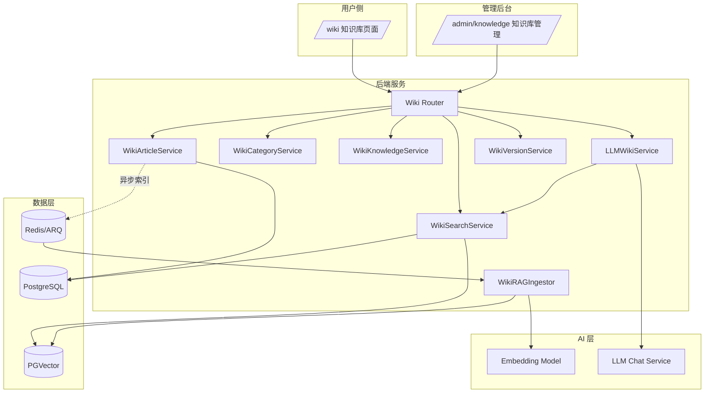
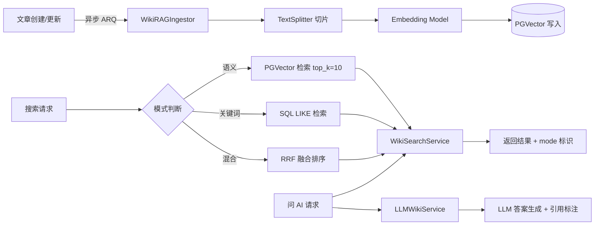

# 私有知识库 Wiki 模块总览与改造方案

> **版本**: v2.0  
> **日期**: 2026-09-12  
> **状态**: 已评审通过，待实施  
> **适用范围**: `MinWorkBuddy` 工程 Wiki / 私有知识库模块  
> **维护约定**: 本文档为模块手册与开发需求单一事实来源；结构、接口或数据模型的变更应同步更新对应章节。  
> **关联文档**: [本体与知识库整合技术方案](./superpowers/specs/2026-09-10-ontology-knowledge-integration-design.md)（本体构建/数据管道/图谱部分）

---

## 目录

1. [模块概览](#1-模块概览)
2. [功能缺口清单](#2-功能缺口清单)
3. [RAG 接入改造方案](#3-rag-接入改造方案)
4. [版本回滚机制](#4-版本回滚机制)
5. [分层重构方案](#5-分层重构方案)
6. [管理后台界面设计](#6-管理后台界面设计)
7. [菜单入口配置](#7-菜单入口配置)
8. [实施计划](#8-实施计划)
9. [附录 A：维护 Checklist](#附录-a维护-checklist)

---

## 1. 模块概览

### 1.1 能力矩阵

| 能力 | 状态 | 实现位置 | 说明 |
|---|---|---|---|
| 文章 CRUD + 分页列表 | ✅ | `wiki.py` | 创建/详情/更新/删除/列表 |
| 分类（层级树） | ✅ | `wiki.py` + `WikiCategory` | 无限层级，可映射 OWL 类 |
| 关键词搜索 | ⚠️ 降级 | `wiki.py:/search` | 实际为 SQL 模糊匹配，非语义检索 |
| 版本历史 | ⚠️ 仅查看 | `wiki.py:/versions` | 每次保存自动快照，无回滚端点 |
| OWL 本体管理 | ✅ | `wiki_owl.py` + `owl_engine.py` | 类注册/层级/TTL 导入导出/统计/按类查文章 |
| Wiki 链接 / 反向链接 | ✅ | `wiki.py` | JSONB 维护知识网络 |
| RAG 向量检索 | ❌ 未接入 | `wiki_rag.py` | 代码存在但写路径未调用，`content_vector` 永不被写入 |
| LLM Wiki（语义问答/成稿） | ❌ 未实现 | — | 当前「LLM」为名无实 |
| 顶层「知识库」概念 | ❌ 未实现 | — | 仅有分类树，缺知识库实体与归属 |
| 管理后台控制台 | ❌ 未实现 | — | 仅有用户侧 `/wiki` 入口 |

**两个前端入口**（组件同源 `views/kms/wiki/index.vue`）：用户侧 `/wiki`；管理后台 `kg-private-kb`（`componentMap.ts:59`，标「私有知识库」）。

### 1.2 系统上下文图



### 1.3 技术栈

| 层 | 技术 |
|---|---|
| 前端 | Vue 3 + TypeScript + Ant Design Vue + Pinia + vue-i18n |
| 后端 | FastAPI 0.115+ + SQLAlchemy 2.0 + Pydantic v2 |
| 数据 | PostgreSQL + PGVector + Redis |
| AI | Embedding Model + LLM Chat Service（现有） |
| 异步 | ARQ 任务队列 |
| 品牌 | Indigo `#4F6EF7` / Teal `#22D3AE` / Amber `#F5A623`；Space Grotesk / IBM Plex Sans / JetBrains Mono |

---

## 2. 功能缺口清单

> 排序维度：**影响范围**（功能可见性 / 数据正确性 / 架构健康）× **实现难度**。

| 编号 | 缺口 | 影响范围 | 难度 | 优先级 | 状态 | 改造章节 |
|---|---|---|---|---|---|---|
| G0 | 数据库类型冲突（向量/JSONB 需 PG） | 高（建表阻塞） | 低 | **P0** | 待确认 | — |
| G1 | RAG 未接入（`content_vector` 永不写入） | 高（核心卖点缺失） | 中 | **P1** | 待落地 | §3 |
| G2 | 版本仅查看、无回滚 | 中（可恢复性） | 低 | **P1** | 待落地 | §4 |
| G3 | 分层架构违约（schemas/services 空，逻辑内联） | 高（可维护性） | 中 | **P2** | 待落地 | §5 |
| G4 | 编辑页适配 hack（全量拉列表按 id 找 slug） | 中（性能/正确性） | 低 | **P2** | 待落地 | §5 |
| G5 | backlinks 只加不清 | 低 | 低 | **P3** | 待落地 | §5 |
| G6 | LLM 自动摘要/成稿缺失 | 中 | 高 | **P3** | 待评估 | — |
| G7 | 缺知识库实体 `wiki_knowledge` 与目录归属字段 | 高（模型与导航基础） | 中 | **P1** | 待落地 | §3/§5 |
| G8 | 内容展示未分级（知识库→目录→文章→版本） | 高（核心体验） | 中 | **P1** | 待落地 | §6 |
| G9 | LLM Wiki 检索体验未定义 | 高（差异化能力） | 中 | **P1** | 待落地 | §3 |
| G10 | 管理控制台未建设 | 中（运营效率） | 低 | **P2** | 待落地 | §6 |

**落地顺序**: G0 → G7（建表）→ G3/G5（分层重构）→ G1/G9（RAG 接入）→ G2（版本回滚）→ G8/G10（管理后台）→ G4（编辑页 hack 消除）

---

## 3. RAG 接入改造方案

### 3.1 架构概览



### 3.2 后端实现

#### 3.2.1 写入路径激活

文章新建/更新提交后，通过 ARQ 异步任务调用 `WikiRAGIngestor.index_article()`，不阻塞主写链路。

```python
# backend/app/services/wiki/article_service.py
from app.ai.knowledge.wiki_rag import WikiRAGIngestor

class WikiArticleService:
    async def create_article(self, db, req, user):
        article = self._repo.create(db, req, user)
        # 异步索引（不阻塞主链路）
        await self._enqueue_index(article.id, action="index")
        return article

    async def update_article(self, db, article_id, req, user):
        article = self._repo.update(db, article_id, req, user)
        await self._enqueue_index(article.id, action="reindex")
        return article

    async def _enqueue_index(self, article_id: int, action: str):
        """通过 ARQ 异步任务触发索引。"""
        # arq.enqueue(wiki_rag_task, article_id=article_id, action=action)
        pass
```

#### 3.2.2 混合检索服务

```python
# backend/app/services/wiki/search_service.py
class WikiSearchService:
    """混合检索编排：语义 + 关键词 + RRF 融合。"""

    async def search(
        self, db: Session, query: str, *,
        mode: str = "hybrid",  # "semantic" | "keyword" | "hybrid"
        top_k: int = 5,
        knowledge_id: int | None = None,
        owl_class_filter: list[str] | None = None,
    ) -> SearchResult:
        # 1. 语义检索（PGVector）
        semantic_results = await self._semantic_search(query, top_k, knowledge_id, owl_class_filter)
        # 2. 关键词检索（SQL LIKE）
        keyword_results = self._keyword_search(db, query, top_k, knowledge_id)
        # 3. RRF 融合
        if mode == "hybrid":
            merged = self._rrf_merge(semantic_results, keyword_results, top_k)
        elif mode == "semantic":
            merged = semantic_results[:top_k]
        else:
            merged = keyword_results[:top_k]
        # 4. 审计日志
        await self._log_search(db, query, mode, len(merged))
        return SearchResult(items=merged, mode=mode, total=len(merged))

    def _rrf_merge(self, sem: list, kw: list, top_k: int) -> list:
        """Reciprocal Rank Fusion: score = Σ 1/(k + rank_i), k=60"""
        scores: dict[int, float] = {}
        for rank, item in enumerate(sem):
            scores[item["id"]] = scores.get(item["id"], 0) + 1.0 / (60 + rank + 1)
        for rank, item in enumerate(kw):
            scores[item["id"]] = scores.get(item["id"], 0) + 1.0 / (60 + rank + 1)
        all_items = {item["id"]: item for item in sem + kw}
        sorted_ids = sorted(scores, key=scores.get, reverse=True)
        return [all_items[id] for id in sorted_ids[:top_k]]
```

#### 3.2.3 LLM Wiki 答案生成

```python
# backend/app/services/wiki/llm_wiki_service.py
class LLMWikiService:
    """问 AI：检索 → 拼装 context → LLM 生成答案 + 引用标注。"""

    async def ask(
        self, db: Session, query: str, *,
        top_k: int = 5,
        knowledge_id: int | None = None,
    ) -> LLMWikiAnswer:
        # 1. 检索相关 chunks
        search_result = await self._search_service.search(
            db, query, mode="semantic", top_k=top_k, knowledge_id=knowledge_id
        )
        # 2. 拼装 context（带编号）
        context_parts = []
        citations = []
        for i, item in enumerate(search_result.items, 1):
            context_parts.append(f"[{i}] {item['title']}\n{item['snippet']}")
            citations.append({
                "ref": i,
                "article_id": item["id"],
                "slug": item["slug"],
                "title": item["title"],
                "snippet": item["snippet"][:200],
            })
        context = "\n\n".join(context_parts)
        # 3. 调用 LLM（使用现有 AI Chat 服务）
        prompt = f"""基于以下参考资料回答用户问题。回答中必须使用 [数字] 标注引用来源。

参考资料:
{context}

用户问题: {query}"""
        answer = await self._llm_service.chat(prompt)
        return LLMWikiAnswer(answer=answer, citations=citations, mode="llm_wiki")
```

#### 3.2.4 降级策略

当 PGVector 不可用时（配置缺失/连接异常），自动降级为纯关键词匹配：

```python
async def search(self, db, query, **kwargs):
    try:
        semantic = await self._semantic_search(query, **kwargs)
        mode = "hybrid" if kwargs.get("mode") == "hybrid" else "semantic"
    except Exception:
        logger.warning("PGVector unavailable, falling back to keyword search")
        semantic = []
        mode = "keyword"
    keyword = self._keyword_search(db, query, **kwargs)
    # ...融合排序...
```

前端响应结构保持一致：`{ items: [...], mode: "semantic" | "keyword" | "hybrid" | "llm_wiki" }`。

### 3.3 数据库变更

```sql
-- 新增 wiki_knowledge（知识库实体，对应 G7）
CREATE TABLE wiki_knowledge (
    id BIGSERIAL PRIMARY KEY,
    tenant_id BIGINT NOT NULL,
    name VARCHAR(200) NOT NULL,
    slug VARCHAR(200) NOT NULL,
    description TEXT,
    icon VARCHAR(100),
    cover_url VARCHAR(500),
    owner_id BIGINT,
    status INT NOT NULL DEFAULT 1,  -- 1=启用 0=归档
    created_at TIMESTAMP NOT NULL DEFAULT NOW(),
    updated_at TIMESTAMP NOT NULL DEFAULT NOW()
);
CREATE UNIQUE INDEX idx_wiki_knowledge_tenant_slug ON wiki_knowledge(tenant_id, slug);
CREATE INDEX idx_wiki_knowledge_tenant ON wiki_knowledge(tenant_id);

-- wiki_category 增加 knowledge_id
ALTER TABLE wiki_category ADD COLUMN knowledge_id BIGINT REFERENCES wiki_knowledge(id) ON DELETE SET NULL;
CREATE INDEX idx_wiki_category_knowledge ON wiki_category(knowledge_id);

-- 新增 wiki_search_log（检索审计）
CREATE TABLE wiki_search_log (
    id BIGSERIAL PRIMARY KEY,
    tenant_id BIGINT NOT NULL,
    user_id BIGINT,
    query TEXT NOT NULL,
    mode VARCHAR(20) NOT NULL,
    result_count INT DEFAULT 0,
    latency_ms INT,
    created_at TIMESTAMP DEFAULT NOW()
);
CREATE INDEX idx_wiki_search_log_tenant ON wiki_search_log(tenant_id, created_at DESC);
```

### 3.4 前端组件

| 组件 | 路径 | 职责 |
|------|------|------|
| `SearchBar.vue` | `views/kms/wiki/components/` | 双模式检索条（语义检索 / 问 AI），带模式切换 Toggle |
| `SearchResultList.vue` | 同上 | 语义检索结果卡片列表（标题、命中片段高亮、相关度） |
| `LLMAnswerPanel.vue` | 同上 | AI 答案展示区（Markdown 渲染 + 引用编号标注 + 引用来源卡片） |
| `CitationCard.vue` | 同上 | 引用来源卡片（文章标题、命中片段、点击跳转原文） |

---

## 4. 版本回滚机制

### 4.1 后端实现

#### 4.1.1 回滚端点

```python
# backend/app/services/wiki/version_service.py
class WikiVersionService:
    async def rollback(
        self, db: Session, article_id: int, version_id: int, user
    ) -> WikiArticle:
        """非破坏式回滚：以目标历史版本内容生成新的当前快照。"""
        article = self._article_repo.get_by_id(db, article_id)
        target_version = self._get_version(db, version_id)
        # 校验
        if not target_version:
            raise VersionNotFoundError(version_id)
        if target_version.article_id != article_id:
            raise VersionMismatchError()
        # 生成新版本（version = max + 1）
        new_version_num = article.version + 1
        self._create_version_snapshot(db, article, operator_id=user.id,
                                       operation_type="rollback",
                                       change_note=f"Rollback from v{article.version} to v{target_version.version_number}")
        # 更新文章内容为目标版本
        article.title = target_version.title
        article.content = target_version.content
        article.summary = target_version.summary
        article.owl_class_uris = target_version.owl_class_uris
        article.version = new_version_num
        article.updater_id = user.id
        db.commit()
        # 异步重建索引
        await self._enqueue_index(article.id, action="reindex")
        return article

    async def get_diff(
        self, db: Session, article_id: int, version_id: int
    ) -> DiffResult:
        """返回目标版本与当前版本的 diff（段落粒度）。"""
        import difflib
        article = self._article_repo.get_by_id(db, article_id)
        target = self._get_version(db, version_id)
        current_lines = (article.content or "").splitlines(keepends=True)
        target_lines = (target.content or "").splitlines(keepends=True)
        diff = list(difflib.unified_diff(
            target_lines, current_lines,
            fromfile=f"v{target.version_number}",
            tofile=f"v{article.version} (current)",
            lineterm=""
        ))
        return DiffResult(
            current_version=article.version,
            target_version=target.version_number,
            diff="".join(diff),
        )
```

#### 4.1.2 API 端点

| 方法 | 路径 | 说明 |
|------|------|------|
| `POST` | `/api/v1/wiki/articles/{id}/rollback/{version_id}` | 非破坏式回滚 |
| `GET` | `/api/v1/wiki/articles/{id}/diff/{version_id}` | 版本 diff |

### 4.2 数据库变更

```sql
-- wiki_article_version 增加操作者与操作类型
ALTER TABLE wiki_article_version ADD COLUMN operator_id BIGINT;
ALTER TABLE wiki_article_version ADD COLUMN operation_type VARCHAR(20) DEFAULT 'edit';
-- operation_type: 'create' | 'edit' | 'rollback'
CREATE INDEX idx_wiki_version_article ON wiki_article_version(article_id, created_at DESC);
```

### 4.3 前端组件

| 组件 | 路径 | 职责 |
|------|------|------|
| `VersionTimeline.vue` | `views/kms/wiki/components/` | 版本时间线（竖向时间轴，版本号+时间+操作者+操作类型） |
| `VersionDiffView.vue` | 同上 | 版本对比视图（unified diff 渲染，高亮增删改） |
| `VersionRollbackButton.vue` | 同上 | 恢复按钮（二次确认弹窗：「将基于 vN 创建新版本 vN+1」） |

---

## 5. 分层重构方案

### 5.1 后端重构

**当前问题**: `routers/wiki/wiki.py` 423 行，内联 Schema + 业务逻辑；`schemas/wiki/` 和 `services/wiki/` 为空目录。

**目标结构**:

```
backend/app/
├── schemas/wiki/
│   ├── __init__.py
│   ├── article.py        # ArticleCreateRequest, ArticleUpdateRequest, ArticleResponse
│   ├── category.py       # CategoryCreateRequest, CategoryResponse, CategoryTree
│   ├── knowledge.py      # KnowledgeCreateRequest, KnowledgeResponse
│   ├── search.py         # SearchRequest, SearchResult, LLMWikiAnswer
│   └── version.py        # VersionResponse, DiffResult, RollbackRequest
├── services/wiki/
│   ├── __init__.py
│   ├── article_service.py    # 文章 CRUD + 异步索引触发
│   ├── category_service.py   # 目录树 CRUD + 移动
│   ├── knowledge_service.py  # 知识库 CRUD + 启停
│   ├── search_service.py     # 混合检索编排
│   ├── llm_wiki_service.py   # 问 AI 答案生成
│   └── version_service.py    # 版本管理 + 回滚 + diff
├── repositories/wiki/
│   ├── __init__.py
│   ├── article_repo.py       # 文章数据访问
│   ├── category_repo.py      # 目录数据访问
│   └── knowledge_repo.py     # 知识库数据访问
├── routers/wiki/
│   ├── wiki.py               # 用户侧路由 (~80 行, 纯路由分发)
│   ├── wiki_admin.py         # 管理后台路由 (新增)
│   └── wiki_owl.py           # OWL 相关 (保持)
```

**Router 瘦身示例**:

```python
# backend/app/routers/wiki/wiki.py (重构后, ~80 行)
@router.get("/articles")
async def list_articles(
    page: int = Query(1, ge=1),
    page_size: int = Query(20, ge=1, le=100),
    category_id: int | None = None,
    db: Session = Depends(get_db),
    user: SysUser = Depends(get_current_user),
):
    service = WikiArticleService()
    return await service.list_articles(db, page, page_size, category_id)
```

**接口契约**: 所有 service 方法返回统一结构，router 层通过 Pydantic schema 映射为 HTTP 响应。错误通过全局异常处理器统一映射为 `{ code: str, message: str, detail: Any }`。

### 5.2 前端重构

**目标结构**:

```
frontend/src/views/kms/wiki/
├── index.vue                          # 用户侧入口（保持）
├── ArticleView.vue                    # 文章阅读（保持）
├── ArticleEdit.vue                    # 文章编辑（保持，消除全量拉取 hack）
├── components/
│   ├── SearchBar.vue                  # 检索条（新增）
│   ├── SearchResultList.vue           # 检索结果（新增）
│   ├── LLMAnswerPanel.vue            # AI 答案面板（新增）
│   ├── CitationCard.vue              # 引用卡片（新增）
│   ├── VersionTimeline.vue           # 版本时间线（新增）
│   ├── VersionDiffView.vue           # 版本对比（新增）
│   ├── VersionRollbackButton.vue     # 回滚按钮（新增）
│   ├── CategoryTree.vue              # 分级目录树（从 index.vue 提取）
│   └── ArticleCard.vue               # 文章卡片（从 index.vue 提取）
├── admin/
│   └── KnowledgeManagement.vue       # 管理后台单页面（新增，含 5 个 Tab）
│   └── tabs/
│       ├── KnowledgeBaseTab.vue      # 知识库管理 Tab
│       ├── CategoryTab.vue           # 目录管理 Tab
│       ├── ArticleTab.vue            # 文章管理 Tab
│       ├── RagTestTab.vue            # RAG 检索测试 Tab
│       └── VersionTab.vue            # 版本管理 Tab
├── types/
│   └── wiki.ts                       # 共享类型定义（新增）
└── api/
    └── wiki.ts                       # API 调用（扩展）
```

### 5.3 编辑页 hack 消除（G4）

当前 `ArticleEdit.vue` 通过全量拉取文章列表按 id 找 slug。重构后直接调用 `GET /api/v1/wiki/articles/{id}` 获取详情（含 slug），消除 hack。

```typescript
// 重构前 (hack)
const res = await listArticles({ page: 1, page_size: 1000 })
const found = res.items.find(a => a.id === Number(articleId))
const detail = await getArticleBySlug(found.slug)

// 重构后
const detail = await getArticleById(articleId)  // 新增 API
```

---

## 6. 管理后台界面设计

### 6.1 整体布局

管理后台采用**单菜单入口 + Tab 切换**模式。侧边栏仅显示「知识库管理」一个菜单项，点击后进入 `KnowledgeManagement.vue` 单页面，内部通过 Tab 栏切换 5 个功能视图。

```
┌──────────────────────────────────────────────────────────────────┐
│ 顶栏 (72px)                                                      │
├──────────┬───────────────────────────────────────────────────────┤
│ 侧边栏   │ KnowledgeManagement.vue                               │
│ (240px)  │ ┌──────────────────────────────────────────────────┐  │
│          │ │ [知识库] [目录] [文章] [RAG 测试] [版本管理]      │  │
│ 控制台   │ ├──────────────────────────────────────────────────┤  │
│ AI 对话  │ │                                                  │  │
│ 深度研究 │ │  当前 Tab 内容区                                  │  │
│ 知识库 ● │ │  (知识库表格 / 目录树 / 文章表格 / 检索台 / 版本) │  │
│ Agent    │ │                                                  │  │
│ 技能     │ └──────────────────────────────────────────────────┘  │
│ 自动化   │                                                       │
└──────────┴───────────────────────────────────────────────────────┘
```

**品牌规范**:
- 主色 Indigo `#4F6EF7`，辅色 Teal `#22D3AE`，强调色 Amber `#F5A623`
- 圆角 `--radius: 14px`，间距 8px 网格
- 暗色/亮色主题自适应（CSS 变量）

### 6.2 知识库管理 Tab（KnowledgeBaseTab.vue）

```
┌──────────────────────────────────────────────────────────────────┐
│ 操作区: [+ 新建知识库]  │  搜索框  │  状态筛选 [全部▼]           │
├──────────────────────────────────────────────────────────────────┤
│ ┌────────┬────────┬────────┬────────┬────────┬────────────────┐ │
│ │ 图标    │ 名称   │ 负责人  │ 状态   │ 文章数  │ 操作           │ │
│ ├────────┼────────┼────────┼────────┼────────┼────────────────┤ │
│ │ 📘     │ 产品KB │ 张三   │ ● 启用  │ 128    │ [编辑][启停][删] │ │
│ │ 📗     │ 技术文档│ 李四   │ ● 启用  │ 256    │ [编辑][启停][删] │ │
│ └────────┴────────┴────────┴────────┴────────┴────────────────┘ │
│ 分页: showTotal 显示「共 N 条」                                   │
└──────────────────────────────────────────────────────────────────┘
```

- 新建/编辑: `a-modal` 弹窗，字段含名称/slug/简介/图标/负责人
- 启停: 二次确认，切换启用↔归档
- 删除: 二次确认，显示关联文章数警告

### 6.3 目录管理 Tab（CategoryTab.vue）

```
┌──────────────────────────────────────────────────────────────────┐
│ 知识库选择: [产品KB ▼]  │ [+ 新建目录]                           │
├─────────────────────────────┬────────────────────────────────────┤
│ 目录树 (a-tree, draggable)  │ 选中目录详情                        │
│ ▼ 产品知识库                │ 名称: 入门指南                      │
│   ├ 入门指南               │ Slug: getting-started               │
│   ├ 功能说明               │ 描述: ...                           │
│   │  ├ 核心功能            │ 文章数: 15                          │
│   │  └ 高级功能            │                                     │
│   └ FAQ                    │ [编辑] [新建子目录] [移动] [删除]    │
└─────────────────────────────┴────────────────────────────────────┘
```

- 顶部下拉选择知识库，树随之刷新
- 拖拽调整层级
- 点击节点，右侧显示详情 + 操作

### 6.4 文章管理 Tab（ArticleTab.vue）

```
┌──────────────────────────────────────────────────────────────────┐
│ 知识库[全部▼] 目录[全部▼] 状态[全部▼] │ 搜索 │ [+ 新建]         │
├──────────────────────────────────────────────────────────────────┤
│ ┌──────────┬──────────┬────────┬────────┬────────┬────────────┐ │
│ │ 标题      │ 所属目录  │ 状态   │ 版本数 │ 更新时间│ 操作        │ │
│ ├──────────┼──────────┼────────┼────────┼────────┼────────────┤ │
│ │ 快速入门  │ 入门指南  │ ● 发布 │ 5      │ 09-12  │ [编辑][版本]│ │
│ └──────────┴──────────┴────────┴────────┴────────┴────────────┘ │
└──────────────────────────────────────────────────────────────────┘
```

### 6.5 RAG 检索测试 Tab（RagTestTab.vue）

```
┌─────────────────────────────┬────────────────────────────────────┐
│ 配置: 知识库[产品KB▼]       │ 结果区                              │
│ 模式: [语义检索] [问AI]     │ 模式: semantic | 耗时: 128ms       │
│ Top-K: [5]                 │                                     │
│                             │ #1 快速入门 (0.92)                  │
│ 输入检索问题...             │   "本文介绍如何快速上手..."           │
│                             │   [查看原文]                        │
│ [检索] [清空]               │                                     │
│                             │ #2 API 文档 (0.87)                  │
│ 最近查询:                   │   "认证使用 JWT Bearer..."           │
│ - 如何使用产品              │   [查看原文]                        │
│ - API 认证方式              │                                     │
│                             │ ── 问 AI 模式额外显示 ──            │
│                             │ AI 答案: 本产品使用 JWT 认证[1]...  │
│                             │ 引用: [1] API文档 [2] 快速入门      │
└─────────────────────────────┴────────────────────────────────────┘
```

- 语义模式: `POST /api/v1/wiki/search` (mode=semantic)
- 问 AI 模式: `POST /api/v1/wiki/llm-wiki/ask`
- 最近查询存 localStorage

### 6.6 版本管理 Tab（VersionTab.vue）

```
┌──────────────────────────────────────────────────────────────────┐
│ 知识库[全部▼] │ 文章搜索 │ 时间范围[最近30天▼]                   │
├──────────────────────────────────────────────────────────────────┤
│ ┌──────────┬────────┬────────┬──────────┬────────┬────────────┐ │
│ │ 文章标题  │ 当前版本│ 操作类型│ 操作者   │ 时间   │ 操作        │ │
│ ├──────────┼────────┼────────┼──────────┼────────┼────────────┤ │
│ │ 快速入门  │ v5     │ 编辑   │ 张三     │ 09-12  │ [查看历史]  │ │
│ └──────────┴────────┴────────┴──────────┴────────┴────────────┘ │
│                                                                  │
│ 点击「查看历史」展开行内版本时间线:                                │
│ ● v5 (当前) - 张三 编辑 - 09-12  [查看] [对比] [恢复]           │
│ ● v4 - 李四 回滚自v2 - 09-10  [查看] [对比] [恢复]              │
│ ● v3 - 张三 编辑 - 09-08     [查看] [对比]                      │
└──────────────────────────────────────────────────────────────────┘
```

### 6.7 响应式适配

| 断点 | 布局调整 |
|------|---------|
| ≥1200px | 完整布局，侧边栏展开 |
| 768-1199px | 侧边栏折叠为图标模式（68px） |
| <768px | 侧边栏隐藏（汉堡菜单唤出），Tab 栏横向滚动 |

---

## 7. 菜单入口配置

### 7.1 后端路由注册

```python
# app/core/router_registry.py 新增
# 现有: wiki.py (prefix=/wiki), wiki_owl.py (prefix=/wiki/owl)
# 新增: wiki_admin.py (prefix=/wiki/admin)

# 端点清单:
# ── 知识库管理 ──
# POST   /api/v1/wiki/admin/knowledge              创建知识库
# GET    /api/v1/wiki/admin/knowledge              知识库列表 (分页)
# GET    /api/v1/wiki/admin/knowledge/{id}         知识库详情
# PUT    /api/v1/wiki/admin/knowledge/{id}         更新知识库
# PATCH  /api/v1/wiki/admin/knowledge/{id}/status  启停知识库
# DELETE /api/v1/wiki/admin/knowledge/{id}         删除知识库

# ── 目录管理 ──
# POST   /api/v1/wiki/admin/categories             创建目录
# GET    /api/v1/wiki/admin/categories             目录树 (按 knowledge_id 过滤)
# PUT    /api/v1/wiki/admin/categories/{id}        更新目录
# PATCH  /api/v1/wiki/admin/categories/{id}/move   移动目录
# DELETE /api/v1/wiki/admin/categories/{id}        删除目录

# ── 文章管理 ──
# GET    /api/v1/wiki/admin/articles               文章列表 (跨库筛选)
# GET    /api/v1/wiki/articles/{id}                按 ID 获取文章详情 (G4)

# ── 版本管理 ──
# GET    /api/v1/wiki/articles/{id}/versions/{vid} 版本详情
# POST   /api/v1/wiki/articles/{id}/rollback/{vid} 回滚
# GET    /api/v1/wiki/articles/{id}/diff/{vid}     版本 diff

# ── 检索 ──
# POST   /api/v1/wiki/search                      混合检索
# POST   /api/v1/wiki/llm-wiki/ask                问 AI
```

### 7.2 前端菜单配置

**sys_menu 表新增记录**:

```sql
-- 一级菜单: 知识库管理
INSERT INTO sys_menu (parent_id, name, path, component, icon, menu_type, sort_order, is_admin)
VALUES (0, '知识库管理', '/admin/knowledge', 'kg-knowledge', 'BookOutlined', 1, 50, true);
```

**componentMap.ts 更新**:

```typescript
// 新增
'kg-knowledge': markRaw(KnowledgeManagement),
```

**Tab 内部路由**（不走 sys_menu，由组件内部管理）:

| Tab | 标识 | 组件 |
|-----|------|------|
| 知识库 | `knowledge` | `KnowledgeBaseTab.vue` |
| 目录 | `category` | `CategoryTab.vue` |
| 文章 | `article` | `ArticleTab.vue` |
| RAG 测试 | `rag-test` | `RagTestTab.vue` |
| 版本管理 | `version` | `VersionTab.vue` |

### 7.3 权限配置

| 操作 | 角色要求 | 后端校验 |
|------|---------|---------|
| 查看知识库列表 | 所有登录用户 | `requiresAuth` |
| 创建/编辑/删除知识库 | 管理员 | `requiresAdmin` |
| 目录管理（增删改移） | 编辑者+ | 知识库归属权限校验 |
| 文章管理 | 编辑者+ | 知识库归属权限校验 |
| RAG 检索测试 | 所有登录用户 | `requiresAuth` |
| 版本管理（查看/回滚） | 编辑者+ | 租户 + 知识库归属校验 |

前端通过 `v-if="userRole >= 'editor'"` 控制操作按钮可见性；`meta.requiresAdmin` 控制页面级访问。**后端为安全边界**，前端仅做可见性控制。

---

## 8. 实施计划

### 8.1 分阶段任务

```
阶段          D1-D3        D4-D8          D9-D12       D13-D17
             分层重构      RAG 接入        版本回滚      管理后台+集成
             ─────────    ──────────     ──────────    ────────────
```

| 阶段 | 任务 | 工期 | 依赖 | 交付物 |
|------|------|------|------|--------|
| **1. 分层重构** | schemas/services/repositories 提取；router 瘦身；前端组件拆分；消除编辑页 hack | 3 天 | 无 | ~15 个 Python 文件 + ~5 个 Vue 组件 |
| **2. RAG 接入** | 激活写入路径；混合检索；LLM Wiki 答案生成；前端检索 UI | 5 天 | 阶段 1 | search_service + llm_wiki_service + 4 个前端组件 |
| **3. 版本回滚** | rollback 端点；diff 计算；审计日志；版本时间线 UI | 4 天 | 阶段 1 | version_service + 3 个前端组件 |
| **4. 管理后台** | KnowledgeManagement.vue + 5 个 Tab 页面；菜单配置；权限接入；集成测试 | 5 天 | 阶段 1-3 | 1 个主页面 + 5 个 Tab 组件 |

### 8.2 数据库迁移

| 迁移 | 对应阶段 | 说明 |
|------|---------|------|
| 创建 `wiki_knowledge` 表 | 阶段 1 | G7 知识库实体 |
| `wiki_category` 增加 `knowledge_id` | 阶段 1 | 目录归属知识库 |
| `wiki_article_version` 增加 `operator_id` + `operation_type` | 阶段 3 | 审计字段 |
| 创建 `wiki_search_log` 表 | 阶段 2 | 检索审计 |

### 8.3 风险提示

| 风险 | 等级 | 应对 |
|------|------|------|
| PGVector 扩展未启用 | 高 | 阶段 2 前确认 `CREATE EXTENSION vector` |
| Embedding 模型未配置 | 中 | 提供 `.env` 配置项，降级为纯关键词检索 |
| 分层重构影响现有功能 | 中 | 阶段 1 完成后全量回归测试 wiki 端点 |
| LLM 调用成本 | 中 | 问 AI 接口加频率限制（每用户每分钟 5 次） |
| 管理后台页面多 | 低 | 复用 Ant Design 表格/树组件，减少定制 |

### 8.4 验收标准

- [ ] 文章创建/更新后自动触发 RAG 索引（异步，不阻塞主链路）
- [ ] 混合检索返回结果包含 mode 标识，降级时前端响应结构不变
- [ ] 问 AI 返回答案带引用标注，点击可跳转原文
- [ ] 版本回滚为非破坏式（生成新版本，不删除历史）
- [ ] 版本 diff 可按段落粒度查看差异
- [ ] 所有 wiki 端点通过 service 层调用，router 无内联业务逻辑
- [ ] 管理后台 5 个 Tab 页面功能完整，权限控制生效
- [ ] 编辑页不再全量拉取文章列表

---

## 附录 A：维护 Checklist

- [ ] 新增/变更端点后更新 §7 路由清单。
- [ ] 数据模型变更同步 `init_models.py` 与 Alembic 迁移脚本。
- [ ] RAG 落地前确认运行库支持 PGVector（G0）。
- [ ] 分层后写操作事务边界清晰，错误统一映射。
- [ ] 接口响应形状稳定，RAG 降级不改变前端契约。
- [ ] 每项功能落地后更新 §1.1 能力矩阵状态和 §2 缺口状态。
- [ ] 为每个子项建独立 PR，关联本文档对应章节。

---

> **文档状态**: v2.0 技术方案已评审通过，待实施。  
> **下一步**: 按 §8 实施计划分阶段执行，每阶段建独立 PR。

