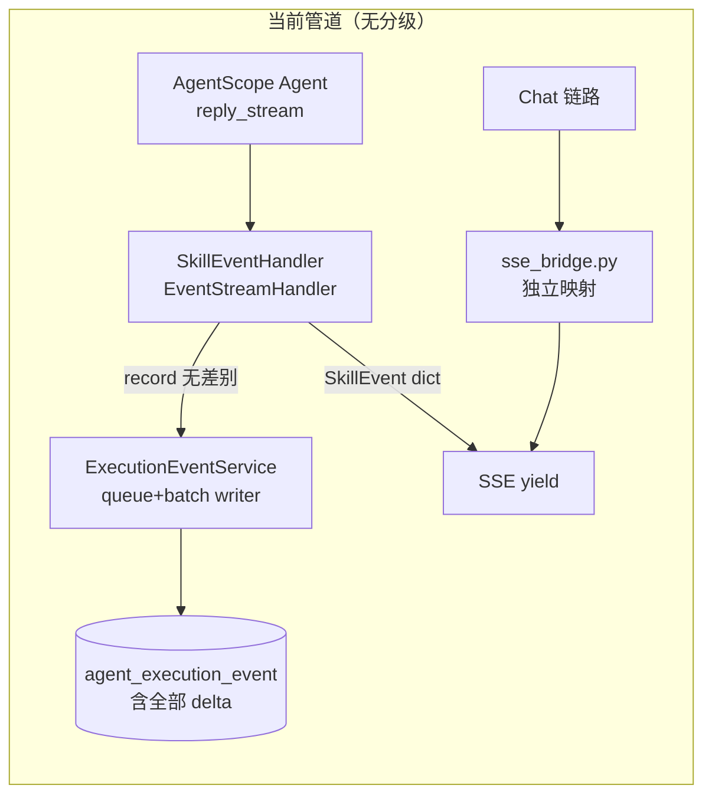
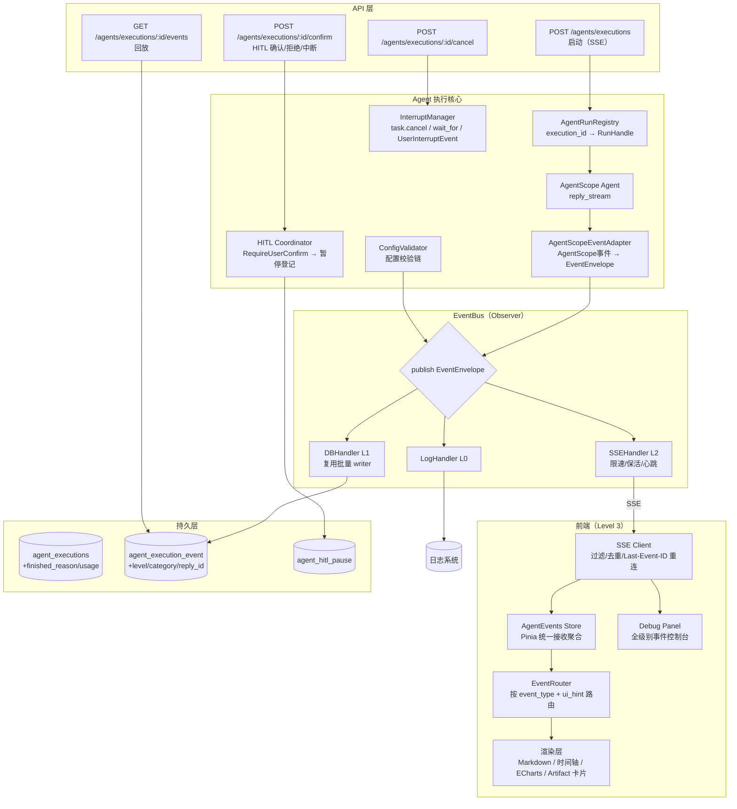
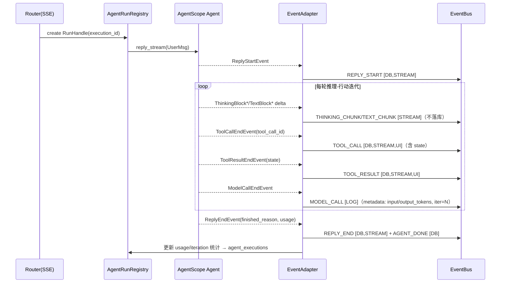
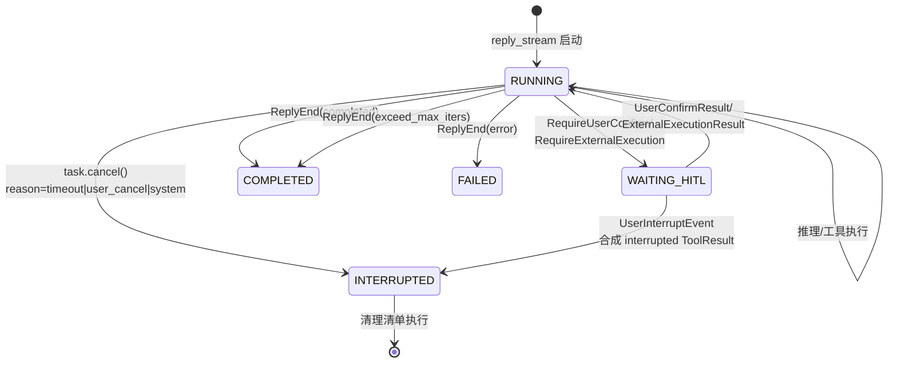
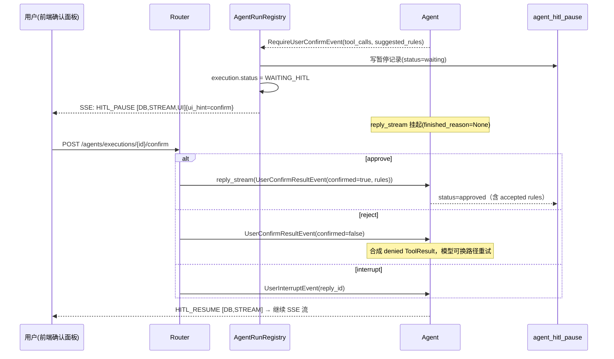

# Agent 事件体系深度分析与优化设计（对齐 AgentScope 2.0.8）

> 状态：设计稿（待评审）
> 日期：2026-09-21
> 参考文档：
> - [消息与事件](https://docs.agentscope.io/versions/2.0.8/zh/building-blocks/message-and-event)
> - [配置智能体](https://docs.agentscope.io/versions/2.0.8/zh/building-blocks/agent/configure-agent)
> - [运行智能体](https://docs.agentscope.io/versions/2.0.8/zh/building-blocks/agent/run-agent)
> - [中断智能体](https://docs.agentscope.io/versions/2.0.8/zh/building-blocks/agent/interrupt-agent)
> - [人机交互](https://docs.agentscope.io/versions/2.0.8/zh/building-blocks/agent/human-in-the-loop)
> 关联既有 spec：`2026-09-06-agentscope-native-migration-completion.md`、`2026-09-06-agentscope-native-audit-report.md`

---

## 1. 背景与目标

系统已在 Phase 2 完成 AgentScope 原生化改造（`SkillExecutionService` 基于 `agentscope 2.0` 的 `Agent.reply_stream` + `EventStreamHandler`），但**事件层仍是自研的一套平面枚举**，且与 AgentScope 的事件模型存在结构性差距：

- AgentScope 的中断（`UserInterruptEvent`）、人机交互（`RequireUserConfirmEvent` / `ConfirmResult`）、模型调用计量（`ModelCallEndEvent`）、迭代上限（`ExceedMaxItersEvent`）等事件**未被消费**，对应能力缺失；
- 事件枚举在**后端两处 + 前端两处各自定义且已经漂移**；
- 所有事件（包括 text/thinking delta）**无差别批量落库**，没有分级分发。

### 1.1 目标

1. 统一事件类型为**单一权威来源**（canonical enum），归并冗余、补齐缺失；
2. 以 AgentScope 四种智能体模式（配置 / 运行 / 中断 / 人机交互）为蓝本，增强 Agent 执行器（含 skill 方式执行），补齐中断与 HITL；
3. 建立 **Level 0-3 分层事件分发架构**（日志 / DB 持久化 / SSE 流式 / 前端渲染）；
4. 给出 P0-P2 实施路线图，兼容存量数据与前端。

### 1.2 非目标

- 不替换 AgentScope 运行时本身（继续使用 `reply_stream` 作为唯一执行入口）;
- 不引入 Celery/Kafka——现有 `asyncio.Queue + 单 writer 批量落库` 吞吐足够，仅在 P2 评估升级；
- 不重写团队（Team）编排事件语义，仅将其纳入统一信封与分级路由。

### 1.3 假设

- 目标仓库为 `MinWorkBuddy`；用户所指 `agent.py` = `backend/app/schemas/agent/agent.py`；
- DB 迁移沿用 `docs/sql/NN_*.sql` 编号脚本约定（下一个编号 47）；
- AgentScope 版本锁定 2.0.8（`agentscope.event` 中 `UserInterruptEvent`、`ConfirmResult`、`ModelCallEndEvent`、`ExceedMaxItersEvent` 均可用）。

---

## 2. 现状分析

### 2.1 事件体系盘点

| 位置 | 内容 | 问题 |
|---|---|---|
| `app/schemas/agent/agent.py` `ExecutionEventType` | TEXT/THINKING/TOOL_CALL/TOOL_RESULT/ERROR/METRICS + HITL_PAUSE/RESUME + SKILL_* + AGENT_* + TEAM_* + DISPATCH_PLAN/PLAN_REVISED + PROGRESS/TIMEOUT | 与模型层枚举**已经漂移** |
| `app/models/agent/agent_execution_event.py` `ExecutionEventType` | 同名枚举但成员不同：含 ENGINE_DECISION/TEXT_CHUNK/TEXT_DONE/CHART_DATA/FILE_GENERATED/ARTIFACT/COMPLETED/FAILED + TEAM_ROUND_*/NODE_*/HANDOFF/INTERVENTION/HINT_BLOCK | **缺** SKILL_*/AGENT_*/DISPATCH_PLAN 等；两处 `import` 来源不同导致同一常量两种值 |
| `app/ai/skills/execution.py` | 使用 schema 版枚举 | 与模型版枚举不一致的事件直接写库 |
| `app/ai/team/run_collector.py` | 使用 schema 版枚举（TEAM_START/DONE/ERROR） | 模型版另有 NODE_*/TEAM_ROUND_*，命名域割裂 |
| 前端 `types/sse.ts` + `renderers/types/timeline.ts` | 又一套 EventType 映射（text_chunk/text_done/tool_error/engine_decision…） | 依赖模型版枚举中**部分值**，与 schema 版不对应 |
| `app/ai/sse_bridge.py` | AgentScope 事件 → SSE dict（reply_start/text_delta/thinking_delta/tool_call_*…） | 与 `SkillEventHandler` 的 SkillEvent dict（text/thinking/tool_call…）**双通道语义不统一** |

### 2.2 事件管道现状



关键缺陷：

1. **delta 落库**：每个 text/thinking delta 都进 `agent_execution_event`，一次执行动辄数千行，回放/审计价值低、写入压力大；
2. **主记录缺失**：`execution.py` 中 `record_execution_start/done/failed/status` 是 **pass 占位存根**（`app/ai/skills/execution.py:30-33`），`agent_executions` 表在 skill 链路实际未写入；
3. **超时未生效**：`DEFAULT_TIMEOUT = 300` 声明后未在 `execute()` 中包裹任何 `wait_for`；
4. **无 reply_id/block_id/tool_call_id 关联**：事件之间没有 AgentScope 的三级 ID 关联，无法从事件流重建消息；
5. **无中断/HITL 出口**：`reply_stream` 挂在 HTTP 请求上，请求断开即协程消亡，无 `AgentRunRegistry` 可触达运行中实例（仅 ReAct 有 `REACT_REGISTRY`）。

### 2.3 AgentScope 2.0.8 事件模型要点（对照基准）

- **事件基座**：`EventBase{id, created_at}` + `reply_id`；块级 `block_id`、工具级 `tool_call_id` 三级关联；
- **生命周期模式**：start → delta → end；事件流可经 `Msg.append_event()` 完整重建消息（断线重放的基础）；
- **事件目录**：生命周期（ReplyStart/ReplyEnd/ExceedMaxIters）、文本/思考/数据/工具调用/工具结果流式、模型调用（ModelCallStart/End 含 token 数）、HITL（RequireUserConfirm/RequireExternalExecution/UserConfirmResult/ExternalExecutionResult/UserInterrupt）、一次性（HintBlockEvent/CustomEvent）；
- **状态机**：`ToolCallState`（pending→asking→allowed→submitted→finished）与 `ToolResultState`（running/success/error/interrupted/denied）；
- **四模式**：配置（构造期装配+参数校验）、运行（reply/reply_stream + finished_reason + usage + AgentState 持久化）、中断（运行中 task.cancel；暂停态 UserInterruptEvent）、HITL（权限确认 + 外部执行，`ConfirmResult` 可携带 `suggested_rules` 持久化授权规则）。

---

## 3. 事件类型对照表（AgentScope vs 当前系统）

| AgentScope 事件 | 当前系统对应 | 覆盖 | 差距说明 |
|---|---|---|---|
| `ReplyStartEvent` | `sse_bridge` 的 `reply_start`（仅 chat 链路） | ◐ | skill 链路缺失；`reply_id` 未落库 |
| `ReplyEndEvent` | `SKILL_RESULT` / `reply_end` | ◐ | 两链路语义不一致；`finished_reason` 无概念 |
| `ExceedMaxItersEvent` | — | ✗ | 完全缺失，迭代上限无事件 |
| `TextBlockStart/Delta/End` | `TEXT` / `text_chunk` | ◐ | delta 全量落库；无 block 边界 |
| `ThinkingBlockStart/Delta/End` | `THINKING` | ◐ | 同上 |
| `DataBlockStart/Delta/End` | —（仅 tool result 内 `media_type`） | ✗ | 多模态数据块事件缺失 |
| `ToolCallStart/Delta/End` | `TOOL_CALL`（仅 End 落库） | ◐ | 无 `tool_call_id` 关联、无参数流式 |
| `ToolResultStart/TextDelta/DataDelta/End` | `TOOL_RESULT` | ◐ | 无 `state` 状态机（interrupted/denied 不可表达） |
| `ModelCallStartEvent` | — | ✗ | 模型调用不可见 |
| `ModelCallEndEvent`（input/output tokens） | — | ✗ | **token 统计丢失**（Msg.usage 未消费） |
| `RequireUserConfirmEvent` | —（仅 ReAct 自研 gate） | ✗ | 原生 HITL 未消费 |
| `RequireExternalExecutionEvent` | — | ✗ | 外部执行暂停缺失 |
| `UserConfirmResultEvent` / `ExternalExecutionResultEvent` | — | ✗ | 恢复通道缺失 |
| `UserInterruptEvent` | — | ✗ | 暂停态中断缺失 |
| `HintBlockEvent` | —（`HINT_BLOCK` 是团队节点提问，语义不同） | ✗ | LLM 引导提示事件缺失 |
| `CustomEvent`（可扩展自定义事件） | —（team/skill 事件硬编码进枚举） | ✗ | 无扩展机制，导致枚举膨胀漂移 |
| `finished_reason`（completed/interrupted/exceed_max_iters/error） | `ExecutionStatus`（completed/failed/cancelled） | ◐ | 缺 `interrupted`/`exceed_max_iters` 语义 |
| `AgentState` 持久化 | — | ✗ | 跨请求/跨进程恢复缺失 |

### 当前系统独有（冗余/需归并）

| 现有枚举 | 问题 | 归并方案 |
|---|---|---|
| `SKILL_LOAD` vs `SKILL_LOADED` | 语义重复 | 保留 `SKILL_LOADED` |
| `AGENT_COMPLETE` / `AGENT_DONE` / `COMPLETED` | 三者语义重叠 | 统一 `AGENT_DONE`（值 `agent_done`） |
| `AGENT_ERROR` / `ERROR` / `FAILED` | 三者语义重叠 | `ERROR`（过程错误）+ 执行状态 `FAILED`（终态，只进 `agent_executions.status`） |
| `TIMEOUT` | 枚举存在但无触发点 | 归入 `INTERRUPT_REQUESTED` 的 reason=timeout |
| `TEXT_CHUNK`/`TEXT_DONE`/`CHART_DATA`/`FILE_GENERATED`/`ENGINE_DECISION`（模型版独有） | schema 版没有，前端却依赖 | 全部纳入统一枚举 |
| `DISPATCH_PLAN`/`PLAN_REVISED`/`TEAM_LAYER_*`/`NODE_*`/`HANDOFF`… | 团队编排事件硬编码 | 保留类型，但改经 `CustomEvent` 思路的扩展通道发布（P2） |

**结论**：当前实现覆盖了 AgentScope 的「文本/思考/工具」三类流式事件的**子集**；生命周期锚点（reply_id）、计量（token）、状态机（tool state）、HITL、中断、可扩展通道全部缺失；同时自身存在 3 组冗余枚举和两处漂移定义。

---

## 4. 目标架构

### 4.1 总体架构图



### 4.2 统一事件信封 EventEnvelope

新增 `app/schemas/agent/event_types.py` 作为**唯一权威来源**（models 层、handlers、前端代码生成均引用/映射它）：

```python
class EventCategory(str, Enum):
    LIFECYCLE = "lifecycle"   # reply/execution 生命周期
    TEXT = "text"             # 文本流
    THINKING = "thinking"     # 思考流
    DATA = "data"             # 多模态数据块
    TOOL = "tool"             # 工具调用与结果
    MODEL = "model"           # 模型调用计量
    RUNTIME = "runtime"       # 进度/迭代/上下文压缩
    CONFIG = "config"         # 配置装配与校验
    HITL = "hitl"             # 人机交互
    INTERRUPT = "interrupt"   # 中断
    SKILL = "skill"
    AGENT = "agent"
    TEAM = "team"
    ARTIFACT = "artifact"
    ERROR = "error"
    METRICS = "metrics"

class EventLevel(int, Enum):
    LOG = 0      # 仅日志
    DB = 1       # 持久化
    STREAM = 2   # SSE 推送
    UI = 3       # 前端渲染路由（信封携带 ui_hint）

class EventEnvelope(BaseModel):
    execution_id: str
    trace_id: str | None
    sequence: int
    event_type: str                    # 统一枚举值
    category: EventCategory
    levels: list[EventLevel]           # 分发层级（可多选）
    reply_id: str | None = None        # AgentScope 三级关联
    block_id: str | None = None
    tool_call_id: str | None = None
    content: dict = {}                 # 结构化载荷
    source: str | None                 # agent/skill/team/mcp/config
    source_id: str | None
    interrupt_reason: str | None       # timeout|user_cancel|system|error
    ui_hint: str | None                # markdown|timeline|chart|artifact|confirm
    event_version: int = 1
    metadata: dict = {}                # iteration、token、耗时等
```

要点：

- `levels` 是**分发目标集合**而非互斥等级：`TEXT_CHUNK` = `[STREAM]`（不落库）；`TOOL_CALL` = `[DB, STREAM, UI]`；
- **delta 聚合落库**：`text_done`/`tool_result_end` 携带块级汇总内容以 `[DB]` 级落库，取代逐 delta 落库；
- `event_version` 支持前端多版本共存；
- 路由默认表 `DEFAULT_ROUTES: dict[event_type, levels]` 集中声明，可被 `execution_config.event_routes` 覆盖。

### 4.3 统一枚举（归并后）

```python
class ExecutionEventType(str, Enum):
    # 生命周期（对齐 ReplyStart/ReplyEnd）
    REPLY_START = "reply_start"
    REPLY_END = "reply_end"                  # content.finished_reason
    # 文本/思考/数据流（对齐 Block* 三段式）
    TEXT_CHUNK = "text_chunk"                # [STREAM]
    TEXT_DONE = "text_done"                  # [DB] 块级汇总
    THINKING_CHUNK = "thinking_chunk"        # [STREAM]
    THINKING_DONE = "thinking_done"          # [DB]
    DATA_CHUNK = "data_chunk"                # [STREAM] base64/url + media_type
    # 工具（对齐 ToolCall*/ToolResult*，携带 tool_call_id + state）
    TOOL_CALL = "tool_call"                  # state: asking|allowed|submitted
    TOOL_RESULT = "tool_result"              # state: running|success|error|interrupted|denied
    # 模型计量（对齐 ModelCallStart/End）
    MODEL_CALL = "model_call"                # metadata: input_tokens/output_tokens/model_name
    # 运行时（对齐 ExceedMaxIters/进度/上下文压缩）
    ITERATION_LIMIT = "iteration_limit"      # 对齐 ExceedMaxItersEvent
    PROGRESS = "progress"
    CONTEXT_COMPRESSED = "context_compressed"
    # 配置智能体
    CONFIG_LOADED = "config_loaded"          # 依赖检查/版本兼容结果
    CONFIG_VALIDATED = "config_validated"    # 参数校验结果
    SCHEMA_APPLIED = "schema_applied"        # structured_schema 生效
    # 中断智能体
    INTERRUPT_REQUESTED = "interrupt_requested"  # reason: timeout|user_cancel|system
    INTERRUPTED = "interrupted"                  # 清理完成，finished_reason=interrupted
    # HITL
    HITL_PAUSE = "hitl_pause"                # 对齐 RequireUserConfirm/ExternalExecution
    HITL_RESUME = "hitl_resume"              # 携带 confirm_results 摘要
    # Skill / Agent / Team（保留存量值，前端兼容）
    SKILL_LOADED = "skill_loaded"
    SKILL_START = "skill_start"
    SKILL_RESULT = "skill_result"
    AGENT_START = "agent_start"
    AGENT_DONE = "agent_done"
    AGENT_RETRY = "agent_retry"
    ENGINE_DECISION = "engine_decision"
    ARTIFACT = "artifact"
    CHART_DATA = "chart_data"
    FILE_GENERATED = "file_generated"
    TEAM_START = "team_start"
    TEAM_DONE = "team_done"
    TEAM_ERROR = "team_error"
    TEAM_LAYER_START = "team_layer_start"
    TEAM_LAYER_DONE = "team_layer_done"
    TEAM_ROUND_START = "team_round_start"
    TEAM_ROUND_DONE = "team_round_done"
    NODE_START = "node_start"
    NODE_DONE = "node_done"
    NODE_FAILED = "node_failed"
    NODE_SKIPPED = "node_skipped"
    NODE_INPUT = "node_input"
    HANDOFF = "handoff"
    INTERVENTION = "intervention"
    HINT_BLOCK = "hint_block"
    DISPATCH_PLAN = "dispatch_plan"
    PLAN_REVISED = "plan_revised"
    # 通用
    ERROR = "error"
    METRICS = "metrics"
    CUSTOM = "custom"                        # 对齐 CustomEvent：name+value 扩展通道
```

**兼容策略**：旧值 `text`→`text_chunk`、`thinking`→`thinking_chunk`、`agent_complete`/`completed`→`agent_done`、`skill_load`→`skill_loaded` 等在写入侧归一化（`LEGACY_ALIAS` 映射表），DB 存量行不迁移；前端读取接口按别名表双读一个过渡版本。

### 4.4 四级分发策略

| Level | 通道 | 适用事件（默认） | 处理方式 | 关键约束 |
|---|---|---|---|---|
| **L0 日志** | `LogHandler` | `MODEL_CALL`、`CONTEXT_COMPRESSED`、内部状态变化、被降级丢弃的事件 | 结构化日志（loguru bind execution_id/trace_id） | `LOG_LEVEL` + `category` 过滤 |
| **L1 持久化** | `DBHandler`（复用现有 queue+单 writer 批量插入） | `REPLY_START/END`、`SKILL_*`、`AGENT_*`、`TOOL_CALL`、`TOOL_RESULT`、`HITL_*`、`INTERRUPT_*`、`CONFIG_*`、`ARTIFACT`、`TEXT_DONE`/`THINKING_DONE`（汇总） | 批量 50 条/2s flush，`asyncio.to_thread` | delta 类不再落库；表加 `level/category/reply_id` 列 |
| **L2 SSE** | `SSEHandler` | `TEXT_CHUNK`、`THINKING_CHUNK`、`TOOL_CALL`、`TOOL_RESULT`、`PROGRESS`、`HITL_PAUSE`、`INTERRUPT_*` | `event:` + `data:`（event_type 命名）+ envelope JSON | 心跳 15s；令牌桶限速（默认 600 events/min，delta 合并缓冲 50ms）；`id: <seq>` 支持 Last-Event-ID 重放 |
| **L3 前端渲染** | 前端 `EventRouter`（依据 `ui_hint`） | `ui_hint=markdown`→Markdown 渲染器；`timeline`→调用链时间轴（EventTimelineRenderer）；`chart`→ECharts 动态图；`artifact`→下载按钮+预览卡；`confirm`→HITL 确认面板 | Pinia `AgentEventsStore` 统一接收→按 ui_hint 路由 | 事件去重（execution_id+seq）、乱序重排、断线补拉 |

> 说明：L3 不在后端实现——后端只在信封上打 `ui_hint` 标签；渲染路由是前端职责。这避免后端耦合 UI 语义。

---

## 5. 四种智能体模式设计

> **统一运行时声明（Skill 与 Agent 一致）**：以下四种模式（配置/运行/中断/HITL）由 Agent 执行与 Skill 执行**共用同一套基础设施**——EventEnvelope/EventBus 分级（Level 0-3）、AgentRunRegistry、InterruptManager、HITL Coordinator。Skill 不是特例通道：`SkillExecutionService` 执行开始时经 `resolve_execution_mode()` 动态解析执行模式（`ExecutionMode`：llm/workflow/skill/knowledge/harness/plan/team），发布 `ENGINE_DECISION` 事件后路由到对应引擎，其后的事件、中断、HITL 全部走与 Agent 一致的管线（详见 §5.5）。

### 5.1 配置智能体（Agent Configuration）

**现状差距**：`AgentConfig*` schema 已具备 `hitl_config/react_config/context_config/model_config` 分组（与 AgentScope 构造参数基本对齐），但：
- 配置只是存储，**创建/更新时无校验链**（模型可达性、工具/技能存在性、参数范围）；
- 装配失败要到运行期才暴露（如 `model_code` 解析不到 API Key）。

**设计**：`ConfigValidator` 在 Agent 创建/更新/启用时执行三段校验，产出 `[DB]` 级事件：

| 事件 | 触发 | content 字段 |
|---|---|---|
| `CONFIG_LOADED` | 配置装载完成 | agent_code、version、config_hash、依赖检查（tools/skills/mcp_servers/kb 逐项 present/missing） |
| `CONFIG_VALIDATED` | 参数校验完成 | ok、errors[]（字段级）、warnings[]（如 temperature 超模型建议范围）、版本兼容性（agentscope_version、model context_length vs max_tokens） |
| `SCHEMA_APPLIED` | structured_schema 注册 | schema_name、字段数、校验模式（进程内/恢复态） |

- 校验结果同时写回 `agent_configs.config` 内的 `_validation` 只读子对象（前端配置页展示红/绿状态）；
- 运行期装配（`SkillExecutionService._build_model/_build_toolkit`）失败时同样发 `CONFIG_VALIDATED{ok:false}`，把「运行期配置错误」与「过程错误」区分开。

### 5.2 运行智能体（Run Agent Workflow）

**现状差距**：`reply_stream` 已用，但 `ReplyStart/End`、`ModelCallEnd`（token）、`ExceedMaxIters`、`finished_reason`、`usage` 全部丢弃；迭代轮次不可见。

**设计**：统一由 `AgentScopeEventAdapter`（合并现 `SkillEventHandler` 与 `sse_bridge` 为一个适配器）消费**全量** AgentScope 事件：



细粒度进度：
- envelope.metadata 每轮携带 `iteration`、累计 `input_tokens/output_tokens`、本轮 `latency_ms`；
- `PROGRESS` 事件保留给非 AgentScope 编排器（Research/ReAct/Team）；
- `finished_reason` 写入 `agent_executions.finished_reason`（新增列），取代仅靠 status 推断。

### 5.3 中断智能体（Interrupt Agent）

**现状差距**：完全没有。timeout 声明未生效；SSE 断开无清理；暂停态中断不存在。

**设计**：`AgentRunRegistry` + `InterruptManager`，覆盖 AgentScope 两种中断方式：



- **运行中取消**：`POST /agents/executions/{id}/cancel` → registry 取 `RunHandle.task` → `task.cancel()`；适配器捕获 `asyncio.CancelledError` 后发 `INTERRUPT_REQUESTED`（reason）→ 执行清理清单 → `INTERRUPTED`（`finished_reason=interrupted`）；
- **超时熔断**：`execute()` 内 `asyncio.wait_for(stream, timeout)`，reason=`timeout`（当前 300s 声明终于生效）；分层超时：整体 timeout / 单工具 timeout（Toolkit 参数）；
- **暂停态中断**：`POST .../confirm` body `{action: "interrupt"}` → 转发 `UserInterruptEvent(reply_id=agent.state.reply_id)`，AgentScope 自动为 pending 工具调用合成 `interrupted` 的 `ToolResultBlock` 并产出收尾事件序列——适配器只需照常转发；
- **清理清单**（`INTERRUPTED` 事件 metadata 中记录执行结果）：移除注入的 `sys.path`、flush 事件队列、写 `agent_executions`（status=cancelled, finished_reason=interrupted）、registry 反注册、（可选）保存 `AgentState` 供续聊；
- 中断原因枚举：`InterruptReason = timeout | user_cancel | system | error`。

### 5.4 人机交互智能体（Human-in-the-Loop）

**现状差距**：仅 ReAct 编排器有自研 gate（`asyncio.Event` + `REACT_REGISTRY` + `/react` REST）；AgentScope 原生 HITL 事件链完全未接；`HITL_PAUSE/RESUME` 枚举存在但无生产者。

**设计**：消费原生事件，落到 `agent_hitl_pause` 表（存量表复用）+ `WAITING_HITL` 执行状态：



- **外部执行工具**：`RequireExternalExecutionEvent` 同通道处理（`ExternalExecutionResultEvent` 回填），适用于人工操作/审批流场景；
- **授权规则**：`ConfirmResult.rules`（`suggested_rules`）持久化到权限上下文（复用 `AgentState` 或新表 `agent_permission_rules`），实现"本次确认、后续自动放行"；
- **超时提示**：HITL 暂停默认 30 分钟无响应 → `INTERRUPT_REQUESTED(reason=timeout)` + 前端倒计时提示；
- **权限控制**：confirm 端点校验 `execution.user_id == current_user`；安全类确认（写文件/外部 API）不走批内去重，逐次确认（对齐 AgentScope 例外规则）；
- **会话状态**：`WAITING_HITL` 期间 registry 保留 RunHandle（含 agent 实例与 `agent.state`）；进程重启场景 P2 通过 `AgentState` 序列化恢复。

### 5.5 Skill 执行统一运行模式（与 Agent 完全一致）

Skill 执行入口（`SkillExecutionService` / `SkillAgent`）不再是"只走 LLM"的特例通道，而是与 Agent 共用统一运行时。四点对齐：

**1) 事件机制对齐**：Skill 执行的每个关键节点（模式解析 `ENGINE_DECISION`、`SKILL_LOADED`、`AGENT_START`、迭代/模型计量、`TOOL_CALL/TOOL_RESULT`、`TEXT_DONE`、`INTERRUPT_*`、`HITL_*`、`AGENT_DONE`）都产生结构化 `EventEnvelope`，走同一 `DEFAULT_ROUTES` 分级（Level 0-3），落同一 `agent_execution_event` 表（带 category/level/reply_id/tool_call_id 列）。

**2) 多执行模式动态切换**：`resolve_execution_mode()` 按优先级（请求参数 `execution_mode` > `agent_config.execution_mode` > 默认 `llm`）解析七模式，发布 `ENGINE_DECISION`（`content.engine_code = skill:{mode}`，沿用前端既有约定）后路由引擎：

| ExecutionMode | 引擎 | 说明 |
|---|---|---|
| `llm` / `skill` | AgentScope `Agent.reply_stream`（原生） | 现路径，唯一产出完整三级关联事件 |
| `plan` | ReActOrchestrator（`ReactAgent` 封装） | dict 事件经 `normalize_event_type` 归一入信封 |
| `team` | TeamManager（`TeamAgent`） | `TEAM_*` / `NODE_*` 事件入信封 |
| `knowledge` / `harness` | ResearchOrchestrator（`ResearchAgent`） | research_progress → `PROGRESS` |
| `workflow` | —（Dify 流程） | P0 返回明确 `error` 事件"暂不支持"，P2 接入 |

**3) 中断能力对齐**：无论哪种模式，执行任务统一注册进 `AgentRunRegistry`——强制终止（`task.cancel()`，reason=`user_cancel`）、暂停恢复（`WAITING_HITL` 状态挂起/续跑）、超时熔断（总超时 + HITL 确认超时，reason=`timeout`）三类场景对 Skill 与 Agent 一视同仁；中断原因与清理清单（sys.path 注销、事件队列 flush、主记录落库、registry 反注册）随 `INTERRUPT_*` 事件落库。

**4) HITL 能力对齐**：`RequireUserConfirmEvent` / `RequireExternalExecutionEvent` 的消费、`agent_hitl_pause` 记录、confirm API（approve/reject/interrupt）、`UserConfirmResultEvent` / `UserInterruptEvent` 恢复、超时提示（默认 30 分钟）、权限校验（`execution.user_id == current_user`）全部由 Skill 与 Agent 共用同一 HITL Coordinator。

---

## 6. 数据模型与 API 改造

### 6.1 DDL 增量（`docs/sql/47_agent_event_enhance.sql`）

```sql
-- PostgreSQL 方言（与 45/46 号脚本一致）；IF NOT EXISTS 保证幂等。权威内容以
-- docs/sql/47_agent_event_enhance.sql 文件为准，此处为摘要。

-- agent_execution_event：分级与关联
ALTER TABLE agent_execution_event
    ADD COLUMN IF NOT EXISTS level            SMALLINT,
    ADD COLUMN IF NOT EXISTS category         VARCHAR(20),
    ADD COLUMN IF NOT EXISTS reply_id         VARCHAR(64),
    ADD COLUMN IF NOT EXISTS block_id         VARCHAR(64),
    ADD COLUMN IF NOT EXISTS tool_call_id     VARCHAR(64),
    ADD COLUMN IF NOT EXISTS interrupt_reason VARCHAR(20),
    ADD COLUMN IF NOT EXISTS ui_hint          VARCHAR(20),
    ADD COLUMN IF NOT EXISTS event_version    SMALLINT NOT NULL DEFAULT 1;
CREATE INDEX IF NOT EXISTS idx_event_reply ON agent_execution_event(execution_id, reply_id);
CREATE INDEX IF NOT EXISTS idx_event_category_level ON agent_execution_event(category, level);

-- agent_execution：结束原因与用量
ALTER TABLE agent_execution
    ADD COLUMN IF NOT EXISTS finished_reason  VARCHAR(20),
    ADD COLUMN IF NOT EXISTS interrupt_reason VARCHAR(20),
    ADD COLUMN IF NOT EXISTS input_tokens     INT,
    ADD COLUMN IF NOT EXISTS output_tokens    INT,
    ADD COLUMN IF NOT EXISTS iterations       INT;

-- agent_hitl_pause：HITL 暂停记录（模型此前被移除、service 存在悬空引用，本 DDL 重建；spec §5.4/§5.5）
CREATE TABLE IF NOT EXISTS agent_hitl_pause (
    id              BIGSERIAL PRIMARY KEY,
    tenant_id       INT8,
    execution_id    VARCHAR(64) NOT NULL,
    reply_id        VARCHAR(64),
    tool_calls      JSONB,
    suggested_rules JSONB,
    status          VARCHAR(20) NOT NULL DEFAULT 'waiting',
    accept_rules    SMALLINT NOT NULL DEFAULT 0,
    timeout_at      TIMESTAMP,
    answered_at     TIMESTAMP,
    created_at      TIMESTAMP NOT NULL DEFAULT CURRENT_TIMESTAMP
);
CREATE INDEX IF NOT EXISTS idx_hitl_execution ON agent_hitl_pause(execution_id);
CREATE INDEX IF NOT EXISTS idx_hitl_status ON agent_hitl_pause(status);
CREATE INDEX IF NOT EXISTS ix_agent_hitl_pause_tenant_id ON agent_hitl_pause(tenant_id);
```

> `metadata`（JSON）继续承载扩展字段（iteration 明细、清理清单、依赖检查结果），避免宽表化。

### 6.2 后端模块改造清单

| 模块 | 动作 |
|---|---|
| `app/schemas/agent/event_types.py`（新） | `ExecutionEventType` / `EventCategory` / `EventLevel` / `EventEnvelope` / `DEFAULT_ROUTES` / `LEGACY_ALIAS` 单一权威来源 |
| `app/schemas/agent/agent.py` | 删除本地 `ExecutionEventType`，re-export 新模块（零破坏 import） |
| `app/models/agent/agent_execution_event.py` | 删除本地枚举，import 新模块；新增列 |
| `app/ai/events/bus.py`（新） | `EventBus.publish(envelope)` → 按 levels 分发 `LogHandler/DBHandler/SSEHandler`（Observer；handler 异常隔离） |
| `app/ai/events/adapter.py`（新） | `AgentScopeEventAdapter`：合并 `SkillEventHandler` + `sse_bridge`，全量事件→envelope |
| `app/ai/events/registry.py`（新） | `AgentRunRegistry`：execution_id→RunHandle{agent, task, event_service, status, started_at} |
| `app/ai/events/interrupt.py`（新） | `InterruptManager`：cancel/timeout/user-interrupt 三路径 + 清理清单 |
| `app/ai/events/hitl.py`（新） | HITL Coordinator：暂停记录/恢复/超时（`resume_hitl` 供 confirm API 调用） |
| `app/ai/services/execution_event_service.py` | 保留批量 writer 作为 DBHandler 实现；`record()` 增加 envelope 入口 |
| `app/ai/skills/execution.py` | 接入 registry/adapter/InterruptManager；**删除 pass 存根**，改为真实调用 `agent_execution_service`；`wait_for(timeout)` 生效 |
| `app/routers/agent/`（新端点） | cancel / confirm / events 回放（`GET .../events?after_seq=`）/ SSE 增加 Last-Event-ID |
| `app/ai/agent_factory.py` | `SkillAgent/ResearchAgent/ReactAgent/TeamAgent` 输出统一 envelope（P1 收敛） |

### 6.3 API 契约（摘要）

```
POST /api/v1/agents/executions              # 启动执行（SSE 流式响应）
POST /api/v1/agents/executions/{id}/cancel  # {reason?: "user_cancel"}
POST /api/v1/agents/executions/{id}/confirm # {action: "approve"|"reject"|"interrupt",
                                             #  tool_calls: [{id, modified_input?}], accept_rules?: bool}
GET  /api/v1/agents/executions/{id}/events?after_seq=0&levels=1,2  # 回放/补拉
GET  /api/v1/agents/executions/{id}/stream  # SSE 重连（Last-Event-ID: seq）
```

---

## 7. 前端适配

1. **SSE Client 重构**（`stores/sse.ts` + 新 `stores/agentEvents.ts`）：
   - 事件类型过滤（订阅 categories/levels 参数化）、按 `execution_id+seq` 去重、`Last-Event-ID` 自动重连 + `after_seq` 补拉；
   - delta 合并渲染缓冲（50ms batch）。
2. **EventRouter 组件**：`ui_hint` → 渲染器映射表（markdown / timeline / chart / artifact / confirm / metrics），复用现有 `EventTimelineRenderer`、`DeepResearchExecutionPanel`、`TextOutputEvent` 组件族，仅统一入口。
3. **HITL 确认面板**：`ui_hint=confirm` 事件 → 工具调用卡片（名称/参数 diff/建议规则勾选）+ 批准/拒绝/中断按钮 → 调 confirm API。
4. **Debug Panel**（dev-only 路由）：实时展示全级别事件流转（含被 L0 降级的采样），按 category/level/keyword 过滤。
5. **兼容**：旧事件名（`text`/`thinking`/`completed`…）经前端别名表双读一个版本，后端切换后下个版本移除。

---

## 8. 实施路线图（P0-P2）

### P0 — 正确性与止血（1 个迭代）

| # | 任务 | 验收 |
|---|---|---|
| 0.1 | 统一枚举 `event_types.py` + 双处删除 + `LEGACY_ALIAS` 归一化 | 后端仅一处定义；存量事件读写不报未知值 |
| 0.2 | `EventEnvelope` + `EventBus` + L0/L1 分级；delta 停止落库（`TEXT_DONE` 汇总落库） | 同一执行 DB 行数下降 ≥80%；日志含结构化字段 |
| 0.3 | 修复 `record_execution_*` 存根：skill 执行真实写 `agent_executions` 主记录（start/done/failed/status） | `agent_executions` 有 skill 链路完整生命周期 |
| 0.4 | timeout 生效：`wait_for(300s)` + reason=timeout 中断事件 | 超时执行被熔断并落 `INTERRUPTED` |
| 0.5 | DDL 47（新列 + `agent_hitl_pause` 表重建）+ ORM 模型 | 建表/加列脚本可执行 |
| 0.6 | `AgentRunRegistry` + cancel API（强制终止/用户取消，Agent 与 Skill 共用） | 运行中执行可取消；中断原因（timeout/cancel）与清理清单落库 |
| 0.7 | HITL：消费 `RequireUserConfirm/ExternalExecution` + confirm API（approve/reject/interrupt）+ `WAITING_HITL` 状态 + 暂停超时提示 + 权限校验 | 端到端：暂停→确认→恢复；拒绝→denied 结果→模型重试；超时→中断 |
| 0.8 | Skill 多模式动态切换：`resolve_execution_mode`（七模式）+ `ENGINE_DECISION` 事件 + 引擎路由 | llm/plan/team/knowledge 可路由执行；workflow 明确报"暂不支持" |

### P1 — 四模式能力补齐（1-2 个迭代）

| # | 任务 | 验收 |
|---|---|---|
| 1.1 | `AgentScopeEventAdapter` 合并双 SSE 通道；envelope 化 SSE 输出 | chat 与 skill 链路事件格式一致 |
| 1.2 | SSE 重连：Last-Event-ID + `after_seq` 补拉 | 断线 30s 内恢复不丢事件 |
| 1.3 | 前端 EventRouter + AgentEvents Store + HITL 面板（消费 P0 的 hitl_pause/interrupt SSE 事件） | 确认/拒绝/中断全链路 UI 可操作 |
| 1.4 | 事件回放 API：`GET /agents/executions/{id}/events?after_seq=` | 回放与流式输出一致 |

> 注：`ModelCallEnd` token 统计、iteration 计数、`ExceedMaxItersEvent`、`finished_reason` 落库已随 P0.2 的 handler 重写一并实现，不再列入 P1。

### P2 — 体验、治理与扩展（按需）

| # | 任务 |
|---|---|
| 2.1 | 配置智能体校验链（`ConfigValidator` + `CONFIG_*` 事件 + 配置页红绿状态） |
| 2.2 | `CUSTOM` 扩展通道：team/skill 自定义事件不再硬编码枚举（对齐 AgentScope `CustomEvent`） |
| 2.3 | Debug Panel（全级别事件控制台） |
| 2.4 | `AgentState` 持久化（Redis/DB）→ 进程重启后恢复 WAITING_HITL 会话 |
| 2.5 | 性能压测：SSE 限速令牌桶、DB 批量写吞吐（目标 ≥500 events/s）、高并发（50 并发执行）延迟 <200ms P95 |
| 2.6 | 评估事件外发通道升级（Kafka/Celery）是否必要（以压测数据决策） |

---

## 9. 测试与验收

| 层级 | 内容 |
|---|---|
| 单元 | 各 Handler 正确性（路由表命中、批量 flush、限速、心跳）；`LEGACY_ALIAS` 归一化；`InterruptManager` 三路径清理清单 |
| 集成 | mock AgentScope 事件序列 → EventBus → DB/SSE 断言；HITL 暂停-恢复-拒绝-中断四分支；timeout 熔断；SSE 断线重连补拉（用真实 HTTP + DB） |
| E2E | 真实模型技能执行：中断按钮、确认面板、artifact 渲染、事件回放页面与流式一致 |
| 性能 | delta 不落库后写入行数对比；50 并发 SSE 推送 P95 延迟；DB 批量写吞吐 |

验收基线：P0 完成后 `agent_execution_event` 单次执行行数下降 ≥80% 且时间线回放无损（依赖汇总事件）；Skill 与 Agent 共用中断（强制终止/暂停恢复/超时熔断）与 HITL（确认/拒绝/中断/超时/权限）全链路可用；七模式经 `ENGINE_DECISION` 动态分派。P1 完成后双链路事件格式统一、断线重连不丢事件。

---

## 10. 风险与兼容性

| 风险 | 缓解 |
|---|---|
| 事件值变更破坏前端 | 写入侧归一化 + 前端别名表双读一个版本；SSE envelope 带 `event_version` |
| registry 内存泄漏（执行崩溃未反注册） | TTL 兜底回收 + 进程退出钩子；`agent_executions` 对账任务标记孤儿 running |
| reply_stream 挂起期间 SSE 断开导致 HITL 丢失 | registry 与 HTTP 请求解耦（执行任务独立于 SSE 请求生命周期）；断线靠 Last-Event-ID 重放 |
| 团队/研究编排器事件格式不一 | P1.4 先 envelope 化 skill 与 chat；Team/Research 在 P2 经 `CUSTOM` 通道收敛 |
| DB 列变更 | 增量 DDL 均可空/带默认值；不迁移存量行，读取层按 NULL=旧行处理 |

---

## 附：事件路由默认表（摘录）

| event_type | levels | ui_hint | 说明 |
|---|---|---|---|
| `text_chunk` / `thinking_chunk` / `data_chunk` | STREAM | markdown | delta 不落库 |
| `text_done` / `thinking_done` | DB | — | 块级汇总 |
| `tool_call` / `tool_result` | DB, STREAM, UI | timeline | 携带 tool_call_id + state |
| `reply_start` / `reply_end` | DB, STREAM | — | finished_reason 在 reply_end |
| `model_call` | LOG | — | token 计量（可在 Debug Panel 查看） |
| `hitl_pause` | DB, STREAM, UI | confirm | 携带 tool_calls + suggested_rules |
| `hitl_resume` | DB, STREAM | — | confirm 结果摘要 |
| `interrupt_requested` / `interrupted` | DB, STREAM, UI | timeline | interrupt_reason |
| `config_loaded` / `config_validated` / `schema_applied` | DB | — | 依赖/校验结果 |
| `iteration_limit` | DB, STREAM | timeline | 对齐 ExceedMaxItersEvent |
| `artifact` / `chart_data` / `file_generated` | DB, STREAM, UI | artifact/chart | 下载+预览/图表 |
| `skill_*` / `agent_*` / `team_*` / `node_*` | DB, STREAM, UI | timeline | 存量保留 |
| `error` | DB, STREAM | timeline | 过程错误 |
| `metrics` | LOG, DB | — | 执行级汇总指标 |
