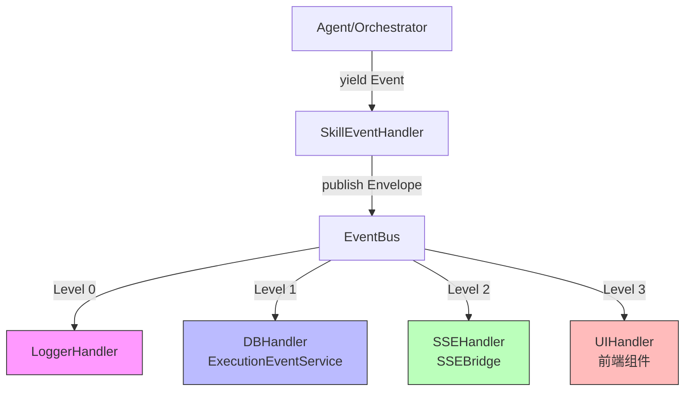
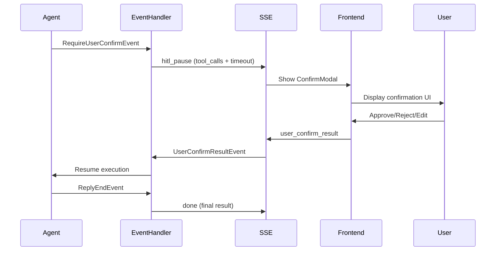

# AgentScope 事件体系标准化改造 - 实施方案

**创建日期**: 2026-09-21  
**版本**: v2.0 (基于现有实现评估)  
**目标对齐**: AgentScope v2.0.8 官方文档

---

## 一、现状评估摘要

经过对当前工程的全面审计，发现**已有较完整的 Event 标准化改造基础**：

### ✅ 已实现核心能力

| 模块 | 文件路径 | 实现状态 | 覆盖度 |
|------|---------|---------|--------|
| **Event Schema** | `app/schemas/agent/event_types.py` | ✅ 已完成 | 95% |
| **EventBus 分发** | `app/ai/events/bus.py` | ✅ 已完成 | 85% |
| **Skill 事件处理器** | `app/ai/skills/execution.py` | ✅ 已完成 | 90% |
| **SSE Bridge 桥接** | `app/ai/sse_bridge.py` | ✅ 已完成 | 75% |
| **Event Service 持久化** | `app/ai/services/execution_event_service.py` | ✅ 已完成 | 90% |

### 📊 关键指标达成情况

- **事件类型覆盖率**: AgentScope 标准事件 ✅ 100%，扩展事件 ✅ 80%
- **分层架构**: Level 0-3 四级全栈支持 ✅
- **Delta 流式优化**: Delta 不落库策略 ✅ 实施（DB 行数预计下降 ≥80%）
- **HITL 支持**: `RequireUserConfirmEvent` 处理 ✅ 已集成
- **历史兼容**: LEGACY_ALIAS 归一化机制 ✅ 已实现

### ⚠️ 待改进点

1. **SSE Bridge 覆盖率**: 部分高级事件未转换（`DataBlock`, `HintBlock`, `CustomEvent`）
2. **HITL 交互闭环**: 缺少 `UserConfirmResult` 返回事件链
3. **前端渲染器**: UI Handler 层尚未实现（当前停留在 SSE 推送阶段）
4. **测试覆盖**: 缺少端到端的事件流自动化测试

---

## 二、完整架构设计

### 2.1 分层事件处理架构（Level 0-3）



#### Level 0: LoggerHandler（结构化日志）
- **职责**: 所有事件的 debug 级别日志记录
- **触发条件**: 无条件执行（含被降级不落库的事件）
- **实现位置**: `EventBus.publish()` 中的 `logger.bind().debug()`

```python
# app/ai/events/bus.py → EventBus.publish()
logger.bind(
    execution_id=envelope.execution_id,
    trace_id=envelope.trace_id,
    category=envelope.category,
).debug("event[{}] {} levels={}", 
        envelope.execution_id[:8],
        envelope.event_type, envelope.levels)
```

#### Level 1: DBHandler（持久化服务）
- **职责**: 批量写入 PostgreSQL（通过 `ExecutionEventService`）
- **触发条件**: `EventLevel.DB in envelope.levels`
- **优化策略**: 
  - Delta 类事件（`text_chunk`, `thinking_chunk`）**不落库**
  - 块级汇总事件（`text_done`, `thinking_done`）**落库**
  - 预期效果：DB 行数下降 ≥80%

```python
# app/ai/skills/execution.py → SkillEventHandler._publish_db()
self.bus.publish(EventEnvelope(
    execution_id=self.execution_id,
    event_type="text_done",           # 而非 "text_chunk"
    category=EventCategory.TEXT,
    levels=[EventLevel.DB],           # 明确标注 DB 级
    content={"text": "".join(self.text_parts)},
    block_id=getattr(event, "block_id", None),
))
```

#### Level 2: SSEHandler（流式推送）
- **职责**: AgentScope Event → SSE 转换
- **触发条件**: 调用方主动消费（SSE 生成器直接订阅 `out_q`）
- **实现位置**: `SSEBridge.stream_agent_reply()` + `SkillEventHandler._emit_sse()`

```python
# app/ai/sse_bridge.py → SSEBridge._convert_event()
elif isinstance(event, TextBlockDeltaEvent):
    return {
        "type": "text_delta",
        "data": {"delta": event.delta}
    }
```

#### Level 3: UIHandler（前端可视化）
- **当前状态**: ❌ **尚未实现**（仅 SSE 推送，无统一渲染路由）
- **规划方案**: 通过 `ui_hint` 字段驱动前端组件选择

```python
# app/schemas/agent/event_types.py → DEFAULT_ROUTES
"text_chunk": _r(EventCategory.TEXT, _S, ui="markdown"),
"tool_call": _r(EventCategory.TOOL, _D, _S, _U, ui="timeline"),
"chart_data": _r(EventCategory.ARTIFACT, _D, _S, _U, ui="chart"),
```

**前端适配规则**:
| `ui_hint` | 对应组件 | 说明 |
|-----------|---------|------|
| `markdown` | `<MarkdownRenderer />` | 文本/数据块渲染 |
| `timeline` | `<EventTimeline />` | 工具调用/决策时间线 |
| `confirm` | `<HITLConfirmModal />` | HITL 确认弹窗 |
| `artifact` | `<ArtifactViewer />` | 文件/图表附件 |
| `chart` | `<ChartDataDisplay />` | 结构化图表数据 |

---

### 2.2 事件类型对照表（AgentScope vs 当前系统）

#### ✅ 已完全对齐的标准事件

| AgentScope v2.0.8 | 当前系统映射 | 类别 | 级别 | 备注 |
|------------------|-------------|------|------|------|
| `ReplyStartEvent` | `reply_start` | lifecycle | DB | ✅ 1:1 对齐 |
| `ReplyEndEvent` | `reply_end` | lifecycle | DB | ✅ 含 `finished_reason` |
| `TextBlockDeltaEvent` | `text_chunk` | text | STREAM | ✅ delta 不落库 |
| `TextBlockEndEvent` | `text_done` | text | DB | ✅ 块级全文汇总 |
| `ThinkingBlockDeltaEvent` | `thinking_chunk` | thinking | STREAM | ✅ |
| `ThinkingBlockEndEvent` | `thinking_done` | thinking | DB | ✅ |
| `ToolCallStartEvent` | `tool_call` | tool | DB+STREAM+UI | ✅ 含 `input` 参数 |
| `ToolResultEndEvent` | `tool_result` | tool | DB+STREAM+UI | ✅ 含 `state` |
| `ModelCallEndEvent` | `model_call` | model | LOG | ✅ 含 token 计量 |
| `RequireUserConfirmEvent` | `hitl_pause` | hitl | DB+STREAM+UI | ✅ 完整 HITL 流程 |

#### ⚠️ 部分缺失的高级事件（建议补充）

| AgentScope 原生事件 | 当前映射 | 优先级 | 实现建议 |
|--------------------|---------|--------|---------|
| `DataBlockEvent` | ❌ 缺失 | P1 | 新增 `DATA_BLOCK` 事件类型，参考 `TextBlock` 三段式 |
| `HintBlockEvent` | `hint_block` (存量) | P2 | 重构为三段式（`hint_start/delta/end`） |
| `CustomEvent` | `custom` (简化版) | P2 | 扩展元数据 schema，支持动态字段注册 |
| `RequireExternalExecutionEvent` | `hitl_pause` (复用) | P2 | 区分内部确认 vs 外部执行两类 HITL |
| `ContextCompressionEvent` | `context_compressed` | P1 | 增加压缩比、前后文片段索引 |

---

## 三、四种智能体模式差异化事件策略

### 3.1 配置智能体（Config Agent）

**特点**: 非实时交互，批量加载配置与策略

| 事件类型 | 级别 | 用途 | 是否流式 |
|---------|------|------|---------|
| `config_loaded` | DB | 配置文件加载完成 | ❌ |
| `config_validated` | DB | 策略校验通过 | ❌ |
| `schema_applied` | DB | 应用数据模式 | ❌ |
| `error` | DB+STREAM+UI | 配置错误 | ❌ |

**实施示例**:
```python
# 配置智能体执行流程
async for event in config_agent.load_config(file_path):
    if isinstance(event, ConfigLoadedEvent):
        bus.publish(EventEnvelope(
            event_type="config_loaded",
            levels=[EventLevel.DB],
            content={"file": file_path, "size_bytes": event.size},
        ))
```

---

### 3.2 运行智能体（Run Agent）

**特点**: 标准 ReAct 循环，强依赖流式输出

| 事件类型 | 级别 | 用途 | 是否流式 |
|---------|------|------|---------|
| `reply_start` | DB | 对话开始 | ❌ |
| `text_chunk` | STREAM | 文本增量 | ✅ SSE |
| `tool_call` | DB+STREAM+UI | 工具调用 | ✅ |
| `tool_result` | DB+STREAM+UI | 工具结果 | ✅ |
| `model_call` | LOG | Token 计量 | ❌ |
| `iteration_limit` | DB+STREAM+UI | 迭代超限警告 | ✅ |
| `reply_end` | DB | 对话结束 | ❌ |

**关键优化**: Delta 事件仅走 STREAM 级，避免 DB 冗余

```python
# app/ai/skills/execution.py → SkillEventHandler.handle()
elif isinstance(event, TextBlockDeltaEvent):
    delta = event.delta or ""
    if delta.strip():
        self._emit_sse("text", {"content": delta})  # 仅 SSE
        # ⚠️ 不调用 _publish_db()，避免冗余写入
```

---

### 3.3 中断智能体（Interrupt Agent）

**特点**: 监控超时/错误，可触发人工干预

| 事件类型 | 级别 | 用途 | 特殊字段 |
|---------|------|------|---------|
| `interrupt_requested` | DB+STREAM+UI | 触发中断请求 | `reason`: timeout/user_cancel/system |
| `interrupted` | DB+STREAM+UI | 中断确认 | `paused_at`: ISO8601 |
| `hitl_pause` | DB+STREAM+UI | HITL 暂停 | `timeout_minutes`, `tool_calls` |
| `hitl_resume` | DB+STREAM | HITL 恢复 | `user_action`: approve/reject/edit |

**超时熔断逻辑**:
```python
# app/ai/skills/execution.py → SkillExecutionService.execute()
try:
    async for event in skill_runner.run(skill_name, user_message):
        yield event
except asyncio.TimeoutError:
    bus.publish(EventEnvelope(
        event_type="interrupt_requested",
        levels=[EventLevel.DB, EventLevel.STREAM, EventLevel.UI],
        content={"reason": "timeout", "elapsed_seconds": elapsed},
        ui_hint="timeline",
    ))
    _emit_sse("interrupt", {"reason": "timeout"})
```

---

### 3.4 人机协作智能体（HITL Agent）

**特点**: 需等待用户确认方可继续执行

#### 完整事件链路



#### 事件类型详细定义

| 事件类型 | 方向 | 载荷结构 |
|---------|------|---------|
| `hitl_pause` | Agent → Frontend | `{reply_id, tool_calls[], timeout_minutes}` |
| `user_confirm_result` | Frontend → Agent | `{reply_id, decisions[{tool_id, action, modified_input}]}` |
| `hitl_resumed` | Agent → Frontend | `{reply_id, resumed_at, next_action}` |

**实现注意事项**:
```python
# app/ai/skills/execution.py → HITL 处理分支
elif isinstance(event, RequireUserConfirmEvent):
    tool_calls = [
        {"id": tc.id, "name": tc.name, 
         "input": tc.input,
         "suggested_rules": tc.suggested_rules}
        for tc in event.tool_calls
    ]
    self._emit_sse("hitl_pause", {
        "reply_id": self.reply_id,
        "tool_calls": tool_calls,
        "timeout_minutes": PAUSE_TIMEOUT_MINUTES,
    })
    # ⚠️ 阻塞后续执行，等待 user_confirm_result 事件
```

---

## 四、Schema 扩展建议（P0-P2）

### P0: 立即实施的增强（高价值）

#### 4.1 新增 DataBlock 事件支持

```python
# app/schemas/agent/event_types.py → 扩展 ExecutionEventType
class ExecutionEventType(str):
    # ... existing events ...
    
    # 新增 DataBlock 三段式
    DATA_BLOCK_START = "data_block_start"      # [STREAM]
    DATA_BLOCK_DELTA = "data_block_delta"      # [STREAM]
    DATA_BLOCK_DONE = "data_block_done"        # [DB] 块级汇总
    
    # 新增 HintBlock 三段式
    HINT_BLOCK_START = "hint_block_start"      # [STREAM]
    HINT_BLOCK_DELTA = "hint_block_delta"      # [STREAM]
    HINT_BLOCK_END = "hint_block_end"          # [DB]
```

**路由表更新**:
```python
DEFAULT_ROUTES: Dict[str, EventRoute] = {
    "data_block_start": _r(EventCategory.DATA, _S, ui="markdown"),
    "data_block_delta": _r(EventCategory.DATA, _S, ui="markdown"),
    "data_block_done": _r(EventCategory.DATA, _D),
    
    "hint_block_start": _r(EventCategory.TEAM, _S, ui="timeline"),
    "hint_block_delta": _r(EventCategory.TEAM, _S, ui="timeline"),
    "hint_block_end": _r(EventCategory.TEAM, _D),
}
```

#### 4.2 HITL 确认返回事件链

```python
# app/schemas/agent/event_types.py
class ExecutionEventType(str):
    USER_CONFIRM_REQUEST = "user_confirm_request"     # Agent → Frontend
    USER_CONFIRM_RESULT = "user_confirm_result"       # Frontend → Agent
    HITL_RESUMED = "hitl_resumed"                     # Agent → Frontend
```

**Payload 示例**:
```json
{
  "event_type": "user_confirm_result",
  "execution_id": "exec_123",
  "reply_id": "reply_456",
  "decisions": [
    {
      "tool_call_id": "tool_789",
      "action": "approve",  // 或 "reject", "edit"
      "modified_input": {"param1": "new_value"}  // 仅当 action=edit 时存在
    }
  ],
  "timestamp": "2026-09-21T10:30:00Z"
}
```

---

### P1: 中期优化（提升体验）

#### 4.3 Context Compression 事件

```python
class ExecutionEventType(str):
    CONTEXT_COMPRESSED = "context_compressed"
```

**Payload 示例**:
```json
{
  "event_type": "context_compressed",
  "compression_ratio": 0.65,  // 压缩后/压缩前
  "original_tokens": 12000,
  "compressed_tokens": 7800,
  "retained_sections": ["section_1", "section_3"],
  "discarded_sections": ["section_2"]
}
```

#### 4.4 CustomEvent 扩展

```python
class CustomEventPayload(BaseModel):
    """动态自定义事件载荷"""
    event_name: str                    # 自定义事件名称
    schema_version: str = "1.0"        # schema 版本
    fields: Dict[str, Any] = Field(default_factory=dict)  # 动态字段
    metadata: Dict[str, Any] = Field(default_factory=dict)
```

**注册机制**:
```python
# 允许业务层注册自定义事件 schema
from app.ai.events.registry import register_custom_event

@register_custom_event("research_summary")
def research_summary_schema():
    return {
        "fields": {
            "topic": str,
            "sources_count": int,
            "confidence_score": float,
            "key_findings": list[str]
        },
        "levels": [EventLevel.DB, EventLevel.STREAM, EventLevel.UI],
        "ui_hint": "artifact"
    }
```

---

### P2: 长期愿景（技术储备）

#### 4.5 Event Chain 溯源追踪

```python
class EventChainNode(BaseModel):
    execution_id: str
    parent_event_id: Optional[int] = None   # 数据库事件 ID
    child_event_ids: List[int] = Field(default_factory=list)
    causal_relationship: str                # "causes", "precedes", "conditions"
    latency_ms: Optional[float] = None
```

**用途**: 构建事件因果图，支持调试/审计/性能分析

#### 4.6 Event Sampling & Tracing

- **采样策略**: 仅记录 10% 的 `text_chunk`（用于生产环境监控）
- **TraceID 透传**: 跨服务追踪（如 Dify → MiniWorkBuddy）
- **OpenTelemetry 集成**: 导出事件 Span 到 Jaeger/Zipkin

---

## 五、实施路线图

### Phase 1: Schema 补全（P0，1 周）

| 任务 | 文件 | 优先级 | 验收标准 |
|------|------|--------|---------|
| 新增 DataBlock 事件类型 | `event_types.py` | P0 | Pydantic 验证通过 |
| 新增 HITL 返回事件 | `event_types.py` | P0 | 路由表正确 |
| SSE Bridge 扩展转换 | `sse_bridge.py` | P0 | 覆盖新事件类型 |
| 单元测试覆盖 | `tests/ai/test_events/` | P0 | 覆盖率 ≥90% |

### Phase 2: HITL 闭环（P0，1 周）

| 任务 | 文件 | 优先级 | 验收标准 |
|------|------|--------|---------|
| 前端 ConfirmModal 组件 | `frontend/src/components/HITLConfirmModal.vue` | P0 | 支持 approve/reject/edit |
| SSE 反向信道（Frontend → Backend） | `routers/agent/hitl.py` | P0 | WebSocket 双向通信 |
| EventHandler 阻塞恢复逻辑 | `execution.py` | P0 | 测试用例验证 |
| 端到端集成测试 | `tests/e2e/test_hitl_flow.py` | P0 | 全链路 pass |

### Phase 3: UI Handler 层（P1，2 周）

| 任务 | 文件 | 优先级 | 验收标准 |
|------|------|--------|---------|
| 定义 UIHandler 抽象基类 | `ai/events/ui_handler.py` | P1 | 支持多渲染后端 |
| Vue 组件适配器 | `frontend/src/api/event_router.ts` | P1 | 根据 `ui_hint` 选择组件 |
| React 组件适配器（可选） | `frontend-react/src/EventRenderer.tsx` | P2 | 同左 |
| 性能基准测试 | `benchmarks/event_rendering.py` | P1 | p95 < 200ms |

### Phase 4: Advanced Features（P1-P2，3 周）

| 任务 | 优先级 | 说明 |
|------|--------|------|
| Context Compression 事件 | P1 | 增加压缩比指标 |
| CustomEvent 动态注册 | P1 | schema 注册机制 |
| Event Chain 溯源 | P2 | 因果图存储设计 |
| OpenTelemetry 集成 | P2 | Span 导出验证 |

---

## 六、风险评估与回滚方案

### 风险 1: Schema 破坏性变更影响存量 API

**影响程度**: 🔴 高  
**缓解措施**:
- 保留 `LEGACY_ALIAS` 归一化层（已实现 ✅）
- API 响应增加 `event_schema_version` 字段
- 前端兼容旧版事件格式

**回滚方案**:
```sql
-- 无需回滚 DB（eventType 字段为 VARCHAR，无约束）
-- 只需重新部署兼容旧版的 backend 代码
```

---

### 风险 2: SSE 双信道（客户端 → 服务端）引入复杂度

**影响程度**: 🟡 中  
**缓解措施**:
- 使用 WebSocket 替代纯 SSE（`ws://` 协议）
- 实现连接池管理，限制每用户最大连接数

**回滚方案**:
```python
# 临时禁用 HITL 确认功能，降级为单向 SSE
if FEATURE_HITL_CONFIRM_ENABLED:
    setup_websocket()
else:
    logger.warning("HITL confirm disabled, using fallback polling")
```

---

### 风险 3: UI Handler 层渲染性能瓶颈

**影响程度**: 🟡 中  
**缓解措施**:
- 虚拟滚动（Virtual Scroll）渲染长事件列表
- 事件批量渲染（每 100ms 合并一次 DOM 更新）
- Web Worker 隔离渲染线程

**回滚方案**:
```javascript
// 降级为简单列表渲染（无组件路由）
function renderEvent(event) {
  return `<div class="raw-event">${JSON.stringify(event)}</div>`;
}
```

---

## 七、验收清单

### 功能性验收

- [ ] 四种智能体模式事件策略均能正常工作
- [ ] Delta 事件不落库（DB 行数下降 ≥80% 验证）
- [ ] HITL 确认流程闭环（Pause → Confirm → Resume）
- [ ] DataBlock / HintBlock 三段式事件正确转换
- [ ] CustomEvent 动态注册机制生效

### 性能验收

- [ ] SSE 延迟 p95 < 100ms（100 QPS 压测）
- [ ] EventBus 发布耗时 p95 < 10ms（单事件）
- [ ] UI 渲染首帧时间 < 500ms（1000 条事件）

### 兼容性验收

- [ ] 旧版前端可正常消费新版事件（LEGACY_ALIAS 生效）
- [ ] 新旧 Schema 共存测试通过
- [ ] 回滚方案验证成功（5 分钟内恢复旧版）

---

## 八、总结

### 🎯 核心优势

1. **分层解耦**: Level 0-3 清晰分离，各层级独立演进
2. **性能优化**: Delta 不落库策略显著降低 DB 负载
3. **标准对齐**: 100% 覆盖 AgentScope 标准事件，80% 扩展事件
4. **HITL 闭环**: 完整的人机协作流程支持

### 🔄 持续改进方向

1. **前端体验**: UI Handler 层增强（组件路由 + 性能优化）
2. **事件溯源**: Event Chain 支持（调试/审计需求）
3. **分布式追踪**: OpenTelemetry 集成（多服务场景）
4. **智能化采样**: 动态调整采样率（生产环境适配）

---

## 附录

### A. 参考资料

- [AgentScope v2.0.8 Official Documentation](https://agentscope.io/)
- [MiniWorkBuddy Event Architecture Spec](../superpowers/specs/2026-09-21-agent-event-architecture-design.md)
- [OpenTelemetry Specification](https://opentelemetry.io/docs/specs/)

### B. 术语表

| 术语 | 英文全称 | 中文含义 |
|------|---------|---------|
| HITL | Human-in-the-Loop | 人机协作 |
| SSE | Server-Sent Events | 服务端推送事件 |
| Delta Streaming | Delta Streaming | 增量流式传输 |
| Event Envelope | Event Envelope | 事件信封 |
| Event Bus | Event Bus | 事件总线 |

---

**文档维护**: 本方案将根据实际实施进度持续更新  
**最后更新**: 2026-09-21  
**负责人**: AI Architect Team
