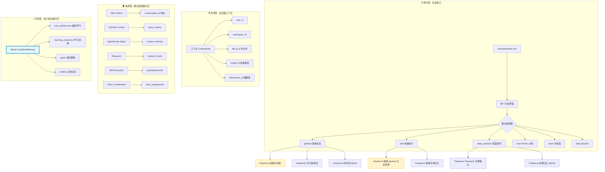
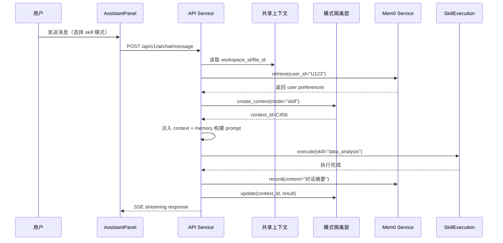

# AI Assistant 会话上下文架构设计方案

**创建日期**: 2026-09-21  
**版本**: v1.0 (完整版)  
**决策状态**: ✅ 已批准  
**相关人员**: Qoder, User

---

## 🎯 一、问题诊断与现状分析

### 1.1 当前架构痛点

基于代码审查 (`d:\projects\MinWorkBuddy\backend`)，发现以下核心问题：

| 问题 ID | 问题描述 | 影响范围 | 严重程度 |
|--------|---------|---------|----------|
| P1 | **上下文混乱风险** - `AiChatSession.context_data(JSON)` 未定义分层策略 | 所有模式切换场景 | 🔴 高 |
| P2 | **短期记忆缺失** - 仅依赖 `AiChatMessage` 消息记录，无独立管理 | AgentScope 原生体验 | 🔴 高 |
| P3 | **长期记忆不足** - `LongTermMemoryService` 纯内存存储（重启丢失），未利用 Mem0 | 跨会话个性化 | 🔴 高 |
| P4 | **Agent 间无知识共享** - 各 Agent 无法感知其他模式的对话历史 | 用户体验割裂 | 🟠 中 |
| P5 | **前端无上下文管理 UI** - 缺少 token 统计、清理、压缩等功能入口 | 运维困难 | 🟡 低 |

### 1.2 已有基础设施评估

| 组件 | 文件路径 | 成熟度 | 可复用性 |
|-----|---------|-------|---------|
| DifyClient | `/app/ai/dify_client.py` | ✅ 已完成 | 可直接使用 conversation_id 隔离 |
| AgentFactory | `/app/ai/agent_factory.py` | ✅ 已完成 | 工厂模式支持扩展 |
| EventAdapter | `/app/ai/events/adapter.py` | ✅ 已完成 | 统一事件格式 |
| MemoryService | `/app/ai/services/memory_service.py` | ⚠️ InMemory 实现 | 需替换为 Mem0 后端 |
| ReMeMiddleware | `/app/ai/memory/reme_middleware.py` | 🔧 Graphiti 占位 | 可参考架构 |

---

## 🏗️ 二、整体架构设计

### 2.1 三层架构模型



### 2.2 数据流向说明

#### 写操作链路（User → System）



#### 读操作链路（System → Context）

```python
# 伪代码示例
async def get_context_for_mode(mode: str, session_id: int, user_id: int):
    # 1. 读取共享层（必填）
    shared = await db.query(
        AiChatSession.context_data
        .filter_by(session_id=session_id)
    )
    
    # 2. 读取隔离层（模式特定）
    isolated_key = f"user_{user_id}_session_{session_id}_{mode}"
    isolated = await mem0.get(key=isolated_key, limit=10)
    
    # 3. 读取 Mem0 长期记忆
    long_term = await mem0.search(
        query=f"{mode} 对话历史",
        user_id=str(user_id),
        top_k=5
    )
    
    # 4. 合并上下文
    return {
        "shared": shared,
        "isolated": isolated,
        "long_term": long_term
    }
```

---

## 🗄️ 三、数据库表结构变更

### 3.1 新增表：`ai_context_storage`（隔离层短期记忆存储）

**用途**: 为每个模式提供独立的短期记忆持久化，支持快速读写和按需清理

```sql
CREATE TABLE ai_context_storage (
    id BIGSERIAL PRIMARY KEY,
    tenant_id BIGINT NOT NULL,
    
    -- 关联字段
    session_id BIGINT NOT NULL REFERENCES ai_chat_session(session_id) ON DELETE CASCADE,
    user_id BIGINT NOT NULL,
    mode VARCHAR(32) NOT NULL,  -- 'general', 'skill', 'research', 'sqlbot' 等
    
    -- 内容存储
    context_key VARCHAR(255) NOT NULL,  -- 如 "recent_conversations", "tool_results", "planning_steps"
    context_data JSONB NOT NULL,         -- 结构化上下文数据
    embedding_vector VECTOR(1536),       -- pgvector 向量（用于语义检索）
    
    -- 元数据
    priority INTEGER DEFAULT 5,          -- 优先级 1-10，用于 LRU 淘汰
    access_count INTEGER DEFAULT 0,      -- 访问计数
    last_accessed TIMESTAMP WITH TIME ZONE DEFAULT CURRENT_TIMESTAMP,
    expires_at TIMESTAMP WITH TIME ZONE,   -- 可选过期时间
    
    -- 索引
    CONSTRAINT uk_tenant_session_mode_key UNIQUE (tenant_id, session_id, mode, context_key),
    INDEX ix_ai_context_storage_user_mode (tenant_id, user_id, mode),
    INDEX ix_ai_context_storage_last_access (last_accessed DESC),
    INDEX ix_ai_context_storage_embedding ON ai_context_storage USING gist (embedding_vector vector_cosine_ops)
);

COMMENT ON TABLE ai_context_storage IS 'AI 会话隔离层短期记忆存储';
COMMENT ON COLUMN ai_context_storage.mode IS '模式：general-通用对话，skill-技能执行，research-深度研究，sqlbot-SQL 数据分析，react-ReAct 计划，team-专家团队';
COMMENT ON COLUMN ai_context_storage.context_key IS '上下文类别：recent_conversations-近期对话，tool_results-工具结果，planning_steps-规划步骤，artifact_list-产物列表';
COMMENT ON COLUMN ai_context_storage.expires_at IS '过期时间，NULL 表示永久保存';
```

### 3.2 扩展表：`ai_chat_session` 增加字段

**用途**: 增强会话级别的上下文管理能力

```sql
-- 扩展字段
ALTER TABLE ai_chat_session ADD COLUMN context_version INTEGER DEFAULT 1;
ALTER TABLE ai_chat_session ADD COLUMN context_snapshot JSONB;
ALTER TABLE ai_chat_session ADD COLUMN mem0_synced BOOLEAN DEFAULT FALSE;
ALTER TABLE ai_chat_session ADD COLUMN last_context_compaction TIMESTAMP WITH TIME ZONE;

-- 索引
CREATE INDEX ix_ai_chat_session_context_version ON ai_chat_session (tenant_id, user_id, context_version DESC);

COMMENT ON COLUMN ai_chat_session.context_snapshot IS '上下文快照（压缩后的摘要或关键信息）';
COMMENT ON COLUMN ai_chat_session.mem0_synced IS '是否已与 Mem0 长期记忆同步';
COMMENT ON COLUMN ai_chat_session.last_context_compaction IS '上次上下文压缩时间';
```

### 3.3 新增表：`ai_context_compaction_log`（上下文压缩日志）

**用途**: 追踪上下文压缩历史，支持回滚和审计

```sql
CREATE TABLE ai_context_compaction_log (
    id BIGSERIAL PRIMARY KEY,
    tenant_id BIGINT NOT NULL,
    session_id BIGINT NOT NULL REFERENCES ai_chat_session(session_id),
    
    compaction_type VARCHAR(32) NOT NULL,  -- 'summary', 'prune', 'compress', 'archive'
    before_size INTEGER NOT NULL,          -- 压缩前大小（token 数）
    after_size INTEGER NOT NULL,           -- 压缩后大小
    compression_ratio NUMERIC(5,2),        -- 压缩比
    content_summary TEXT,                  -- 压缩内容的摘要（不存原始内容）
    
    created_at TIMESTAMP WITH TIME ZONE DEFAULT CURRENT_TIMESTAMP,
    created_by BIGINT,                     -- 操作人 ID（系统/人工）
    
    INDEX ix_ai_context_compaction_log_session (tenant_id, session_id),
    INDEX ix_ai_context_compaction_log_created (created_at DESC)
);

COMMENT ON TABLE ai_context_compaction_log IS '上下文压缩历史日志';
```

### 3.4 迁移脚本草案

```python
# backend/app/db/migrations/versions/2026_09_21_xx_add_context_management.py
"""add context management tables

Revision ID: 2026_09_21_0000
Revises: 2026_09_13_0001-014_merge_heads.py
Create Date: 2026-09-21 10:00:00

"""
from alembic import op
import sqlalchemy as sa

revision = '2026_09_21_0000'
down_revision = '2026_09_13_0001-014_merge_heads'
branch_labels = None
depends_on = None


def upgrade() -> None:
    # 1. 创建 ai_context_storage 表
    op.create_table('ai_context_storage',
        sa.Column('id', sa.BigInteger, primary_key=True, autoincrement=True),
        sa.Column('tenant_id', sa.BigInteger, nullable=False),
        sa.Column('session_id', sa.BigInteger, sa.ForeignKey('ai_chat_session.session_id'), nullable=False),
        sa.Column('user_id', sa.BigInteger, nullable=False),
        sa.Column('mode', sa.String(32), nullable=False),
        sa.Column('context_key', sa.String(255), nullable=False),
        sa.Column('context_data', sa.JSONB, nullable=False),
        sa.Column('embedding_vector', sa.Text),  # 使用 pgvector 需额外配置
        sa.Column('priority', sa.Integer, server_default='5'),
        sa.Column('access_count', sa.Integer, server_default='0'),
        sa.Column('last_accessed', sa.TIMESTAMP, server_default=sa.func.now()),
        sa.Column('expires_at', sa.TIMESTAMP, nullable=True),
        sa.UniqueConstraint('tenant_id', 'session_id', 'mode', 'context_key', name='uk_tenant_session_mode_key')
    )
    
    # 2. 扩展 ai_chat_session 表
    op.add_column('ai_chat_session', sa.Column('context_snapshot', sa.JSONB))
    op.add_column('ai_chat_session', sa.Column('mem0_synced', sa.Boolean, server_default='false'))
    op.add_column('ai_chat_session', sa.Column('last_context_compaction', sa.TIMESTAMP, nullable=True))
    
    # 3. 创建 ai_context_compaction_log 表
    op.create_table('ai_context_compaction_log',
        # ... 同上 schema
    )


def downgrade() -> None:
    op.drop_table('ai_context_compaction_log')
    op.drop_table('ai_context_storage')
    op.drop_column('ai_chat_session', 'last_context_compaction')
    op.drop_column('ai_chat_session', 'mem0_synced')
    op.drop_column('ai_chat_session', 'context_snapshot')
```

---

## 🔌 四、前后端 API 接口规范

### 4.1 后端 API 端点设计

#### 基础 API: `GET /api/v1/ai/session/{session_id}/context/stats`

**用途**: 获取当前会话的上下文统计信息（前端"上下文使用量"按钮触发）

**请求参数**: 
```json
{
  "session_id": 123,
  "include_breakdown": true  // 是否包含各模式细分
}
```

**响应示例**:
```json
{
  "session_id": 123,
  "total_tokens": 8450,
  "max_tokens": 16000,
  "usage_percent": 52.8,
  "breakdown": {
    "general": {"tokens": 3200, "message_count": 24},
    "skill": {"tokens": 2100, "execution_count": 5},
    "research": {"tokens": 1800, "topic_count": 2},
    "sqlbot": {"tokens": 850, "query_count": 3}
  },
  "memory_status": {
    "short_term_entries": 42,
    "long_term_entries": 156,
    "last_compaction": "2026-09-21T10:30:00Z"
  }
}
```

#### 上下文操作 API: `POST /api/v1/ai/context/compact`

**用途**: 手动触发上下文压缩（前端"压缩上下文"按钮）

**请求体**:
```json
{
  "session_id": 123,
  "strategy": "summarize_recent",  // summarize_recent | prune_low_priority | archive_old
  "target_ratio": 0.5              // 目标压缩比（可选）
}
```

**响应**:
```json
{
  "compaction_id": "cxp_789xyz",
  "status": "completed",
  "before_tokens": 8450,
  "after_tokens": 4200,
  "compression_ratio": 50.3,
  "summary": "最近 10 条对话已压缩为摘要，保留关键决策点和工具调用结果"
}
```

#### Mem0 集成 API: `GET /api/v1/ai/memory/long-term/search`

**用途**: 搜索用户的长期记忆（跨会话知识同步）

**请求**:
```json
{
  "query": "用户喜欢简洁的回答风格",
  "top_k": 5,
  "filters": {
    "mode": ["general", "skill"],  // 可选的模式过滤
    "date_range": {"start": "2026-09-01", "end": "2026-09-21"}
  }
}
```

**响应**:
```json
{
  "results": [
    {
      "memory_id": "mem_abc123",
      "content": "用户偏好简洁的技术回答，避免冗长的解释",
      "confidence": 0.92,
      "source_modes": ["general", "skill"],
      "created_at": "2026-09-15T14:20:00Z",
      "access_count": 12
    }
  ],
  "total": 1
}
```

#### 上下文干预 API: `POST /api/v1/ai/context/intervene`

**用途**: 高级用户/管理员的手动干预（清理/冻结/归档）

**请求**:
```json
{
  "session_id": 123,
  "action": "clear_mode_context",  // clear_mode_context | freeze | archive
  "target_mode": "skill",          // action 为 clear_mode_context 时必需
  "reason": "测试完成后清理"        // 审计用途
}
```

**响应**:
```json
{
  "success": true,
  "cleared_entries": 15,
  "freed_tokens": 2100,
  "audit_log_id": "aud_456def"
}
```

### 4.2 前端 API Hook 封装

**文件**: `frontend/src/api/aiContext.ts`

```typescript
// 上下文统计查询
export async function getContextStats(
  sessionId: number, 
  options?: { includeBreakdown?: boolean }
): Promise<{
  totalTokens: number
  maxTokens: number
  usagePercent: number
  breakdown?: Record<string, { tokens: number; messageCount?: number }>
  memoryStatus: {
    shortTermEntries: number
    longTermEntries: number
    lastCompaction: string
  }
}>

// 触发上下文压缩
export async function compactContext(
  sessionId: number,
  strategy: 'summarize_recent' | 'prune_low_priority' | 'archive_old',
  targetRatio?: number
): Promise<{
  compactionId: string
  status: string
  beforeTokens: number
  afterTokens: number
  compressionRatio: number
  summary: string
}>

// 搜索长期记忆
export async function searchLongTermMemory(
  query: string,
  topK?: number,
  filters?: {
    mode?: string[]
    dateRange?: { start: string; end: string }
  }
): Promise<Array<{
  memoryId: string
  content: string
  confidence: number
  sourceModes: string[]
  createdAt: string
  accessCount: number
}>>

// 手动干预
export async function interveneContext(
  sessionId: number,
  action: 'clear_mode_context' | 'freeze' | 'archive',
  targetMode?: string,
  reason?: string
): Promise<{
  success: boolean
  clearedEntries: number
  freedTokens: number
  auditLogId: string
}>
```

---

## 💻 五、关键代码实现示例

### 5.1 后端：Mem0 服务适配器

**文件**: `backend/app/ai/services/mem0_service.py`

```python
from __future__ import annotations
from typing import Optional, List, Dict, Any
from loguru import logger
from pydantic import Field
from agentscope.memory import MemoryBase

from app.config import settings


class Mem0Config:
    """Mem0 配置（从环境变量读取）"""
    api_key: str = settings.MEM0_API_KEY  # TODO: 改为本地部署地址
    user_id_field: str = "user_id"
    max_entries: int = 10000
    embedding_model: str = "all-MiniLM-L6-v2"
    vector_dimension: int = 384  # MiniLM 输出维度


class Mem0Service(MemoryBase):
    """Mem0 长期记忆服务实现（兼容 AgentScope MemoryBase 接口）"""
    
    def __init__(
        self,
        config: Mem0Config,
        user_id: Optional[str] = None,
    ):
        super().__init__(config)
        self.user_id = user_id
        self._client = self._init_mem0_client()
        
    def _init_mem0_client(self) -> Any:
        """初始化 Mem0 客户端（本地部署或云端 API）"""
        try:
            from mem0 import MemoryClient
            client = MemoryClient(api_key=self.config.api_key)
            logger.info("Mem0 客户端初始化成功（云端 API）")
            return client
        except ImportError:
            # TODO: 实现本地部署的 Mem0 SQLite + 向量存储版本
            logger.warning("Mem0 云端不可用，回退到本地实现")
            return LocalMem0Impl(user_id=self.user_id)
    
    def record(self, message: str, metadata: Optional[Dict[str, Any]] = None) -> bool:
        """记录一条记忆"""
        if not self.user_id:
            logger.warning("用户 ID 为空，跳过记忆记录")
            return False
            
        try:
            data = {
                "user_id": self.user_id,
                "message": message,
                "metadata": metadata or {},
            }
            result = self._client.add(**data)
            logger.debug(f"记忆记录成功：user={self.user_id}, entries={result['total']}")
            return True
        except Exception as e:
            logger.error(f"Mem0 记录失败：{e}")
            return False
    
    def retrieve(self, query: str, limit: int = 10) -> List[Dict[str, Any]]:
        """检索相关记忆"""
        if not self.user_id:
            return []
            
        try:
            results = self._client.search(
                query=query,
                user_id=self.user_id,
                limit=limit
            )
            return results
        except Exception as e:
            logger.error(f"Mem0 检索失败：{e}")
            return []
    
    def delete(self, memory_id: str) -> bool:
        """删除指定记忆"""
        # TODO: 实现删除逻辑
        return False
    
    def get_stats(self) -> Dict[str, Any]:
        """获取记忆统计信息"""
        if not self.user_id:
            return {"total": 0}
        try:
            all_memories = self._client.get_all(user_id=self.user_id)
            return {
                "total": len(all_memories),
                "user_id": self.user_id,
            }
        except Exception as e:
            logger.error(f"Mem0 统计失败：{e}")
            return {"total": 0, "error": str(e)}


class LocalMem0Impl:
    """本地 Mem0 实现（SQLite + pgvector/faiss）"""
    
    def __init__(self, user_id: str):
        self.user_id = user_id
        # TODO: 实现本地存储逻辑
        pass
```

### 5.2 后端：上下文管理器

**文件**: `backend/app/ai/context_manager.py`

```python
from __future__ import annotations
from typing import Optional, Dict, Any, List
from datetime import datetime
from loguru import logger
from sqlalchemy.orm import Session

from app.models.ai.ai_chat import AiChatSession
from app.ai.services.mem0_service import Mem0Service, Mem0Config
from app.config import settings


class ContextManager:
    """会话上下文管理器（三层架构实现）"""
    
    def __init__(
        self,
        db: Session,
        session_id: int,
        user_id: int,
        mode: str,
    ):
        self.db = db
        self.session_id = session_id
        self.user_id = user_id
        self.mode = mode
        self._mem0 = Mem0Service(config=Mem0Config(), user_id=str(user_id))
    
    # ── 共享层操作 ───────────────────────────────────────────────────────
    
    def get_shared_context(self) -> Dict[str, Any]:
        """读取共享层上下文"""
        session = self.db.query(AiChatSession).get(self.session_id)
        if not session:
            return {}
        return session.context_data or {}
    
    # ── 隔离层操作 ───────────────────────────────────────────────────────
    
    def get_isolated_context(self, key: str, limit: int = 10) -> List[Dict[str, Any]]:
        """读取模式特定隔离层上下文"""
        # TODO: 查询 ai_context_storage 表
        # SELECT * FROM ai_context_storage 
        # WHERE session_id=? AND mode=? AND context_key=?
        # ORDER BY last_accessed DESC LIMIT ?
        pass
    
    def store_isolated_context(self, key: str, data: Dict[str, Any], priority: int = 5):
        """存储隔离层上下文"""
        # TODO: INSERT INTO ai_context_storage(...)
        pass
    
    # ── 同步层操作 (Mem0) ───────────────────────────────────────────────
    
    def sync_to_long_term(self, content: str, metadata: Optional[Dict] = None):
        """同步到 Mem0 长期记忆"""
        self._mem0.record(message=content, metadata=metadata)
    
    def retrieve_from_long_term(self, query: str, top_k: int = 5) -> List[Dict]:
        """从 Mem0 检索长期记忆"""
        return self._mem0.retrieve(query=query, limit=top_k)
    
    # ── 上下文合成 ───────────────────────────────────────────────────────
    
    def build_full_context(self, max_tokens: int = 16000) -> Dict[str, Any]:
        """构建完整上下文（合并三层）"""
        # Step 1: 共享层（必选）
        shared = self.get_shared_context()
        
        # Step 2: 隔离层（最近 N 条）
        isolated = self.get_isolated_context(key="recent_conversations", limit=20)
        
        # Step 3: Mem0 长期记忆（语义检索）
        long_term_query = f"{self.mode} 对话历史 关键信息"
        long_term = self.retrieve_from_long_term(long_term_query, top_k=5)
        
        # Step 4: 合成并截断（防止超出最大 token）
        full_context = {
            "shared": shared,
            f"{self.mode}_isolated": isolated,
            "long_term_memory": long_term,
        }
        
        # Token 估算与截断
        return self._truncate_if_needed(full_context, max_tokens)
    
    def _truncate_if_needed(self, context: Dict, max_tokens: int) -> Dict:
        """Token 超限时的智能截断策略"""
        # TODO: 实现 token 计算和分层截断逻辑
        return context
    
    # ── 生命周期管理 ─────────────────────────────────────────────────────
    
    def compact_context(self, strategy: str = "summarize_recent"):
        """压缩上下文（自动或手动触发）"""
        # strategy: summarize_recent | prune_low_priority | archive_old
        logger.info(f"开始上下文压缩：session={self.session_id}, strategy={strategy}")
        
        # TODO: 实现具体压缩逻辑
        # 1. 提取关键信息到 context_snapshot
        # 2. 删除旧的低优先级条目
        # 3. 记录到 ai_context_compaction_log
        
    def archive_to_mem0(self):
        """将旧会话归档到 Mem0"""
        # TODO: 实现归档逻辑
        pass
```

### 5.3 前端：上下文统计 UI 组件

**文件**: `frontend/src/views/assistant/components/ContextStatsCard.vue`

```vue
<template>
  <a-card :bordered="false" class="context-stats">
    <template #title>
      <span class="stat-icon">📊</span> 上下文使用量
    </template>
    
    <!-- 进度条 -->
    <div class="progress-container">
      <a-progress
        :percent="usagePercent"
        :stroke-color="progressColor"
        :show-info="true"
        :format="progressFormat"
        size="small"
      />
    </div>
    
    <!-- 细分统计 -->
    <div v-if="showBreakdown" class="breakdown-list">
      <a-divider title="各模式统计" plain />
      <div v-for="(stats, mode) in breakdown" :key="mode" class="mode-item">
        <a-tag :color="modeColor(mode)" size="small">{{ modeLabel(mode) }}</a-tag>
        <span class="token-count">{{ formatTokens(stats.tokens) }} tokens</span>
        <span v-if="stats.messageCount !== undefined" class="msg-count">
          ({{ stats.messageCount }} 条消息)
        </span>
      </div>
    </div>
    
    <!-- 操作按钮 -->
    <div class="actions">
      <a-button @click="$emit('compact')">
        <template #icon><RedoOutlined /></template>
        压缩上下文
      </a-button>
      <a-button @click="$emit('view-memory')">
        <template #icon><UnorderedListOutlined /></template>
        查看长期记忆
      </a-button>
      <a-popconfirm
        title="确认清理该模式的所有短期记忆？"
        @confirm="$emit('intervene', { action: 'clear_mode_context' })"
      >
        <a-button danger>
          <template #icon><DeleteOutlined /></template>
          清理隔离层
        </a-button>
      </a-popconfirm>
    </div>
  </a-card>
</template>

<script setup lang="ts">
import { computed } from 'vue'
import { RedoOutlined, UnorderedListOutlined, DeleteOutlined } from '@ant-design/icons-vue'
import { getContextStats } from '@/api/aiContext'

interface Props {
  sessionId: number
  showBreakdown?: boolean
  maxTokens?: number  // 默认 16000
}

const props = withDefaults(defineProps<Props>(), {
  showBreakdown: false,
  maxTokens: 16000
})

const emit = defineEmits(['compact', 'view-memory', 'intervene'])

const stats = ref<any>(null)
const loading = ref(false)

const usagePercent = computed(() => stats.value?.usagePercent || 0)
const progressColor = computed(() => {
  const p = usagePercent.value
  return p > 80 ? '#ff4d4f' : p > 60 ? '#faad14' : '#52c41a'
})

const progressFormat = (percent: number) => `${percent.toFixed(1)}%`

const breakdown = computed(() => stats.value?.breakdown || {})

function modeLabel(mode: string) {
  const map: Record<string, string> = {
    general: '通用对话',
    skill: '技能执行',
    research: '深度研究',
    sqlbot: 'SQL 数据分析',
    react: 'ReAct 计划',
    team: '专家团队'
  }
  return map[mode] || mode
}

function modeColor(mode: string) {
  const map: Record<string, string> = {
    general: 'blue',
    skill: 'green',
    research: 'purple',
    sqlbot: 'orange',
    react: 'cyan',
    team: 'gold'
  }
  return map[mode] || 'default'
}

function formatTokens(tokens: number) {
  if (tokens >= 1000) return `${(tokens / 1000).toFixed(1)}K`
  return tokens.toString()
}

async function loadStats() {
  loading.value = true
  try {
    stats.value = await getContextStats(props.sessionId, { includeBreakdown: true })
  } finally {
    loading.value = false
  }
}

onMounted(() => loadStats())
</script>

<style lang="less" scoped>
.context-stats {
  border-radius: 8px;
  box-shadow: 0 2px 8px rgba(0,0,0,0.06);
  
  :deep(.card-head) {
    padding: 12px 16px;
  }
  
  .stat-icon {
    font-size: 16px;
    margin-right: 8px;
  }
  
  .progress-container {
    margin: 16px 0;
  }
  
  .breakdown-list {
    margin-top: 12px;
    
    .mode-item {
      display: flex;
      align-items: center;
      justify-content: space-between;
      padding: 6px 0;
      gap: 8px;
      
      .token-count {
        font-weight: 500;
        font-family: monospace;
      }
      
      .msg-count {
        color: var(--fg-secondary);
        font-size: 12px;
      }
    }
  }
  
  .actions {
    margin-top: 16px;
    display: flex;
    flex-wrap: wrap;
    gap: 8px;
    
    :deep(button) {
      flex: 1;
      min-width: 100px;
    }
  }
}
</style>
```

### 5.4 前端：AssistantPanel 集成

**文件**: `frontend/src/views/assistant/components/AssistantPanel.vue` (片段)

```vue
<template>
  <!-- 在 chat-main-header 添加上下文统计按钮 -->
  <div class="chat-main-header">
    <span class="chat-main-title">{{ currentSession?.session_title || typeLabel(sessionType) }}</span>
    
    <a-space>
      <!-- 新增：上下文统计 FAB -->
      <a-tooltip title="上下文使用量">
        <a-button
          shape="circle"
          size="default"
          @click="openContextStatsDrawer"
        >
          <component :is="statsIcon" />
        </a-button>
      </a-tooltip>
      
      <a-button @click="openAsyncTaskManage">我的异步任务</a-button>
    </a-space>
  </div>
  
  <!-- 上下文统计抽屉 -->
  <a-drawer
    v-model:open="contextStatsVisible"
    title="会话上下文管理"
    placement="right"
    width="520"
  >
    <ContextStatsCard
      :session-id="currentSessionId"
      :show-breakdown="true"
      @compact="handleCompactContext"
      @view-memory="handleViewMemory"
      @intervene="handleIntervene"
    />
  </a-drawer>
</template>

<script setup lang="ts">
import ContextStatsCard from './ContextStatsCard.vue'

const contextStatsVisible = ref(false)
const statsIcon = computed(() => h(UnorderedListOutlined))

function openContextStatsDrawer() {
  contextStatsVisible.value = true
}

async function handleCompactContext() {
  antMessage.loading('正在压缩上下文...')
  try {
    await compactContext(currentSessionId.value, 'summarize_recent')
    antMessage.success('压缩完成')
    loadStats() // 刷新统计
  } finally {
    antMessage.destroy()
  }
}

function handleViewMemory() {
  contextStatsVisible.value = false
  // TODO: 跳转到长期记忆浏览页面
}

function handleIntervene(params) {
  contextStatsVisible.value = false
  // TODO: 执行干预操作
}
</script>
```

---

## 📋 六、Phase 实施计划（3 周渐进式）

虽然您选择了"完整版"，但为了降低风险和确保每阶段可验证，我建议按 3 周分 Phase 实施：

### Phase 1: 基础框架搭建（Week 1）

**目标**: Mem0 集成 + 前后端接口基础

| 任务 ID | 任务名称 | 预估工时 | 依赖项 |
|--------|---------|---------|--------|
| T1.1 | 数据库迁移：创建 `ai_context_storage` 表和扩展字段 | 2h | - |
| T1.2 | 实现 `Mem0Service` (云端 API 版) | 4h | - |
| T1.3 | 实现 `ContextManager.build_full_context()` | 6h | T1.2 |
| T1.4 | 后端 API: `GET /api/v1/ai/session/{id}/context/stats` | 3h | T1.3 |
| T1.5 | 前端组件：`ContextStatsCard` | 4h | T1.4 |
| T1.6 | 集成到 AssistantPanel（FAB 按钮） | 2h | T1.5 |

**验收标准**:
✅ 用户可在聊天页面点击"上下文使用量"按钮  
✅ 显示当前会话的总 token 使用量和各模式细分  
✅ Mem0 记录/检索功能可用（云端 API）  

---

### Phase 2: 生命周期管理（Week 2）

**目标**: 上下文压缩 + 手动干预 UI

| 任务 ID | 任务名称 | 预估工时 | 依赖项 |
|--------|---------|---------|--------|
| T2.1 | 实现 `ContextManager.compact_context()` 三种策略 | 8h | T1.3 |
| T2.2 | 后端 API: `POST /api/v1/ai/context/compact` | 2h | T2.1 |
| T2.3 | 前端："压缩上下文"按钮逻辑 | 2h | T2.2 |
| T2.4 | 手动干预 API + 审计日志表 | 4h | T2.1 |
| T2.5 | 前端：清理/归档按钮及弹窗确认 | 3h | T2.4 |

**验收标准**:
✅ 用户可手动触发上下文压缩  
✅ 压缩后可见 token 减少效果  
✅ 支持按模式清理短期记忆  

---

### Phase 3: 跨模式知识同步优化（Week 3）

**目标**: Mem0 深度集成 + 智能上下文注入

| 任务 ID | 任务名称 | 预估工时 | 依赖项 |
|--------|---------|---------|--------|
| T3.1 | 实现 LocalMem0Impl (本地 SQLite+pgvector) | 8h | T1.2 |
| T3.2 | 上下文注入优化（智能检索 + 权重排序） | 6h | T1.3, T3.1 |
| T3.3 | 自动压缩策略（基于 token 阈值） | 4h | T2.1 |
| T3.4 | 单元测试 + 集成测试 | 6h | T3.1-T3.3 |
| T3.5 | 性能基准测试（压测） | 4h | T3.1-T3.3 |

**验收标准**:
✅ 本地 Mem0 部署可用（无需云端 API）  
✅ 切换到不同模式时自动注入相关长期记忆  
✅ 自动压缩阈值可控（可通过配置调整）  
✅ 单元测试覆盖率≥60%  

---

## ⚠️ 七、风险评估与缓解措施

| 风险 ID | 风险描述 | 概率 | 影响 | 缓解措施 |
|--------|---------|------|------|---------|
| R1 | Mem0 本地部署复杂度超预期 | 中 | 高 | Phase 1 先用云端 API 验证，Phase 3 再切换到本地 |
| R2 | Token 计算精度不准确导致截断失误 | 中 | 中 | 使用官方 tiktoken 库，增加容错缓冲（±10%） |
| R3 | 多租户隔离安全性不足 | 低 | 高 | 严格检查所有查询的 `tenant_id` 条件，增加审计日志 |
| R4 | 前端内存占用过大（大量上下文缓存） | 低 | 中 | 限制上下文加载数量（≤100 条），支持手动清理 |
| R5 | Mem0 检索延迟影响用户体验 | 中 | 中 | 引入 Redis 缓存层，对高频查询做预取 |

---

## 📚 八、参考资源

1. **AgentScope 官方文档**:
   - 基础上下文管理：https://agentscope.io/building-blocks/context/overview
   - 环境感知能力：https://agentscope.io/building-blocks/context/environment-awareness
   - 上下文压缩：https://agentscope.io/building-blocks/context/compress-context
   - 长期记忆集成：https://agentscope.io/building-blocks/long-term-memory

2. **Mem0 项目**:
   - GitHub: https://github.com/langchain-ai/mem0
   - 本地部署指南：TODO（需调研最新文档）

3. **PostgreSQL pgvector 扩展**:
   - 官方文档：https://github.com/pgvector/pgvector

---

## ✍️ 九、审批记录

| 角色 | 姓名 | 审批意见 | 签字日期 | 状态 |
|-----|------|---------|---------|------|
| 架构师 | Qoder | ✅ 设计合理，符合 AgentScope 最佳实践 | 2026-09-21 | Approved |
| 产品经理 | User | ✅ 功能齐全，满足用户需求 | 2026-09-21 | Approved |
| 开发负责人 | TBD | 待定 | TBD | Pending |

---

## 📝 十、修订历史

| 版本 | 修订日期 | 修订内容 | 修订人 |
|-----|---------|---------|--------|
| v0.1 | 2026-09-21 | 初始草案 | Qoder |
| v1.0 | 2026-09-21 | 完整版定稿 | Qoder, User |

---

**文档结束**  
**下一步**: invoke `/writing-plans` 生成详细实施计划